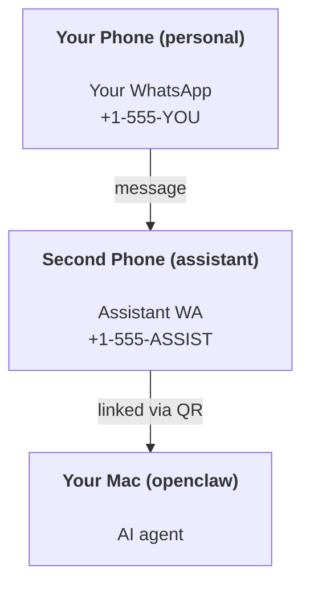

---
read_when:
    - Incorporación de una nueva instancia de asistente
    - Revisando las implicaciones de seguridad y permisos
summary: Guía integral para ejecutar OpenClaw como asistente personal con advertencias de seguridad
title: Configuración del asistente personal
x-i18n:
    generated_at: "2026-07-05T11:47:03Z"
    model: gpt-5.5
    postprocess_version: locale-links-v1
    provider: openai
    source_hash: 57c515fa414d579850e008aaa60ddb5243a1237b205be111187907dd905be9cb
    source_path: start/openclaw.md
    workflow: 16
---

OpenClaw es un Gateway autoalojado que conecta Discord, Google Chat, iMessage, Matrix, Microsoft Teams, Signal, Slack, Telegram, WhatsApp, Zalo y más con agentes de IA. Esta guía cubre la configuración de "asistente personal": un número de WhatsApp dedicado que se comporta como tu asistente de IA siempre activo.

## Primero, seguridad

Dar un canal a un agente lo coloca en posición de ejecutar comandos en tu máquina (según tu política de herramientas), leer/escribir archivos en tu espacio de trabajo y enviar mensajes de vuelta por cualquier canal conectado. Empieza de forma conservadora:

- Configura siempre `channels.whatsapp.allowFrom` (nunca lo ejecutes abierto a todo el mundo en tu Mac personal).
- Usa un número de WhatsApp dedicado para el asistente.
- Los Heartbeats se ejecutan de forma predeterminada cada 30 minutos. Desactívalos hasta que confíes en la configuración estableciendo `agents.defaults.heartbeat.every: "0m"`.

## Requisitos previos

- OpenClaw instalado e incorporado; consulta [Primeros pasos](/es/start/getting-started) si aún no lo has hecho
- Un segundo número de teléfono (SIM/eSIM/prepago) para el asistente

## La configuración con dos teléfonos (recomendada)

Quieres esto:



Si vinculas tu WhatsApp personal a OpenClaw, cada mensaje que recibas se convierte en "entrada del agente". Eso rara vez es lo que quieres.

## Inicio rápido en 5 minutos

1. Empareja WhatsApp Web (muestra un QR; escanéalo con el teléfono del asistente):

```bash
openclaw channels login
```

2. Inicia el Gateway (déjalo en ejecución):

```bash
openclaw gateway --port 18789
```

3. Coloca una configuración mínima en `~/.openclaw/openclaw.json`:

```json5
{
  gateway: { mode: "local" },
  channels: { whatsapp: { allowFrom: ["+15555550123"] } },
}
```

Ahora envía un mensaje al número del asistente desde tu teléfono incluido en la lista de permitidos.

Cuando termina la incorporación, OpenClaw abre automáticamente el panel e imprime un enlace limpio (sin token). Si el panel solicita autenticación, pega el secreto compartido configurado en los ajustes de Control UI. La incorporación usa un token de forma predeterminada (`gateway.auth.token`), pero la autenticación por contraseña también funciona si cambiaste `gateway.auth.mode` a `password`. Para volver a abrirlo más tarde: `openclaw dashboard`.

## Dale al agente un espacio de trabajo (AGENTS)

OpenClaw lee instrucciones de operación y "memoria" desde su directorio de espacio de trabajo.

De forma predeterminada, OpenClaw usa `~/.openclaw/workspace` como espacio de trabajo del agente y lo crea (junto con los archivos iniciales `AGENTS.md`, `SOUL.md`, `TOOLS.md`, `IDENTITY.md`, `USER.md`, `HEARTBEAT.md`) automáticamente durante la incorporación o la primera ejecución del agente. `BOOTSTRAP.md` solo se crea para un espacio de trabajo completamente nuevo y no debería volver después de que lo elimines. `MEMORY.md` es opcional y nunca se crea automáticamente; cuando está presente, se carga para sesiones normales. Las sesiones de subagente solo inyectan `AGENTS.md` y `TOOLS.md`.

<Tip>
Trata esta carpeta como la memoria de OpenClaw y conviértela en un repositorio git (idealmente privado) para que tus archivos `AGENTS.md` y de memoria tengan copia de seguridad. Si git está instalado, los espacios de trabajo completamente nuevos se inicializan automáticamente con `git init`.
</Tip>

Para crear las carpetas de espacio de trabajo y configuración sin ejecutar el asistente de incorporación completo:

```bash
openclaw setup --baseline
```

(`openclaw setup` sin argumentos es un alias de `openclaw onboard` y ejecuta el asistente interactivo completo.)

Diseño completo del espacio de trabajo + guía de copia de seguridad: [Espacio de trabajo del agente](/es/concepts/agent-workspace)
Flujo de trabajo de memoria: [Memoria](/es/concepts/memory)

Opcional: elige un espacio de trabajo diferente con `agents.defaults.workspace` (admite `~`).

```json5
{
  agents: {
    defaults: {
      workspace: "~/.openclaw/workspace",
    },
  },
}
```

Si ya distribuyes tus propios archivos de espacio de trabajo desde un repositorio, puedes desactivar por completo la creación de archivos de arranque:

```json5
{
  agents: {
    defaults: {
      skipBootstrap: true,
    },
  },
}
```

## La configuración que lo convierte en "un asistente"

OpenClaw usa de forma predeterminada una buena configuración de asistente, pero normalmente querrás ajustar:

- persona/instrucciones en [`SOUL.md`](/es/concepts/soul)
- valores predeterminados de razonamiento (si lo deseas)
- Heartbeats (cuando confíes en él)

Ejemplo:

```json5
{
  logging: { level: "info" },
  agents: {
    defaults: {
      model: { primary: "anthropic/claude-opus-4-8" },
      workspace: "~/.openclaw/workspace",
      thinkingDefault: "high",
      timeoutSeconds: 1800,
      // Start with 0; enable later.
      heartbeat: { every: "0m" },
    },
    list: [
      {
        id: "main",
        default: true,
        groupChat: {
          mentionPatterns: ["@openclaw", "openclaw"],
        },
      },
    ],
  },
  channels: {
    whatsapp: {
      allowFrom: ["+15555550123"],
      groups: {
        "*": { requireMention: true },
      },
    },
  },
  session: {
    scope: "per-sender",
    resetTriggers: ["/new", "/reset"],
    reset: {
      mode: "daily",
      atHour: 4,
      idleMinutes: 10080,
    },
  },
}
```

## Sesiones y memoria

- Archivos de sesión: `~/.openclaw/agents/<agentId>/sessions/{{SessionId}}.jsonl`
- Metadatos de sesión (uso de tokens, última ruta, etc.): `~/.openclaw/agents/<agentId>/sessions/sessions.json`
- `/new` o `/reset` inicia una sesión nueva para ese chat (configurable mediante `session.resetTriggers`). Si se envía solo, OpenClaw confirma el restablecimiento sin invocar el modelo.
- `/compact [instructions]` compacta el contexto de la sesión e informa el presupuesto de contexto restante.

## Heartbeats (modo proactivo)

De forma predeterminada, OpenClaw ejecuta un Heartbeat cada 30 minutos con el prompt:
`Read HEARTBEAT.md if it exists (workspace context). Follow it strictly. Do not infer or repeat old tasks from prior chats. If nothing needs attention, reply HEARTBEAT_OK.`
Establece `agents.defaults.heartbeat.every: "0m"` para desactivarlo.

- Si `HEARTBEAT.md` existe pero está efectivamente vacío (solo líneas en blanco, comentarios Markdown/HTML, encabezados Markdown como `# Heading`, marcadores de bloques delimitados o stubs de listas de comprobación vacías), OpenClaw omite la ejecución del Heartbeat para ahorrar llamadas a la API.
- Si falta el archivo, el Heartbeat se ejecuta de todos modos y el modelo decide qué hacer.
- Si el agente responde con `HEARTBEAT_OK` (opcionalmente con relleno corto; consulta `agents.defaults.heartbeat.ackMaxChars`), OpenClaw suprime la entrega saliente de ese Heartbeat.
- De forma predeterminada, se permite la entrega de Heartbeats a destinos de estilo DM `user:<id>`. Establece `agents.defaults.heartbeat.directPolicy: "block"` para suprimir la entrega a destinos directos mientras mantienes activas las ejecuciones de Heartbeat.
- Los Heartbeats ejecutan turnos completos del agente; intervalos más cortos consumen más tokens.

```json5
{
  agents: {
    defaults: {
      heartbeat: { every: "30m" },
    },
  },
}
```

## Medios de entrada y salida

Los adjuntos entrantes (imágenes/audio/documentos) pueden exponerse a tu comando mediante plantillas:

- `{{MediaPath}}` (ruta de archivo temporal local)
- `{{MediaUrl}}` (pseudo-URL)
- `{{Transcript}}` (si la transcripción de audio está habilitada)

Los adjuntos salientes del agente usan campos de medios estructurados en la herramienta de mensaje o la carga útil de respuesta, como `media`, `mediaUrl`, `mediaUrls`, `path` o `filePath`. Argumentos de ejemplo para la herramienta de mensaje:

```json
{
  "message": "Here's the screenshot.",
  "mediaUrl": "https://example.com/screenshot.png"
}
```

OpenClaw envía medios estructurados junto con el texto. Las respuestas finales heredadas del asistente aún pueden normalizarse por compatibilidad, pero la salida de herramientas, la salida del navegador, los bloques de streaming y las acciones de mensaje no analizan texto como comandos de adjuntos.

El comportamiento de rutas locales sigue el mismo modelo de confianza de lectura de archivos que el agente:

- Si `tools.fs.workspaceOnly` es `true`, las rutas de medios locales salientes permanecen restringidas a la raíz temporal de OpenClaw, la caché de medios, las rutas del espacio de trabajo del agente y los archivos generados por el sandbox.
- Si `tools.fs.workspaceOnly` es `false`, los medios locales salientes pueden usar archivos locales del host que el agente ya tiene permiso para leer.
- Las rutas locales pueden ser absolutas, relativas al espacio de trabajo o relativas al directorio personal con `~/`.
- Los envíos locales del host siguen permitiendo solo medios y tipos de documento seguros (imágenes, audio, video, PDF, documentos de Office y documentos de texto validados como Markdown/MD, TXT, JSON, YAML y YML). Esto es una extensión del límite de confianza existente de lectura del host, no un escáner de secretos: si el agente puede leer un `secret.txt` o `config.json` local del host, puede adjuntar ese archivo cuando la extensión y la validación de contenido coincidan.

Mantén los archivos confidenciales fuera del sistema de archivos legible por el agente, o conserva `tools.fs.workspaceOnly: true` para envíos de rutas locales más estrictos.

## Lista de comprobación de operaciones

```bash
openclaw status          # local status (creds, sessions, queued events)
openclaw status --all    # full diagnosis (read-only, pasteable)
openclaw status --deep   # probe channels (WhatsApp Web + Telegram + Discord + Slack + Signal)
openclaw health --json   # gateway health snapshot over the WS connection
```

Los registros se encuentran en `/tmp/openclaw/` (valor predeterminado: `openclaw-YYYY-MM-DD.log`).

## Próximos pasos

- WebChat: [WebChat](/es/web/webchat)
- Operaciones del Gateway: [Runbook del Gateway](/es/gateway)
- Cron + despertares: [Tareas Cron](/es/automation/cron-jobs)
- Compañero de barra de menús de macOS: [Aplicación macOS de OpenClaw](/es/platforms/macos)
- Aplicación de nodo iOS: [Aplicación iOS](/es/platforms/ios)
- Aplicación de nodo Android: [Aplicación Android](/es/platforms/android)
- Hub de Windows: [Windows](/es/platforms/windows)
- Estado de Linux: [Aplicación Linux](/es/platforms/linux)
- Seguridad: [Seguridad](/es/gateway/security)

## Relacionado

- [Primeros pasos](/es/start/getting-started)
- [Configuración](/es/start/setup)
- [Resumen de canales](/es/channels)
