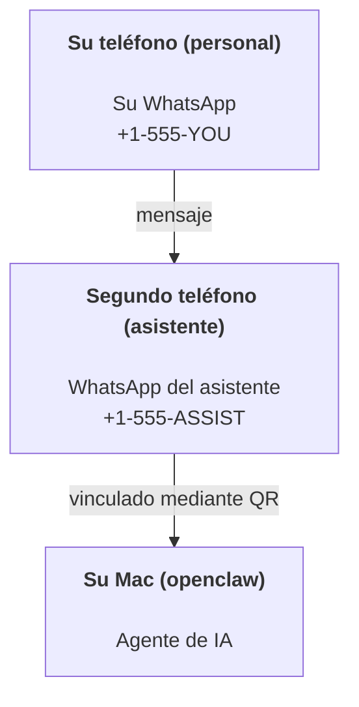

---
read_when:
    - Incorporación de una nueva instancia del asistente
    - Revisión de las implicaciones de seguridad y permisos
summary: Guía integral para ejecutar OpenClaw como asistente personal con precauciones de seguridad
title: Configuración del asistente personal
x-i18n:
    generated_at: "2026-07-12T14:51:13Z"
    model: gpt-5.6
    postprocess_version: locale-links-v1
    prompt_version: 15
    provider: openai
    source_hash: e8c34e31314f55647059fd600935330110add27b338a675bc0ce1529bebb207d
    source_path: start/openclaw.md
    workflow: 16
---

OpenClaw es un Gateway autoalojado que conecta Discord, Google Chat, iMessage, Matrix, Microsoft Teams, Signal, Slack, Telegram, WhatsApp, Zalo y más con agentes de IA. Esta guía explica la configuración de «asistente personal»: un número de WhatsApp dedicado que funciona como un asistente de IA siempre activo.

## La seguridad ante todo

Dar a un agente acceso a un canal lo coloca en posición de ejecutar comandos en la máquina (según la política de herramientas), leer y escribir archivos en el espacio de trabajo y enviar mensajes a través de cualquier canal conectado. Comience con una configuración restrictiva:

- Configure siempre `channels.whatsapp.allowFrom` (nunca permita el acceso público desde el Mac personal).
- Use un número de WhatsApp dedicado para el asistente.
- Los Heartbeat se ejecutan de forma predeterminada cada 30 minutos. Desactívelos hasta que confíe en la configuración estableciendo `agents.defaults.heartbeat.every: "0m"`.

## Requisitos previos

- OpenClaw instalado y configurado inicialmente; consulte [Primeros pasos](/es/start/getting-started) si aún no lo ha hecho
- Un segundo número de teléfono (SIM/eSIM/prepago) para el asistente

## Configuración con dos teléfonos (recomendada)

El objetivo es este:



Si vincula su WhatsApp personal con OpenClaw, cada mensaje que reciba se convertirá en una «entrada del agente». Rara vez es eso lo que se desea.

## Inicio rápido en 5 minutos

1. Vincule WhatsApp Web (se muestra un código QR; escanéelo con el teléfono del asistente):

```bash
openclaw channels login
```

2. Inicie el Gateway (déjelo en ejecución):

```bash
openclaw gateway --port 18789
```

3. Añada una configuración mínima en `~/.openclaw/openclaw.json`:

```json5
{
  gateway: { mode: "local" },
  channels: { whatsapp: { allowFrom: ["+15555550123"] } },
}
```

Ahora envíe un mensaje al número del asistente desde el teléfono incluido en la lista de permitidos.

Cuando finaliza la configuración inicial, OpenClaw abre automáticamente el panel y muestra un enlace limpio (sin token). Si el panel solicita autenticación, pegue el secreto compartido configurado en los ajustes de Control UI. La configuración inicial usa un token de forma predeterminada (`gateway.auth.token`), pero la autenticación mediante contraseña también funciona si ha cambiado `gateway.auth.mode` a `password`. Para volver a abrirlo más adelante: `openclaw dashboard`.

## Asigne un espacio de trabajo al agente (AGENTS)

OpenClaw lee las instrucciones de funcionamiento y la «memoria» desde el directorio de su espacio de trabajo.

De forma predeterminada, OpenClaw usa `~/.openclaw/workspace` como espacio de trabajo del agente y lo crea automáticamente (junto con los archivos iniciales `AGENTS.md`, `SOUL.md`, `TOOLS.md`, `IDENTITY.md`, `USER.md` y `HEARTBEAT.md`) durante la configuración inicial o la primera ejecución del agente. `BOOTSTRAP.md` solo se crea para un espacio de trabajo completamente nuevo y no debe volver a aparecer después de eliminarlo. `MEMORY.md` es opcional y nunca se crea automáticamente; cuando existe, se carga en las sesiones normales. Las sesiones de subagentes solo incorporan `AGENTS.md` y `TOOLS.md`.

<Tip>
Trate esta carpeta como la memoria de OpenClaw y conviértala en un repositorio git (preferiblemente privado) para disponer de copias de seguridad de `AGENTS.md` y de los archivos de memoria. Si git está instalado, los espacios de trabajo completamente nuevos se inicializan automáticamente con `git init`.
</Tip>

Para crear las carpetas del espacio de trabajo y de configuración sin ejecutar el asistente completo de configuración inicial:

```bash
openclaw setup --baseline
```

(`openclaw setup` sin opciones es un alias de `openclaw onboard` y ejecuta el asistente interactivo completo).

Guía completa sobre la estructura del espacio de trabajo y las copias de seguridad: [Espacio de trabajo del agente](/es/concepts/agent-workspace)
Flujo de trabajo de la memoria: [Memoria](/es/concepts/memory)

Opcional: seleccione otro espacio de trabajo mediante `agents.defaults.workspace` (admite `~`).

```json5
{
  agents: {
    defaults: {
      workspace: "~/.openclaw/workspace",
    },
  },
}
```

Si ya distribuye sus propios archivos de espacio de trabajo desde un repositorio, puede desactivar por completo la creación de archivos de arranque:

```json5
{
  agents: {
    defaults: {
      skipBootstrap: true,
    },
  },
}
```

## La configuración que lo convierte en «un asistente»

OpenClaw incluye de forma predeterminada una buena configuración de asistente, pero normalmente conviene ajustar:

- la personalidad y las instrucciones en [`SOUL.md`](/es/concepts/soul)
- los valores predeterminados de razonamiento (si se desea)
- los Heartbeat (cuando ya sea de confianza)

Ejemplo:

```json5
{
  logging: { level: "info" },
  agents: {
    defaults: {
      model: { primary: "anthropic/claude-opus-4-8" },
      workspace: "~/.openclaw/workspace",
      thinkingDefault: "high",
      timeoutSeconds: 1800,
      // Empiece con 0; actívelo más adelante.
      heartbeat: { every: "0m" },
    },
    list: [
      {
        id: "main",
        default: true,
        groupChat: {
          mentionPatterns: ["@openclaw", "openclaw"],
        },
      },
    ],
  },
  channels: {
    whatsapp: {
      allowFrom: ["+15555550123"],
      groups: {
        "*": { requireMention: true },
      },
    },
  },
  session: {
    scope: "per-sender",
    resetTriggers: ["/new", "/reset"],
    reset: {
      mode: "daily",
      atHour: 4,
      idleMinutes: 10080,
    },
  },
}
```

## Sesiones y memoria

- Filas de sesiones, filas de transcripciones y metadatos (uso de tokens, última ruta, etc.): `~/.openclaw/agents/<agentId>/agent/openclaw-agent.sqlite`
- Artefactos de transcripciones heredados/archivados: `~/.openclaw/agents/<agentId>/sessions/`
- Origen de migración de filas heredadas: `~/.openclaw/agents/<agentId>/sessions/sessions.json`
- `/new` o `/reset` inicia una sesión nueva para ese chat (configurable mediante `session.resetTriggers`). Si se envía solo, OpenClaw confirma el restablecimiento sin invocar el modelo.
- `/compact [instructions]` compacta el contexto de la sesión e informa del presupuesto de contexto restante.

## Heartbeats (modo proactivo)

De forma predeterminada, OpenClaw ejecuta un heartbeat cada 30 minutos con el prompt:
`Read HEARTBEAT.md if it exists (workspace context). Follow it strictly. Do not infer or repeat old tasks from prior chats. If nothing needs attention, reply HEARTBEAT_OK.`
Establezca `agents.defaults.heartbeat.every: "0m"` para desactivarlo.

- Si `HEARTBEAT.md` existe, pero está prácticamente vacío (solo contiene líneas en blanco, comentarios de Markdown/HTML, encabezados de Markdown como `# Heading`, marcadores de bloques delimitados o elementos vacíos de listas de verificación), OpenClaw omite la ejecución del heartbeat para ahorrar llamadas a la API.
- Si falta el archivo, el heartbeat se ejecuta igualmente y el modelo decide qué hacer.
- Si el agente responde con `HEARTBEAT_OK` (opcionalmente con un breve texto adicional; consulte `agents.defaults.heartbeat.ackMaxChars`), OpenClaw suprime la entrega saliente de ese heartbeat.
- De forma predeterminada, se permite la entrega de heartbeats a destinos de mensajes directos con el formato `user:<id>`. Establezca `agents.defaults.heartbeat.directPolicy: "block"` para suprimir la entrega a destinos directos y mantener activas las ejecuciones de heartbeat.
- Los heartbeats ejecutan turnos completos del agente: los intervalos más cortos consumen más tokens.

```json5
{
  agents: {
    defaults: {
      heartbeat: { every: "30m" },
    },
  },
}
```

## Contenido multimedia de entrada y salida

Los archivos adjuntos entrantes (imágenes/audio/documentos) pueden ponerse a disposición del comando mediante plantillas:

- `{{MediaPath}}` (ruta del archivo temporal local)
- `{{MediaUrl}}` (seudodirección URL)
- `{{Transcript}}` (si la transcripción de audio está habilitada)

Los archivos adjuntos salientes del agente utilizan campos multimedia estructurados en la herramienta de mensajes o en la carga útil de respuesta, como `media`, `mediaUrl`, `mediaUrls`, `path` o `filePath`. Ejemplo de argumentos de la herramienta de mensajes:

```json
{
  "message": "Aquí está la captura de pantalla.",
  "mediaUrl": "https://example.com/screenshot.png"
}
```

OpenClaw envía los elementos multimedia estructurados junto con el texto. Es posible que las respuestas finales heredadas del asistente todavía se normalicen por compatibilidad, pero la salida de las herramientas, la salida del navegador, los bloques de transmisión y las acciones de mensajes no interpretan el texto como comandos de archivos adjuntos.

El comportamiento de las rutas locales sigue el mismo modelo de confianza de lectura de archivos que el agente:

- Si `tools.fs.workspaceOnly` es `true`, las rutas de elementos multimedia locales salientes permanecen restringidas al directorio raíz temporal de OpenClaw, la caché multimedia, las rutas del espacio de trabajo del agente y los archivos generados en el entorno aislado.
- Si `tools.fs.workspaceOnly` es `false`, los elementos multimedia locales salientes pueden usar archivos locales del sistema anfitrión que el agente ya tenga permiso para leer.
- Las rutas locales pueden ser absolutas, relativas al espacio de trabajo o relativas al directorio personal mediante `~/`.
- Los envíos locales del sistema anfitrión siguen permitiendo únicamente elementos multimedia y tipos de documentos seguros (imágenes, audio, vídeo, PDF, documentos de Office y documentos de texto validados, como Markdown/MD, TXT, JSON, YAML y YML). Se trata de una ampliación del límite de confianza existente para la lectura en el sistema anfitrión, no de un escáner de secretos: si el agente puede leer un archivo local del sistema anfitrión `secret.txt` o `config.json`, puede adjuntarlo cuando la extensión y la validación del contenido coincidan.

Mantenga los archivos confidenciales fuera del sistema de archivos legible por el agente o mantenga `tools.fs.workspaceOnly: true` para imponer restricciones más estrictas a los envíos mediante rutas locales.

## Lista de comprobación operativa

```bash
openclaw status          # estado local (credenciales, sesiones, eventos en cola)
openclaw status --all    # diagnóstico completo (solo lectura, se puede pegar)
openclaw status --deep   # comprueba los canales (WhatsApp Web + Telegram + Discord + Slack + Signal)
openclaw health --json   # instantánea del estado del Gateway mediante la conexión WS
```

Los registros se encuentran en `/tmp/openclaw/` (valor predeterminado: `openclaw-YYYY-MM-DD.log`).

## Pasos siguientes

- WebChat: [WebChat](/es/web/webchat)
- Operaciones del Gateway: [Guía operativa del Gateway](/es/gateway)
- Cron + activaciones: [Trabajos de Cron](/es/automation/cron-jobs)
- Aplicación complementaria de la barra de menús de macOS: [Aplicación OpenClaw para macOS](/es/platforms/macos)
- Aplicación Node para iOS: [Aplicación para iOS](/es/platforms/ios)
- Aplicación Node para Android: [Aplicación para Android](/es/platforms/android)
- Centro de Windows: [Windows](/es/platforms/windows)
- Estado de Linux: [Aplicación para Linux](/es/platforms/linux)
- Seguridad: [Seguridad](/es/gateway/security)

## Contenido relacionado

- [Primeros pasos](/es/start/getting-started)
- [Configuración](/es/start/setup)
- [Descripción general de los canales](/es/channels)
