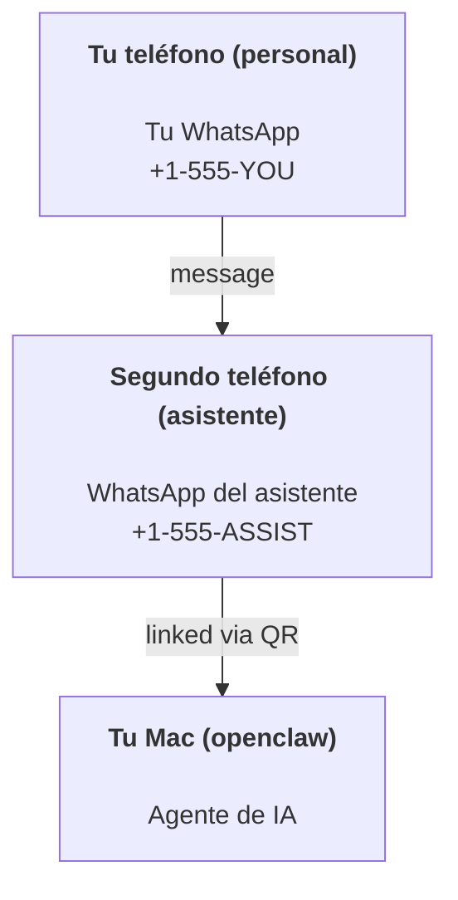

---
read_when:
    - Incorporación de una nueva instancia de asistente
    - Revisar las implicaciones de seguridad y permisos
summary: Guía integral para ejecutar OpenClaw como asistente personal con advertencias de seguridad
title: Configuración del asistente personal
x-i18n:
    generated_at: "2026-06-27T12:58:26Z"
    model: gpt-5.5
    postprocess_version: locale-links-v1
    provider: openai
    source_hash: b0cd640872a2a60fd88d2dc3df6d038ef8574163430d8683ef9b67921b0c87f4
    source_path: start/openclaw.md
    workflow: 16
---

OpenClaw es un gateway autoalojado que conecta Discord, Google Chat, iMessage, Matrix, Microsoft Teams, Signal, Slack, Telegram, WhatsApp, Zalo y más con agentes de IA. Esta guía cubre la configuración de "asistente personal": un número dedicado de WhatsApp que se comporta como tu asistente de IA siempre activo.

## ⚠️ Primero la seguridad

Estás poniendo a un agente en posición de:

- ejecutar comandos en tu máquina (según tu política de herramientas)
- leer/escribir archivos en tu espacio de trabajo
- enviar mensajes de vuelta mediante WhatsApp/Telegram/Discord/Mattermost y otros canales incluidos

Empieza de forma conservadora:

- Establece siempre `channels.whatsapp.allowFrom` (nunca lo ejecutes abierto a todo Internet en tu Mac personal).
- Usa un número dedicado de WhatsApp para el asistente.
- Los Heartbeats ahora se ejecutan de forma predeterminada cada 30 minutos. Desactívalos hasta que confíes en la configuración estableciendo `agents.defaults.heartbeat.every: "0m"`.

## Requisitos previos

- OpenClaw instalado e incorporado; consulta [Primeros pasos](/es/start/getting-started) si aún no lo has hecho
- Un segundo número de teléfono (SIM/eSIM/prepago) para el asistente

## La configuración con dos teléfonos (recomendada)

Quieres esto:



Si vinculas tu WhatsApp personal a OpenClaw, cada mensaje dirigido a ti se convierte en "entrada para el agente". Eso rara vez es lo que quieres.

## Inicio rápido en 5 minutos

1. Empareja WhatsApp Web (muestra un QR; escanéalo con el teléfono del asistente):

```bash
openclaw channels login
```

2. Inicia el Gateway (déjalo ejecutándose):

```bash
openclaw gateway --port 18789
```

3. Coloca una configuración mínima en `~/.openclaw/openclaw.json`:

```json5
{
  gateway: { mode: "local" },
  channels: { whatsapp: { allowFrom: ["+15555550123"] } },
}
```

Ahora envía un mensaje al número del asistente desde tu teléfono incluido en la lista permitida.

Cuando finaliza la incorporación, OpenClaw abre automáticamente el panel y muestra un enlace limpio (sin token). Si el panel solicita autenticación, pega el secreto compartido configurado en los ajustes de la UI de control. La incorporación usa un token de forma predeterminada (`gateway.auth.token`), pero la autenticación por contraseña también funciona si cambiaste `gateway.auth.mode` a `password`. Para reabrirlo más tarde: `openclaw dashboard`.

## Dale al agente un espacio de trabajo (AGENTS)

OpenClaw lee instrucciones operativas y "memoria" desde su directorio de espacio de trabajo.

De forma predeterminada, OpenClaw usa `~/.openclaw/workspace` como espacio de trabajo del agente y lo creará (junto con los archivos iniciales `AGENTS.md`, `SOUL.md`, `TOOLS.md`, `IDENTITY.md`, `USER.md`, `HEARTBEAT.md`) automáticamente durante la configuración o la primera ejecución del agente. `BOOTSTRAP.md` solo se crea cuando el espacio de trabajo es completamente nuevo (no debería volver después de que lo elimines). `MEMORY.md` es opcional (no se crea automáticamente); cuando está presente, se carga en las sesiones normales. Las sesiones de subagente solo inyectan `AGENTS.md` y `TOOLS.md`.

<Tip>
Trata esta carpeta como la memoria de OpenClaw y conviértela en un repositorio git (idealmente privado) para que tus archivos `AGENTS.md` y de memoria tengan copia de seguridad. Si git está instalado, los espacios de trabajo completamente nuevos se inicializan automáticamente.
</Tip>

```bash
openclaw setup
```

Diseño completo del espacio de trabajo + guía de copias de seguridad: [Espacio de trabajo del agente](/es/concepts/agent-workspace)
Flujo de trabajo de memoria: [Memoria](/es/concepts/memory)

Opcional: elige un espacio de trabajo diferente con `agents.defaults.workspace` (admite `~`).

```json5
{
  agents: {
    defaults: {
      workspace: "~/.openclaw/workspace",
    },
  },
}
```

Si ya distribuyes tus propios archivos de espacio de trabajo desde un repositorio, puedes desactivar por completo la creación de archivos de arranque:

```json5
{
  agents: {
    defaults: {
      skipBootstrap: true,
    },
  },
}
```

## La configuración que lo convierte en "un asistente"

OpenClaw tiene de forma predeterminada una buena configuración de asistente, pero normalmente querrás ajustar:

- personalidad/instrucciones en [`SOUL.md`](/es/concepts/soul)
- valores predeterminados de razonamiento (si lo deseas)
- Heartbeats (cuando confíes en él)

Ejemplo:

```json5
{
  logging: { level: "info" },
  agents: {
    defaults: {
      model: { primary: "anthropic/claude-opus-4-6" },
      workspace: "~/.openclaw/workspace",
      thinkingDefault: "high",
      timeoutSeconds: 1800,
      // Empieza con 0; actívalo más tarde.
      heartbeat: { every: "0m" },
    },
    list: [
      {
        id: "main",
        default: true,
        groupChat: {
          mentionPatterns: ["@openclaw", "openclaw"],
        },
      },
    ],
  },
  channels: {
    whatsapp: {
      allowFrom: ["+15555550123"],
      groups: {
        "*": { requireMention: true },
      },
    },
  },
  session: {
    scope: "per-sender",
    resetTriggers: ["/new", "/reset"],
    reset: {
      mode: "daily",
      atHour: 4,
      idleMinutes: 10080,
    },
  },
}
```

## Sesiones y memoria

- Archivos de sesión: `~/.openclaw/agents/<agentId>/sessions/{{SessionId}}.jsonl`
- Metadatos de sesión (uso de tokens, última ruta, etc.): `~/.openclaw/agents/<agentId>/sessions/sessions.json` (legado: `~/.openclaw/sessions/sessions.json`)
- `/new` o `/reset` inicia una sesión nueva para ese chat (configurable mediante `resetTriggers`). Si se envía solo, OpenClaw confirma el restablecimiento sin invocar el modelo.
- `/compact [instructions]` compacta el contexto de la sesión e informa del presupuesto de contexto restante.

## Heartbeats (modo proactivo)

De forma predeterminada, OpenClaw ejecuta un Heartbeat cada 30 minutos con el prompt:
`Read HEARTBEAT.md if it exists (workspace context). Follow it strictly. Do not infer or repeat old tasks from prior chats. If nothing needs attention, reply HEARTBEAT_OK.`
Establece `agents.defaults.heartbeat.every: "0m"` para desactivarlo.

- Si `HEARTBEAT.md` existe pero está prácticamente vacío (solo líneas en blanco, comentarios Markdown/HTML, encabezados Markdown como `# Heading`, marcadores de bloque delimitado o stubs de checklist vacíos), OpenClaw omite la ejecución del Heartbeat para ahorrar llamadas a la API.
- Si falta el archivo, el Heartbeat aun así se ejecuta y el modelo decide qué hacer.
- Si el agente responde con `HEARTBEAT_OK` (opcionalmente con un relleno corto; consulta `agents.defaults.heartbeat.ackMaxChars`), OpenClaw suprime la entrega saliente de ese Heartbeat.
- De forma predeterminada, se permite la entrega de Heartbeats a destinos tipo DM `user:<id>`. Establece `agents.defaults.heartbeat.directPolicy: "block"` para suprimir la entrega a destinos directos mientras mantienes activas las ejecuciones de Heartbeat.
- Los Heartbeats ejecutan turnos completos del agente: los intervalos más cortos consumen más tokens.

```json5
{
  agents: {
    defaults: {
      heartbeat: { every: "30m" },
    },
  },
}
```

## Medios de entrada y salida

Los adjuntos entrantes (imágenes/audio/documentos) pueden exponerse a tu comando mediante plantillas:

- `{{MediaPath}}` (ruta de archivo temporal local)
- `{{MediaUrl}}` (pseudo-URL)
- `{{Transcript}}` (si la transcripción de audio está activada)

Los adjuntos salientes del agente usan campos multimedia estructurados en la herramienta de mensajes o en la carga útil de respuesta, como `media`, `mediaUrl`, `mediaUrls`, `path` o `filePath`. Argumentos de ejemplo para la herramienta de mensajes:

```json
{
  "message": "Here's the screenshot.",
  "mediaUrl": "https://example.com/screenshot.png"
}
```

OpenClaw envía medios estructurados junto con el texto. Las respuestas finales heredadas del asistente aún pueden normalizarse por compatibilidad, pero la salida de herramientas, la salida del navegador, los bloques de streaming y las acciones de mensaje no interpretan el texto como comandos de adjunto.

El comportamiento de rutas locales sigue el mismo modelo de confianza de lectura de archivos que el agente:

- Si `tools.fs.workspaceOnly` es `true`, las rutas de medios locales salientes permanecen restringidas a la raíz temporal de OpenClaw, la caché de medios, las rutas del espacio de trabajo del agente y los archivos generados por el sandbox.
- Si `tools.fs.workspaceOnly` es `false`, los medios locales salientes pueden usar archivos locales del host que el agente ya tiene permitido leer.
- Las rutas locales pueden ser absolutas, relativas al espacio de trabajo o relativas al directorio personal con `~/`.
- Los envíos locales del host siguen permitiendo solo medios y tipos de documento seguros (imágenes, audio, video, PDF, documentos de Office y documentos de texto validados como Markdown/MD, TXT, JSON, YAML e YML). Esto es una extensión del límite de confianza de lectura del host existente, no un escáner de secretos: si el agente puede leer un `secret.txt` o `config.json` local del host, puede adjuntar ese archivo cuando la extensión y la validación de contenido coincidan.

Eso significa que las imágenes/archivos generados fuera del espacio de trabajo ahora pueden enviarse cuando tu política de fs ya permite esas lecturas, mientras que las extensiones de texto locales arbitrarias del host permanecen bloqueadas. Mantén los archivos confidenciales fuera del sistema de archivos legible por el agente, o conserva `tools.fs.workspaceOnly=true` para envíos de rutas locales más estrictos.

## Lista de comprobación de operaciones

```bash
openclaw status          # estado local (credenciales, sesiones, eventos en cola)
openclaw status --all    # diagnóstico completo (solo lectura, apto para pegar)
openclaw status --deep   # pregunta al gateway por una sonda de salud en vivo con sondas de canal cuando se admiten
openclaw health --json   # instantánea de salud del gateway (WS; por defecto puede devolver una instantánea fresca en caché)
```

Los registros viven en `/tmp/openclaw/` (predeterminado: `openclaw-YYYY-MM-DD.log`).

## Próximos pasos

- WebChat: [WebChat](/es/web/webchat)
- Operaciones del Gateway: [Runbook del Gateway](/es/gateway)
- Cron + activaciones: [Trabajos Cron](/es/automation/cron-jobs)
- Compañero de la barra de menús de macOS: [Aplicación de OpenClaw para macOS](/es/platforms/macos)
- Aplicación de nodo iOS: [Aplicación iOS](/es/platforms/ios)
- Aplicación de nodo Android: [Aplicación Android](/es/platforms/android)
- Hub de Windows: [Windows](/es/platforms/windows)
- Estado de Linux: [Aplicación Linux](/es/platforms/linux)
- Seguridad: [Seguridad](/es/gateway/security)

## Relacionado

- [Primeros pasos](/es/start/getting-started)
- [Configuración](/es/start/setup)
- [Resumen de canales](/es/channels)
