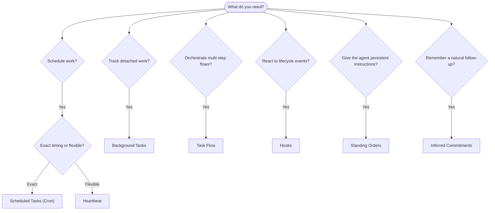

OpenClaw کارها را در پس‌زمینه از طریق وظیفه‌ها، کارهای زمان‌بندی‌شده، تعهدات استنباط‌شده، قلاب‌های رویداد، و دستورهای ثابت اجرا می‌کند. این صفحه کمک می‌کند سازوکار درست را انتخاب کنید و بفهمید چگونه کنار هم کار می‌کنند.

## راهنمای تصمیم‌گیری سریع

| مورد استفاده | پیشنهادشده | دلیل |
| --------------------------------------- | ---------------------- | ------------------------------------------------ |
| ارسال گزارش روزانه دقیقاً ساعت ۹ صبح | وظیفه‌های زمان‌بندی‌شده (Cron) | زمان‌بندی دقیق، اجرای ایزوله |
| ۲۰ دقیقه دیگر به من یادآوری کن | وظیفه‌های زمان‌بندی‌شده (Cron) | یک‌باره با زمان‌بندی دقیق (`--at`) |
| اجرای تحلیل عمیق هفتگی | وظیفه‌های زمان‌بندی‌شده (Cron) | وظیفه مستقل، می‌تواند از مدل متفاوت استفاده کند |
| بررسی صندوق ورودی هر ۳۰ دقیقه | Heartbeat | دسته‌بندی همراه با بررسی‌های دیگر، آگاه از زمینه |
| پایش تقویم برای رویدادهای پیش‌رو | Heartbeat | تناسب طبیعی برای آگاهی دوره‌ای |
| پیگیری پس از مصاحبه‌ای که ذکر شده | تعهدات استنباط‌شده | پیگیری شبیه حافظه، بدون درخواست یادآوری دقیق |
| بررسی ملایم رسیدگی پس از زمینه کاربر | تعهدات استنباط‌شده | محدود به همان عامل و کانال |
| بررسی وضعیت یک زیرعامل یا اجرای ACP | وظیفه‌های پس‌زمینه | دفتر وظیفه‌ها همه کارهای جداشده را ردگیری می‌کند |
| حسابرسی اینکه چه چیزی و چه زمانی اجرا شد | وظیفه‌های پس‌زمینه | `openclaw tasks list` و `openclaw tasks audit` |
| پژوهش چندمرحله‌ای و سپس خلاصه‌سازی | جریان وظیفه | هماهنگ‌سازی پایدار با ردگیری بازبینی |
| اجرای یک اسکریپت هنگام بازنشانی نشست | قلاب‌ها | رویدادمحور، هنگام رویدادهای چرخه عمر اجرا می‌شود |
| اجرای کد در هر فراخوانی ابزار | قلاب‌های Plugin | قلاب‌های درون‌فرآیندی می‌توانند فراخوانی‌های ابزار را رهگیری کنند |
| همیشه پیش از پاسخ‌دادن انطباق را بررسی کن | دستورهای ثابت | به‌طور خودکار به هر نشست تزریق می‌شود |

### وظیفه‌های زمان‌بندی‌شده (Cron) در برابر Heartbeat

| بُعد | وظیفه‌های زمان‌بندی‌شده (Cron) | Heartbeat |
| --------------- | ----------------------------------- | ------------------------------------- |
| زمان‌بندی | دقیق (عبارت‌های cron، یک‌باره) | تقریبی (پیش‌فرض هر ۳۰ دقیقه) |
| زمینه نشست | تازه (ایزوله) یا مشترک | زمینه کامل نشست اصلی |
| رکوردهای وظیفه | همیشه ایجاد می‌شود | هرگز ایجاد نمی‌شود |
| تحویل | کانال، webhook، یا بی‌صدا | درون‌خطی در نشست اصلی |
| بهترین کاربرد | گزارش‌ها، یادآورها، کارهای پس‌زمینه | بررسی صندوق ورودی، تقویم، اعلان‌ها |

وقتی به زمان‌بندی دقیق یا اجرای ایزوله نیاز دارید از وظیفه‌های زمان‌بندی‌شده (Cron) استفاده کنید. وقتی کار از زمینه کامل نشست سود می‌برد و زمان‌بندی تقریبی کافی است، از Heartbeat استفاده کنید.

## مفاهیم اصلی

### وظیفه‌های زمان‌بندی‌شده (cron)

Cron زمان‌بند داخلی Gateway برای زمان‌بندی دقیق است. کارها را پایدار نگه می‌دارد، عامل را در زمان درست بیدار می‌کند، و می‌تواند خروجی را به یک کانال گفت‌وگو یا نقطه پایانی webhook تحویل دهد. از یادآورهای یک‌باره، عبارت‌های تکرارشونده، و محرک‌های webhook ورودی پشتیبانی می‌کند.

[وظیفه‌های زمان‌بندی‌شده](/fa/automation/cron-jobs) را ببینید.

### وظیفه‌ها

دفتر وظیفه پس‌زمینه همه کارهای جداشده را ردگیری می‌کند: اجراهای ACP، ایجاد زیرعامل، اجراهای ایزوله cron، و عملیات CLI. وظیفه‌ها رکورد هستند، نه زمان‌بند. برای بررسی آن‌ها از `openclaw tasks list` و `openclaw tasks audit` استفاده کنید.

[وظیفه‌های پس‌زمینه](/fa/automation/tasks) را ببینید.

### تعهدات استنباط‌شده

تعهدات، حافظه‌های پیگیری کوتاه‌مدت و اختیاری هستند. OpenClaw آن‌ها را از مکالمه‌های عادی استنباط می‌کند، به همان عامل و کانال محدود می‌کند، و بررسی‌های موعددار را از طریق heartbeat تحویل می‌دهد. یادآورهای دقیق درخواست‌شده توسط کاربر همچنان به cron تعلق دارند.

[تعهدات استنباط‌شده](/fa/concepts/commitments) را ببینید.

### جریان وظیفه

جریان وظیفه زیرلایه هماهنگ‌سازی جریان بالای وظیفه‌های پس‌زمینه است. جریان‌های چندمرحله‌ای پایدار را با حالت‌های همگام‌سازی مدیریت‌شده و آینه‌شده، ردگیری بازبینی، و `openclaw tasks flow list|show|cancel` برای بررسی مدیریت می‌کند.

[جریان وظیفه](/fa/automation/taskflow) را ببینید.

### دستورهای ثابت

دستورهای ثابت برای برنامه‌های تعریف‌شده به عامل اختیار عملیاتی دائمی می‌دهند. آن‌ها در فایل‌های فضای کاری زندگی می‌کنند (معمولاً `AGENTS.md`) و به هر نشست تزریق می‌شوند. برای اجرای مبتنی بر زمان، آن‌ها را با cron ترکیب کنید.

[دستورهای ثابت](/fa/automation/standing-orders) را ببینید.

### قلاب‌ها

قلاب‌های داخلی اسکریپت‌های رویدادمحوری هستند که با رویدادهای چرخه عمر عامل (`/new`، `/reset`، `/stop`)، Compaction نشست، راه‌اندازی Gateway، و جریان پیام فعال می‌شوند. آن‌ها به‌طور خودکار از دایرکتوری‌ها کشف می‌شوند و با `openclaw hooks` قابل مدیریت‌اند. برای رهگیری درون‌فرآیندی فراخوانی ابزار، از [قلاب‌های Plugin](/fa/plugins/hooks) استفاده کنید.

[قلاب‌ها](/fa/automation/hooks) را ببینید.

### Heartbeat

Heartbeat یک نوبت دوره‌ای در نشست اصلی است (پیش‌فرض هر ۳۰ دقیقه). چندین بررسی (صندوق ورودی، تقویم، اعلان‌ها) را در یک نوبت عامل با زمینه کامل نشست دسته‌بندی می‌کند. نوبت‌های Heartbeat رکورد وظیفه ایجاد نمی‌کنند و تازگی بازنشانی نشست روزانه/بیکار را تمدید نمی‌کنند. برای یک چک‌لیست کوچک از `HEARTBEAT.md` استفاده کنید، یا وقتی می‌خواهید بررسی‌های دوره‌ای فقط-موعددار در خود heartbeat انجام شوند، از یک بلوک `tasks:` استفاده کنید. فایل‌های heartbeat خالی با `empty-heartbeat-file` رد می‌شوند؛ حالت وظیفه فقط-موعددار با `no-tasks-due` رد می‌شود. وقتی کار cron فعال یا در صف باشد، Heartbeatها به تعویق می‌افتند، و `heartbeat.skipWhenBusy` نیز می‌تواند یک عامل را وقتی زیرعامل دارای کلید نشست همان عامل یا مسیرهای تودرتو مشغول‌اند به تعویق بیندازد.

[Heartbeat](/fa/gateway/heartbeat) را ببینید.

## چگونه با هم کار می‌کنند

- **Cron** زمان‌بندی‌های دقیق (گزارش‌های روزانه، بازبینی‌های هفتگی) و یادآورهای یک‌باره را مدیریت می‌کند. همه اجراهای cron رکورد وظیفه ایجاد می‌کنند.
- **Heartbeat** پایش‌های روتین (صندوق ورودی، تقویم، اعلان‌ها) را هر ۳۰ دقیقه در یک نوبت دسته‌بندی‌شده مدیریت می‌کند.
- **قلاب‌ها** با اسکریپت‌های سفارشی به رویدادهای مشخص (بازنشانی نشست، Compaction، جریان پیام) واکنش نشان می‌دهند. قلاب‌های Plugin فراخوانی‌های ابزار را پوشش می‌دهند.
- **دستورهای ثابت** به عامل زمینه پایدار و مرزهای اختیار می‌دهند.
- **جریان وظیفه** جریان‌های چندمرحله‌ای را بالای وظیفه‌های منفرد هماهنگ می‌کند.
- **وظیفه‌ها** به‌طور خودکار همه کارهای جداشده را ردگیری می‌کنند تا بتوانید آن‌ها را بررسی و حسابرسی کنید.

## مرتبط

- [وظیفه‌های زمان‌بندی‌شده](/fa/automation/cron-jobs) — زمان‌بندی دقیق و یادآورهای یک‌باره
- [تعهدات استنباط‌شده](/fa/concepts/commitments) — بررسی‌های پیگیری شبیه حافظه
- [وظیفه‌های پس‌زمینه](/fa/automation/tasks) — دفتر وظیفه برای همه کارهای جداشده
- [جریان وظیفه](/fa/automation/taskflow) — هماهنگ‌سازی پایدار جریان چندمرحله‌ای
- [قلاب‌ها](/fa/automation/hooks) — اسکریپت‌های چرخه عمر رویدادمحور
- [قلاب‌های Plugin](/fa/plugins/hooks) — قلاب‌های درون‌فرآیندی ابزار، پرامپت، پیام، و چرخه عمر
- [دستورهای ثابت](/fa/automation/standing-orders) — دستورالعمل‌های پایدار عامل
- [Heartbeat](/fa/gateway/heartbeat) — نوبت‌های دوره‌ای نشست اصلی
- [مرجع پیکربندی](/fa/gateway/configuration-reference) — همه کلیدهای پیکربندی
