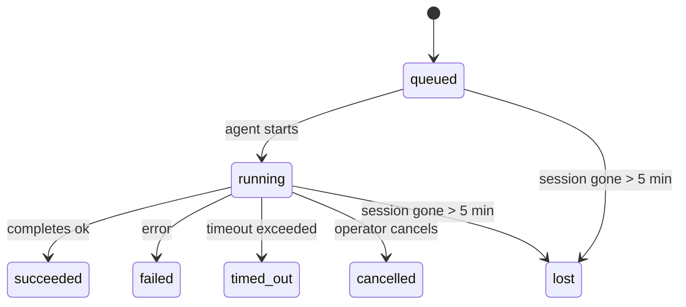

---
read_when:
    - بررسی کارهای پس‌زمینه در حال انجام یا به‌تازگی تکمیل‌شده
    - عیب‌یابی شکست‌های تحویل برای اجراهای جداشدهٔ عامل
    - درک ارتباط اجراهای پس‌زمینه با نشست‌ها، Cron و Heartbeat
sidebarTitle: Background tasks
summary: پیگیری وظایف پس‌زمینه برای اجراهای ACP، زیرعامل‌ها، کارهای Cron ایزوله، و عملیات CLI
title: وظایف پس‌زمینه
x-i18n:
    generated_at: "2026-05-06T09:02:29Z"
    model: gpt-5.5
    provider: openai
    source_hash: 055e16b4f53dbd089cc72eea7fe80bdaee5451dc56fa6e88a742f98e566bb57a
    source_path: automation/tasks.md
    workflow: 16
---

<Note>
به‌دنبال زمان‌بندی هستید؟ برای انتخاب سازوکار مناسب، [اتوماسیون و وظایف](/fa/automation) را ببینید. این صفحه دفتر ثبت فعالیت برای کارهای پس‌زمینه است، نه زمان‌بند.
</Note>

وظایف پس‌زمینه کارهایی را دنبال می‌کنند که **بیرون از نشست گفت‌وگوی اصلی شما** اجرا می‌شوند: اجرای ACP، ایجاد subagent، اجرای jobهای cron ایزوله، و عملیات آغازشده از CLI.

وظایف جایگزین نشست‌ها، jobهای cron، یا heartbeatها نمی‌شوند - آن‌ها **دفتر ثبت فعالیت** هستند که ثبت می‌کند چه کار جداشده‌ای رخ داده، چه زمانی رخ داده، و آیا موفق بوده است یا نه.

<Note>
همه اجرای‌های agent یک task ایجاد نمی‌کنند. نوبت‌های Heartbeat و گفت‌وگوی تعاملی عادی این کار را نمی‌کنند. همه اجرای‌های cron، ایجادهای ACP، ایجادهای subagent، و دستورهای agent از CLI این کار را می‌کنند.
</Note>

## خلاصه کوتاه

- Taskها **رکورد** هستند، نه زمان‌بند - cron و Heartbeat تصمیم می‌گیرند کار _چه زمانی_ اجرا شود، taskها پیگیری می‌کنند _چه اتفاقی افتاده است_.
- ACP، subagentها، همه jobهای cron، و عملیات CLI task ایجاد می‌کنند. نوبت‌های Heartbeat این کار را نمی‌کنند.
- هر task از مسیر `queued → running → terminal` عبور می‌کند (succeeded، failed، timed_out، cancelled، یا lost).
- Taskهای cron تا وقتی که runtime مربوط به cron همچنان مالک job است زنده می‌مانند؛ اگر
  وضعیت runtime درون حافظه از بین رفته باشد، نگهداری task پیش از علامت‌گذاری task به‌عنوان lost،
  ابتدا تاریخچه پایدار اجرای cron را بررسی می‌کند.
- تکمیل به‌صورت push-driven است: کار جداشده می‌تواند مستقیما اطلاع دهد یا هنگام پایان،
  نشست/Heartbeat درخواست‌دهنده را بیدار کند، بنابراین حلقه‌های polling وضعیت معمولا
  شکل درستی نیستند.
- اجرای‌های cron ایزوله و تکمیل‌های subagent به‌صورت best-effort برگه‌ها/فرایندهای مرورگر ردیابی‌شده را برای نشست فرزند خود پیش از bookkeeping نهایی پاک‌سازی می‌کنند.
- تحویل cron ایزوله پاسخ‌های موقت و کهنه والد را تا زمانی که کار subagent فرزند هنوز در حال تخلیه است سرکوب می‌کند، و وقتی خروجی نهایی فرزند پیش از تحویل برسد، آن را ترجیح می‌دهد.
- اعلان‌های تکمیل مستقیما به یک channel تحویل داده می‌شوند یا برای Heartbeat بعدی در صف قرار می‌گیرند.
- `openclaw tasks list` همه taskها را نشان می‌دهد؛ `openclaw tasks audit` مشکلات را نمایان می‌کند.
- رکوردهای terminal به‌مدت ۷ روز نگه داشته می‌شوند، سپس به‌طور خودکار prune می‌شوند.

## شروع سریع

<Tabs>
  <Tab title="فهرست و فیلتر">
    ```bash
    # List all tasks (newest first)
    openclaw tasks list

    # Filter by runtime or status
    openclaw tasks list --runtime acp
    openclaw tasks list --status running
    ```

  </Tab>
  <Tab title="بررسی">
    ```bash
    # Show details for a specific task (by ID, run ID, or session key)
    openclaw tasks show <lookup>
    ```
  </Tab>
  <Tab title="لغو و اعلان">
    ```bash
    # Cancel a running task (kills the child session)
    openclaw tasks cancel <lookup>

    # Change notification policy for a task
    openclaw tasks notify <lookup> state_changes
    ```

  </Tab>
  <Tab title="ممیزی و نگهداری">
    ```bash
    # Run a health audit
    openclaw tasks audit

    # Preview or apply maintenance
    openclaw tasks maintenance
    openclaw tasks maintenance --apply
    ```

  </Tab>
  <Tab title="جریان task">
    ```bash
    # Inspect TaskFlow state
    openclaw tasks flow list
    openclaw tasks flow show <lookup>
    openclaw tasks flow cancel <lookup>
    ```
  </Tab>
</Tabs>

## چه چیزی task ایجاد می‌کند

| منبع                   | نوع runtime | زمانی که رکورد task ایجاد می‌شود                         | سیاست اعلان پیش‌فرض |
| ---------------------- | ------------ | ------------------------------------------------------ | --------------------- |
| اجرای‌های پس‌زمینه ACP | `acp`        | ایجاد یک نشست فرزند ACP                                | `done_only`           |
| ارکستراسیون subagent   | `subagent`   | ایجاد یک subagent از طریق `sessions_spawn`              | `done_only`           |
| jobهای cron (همه انواع) | `cron`       | هر اجرای cron (main-session و ایزوله)                  | `silent`              |
| عملیات CLI             | `cli`        | دستورهای `openclaw agent` که از طریق Gateway اجرا می‌شوند | `silent`              |
| jobهای رسانه agent     | `cli`        | اجرای‌های مبتنی بر نشست `music_generate`/`video_generate` | `silent`              |

<AccordionGroup>
  <Accordion title="پیش‌فرض‌های اعلان برای cron و رسانه">
    Taskهای cron مربوط به main-session به‌طور پیش‌فرض از سیاست اعلان `silent` استفاده می‌کنند - آن‌ها برای ردیابی رکورد ایجاد می‌کنند اما اعلان تولید نمی‌کنند. Taskهای cron ایزوله نیز به‌طور پیش‌فرض `silent` هستند اما چون در نشست خودشان اجرا می‌شوند، بیشتر قابل مشاهده‌اند.

    اجرای‌های `music_generate` و `video_generate` مبتنی بر نشست نیز از سیاست اعلان `silent` استفاده می‌کنند. آن‌ها همچنان رکورد task ایجاد می‌کنند، اما تکمیل به‌صورت یک wake داخلی به نشست agent اصلی برگردانده می‌شود تا agent بتواند پیام پیگیری را بنویسد و خودش رسانه تکمیل‌شده را پیوست کند. تکمیل‌های group/channel از سیاست معمول پاسخ قابل مشاهده پیروی می‌کنند، بنابراین وقتی تحویل مبدأ به آن نیاز داشته باشد، agent از message tool استفاده می‌کند. اگر agent تکمیل نتواند در یک مسیر tool-only شواهد تحویل message-tool تولید کند، OpenClaw به‌جای خصوصی نگه‌داشتن رسانه، fallback تکمیل را مستقیما به channel اصلی ارسال می‌کند.

  </Accordion>
  <Accordion title="محافظ اجرای همزمان video_generate">
    تا وقتی یک task مبتنی بر نشست `video_generate` هنوز فعال است، این ابزار نقش محافظ را هم دارد: فراخوانی‌های تکراری `video_generate` در همان نشست، به‌جای شروع generation همزمان دوم، وضعیت task فعال را برمی‌گردانند. وقتی از سمت agent به lookup صریح progress/status نیاز دارید، از `action: "status"` استفاده کنید.
  </Accordion>
  <Accordion title="چه چیزی task ایجاد نمی‌کند">
    - نوبت‌های Heartbeat - main-session؛ [Heartbeat](/fa/gateway/heartbeat) را ببینید
    - نوبت‌های گفت‌وگوی تعاملی عادی
    - پاسخ‌های مستقیم `/command`

  </Accordion>
</AccordionGroup>

## چرخه عمر task



| وضعیت      | معنی آن                                                                    |
| ----------- | -------------------------------------------------------------------------- |
| `queued`    | ایجاد شده، در انتظار شروع agent                                            |
| `running`   | نوبت agent فعالانه در حال اجراست                                           |
| `succeeded` | با موفقیت تکمیل شده است                                                    |
| `failed`    | با خطا تکمیل شده است                                                       |
| `timed_out` | از timeout پیکربندی‌شده عبور کرده است                                      |
| `cancelled` | توسط operator از طریق `openclaw tasks cancel` متوقف شده است                |
| `lost`      | runtime پس از یک دوره مهلت ۵ دقیقه‌ای وضعیت پشتیبان معتبر را از دست داده است |

انتقال‌ها به‌طور خودکار رخ می‌دهند - وقتی اجرای agent مرتبط پایان می‌یابد، وضعیت task برای مطابقت با آن به‌روزرسانی می‌شود.

تکمیل اجرای agent برای رکوردهای task فعال معتبر است. یک اجرای جداشده موفق به‌صورت `succeeded` نهایی می‌شود، خطاهای عادی اجرا به‌صورت `failed` نهایی می‌شوند، و پیامدهای timeout یا abort به‌صورت `timed_out` نهایی می‌شوند. اگر operator از قبل task را لغو کرده باشد، یا runtime از قبل یک وضعیت terminal قوی‌تر مانند `failed`، `timed_out`، یا `lost` ثبت کرده باشد، سیگنال موفقیت بعدی آن وضعیت terminal را تنزل نمی‌دهد.

`lost` از runtime آگاه است:

- Taskهای ACP: metadata نشست فرزند ACP پشتیبان ناپدید شده است.
- Taskهای subagent: نشست فرزند پشتیبان از store مربوط به agent هدف ناپدید شده است.
- Taskهای cron: runtime مربوط به cron دیگر job را به‌عنوان فعال ردیابی نمی‌کند و تاریخچه پایدار
  اجرای cron نتیجه terminal برای آن run نشان نمی‌دهد. ممیزی offline CLI
  وضعیت خالی runtime cron درون‌فرایندی خودش را مرجع معتبر تلقی نمی‌کند.
- Taskهای CLI: taskهای نشست فرزند ایزوله از نشست فرزند استفاده می‌کنند؛ taskهای CLI
  مبتنی بر chat در عوض از context اجرای زنده استفاده می‌کنند، بنابراین rowهای باقی‌مانده
  نشست channel/group/direct آن‌ها را زنده نگه نمی‌دارند. اجرای‌های `openclaw agent`
  مبتنی بر Gateway نیز از نتیجه اجرای خود نهایی می‌شوند، بنابراین اجرای‌های تکمیل‌شده
  تا زمانی که sweeper آن‌ها را `lost` علامت‌گذاری کند فعال نمی‌مانند.

## تحویل و اعلان‌ها

وقتی یک task به وضعیت terminal می‌رسد، OpenClaw به شما اطلاع می‌دهد. دو مسیر تحویل وجود دارد:

**تحویل مستقیم** - اگر task یک هدف channel داشته باشد (`requesterOrigin`)، پیام تکمیل مستقیما به همان channel می‌رود (Telegram، Discord، Slack، و غیره). برای تکمیل‌های subagent، OpenClaw همچنین در صورت وجود، مسیریابی thread/topic متصل را حفظ می‌کند و می‌تواند پیش از صرف‌نظر کردن از تحویل مستقیم، مقدار `to` / account گمشده را از route ذخیره‌شده نشست درخواست‌دهنده (`lastChannel` / `lastTo` / `lastAccountId`) پر کند.

**تحویل در صف نشست** - اگر تحویل مستقیم شکست بخورد یا origin تنظیم نشده باشد، به‌روزرسانی به‌عنوان یک رویداد system در نشست درخواست‌دهنده در صف قرار می‌گیرد و در Heartbeat بعدی ظاهر می‌شود.

<Tip>
تکمیل task یک wake فوری Heartbeat را فعال می‌کند تا نتیجه را سریع ببینید - لازم نیست منتظر tick زمان‌بندی‌شده Heartbeat بعدی بمانید.
</Tip>

این یعنی workflow معمول push-based است: کار جداشده را یک‌بار شروع کنید، سپس بگذارید runtime هنگام تکمیل شما را بیدار کند یا اطلاع دهد. وضعیت task را فقط وقتی poll کنید که به debugging، مداخله، یا ممیزی صریح نیاز دارید.

### سیاست‌های اعلان

کنترل کنید درباره هر task چقدر بشنوید:

| سیاست                | چیزی که تحویل داده می‌شود                                               |
| --------------------- | ----------------------------------------------------------------------- |
| `done_only` (پیش‌فرض) | فقط وضعیت terminal (succeeded، failed، و غیره) - **این پیش‌فرض است**   |
| `state_changes`       | هر انتقال وضعیت و به‌روزرسانی progress                                  |
| `silent`              | هیچ چیز                                                                 |

سیاست را هنگام اجرای task تغییر دهید:

```bash
openclaw tasks notify <lookup> state_changes
```

## مرجع CLI

<AccordionGroup>
  <Accordion title="tasks list">
    ```bash
    openclaw tasks list [--runtime <acp|subagent|cron|cli>] [--status <status>] [--json]
    ```

    ستون‌های خروجی: Task ID، نوع، وضعیت، تحویل، Run ID، نشست فرزند، خلاصه.

  </Accordion>
  <Accordion title="tasks show">
    ```bash
    openclaw tasks show <lookup>
    ```

    توکن lookup یک task ID، run ID، یا session key را می‌پذیرد. رکورد کامل شامل زمان‌بندی، وضعیت تحویل، خطا، و خلاصه terminal را نشان می‌دهد.

  </Accordion>
  <Accordion title="tasks cancel">
    ```bash
    openclaw tasks cancel <lookup>
    ```

    برای taskهای ACP و subagent، این کار نشست فرزند را می‌کشد. برای taskهای ردیابی‌شده توسط CLI، لغو در task registry ثبت می‌شود (handle جداگانه‌ای برای runtime فرزند وجود ندارد). وضعیت به `cancelled` منتقل می‌شود و در صورت کاربرد، اعلان تحویل ارسال می‌شود.

  </Accordion>
  <Accordion title="tasks notify">
    ```bash
    openclaw tasks notify <lookup> <done_only|state_changes|silent>
    ```
  </Accordion>
  <Accordion title="tasks audit">
    ```bash
    openclaw tasks audit [--json]
    ```

    مشکلات عملیاتی را نمایان می‌کند. وقتی مشکلی شناسایی شود، یافته‌ها در `openclaw status` نیز ظاهر می‌شوند.

    | یافته                    | شدت       | محرک                                                                                                      |
    | ------------------------- | ---------- | ------------------------------------------------------------------------------------------------------------ |
    | `stale_queued`            | warn       | بیش از ۱۰ دقیقه در صف مانده است                                                                              |
    | `stale_running`           | error      | بیش از ۳۰ دقیقه در حال اجرا بوده است                                                                             |
    | `lost`                    | warn/error | مالکیت وظیفه مبتنی بر زمان اجرا ناپدید شده است؛ وظایف گم‌شده نگه‌داشته‌شده تا `cleanupAfter` هشدار می‌دهند، سپس به خطا تبدیل می‌شوند |
    | `delivery_failed`         | warn       | تحویل ناموفق بود و سیاست اطلاع‌رسانی `silent` نیست                                                            |
    | `missing_cleanup`         | warn       | وظیفه پایانی بدون مهر زمانی پاک‌سازی                                                                      |
    | `inconsistent_timestamps` | warn       | نقض خط زمانی (برای مثال، پیش از شروع پایان یافته است)                                                        |

  </Accordion>
  <Accordion title="نگه‌داری وظایف">
    ```bash
    openclaw tasks maintenance [--json]
    openclaw tasks maintenance --apply [--json]
    ```

    از این دستور برای پیش‌نمایش یا اعمال همگام‌سازی، ثبت مهر پاک‌سازی، و هرس برای وظایف و وضعیت Task Flow استفاده کنید.

    همگام‌سازی از زمان اجرا آگاه است:

    - وظایف ACP/زیرعامل، نشست فرزند پشتیبان خود را بررسی می‌کنند.
    - وظایف زیرعاملی که نشست فرزندشان یک سنگ‌قبر بازیابی پس از راه‌اندازی دوباره دارد، به‌جای اینکه به‌عنوان نشست‌های پشتیبان قابل بازیابی در نظر گرفته شوند، گم‌شده علامت‌گذاری می‌شوند.
    - وظایف Cron بررسی می‌کنند که آیا زمان اجرای cron هنوز مالک کار است یا نه، سپس پیش از برگشت به `lost`، وضعیت پایانی را از گزارش‌های اجرای cron/وضعیت کار ذخیره‌شده بازیابی می‌کنند. فقط فرایند Gateway برای مجموعه کارهای فعال cron در حافظه مرجع معتبر است؛ بازرسی آفلاین CLI از تاریخچه پایدار استفاده می‌کند، اما یک وظیفه cron را صرفا به‌دلیل خالی بودن آن Set محلی، گم‌شده علامت‌گذاری نمی‌کند.
    - وظایف CLI مبتنی بر چت، زمینه اجرای زنده مالک را بررسی می‌کنند، نه فقط ردیف نشست چت را.

    پاک‌سازی تکمیل نیز از زمان اجرا آگاه است:

    - تکمیل زیرعامل، پیش از ادامه پاک‌سازی اعلان، با بهترین تلاش زبانه‌ها/فرایندهای مرورگر ردیابی‌شده برای نشست فرزند را می‌بندد.
    - تکمیل cron ایزوله، پیش از فروپاشی کامل اجرا، با بهترین تلاش زبانه‌ها/فرایندهای مرورگر ردیابی‌شده برای نشست cron را می‌بندد.
    - تحویل cron ایزوله در صورت نیاز منتظر پیگیری زیرعامل‌های فرزند می‌ماند و به‌جای اعلان آن، متن تأیید والد منقضی‌شده را سرکوب می‌کند.
    - تحویل تکمیل زیرعامل، آخرین متن دستیار قابل مشاهده را ترجیح می‌دهد؛ اگر خالی باشد، به آخرین متن پاک‌سازی‌شده ابزار/toolResult برمی‌گردد، و اجراهای فقط مبتنی بر فراخوانی ابزار که صرفا به زمان‌پایان رسیده‌اند می‌توانند به خلاصه کوتاهی از پیشرفت جزئی فشرده شوند. اجراهای پایانی ناموفق، وضعیت شکست را بدون بازپخش متن پاسخ ضبط‌شده اعلام می‌کنند.
    - خطاهای پاک‌سازی نتیجه واقعی وظیفه را پنهان نمی‌کنند.

  </Accordion>
  <Accordion title="فهرست | نمایش | لغو جریان وظایف">
    ```bash
    openclaw tasks flow list [--status <status>] [--json]
    openclaw tasks flow show <lookup> [--json]
    openclaw tasks flow cancel <lookup>
    ```

    زمانی از این‌ها استفاده کنید که Task Flow هماهنگ‌کننده برایتان مهم است، نه یک رکورد وظیفه پس‌زمینه منفرد.

  </Accordion>
</AccordionGroup>

## تابلوی وظایف چت (`/tasks`)

در هر نشست چت از `/tasks` استفاده کنید تا وظایف پس‌زمینه مرتبط با آن نشست را ببینید. تابلو وظایف فعال و تازه تکمیل‌شده را همراه با زمان اجرا، وضعیت، زمان‌بندی، و جزئیات پیشرفت یا خطا نشان می‌دهد.

وقتی نشست فعلی هیچ وظیفه مرتبط قابل مشاهده‌ای ندارد، `/tasks` به شمارش وظایف محلی عامل برمی‌گردد تا همچنان بدون افشای جزئیات نشست‌های دیگر، یک نمای کلی دریافت کنید.

برای دفتر کل کامل اپراتور، از CLI استفاده کنید: `openclaw tasks list`.

## یکپارچه‌سازی وضعیت (فشار وظیفه)

`openclaw status` یک خلاصه سریع از وظایف را شامل می‌شود:

```
Tasks: 3 queued · 2 running · 1 issues
```

خلاصه گزارش می‌دهد:

- **active** - شمار `queued` + `running`
- **failures** - شمار `failed` + `timed_out` + `lost`
- **byRuntime** - تفکیک بر اساس `acp`، `subagent`، `cron`، `cli`

هم `/status` و هم ابزار `session_status` از نمای لحظه‌ای وظایف آگاه از پاک‌سازی استفاده می‌کنند: وظایف فعال ترجیح داده می‌شوند، ردیف‌های تکمیل‌شده منقضی پنهان می‌شوند، و شکست‌های اخیر فقط وقتی نمایش داده می‌شوند که هیچ کار فعالی باقی نمانده باشد. این کار کارت وضعیت را بر آنچه همین حالا مهم است متمرکز نگه می‌دارد.

## ذخیره‌سازی و نگه‌داری

### وظایف کجا قرار دارند

رکوردهای وظیفه در SQLite در این مسیر پایدار می‌مانند:

```
$OPENCLAW_STATE_DIR/tasks/runs.sqlite
```

رجیستری هنگام شروع Gateway در حافظه بارگذاری می‌شود و برای پایداری بین راه‌اندازی‌های دوباره، نوشتن‌ها را با SQLite همگام می‌کند.
Gateway با استفاده از آستانه پیش‌فرض autocheckpoint در SQLite به‌همراه checkpointهای دوره‌ای و زمان خاموشی از نوع `TRUNCATE`، گزارش پیش‌نویس SQLite را محدود نگه می‌دارد.

### نگه‌داری خودکار

یک پاک‌ساز هر **۶۰ ثانیه** اجرا می‌شود و چهار کار انجام می‌دهد:

<Steps>
  <Step title="همگام‌سازی">
    بررسی می‌کند که آیا وظایف فعال هنوز پشتوانه معتبر زمان اجرا دارند یا نه. وظایف ACP/زیرعامل از وضعیت نشست فرزند استفاده می‌کنند، وظایف cron از مالکیت کار فعال استفاده می‌کنند، و وظایف CLI مبتنی بر چت از زمینه اجرای مالک استفاده می‌کنند. اگر آن وضعیت پشتیبان بیش از ۵ دقیقه از بین رفته باشد، وظیفه `lost` علامت‌گذاری می‌شود.
  </Step>
  <Step title="ترمیم نشست ACP">
    نشست‌های ACP یک‌باره متعلق به والد را که پایانی یا رهاشده‌اند می‌بندد، و نشست‌های ACP پایدار منقضی‌شده یا رهاشده را فقط وقتی می‌بندد که هیچ اتصال گفت‌وگوی فعالی باقی نمانده باشد.
  </Step>
  <Step title="ثبت مهر پاک‌سازی">
    روی وظایف پایانی یک مهر زمانی `cleanupAfter` تنظیم می‌کند (endedAt + 7 days). در دوره نگه‌داری، وظایف گم‌شده همچنان در بازرسی به‌صورت هشدار ظاهر می‌شوند؛ پس از انقضای `cleanupAfter` یا وقتی فراداده پاک‌سازی وجود ندارد، به خطا تبدیل می‌شوند.
  </Step>
  <Step title="هرس">
    رکوردهایی را که از تاریخ `cleanupAfter` خود گذشته‌اند حذف می‌کند.
  </Step>
</Steps>

<Note>
**نگه‌داری:** رکوردهای وظایف پایانی به‌مدت **۷ روز** نگه داشته می‌شوند، سپس به‌طور خودکار هرس می‌شوند. نیازی به پیکربندی نیست.
</Note>

## ارتباط وظایف با سیستم‌های دیگر

<AccordionGroup>
  <Accordion title="وظایف و Task Flow">
    [Task Flow](/fa/automation/taskflow) لایه هماهنگ‌سازی جریان بالای وظایف پس‌زمینه است. یک جریان منفرد ممکن است در طول عمر خود با استفاده از حالت‌های همگام‌سازی مدیریت‌شده یا آینه‌شده، چند وظیفه را هماهنگ کند. برای بررسی رکوردهای وظیفه منفرد از `openclaw tasks` و برای بررسی جریان هماهنگ‌کننده از `openclaw tasks flow` استفاده کنید.

    برای جزئیات، [Task Flow](/fa/automation/taskflow) را ببینید.

  </Accordion>
  <Accordion title="وظایف و cron">
    **تعریف** یک کار cron در `~/.openclaw/cron/jobs.json` قرار دارد؛ وضعیت اجرای زمان اجرا کنار آن در `~/.openclaw/cron/jobs-state.json` قرار دارد. **هر** اجرای cron یک رکورد وظیفه ایجاد می‌کند - هم نشست اصلی و هم ایزوله. وظایف cron نشست اصلی به‌طور پیش‌فرض سیاست اطلاع‌رسانی `silent` دارند تا بدون ایجاد اعلان، ردیابی شوند.

    [کارهای Cron](/fa/automation/cron-jobs) را ببینید.

  </Accordion>
  <Accordion title="وظایف و heartbeat">
    اجراهای Heartbeat نوبت‌های نشست اصلی هستند - آن‌ها رکورد وظیفه ایجاد نمی‌کنند. وقتی یک وظیفه تکمیل می‌شود، می‌تواند یک بیدارباش heartbeat را فعال کند تا نتیجه را سریع ببینید.

    [Heartbeat](/fa/gateway/heartbeat) را ببینید.

  </Accordion>
  <Accordion title="وظایف و نشست‌ها">
    یک وظیفه ممکن است به یک `childSessionKey` (جایی که کار اجرا می‌شود) و یک `requesterSessionKey` (کسی که آن را شروع کرده است) ارجاع دهد. نشست‌ها زمینه گفت‌وگو هستند؛ وظایف ردیابی فعالیت روی آن هستند.
  </Accordion>
  <Accordion title="وظایف و اجراهای عامل">
    `runId` یک وظیفه به اجرای عاملی که کار را انجام می‌دهد پیوند می‌خورد. رویدادهای چرخه عمر عامل (شروع، پایان، خطا) به‌طور خودکار وضعیت وظیفه را به‌روزرسانی می‌کنند - لازم نیست چرخه عمر را دستی مدیریت کنید.
  </Accordion>
</AccordionGroup>

## مرتبط

- [اتوماسیون و وظایف](/fa/automation) - همه سازوکارهای اتوماسیون در یک نگاه
- [CLI: وظایف](/fa/cli/tasks) - مرجع دستورهای CLI
- [Heartbeat](/fa/gateway/heartbeat) - نوبت‌های دوره‌ای نشست اصلی
- [وظایف زمان‌بندی‌شده](/fa/automation/cron-jobs) - زمان‌بندی کار پس‌زمینه
- [Task Flow](/fa/automation/taskflow) - هماهنگ‌سازی جریان بالای وظایف
