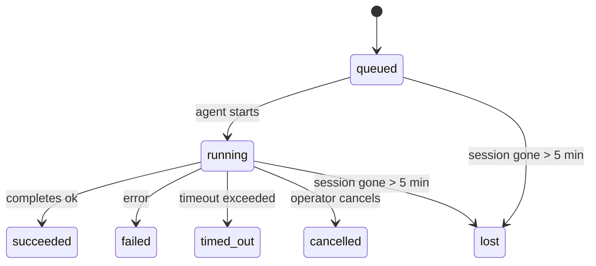

---
read_when:
    - در حال بررسی کار پس‌زمینه‌ای که در جریان است یا اخیراً کامل شده است
    - اشکال‌زدایی شکست‌های تحویل برای اجراهای جداشده عامل
    - درک ارتباط اجرای پس‌زمینه با نشست‌ها، Cron، و Heartbeat
sidebarTitle: Background tasks
summary: رهگیری وظایف پس‌زمینه برای اجراهای ACP، زیرعامل‌ها، کارهای Cron ایزوله و عملیات CLI
title: وظایف پس‌زمینه
x-i18n:
    generated_at: "2026-06-27T17:08:54Z"
    model: gpt-5.5
    postprocess_version: locale-links-v1
    provider: openai
    source_hash: 4a630a52d0d6bfd387a37415dd63fc4bfbce23f99eaa8cb780c3d6f8913675fd
    source_path: automation/tasks.md
    workflow: 16
---

<Note>
به دنبال زمان‌بندی هستید؟ برای انتخاب سازوکار درست، [Automation](/fa/automation) را ببینید. این صفحه دفتر ثبت فعالیت برای کارهای پس‌زمینه است، نه زمان‌بند.
</Note>

وظیفه‌های پس‌زمینه کارهایی را پیگیری می‌کنند که **خارج از جلسه گفت‌وگوی اصلی شما** اجرا می‌شوند: اجراهای ACP، ایجاد زیرعامل‌ها، اجرای کارهای cron ایزوله، و عملیات آغازشده از CLI.

وظیفه‌ها جایگزین جلسه‌ها، کارهای cron، یا Heartbeatها **نیستند** - آن‌ها **دفتر ثبت فعالیت** هستند که ثبت می‌کند چه کار جداشده‌ای رخ داده، چه زمانی، و آیا موفق بوده است یا نه.

<Note>
هر اجرای عامل یک وظیفه ایجاد نمی‌کند. نوبت‌های Heartbeat و گفت‌وگوی تعاملی عادی این کار را نمی‌کنند. همه اجرای‌های cron، ایجادهای ACP، ایجادهای زیرعامل، و فرمان‌های عامل CLI این کار را می‌کنند.
</Note>

## خلاصه سریع

- وظیفه‌ها **رکورد** هستند، نه زمان‌بند - cron و Heartbeat تصمیم می‌گیرند کار _چه زمانی_ اجرا شود، وظیفه‌ها پیگیری می‌کنند _چه اتفاقی افتاد_.
- ACP، زیرعامل‌ها، همه کارهای cron، و عملیات CLI وظیفه ایجاد می‌کنند. نوبت‌های Heartbeat این کار را نمی‌کنند.
- هر وظیفه از مسیر `queued → running → terminal` عبور می‌کند (succeeded، failed، timed_out، cancelled، یا lost).
- وظیفه‌های Cron تا وقتی زنده می‌مانند که زمان اجرای cron هنوز مالک کار باشد؛ اگر
  وضعیت زمان اجرای درون‌حافظه‌ای از بین رفته باشد، نگهداری وظیفه ابتدا تاریخچه
  پایدار اجرای cron را بررسی می‌کند و بعد وظیفه را lost علامت می‌زند.
- تکمیل به‌صورت push-driven است: کار جداشده می‌تواند مستقیماً اطلاع دهد یا هنگام پایان،
  جلسه درخواست‌کننده/Heartbeat را بیدار کند، بنابراین حلقه‌های نظرسنجی وضعیت
  معمولاً شکل درستی ندارند.
- اجراهای cron ایزوله و تکمیل‌های زیرعامل به‌صورت بهترین تلاش، تب‌ها/فرایندهای مرورگر ردیابی‌شده را برای جلسه فرزند خود پیش از حسابداری پاک‌سازی نهایی پاک می‌کنند.
- تحویل cron ایزوله پاسخ‌های موقت و کهنه والد را تا وقتی کار زیرعامل‌های فرزند هنوز در حال تخلیه است سرکوب می‌کند، و اگر خروجی نهایی فرزند پیش از تحویل برسد آن را ترجیح می‌دهد.
- اعلان‌های تکمیل مستقیماً به یک کانال تحویل داده می‌شوند یا برای Heartbeat بعدی در صف قرار می‌گیرند.
- `openclaw tasks list` همه وظیفه‌ها را نشان می‌دهد؛ `openclaw tasks audit` مشکلات را آشکار می‌کند.
- رکوردهای پایانی ۷ روز نگه داشته می‌شوند و سپس به‌صورت خودکار پاک‌سازی می‌شوند.

## شروع سریع

<Tabs>
  <Tab title="فهرست و فیلتر">
    ```bash
    # List all tasks (newest first)
    openclaw tasks list

    # Filter by runtime or status
    openclaw tasks list --runtime acp
    openclaw tasks list --status running
    ```

  </Tab>
  <Tab title="بررسی">
    ```bash
    # Show details for a specific task (by ID, run ID, or session key)
    openclaw tasks show <lookup>
    ```
  </Tab>
  <Tab title="لغو و اعلان">
    ```bash
    # Cancel a running task (kills the child session)
    openclaw tasks cancel <lookup>

    # Change notification policy for a task
    openclaw tasks notify <lookup> state_changes
    ```

  </Tab>
  <Tab title="ممیزی و نگهداری">
    ```bash
    # Run a health audit
    openclaw tasks audit

    # Preview or apply maintenance
    openclaw tasks maintenance
    openclaw tasks maintenance --apply
    ```

  </Tab>
  <Tab title="جریان وظیفه">
    ```bash
    # Inspect TaskFlow state
    openclaw tasks flow list
    openclaw tasks flow show <lookup>
    openclaw tasks flow cancel <lookup>
    ```
  </Tab>
</Tabs>

## چه چیزی وظیفه ایجاد می‌کند

| منبع | نوع زمان اجرا | زمانی که یک رکورد وظیفه ایجاد می‌شود | سیاست اعلان پیش‌فرض |
| ---------------------- | ------------ | ---------------------------------------------------------------------- | --------------------- |
| اجراهای پس‌زمینه ACP | `acp` | ایجاد یک جلسه فرزند ACP | `done_only` |
| هماهنگ‌سازی زیرعامل | `subagent` | ایجاد یک زیرعامل از طریق `sessions_spawn` | `done_only` |
| کارهای Cron (همه انواع) | `cron` | هر اجرای cron (جلسه اصلی و ایزوله) | `silent` |
| عملیات CLI | `cli` | فرمان‌های `openclaw agent` که از طریق Gateway اجرا می‌شوند | `silent` |
| کارهای رسانه عامل | `cli` | اجراهای `image_generate`/`music_generate`/`video_generate` مبتنی بر جلسه | `silent` |

<AccordionGroup>
  <Accordion title="پیش‌فرض‌های اعلان برای cron و رسانه">
    وظیفه‌های cron جلسه اصلی به‌صورت پیش‌فرض از سیاست اعلان `silent` استفاده می‌کنند - آن‌ها برای پیگیری رکورد ایجاد می‌کنند اما اعلان تولید نمی‌کنند. وظیفه‌های cron ایزوله نیز به‌صورت پیش‌فرض `silent` هستند، اما چون در جلسه خودشان اجرا می‌شوند نمایان‌ترند.

    اجراهای `image_generate`، `music_generate`، و `video_generate` مبتنی بر جلسه نیز از سیاست اعلان `silent` استفاده می‌کنند. آن‌ها همچنان رکوردهای وظیفه ایجاد می‌کنند، اما تکمیل به‌عنوان یک بیدارسازی داخلی به جلسه عامل اصلی بازگردانده می‌شود تا عامل بتواند پیام پیگیری را بنویسد و رسانه تمام‌شده را خودش پیوست کند. عامل درخواست‌کننده قرارداد پاسخ قابل مشاهده عادی خود را دنبال می‌کند: پاسخ نهایی خودکار وقتی پیکربندی شده باشد، یا `message(action="send")` به‌همراه `NO_REPLY` وقتی جلسه به پاسخ‌های ابزار پیام نیاز دارد. اگر جلسه درخواست‌کننده دیگر فعال نباشد یا بیدارسازی فعال آن شکست بخورد، و عامل تکمیل بخشی یا همه رسانه تولیدشده را از دست بدهد، OpenClaw یک fallback مستقیم و idempotent فقط با رسانه گمشده به مقصد کانال اصلی می‌فرستد.

  </Accordion>
  <Accordion title="گاردریل تولید هم‌زمان رسانه">
    تا وقتی یک وظیفه تولید رسانه مبتنی بر جلسه هنوز فعال است، ابزارهای رسانه همچنین به‌عنوان گاردریل برای تلاش‌های تکراری تصادفی عمل می‌کنند. فراخوانی‌های تکراری `image_generate` برای همان prompt وضعیت وظیفه فعال مطابق را برمی‌گردانند، در حالی که یک prompt تصویر متمایز می‌تواند وظیفه خودش را شروع کند. فراخوانی‌های `music_generate` و `video_generate` همچنان به‌جای شروع یک تولید هم‌زمان دوم، وضعیت وظیفه فعال آن جلسه را برمی‌گردانند. وقتی از سمت عامل یک جست‌وجوی صریح پیشرفت/وضعیت می‌خواهید، از `action: "status"` استفاده کنید.
  </Accordion>
  <Accordion title="چه چیزی وظیفه ایجاد نمی‌کند">
    - نوبت‌های Heartbeat - جلسه اصلی؛ [Heartbeat](/fa/gateway/heartbeat) را ببینید
    - نوبت‌های گفت‌وگوی تعاملی عادی
    - پاسخ‌های مستقیم `/command`

  </Accordion>
</AccordionGroup>

## چرخه عمر وظیفه



| وضعیت | معنی آن |
| ----------- | -------------------------------------------------------------------------- |
| `queued` | ایجاد شده، در انتظار شروع عامل |
| `running` | نوبت عامل فعالانه در حال اجراست |
| `succeeded` | با موفقیت تکمیل شد |
| `failed` | با خطا تکمیل شد |
| `timed_out` | از مهلت پیکربندی‌شده فراتر رفت |
| `cancelled` | توسط اپراتور از طریق `openclaw tasks cancel` متوقف شد |
| `lost` | زمان اجرا پس از یک دوره ارفاق ۵ دقیقه‌ای وضعیت پشتیبان معتبر را از دست داد |

گذارها به‌صورت خودکار رخ می‌دهند - وقتی اجرای عامل مرتبط پایان می‌یابد، وضعیت وظیفه برای مطابقت با آن به‌روزرسانی می‌شود.

تکمیل اجرای عامل برای رکوردهای وظیفه فعال مرجع است. یک اجرای جداشده موفق به‌صورت `succeeded` نهایی می‌شود، خطاهای معمول اجرا به‌صورت `failed` نهایی می‌شوند، و خروجی‌های timeout یا abort به‌صورت `timed_out` نهایی می‌شوند. اگر اپراتور از قبل وظیفه را لغو کرده باشد، یا زمان اجرا از قبل یک وضعیت پایانی قوی‌تر مانند `failed`، `timed_out`، یا `lost` ثبت کرده باشد، سیگنال موفقیت بعدی آن وضعیت پایانی را تنزل نمی‌دهد.

`lost` از زمان اجرا آگاه است:

- وظیفه‌های ACP: فراداده جلسه فرزند پشتیبان ACP ناپدید شده است.
- وظیفه‌های زیرعامل: جلسه فرزند پشتیبان از انبار عامل مقصد ناپدید شده است.
- وظیفه‌های Cron: زمان اجرای cron دیگر کار را به‌عنوان فعال ردیابی نمی‌کند و تاریخچه
  پایدار اجرای cron نتیجه پایانی برای آن اجرا نشان نمی‌دهد. ممیزی CLI آفلاین
  وضعیت خالی زمان اجرای cron درون‌فرایندی خودش را مرجع در نظر نمی‌گیرد.
- وظیفه‌های CLI: وظیفه‌های دارای شناسه اجرا/شناسه منبع از زمینه اجرای زنده استفاده می‌کنند، بنابراین
  ردیف‌های ماندگار جلسه فرزند یا جلسه گفت‌وگو پس از ناپدید شدن اجرای متعلق به
  Gateway آن‌ها را زنده نگه نمی‌دارند. وظیفه‌های CLI قدیمی بدون هویت اجرا همچنان به جلسه فرزند
  fallback می‌کنند. اجراهای `openclaw agent` مبتنی بر Gateway نیز از نتیجه اجرای خود نهایی می‌شوند،
  بنابراین اجراهای تکمیل‌شده تا وقتی جاروبگر آن‌ها را `lost` علامت بزند فعال نمی‌مانند.

## تحویل و اعلان‌ها

وقتی یک وظیفه به وضعیت پایانی می‌رسد، OpenClaw به شما اطلاع می‌دهد. دو مسیر تحویل وجود دارد:

**تحویل مستقیم** - اگر وظیفه مقصد کانال داشته باشد (`requesterOrigin`)، پیام تکمیل مستقیماً به آن کانال می‌رود (Telegram، Discord، Slack، و غیره). تکمیل‌های وظیفه گروه و کانال در عوض از طریق جلسه درخواست‌کننده مسیردهی می‌شوند تا عامل والد بتواند پاسخ قابل مشاهده را بنویسد. برای تکمیل‌های زیرعامل، OpenClaw همچنین در صورت وجود، مسیریابی thread/topic متصل را حفظ می‌کند و می‌تواند پیش از صرف‌نظر از تحویل مستقیم، مقدار گمشده `to` / حساب را از مسیر ذخیره‌شده جلسه درخواست‌کننده (`lastChannel` / `lastTo` / `lastAccountId`) پر کند.

**تحویل در صف جلسه** - اگر تحویل مستقیم شکست بخورد یا هیچ مبدأی تنظیم نشده باشد، به‌روزرسانی به‌عنوان یک رویداد سیستمی در جلسه درخواست‌کننده در صف قرار می‌گیرد و در Heartbeat بعدی ظاهر می‌شود.

<Tip>
تکمیل وظیفه یک بیدارسازی فوری Heartbeat را فعال می‌کند تا نتیجه را سریع ببینید - لازم نیست تا تیک Heartbeat زمان‌بندی‌شده بعدی صبر کنید.
</Tip>

این یعنی گردش‌کار معمول مبتنی بر push است: کار جداشده را یک‌بار شروع کنید، سپس اجازه دهید زمان اجرا هنگام تکمیل شما را بیدار کند یا اطلاع دهد. وضعیت وظیفه را فقط وقتی نظرسنجی کنید که به اشکال‌زدایی، مداخله، یا ممیزی صریح نیاز دارید.

### سیاست‌های اعلان

کنترل کنید از هر وظیفه چقدر بشنوید:

| سیاست | آنچه تحویل داده می‌شود |
| --------------------- | ----------------------------------------------------------------------- |
| `done_only` (پیش‌فرض) | فقط وضعیت پایانی (succeeded، failed، و غیره) - **این پیش‌فرض است** |
| `state_changes` | هر گذار وضعیت و به‌روزرسانی پیشرفت |
| `silent` | هیچ چیز |

سیاست را در حالی که وظیفه در حال اجراست تغییر دهید:

```bash
openclaw tasks notify <lookup> state_changes
```

## مرجع CLI

<AccordionGroup>
  <Accordion title="tasks list">
    ```bash
    openclaw tasks list [--runtime <acp|subagent|cron|cli>] [--status <status>] [--json]
    ```

    ستون‌های خروجی: شناسه وظیفه، نوع، وضعیت، تحویل، شناسه اجرا، جلسه فرزند، خلاصه.

  </Accordion>
  <Accordion title="tasks show">
    ```bash
    openclaw tasks show <lookup>
    ```

    توکن جست‌وجو یک شناسه وظیفه، شناسه اجرا، یا کلید جلسه را می‌پذیرد. رکورد کامل شامل زمان‌بندی، وضعیت تحویل، خطا، و خلاصه پایانی را نشان می‌دهد.

  </Accordion>
  <Accordion title="tasks cancel">
    ```bash
    openclaw tasks cancel <lookup>
    ```

    برای وظیفه‌های ACP و زیرعامل، این کار جلسه فرزند را می‌کشد. برای وظیفه‌های ردیابی‌شده با CLI، لغو در رجیستری وظیفه ثبت می‌شود (هیچ handle جداگانه‌ای برای زمان اجرای فرزند وجود ندارد). وضعیت به `cancelled` گذار می‌کند و در صورت کاربرد، اعلان تحویل فرستاده می‌شود.

  </Accordion>
  <Accordion title="tasks notify">
    ```bash
    openclaw tasks notify <lookup> <done_only|state_changes|silent>
    ```
  </Accordion>
  <Accordion title="tasks audit">
    ```bash
    openclaw tasks audit [--json]
    ```

    مشکلات عملیاتی را آشکار می‌کند. یافته‌ها هنگام شناسایی مشکل در `openclaw status` نیز ظاهر می‌شوند.

    | یافته                    | شدت       | محرک                                                                                                      |
    | ------------------------- | ---------- | ------------------------------------------------------------------------------------------------------------ |
    | `stale_queued`            | هشدار     | بیش از ۱۰ دقیقه در صف مانده است                                                                              |
    | `stale_running`           | خطا       | بیش از ۳۰ دقیقه در حال اجرا بوده است                                                                         |
    | `lost`                    | هشدار/خطا | مالکیت وظیفه با پشتوانه runtime ناپدید شده است؛ وظایف گم‌شده تا `cleanupAfter` هشدار می‌دهند و سپس به خطا تبدیل می‌شوند |
    | `delivery_failed`         | هشدار     | تحویل ناموفق بوده و سیاست اعلان `silent` نیست                                                               |
    | `missing_cleanup`         | هشدار     | وظیفه پایانی بدون برچسب زمانی پاک‌سازی                                                                       |
    | `inconsistent_timestamps` | هشدار     | نقض خط زمانی (برای مثال، پیش از شروع پایان یافته است)                                                       |

  </Accordion>
  <Accordion title="نگهداری tasks">
    ```bash
    openclaw tasks maintenance [--json]
    openclaw tasks maintenance --apply [--json]
    ```

    از این برای پیش‌نمایش یا اعمال همگام‌سازی، ثبت پاک‌سازی، و هرس کردن وظایف، وضعیت Task Flow، و ردیف‌های قدیمی رجیستری نشست اجرای cron استفاده کنید.

    همگام‌سازی از runtime آگاه است:

    - وظایف ACP/subagent نشست فرزند پشتیبان خود را بررسی می‌کنند.
    - وظایف subagent که نشست فرزندشان tombstone بازیابی پس از راه‌اندازی مجدد دارد، به‌جای اینکه نشست‌های پشتیبان قابل بازیابی تلقی شوند، به‌عنوان گم‌شده علامت‌گذاری می‌شوند.
    - وظایف Cron بررسی می‌کنند که آیا runtime مربوط به cron هنوز مالک job است یا نه، سپس پیش از fallback به `lost`، وضعیت پایانی را از لاگ‌های اجرای cron/job state پایدار بازیابی می‌کنند. فقط فرایند Gateway برای مجموعه active-job درون‌حافظه‌ای cron مرجع معتبر است؛ حسابرسی آفلاین CLI از تاریخچه پایدار استفاده می‌کند اما صرفا به دلیل خالی بودن Set محلی، یک وظیفه cron را گم‌شده علامت‌گذاری نمی‌کند.
    - وظایف CLI دارای هویت اجرا، context اجرای زنده مالک را بررسی می‌کنند، نه فقط ردیف‌های child-session یا chat-session.

    پاک‌سازی تکمیل نیز از runtime آگاه است:

    - تکمیل subagent با بهترین تلاش، پیش از ادامه پاک‌سازی اعلان، تب‌ها/فرایندهای مرورگر ردیابی‌شده برای نشست فرزند را می‌بندد.
    - تکمیل cron ایزوله با بهترین تلاش، پیش از اینکه اجرا کاملا جمع شود، تب‌ها/فرایندهای مرورگر ردیابی‌شده برای نشست cron را می‌بندد.
    - تحویل cron ایزوله در صورت نیاز منتظر پیگیری subagent فرزند می‌ماند و به‌جای اعلام آن، متن تایید والد قدیمی را سرکوب می‌کند.
    - تحویل تکمیل subagent فقط از آخرین متن قابل مشاهده assistant فرزند استفاده می‌کند. خروجی tool/toolResult به متن نتیجه فرزند ارتقا داده نمی‌شود. اجراهای پایانی ناموفق، وضعیت شکست را بدون بازپخش متن پاسخ ضبط‌شده اعلام می‌کنند.
    - شکست‌های پاک‌سازی نتیجه واقعی وظیفه را پنهان نمی‌کنند.

    هنگام اعمال نگهداری، OpenClaw همچنین ردیف‌های قدیمی رجیستری نشست `cron:<jobId>:run:<uuid>` را که بیش از ۷ روز عمر دارند حذف می‌کند، در حالی که ردیف‌های مربوط به jobهای cron در حال اجرا را حفظ می‌کند و ردیف‌های نشست غیر cron را دست‌نخورده می‌گذارد.

  </Accordion>
  <Accordion title="tasks flow list | show | cancel">
    ```bash
    openclaw tasks flow list [--status <status>] [--json]
    openclaw tasks flow show <lookup> [--json]
    openclaw tasks flow cancel <lookup>
    ```

    وقتی چیزی که برای شما اهمیت دارد Task Flow هماهنگ‌کننده است، نه یک رکورد وظیفه پس‌زمینه منفرد، از این‌ها استفاده کنید.

  </Accordion>
</AccordionGroup>

## تابلوی وظایف چت (`/tasks`)

در هر نشست چت از `/tasks` استفاده کنید تا وظایف پس‌زمینه متصل به آن نشست را ببینید. تابلو وظایف فعال و وظایفی را که اخیرا تکمیل شده‌اند، همراه با runtime، وضعیت، زمان‌بندی، و جزئیات پیشرفت یا خطا نشان می‌دهد.

وقتی نشست فعلی هیچ وظیفه متصل قابل مشاهده‌ای ندارد، `/tasks` به شمارش وظایف محلی عامل fallback می‌کند تا همچنان بدون افشای جزئیات نشست‌های دیگر، یک نمای کلی دریافت کنید.

برای ledger کامل اپراتور، از CLI استفاده کنید: `openclaw tasks list`.

## یکپارچه‌سازی وضعیت (فشار وظیفه)

`openclaw status` شامل یک خلاصه سریع از وظایف است:

```
Tasks: 3 queued · 2 running · 1 issues
```

این خلاصه گزارش می‌دهد:

- **فعال** - شمار `queued` + `running`
- **شکست‌ها** - شمار `failed` + `timed_out` + `lost`
- **بر اساس runtime** - تفکیک بر اساس `acp`، `subagent`، `cron`، `cli`

هم `/status` و هم ابزار `session_status` از snapshot وظیفه آگاه از پاک‌سازی استفاده می‌کنند: وظایف فعال ترجیح داده می‌شوند، ردیف‌های تکمیل‌شده قدیمی پنهان می‌شوند، و شکست‌های اخیر فقط وقتی نمایش داده می‌شوند که هیچ کار فعالی باقی نمانده باشد. این باعث می‌شود کارت وضعیت روی چیزی متمرکز بماند که همین حالا مهم است.

## ذخیره‌سازی و نگهداری

### وظایف کجا قرار دارند

رکوردهای وظیفه در SQLite در این مسیر پایدار می‌مانند:

```
$OPENCLAW_STATE_DIR/tasks/runs.sqlite
```

رجیستری هنگام شروع Gateway در حافظه بارگذاری می‌شود و نوشتن‌ها را برای پایداری در برابر راه‌اندازی‌های مجدد با SQLite همگام می‌کند.
Gateway با استفاده از آستانه پیش‌فرض autocheckpoint در SQLite به‌همراه checkpointهای دوره‌ای `PASSIVE`، لاگ write-ahead SQLite را محدود نگه می‌دارد. خاموش‌سازی و checkpointهای نگهداری صریح همچنان از `TRUNCATE` استفاده می‌کنند تا بستن‌های عادی بتوانند فضای WAL را بدون منتظر گذاشتن sweeper پس‌زمینه برای readerهای فعال، آزاد کنند.

### نگهداری خودکار

یک sweeper هر **۶۰ ثانیه** اجرا می‌شود و چهار کار را انجام می‌دهد:

<Steps>
  <Step title="همگام‌سازی">
    بررسی می‌کند که آیا وظایف فعال همچنان پشتوانه runtime معتبر دارند یا نه. وظایف ACP/subagent از وضعیت child-session استفاده می‌کنند، وظایف cron از مالکیت active-job استفاده می‌کنند، و وظایف CLI دارای هویت اجرا از context اجرای مالک استفاده می‌کنند. اگر آن وضعیت پشتیبان بیش از ۵ دقیقه از بین رفته باشد، وظیفه به‌عنوان `lost` علامت‌گذاری می‌شود.
  </Step>
  <Step title="ترمیم نشست ACP">
    نشست‌های ACP یک‌باره پایانی یا orphaned متعلق به والد را می‌بندد، و نشست‌های ACP پایدار پایانی یا orphaned قدیمی را فقط وقتی می‌بندد که هیچ binding گفت‌وگوی فعالی باقی نمانده باشد.
  </Step>
  <Step title="ثبت پاک‌سازی">
    یک برچسب زمانی `cleanupAfter` روی وظایف پایانی تنظیم می‌کند (endedAt + ۷ روز). در طول دوره نگهداری، وظایف گم‌شده همچنان در حسابرسی به‌صورت هشدار ظاهر می‌شوند؛ پس از انقضای `cleanupAfter` یا وقتی metadata پاک‌سازی وجود نداشته باشد، خطا هستند.
  </Step>
  <Step title="هرس">
    رکوردهایی را که از تاریخ `cleanupAfter` خود گذشته‌اند حذف می‌کند.
  </Step>
</Steps>

<Note>
**نگهداری:** رکوردهای وظیفه پایانی به مدت **۷ روز** نگه داشته می‌شوند، سپس به‌طور خودکار هرس می‌شوند. نیازی به پیکربندی نیست.
</Note>

## ارتباط وظایف با سیستم‌های دیگر

<AccordionGroup>
  <Accordion title="وظایف و Task Flow">
    [Task Flow](/fa/automation/taskflow) لایه هماهنگ‌سازی flow روی وظایف پس‌زمینه است. یک flow منفرد ممکن است در طول عمر خود با استفاده از حالت‌های sync مدیریت‌شده یا mirrored چندین وظیفه را هماهنگ کند. برای بررسی رکوردهای وظیفه منفرد از `openclaw tasks` و برای بررسی flow هماهنگ‌کننده از `openclaw tasks flow` استفاده کنید.

    برای جزئیات، [Task Flow](/fa/automation/taskflow) را ببینید.

  </Accordion>
  <Accordion title="وظایف و cron">
    تعریف‌های job مربوط به Cron، وضعیت اجرای runtime، و تاریخچه اجرا در پایگاه داده وضعیت SQLite مشترک OpenClaw قرار دارند. **هر** اجرای cron یک رکورد وظیفه ایجاد می‌کند - هم main-session و هم ایزوله. وظایف cron مربوط به main-session به‌طور پیش‌فرض از سیاست اعلان `silent` استفاده می‌کنند تا بدون ایجاد اعلان ردیابی شوند.

    [Cron Jobs](/fa/automation/cron-jobs) را ببینید.

  </Accordion>
  <Accordion title="وظایف و heartbeat">
    اجراهای Heartbeat نوبت‌های main-session هستند - آن‌ها رکورد وظیفه ایجاد نمی‌کنند. وقتی یک وظیفه تکمیل می‌شود، می‌تواند بیدارباش Heartbeat را فعال کند تا نتیجه را به‌سرعت ببینید.

    [Heartbeat](/fa/gateway/heartbeat) را ببینید.

  </Accordion>
  <Accordion title="وظایف و نشست‌ها">
    یک وظیفه ممکن است به `childSessionKey` (جایی که کار اجرا می‌شود) و `requesterSessionKey` (کسی که آن را شروع کرده است) ارجاع دهد. `agentId` آن عاملی را که کار را اجرا می‌کند مشخص می‌کند، در حالی که فیلدهای requester و owner context راه‌اندازی و کنترل را حفظ می‌کنند. نشست‌ها context گفت‌وگو هستند؛ وظایف ردیابی فعالیت روی آن‌ها هستند.
  </Accordion>
  <Accordion title="وظایف و اجراهای عامل">
    `runId` یک وظیفه به اجرای عاملی که کار را انجام می‌دهد متصل می‌شود. رویدادهای چرخه عمر عامل (شروع، پایان، خطا) به‌طور خودکار وضعیت وظیفه را به‌روزرسانی می‌کنند - لازم نیست چرخه عمر را دستی مدیریت کنید.
  </Accordion>
</AccordionGroup>

## مرتبط

- [اتوماسیون](/fa/automation) - همه سازوکارهای اتوماسیون در یک نگاه
- [CLI: Tasks](/fa/cli/tasks) - مرجع فرمان CLI
- [Heartbeat](/fa/gateway/heartbeat) - نوبت‌های دوره‌ای main-session
- [Scheduled Tasks](/fa/automation/cron-jobs) - زمان‌بندی کار پس‌زمینه
- [Task Flow](/fa/automation/taskflow) - هماهنگ‌سازی flow روی وظایف
