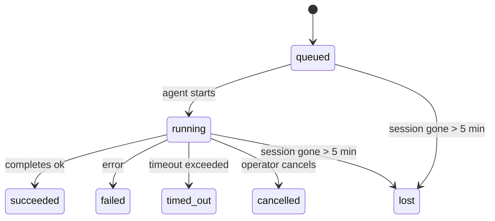

---
read_when:
    - بررسی کارهای پس‌زمینه در حال انجام یا اخیراً تکمیل‌شده
    - اشکال‌زدایی از شکست‌های تحویل در اجراهای جداشدهٔ عامل
    - درک اینکه اجراهای پس‌زمینه چگونه با جلسه‌ها، Cron و Heartbeat ارتباط دارند
sidebarTitle: Background tasks
summary: ردیابی کارهای پس‌زمینه برای اجراهای ACP، زیرعامل‌ها، کارهای Cron مجزا، و عملیات CLI
title: وظایف پس‌زمینه
x-i18n:
    generated_at: "2026-05-01T11:42:31Z"
    model: gpt-5.5
    provider: openai
    source_hash: 8782987a79989264ae3bd1ca4b16755bdfb7e295e4f77933bf3a38c136d837f4
    source_path: automation/tasks.md
    workflow: 16
---

<Note>
دنبال زمان‌بندی هستید؟ برای انتخاب سازوکار مناسب، [خودکارسازی و وظایف](/fa/automation) را ببینید. این صفحه دفتر ثبت فعالیت کارهای پس‌زمینه است، نه زمان‌بند.
</Note>

وظایف پس‌زمینه کارهایی را ردیابی می‌کنند که **خارج از نشست گفت‌وگوی اصلی شما** اجرا می‌شوند: اجراهای ACP، ایجاد عامل‌های فرعی، اجرای جداافتاده کارهای Cron، و عملیات‌هایی که از CLI آغاز شده‌اند.

وظایف جایگزین نشست‌ها، کارهای Cron یا Heartbeatها نمی‌شوند — آن‌ها **دفتر ثبت فعالیت** هستند که ثبت می‌کند چه کار جداشده‌ای رخ داده، چه زمانی رخ داده و آیا موفق بوده است یا نه.

<Note>
هر اجرای عامل یک وظیفه ایجاد نمی‌کند. نوبت‌های Heartbeat و گفت‌وگوی تعاملی عادی این کار را نمی‌کنند. همه اجراهای Cron، ایجادهای ACP، ایجادهای عامل فرعی و فرمان‌های عامل CLI این کار را انجام می‌دهند.
</Note>

## خلاصه

- وظایف **رکورد** هستند، نه زمان‌بند — Cron و Heartbeat تصمیم می‌گیرند کار _چه زمانی_ اجرا شود، وظایف ردیابی می‌کنند _چه اتفاقی افتاده است_.
- ACP، عامل‌های فرعی، همه کارهای Cron و عملیات CLI وظیفه ایجاد می‌کنند. نوبت‌های Heartbeat این کار را نمی‌کنند.
- هر وظیفه از مسیر `queued → running → terminal` عبور می‌کند (succeeded، failed، timed_out، cancelled یا lost).
- وظایف Cron تا وقتی زنده می‌مانند که زمان‌اجرای Cron هنوز مالک کار باشد؛ اگر
  وضعیت زمان‌اجرای درون‌حافظه‌ای از بین رفته باشد، نگهداشت وظیفه پیش از علامت‌گذاری یک وظیفه به‌عنوان lost، ابتدا تاریخچه پایدار اجرای Cron را بررسی می‌کند.
- تکمیل مبتنی بر ارسال است: کار جداشده می‌تواند مستقیما اطلاع دهد یا هنگام پایان،
  نشست/Heartbeat درخواست‌دهنده را بیدار کند، بنابراین حلقه‌های polling وضعیت
  معمولا شکل درستی نیستند.
- اجراهای جداافتاده Cron و تکمیل‌های عامل فرعی به‌صورت best-effort زبانه‌ها/فرایندهای مرورگر ردیابی‌شده را برای نشست فرزندشان پیش از حسابداری پاک‌سازی نهایی پاک می‌کنند.
- تحویل جداافتاده Cron پاسخ‌های میانی قدیمی والد را تا زمانی که کار عامل فرعی نواده هنوز در حال تخلیه است سرکوب می‌کند، و وقتی خروجی نهایی نواده پیش از تحویل برسد، آن را ترجیح می‌دهد.
- اعلان‌های تکمیل مستقیما به یک کانال تحویل داده می‌شوند یا برای Heartbeat بعدی در صف قرار می‌گیرند.
- `openclaw tasks list` همه وظایف را نشان می‌دهد؛ `openclaw tasks audit` مشکلات را آشکار می‌کند.
- رکوردهای پایانی ۷ روز نگه داشته می‌شوند، سپس به‌صورت خودکار پاک‌سازی می‌شوند.

## شروع سریع

<Tabs>
  <Tab title="List and filter">
    ```bash
    # List all tasks (newest first)
    openclaw tasks list

    # Filter by runtime or status
    openclaw tasks list --runtime acp
    openclaw tasks list --status running
    ```

  </Tab>
  <Tab title="Inspect">
    ```bash
    # Show details for a specific task (by ID, run ID, or session key)
    openclaw tasks show <lookup>
    ```
  </Tab>
  <Tab title="Cancel and notify">
    ```bash
    # Cancel a running task (kills the child session)
    openclaw tasks cancel <lookup>

    # Change notification policy for a task
    openclaw tasks notify <lookup> state_changes
    ```

  </Tab>
  <Tab title="Audit and maintenance">
    ```bash
    # Run a health audit
    openclaw tasks audit

    # Preview or apply maintenance
    openclaw tasks maintenance
    openclaw tasks maintenance --apply
    ```

  </Tab>
  <Tab title="Task flow">
    ```bash
    # Inspect TaskFlow state
    openclaw tasks flow list
    openclaw tasks flow show <lookup>
    openclaw tasks flow cancel <lookup>
    ```
  </Tab>
</Tabs>

## چه چیزی یک وظیفه ایجاد می‌کند

| منبع                   | نوع زمان‌اجرا | زمانی که رکورد وظیفه ایجاد می‌شود                       | سیاست اعلان پیش‌فرض |
| ---------------------- | ------------ | ------------------------------------------------------ | --------------------- |
| اجراهای پس‌زمینه ACP  | `acp`        | ایجاد یک نشست ACP فرزند                                | `done_only`           |
| هماهنگ‌سازی عامل فرعی | `subagent`   | ایجاد یک عامل فرعی از طریق `sessions_spawn`            | `done_only`           |
| کارهای Cron (همه انواع) | `cron`       | هر اجرای Cron (نشست اصلی و جداافتاده)                  | `silent`              |
| عملیات CLI             | `cli`        | فرمان‌های `openclaw agent` که از طریق Gateway اجرا می‌شوند | `silent`              |
| کارهای رسانه عامل      | `cli`        | اجراهای مبتنی بر نشست `music_generate`/`video_generate` | `silent`              |

<AccordionGroup>
  <Accordion title="Notify defaults for cron and media">
    وظایف Cron نشست اصلی به‌صورت پیش‌فرض از سیاست اعلان `silent` استفاده می‌کنند — آن‌ها رکوردهایی برای ردیابی ایجاد می‌کنند، اما اعلان تولید نمی‌کنند. وظایف Cron جداافتاده نیز به‌صورت پیش‌فرض `silent` هستند، اما چون در نشست خودشان اجرا می‌شوند، نمایان‌ترند.

    اجراهای مبتنی بر نشست `music_generate` و `video_generate` نیز از سیاست اعلان `silent` استفاده می‌کنند. آن‌ها همچنان رکوردهای وظیفه ایجاد می‌کنند، اما تکمیل به‌صورت یک بیدارسازی داخلی به نشست عامل اصلی برگردانده می‌شود تا عامل بتواند پیام پیگیری را بنویسد و رسانه تمام‌شده را خودش پیوست کند. اگر `tools.media.asyncCompletion.directSend` را فعال کنید، تکمیل‌های async `video_generate` می‌توانند ابتدا تحویل مستقیم به کانال را امتحان کنند؛ تکمیل‌های async `music_generate` در مسیر بیدارسازی نشست درخواست‌دهنده می‌مانند.

  </Accordion>
  <Accordion title="Concurrent video_generate guardrail">
    وقتی یک وظیفه مبتنی بر نشست `video_generate` هنوز فعال است، ابزار همچنین مانند یک محافظ عمل می‌کند: فراخوانی‌های تکراری `video_generate` در همان نشست، به‌جای شروع یک تولید هم‌زمان دوم، وضعیت وظیفه فعال را برمی‌گردانند. وقتی از سمت عامل یک جست‌وجوی صریح پیشرفت/وضعیت می‌خواهید، از `action: "status"` استفاده کنید.
  </Accordion>
  <Accordion title="What does not create tasks">
    - نوبت‌های Heartbeat — نشست اصلی؛ [Heartbeat](/fa/gateway/heartbeat) را ببینید
    - نوبت‌های گفت‌وگوی تعاملی عادی
    - پاسخ‌های مستقیم `/command`

  </Accordion>
</AccordionGroup>

## چرخه عمر وظیفه



| وضعیت      | معنی آن                                                                  |
| ----------- | -------------------------------------------------------------------------- |
| `queued`    | ایجاد شده، در انتظار شروع عامل                                           |
| `running`   | نوبت عامل به‌صورت فعال در حال اجرا است                                   |
| `succeeded` | با موفقیت کامل شد                                                         |
| `failed`    | با خطا کامل شد                                                            |
| `timed_out` | از مهلت پیکربندی‌شده فراتر رفت                                           |
| `cancelled` | توسط اپراتور از طریق `openclaw tasks cancel` متوقف شد                    |
| `lost`      | زمان‌اجرا پس از یک دوره ارفاق ۵ دقیقه‌ای وضعیت پشتیبان معتبر را از دست داد |

گذارها به‌صورت خودکار رخ می‌دهند — وقتی اجرای عامل مرتبط پایان می‌یابد، وضعیت وظیفه برای مطابقت با آن به‌روزرسانی می‌شود.

تکمیل اجرای عامل برای رکوردهای وظیفه فعال مرجع است. یک اجرای جداشده موفق به‌صورت `succeeded` نهایی می‌شود، خطاهای معمول اجرا به‌صورت `failed` نهایی می‌شوند، و نتایج timeout یا abort به‌صورت `timed_out` نهایی می‌شوند. اگر اپراتور از قبل وظیفه را لغو کرده باشد، یا زمان‌اجرا از قبل یک وضعیت پایانی قوی‌تر مانند `failed`، `timed_out` یا `lost` ثبت کرده باشد، سیگنال موفقیت بعدی آن وضعیت پایانی را پایین‌تر نمی‌آورد.

`lost` از زمان‌اجرا آگاه است:

- وظایف ACP: فراداده نشست ACP فرزند پشتیبان ناپدید شد.
- وظایف عامل فرعی: نشست فرزند پشتیبان از مخزن عامل هدف ناپدید شد.
- وظایف Cron: زمان‌اجرای Cron دیگر کار را به‌عنوان فعال ردیابی نمی‌کند و تاریخچه پایدار اجرای Cron برای آن اجرا نتیجه پایانی نشان نمی‌دهد. audit آفلاین CLI وضعیت خالی زمان‌اجرای Cron درون‌فرایندی خودش را مرجع در نظر نمی‌گیرد.
- وظایف CLI: وظایف نشست فرزند جداافتاده از نشست فرزند استفاده می‌کنند؛ وظایف CLI مبتنی بر چت به‌جای آن از زمینه اجرای زنده استفاده می‌کنند، بنابراین ردیف‌های نشست کانال/گروه/مستقیم باقی‌مانده آن‌ها را زنده نگه نمی‌دارند. اجراهای `openclaw agent` مبتنی بر Gateway نیز از نتیجه اجرای خود نهایی می‌شوند، بنابراین اجراهای کامل‌شده تا وقتی جاروبگر آن‌ها را `lost` علامت بزند فعال نمی‌مانند.

## تحویل و اعلان‌ها

وقتی یک وظیفه به وضعیت پایانی می‌رسد، OpenClaw به شما اطلاع می‌دهد. دو مسیر تحویل وجود دارد:

**تحویل مستقیم** — اگر وظیفه یک هدف کانال داشته باشد (`requesterOrigin`)، پیام تکمیل مستقیما به همان کانال می‌رود (Telegram، Discord، Slack و غیره). برای تکمیل‌های عامل فرعی، OpenClaw همچنین در صورت وجود، مسیریابی thread/topic متصل را حفظ می‌کند و می‌تواند پیش از رها کردن تحویل مستقیم، یک `to` / حساب مفقود را از مسیر ذخیره‌شده نشست درخواست‌دهنده (`lastChannel` / `lastTo` / `lastAccountId`) پر کند.

**تحویل صف‌شده در نشست** — اگر تحویل مستقیم شکست بخورد یا هیچ مبدا تنظیم نشده باشد، به‌روزرسانی به‌عنوان یک رویداد سیستم در نشست درخواست‌دهنده صف می‌شود و در Heartbeat بعدی ظاهر می‌شود.

<Tip>
تکمیل وظیفه یک بیدارسازی فوری Heartbeat را فعال می‌کند تا نتیجه را سریع ببینید — لازم نیست تا تیک زمان‌بندی‌شده بعدی Heartbeat صبر کنید.
</Tip>

این یعنی گردش کار معمول مبتنی بر ارسال است: کار جداشده را یک بار شروع کنید، سپس اجازه دهید زمان‌اجرا هنگام تکمیل شما را بیدار کند یا اطلاع دهد. وضعیت وظیفه را فقط زمانی polling کنید که به اشکال‌زدایی، مداخله یا audit صریح نیاز دارید.

### سیاست‌های اعلان

میزان اطلاع‌رسانی درباره هر وظیفه را کنترل کنید:

| سیاست                | آنچه تحویل داده می‌شود                                                |
| --------------------- | ----------------------------------------------------------------------- |
| `done_only` (پیش‌فرض) | فقط وضعیت پایانی (succeeded، failed و غیره) — **این حالت پیش‌فرض است** |
| `state_changes`       | هر گذار وضعیت و به‌روزرسانی پیشرفت                                   |
| `silent`              | هیچ چیز                                                                 |

سیاست را در حین اجرای وظیفه تغییر دهید:

```bash
openclaw tasks notify <lookup> state_changes
```

## مرجع CLI

<AccordionGroup>
  <Accordion title="tasks list">
    ```bash
    openclaw tasks list [--runtime <acp|subagent|cron|cli>] [--status <status>] [--json]
    ```

    ستون‌های خروجی: شناسه وظیفه، نوع، وضعیت، تحویل، شناسه اجرا، نشست فرزند، خلاصه.

  </Accordion>
  <Accordion title="tasks show">
    ```bash
    openclaw tasks show <lookup>
    ```

    توکن جست‌وجو یک شناسه وظیفه، شناسه اجرا یا کلید نشست را می‌پذیرد. رکورد کامل شامل زمان‌بندی، وضعیت تحویل، خطا و خلاصه پایانی را نشان می‌دهد.

  </Accordion>
  <Accordion title="tasks cancel">
    ```bash
    openclaw tasks cancel <lookup>
    ```

    برای وظایف ACP و عامل فرعی، این کار نشست فرزند را می‌کشد. برای وظایف ردیابی‌شده با CLI، لغو در رجیستری وظیفه ثبت می‌شود (دسته زمان‌اجرای فرزند جداگانه‌ای وجود ندارد). وضعیت به `cancelled` گذار می‌کند و در صورت کاربرد، اعلان تحویل ارسال می‌شود.

  </Accordion>
  <Accordion title="tasks notify">
    ```bash
    openclaw tasks notify <lookup> <done_only|state_changes|silent>
    ```
  </Accordion>
  <Accordion title="tasks audit">
    ```bash
    openclaw tasks audit [--json]
    ```

    مشکلات عملیاتی را آشکار می‌کند. یافته‌ها هنگام شناسایی مشکل‌ها در `openclaw status` نیز ظاهر می‌شوند.

    | یافته                   | شدت   | محرک                                                                                                      |
    | ------------------------- | ---------- | ------------------------------------------------------------------------------------------------------------ |
    | `stale_queued`            | هشدار       | بیش از ۱۰ دقیقه در صف مانده است                                                                              |
    | `stale_running`           | خطا      | بیش از ۳۰ دقیقه در حال اجرا بوده است                                                                             |
    | `lost`                    | هشدار/خطا | مالکیت وظیفه با پشتوانه runtime ناپدید شد؛ وظایف گم‌شده حفظ‌شده تا `cleanupAfter` هشدار می‌دهند و سپس به خطا تبدیل می‌شوند |
    | `delivery_failed`         | هشدار       | تحویل ناموفق بود و سیاست اعلان `silent` نیست                                                            |
    | `missing_cleanup`         | هشدار       | وظیفه پایانی بدون timestamp پاک‌سازی                                                                      |
    | `inconsistent_timestamps` | هشدار       | نقض خط زمانی (برای مثال، قبل از شروع پایان یافته است)                                                        |

  </Accordion>
  <Accordion title="نگهداری وظایف">
    ```bash
    openclaw tasks maintenance [--json]
    openclaw tasks maintenance --apply [--json]
    ```

    از این برای پیش‌نمایش یا اعمال همگام‌سازی مجدد، ثبت پاک‌سازی، و هرس کردن برای وظایف و وضعیت Task Flow استفاده کنید.

    همگام‌سازی مجدد از runtime آگاه است:

    - وظایف ACP/subagent نشست فرزند پشتیبان خود را بررسی می‌کنند.
    - وظایف subagent که نشست فرزندشان tombstone بازیابی پس از restart دارد، به‌جای اینکه به‌عنوان نشست‌های پشتیبان قابل بازیابی تلقی شوند، گم‌شده علامت‌گذاری می‌شوند.
    - وظایف Cron بررسی می‌کنند که آیا runtime کرون هنوز مالک job است یا نه، سپس پیش از fallback به `lost`، وضعیت پایانی را از لاگ‌های پایدارشده اجرای کرون/وضعیت job بازیابی می‌کنند. فقط فرایند Gateway برای مجموعه active-job درون‌حافظه‌ای کرون مرجع معتبر است؛ ممیزی CLI آفلاین از تاریخچه پایدار استفاده می‌کند اما یک وظیفه کرون را صرفا چون آن Set محلی خالی است گم‌شده علامت‌گذاری نمی‌کند.
    - وظایف CLI با پشتوانه chat، context اجرای زنده مالک را بررسی می‌کنند، نه فقط ردیف نشست chat.

    پاک‌سازی تکمیل نیز از runtime آگاه است:

    - تکمیل subagent با بهترین تلاش، پیش از ادامه پاک‌سازی اعلان، زبانه‌ها/فرایندهای مرورگر ردیابی‌شده برای نشست فرزند را می‌بندد.
    - تکمیل کرون ایزوله با بهترین تلاش، پیش از teardown کامل اجرا، زبانه‌ها/فرایندهای مرورگر ردیابی‌شده برای نشست کرون را می‌بندد.
    - تحویل کرون ایزوله در صورت نیاز منتظر follow-up مربوط به subagent فرزند می‌ماند و به‌جای اعلام متن تأیید والد stale، آن را سرکوب می‌کند.
    - تحویل تکمیل subagent آخرین متن قابل مشاهده assistant را ترجیح می‌دهد؛ اگر خالی باشد به آخرین متن پاک‌سازی‌شده tool/toolResult برمی‌گردد، و اجراهای tool-call فقط- timeout می‌توانند به یک خلاصه کوتاه پیشرفت جزئی فروکاسته شوند. اجراهای پایانی ناموفق، وضعیت failure را بدون replay کردن متن پاسخ ضبط‌شده اعلام می‌کنند.
    - شکست‌های پاک‌سازی نتیجه واقعی وظیفه را پنهان نمی‌کنند.

  </Accordion>
  <Accordion title="فهرست | نمایش | لغو جریان وظایف">
    ```bash
    openclaw tasks flow list [--status <status>] [--json]
    openclaw tasks flow show <lookup> [--json]
    openclaw tasks flow cancel <lookup>
    ```

    وقتی چیزی که برایتان مهم است Task Flow هماهنگ‌کننده است، نه یک رکورد تکی از وظیفه پس‌زمینه، از این‌ها استفاده کنید.

  </Accordion>
</AccordionGroup>

## تابلوی وظایف chat (`/tasks`)

در هر نشست chat از `/tasks` استفاده کنید تا وظایف پس‌زمینه مرتبط با آن نشست را ببینید. این تابلو وظایف فعال و تازه تکمیل‌شده را همراه با runtime، وضعیت، زمان‌بندی، و جزئیات پیشرفت یا خطا نشان می‌دهد.

وقتی نشست فعلی هیچ وظیفه مرتبط قابل مشاهده‌ای ندارد، `/tasks` به شمارش وظایف agent-local برمی‌گردد تا همچنان بدون نشت جزئیات نشست‌های دیگر، یک نمای کلی دریافت کنید.

برای دفترکل کامل operator، از CLI استفاده کنید: `openclaw tasks list`.

## یکپارچه‌سازی وضعیت (فشار وظایف)

`openclaw status` یک خلاصه سریع از وظایف را شامل می‌شود:

```
Tasks: 3 queued · 2 running · 1 issues
```

این خلاصه گزارش می‌دهد:

- **فعال** — شمار `queued` + `running`
- **شکست‌ها** — شمار `failed` + `timed_out` + `lost`
- **بر پایه runtime** — تفکیک بر اساس `acp`، `subagent`، `cron`، `cli`

هم `/status` و هم ابزار `session_status` از snapshot وظیفه آگاه از پاک‌سازی استفاده می‌کنند: وظایف فعال ترجیح داده می‌شوند، ردیف‌های تکمیل‌شده stale پنهان می‌شوند، و شکست‌های اخیر فقط وقتی نمایش داده می‌شوند که هیچ کار فعالی باقی نمانده باشد. این کار کارت وضعیت را روی آنچه همین حالا مهم است متمرکز نگه می‌دارد.

## ذخیره‌سازی و نگهداری

### وظایف کجا قرار دارند

رکوردهای وظیفه در SQLite در این مسیر پایدار می‌شوند:

```
$OPENCLAW_STATE_DIR/tasks/runs.sqlite
```

registry هنگام شروع gateway در حافظه بارگذاری می‌شود و برای ماندگاری بین restartها، نوشتن‌ها را با SQLite همگام می‌کند.
Gateway با استفاده از آستانه پیش‌فرض autocheckpoint در SQLite به‌علاوه checkpointهای دوره‌ای و shutdown از نوع `TRUNCATE`، لاگ write-ahead در SQLite را محدود نگه می‌دارد.

### نگهداری خودکار

یک sweeper هر **۶۰ ثانیه** اجرا می‌شود و چهار کار را انجام می‌دهد:

<Steps>
  <Step title="همگام‌سازی مجدد">
    بررسی می‌کند که آیا وظایف فعال هنوز پشتوانه runtime معتبر دارند یا نه. وظایف ACP/subagent از وضعیت نشست فرزند استفاده می‌کنند، وظایف کرون از مالکیت active-job استفاده می‌کنند، و وظایف CLI با پشتوانه chat از context اجرای مالک استفاده می‌کنند. اگر آن وضعیت پشتیبان بیش از ۵ دقیقه از بین رفته باشد، وظیفه `lost` علامت‌گذاری می‌شود.
  </Step>
  <Step title="ترمیم نشست ACP">
    نشست‌های ACP یک‌باره پایانی یا orphaned با مالکیت والد را می‌بندد، و نشست‌های ACP پایدار stale پایانی یا orphaned را فقط وقتی می‌بندد که هیچ binding گفت‌وگوی فعالی باقی نمانده باشد.
  </Step>
  <Step title="ثبت پاک‌سازی">
    یک timestamp با نام `cleanupAfter` روی وظایف پایانی تنظیم می‌کند (endedAt + ۷ روز). در طول دوره نگهداری، وظایف گم‌شده هنوز در ممیزی به‌عنوان هشدار ظاهر می‌شوند؛ پس از انقضای `cleanupAfter` یا وقتی metadata پاک‌سازی وجود ندارد، خطا هستند.
  </Step>
  <Step title="هرس کردن">
    رکوردهایی را که از تاریخ `cleanupAfter` خود گذشته‌اند حذف می‌کند.
  </Step>
</Steps>

<Note>
**نگهداری:** رکوردهای وظیفه پایانی به مدت **۷ روز** نگه داشته می‌شوند و سپس به‌صورت خودکار هرس می‌شوند. نیازی به پیکربندی نیست.
</Note>

## ارتباط وظایف با سیستم‌های دیگر

<AccordionGroup>
  <Accordion title="وظایف و Task Flow">
    [Task Flow](/fa/automation/taskflow) لایه هماهنگ‌سازی flow بالای وظایف پس‌زمینه است. یک flow واحد ممکن است در طول عمر خود چندین وظیفه را با استفاده از حالت‌های sync مدیریت‌شده یا mirrored هماهنگ کند. از `openclaw tasks` برای بازرسی رکوردهای وظیفه منفرد و از `openclaw tasks flow` برای بازرسی flow هماهنگ‌کننده استفاده کنید.

    برای جزئیات، [Task Flow](/fa/automation/taskflow) را ببینید.

  </Accordion>
  <Accordion title="وظایف و کرون">
    **definition** یک job کرون در `~/.openclaw/cron/jobs.json` قرار دارد؛ وضعیت اجرای runtime کنار آن در `~/.openclaw/cron/jobs-state.json` قرار دارد. **هر** اجرای کرون یک رکورد وظیفه ایجاد می‌کند، چه main-session و چه ایزوله. وظایف کرون main-session به‌صورت پیش‌فرض سیاست اعلان `silent` دارند تا بدون تولید اعلان ردیابی شوند.

    [Cron Jobs](/fa/automation/cron-jobs) را ببینید.

  </Accordion>
  <Accordion title="وظایف و heartbeat">
    اجراهای Heartbeat نوبت‌های main-session هستند؛ آن‌ها رکورد وظیفه ایجاد نمی‌کنند. وقتی یک وظیفه تکمیل می‌شود، می‌تواند یک wake در heartbeat راه‌اندازی کند تا نتیجه را بی‌درنگ ببینید.

    [Heartbeat](/fa/gateway/heartbeat) را ببینید.

  </Accordion>
  <Accordion title="وظایف و نشست‌ها">
    یک وظیفه ممکن است به `childSessionKey` (جایی که کار اجرا می‌شود) و `requesterSessionKey` (کسی که آن را شروع کرده) ارجاع دهد. نشست‌ها context گفت‌وگو هستند؛ وظایف ردیابی فعالیت روی آن هستند.
  </Accordion>
  <Accordion title="وظایف و اجراهای agent">
    `runId` یک وظیفه به اجرای agent که کار را انجام می‌دهد پیوند دارد. رویدادهای چرخه عمر agent (شروع، پایان، خطا) به‌صورت خودکار وضعیت وظیفه را به‌روزرسانی می‌کنند؛ لازم نیست چرخه عمر را دستی مدیریت کنید.
  </Accordion>
</AccordionGroup>

## مرتبط

- [اتوماسیون و وظایف](/fa/automation) — همه سازوکارهای اتوماسیون در یک نگاه
- [CLI: وظایف](/fa/cli/tasks) — مرجع دستور CLI
- [Heartbeat](/fa/gateway/heartbeat) — نوبت‌های دوره‌ای main-session
- [وظایف زمان‌بندی‌شده](/fa/automation/cron-jobs) — زمان‌بندی کار پس‌زمینه
- [Task Flow](/fa/automation/taskflow) — هماهنگ‌سازی flow بالای وظایف
