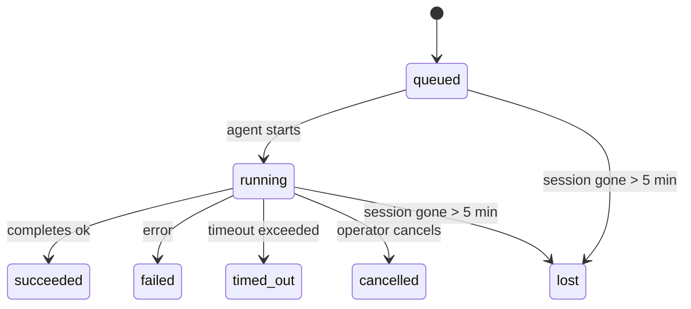

---
read_when:
    - بررسی کارهای پس‌زمینهٔ در حال انجام یا به‌تازگی تکمیل‌شده
    - اشکال‌زدایی از شکست‌های تحویل برای اجراهای جداشدهٔ عامل
    - درک چگونگی ارتباط اجراهای پس‌زمینه با نشست‌ها، Cron و Heartbeat
sidebarTitle: Background tasks
summary: ردیابی وظایف پس‌زمینه برای اجراهای ACP، زیرعامل‌ها، کارهای Cron ایزوله، و عملیات CLI
title: وظایف پس‌زمینه
x-i18n:
    generated_at: "2026-05-10T19:21:14Z"
    model: gpt-5.5
    provider: openai
    source_hash: 5764a89634f90181d826ff3990ec8dac9538239074934d30fd446c1eb4564869
    source_path: automation/tasks.md
    workflow: 16
---

<Note>
به‌دنبال زمان‌بندی هستید؟ برای انتخاب سازوکار مناسب، [اتوماسیون و وظیفه‌ها](/fa/automation) را ببینید. این صفحه دفتر ثبت فعالیت برای کارهای پس‌زمینه است، نه زمان‌بند.
</Note>

وظیفه‌های پس‌زمینه کارهایی را پیگیری می‌کنند که **خارج از نشست مکالمه اصلی شما** اجرا می‌شوند: اجراهای ACP، ایجاد زیرعامل‌ها، اجرای ایزوله‌شده کارهای Cron، و عملیات آغازشده از CLI.

وظیفه‌ها جایگزین نشست‌ها، کارهای Cron، یا Heartbeat نمی‌شوند - آن‌ها **دفتر ثبت فعالیت** هستند که ثبت می‌کند چه کار جداشده‌ای رخ داده، چه زمانی، و آیا موفق بوده است یا نه.

<Note>
هر اجرای عامل یک وظیفه ایجاد نمی‌کند. نوبت‌های Heartbeat و گفت‌وگوی تعاملی عادی این کار را نمی‌کنند. همه اجرای‌های Cron، ایجادهای ACP، ایجادهای زیرعامل، و فرمان‌های عامل CLI این کار را می‌کنند.
</Note>

## خلاصه کوتاه

- وظیفه‌ها **رکورد** هستند، نه زمان‌بند - Cron و Heartbeat تصمیم می‌گیرند کار _چه زمانی_ اجرا شود، وظیفه‌ها پیگیری می‌کنند _چه اتفاقی افتاد_.
- ACP، زیرعامل‌ها، همه کارهای Cron، و عملیات CLI وظیفه ایجاد می‌کنند. نوبت‌های Heartbeat این کار را نمی‌کنند.
- هر وظیفه از مسیر `queued → running → terminal` عبور می‌کند (موفق، ناموفق، زمان‌تمام‌شده، لغوشده، یا گم‌شده).
- وظیفه‌های Cron تا زمانی زنده می‌مانند که زمان‌اجرای Cron هنوز مالک کار باشد؛ اگر
  وضعیت زمان‌اجرای درون‌حافظه‌ای از بین رفته باشد، نگهداری وظیفه ابتدا سابقه پایدار اجرای Cron
  را بررسی می‌کند و سپس وظیفه را گم‌شده علامت‌گذاری می‌کند.
- تکمیل به‌صورت push-driven است: کار جداشده می‌تواند مستقیم اطلاع دهد یا هنگام پایان
  نشست درخواست‌کننده/Heartbeat را بیدار کند، بنابراین حلقه‌های نظرسنجی وضعیت
  معمولا شکل اشتباهی هستند.
- اجراهای ایزوله Cron و تکمیل‌های زیرعامل، به‌صورت best-effort زبانه‌ها/فرآیندهای مرورگرِ پیگیری‌شده را برای نشست فرزند خود پیش از ثبت نهایی پاک‌سازی حذف می‌کنند.
- تحویل ایزوله Cron پاسخ‌های موقت و کهنه والد را تا زمانی که کار زیرعاملِ نواده هنوز در حال تخلیه است سرکوب می‌کند، و وقتی خروجی نهایی نواده پیش از تحویل برسد، آن را ترجیح می‌دهد.
- اعلان‌های تکمیل مستقیم به یک کانال تحویل داده می‌شوند یا برای Heartbeat بعدی در صف قرار می‌گیرند.
- `openclaw tasks list` همه وظیفه‌ها را نشان می‌دهد؛ `openclaw tasks audit` مشکلات را آشکار می‌کند.
- رکوردهای نهایی برای ۷ روز نگه داشته می‌شوند، سپس به‌طور خودکار هرس می‌شوند.

## شروع سریع

<Tabs>
  <Tab title="فهرست و فیلتر">
    ```bash
    # List all tasks (newest first)
    openclaw tasks list

    # Filter by runtime or status
    openclaw tasks list --runtime acp
    openclaw tasks list --status running
    ```

  </Tab>
  <Tab title="بازرسی">
    ```bash
    # Show details for a specific task (by ID, run ID, or session key)
    openclaw tasks show <lookup>
    ```
  </Tab>
  <Tab title="لغو و اعلان">
    ```bash
    # Cancel a running task (kills the child session)
    openclaw tasks cancel <lookup>

    # Change notification policy for a task
    openclaw tasks notify <lookup> state_changes
    ```

  </Tab>
  <Tab title="ممیزی و نگهداری">
    ```bash
    # Run a health audit
    openclaw tasks audit

    # Preview or apply maintenance
    openclaw tasks maintenance
    openclaw tasks maintenance --apply
    ```

  </Tab>
  <Tab title="جریان وظیفه">
    ```bash
    # Inspect TaskFlow state
    openclaw tasks flow list
    openclaw tasks flow show <lookup>
    openclaw tasks flow cancel <lookup>
    ```
  </Tab>
</Tabs>

## چه چیزی وظیفه ایجاد می‌کند

| منبع                   | نوع زمان‌اجرا | زمانی که رکورد وظیفه ایجاد می‌شود                      | سیاست اعلان پیش‌فرض |
| ---------------------- | ------------ | ------------------------------------------------------ | --------------------- |
| اجراهای پس‌زمینه ACP   | `acp`        | ایجاد یک نشست فرزند ACP                                | `done_only`           |
| ارکستراسیون زیرعامل    | `subagent`   | ایجاد زیرعامل از طریق `sessions_spawn`                 | `done_only`           |
| کارهای Cron (همه انواع) | `cron`       | هر اجرای Cron (نشست اصلی و ایزوله)                     | `silent`              |
| عملیات CLI             | `cli`        | فرمان‌های `openclaw agent` که از طریق Gateway اجرا می‌شوند | `silent`              |
| کارهای رسانه‌ای عامل   | `cli`        | اجراهای مبتنی بر نشست `music_generate`/`video_generate` | `silent`              |

<AccordionGroup>
  <Accordion title="پیش‌فرض‌های اعلان برای Cron و رسانه">
    وظیفه‌های Cron در نشست اصلی به‌طور پیش‌فرض از سیاست اعلان `silent` استفاده می‌کنند - آن‌ها برای پیگیری رکورد ایجاد می‌کنند اما اعلان تولید نمی‌کنند. وظیفه‌های ایزوله Cron نیز به‌طور پیش‌فرض `silent` هستند، اما چون در نشست خودشان اجرا می‌شوند بیشتر قابل مشاهده‌اند.

    اجراهای مبتنی بر نشست `music_generate` و `video_generate` نیز از سیاست اعلان `silent` استفاده می‌کنند. آن‌ها همچنان رکورد وظیفه ایجاد می‌کنند، اما تکمیل به‌عنوان بیدارسازی داخلی به نشست عامل اصلی برگردانده می‌شود تا عامل بتواند پیام پیگیری را بنویسد و رسانه تکمیل‌شده را خودش پیوست کند. تکمیل‌های گروه/کانال از سیاست پاسخ قابل مشاهده عادی پیروی می‌کنند، بنابراین وقتی تحویل منبع به آن نیاز داشته باشد، عامل از ابزار پیام استفاده می‌کند. اگر عامل تکمیل در مسیر فقط-ابزار نتواند مدرک تحویل با ابزار پیام تولید کند، OpenClaw به‌جای خصوصی نگه داشتن رسانه، جایگزین تکمیل را مستقیم به کانال اصلی می‌فرستد.

  </Accordion>
  <Accordion title="محافظت اجرای هم‌زمان video_generate">
    تا زمانی که یک وظیفه مبتنی بر نشست `video_generate` هنوز فعال است، ابزار همچنین مانند یک محافظ عمل می‌کند: فراخوانی‌های تکراری `video_generate` در همان نشست، به‌جای شروع یک تولید هم‌زمان دوم، وضعیت وظیفه فعال را برمی‌گردانند. وقتی از سمت عامل به جست‌وجوی صریح پیشرفت/وضعیت نیاز دارید، از `action: "status"` استفاده کنید.
  </Accordion>
  <Accordion title="چه چیزی وظیفه ایجاد نمی‌کند">
    - نوبت‌های Heartbeat - نشست اصلی؛ [Heartbeat](/fa/gateway/heartbeat) را ببینید
    - نوبت‌های گفت‌وگوی تعاملی عادی
    - پاسخ‌های مستقیم `/command`

  </Accordion>
</AccordionGroup>

## چرخه عمر وظیفه



| وضعیت      | معنی آن                                                                 |
| ----------- | -------------------------------------------------------------------------- |
| `queued`    | ایجاد شده، در انتظار شروع عامل                                            |
| `running`   | نوبت عامل فعالانه در حال اجراست                                           |
| `succeeded` | با موفقیت تکمیل شد                                                        |
| `failed`    | با خطا تکمیل شد                                                           |
| `timed_out` | از زمان‌پایان پیکربندی‌شده فراتر رفت                                      |
| `cancelled` | توسط اپراتور از طریق `openclaw tasks cancel` متوقف شد                     |
| `lost`      | زمان‌اجرا پس از یک دوره مهلت ۵ دقیقه‌ای، وضعیت پشتیبان معتبر را از دست داد |

گذارها به‌طور خودکار رخ می‌دهند - وقتی اجرای عامل مرتبط پایان یابد، وضعیت وظیفه برای مطابقت به‌روزرسانی می‌شود.

تکمیل اجرای عامل برای رکوردهای وظیفه فعال مرجع معتبر است. یک اجرای جداشده موفق با `succeeded` نهایی می‌شود، خطاهای عادی اجرا با `failed` نهایی می‌شوند، و نتایج زمان‌پایان یا لغو با `timed_out` نهایی می‌شوند. اگر اپراتور قبلا وظیفه را لغو کرده باشد، یا زمان‌اجرا از قبل وضعیت نهایی قوی‌تری مانند `failed`، `timed_out`، یا `lost` ثبت کرده باشد، سیگنال موفقیت بعدی آن وضعیت نهایی را پایین‌تر نمی‌آورد.

`lost` نسبت به زمان‌اجرا آگاه است:

- وظیفه‌های ACP: فراداده نشست فرزند ACP پشتیبان ناپدید شد.
- وظیفه‌های زیرعامل: نشست فرزند پشتیبان از فروشگاه عامل هدف ناپدید شد.
- وظیفه‌های Cron: زمان‌اجرای Cron دیگر کار را فعال پیگیری نمی‌کند و سابقه پایدار
  اجرای Cron نتیجه نهایی برای آن اجرا نشان نمی‌دهد. ممیزی آفلاین CLI
  وضعیت خالی زمان‌اجرای Cron درون‌فرآیندی خودش را مرجع معتبر در نظر نمی‌گیرد.
- وظیفه‌های CLI: وظیفه‌هایی که شناسه اجرا/شناسه منبع دارند از زمینه اجرای زنده استفاده می‌کنند، بنابراین
  ردیف‌های باقی‌مانده نشست فرزند یا نشست گفت‌وگو، پس از ناپدید شدن
  اجرای تحت مالکیت Gateway، آن‌ها را زنده نگه نمی‌دارند. وظیفه‌های قدیمی CLI بدون هویت اجرا همچنان به نشست فرزند
  بازمی‌گردند. اجراهای `openclaw agent` مبتنی بر Gateway نیز
  از نتیجه اجرای خود نهایی می‌شوند، بنابراین اجراهای تکمیل‌شده تا زمانی که جاروب‌گر
  آن‌ها را `lost` علامت‌گذاری کند، فعال باقی نمی‌مانند.

## تحویل و اعلان‌ها

وقتی یک وظیفه به وضعیت نهایی می‌رسد، OpenClaw به شما اطلاع می‌دهد. دو مسیر تحویل وجود دارد:

**تحویل مستقیم** - اگر وظیفه هدف کانال داشته باشد (`requesterOrigin`)، پیام تکمیل مستقیم به همان کانال می‌رود (Telegram، Discord، Slack، و غیره). تکمیل‌های وظیفه گروه و کانال در عوض از طریق نشست درخواست‌کننده مسیریابی می‌شوند تا عامل والد بتواند پاسخ قابل مشاهده را بنویسد. برای تکمیل‌های زیرعامل، OpenClaw همچنین مسیریابی نخ/موضوع متصل را در صورت وجود حفظ می‌کند و می‌تواند پیش از صرف‌نظر از تحویل مستقیم، مقدار `to` / حسابِ جاافتاده را از مسیر ذخیره‌شده نشست درخواست‌کننده (`lastChannel` / `lastTo` / `lastAccountId`) پر کند.

**تحویل صف‌شده در نشست** - اگر تحویل مستقیم شکست بخورد یا هیچ مبدا تنظیم نشده باشد، به‌روزرسانی به‌عنوان رویداد سیستم در نشست درخواست‌کننده در صف قرار می‌گیرد و در Heartbeat بعدی ظاهر می‌شود.

<Tip>
تکمیل وظیفه یک بیدارسازی فوری Heartbeat را فعال می‌کند تا نتیجه را سریع ببینید - لازم نیست تا تیک Heartbeat برنامه‌ریزی‌شده بعدی منتظر بمانید.
</Tip>

این یعنی گردش‌کار معمول مبتنی بر push است: کار جداشده را یک‌بار شروع کنید، سپس بگذارید زمان‌اجرا هنگام تکمیل شما را بیدار کند یا اطلاع دهد. وضعیت وظیفه را فقط وقتی نظرسنجی کنید که به اشکال‌زدایی، مداخله، یا ممیزی صریح نیاز دارید.

### سیاست‌های اعلان

کنترل کنید درباره هر وظیفه چقدر بشنوید:

| سیاست                | آنچه تحویل داده می‌شود                                                  |
| --------------------- | ----------------------------------------------------------------------- |
| `done_only` (پیش‌فرض) | فقط وضعیت نهایی (موفق، ناموفق، و غیره) - **این پیش‌فرض است**           |
| `state_changes`       | هر گذار وضعیت و به‌روزرسانی پیشرفت                                     |
| `silent`              | هیچ چیز                                                                 |

سیاست را هنگام اجرای وظیفه تغییر دهید:

```bash
openclaw tasks notify <lookup> state_changes
```

## مرجع CLI

<AccordionGroup>
  <Accordion title="tasks list">
    ```bash
    openclaw tasks list [--runtime <acp|subagent|cron|cli>] [--status <status>] [--json]
    ```

    ستون‌های خروجی: شناسه وظیفه، نوع، وضعیت، تحویل، شناسه اجرا، نشست فرزند، خلاصه.

  </Accordion>
  <Accordion title="tasks show">
    ```bash
    openclaw tasks show <lookup>
    ```

    توکن جست‌وجو یک شناسه وظیفه، شناسه اجرا، یا کلید نشست را می‌پذیرد. رکورد کامل شامل زمان‌بندی، وضعیت تحویل، خطا، و خلاصه نهایی را نشان می‌دهد.

  </Accordion>
  <Accordion title="tasks cancel">
    ```bash
    openclaw tasks cancel <lookup>
    ```

    برای وظیفه‌های ACP و زیرعامل، این فرمان نشست فرزند را می‌کشد. برای وظیفه‌های پیگیری‌شده با CLI، لغو در رجیستری وظیفه ثبت می‌شود (دسته زمان‌اجرای فرزند جداگانه‌ای وجود ندارد). وضعیت به `cancelled` گذار می‌کند و در صورت کاربرد، اعلان تحویل ارسال می‌شود.

  </Accordion>
  <Accordion title="tasks notify">
    ```bash
    openclaw tasks notify <lookup> <done_only|state_changes|silent>
    ```
  </Accordion>
  <Accordion title="tasks audit">
    ```bash
    openclaw tasks audit [--json]
    ```

    مشکلات عملیاتی را آشکار می‌کند. یافته‌ها هنگام شناسایی مشکل، در `openclaw status` نیز ظاهر می‌شوند.

    | یافته                   | شدت   | محرک                                                                                                      |
    | ------------------------- | ---------- | ------------------------------------------------------------------------------------------------------------ |
    | `stale_queued`            | warn       | بیش از ۱۰ دقیقه در صف مانده است                                                                              |
    | `stale_running`           | error      | بیش از ۳۰ دقیقه در حال اجرا بوده است                                                                             |
    | `lost`                    | warn/error | مالکیت taskِ پشتیبانی‌شده توسط runtime ناپدید شده است؛ taskهای گم‌شدهٔ نگه‌داری‌شده تا `cleanupAfter` هشدار می‌دهند، سپس به خطا تبدیل می‌شوند |
    | `delivery_failed`         | warn       | تحویل ناموفق بوده و سیاست اعلان `silent` نیست                                                            |
    | `missing_cleanup`         | warn       | task پایانی بدون timestamp پاک‌سازی                                                                      |
    | `inconsistent_timestamps` | warn       | نقض timeline (برای مثال قبل از شروع پایان یافته است)                                                        |

  </Accordion>
  <Accordion title="tasks maintenance">
    ```bash
    openclaw tasks maintenance [--json]
    openclaw tasks maintenance --apply [--json]
    ```

    از این برای پیش‌نمایش یا اعمال reconciliation، ثبت زمان پاک‌سازی، و هرس کردن taskها، وضعیت Task Flow، و ردیف‌های stale در registry نشست اجرای cron استفاده کنید.

    Reconciliation از runtime آگاه است:

    - taskهای ACP/subagent نشست فرزند پشتیبان خود را بررسی می‌کنند.
    - taskهای subagent که نشست فرزندشان tombstone بازیابی پس از restart دارد، به‌جای اینکه به‌عنوان نشست‌های پشتیبان قابل بازیابی در نظر گرفته شوند، lost علامت‌گذاری می‌شوند.
    - taskهای Cron بررسی می‌کنند که آیا cron runtime هنوز مالک job است یا نه، سپس پیش از fallback به `lost`، وضعیت پایانی را از logهای پایدارشدهٔ cron run/job state بازیابی می‌کنند. فقط فرایند Gateway برای مجموعهٔ in-memory active-job در cron مرجع معتبر است؛ audit آفلاین CLI از تاریخچهٔ durable استفاده می‌کند، اما یک cron task را صرفا به این دلیل که آن Set محلی خالی است lost علامت‌گذاری نمی‌کند.
    - taskهای CLI دارای run identity، run context زندهٔ مالک را بررسی می‌کنند، نه فقط ردیف‌های child-session یا chat-session.

    پاک‌سازی completion نیز از runtime آگاه است:

    - تکمیل subagent به‌صورت best-effort تب‌ها/فرایندهای browser رهگیری‌شده برای نشست فرزند را پیش از ادامهٔ پاک‌سازی اعلان می‌بندد.
    - تکمیل cron ایزوله به‌صورت best-effort تب‌ها/فرایندهای browser رهگیری‌شده برای نشست cron را پیش از tear down کامل run می‌بندد.
    - تحویل cron ایزوله در صورت نیاز منتظر پیگیری subagentهای descendant می‌ماند و متن acknowledgement والد stale را به‌جای اعلان کردن suppress می‌کند.
    - تحویل تکمیل subagent تازه‌ترین متن قابل مشاهدهٔ assistant را ترجیح می‌دهد؛ اگر خالی باشد، به تازه‌ترین متن tool/toolResult پاک‌سازی‌شده fallback می‌کند، و runهای tool-call فقط timeout می‌توانند به خلاصهٔ کوتاه partial-progress تبدیل شوند. runهای پایانی ناموفق، بدون replay کردن متن پاسخ ضبط‌شده، وضعیت failure را اعلام می‌کنند.
    - خطاهای پاک‌سازی نتیجهٔ واقعی task را پنهان نمی‌کنند.

    هنگام اعمال maintenance، OpenClaw همچنین ردیف‌های stale در session registry با الگوی `cron:<jobId>:run:<uuid>` را که بیش از ۷ روز قدمت دارند حذف می‌کند، در حالی که ردیف‌های cron jobهای در حال اجرا را حفظ می‌کند و ردیف‌های نشست غیر cron را دست‌نخورده می‌گذارد.

  </Accordion>
  <Accordion title="tasks flow list | show | cancel">
    ```bash
    openclaw tasks flow list [--status <status>] [--json]
    openclaw tasks flow show <lookup> [--json]
    openclaw tasks flow cancel <lookup>
    ```

    وقتی Task Flow هماهنگ‌کننده برایتان مهم است، نه یک رکورد جداگانهٔ background task، از این‌ها استفاده کنید.

  </Accordion>
</AccordionGroup>

## تابلوی task در chat (`/tasks`)

در هر نشست chat از `/tasks` استفاده کنید تا taskهای background مرتبط با آن نشست را ببینید. این تابلو taskهای فعال و اخیرا کامل‌شده را همراه با runtime، وضعیت، زمان‌بندی، و جزئیات پیشرفت یا خطا نشان می‌دهد.

وقتی نشست فعلی هیچ task مرتبط قابل مشاهده‌ای ندارد، `/tasks` به شمارش taskهای agent-local fallback می‌کند تا همچنان بدون افشای جزئیات نشست‌های دیگر یک نمای کلی دریافت کنید.

برای ledger کامل operator، از CLI استفاده کنید: `openclaw tasks list`.

## یکپارچه‌سازی وضعیت (فشار task)

`openclaw status` یک خلاصهٔ task در یک نگاه را شامل می‌شود:

```
Tasks: 3 queued · 2 running · 1 issues
```

این خلاصه گزارش می‌دهد:

- **active** - شمار `queued` + `running`
- **failures** - شمار `failed` + `timed_out` + `lost`
- **byRuntime** - تفکیک بر اساس `acp`، `subagent`، `cron`، `cli`

هر دو `/status` و ابزار `session_status` از snapshot task آگاه از پاک‌سازی استفاده می‌کنند: taskهای فعال ترجیح داده می‌شوند، ردیف‌های کامل‌شدهٔ stale پنهان می‌شوند، و failureهای اخیر فقط وقتی نمایش داده می‌شوند که هیچ کار فعالی باقی نمانده باشد. این کار status card را روی چیزی که همین حالا مهم است متمرکز نگه می‌دارد.

## ذخیره‌سازی و maintenance

### taskها کجا قرار دارند

رکوردهای task در SQLite در این مسیر پایدار می‌شوند:

```
$OPENCLAW_STATE_DIR/tasks/runs.sqlite
```

Registry هنگام شروع gateway در حافظه load می‌شود و برای دوام در برابر restartها، نوشتن‌ها را با SQLite sync می‌کند.
Gateway با استفاده از آستانهٔ autocheckpoint پیش‌فرض SQLite به‌همراه checkpointهای دوره‌ای و هنگام shutdown با `TRUNCATE`، write-ahead log مربوط به SQLite را محدود نگه می‌دارد.

### maintenance خودکار

یک sweeper هر **۶۰ ثانیه** اجرا می‌شود و چهار مورد را مدیریت می‌کند:

<Steps>
  <Step title="Reconciliation">
    بررسی می‌کند که آیا taskهای فعال هنوز backing معتبر runtime دارند یا نه. taskهای ACP/subagent از وضعیت child-session استفاده می‌کنند، taskهای cron از مالکیت active-job، و taskهای CLI دارای run identity از run context مالک استفاده می‌کنند. اگر آن وضعیت backing بیش از ۵ دقیقه از بین رفته باشد، task با `lost` علامت‌گذاری می‌شود.
  </Step>
  <Step title="ACP session repair">
    نشست‌های one-shot ACP پایانی یا orphaned متعلق به parent را می‌بندد، و نشست‌های persistent ACP پایانی stale یا orphaned را فقط وقتی می‌بندد که هیچ binding گفت‌وگوی فعالی باقی نمانده باشد.
  </Step>
  <Step title="Cleanup stamping">
    روی taskهای پایانی یک timestamp با نام `cleanupAfter` تنظیم می‌کند (endedAt + ۷ روز). در طول retention، taskهای lost هنوز در audit به‌عنوان هشدار ظاهر می‌شوند؛ پس از منقضی شدن `cleanupAfter` یا وقتی metadata پاک‌سازی وجود ندارد، خطا هستند.
  </Step>
  <Step title="Pruning">
    رکوردهایی را که از تاریخ `cleanupAfter` خود گذشته‌اند حذف می‌کند.
  </Step>
</Steps>

<Note>
**Retention:** رکوردهای task پایانی به مدت **۷ روز** نگه داشته می‌شوند و سپس به‌صورت خودکار هرس می‌شوند. نیازی به پیکربندی نیست.
</Note>

## ارتباط taskها با سیستم‌های دیگر

<AccordionGroup>
  <Accordion title="Tasks and Task Flow">
    [Task Flow](/fa/automation/taskflow) لایهٔ orchestration جریان بالای background taskها است. یک flow واحد ممکن است در طول عمر خود چندین task را با استفاده از حالت‌های sync مدیریت‌شده یا mirrored هماهنگ کند. برای بررسی رکوردهای task جداگانه از `openclaw tasks` و برای بررسی flow هماهنگ‌کننده از `openclaw tasks flow` استفاده کنید.

    برای جزئیات، [Task Flow](/fa/automation/taskflow) را ببینید.

  </Accordion>
  <Accordion title="Tasks and cron">
    یک **تعریف** cron job در `~/.openclaw/cron/jobs.json` قرار دارد؛ وضعیت اجرای runtime کنار آن در `~/.openclaw/cron/jobs-state.json` قرار دارد. **هر** اجرای cron یک رکورد task ایجاد می‌کند - هم main-session و هم isolated. taskهای cron در main-session به‌صورت پیش‌فرض سیاست اعلان `silent` دارند تا بدون تولید اعلان رهگیری کنند.

    [Cron Jobs](/fa/automation/cron-jobs) را ببینید.

  </Accordion>
  <Accordion title="Tasks and heartbeat">
    اجراهای Heartbeat turnهای main-session هستند - آن‌ها رکورد task ایجاد نمی‌کنند. وقتی یک task کامل می‌شود، می‌تواند یک heartbeat wake را trigger کند تا نتیجه را به‌موقع ببینید.

    [Heartbeat](/fa/gateway/heartbeat) را ببینید.

  </Accordion>
  <Accordion title="Tasks and sessions">
    یک task ممکن است به `childSessionKey` (جایی که کار اجرا می‌شود) و `requesterSessionKey` (کسی که آن را شروع کرده است) اشاره کند. نشست‌ها context گفت‌وگو هستند؛ taskها tracking فعالیت روی آن هستند.
  </Accordion>
  <Accordion title="Tasks and agent runs">
    `runId` یک task به agent runای که کار را انجام می‌دهد لینک می‌شود. رویدادهای چرخهٔ عمر agent (شروع، پایان، خطا) به‌صورت خودکار وضعیت task را به‌روزرسانی می‌کنند - لازم نیست lifecycle را دستی مدیریت کنید.
  </Accordion>
</AccordionGroup>

## مرتبط

- [Automation & Tasks](/fa/automation) - همهٔ مکانیزم‌های automation در یک نگاه
- [CLI: Tasks](/fa/cli/tasks) - مرجع دستورهای CLI
- [Heartbeat](/fa/gateway/heartbeat) - turnهای دوره‌ای main-session
- [Scheduled Tasks](/fa/automation/cron-jobs) - زمان‌بندی کارهای background
- [Task Flow](/fa/automation/taskflow) - flow orchestration بالای taskها
