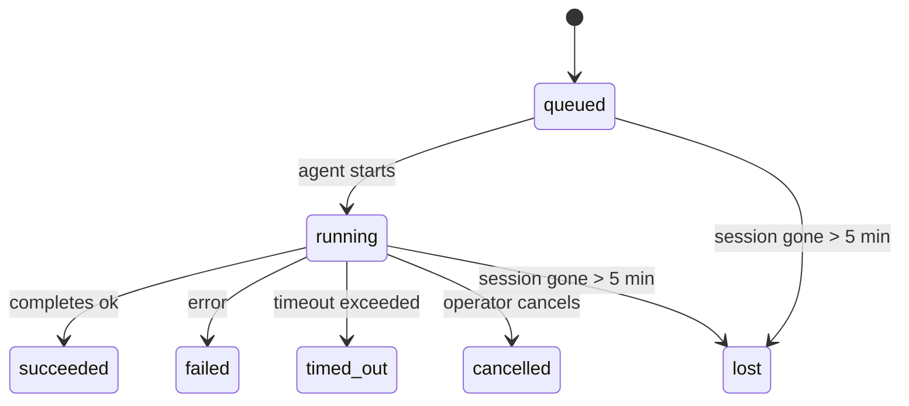

---
read_when:
    - بررسی کارهای پس‌زمینهٔ در حال انجام یا اخیراً تکمیل‌شده
    - اشکال‌زدایی از شکست‌های تحویل در اجراهای عامل جداشده
    - درک ارتباط اجراهای پس‌زمینه با نشست‌ها، Cron و Heartbeat
sidebarTitle: Background tasks
summary: ردیابی کارهای پس‌زمینه برای اجراهای ACP، زیرعامل‌ها، کارهای Cron ایزوله، و عملیات CLI
title: وظایف پس‌زمینه
x-i18n:
    generated_at: "2026-05-07T13:13:29Z"
    model: gpt-5.5
    provider: openai
    source_hash: a91a04ef6142e488d2fbc459d2c663afb93816a58fe9f52e0a51420703ea2d4d
    source_path: automation/tasks.md
    workflow: 16
---

<Note>
به‌دنبال زمان‌بندی هستید؟ برای انتخاب سازوکار مناسب، [اتوماسیون و وظایف](/fa/automation) را ببینید. این صفحه دفتر ثبت فعالیت برای کارهای پس‌زمینه است، نه زمان‌بند.
</Note>

وظایف پس‌زمینه کارهایی را ردیابی می‌کنند که **خارج از جلسه مکالمه اصلی شما** اجرا می‌شوند: اجراهای ACP، ایجاد زیروعامل‌ها، اجرای کارهای cron ایزوله، و عملیات آغازشده از CLI.

وظایف جایگزین جلسه‌ها، کارهای cron یا Heartbeat نمی‌شوند - آن‌ها **دفتر ثبت فعالیت** هستند که ثبت می‌کند چه کار جداشده‌ای رخ داده، چه زمانی، و آیا موفق بوده است یا نه.

<Note>
هر اجرای عامل یک وظیفه ایجاد نمی‌کند. نوبت‌های Heartbeat و گفت‌وگوی تعاملی معمولی این کار را نمی‌کنند. همه اجرای‌های cron، ایجادهای ACP، ایجادهای زیروعامل، و فرمان‌های عامل CLI این کار را می‌کنند.
</Note>

## خلاصه

- وظایف **رکورد** هستند، نه زمان‌بند - cron و Heartbeat تصمیم می‌گیرند کار _چه زمانی_ اجرا شود، وظایف ردیابی می‌کنند _چه اتفاقی افتاده است_.
- ACP، زیروعامل‌ها، همه کارهای cron، و عملیات CLI وظیفه ایجاد می‌کنند. نوبت‌های Heartbeat این کار را نمی‌کنند.
- هر وظیفه مسیر `queued → running → terminal` را طی می‌کند (succeeded، failed، timed_out، cancelled، یا lost).
- وظایف cron تا زمانی زنده می‌مانند که runtime کرون هنوز مالک کار باشد؛ اگر
  وضعیت runtime درون‌حافظه‌ای از بین رفته باشد، نگهداری وظیفه ابتدا تاریخچه پایدار اجرای cron
  را بررسی می‌کند و سپس وظیفه را lost علامت‌گذاری می‌کند.
- تکمیل، مبتنی بر push است: کار جداشده می‌تواند مستقیما اطلاع بدهد یا هنگام پایان،
  جلسه درخواست‌کننده/Heartbeat را بیدار کند، بنابراین حلقه‌های polling وضعیت
  معمولا شکل درستی ندارند.
- اجراهای cron ایزوله و تکمیل‌های زیروعامل، به‌صورت best-effort تب‌ها/فرایندهای مرورگر ردیابی‌شده را برای جلسه فرزند خود پیش از حسابداری پاک‌سازی نهایی تمیز می‌کنند.
- تحویل cron ایزوله، پاسخ‌های میانی قدیمی والد را تا وقتی کار زیروعامل نواده هنوز در حال تخلیه است سرکوب می‌کند، و وقتی خروجی نهایی نواده پیش از تحویل برسد، آن را ترجیح می‌دهد.
- اعلان‌های تکمیل مستقیما به یک کانال تحویل داده می‌شوند یا برای Heartbeat بعدی در صف قرار می‌گیرند.
- `openclaw tasks list` همه وظایف را نشان می‌دهد؛ `openclaw tasks audit` مشکلات را آشکار می‌کند.
- رکوردهای terminal به‌مدت ۷ روز نگهداری می‌شوند، سپس به‌طور خودکار prune می‌شوند.

## شروع سریع

<Tabs>
  <Tab title="فهرست و فیلتر">
    ```bash
    # List all tasks (newest first)
    openclaw tasks list

    # Filter by runtime or status
    openclaw tasks list --runtime acp
    openclaw tasks list --status running
    ```

  </Tab>
  <Tab title="بازرسی">
    ```bash
    # Show details for a specific task (by ID, run ID, or session key)
    openclaw tasks show <lookup>
    ```
  </Tab>
  <Tab title="لغو و اعلان">
    ```bash
    # Cancel a running task (kills the child session)
    openclaw tasks cancel <lookup>

    # Change notification policy for a task
    openclaw tasks notify <lookup> state_changes
    ```

  </Tab>
  <Tab title="ممیزی و نگهداری">
    ```bash
    # Run a health audit
    openclaw tasks audit

    # Preview or apply maintenance
    openclaw tasks maintenance
    openclaw tasks maintenance --apply
    ```

  </Tab>
  <Tab title="جریان وظیفه">
    ```bash
    # Inspect TaskFlow state
    openclaw tasks flow list
    openclaw tasks flow show <lookup>
    openclaw tasks flow cancel <lookup>
    ```
  </Tab>
</Tabs>

## چه چیزی وظیفه ایجاد می‌کند

| منبع                   | نوع runtime | زمانی که رکورد وظیفه ایجاد می‌شود                         | سیاست اعلان پیش‌فرض |
| ---------------------- | ------------ | ------------------------------------------------------ | --------------------- |
| اجراهای پس‌زمینه ACP   | `acp`        | ایجاد یک جلسه فرزند ACP                                | `done_only`           |
| ارکستراسیون زیروعامل   | `subagent`   | ایجاد یک زیروعامل از طریق `sessions_spawn`             | `done_only`           |
| کارهای cron (همه انواع) | `cron`       | هر اجرای cron (جلسه اصلی و ایزوله)                     | `silent`              |
| عملیات CLI             | `cli`        | فرمان‌های `openclaw agent` که از طریق Gateway اجرا می‌شوند | `silent`              |
| کارهای رسانه عامل      | `cli`        | اجراهای مبتنی بر جلسه `music_generate`/`video_generate` | `silent`              |

<AccordionGroup>
  <Accordion title="پیش‌فرض‌های اعلان برای cron و رسانه">
    وظایف cron جلسه اصلی به‌طور پیش‌فرض از سیاست اعلان `silent` استفاده می‌کنند - آن‌ها برای ردیابی رکورد ایجاد می‌کنند اما اعلان تولید نمی‌کنند. وظایف cron ایزوله نیز به‌طور پیش‌فرض `silent` هستند اما چون در جلسه خودشان اجرا می‌شوند، قابل‌مشاهده‌ترند.

    اجراهای مبتنی بر جلسه `music_generate` و `video_generate` نیز از سیاست اعلان `silent` استفاده می‌کنند. آن‌ها همچنان رکورد وظیفه ایجاد می‌کنند، اما تکمیل به‌صورت یک بیدارسازی داخلی به جلسه عامل اصلی برگردانده می‌شود تا عامل بتواند پیام پیگیری را بنویسد و رسانه تکمیل‌شده را خودش پیوست کند. تکمیل‌های گروه/کانال از سیاست پاسخ قابل‌مشاهده معمول پیروی می‌کنند، بنابراین وقتی تحویل مبدا آن را لازم داشته باشد، عامل از ابزار پیام استفاده می‌کند. اگر عامل تکمیل نتواند در یک مسیر فقط-ابزار مدرک تحویل ابزار پیام تولید کند، OpenClaw به‌جای خصوصی نگه داشتن رسانه، fallback تکمیل را مستقیما به کانال اصلی می‌فرستد.

  </Accordion>
  <Accordion title="محافظ هم‌زمانی video_generate">
    وقتی یک وظیفه مبتنی بر جلسه `video_generate` هنوز فعال است، ابزار همچنین به‌عنوان محافظ عمل می‌کند: فراخوانی‌های تکراری `video_generate` در همان جلسه، به‌جای شروع تولید هم‌زمان دوم، وضعیت وظیفه فعال را برمی‌گردانند. وقتی از سمت عامل به جست‌وجوی صریح پیشرفت/وضعیت نیاز دارید، از `action: "status"` استفاده کنید.
  </Accordion>
  <Accordion title="چه چیزهایی وظیفه ایجاد نمی‌کنند">
    - نوبت‌های Heartbeat - جلسه اصلی؛ [Heartbeat](/fa/gateway/heartbeat) را ببینید
    - نوبت‌های گفت‌وگوی تعاملی معمولی
    - پاسخ‌های مستقیم `/command`

  </Accordion>
</AccordionGroup>

## چرخه عمر وظیفه



| وضعیت      | معنی آن                                                                   |
| ----------- | -------------------------------------------------------------------------- |
| `queued`    | ایجاد شده، در انتظار شروع عامل                                            |
| `running`   | نوبت عامل فعالانه در حال اجراست                                           |
| `succeeded` | با موفقیت تکمیل شد                                                        |
| `failed`    | با خطا تکمیل شد                                                           |
| `timed_out` | از مهلت پیکربندی‌شده فراتر رفت                                           |
| `cancelled` | توسط اپراتور با `openclaw tasks cancel` متوقف شد                          |
| `lost`      | runtime وضعیت پشتیبان معتبر را پس از دوره مهلت ۵ دقیقه‌ای از دست داد     |

گذارها به‌طور خودکار رخ می‌دهند - وقتی اجرای عامل مرتبط پایان می‌یابد، وضعیت وظیفه برای مطابقت به‌روزرسانی می‌شود.

تکمیل اجرای عامل برای رکوردهای وظیفه فعال مرجع معتبر است. یک اجرای جداشده موفق با `succeeded` نهایی می‌شود، خطاهای معمول اجرا با `failed` نهایی می‌شوند، و پیامدهای timeout یا abort با `timed_out` نهایی می‌شوند. اگر اپراتور پیش‌تر وظیفه را لغو کرده باشد، یا runtime پیش‌تر یک وضعیت terminal قوی‌تر مانند `failed`، `timed_out`، یا `lost` ثبت کرده باشد، سیگنال موفقیت دیرتر آن وضعیت terminal را کاهش نمی‌دهد.

`lost` از runtime آگاه است:

- وظایف ACP: فراداده جلسه فرزند ACP پشتیبان ناپدید شده است.
- وظایف زیروعامل: جلسه فرزند پشتیبان از ذخیره عامل هدف ناپدید شده است.
- وظایف cron: runtime کرون دیگر کار را به‌عنوان فعال ردیابی نمی‌کند و تاریخچه پایدار
  اجرای cron نتیجه terminal برای آن اجرا نشان نمی‌دهد. ممیزی CLI آفلاین،
  وضعیت runtime کرون درون‌فرایندی خالی خودش را مرجع معتبر محسوب نمی‌کند.
- وظایف CLI: وظایفی که شناسه اجرا/شناسه منبع دارند از زمینه اجرای زنده استفاده می‌کنند، بنابراین
  ردیف‌های باقی‌مانده جلسه فرزند یا جلسه گفت‌وگو پس از ناپدید شدن اجرای تحت مالکیت
  Gateway آن‌ها را زنده نگه نمی‌دارند. وظایف CLI قدیمی بدون هویت اجرا همچنان
  به جلسه فرزند fallback می‌کنند. اجراهای `openclaw agent` پشتیبانی‌شده با Gateway نیز
  از نتیجه اجرای خود نهایی می‌شوند، بنابراین اجراهای تکمیل‌شده فعال نمی‌مانند تا sweeper
  آن‌ها را `lost` علامت‌گذاری کند.

## تحویل و اعلان‌ها

وقتی یک وظیفه به وضعیت terminal می‌رسد، OpenClaw به شما اطلاع می‌دهد. دو مسیر تحویل وجود دارد:

**تحویل مستقیم** - اگر وظیفه یک هدف کانال داشته باشد (`requesterOrigin`)، پیام تکمیل مستقیما به همان کانال می‌رود (Telegram، Discord، Slack، و غیره). برای تکمیل‌های زیروعامل، OpenClaw همچنین در صورت وجود، مسیریابی thread/topic متصل را حفظ می‌کند و می‌تواند پیش از تسلیم شدن در تحویل مستقیم، `to` / حساب گم‌شده را از مسیر ذخیره‌شده جلسه درخواست‌کننده (`lastChannel` / `lastTo` / `lastAccountId`) پر کند.

**تحویل صف‌شده در جلسه** - اگر تحویل مستقیم شکست بخورد یا هیچ مبدا تنظیم نشده باشد، به‌روزرسانی به‌عنوان یک رویداد سیستمی در جلسه درخواست‌کننده در صف قرار می‌گیرد و در Heartbeat بعدی ظاهر می‌شود.

<Tip>
تکمیل وظیفه یک بیدارسازی Heartbeat فوری را راه‌اندازی می‌کند تا نتیجه را سریع ببینید - لازم نیست منتظر تیک زمان‌بندی‌شده بعدی Heartbeat بمانید.
</Tip>

این یعنی گردش‌کار معمول مبتنی بر push است: کار جداشده را یک‌بار شروع کنید، سپس بگذارید runtime هنگام تکمیل شما را بیدار کند یا اطلاع بدهد. وضعیت وظیفه را فقط زمانی poll کنید که به اشکال‌زدایی، مداخله، یا یک ممیزی صریح نیاز دارید.

### سیاست‌های اعلان

کنترل کنید درباره هر وظیفه چقدر بشنوید:

| سیاست                | آنچه تحویل داده می‌شود                                                   |
| --------------------- | ----------------------------------------------------------------------- |
| `done_only` (پیش‌فرض) | فقط وضعیت terminal (succeeded، failed، و غیره) - **این پیش‌فرض است** |
| `state_changes`       | هر گذار وضعیت و به‌روزرسانی پیشرفت                                      |
| `silent`              | هیچ چیز                                                                  |

سیاست را در زمان اجرای وظیفه تغییر دهید:

```bash
openclaw tasks notify <lookup> state_changes
```

## مرجع CLI

<AccordionGroup>
  <Accordion title="tasks list">
    ```bash
    openclaw tasks list [--runtime <acp|subagent|cron|cli>] [--status <status>] [--json]
    ```

    ستون‌های خروجی: شناسه وظیفه، نوع، وضعیت، تحویل، شناسه اجرا، جلسه فرزند، خلاصه.

  </Accordion>
  <Accordion title="tasks show">
    ```bash
    openclaw tasks show <lookup>
    ```

    توکن lookup یک شناسه وظیفه، شناسه اجرا، یا کلید جلسه را می‌پذیرد. رکورد کامل شامل زمان‌بندی، وضعیت تحویل، خطا، و خلاصه terminal را نشان می‌دهد.

  </Accordion>
  <Accordion title="tasks cancel">
    ```bash
    openclaw tasks cancel <lookup>
    ```

    برای وظایف ACP و زیروعامل، این کار جلسه فرزند را می‌کشد. برای وظایف ردیابی‌شده با CLI، لغو در registry وظیفه ثبت می‌شود (دستگیره runtime فرزند جداگانه‌ای وجود ندارد). وضعیت به `cancelled` گذار می‌کند و در صورت کاربرد، اعلان تحویل فرستاده می‌شود.

  </Accordion>
  <Accordion title="tasks notify">
    ```bash
    openclaw tasks notify <lookup> <done_only|state_changes|silent>
    ```
  </Accordion>
  <Accordion title="tasks audit">
    ```bash
    openclaw tasks audit [--json]
    ```

    مشکلات عملیاتی را آشکار می‌کند. یافته‌ها هنگام شناسایی مشکل در `openclaw status` نیز ظاهر می‌شوند.

    | یافته                    | شدت       | محرک                                                                                                      |
    | ------------------------- | ---------- | ------------------------------------------------------------------------------------------------------------ |
    | `stale_queued`            | هشدار      | بیش از ۱۰ دقیقه در صف مانده است                                                                              |
    | `stale_running`           | خطا        | بیش از ۳۰ دقیقه در حال اجرا بوده است                                                                             |
    | `lost`                    | هشدار/خطا | مالکیت وظیفه پشتیبانی‌شده توسط زمان اجرا ناپدید شده است؛ وظایف گم‌شده حفظ‌شده تا `cleanupAfter` هشدار می‌دهند، سپس به خطا تبدیل می‌شوند |
    | `delivery_failed`         | هشدار      | تحویل ناموفق بوده و سیاست اعلان `silent` نیست                                                            |
    | `missing_cleanup`         | هشدار      | وظیفه پایانی بدون مهر زمانی پاک‌سازی                                                                      |
    | `inconsistent_timestamps` | هشدار      | نقض خط زمانی (برای مثال قبل از شروع پایان یافته است)                                                        |

  </Accordion>
  <Accordion title="tasks maintenance">
    ```bash
    openclaw tasks maintenance [--json]
    openclaw tasks maintenance --apply [--json]
    ```

    از این برای پیش‌نمایش یا اعمال سازگارسازی، ثبت مهر پاک‌سازی، و هرس کردن وظایف و وضعیت Task Flow استفاده کنید.

    سازگارسازی از زمان اجرا آگاه است:

    - وظایف ACP/زیرعامل، نشست فرزند پشتیبان خود را بررسی می‌کنند.
    - وظایف زیرعاملی که نشست فرزندشان tombstone بازیابی پس از راه‌اندازی دوباره دارد، به‌جای اینکه به‌عنوان نشست‌های پشتیبان قابل بازیابی در نظر گرفته شوند، گم‌شده علامت‌گذاری می‌شوند.
    - وظایف Cron بررسی می‌کنند که آیا زمان اجرای cron هنوز مالک job است یا نه، سپس پیش از بازگشت به `lost`، وضعیت پایانی را از لاگ‌های اجرای cron/وضعیت job ماندگارشده بازیابی می‌کنند. فقط فرایند Gateway برای مجموعه active-job درون‌حافظه‌ای cron مرجع معتبر است؛ ممیزی آفلاین CLI از تاریخچه پایدار استفاده می‌کند اما یک وظیفه cron را صرفا به این دلیل که آن Set محلی خالی است گم‌شده علامت‌گذاری نمی‌کند.
    - وظایف CLI دارای هویت اجرا، زمینه اجرای زنده مالک را بررسی می‌کنند، نه فقط ردیف‌های نشست فرزند یا نشست گفت‌وگو را.

    پاک‌سازی تکمیل نیز از زمان اجرا آگاه است:

    - تکمیل زیرعامل، پیش از ادامه پاک‌سازی اعلان، با بهترین تلاش tabها/فرایندهای مرورگر رهگیری‌شده برای نشست فرزند را می‌بندد.
    - تکمیل cron ایزوله، پیش از اینکه اجرا کاملا جمع شود، با بهترین تلاش tabها/فرایندهای مرورگر رهگیری‌شده برای نشست cron را می‌بندد.
    - تحویل cron ایزوله در صورت نیاز منتظر پیگیری زیرعاملِ نواده می‌ماند و به‌جای اعلام آن، متن تأیید والد stale را سرکوب می‌کند.
    - تحویل تکمیل زیرعامل، تازه‌ترین متن قابل مشاهده assistant را ترجیح می‌دهد؛ اگر آن خالی باشد، به تازه‌ترین متن tool/toolResult پاک‌سازی‌شده بازمی‌گردد، و اجراهای tool-call صرفا timeout-only می‌توانند به یک خلاصه کوتاه از پیشرفت جزئی فشرده شوند. اجراهای پایانی ناموفق، وضعیت شکست را بدون بازپخش متن پاسخ ثبت‌شده اعلام می‌کنند.
    - شکست‌های پاک‌سازی نتیجه واقعی وظیفه را پنهان نمی‌کنند.

  </Accordion>
  <Accordion title="tasks flow list | show | cancel">
    ```bash
    openclaw tasks flow list [--status <status>] [--json]
    openclaw tasks flow show <lookup> [--json]
    openclaw tasks flow cancel <lookup>
    ```

    وقتی چیزی که برایتان مهم است Task Flow هماهنگ‌کننده است، نه یک رکورد منفرد از وظیفه پس‌زمینه، از این‌ها استفاده کنید.

  </Accordion>
</AccordionGroup>

## تابلوی وظایف چت (`/tasks`)

در هر نشست چت از `/tasks` استفاده کنید تا وظایف پس‌زمینه مرتبط با آن نشست را ببینید. تابلو، وظایف فعال و اخیرا تکمیل‌شده را همراه با زمان اجرا، وضعیت، زمان‌بندی، و جزئیات پیشرفت یا خطا نشان می‌دهد.

وقتی نشست فعلی هیچ وظیفه مرتبط قابل مشاهده‌ای ندارد، `/tasks` به شمارش وظایف محلی عامل بازمی‌گردد تا همچنان بدون افشای جزئیات نشست‌های دیگر، یک نمای کلی دریافت کنید.

برای دفتر کل کامل اپراتور، از CLI استفاده کنید: `openclaw tasks list`.

## یکپارچه‌سازی وضعیت (فشار وظیفه)

`openclaw status` یک خلاصه وظایف در یک نگاه دارد:

```
Tasks: 3 queued · 2 running · 1 issues
```

این خلاصه گزارش می‌دهد:

- **فعال** - شمار `queued` + `running`
- **شکست‌ها** - شمار `failed` + `timed_out` + `lost`
- **بر اساس زمان اجرا** - تفکیک بر اساس `acp`، `subagent`، `cron`، `cli`

هر دو `/status` و ابزار `session_status` از snapshot وظیفه آگاه از پاک‌سازی استفاده می‌کنند: وظایف فعال ترجیح داده می‌شوند، ردیف‌های تکمیل‌شده stale پنهان می‌شوند، و شکست‌های اخیر فقط وقتی نمایش داده می‌شوند که هیچ کار فعالی باقی نمانده باشد. این کار کارت وضعیت را روی چیزی که همین حالا مهم است متمرکز نگه می‌دارد.

## ذخیره‌سازی و نگهداری

### وظایف کجا قرار دارند

رکوردهای وظیفه در SQLite در مسیر زیر ماندگار می‌شوند:

```
$OPENCLAW_STATE_DIR/tasks/runs.sqlite
```

registry در زمان شروع gateway در حافظه بارگذاری می‌شود و برای دوام در میان راه‌اندازی‌های دوباره، نوشتن‌ها را با SQLite همگام می‌کند.
Gateway لاگ write-ahead مربوط به SQLite را با استفاده از آستانه autocheckpoint پیش‌فرض SQLite به‌علاوه checkpointهای دوره‌ای و هنگام خاموشی از نوع `TRUNCATE` محدود نگه می‌دارد.

### نگهداری خودکار

یک sweeper هر **۶۰ ثانیه** اجرا می‌شود و چهار کار انجام می‌دهد:

<Steps>
  <Step title="Reconciliation">
    بررسی می‌کند که آیا وظایف فعال هنوز پشتوانه معتبر زمان اجرا دارند یا نه. وظایف ACP/زیرعامل از وضعیت نشست فرزند استفاده می‌کنند، وظایف cron از مالکیت active-job استفاده می‌کنند، و وظایف CLI دارای هویت اجرا از زمینه اجرای مالک استفاده می‌کنند. اگر آن وضعیت پشتیبان بیش از ۵ دقیقه از بین رفته باشد، وظیفه `lost` علامت‌گذاری می‌شود.
  </Step>
  <Step title="ACP session repair">
    نشست‌های ACP یک‌باره متعلق به والد را که پایانی یا یتیم هستند می‌بندد، و نشست‌های ACP پایدارِ پایانی یا یتیمِ stale را فقط وقتی می‌بندد که هیچ اتصال گفت‌وگوی فعالی باقی نمانده باشد.
  </Step>
  <Step title="Cleanup stamping">
    روی وظایف پایانی یک مهر زمانی `cleanupAfter` تنظیم می‌کند (endedAt + ۷ روز). در طول دوره نگهداری، وظایف گم‌شده هنوز در ممیزی به‌صورت هشدار ظاهر می‌شوند؛ پس از منقضی شدن `cleanupAfter` یا وقتی metadata پاک‌سازی وجود نداشته باشد، خطا هستند.
  </Step>
  <Step title="Pruning">
    رکوردهایی را که از تاریخ `cleanupAfter` خود گذشته‌اند حذف می‌کند.
  </Step>
</Steps>

<Note>
**نگهداری:** رکوردهای وظایف پایانی به مدت **۷ روز** نگه داشته می‌شوند، سپس به‌طور خودکار هرس می‌شوند. هیچ پیکربندی لازم نیست.
</Note>

## ارتباط وظایف با سیستم‌های دیگر

<AccordionGroup>
  <Accordion title="Tasks and Task Flow">
    [Task Flow](/fa/automation/taskflow) لایه هماهنگ‌سازی جریان بالای وظایف پس‌زمینه است. یک جریان واحد ممکن است در طول عمر خود چندین وظیفه را با استفاده از حالت‌های همگام‌سازی مدیریت‌شده یا آینه‌شده هماهنگ کند. از `openclaw tasks` برای بررسی رکوردهای وظیفه منفرد و از `openclaw tasks flow` برای بررسی جریان هماهنگ‌کننده استفاده کنید.

    برای جزئیات، [Task Flow](/fa/automation/taskflow) را ببینید.

  </Accordion>
  <Accordion title="Tasks and cron">
    یک **تعریف** job مربوط به cron در `~/.openclaw/cron/jobs.json` قرار دارد؛ وضعیت اجرای زمان اجرا کنار آن در `~/.openclaw/cron/jobs-state.json` قرار دارد. **هر** اجرای cron یک رکورد وظیفه ایجاد می‌کند - هم main-session و هم ایزوله. وظایف cron مربوط به main-session به‌طور پیش‌فرض سیاست اعلان `silent` دارند تا بدون تولید اعلان، رهگیری کنند.

    [Cron Jobs](/fa/automation/cron-jobs) را ببینید.

  </Accordion>
  <Accordion title="Tasks and heartbeat">
    اجراهای Heartbeat نوبت‌های main-session هستند - آن‌ها رکورد وظیفه ایجاد نمی‌کنند. وقتی یک وظیفه تکمیل می‌شود، می‌تواند یک بیدارسازی Heartbeat را تحریک کند تا نتیجه را سریع ببینید.

    [Heartbeat](/fa/gateway/heartbeat) را ببینید.

  </Accordion>
  <Accordion title="Tasks and sessions">
    یک وظیفه ممکن است به یک `childSessionKey` (جایی که کار اجرا می‌شود) و یک `requesterSessionKey` (کسی که آن را شروع کرده است) ارجاع دهد. نشست‌ها زمینه گفت‌وگو هستند؛ وظایف رهگیری فعالیت روی آن هستند.
  </Accordion>
  <Accordion title="Tasks and agent runs">
    `runId` یک وظیفه به اجرای عاملی که کار را انجام می‌دهد پیوند می‌خورد. رویدادهای چرخه عمر عامل (شروع، پایان، خطا) به‌طور خودکار وضعیت وظیفه را به‌روزرسانی می‌کنند - نیازی نیست چرخه عمر را دستی مدیریت کنید.
  </Accordion>
</AccordionGroup>

## مرتبط

- [اتوماسیون و وظایف](/fa/automation) - همه سازوکارهای اتوماسیون در یک نگاه
- [CLI: وظایف](/fa/cli/tasks) - مرجع دستور CLI
- [Heartbeat](/fa/gateway/heartbeat) - نوبت‌های دوره‌ای main-session
- [وظایف زمان‌بندی‌شده](/fa/automation/cron-jobs) - زمان‌بندی کار پس‌زمینه
- [Task Flow](/fa/automation/taskflow) - هماهنگ‌سازی جریان بالای وظایف
