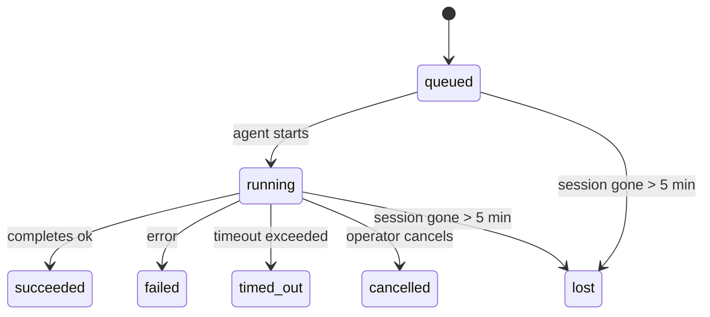

---
read_when:
    - بررسی کارهای پس‌زمینه در حال انجام یا اخیراً تکمیل‌شده
    - اشکال‌زدایی از شکست‌های تحویل در اجراهای جداشدهٔ عامل
    - درک اینکه اجراهای پس‌زمینه چه ارتباطی با جلسه‌ها، Cron و Heartbeat دارند
sidebarTitle: Background tasks
summary: ردیابی وظایف پس‌زمینه برای اجراهای ACP، زیرعامل‌ها، کارهای Cron مجزا، و عملیات CLI
title: وظایف پس‌زمینه
x-i18n:
    generated_at: "2026-04-30T16:28:04Z"
    model: gpt-5.5
    provider: openai
    source_hash: 999653c9360323d5135e33193c76458cba8c288227de46a6217f1ccbed2a6d34
    source_path: automation/tasks.md
    workflow: 16
---

<Note>
به‌دنبال زمان‌بندی هستید؟ برای انتخاب سازوکار درست، [اتوماسیون و وظایف](/fa/automation) را ببینید. این صفحه دفتر فعالیت کارهای پس‌زمینه است، نه زمان‌بند.
</Note>

وظایف پس‌زمینه کارهایی را دنبال می‌کنند که **بیرون از جلسه گفت‌وگوی اصلی شما** اجرا می‌شوند: اجراهای ACP، ایجاد زیرعامل‌ها، اجرای جداافتاده کارهای cron، و عملیات آغازشده با CLI.

وظایف جایگزین جلسه‌ها، کارهای cron، یا heartbeatها نمی‌شوند — آن‌ها **دفتر فعالیت** هستند که ثبت می‌کند چه کار جداشده‌ای انجام شده، چه زمانی، و آیا موفق بوده است یا نه.

<Note>
هر اجرای عامل یک وظیفه ایجاد نمی‌کند. نوبت‌های Heartbeat و گفت‌وگوی تعاملی معمولی این کار را نمی‌کنند. همه اجرای cron، ایجادهای ACP، ایجادهای زیرعامل، و فرمان‌های عامل CLI این کار را می‌کنند.
</Note>

## خلاصه سریع

- وظایف **رکورد** هستند، نه زمان‌بند — cron و heartbeat تعیین می‌کنند کار _چه زمانی_ اجرا شود، وظایف پیگیری می‌کنند _چه اتفاقی افتاده است_.
- ACP، زیرعامل‌ها، همه کارهای cron، و عملیات CLI وظیفه ایجاد می‌کنند. نوبت‌های Heartbeat این کار را نمی‌کنند.
- هر وظیفه از مسیر `queued → running → terminal` حرکت می‌کند (succeeded، failed، timed_out، cancelled، یا lost).
- وظایف Cron تا زمانی که runtime کرون هنوز مالک کار باشد زنده می‌مانند؛ اگر
  وضعیت runtime درون‌حافظه‌ای از بین رفته باشد، نگه‌داری وظیفه پیش از علامت‌گذاری یک وظیفه به‌عنوان lost،
  ابتدا تاریخچه پایدار اجرای cron را بررسی می‌کند.
- تکمیل به‌صورت push-driven است: کار جداشده می‌تواند مستقیما اطلاع دهد یا هنگام پایان،
  جلسه/heartbeat درخواست‌کننده را بیدار کند، بنابراین حلقه‌های status polling
  معمولا شکل درستی نیستند.
- اجراهای جداافتاده cron و تکمیل‌های زیرعامل با بهترین تلاش تب‌ها/فرایندهای مرورگر ردیابی‌شده برای جلسه فرزند خود را پیش از ثبت پاک‌سازی نهایی پاک می‌کنند.
- تحویل جداافتاده cron پاسخ‌های میانی کهنه والد را تا زمانی که کار زیرعاملِ نواده هنوز در حال تخلیه است سرکوب می‌کند، و اگر خروجی نهایی نواده پیش از تحویل برسد آن را ترجیح می‌دهد.
- اعلان‌های تکمیل مستقیما به یک کانال تحویل داده می‌شوند یا برای heartbeat بعدی در صف قرار می‌گیرند.
- `openclaw tasks list` همه وظایف را نشان می‌دهد؛ `openclaw tasks audit` مشکلات را آشکار می‌کند.
- رکوردهای نهایی ۷ روز نگه داشته می‌شوند، سپس به‌طور خودکار پاک‌سازی می‌شوند.

## شروع سریع

<Tabs>
  <Tab title="فهرست‌کردن و فیلترکردن">
    ```bash
    # List all tasks (newest first)
    openclaw tasks list

    # Filter by runtime or status
    openclaw tasks list --runtime acp
    openclaw tasks list --status running
    ```

  </Tab>
  <Tab title="بازرسی">
    ```bash
    # Show details for a specific task (by ID, run ID, or session key)
    openclaw tasks show <lookup>
    ```
  </Tab>
  <Tab title="لغو و اطلاع‌رسانی">
    ```bash
    # Cancel a running task (kills the child session)
    openclaw tasks cancel <lookup>

    # Change notification policy for a task
    openclaw tasks notify <lookup> state_changes
    ```

  </Tab>
  <Tab title="ممیزی و نگه‌داری">
    ```bash
    # Run a health audit
    openclaw tasks audit

    # Preview or apply maintenance
    openclaw tasks maintenance
    openclaw tasks maintenance --apply
    ```

  </Tab>
  <Tab title="جریان وظیفه">
    ```bash
    # Inspect TaskFlow state
    openclaw tasks flow list
    openclaw tasks flow show <lookup>
    openclaw tasks flow cancel <lookup>
    ```
  </Tab>
</Tabs>

## چه چیزی یک وظیفه ایجاد می‌کند

| منبع                 | نوع runtime | زمانی که رکورد وظیفه ایجاد می‌شود                          | سیاست اطلاع‌رسانی پیش‌فرض |
| ---------------------- | ------------ | ------------------------------------------------------ | --------------------- |
| اجراهای پس‌زمینه ACP    | `acp`        | ایجاد یک جلسه فرزند ACP                           | `done_only`           |
| هماهنگ‌سازی زیرعامل | `subagent`   | ایجاد یک زیرعامل از طریق `sessions_spawn`               | `done_only`           |
| کارهای Cron (همه انواع)  | `cron`       | هر اجرای cron (جلسه اصلی و جداافتاده)       | `silent`              |
| عملیات CLI         | `cli`        | فرمان‌های `openclaw agent` که از طریق gateway اجرا می‌شوند | `silent`              |
| کارهای رسانه عامل       | `cli`        | اجراهای `video_generate` مبتنی بر جلسه                   | `silent`              |

<AccordionGroup>
  <Accordion title="پیش‌فرض‌های اطلاع‌رسانی برای cron و رسانه">
    وظایف cron جلسه اصلی به‌طور پیش‌فرض از سیاست اطلاع‌رسانی `silent` استفاده می‌کنند — آن‌ها برای پیگیری رکورد ایجاد می‌کنند اما اعلان تولید نمی‌کنند. وظایف cron جداافتاده نیز به‌طور پیش‌فرض `silent` هستند، اما چون در جلسه خودشان اجرا می‌شوند بیشتر دیده می‌شوند.

    اجراهای `video_generate` مبتنی بر جلسه نیز از سیاست اطلاع‌رسانی `silent` استفاده می‌کنند. آن‌ها همچنان رکوردهای وظیفه ایجاد می‌کنند، اما تکمیل به‌صورت یک بیدارسازی داخلی به جلسه عامل اصلی برگردانده می‌شود تا عامل بتواند پیام پیگیری را بنویسد و ویدیوی تکمیل‌شده را خودش پیوست کند. اگر `tools.media.asyncCompletion.directSend` را فعال کنید، تکمیل‌های async `music_generate` و `video_generate` ابتدا تحویل مستقیم کانال را امتحان می‌کنند و سپس به مسیر بیدارسازی جلسه درخواست‌کننده برمی‌گردند.

  </Accordion>
  <Accordion title="محافظ اجرای هم‌زمان video_generate">
    تا زمانی که یک وظیفه `video_generate` مبتنی بر جلسه هنوز فعال است، ابزار نقش محافظ را هم دارد: فراخوانی‌های تکراری `video_generate` در همان جلسه، به‌جای شروع یک تولید هم‌زمان دوم، وضعیت وظیفه فعال را برمی‌گردانند. وقتی از سمت عامل به یک جست‌وجوی پیشرفت/وضعیت صریح نیاز دارید، از `action: "status"` استفاده کنید.
  </Accordion>
  <Accordion title="چه چیزهایی وظیفه ایجاد نمی‌کنند">
    - نوبت‌های Heartbeat — جلسه اصلی؛ [Heartbeat](/fa/gateway/heartbeat) را ببینید
    - نوبت‌های گفت‌وگوی تعاملی معمولی
    - پاسخ‌های مستقیم `/command`

  </Accordion>
</AccordionGroup>

## چرخه عمر وظیفه



| وضعیت      | معنی آن                                                              |
| ----------- | -------------------------------------------------------------------------- |
| `queued`    | ایجاد شده، در انتظار شروع عامل                                    |
| `running`   | نوبت عامل به‌طور فعال در حال اجرا است                                           |
| `succeeded` | با موفقیت تکمیل شد                                                     |
| `failed`    | با خطا تکمیل شد                                                    |
| `timed_out` | از مهلت پیکربندی‌شده فراتر رفت                                            |
| `cancelled` | توسط اپراتور از طریق `openclaw tasks cancel` متوقف شد                        |
| `lost`      | runtime پس از یک دوره ارفاق ۵ دقیقه‌ای وضعیت پشتیبان معتبر را از دست داد |

گذارها به‌طور خودکار رخ می‌دهند — وقتی اجرای عامل مرتبط پایان می‌یابد، وضعیت وظیفه برای مطابقت به‌روزرسانی می‌شود.

تکمیل اجرای عامل برای رکوردهای وظیفه فعال مرجع است. یک اجرای جداشده موفق به‌صورت `succeeded` نهایی می‌شود، خطاهای معمول اجرا به‌صورت `failed` نهایی می‌شوند، و نتایج timeout یا abort به‌صورت `timed_out` نهایی می‌شوند. اگر یک اپراتور قبلا وظیفه را لغو کرده باشد، یا runtime از قبل یک وضعیت نهایی قوی‌تر مانند `failed`، `timed_out`، یا `lost` را ثبت کرده باشد، سیگنال موفقیت بعدی آن وضعیت نهایی را تنزل نمی‌دهد.

`lost` نسبت به runtime آگاه است:

- وظایف ACP: فراداده جلسه فرزند ACP پشتیبان ناپدید شده است.
- وظایف زیرعامل: جلسه فرزند پشتیبان از مخزن عامل هدف ناپدید شده است.
- وظایف Cron: runtime کرون دیگر کار را به‌عنوان فعال ردیابی نمی‌کند و تاریخچه پایدار اجرای
  cron نتیجه نهایی برای آن اجرا نشان نمی‌دهد. ممیزی CLI آفلاین
  وضعیت خالی runtime کرون درون‌فرایندی خودش را مرجع تلقی نمی‌کند.
- وظایف CLI: وظایف جلسه فرزند جداافتاده از جلسه فرزند استفاده می‌کنند؛ وظایف CLI
  مبتنی بر چت به‌جای آن از زمینه اجرای زنده استفاده می‌کنند، بنابراین ردیف‌های جلسه
  کانال/گروه/مستقیمِ باقی‌مانده آن‌ها را زنده نگه نمی‌دارند. اجراهای
  `openclaw agent` مبتنی بر Gateway نیز از نتیجه اجرای خود نهایی می‌شوند، بنابراین اجراهای تکمیل‌شده
  تا زمانی که پاک‌ساز آن‌ها را `lost` علامت‌گذاری کند فعال نمی‌مانند.

## تحویل و اعلان‌ها

وقتی یک وظیفه به وضعیت نهایی می‌رسد، OpenClaw به شما اطلاع می‌دهد. دو مسیر تحویل وجود دارد:

**تحویل مستقیم** — اگر وظیفه هدف کانال داشته باشد (`requesterOrigin`)، پیام تکمیل مستقیما به آن کانال می‌رود (Telegram، Discord، Slack، و غیره). برای تکمیل‌های زیرعامل، OpenClaw همچنین مسیریابی thread/topic متصل را در صورت وجود حفظ می‌کند و می‌تواند پیش از صرف‌نظر از تحویل مستقیم، مقدار `to` / حسابِ گمشده را از مسیر ذخیره‌شده جلسه درخواست‌کننده (`lastChannel` / `lastTo` / `lastAccountId`) پر کند.

**تحویل صف‌شده در جلسه** — اگر تحویل مستقیم شکست بخورد یا هیچ مبدا تنظیم نشده باشد، به‌روزرسانی به‌عنوان یک رویداد سیستمی در جلسه درخواست‌کننده در صف قرار می‌گیرد و در heartbeat بعدی ظاهر می‌شود.

<Tip>
تکمیل وظیفه یک بیدارسازی فوری heartbeat را فعال می‌کند تا نتیجه را سریع ببینید — لازم نیست منتظر تیک heartbeat زمان‌بندی‌شده بعدی بمانید.
</Tip>

یعنی گردش کار معمول push-based است: کار جداشده را یک بار شروع کنید، سپس اجازه دهید runtime هنگام تکمیل شما را بیدار یا مطلع کند. وضعیت وظیفه را فقط زمانی poll کنید که به اشکال‌زدایی، مداخله، یا ممیزی صریح نیاز دارید.

### سیاست‌های اعلان

کنترل کنید از هر وظیفه چه مقدار خبر دریافت کنید:

| سیاست                | آنچه تحویل داده می‌شود                                                       |
| --------------------- | ----------------------------------------------------------------------- |
| `done_only` (پیش‌فرض) | فقط وضعیت نهایی (succeeded، failed، و غیره) — **این پیش‌فرض است** |
| `state_changes`       | هر گذار وضعیت و به‌روزرسانی پیشرفت                              |
| `silent`              | هیچ چیز                                                          |

سیاست را هنگام اجرای وظیفه تغییر دهید:

```bash
openclaw tasks notify <lookup> state_changes
```

## مرجع CLI

<AccordionGroup>
  <Accordion title="tasks list">
    ```bash
    openclaw tasks list [--runtime <acp|subagent|cron|cli>] [--status <status>] [--json]
    ```

    ستون‌های خروجی: شناسه وظیفه، نوع، وضعیت، تحویل، شناسه اجرا، جلسه فرزند، خلاصه.

  </Accordion>
  <Accordion title="tasks show">
    ```bash
    openclaw tasks show <lookup>
    ```

    توکن جست‌وجو یک شناسه وظیفه، شناسه اجرا، یا کلید جلسه را می‌پذیرد. رکورد کامل شامل زمان‌بندی، وضعیت تحویل، خطا، و خلاصه نهایی را نشان می‌دهد.

  </Accordion>
  <Accordion title="tasks cancel">
    ```bash
    openclaw tasks cancel <lookup>
    ```

    برای وظایف ACP و زیرعامل، این کار جلسه فرزند را می‌کشد. برای وظایف ردیابی‌شده با CLI، لغو در رجیستری وظیفه ثبت می‌شود (هیچ handle جداگانه‌ای برای runtime فرزند وجود ندارد). وضعیت به `cancelled` گذار می‌کند و در صورت کاربرد، اعلان تحویل ارسال می‌شود.

  </Accordion>
  <Accordion title="tasks notify">
    ```bash
    openclaw tasks notify <lookup> <done_only|state_changes|silent>
    ```
  </Accordion>
  <Accordion title="tasks audit">
    ```bash
    openclaw tasks audit [--json]
    ```

    مشکلات عملیاتی را آشکار می‌کند. یافته‌ها هنگام شناسایی مشکل در `openclaw status` نیز ظاهر می‌شوند.

    | یافته                   | شدت   | محرک                                                                                                      |
    | ------------------------- | ---------- | ------------------------------------------------------------------------------------------------------------ |
    | `stale_queued`            | warn       | بیش از ۱۰ دقیقه در صف مانده است                                                                              |
    | `stale_running`           | error      | بیش از ۳۰ دقیقه در حال اجرا بوده است                                                                             |
    | `lost`                    | warn/error | مالکیت وظیفهٔ پشتیبانی‌شده توسط زمان اجرا ناپدید شده است؛ وظایف گم‌شدهٔ نگه‌داری‌شده تا `cleanupAfter` هشدار می‌دهند و سپس به خطا تبدیل می‌شوند |
    | `delivery_failed`         | warn       | تحویل ناموفق بوده و سیاست اعلان `silent` نیست                                                            |
    | `missing_cleanup`         | warn       | وظیفهٔ پایانی بدون مهر زمانی پاک‌سازی                                                                      |
    | `inconsistent_timestamps` | warn       | نقض خط زمانی (برای مثال، پایان قبل از شروع)                                                        |

  </Accordion>
  <Accordion title="tasks maintenance">
    ```bash
    openclaw tasks maintenance [--json]
    openclaw tasks maintenance --apply [--json]
    ```

    از این برای پیش‌نمایش یا اعمال سازگارسازی، ثبت مهر پاک‌سازی، و هرس کردن وظایف و وضعیت گردش وظیفه استفاده کنید.

    سازگارسازی از زمان اجرا آگاه است:

    - وظایف ACP/زیرعامل، نشست فرزند پشتیبان خود را بررسی می‌کنند.
    - وظایف زیرعاملی که نشست فرزندشان سنگ‌قبر بازیابی پس از راه‌اندازی دوباره دارد، به‌جای این‌که به‌عنوان نشست‌های پشتیبان قابل بازیابی در نظر گرفته شوند، گم‌شده علامت‌گذاری می‌شوند.
    - وظایف Cron بررسی می‌کنند که آیا زمان اجرای cron هنوز مالک کار است یا نه، سپس پیش از بازگشت به `lost`، وضعیت پایانی را از گزارش‌های اجرای cron/وضعیت کارِ پایدارشده بازیابی می‌کنند. تنها فرایند Gateway برای مجموعهٔ کارهای فعال cron در حافظه مرجع معتبر است؛ ممیزی آفلاین CLI از تاریخچهٔ بادوام استفاده می‌کند اما یک وظیفهٔ cron را صرفا به‌دلیل خالی بودن آن Set محلی گم‌شده علامت‌گذاری نمی‌کند.
    - وظایف CLI پشتیبانی‌شده با چت، زمینهٔ اجرای زندهٔ مالک را بررسی می‌کنند، نه فقط ردیف نشست چت را.

    پاک‌سازی تکمیل نیز از زمان اجرا آگاه است:

    - تکمیل زیرعامل، تا حد امکان زبانه‌ها/فرایندهای مرورگرِ ردیابی‌شده برای نشست فرزند را پیش از ادامهٔ پاک‌سازی اعلان می‌بندد.
    - تکمیل cron ایزوله، تا حد امکان زبانه‌ها/فرایندهای مرورگرِ ردیابی‌شده برای نشست cron را پیش از برچیده شدن کامل اجرا می‌بندد.
    - تحویل cron ایزوله، در صورت نیاز منتظر پیگیری زیرعامل‌های فرزند می‌ماند و به‌جای اعلام آن، متن تأیید والدِ مانده را سرکوب می‌کند.
    - تحویل تکمیل زیرعامل، تازه‌ترین متن دستیارِ قابل مشاهده را ترجیح می‌دهد؛ اگر خالی باشد، به تازه‌ترین متن پاک‌سازی‌شدهٔ tool/toolResult برمی‌گردد، و اجراهای صرفا دارای فراخوانی ابزار که فقط با پایان مهلت متوقف شده‌اند می‌توانند به یک خلاصهٔ کوتاه از پیشرفت جزئی فروکاسته شوند. اجراهای پایانی ناموفق، وضعیت شکست را بدون بازپخش متن پاسخِ ضبط‌شده اعلام می‌کنند.
    - شکست‌های پاک‌سازی، نتیجهٔ واقعی وظیفه را پنهان نمی‌کنند.

  </Accordion>
  <Accordion title="tasks flow list | show | cancel">
    ```bash
    openclaw tasks flow list [--status <status>] [--json]
    openclaw tasks flow show <lookup> [--json]
    openclaw tasks flow cancel <lookup>
    ```

    وقتی چیزی که برایتان مهم است گردش وظیفهٔ هماهنگ‌کننده است، نه یک رکورد منفرد از وظیفهٔ پس‌زمینه، از این‌ها استفاده کنید.

  </Accordion>
</AccordionGroup>

## تابلوی وظایف چت (`/tasks`)

در هر نشست چت از `/tasks` استفاده کنید تا وظایف پس‌زمینهٔ پیوندخورده به آن نشست را ببینید. تابلو وظایف فعال و وظایف اخیرا تکمیل‌شده را همراه با زمان اجرا، وضعیت، زمان‌بندی، و جزئیات پیشرفت یا خطا نشان می‌دهد.

وقتی نشست فعلی هیچ وظیفهٔ پیوندخوردهٔ قابل مشاهده‌ای ندارد، `/tasks` به شمارش وظایف محلی عامل برمی‌گردد تا همچنان بدون افشای جزئیات نشست‌های دیگر، یک نمای کلی دریافت کنید.

برای دفتر کل کامل اپراتور، از CLI استفاده کنید: `openclaw tasks list`.

## یکپارچه‌سازی وضعیت (فشار وظیفه)

`openclaw status` یک خلاصهٔ سریع از وظایف را شامل می‌شود:

```
Tasks: 3 queued · 2 running · 1 issues
```

خلاصه گزارش می‌دهد:

- **فعال** — تعداد `queued` + `running`
- **شکست‌ها** — تعداد `failed` + `timed_out` + `lost`
- **بر اساس زمان اجرا** — تفکیک بر اساس `acp`، `subagent`، `cron`، `cli`

هم `/status` و هم ابزار `session_status` از یک تصویر فوریِ آگاه از پاک‌سازی برای وظایف استفاده می‌کنند: وظایف فعال ترجیح داده می‌شوند، ردیف‌های تکمیل‌شدهٔ مانده پنهان می‌شوند، و شکست‌های اخیر فقط وقتی نمایش داده می‌شوند که هیچ کار فعالی باقی نمانده باشد. این باعث می‌شود کارت وضعیت بر آنچه همین حالا مهم است متمرکز بماند.

## ذخیره‌سازی و نگه‌داری

### وظایف کجا نگه‌داری می‌شوند

رکوردهای وظیفه در SQLite در این مسیر پایدار می‌شوند:

```
$OPENCLAW_STATE_DIR/tasks/runs.sqlite
```

رجیستری هنگام شروع Gateway در حافظه بارگذاری می‌شود و برای دوام در راه‌اندازی‌های دوباره، نوشتن‌ها را با SQLite همگام می‌کند.
Gateway با استفاده از آستانهٔ پیش‌فرض autocheckpoint در SQLite به‌همراه checkpointهای دوره‌ای و هنگام خاموشی از نوع `TRUNCATE`، گزارش write-ahead در SQLite را محدود نگه می‌دارد.

### نگه‌داری خودکار

یک پاک‌روب هر **۶۰ ثانیه** اجرا می‌شود و چهار کار را انجام می‌دهد:

<Steps>
  <Step title="Reconciliation">
    بررسی می‌کند که آیا وظایف فعال هنوز پشتیبان معتبر زمان اجرا دارند یا نه. وظایف ACP/زیرعامل از وضعیت نشست فرزند استفاده می‌کنند، وظایف cron از مالکیت کار فعال استفاده می‌کنند، و وظایف CLI پشتیبانی‌شده با چت از زمینهٔ اجرای مالک استفاده می‌کنند. اگر آن وضعیت پشتیبان بیش از ۵ دقیقه از بین رفته باشد، وظیفه `lost` علامت‌گذاری می‌شود.
  </Step>
  <Step title="ACP session repair">
    نشست‌های ACP یک‌بارهٔ پایانی یا یتیمِ متعلق به والد را می‌بندد، و نشست‌های ACP پایدارِ پایانیِ مانده یا یتیم را فقط وقتی می‌بندد که هیچ اتصال گفت‌وگوی فعالی باقی نمانده باشد.
  </Step>
  <Step title="Cleanup stamping">
    روی وظایف پایانی یک مهر زمانی `cleanupAfter` تنظیم می‌کند (endedAt + ۷ روز). در طول دورهٔ نگه‌داری، وظایف گم‌شده همچنان در ممیزی به‌صورت هشدار ظاهر می‌شوند؛ پس از انقضای `cleanupAfter` یا وقتی فرادادهٔ پاک‌سازی موجود نباشد، خطا هستند.
  </Step>
  <Step title="Pruning">
    رکوردهایی را که از تاریخ `cleanupAfter` خود گذشته‌اند حذف می‌کند.
  </Step>
</Steps>

<Note>
**نگه‌داری:** رکوردهای وظایف پایانی به‌مدت **۷ روز** نگه داشته می‌شوند و سپس به‌صورت خودکار هرس می‌شوند. هیچ پیکربندی‌ای لازم نیست.
</Note>

## وظایف چگونه با سامانه‌های دیگر ارتباط دارند

<AccordionGroup>
  <Accordion title="Tasks and Task Flow">
    [گردش وظیفه](/fa/automation/taskflow) لایهٔ هماهنگ‌سازی جریان بالای وظایف پس‌زمینه است. یک جریان منفرد ممکن است در طول عمر خود با استفاده از حالت‌های همگام‌سازی مدیریت‌شده یا آینه‌ای، چندین وظیفه را هماهنگ کند. از `openclaw tasks` برای بررسی رکوردهای وظیفهٔ منفرد و از `openclaw tasks flow` برای بررسی جریان هماهنگ‌کننده استفاده کنید.

    برای جزئیات، [گردش وظیفه](/fa/automation/taskflow) را ببینید.

  </Accordion>
  <Accordion title="Tasks and cron">
    یک **تعریف** کار cron در `~/.openclaw/cron/jobs.json` قرار دارد؛ وضعیت اجرای زمان اجرا کنار آن در `~/.openclaw/cron/jobs-state.json` قرار می‌گیرد. **هر** اجرای cron یک رکورد وظیفه ایجاد می‌کند — چه نشست اصلی و چه ایزوله. وظایف cron نشست اصلی به‌طور پیش‌فرض سیاست اعلان `silent` دارند تا بدون ایجاد اعلان، ردیابی شوند.

    [کارهای Cron](/fa/automation/cron-jobs) را ببینید.

  </Accordion>
  <Accordion title="Tasks and heartbeat">
    اجراهای Heartbeat نوبت‌های نشست اصلی هستند — آن‌ها رکورد وظیفه ایجاد نمی‌کنند. وقتی یک وظیفه تکمیل می‌شود، می‌تواند یک بیدارباش Heartbeat را تحریک کند تا نتیجه را بی‌درنگ ببینید.

    [Heartbeat](/fa/gateway/heartbeat) را ببینید.

  </Accordion>
  <Accordion title="Tasks and sessions">
    یک وظیفه ممکن است به `childSessionKey` (جایی که کار اجرا می‌شود) و `requesterSessionKey` (کسی که آن را شروع کرده است) ارجاع دهد. نشست‌ها زمینهٔ گفت‌وگو هستند؛ وظایف، ردیابی فعالیت روی آن هستند.
  </Accordion>
  <Accordion title="Tasks and agent runs">
    `runId` یک وظیفه به اجرای عاملی که کار را انجام می‌دهد پیوند می‌خورد. رویدادهای چرخهٔ عمر عامل (شروع، پایان، خطا) به‌صورت خودکار وضعیت وظیفه را به‌روزرسانی می‌کنند — نیازی نیست چرخهٔ عمر را دستی مدیریت کنید.
  </Accordion>
</AccordionGroup>

## مرتبط

- [اتوماسیون و وظایف](/fa/automation) — همهٔ سازوکارهای اتوماسیون در یک نگاه
- [CLI: وظایف](/fa/cli/tasks) — مرجع فرمان‌های CLI
- [Heartbeat](/fa/gateway/heartbeat) — نوبت‌های دوره‌ای نشست اصلی
- [وظایف زمان‌بندی‌شده](/fa/automation/cron-jobs) — زمان‌بندی کار پس‌زمینه
- [گردش وظیفه](/fa/automation/taskflow) — هماهنگ‌سازی جریان بالای وظایف
