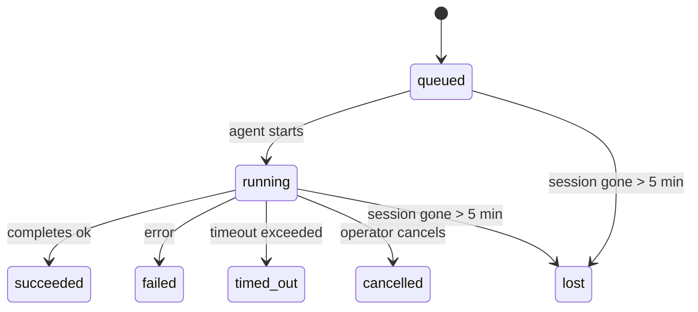

---
read_when:
    - بررسی کار پس‌زمینهٔ در حال انجام یا به‌تازگی تکمیل‌شده
    - اشکال‌زدایی از خطاهای تحویل برای اجراهای عامل جداشده
    - درک ارتباط اجراهای پس‌زمینه با نشست‌ها، Cron و Heartbeat
sidebarTitle: Background tasks
summary: ردیابی کارهای پس‌زمینه برای اجراهای ACP، زیرعامل‌ها، کارهای Cron ایزوله، و عملیات CLI
title: وظایف پس‌زمینه
x-i18n:
    generated_at: "2026-04-29T22:24:05Z"
    model: gpt-5.5
    provider: openai
    source_hash: 4bbf74f3aeea532738b56b83cd2e1a0a3734bfd453da6636b8be985a28ccc027
    source_path: automation/tasks.md
    workflow: 16
---

<Note>
به دنبال زمان‌بندی هستید؟ برای انتخاب سازوکار مناسب، [اتوماسیون و وظایف](/fa/automation) را ببینید. این صفحه دفتر فعالیت برای کارهای پس‌زمینه است، نه زمان‌بند.
</Note>

وظایف پس‌زمینه کارهایی را ردیابی می‌کنند که **بیرون از نشست گفت‌وگوی اصلی شما** اجرا می‌شوند: اجراهای ACP، ایجاد زیرعامل‌ها، اجرای کارهای cron ایزوله، و عملیات آغازشده از CLI.

وظایف جایگزین نشست‌ها، کارهای cron، یا heartbeatها نمی‌شوند — آن‌ها **دفتر فعالیتی** هستند که ثبت می‌کند چه کار جداشده‌ای رخ داده، چه زمانی، و آیا موفق بوده است یا نه.

<Note>
همه اجراهای عامل یک وظیفه ایجاد نمی‌کنند. نوبت‌های Heartbeat و گفت‌وگوی تعاملی عادی این کار را نمی‌کنند. همه اجراهای cron، ایجادهای ACP، ایجادهای زیرعامل، و فرمان‌های عامل CLI این کار را می‌کنند.
</Note>

## خلاصه

- وظایف **رکورد** هستند، نه زمان‌بند — cron و heartbeat تعیین می‌کنند کار _چه زمانی_ اجرا شود، وظایف ردیابی می‌کنند _چه اتفاقی افتاده است_.
- ACP، زیرعامل‌ها، همه کارهای cron، و عملیات CLI وظیفه ایجاد می‌کنند. نوبت‌های Heartbeat این کار را نمی‌کنند.
- هر وظیفه از مسیر `queued → running → terminal` عبور می‌کند (succeeded، failed، timed_out، cancelled، یا lost).
- وظایف cron تا زمانی که runtime مربوط به cron هنوز مالک کار است زنده می‌مانند؛ اگر
  وضعیت runtime درون‌حافظه‌ای از بین رفته باشد، نگهداری وظیفه ابتدا تاریخچه پایدار اجرای cron را بررسی می‌کند
  و بعد وظیفه را lost علامت‌گذاری می‌کند.
- تکمیل به‌صورت push-driven است: کار جداشده می‌تواند مستقیما اطلاع دهد یا
  نشست/heartbeat درخواست‌کننده را هنگام پایان بیدار کند، بنابراین حلقه‌های polling وضعیت
  معمولا شکل درستی نیستند.
- اجراهای cron ایزوله و تکمیل‌های زیرعامل به‌صورت best-effort تب‌ها/فرایندهای مرورگر ردیابی‌شده را برای نشست فرزند خود پیش از bookkeeping پاک‌سازی نهایی پاک می‌کنند.
- تحویل cron ایزوله پاسخ‌های موقت و کهنه والد را در حالی که کار زیرعاملِ نواده هنوز در حال تخلیه است سرکوب می‌کند، و وقتی خروجی نهایی نواده پیش از تحویل برسد آن را ترجیح می‌دهد.
- اعلان‌های تکمیل مستقیما به یک کانال تحویل داده می‌شوند یا برای heartbeat بعدی در صف قرار می‌گیرند.
- `openclaw tasks list` همه وظایف را نشان می‌دهد؛ `openclaw tasks audit` مشکلات را آشکار می‌کند.
- رکوردهای پایانی ۷ روز نگه داشته می‌شوند و سپس به‌طور خودکار هرس می‌شوند.

## شروع سریع

<Tabs>
  <Tab title="فهرست‌کردن و فیلترکردن">
    ```bash
    # List all tasks (newest first)
    openclaw tasks list

    # Filter by runtime or status
    openclaw tasks list --runtime acp
    openclaw tasks list --status running
    ```

  </Tab>
  <Tab title="بررسی">
    ```bash
    # Show details for a specific task (by ID, run ID, or session key)
    openclaw tasks show <lookup>
    ```
  </Tab>
  <Tab title="لغو و اعلان">
    ```bash
    # Cancel a running task (kills the child session)
    openclaw tasks cancel <lookup>

    # Change notification policy for a task
    openclaw tasks notify <lookup> state_changes
    ```

  </Tab>
  <Tab title="ممیزی و نگهداری">
    ```bash
    # Run a health audit
    openclaw tasks audit

    # Preview or apply maintenance
    openclaw tasks maintenance
    openclaw tasks maintenance --apply
    ```

  </Tab>
  <Tab title="جریان وظیفه">
    ```bash
    # Inspect TaskFlow state
    openclaw tasks flow list
    openclaw tasks flow show <lookup>
    openclaw tasks flow cancel <lookup>
    ```
  </Tab>
</Tabs>

## چه چیزی یک وظیفه ایجاد می‌کند

| منبع                   | نوع runtime | زمانی که رکورد وظیفه ایجاد می‌شود                       | سیاست اعلان پیش‌فرض |
| ---------------------- | ------------ | ------------------------------------------------------ | --------------------- |
| اجراهای پس‌زمینه ACP   | `acp`        | ایجاد یک نشست فرزند ACP                                | `done_only`           |
| هماهنگ‌سازی زیرعامل    | `subagent`   | ایجاد زیرعامل از طریق `sessions_spawn`                 | `done_only`           |
| کارهای cron (همه انواع) | `cron`       | هر اجرای cron (نشست اصلی و ایزوله)                     | `silent`              |
| عملیات CLI             | `cli`        | فرمان‌های `openclaw agent` که از طریق Gateway اجرا می‌شوند | `silent`              |
| کارهای رسانه عامل      | `cli`        | اجراهای `video_generate` پشتیبانی‌شده با نشست           | `silent`              |

<AccordionGroup>
  <Accordion title="پیش‌فرض‌های اعلان برای cron و رسانه">
    وظایف cron نشست اصلی به‌طور پیش‌فرض از سیاست اعلان `silent` استفاده می‌کنند — آن‌ها برای ردیابی رکورد ایجاد می‌کنند اما اعلان تولید نمی‌کنند. وظایف cron ایزوله نیز به‌طور پیش‌فرض `silent` هستند، اما چون در نشست خودشان اجرا می‌شوند قابل‌مشاهده‌ترند.

    اجراهای `video_generate` پشتیبانی‌شده با نشست نیز از سیاست اعلان `silent` استفاده می‌کنند. آن‌ها همچنان رکوردهای وظیفه ایجاد می‌کنند، اما تکمیل به‌عنوان یک بیدارسازی داخلی به نشست عامل اصلی برگردانده می‌شود تا عامل بتواند پیام پیگیری را بنویسد و ویدیوی پایان‌یافته را خودش پیوست کند. اگر `tools.media.asyncCompletion.directSend` را فعال کنید، تکمیل‌های async مربوط به `music_generate` و `video_generate` ابتدا تحویل مستقیم کانال را امتحان می‌کنند و سپس به مسیر بیدارسازی نشست درخواست‌کننده برمی‌گردند.

  </Accordion>
  <Accordion title="گاردریل همزمانی video_generate">
    در حالی که یک وظیفه `video_generate` پشتیبانی‌شده با نشست هنوز فعال است، این ابزار همچنین به‌عنوان یک گاردریل عمل می‌کند: فراخوانی‌های تکراری `video_generate` در همان نشست، به‌جای شروع یک تولید همزمان دوم، وضعیت وظیفه فعال را برمی‌گردانند. وقتی از سمت عامل به جست‌وجوی صریح پیشرفت/وضعیت نیاز دارید، از `action: "status"` استفاده کنید.
  </Accordion>
  <Accordion title="چه چیزهایی وظیفه ایجاد نمی‌کنند">
    - نوبت‌های Heartbeat — نشست اصلی؛ [Heartbeat](/fa/gateway/heartbeat) را ببینید
    - نوبت‌های گفت‌وگوی تعاملی عادی
    - پاسخ‌های مستقیم `/command`

  </Accordion>
</AccordionGroup>

## چرخه عمر وظیفه



| وضعیت       | معنای آن                                                                  |
| ----------- | -------------------------------------------------------------------------- |
| `queued`    | ایجاد شده، در انتظار شروع عامل                                            |
| `running`   | نوبت عامل فعالانه در حال اجراست                                           |
| `succeeded` | با موفقیت تکمیل شده است                                                   |
| `failed`    | با خطا تکمیل شده است                                                       |
| `timed_out` | از timeout پیکربندی‌شده عبور کرده است                                     |
| `cancelled` | توسط اپراتور از طریق `openclaw tasks cancel` متوقف شده است                |
| `lost`      | runtime پس از یک دوره مهلت ۵ دقیقه‌ای، وضعیت پشتیبان معتبر را از دست داده است |

انتقال‌ها به‌طور خودکار رخ می‌دهند — وقتی اجرای عامل مرتبط پایان یابد، وضعیت وظیفه متناسب با آن به‌روزرسانی می‌شود.

تکمیل اجرای عامل برای رکوردهای وظیفه فعال مرجع معتبر است. یک اجرای جداشده موفق با `succeeded` نهایی می‌شود، خطاهای معمول اجرا با `failed` نهایی می‌شوند، و نتایج timeout یا abort با `timed_out` نهایی می‌شوند. اگر اپراتور قبلا وظیفه را لغو کرده باشد، یا runtime از قبل وضعیت پایانی قوی‌تری مانند `failed`، `timed_out`، یا `lost` ثبت کرده باشد، سیگنال موفقیت بعدی آن وضعیت پایانی را پایین‌تر نمی‌آورد.

`lost` از runtime آگاه است:

- وظایف ACP: فراداده نشست فرزند ACP پشتیبان ناپدید شده است.
- وظایف زیرعامل: نشست فرزند پشتیبان از store عامل هدف ناپدید شده است.
- وظایف cron: runtime مربوط به cron دیگر کار را به‌عنوان فعال ردیابی نمی‌کند و تاریخچه پایدار
  اجرای cron نتیجه پایانی برای آن اجرا نشان نمی‌دهد. ممیزی CLI آفلاین
  وضعیت خالی runtime درون‌فرایندی خودش را مرجع معتبر تلقی نمی‌کند.
- وظایف CLI: وظایف نشست فرزند ایزوله از نشست فرزند استفاده می‌کنند؛ وظایف CLI
  پشتیبانی‌شده با chat در عوض از بافت اجرای زنده استفاده می‌کنند، بنابراین ردیف‌های ماندگار
  نشست channel/group/direct آن‌ها را زنده نگه نمی‌دارند. اجراهای
  `openclaw agent` پشتیبانی‌شده با Gateway نیز از نتیجه اجرای خود نهایی می‌شوند، بنابراین اجراهای تکمیل‌شده
  تا زمانی که sweeper آن‌ها را `lost` علامت‌گذاری کند فعال نمی‌مانند.

## تحویل و اعلان‌ها

وقتی یک وظیفه به وضعیت پایانی می‌رسد، OpenClaw به شما اطلاع می‌دهد. دو مسیر تحویل وجود دارد:

**تحویل مستقیم** — اگر وظیفه هدف کانال داشته باشد (`requesterOrigin`)، پیام تکمیل مستقیما به همان کانال می‌رود (Telegram، Discord، Slack، و غیره). برای تکمیل‌های زیرعامل، OpenClaw همچنین در صورت وجود، مسیریابی thread/topic متصل را حفظ می‌کند و می‌تواند پیش از منصرف‌شدن از تحویل مستقیم، `to` / حسابِ گمشده را از مسیر ذخیره‌شده نشست درخواست‌کننده (`lastChannel` / `lastTo` / `lastAccountId`) پر کند.

**تحویل صف‌شده در نشست** — اگر تحویل مستقیم شکست بخورد یا هیچ origin تنظیم نشده باشد، به‌روزرسانی به‌عنوان رویداد سیستمی در نشست درخواست‌کننده در صف قرار می‌گیرد و در heartbeat بعدی ظاهر می‌شود.

<Tip>
تکمیل وظیفه یک بیدارسازی فوری heartbeat را تحریک می‌کند تا نتیجه را سریع ببینید — لازم نیست منتظر tick زمان‌بندی‌شده بعدی heartbeat بمانید.
</Tip>

یعنی جریان کاری معمول push-based است: کار جداشده را یک‌بار شروع کنید، سپس اجازه دهید runtime هنگام تکمیل شما را بیدار کند یا به شما اطلاع دهد. وضعیت وظیفه را فقط وقتی poll کنید که به اشکال‌زدایی، مداخله، یا یک ممیزی صریح نیاز دارید.

### سیاست‌های اعلان

کنترل کنید درباره هر وظیفه چقدر بشنوید:

| سیاست                | آنچه تحویل داده می‌شود                                                |
| --------------------- | ----------------------------------------------------------------------- |
| `done_only` (پیش‌فرض) | فقط وضعیت پایانی (succeeded، failed، و غیره) — **این پیش‌فرض است** |
| `state_changes`       | هر انتقال وضعیت و به‌روزرسانی پیشرفت                                |
| `silent`              | هیچ‌چیز                                                               |

سیاست را هنگام اجرای یک وظیفه تغییر دهید:

```bash
openclaw tasks notify <lookup> state_changes
```

## مرجع CLI

<AccordionGroup>
  <Accordion title="tasks list">
    ```bash
    openclaw tasks list [--runtime <acp|subagent|cron|cli>] [--status <status>] [--json]
    ```

    ستون‌های خروجی: شناسه وظیفه، نوع، وضعیت، تحویل، شناسه اجرا، نشست فرزند، خلاصه.

  </Accordion>
  <Accordion title="tasks show">
    ```bash
    openclaw tasks show <lookup>
    ```

    توکن lookup یک شناسه وظیفه، شناسه اجرا، یا کلید نشست را می‌پذیرد. رکورد کامل شامل زمان‌بندی، وضعیت تحویل، خطا، و خلاصه پایانی را نشان می‌دهد.

  </Accordion>
  <Accordion title="tasks cancel">
    ```bash
    openclaw tasks cancel <lookup>
    ```

    برای وظایف ACP و زیرعامل، این کار نشست فرزند را می‌کشد. برای وظایف ردیابی‌شده با CLI، لغو در رجیستری وظیفه ثبت می‌شود (handle runtime فرزند جداگانه‌ای وجود ندارد). وضعیت به `cancelled` منتقل می‌شود و در صورت کاربرد، اعلان تحویل ارسال می‌شود.

  </Accordion>
  <Accordion title="tasks notify">
    ```bash
    openclaw tasks notify <lookup> <done_only|state_changes|silent>
    ```
  </Accordion>
  <Accordion title="tasks audit">
    ```bash
    openclaw tasks audit [--json]
    ```

    مشکلات عملیاتی را آشکار می‌کند. یافته‌ها وقتی مشکل شناسایی شود در `openclaw status` نیز ظاهر می‌شوند.

    | یافته                    | شدت       | محرک                                                                                                      |
    | ------------------------- | ---------- | ------------------------------------------------------------------------------------------------------------ |
    | `stale_queued`            | warn       | بیش از ۱۰ دقیقه در صف مانده است                                                                              |
    | `stale_running`           | error      | بیش از ۳۰ دقیقه در حال اجرا بوده است                                                                             |
    | `lost`                    | warn/error | مالکیت وظیفهٔ پشتیبانی‌شده با زمان اجرا ناپدید شده است؛ وظایف ازدست‌رفتهٔ نگه‌داشته‌شده تا `cleanupAfter` هشدار می‌دهند، سپس به خطا تبدیل می‌شوند |
    | `delivery_failed`         | warn       | تحویل ناموفق بود و سیاست اطلاع‌رسانی `silent` نیست                                                            |
    | `missing_cleanup`         | warn       | وظیفهٔ پایانی بدون زمان‌سنج پاک‌سازی                                                                      |
    | `inconsistent_timestamps` | warn       | نقض خط زمانی (برای مثال، پایان پیش از شروع)                                                        |

  </Accordion>
  <Accordion title="tasks maintenance">
    ```bash
    openclaw tasks maintenance [--json]
    openclaw tasks maintenance --apply [--json]
    ```

    از این برای پیش‌نمایش یا اعمال همگام‌سازی، ثبت زمان پاک‌سازی، و هرس کردن وظایف و وضعیت Task Flow استفاده کنید.

    همگام‌سازی از زمان اجرا آگاه است:

    - وظایف ACP/زیرعامل، نشست فرزند پشتیبان خود را بررسی می‌کنند.
    - وظایف Cron بررسی می‌کنند که آیا زمان اجرای cron هنوز مالک job است یا نه، سپس پیش از عقب‌نشینی به `lost`، وضعیت پایانی را از گزارش‌های اجرای cron/وضعیت job پایدارشده بازیابی می‌کنند. فقط فرایند Gateway مرجع معتبر برای مجموعهٔ درون‌حافظه‌ای jobهای فعال cron است؛ حسابرسی آفلاین CLI از تاریخچهٔ پایدار استفاده می‌کند، اما صرفاً به این دلیل که آن Set محلی خالی است، یک وظیفهٔ cron را ازدست‌رفته علامت‌گذاری نمی‌کند.
    - وظایف CLI پشتیبانی‌شده با چت، زمینهٔ اجرای زندهٔ مالک را بررسی می‌کنند، نه فقط ردیف نشست چت را.

    پاک‌سازی تکمیل نیز از زمان اجرا آگاه است:

    - تکمیل زیرعامل، پیش از ادامهٔ پاک‌سازی اعلان، با بیشترین تلاش زبانه‌ها/فرایندهای مرورگر ردیابی‌شده برای نشست فرزند را می‌بندد.
    - تکمیل cron ایزوله، پیش از اینکه اجرا کاملاً از بین برود، با بیشترین تلاش زبانه‌ها/فرایندهای مرورگر ردیابی‌شده برای نشست cron را می‌بندد.
    - تحویل cron ایزوله، در صورت نیاز منتظر پیگیری زیرعامل‌های نواده می‌ماند و به‌جای اعلام متن تأیید والد کهنه، آن را سرکوب می‌کند.
    - تحویل تکمیل زیرعامل، آخرین متن قابل‌مشاهدهٔ دستیار را ترجیح می‌دهد؛ اگر خالی باشد، به آخرین متن پاک‌سازی‌شدهٔ tool/toolResult عقب‌نشینی می‌کند، و اجراهای فراخوانی ابزار که فقط به مهلت زمانی رسیده‌اند می‌توانند به یک خلاصهٔ کوتاه از پیشرفت جزئی فشرده شوند. اجراهای پایانی ناموفق، وضعیت شکست را بدون پخش دوبارهٔ متن پاسخ ضبط‌شده اعلام می‌کنند.
    - شکست‌های پاک‌سازی، نتیجهٔ واقعی وظیفه را پنهان نمی‌کنند.

  </Accordion>
  <Accordion title="tasks flow list | show | cancel">
    ```bash
    openclaw tasks flow list [--status <status>] [--json]
    openclaw tasks flow show <lookup> [--json]
    openclaw tasks flow cancel <lookup>
    ```

    وقتی چیزی که برایتان مهم است Task Flow هماهنگ‌کننده است، نه یک رکورد منفرد از وظیفهٔ پس‌زمینه، از این‌ها استفاده کنید.

  </Accordion>
</AccordionGroup>

## تابلوی وظایف چت (`/tasks`)

برای دیدن وظایف پس‌زمینهٔ مرتبط با هر نشست چت، از `/tasks` استفاده کنید. این تابلو وظایف فعال و تازه‌تکمیل‌شده را همراه با زمان اجرا، وضعیت، زمان‌بندی، و جزئیات پیشرفت یا خطا نشان می‌دهد.

وقتی نشست فعلی هیچ وظیفهٔ پیوندخوردهٔ قابل‌مشاهده‌ای ندارد، `/tasks` به شمارش وظایف محلی عامل عقب‌نشینی می‌کند تا همچنان بدون افشای جزئیات نشست‌های دیگر، یک نمای کلی دریافت کنید.

برای دفترکل کامل اپراتور، از CLI استفاده کنید: `openclaw tasks list`.

## یکپارچه‌سازی وضعیت (فشار وظیفه)

`openclaw status` یک خلاصهٔ سریع از وظایف را شامل می‌شود:

```
Tasks: 3 queued · 2 running · 1 issues
```

این خلاصه گزارش می‌دهد:

- **فعال** — شمار `queued` + `running`
- **شکست‌ها** — شمار `failed` + `timed_out` + `lost`
- **بر اساس زمان اجرا** — تفکیک بر پایهٔ `acp`، `subagent`، `cron`، `cli`

هر دو `/status` و ابزار `session_status` از یک نمای فوری آگاه از پاک‌سازیِ وظایف استفاده می‌کنند: وظایف فعال ترجیح داده می‌شوند، ردیف‌های تکمیل‌شدهٔ کهنه پنهان می‌شوند، و شکست‌های اخیر فقط وقتی نمایش داده می‌شوند که هیچ کار فعالی باقی نمانده باشد. این باعث می‌شود کارت وضعیت روی چیزی متمرکز بماند که همین حالا مهم است.

## ذخیره‌سازی و نگه‌داری

### محل نگه‌داری وظایف

رکوردهای وظیفه در SQLite در این مسیر پایدار می‌شوند:

```
$OPENCLAW_STATE_DIR/tasks/runs.sqlite
```

رجیستری هنگام شروع Gateway در حافظه بارگذاری می‌شود و برای دوام در میان راه‌اندازی‌های دوباره، نوشتن‌ها را با SQLite همگام می‌کند.
Gateway با استفاده از آستانهٔ پیش‌فرض autocheckpoint در SQLite به‌همراه checkpointهای دوره‌ای و هنگام خاموشی از نوع `TRUNCATE`، گزارش write-ahead SQLite را محدود نگه می‌دارد.

### نگه‌داری خودکار

یک جاروبگر هر **۶۰ ثانیه** اجرا می‌شود و چهار کار را انجام می‌دهد:

<Steps>
  <Step title="Reconciliation">
    بررسی می‌کند که آیا وظایف فعال هنوز پشتیبانی معتبر زمان اجرا دارند یا نه. وظایف ACP/زیرعامل از وضعیت نشست فرزند استفاده می‌کنند، وظایف cron از مالکیت job فعال استفاده می‌کنند، و وظایف CLI پشتیبانی‌شده با چت از زمینهٔ اجرای مالک استفاده می‌کنند. اگر آن وضعیت پشتیبان بیش از ۵ دقیقه از بین رفته باشد، وظیفه با `lost` علامت‌گذاری می‌شود.
  </Step>
  <Step title="ACP session repair">
    نشست‌های ACP یک‌مرحله‌ایِ پایانی یا یتیمِ تحت مالکیت والد را می‌بندد، و نشست‌های ACP پایدارِ پایانی یا یتیم کهنه را فقط وقتی می‌بندد که هیچ اتصال گفت‌وگوی فعالی باقی نمانده باشد.
  </Step>
  <Step title="Cleanup stamping">
    روی وظایف پایانی یک زمان‌سنج `cleanupAfter` تنظیم می‌کند (endedAt + ۷ روز). در طول نگه‌داری، وظایف ازدست‌رفته همچنان در حسابرسی به‌عنوان هشدار ظاهر می‌شوند؛ پس از انقضای `cleanupAfter` یا وقتی فرادادهٔ پاک‌سازی وجود نداشته باشد، آن‌ها خطا هستند.
  </Step>
  <Step title="Pruning">
    رکوردهایی را که از تاریخ `cleanupAfter` خود گذشته‌اند حذف می‌کند.
  </Step>
</Steps>

<Note>
**نگه‌داری:** رکوردهای وظایف پایانی به مدت **۷ روز** نگه داشته می‌شوند و سپس به‌طور خودکار هرس می‌شوند. به هیچ پیکربندی‌ای نیاز نیست.
</Note>

## ارتباط وظایف با سامانه‌های دیگر

<AccordionGroup>
  <Accordion title="Tasks and Task Flow">
    [Task Flow](/fa/automation/taskflow) لایهٔ هماهنگ‌سازی جریان بالای وظایف پس‌زمینه است. یک جریان منفرد می‌تواند در طول عمر خود چندین وظیفه را با استفاده از حالت‌های همگام‌سازی مدیریت‌شده یا آینه‌ای هماهنگ کند. از `openclaw tasks` برای بررسی رکوردهای تک‌وظیفه‌ای و از `openclaw tasks flow` برای بررسی جریان هماهنگ‌کننده استفاده کنید.

    برای جزئیات، [Task Flow](/fa/automation/taskflow) را ببینید.

  </Accordion>
  <Accordion title="Tasks and cron">
    **تعریف** یک job مربوط به cron در `~/.openclaw/cron/jobs.json` قرار دارد؛ وضعیت اجرای زمان اجرا کنار آن در `~/.openclaw/cron/jobs-state.json` قرار دارد. **هر** اجرای cron یک رکورد وظیفه ایجاد می‌کند — هم نشست اصلی و هم ایزوله. وظایف cron نشست اصلی به‌طور پیش‌فرض سیاست اطلاع‌رسانی `silent` دارند تا بدون ایجاد اعلان ردیابی شوند.

    [Cron Jobs](/fa/automation/cron-jobs) را ببینید.

  </Accordion>
  <Accordion title="Tasks and heartbeat">
    اجراهای Heartbeat نوبت‌های نشست اصلی هستند — آن‌ها رکورد وظیفه ایجاد نمی‌کنند. وقتی یک وظیفه کامل می‌شود، می‌تواند یک بیدارباش Heartbeat را فعال کند تا نتیجه را بی‌درنگ ببینید.

    [Heartbeat](/fa/gateway/heartbeat) را ببینید.

  </Accordion>
  <Accordion title="Tasks and sessions">
    یک وظیفه ممکن است به یک `childSessionKey` (جایی که کار اجرا می‌شود) و یک `requesterSessionKey` (کسی که آن را شروع کرده است) اشاره کند. نشست‌ها زمینهٔ گفت‌وگو هستند؛ وظایف لایهٔ ردیابی فعالیت روی آن هستند.
  </Accordion>
  <Accordion title="Tasks and agent runs">
    `runId` یک وظیفه به اجرای عاملی که کار را انجام می‌دهد پیوند می‌خورد. رویدادهای چرخهٔ عمر عامل (شروع، پایان، خطا) به‌طور خودکار وضعیت وظیفه را به‌روزرسانی می‌کنند — نیازی نیست چرخهٔ عمر را به‌صورت دستی مدیریت کنید.
  </Accordion>
</AccordionGroup>

## مرتبط

- [اتوماسیون و وظایف](/fa/automation) — همهٔ سازوکارهای اتوماسیون در یک نگاه
- [CLI: وظایف](/fa/cli/tasks) — مرجع فرمان CLI
- [Heartbeat](/fa/gateway/heartbeat) — نوبت‌های دوره‌ای نشست اصلی
- [وظایف زمان‌بندی‌شده](/fa/automation/cron-jobs) — زمان‌بندی کارهای پس‌زمینه
- [Task Flow](/fa/automation/taskflow) — هماهنگ‌سازی جریان بالای وظایف
