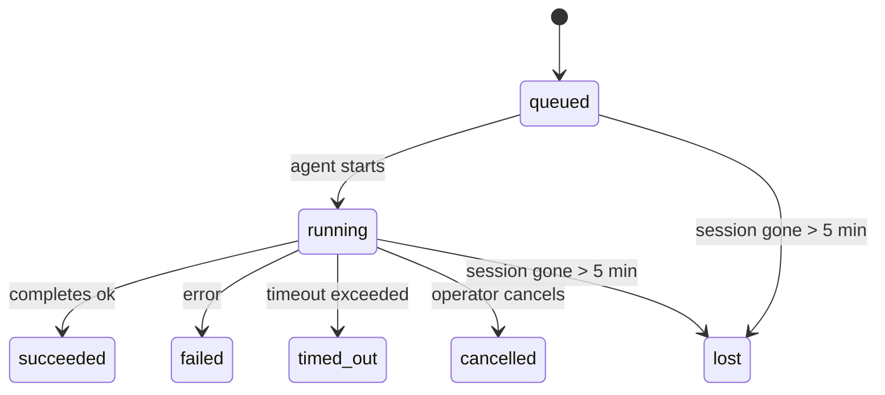

---
read_when:
    - بررسی کارهای پس‌زمینهٔ در حال انجام یا کارهایی که اخیراً تکمیل شده‌اند
    - اشکال‌زدایی خطاهای تحویل برای اجراهای جداشدهٔ عامل
    - درک اینکه اجراهای پس‌زمینه چگونه با نشست‌ها، Cron و Heartbeat مرتبط می‌شوند
sidebarTitle: Background tasks
summary: ردیابی وظایف پس‌زمینه برای اجراهای ACP، عامل‌های فرعی، کارهای Cron ایزوله‌شده، و عملیات CLI
title: وظایف پس‌زمینه
x-i18n:
    generated_at: "2026-05-05T06:16:17Z"
    model: gpt-5.5
    provider: openai
    source_hash: bafd959feaf2e220820ec56bf1ef144207d05757418e9971ebf427844cf30c46
    source_path: automation/tasks.md
    workflow: 16
---

<Note>
دنبال زمان‌بندی هستید؟ برای انتخاب سازوکار درست، [اتوماسیون و وظایف](/fa/automation) را ببینید. این صفحه دفتر ثبت فعالیت برای کارهای پس‌زمینه است، نه زمان‌بند.
</Note>

وظایف پس‌زمینه کارهایی را پیگیری می‌کنند که **بیرون از نشست گفت‌وگوی اصلی شما** اجرا می‌شوند: اجراهای ACP، راه‌اندازی زیرعامل‌ها، اجرای کارهای Cron ایزوله، و عملیات آغازشده از CLI.

وظایف جایگزین نشست‌ها، کارهای Cron، یا Heartbeatها **نیستند** — آن‌ها **دفتر ثبت فعالیت** هستند که ثبت می‌کند چه کار جداشده‌ای انجام شده، چه زمانی، و آیا موفق بوده است یا نه.

<Note>
هر اجرای عامل یک وظیفه ایجاد نمی‌کند. نوبت‌های Heartbeat و چت تعاملی معمولی این کار را نمی‌کنند. همه اجراهای Cron، راه‌اندازی‌های ACP، راه‌اندازی‌های زیرعامل، و فرمان‌های عامل CLI این کار را می‌کنند.
</Note>

## خلاصه

- وظایف **رکورد** هستند، نه زمان‌بند — Cron و Heartbeat تصمیم می‌گیرند کار _چه زمانی_ اجرا شود، وظایف پیگیری می‌کنند _چه اتفاقی افتاده است_.
- ACP، زیرعامل‌ها، همه کارهای Cron، و عملیات CLI وظیفه ایجاد می‌کنند. نوبت‌های Heartbeat این کار را نمی‌کنند.
- هر وظیفه از مسیر `queued → running → terminal` عبور می‌کند (succeeded، failed، timed_out، cancelled، یا lost).
- وظایف Cron تا زمانی زنده می‌مانند که runtime مربوط به Cron هنوز مالک کار باشد؛ اگر
  وضعیت runtime در حافظه از بین رفته باشد، نگه‌داری وظیفه پیش از علامت‌گذاری یک وظیفه به‌عنوان lost، ابتدا تاریخچه پایدار اجرای Cron را بررسی می‌کند.
- تکمیل به‌صورت push انجام می‌شود: کار جداشده می‌تواند مستقیما اطلاع‌رسانی کند یا پس از پایان، نشست/Heartbeat درخواست‌کننده را بیدار کند؛ بنابراین حلقه‌های polling وضعیت معمولا شکل درستی ندارند.
- اجراهای Cron ایزوله و تکمیل‌های زیرعامل، به‌صورت best-effort زبانه‌ها/فرایندهای مرورگر پیگیری‌شده را برای نشست فرزند خود پیش از bookkeeping پاک‌سازی نهایی پاک می‌کنند.
- تحویل Cron ایزوله، پاسخ‌های موقت قدیمی والد را تا زمانی که کار زیرعامل‌های نواده هنوز در حال تخلیه است سرکوب می‌کند، و وقتی خروجی نهایی نواده پیش از تحویل برسد، آن را ترجیح می‌دهد.
- اعلان‌های تکمیل مستقیما به یک کانال تحویل داده می‌شوند یا برای Heartbeat بعدی در صف قرار می‌گیرند.
- `openclaw tasks list` همه وظایف را نشان می‌دهد؛ `openclaw tasks audit` مشکلات را نمایان می‌کند.
- رکوردهای terminal به مدت ۷ روز نگه داشته می‌شوند، سپس به‌طور خودکار حذف می‌شوند.

## شروع سریع

<Tabs>
  <Tab title="فهرست‌کردن و فیلترکردن">
    ```bash
    # List all tasks (newest first)
    openclaw tasks list

    # Filter by runtime or status
    openclaw tasks list --runtime acp
    openclaw tasks list --status running
    ```

  </Tab>
  <Tab title="بازرسی">
    ```bash
    # Show details for a specific task (by ID, run ID, or session key)
    openclaw tasks show <lookup>
    ```
  </Tab>
  <Tab title="لغو و اطلاع‌رسانی">
    ```bash
    # Cancel a running task (kills the child session)
    openclaw tasks cancel <lookup>

    # Change notification policy for a task
    openclaw tasks notify <lookup> state_changes
    ```

  </Tab>
  <Tab title="ممیزی و نگه‌داری">
    ```bash
    # Run a health audit
    openclaw tasks audit

    # Preview or apply maintenance
    openclaw tasks maintenance
    openclaw tasks maintenance --apply
    ```

  </Tab>
  <Tab title="جریان وظیفه">
    ```bash
    # Inspect TaskFlow state
    openclaw tasks flow list
    openclaw tasks flow show <lookup>
    openclaw tasks flow cancel <lookup>
    ```
  </Tab>
</Tabs>

## چه چیزی یک وظیفه ایجاد می‌کند

| منبع                 | نوع runtime | زمانی که رکورد وظیفه ایجاد می‌شود                          | سیاست اعلان پیش‌فرض |
| ---------------------- | ------------ | ------------------------------------------------------ | --------------------- |
| اجراهای پس‌زمینه ACP    | `acp`        | راه‌اندازی یک نشست فرزند ACP                           | `done_only`           |
| هماهنگ‌سازی زیرعامل | `subagent`   | راه‌اندازی یک زیرعامل از طریق `sessions_spawn`               | `done_only`           |
| کارهای Cron (همه انواع)  | `cron`       | هر اجرای Cron (نشست اصلی و ایزوله)       | `silent`              |
| عملیات CLI         | `cli`        | فرمان‌های `openclaw agent` که از طریق Gateway اجرا می‌شوند | `silent`              |
| کارهای رسانه‌ای عامل       | `cli`        | اجراهای مبتنی بر نشست `music_generate`/`video_generate`  | `silent`              |

<AccordionGroup>
  <Accordion title="پیش‌فرض‌های اعلان برای Cron و رسانه">
    وظایف Cron نشست اصلی به‌طور پیش‌فرض از سیاست اعلان `silent` استفاده می‌کنند — آن‌ها برای پیگیری رکورد ایجاد می‌کنند اما اعلان تولید نمی‌کنند. وظایف Cron ایزوله نیز به‌طور پیش‌فرض `silent` هستند، اما چون در نشست خودشان اجرا می‌شوند، بیشتر دیده می‌شوند.

    اجراهای مبتنی بر نشست `music_generate` و `video_generate` نیز از سیاست اعلان `silent` استفاده می‌کنند. آن‌ها همچنان رکورد وظیفه ایجاد می‌کنند، اما تکمیل به‌صورت یک بیدارباش داخلی به نشست عامل اصلی برگردانده می‌شود تا عامل بتواند پیام پیگیری را بنویسد و خودش رسانه تمام‌شده را پیوست کند. تکمیل‌های گروه/کانال از سیاست معمول پاسخ قابل‌مشاهده پیروی می‌کنند، بنابراین وقتی تحویل منبع به آن نیاز داشته باشد، عامل از ابزار پیام استفاده می‌کند. اگر عامل تکمیل در یک مسیر فقط-ابزار نتواند شواهد تحویل ابزار پیام را تولید کند، OpenClaw به‌جای خصوصی گذاشتن رسانه، fallback تکمیل را مستقیما به کانال اصلی می‌فرستد.

  </Accordion>
  <Accordion title="محافظ هم‌زمانی video_generate">
    وقتی یک وظیفه مبتنی بر نشست `video_generate` هنوز فعال است، ابزار همچنین مانند یک محافظ عمل می‌کند: فراخوانی‌های تکراری `video_generate` در همان نشست، به‌جای شروع یک تولید هم‌زمان دوم، وضعیت وظیفه فعال را برمی‌گردانند. زمانی از `action: "status"` استفاده کنید که از سمت عامل به یک جست‌وجوی صریح پیشرفت/وضعیت نیاز دارید.
  </Accordion>
  <Accordion title="چه چیزی وظیفه ایجاد نمی‌کند">
    - نوبت‌های Heartbeat — نشست اصلی؛ [Heartbeat](/fa/gateway/heartbeat) را ببینید
    - نوبت‌های چت تعاملی معمولی
    - پاسخ‌های مستقیم `/command`

  </Accordion>
</AccordionGroup>

## چرخه عمر وظیفه



| وضعیت      | معنای آن                                                              |
| ----------- | -------------------------------------------------------------------------- |
| `queued`    | ایجاد شده، در انتظار شروع عامل                                    |
| `running`   | نوبت عامل فعالانه در حال اجرا است                                           |
| `succeeded` | با موفقیت تکمیل شد                                                     |
| `failed`    | با خطا تکمیل شد                                                    |
| `timed_out` | از timeout پیکربندی‌شده فراتر رفت                                            |
| `cancelled` | توسط اپراتور از طریق `openclaw tasks cancel` متوقف شد                        |
| `lost`      | runtime پس از یک مهلت ۵ دقیقه‌ای، وضعیت پشتیبان معتبر را از دست داد |

گذارها به‌طور خودکار رخ می‌دهند — وقتی اجرای عامل مرتبط پایان می‌یابد، وضعیت وظیفه برای مطابقت با آن به‌روزرسانی می‌شود.

تکمیل اجرای عامل برای رکوردهای وظیفه فعال مرجع معتبر است. یک اجرای جداشده موفق به‌عنوان `succeeded` نهایی می‌شود، خطاهای معمول اجرا به‌عنوان `failed` نهایی می‌شوند، و پیامدهای timeout یا abort به‌عنوان `timed_out` نهایی می‌شوند. اگر اپراتور قبلا وظیفه را لغو کرده باشد، یا runtime پیش‌تر یک وضعیت terminal قوی‌تر مانند `failed`، `timed_out`، یا `lost` ثبت کرده باشد، سیگنال موفقیت بعدی آن وضعیت terminal را پایین نمی‌آورد.

`lost` نسبت به runtime آگاه است:

- وظایف ACP: metadata نشست فرزند ACP پشتیبان ناپدید شده است.
- وظایف زیرعامل: نشست فرزند پشتیبان از store عامل هدف ناپدید شده است.
- وظایف Cron: runtime مربوط به Cron دیگر کار را به‌عنوان فعال پیگیری نمی‌کند و تاریخچه پایدار اجرای Cron نتیجه terminal برای آن اجرا نشان نمی‌دهد. ممیزی CLI آفلاین، وضعیت خالی runtime درون‌فرایندی خودش را مرجع معتبر تلقی نمی‌کند.
- وظایف CLI: وظایف نشست فرزند ایزوله از نشست فرزند استفاده می‌کنند؛ وظایف CLI مبتنی بر چت به‌جای آن از context اجرای زنده استفاده می‌کنند، بنابراین ردیف‌های نشست کانال/گروه/مستقیم باقی‌مانده آن‌ها را زنده نگه نمی‌دارند. اجراهای `openclaw agent` مبتنی بر Gateway نیز از نتیجه اجرای خود نهایی می‌شوند، بنابراین اجراهای تکمیل‌شده تا زمانی که sweeper آن‌ها را `lost` علامت‌گذاری کند فعال نمی‌مانند.

## تحویل و اعلان‌ها

وقتی یک وظیفه به وضعیت terminal می‌رسد، OpenClaw به شما اطلاع می‌دهد. دو مسیر تحویل وجود دارد:

**تحویل مستقیم** — اگر وظیفه هدف کانال داشته باشد (`requesterOrigin`)، پیام تکمیل مستقیما به همان کانال می‌رود (Telegram، Discord، Slack، و غیره). برای تکمیل‌های زیرعامل، OpenClaw همچنین در صورت دسترسی، مسیریابی thread/topic متصل را حفظ می‌کند و می‌تواند پیش از صرف‌نظر از تحویل مستقیم، `to` / account مفقود را از مسیر ذخیره‌شده نشست درخواست‌کننده (`lastChannel` / `lastTo` / `lastAccountId`) پر کند.

**تحویل در صف نشست** — اگر تحویل مستقیم شکست بخورد یا هیچ مبدا تنظیم نشده باشد، به‌روزرسانی به‌عنوان یک رویداد سیستمی در نشست درخواست‌کننده در صف قرار می‌گیرد و در Heartbeat بعدی ظاهر می‌شود.

<Tip>
تکمیل وظیفه یک بیدارباش فوری Heartbeat را فعال می‌کند تا نتیجه را سریع ببینید — لازم نیست منتظر tick زمان‌بندی‌شده بعدی Heartbeat بمانید.
</Tip>

این یعنی workflow معمول مبتنی بر push است: کار جداشده را یک‌بار شروع کنید، سپس بگذارید runtime پس از تکمیل شما را بیدار یا مطلع کند. وضعیت وظیفه را فقط زمانی poll کنید که به debugging، مداخله، یا یک ممیزی صریح نیاز دارید.

### سیاست‌های اعلان

کنترل کنید درباره هر وظیفه چقدر بشنوید:

| سیاست                | چه چیزی تحویل داده می‌شود                                                       |
| --------------------- | ----------------------------------------------------------------------- |
| `done_only` (پیش‌فرض) | فقط وضعیت terminal (succeeded، failed، و غیره) — **این پیش‌فرض است** |
| `state_changes`       | هر گذار وضعیت و به‌روزرسانی پیشرفت                              |
| `silent`              | هیچ چیز                                                          |

سیاست را هنگام اجرای وظیفه تغییر دهید:

```bash
openclaw tasks notify <lookup> state_changes
```

## مرجع CLI

<AccordionGroup>
  <Accordion title="tasks list">
    ```bash
    openclaw tasks list [--runtime <acp|subagent|cron|cli>] [--status <status>] [--json]
    ```

    ستون‌های خروجی: شناسه وظیفه، نوع، وضعیت، تحویل، شناسه اجرا، نشست فرزند، خلاصه.

  </Accordion>
  <Accordion title="tasks show">
    ```bash
    openclaw tasks show <lookup>
    ```

    توکن lookup یک شناسه وظیفه، شناسه اجرا، یا کلید نشست را می‌پذیرد. رکورد کامل شامل زمان‌بندی، وضعیت تحویل، خطا، و خلاصه terminal را نشان می‌دهد.

  </Accordion>
  <Accordion title="tasks cancel">
    ```bash
    openclaw tasks cancel <lookup>
    ```

    برای وظایف ACP و زیرعامل، این کار نشست فرزند را می‌کشد. برای وظایف پیگیری‌شده با CLI، لغو در رجیستری وظیفه ثبت می‌شود (handle جداگانه‌ای برای runtime فرزند وجود ندارد). وضعیت به `cancelled` تغییر می‌کند و در صورت کاربرد، اعلان تحویل ارسال می‌شود.

  </Accordion>
  <Accordion title="tasks notify">
    ```bash
    openclaw tasks notify <lookup> <done_only|state_changes|silent>
    ```
  </Accordion>
  <Accordion title="tasks audit">
    ```bash
    openclaw tasks audit [--json]
    ```

    مشکلات عملیاتی را نمایان می‌کند. وقتی مشکلات شناسایی شوند، یافته‌ها در `openclaw status` نیز ظاهر می‌شوند.

    | یافته                   | شدت   | محرک                                                                                                      |
    | ------------------------- | ---------- | ------------------------------------------------------------------------------------------------------------ |
    | `stale_queued`            | هشدار       | بیش از 10 دقیقه در صف مانده است                                                                              |
    | `stale_running`           | خطا      | بیش از 30 دقیقه در حال اجرا بوده است                                                                             |
    | `lost`                    | هشدار/خطا | مالکیت وظیفه پشتیبانی‌شده با زمان اجرا ناپدید شده است؛ وظایف گم‌شده نگه‌داشته‌شده تا `cleanupAfter` هشدار می‌دهند و سپس به خطا تبدیل می‌شوند |
    | `delivery_failed`         | هشدار       | تحویل ناموفق بود و سیاست اطلاع‌رسانی `silent` نیست                                                            |
    | `missing_cleanup`         | هشدار       | وظیفه خاتمه‌یافته بدون زمان‌مهر پاک‌سازی                                                                      |
    | `inconsistent_timestamps` | هشدار       | نقض خط زمانی (برای مثال، پیش از شروع پایان یافته است)                                                        |

  </Accordion>
  <Accordion title="tasks maintenance">
    ```bash
    openclaw tasks maintenance [--json]
    openclaw tasks maintenance --apply [--json]
    ```

    از این برای پیش‌نمایش یا اعمال تطبیق، ثبت زمان‌مهر پاک‌سازی، و هرس کردن وظایف و وضعیت جریان وظیفه استفاده کنید.

    تطبیق، آگاه از زمان اجرا است:

    - وظایف ACP/زیرعامل، نشست فرزند پشتیبان خود را بررسی می‌کنند.
    - وظایف زیرعاملی که نشست فرزندشان نشانگر حذفِ بازیابی پس از راه‌اندازی مجدد دارد، به‌جای اینکه نشست‌های پشتیبان قابل بازیابی در نظر گرفته شوند، گم‌شده علامت‌گذاری می‌شوند.
    - وظایف Cron بررسی می‌کنند که آیا زمان اجرای Cron هنوز مالک کار است یا نه، سپس پیش از بازگشت به `lost`، وضعیت خاتمه‌یافته را از گزارش‌های اجرای Cron/وضعیت کار ذخیره‌شده بازیابی می‌کنند. فقط فرایند Gateway برای مجموعه درون‌حافظه‌ای کارهای فعال Cron مرجع معتبر است؛ ممیزی آفلاین CLI از تاریخچه پایدار استفاده می‌کند اما یک وظیفه Cron را صرفا به‌دلیل خالی بودن آن مجموعه محلی، گم‌شده علامت‌گذاری نمی‌کند.
    - وظایف CLI پشتیبانی‌شده با چت، زمینه اجرای زنده مالک را بررسی می‌کنند، نه فقط ردیف نشست چت را.

    پاک‌سازی تکمیل نیز آگاه از زمان اجرا است:

    - تکمیل زیرعامل، پیش از ادامه پاک‌سازی اعلان، تا حد امکان زبانه‌های مرورگر/فرایندهای ردیابی‌شده برای نشست فرزند را می‌بندد.
    - تکمیل Cron ایزوله، پیش از اینکه اجرا کاملا از هم باز شود، تا حد امکان زبانه‌های مرورگر/فرایندهای ردیابی‌شده برای نشست Cron را می‌بندد.
    - تحویل Cron ایزوله در صورت نیاز منتظر پایان پیگیری زیرعامل‌های پایین‌دستی می‌ماند و به‌جای اعلام آن، متن تأیید منسوخ والد را سرکوب می‌کند.
    - تحویل تکمیل زیرعامل، آخرین متن قابل‌مشاهده دستیار را ترجیح می‌دهد؛ اگر خالی باشد، به آخرین متن پاک‌سازی‌شده tool/toolResult بازمی‌گردد، و اجراهای فراخوانی ابزار که فقط به پایان مهلت رسیده‌اند می‌توانند به یک خلاصه کوتاه از پیشرفت جزئی کاهش یابند. اجراهای شکست‌خورده خاتمه‌یافته، بدون بازپخش متن پاسخ ضبط‌شده، وضعیت شکست را اعلام می‌کنند.
    - شکست‌های پاک‌سازی، نتیجه واقعی وظیفه را پنهان نمی‌کنند.

  </Accordion>
  <Accordion title="tasks flow list | show | cancel">
    ```bash
    openclaw tasks flow list [--status <status>] [--json]
    openclaw tasks flow show <lookup> [--json]
    openclaw tasks flow cancel <lookup>
    ```

    وقتی به‌جای یک رکورد منفردِ وظیفه پس‌زمینه، خود جریان وظیفه هماهنگ‌کننده برایتان مهم است، از این‌ها استفاده کنید.

  </Accordion>
</AccordionGroup>

## تابلوی وظایف چت (`/tasks`)

در هر نشست چت از `/tasks` استفاده کنید تا وظایف پس‌زمینه مرتبط با آن نشست را ببینید. این تابلو وظایف فعال و تازه تکمیل‌شده را همراه با زمان اجرا، وضعیت، زمان‌بندی، و جزئیات پیشرفت یا خطا نشان می‌دهد.

وقتی نشست فعلی هیچ وظیفه مرتبط قابل‌مشاهده‌ای ندارد، `/tasks` به شمارش وظایف محلی عامل بازمی‌گردد تا همچنان بدون افشای جزئیات نشست‌های دیگر، یک نمای کلی دریافت کنید.

برای دفتر ثبت کامل اپراتور، از CLI استفاده کنید: `openclaw tasks list`.

## یکپارچه‌سازی وضعیت (فشار وظیفه)

`openclaw status` یک خلاصه سریع از وظایف را شامل می‌شود:

```
Tasks: 3 queued · 2 running · 1 issues
```

این خلاصه گزارش می‌دهد:

- **فعال** — تعداد `queued` + `running`
- **خرابی‌ها** — تعداد `failed` + `timed_out` + `lost`
- **byRuntime** — تفکیک بر اساس `acp`، `subagent`، `cron`، `cli`

هم `/status` و هم ابزار `session_status` از نمای لحظه‌ای وظایف آگاه از پاک‌سازی استفاده می‌کنند: وظایف فعال ترجیح داده می‌شوند، ردیف‌های تکمیل‌شده کهنه پنهان می‌شوند، و شکست‌های اخیر فقط وقتی نمایان می‌شوند که هیچ کار فعالی باقی نمانده باشد. این باعث می‌شود کارت وضعیت روی چیزی متمرکز بماند که همین حالا مهم است.

## ذخیره‌سازی و نگهداری

### وظایف کجا نگه‌داری می‌شوند

رکوردهای وظیفه در SQLite در این مسیر ماندگار می‌شوند:

```
$OPENCLAW_STATE_DIR/tasks/runs.sqlite
```

رجیستری هنگام شروع Gateway در حافظه بارگذاری می‌شود و برای دوام در برابر راه‌اندازی‌های مجدد، نوشتن‌ها را با SQLite همگام می‌کند.
Gateway گزارش ثبت پیش‌نویس SQLite را با استفاده از آستانه پیش‌فرض
autocheckpoint در SQLite به‌همراه checkpointهای دوره‌ای و هنگام خاموش‌سازی با `TRUNCATE` محدود نگه می‌دارد.

### نگهداری خودکار

یک پاک‌ساز هر **60 ثانیه** اجرا می‌شود و چهار کار را انجام می‌دهد:

<Steps>
  <Step title="تطبیق">
    بررسی می‌کند که آیا وظایف فعال همچنان پشتیبانی معتبر زمان اجرا دارند یا نه. وظایف ACP/زیرعامل از وضعیت نشست فرزند، وظایف Cron از مالکیت کار فعال، و وظایف CLI پشتیبانی‌شده با چت از زمینه اجرای مالک استفاده می‌کنند. اگر آن وضعیت پشتیبان بیش از 5 دقیقه از بین رفته باشد، وظیفه `lost` علامت‌گذاری می‌شود.
  </Step>
  <Step title="ترمیم نشست ACP">
    نشست‌های ACP یک‌باره متعلق به والد را که خاتمه‌یافته یا بی‌صاحب هستند می‌بندد، و نشست‌های ACP پایدار خاتمه‌یافته یا بی‌صاحبِ کهنه را فقط زمانی می‌بندد که هیچ اتصال مکالمه فعالی باقی نمانده باشد.
  </Step>
  <Step title="ثبت زمان‌مهر پاک‌سازی">
    روی وظایف خاتمه‌یافته یک زمان‌مهر `cleanupAfter` تنظیم می‌کند (endedAt + 7 روز). در طول دوره نگه‌داری، وظایف گم‌شده همچنان در ممیزی به‌عنوان هشدار ظاهر می‌شوند؛ پس از منقضی شدن `cleanupAfter` یا وقتی فراداده پاک‌سازی وجود نداشته باشد، خطا محسوب می‌شوند.
  </Step>
  <Step title="هرس">
    رکوردهایی را که از تاریخ `cleanupAfter` آن‌ها گذشته است حذف می‌کند.
  </Step>
</Steps>

<Note>
**نگه‌داری:** رکوردهای وظایف خاتمه‌یافته به‌مدت **7 روز** نگه‌داری می‌شوند و سپس به‌صورت خودکار هرس می‌شوند. هیچ پیکربندی‌ای لازم نیست.
</Note>

## ارتباط وظایف با سیستم‌های دیگر

<AccordionGroup>
  <Accordion title="وظایف و جریان وظیفه">
    [جریان وظیفه](/fa/automation/taskflow) لایه هماهنگ‌سازی جریان روی وظایف پس‌زمینه است. یک جریان واحد می‌تواند در طول عمر خود چندین وظیفه را با استفاده از حالت‌های همگام‌سازی مدیریت‌شده یا آینه‌شده هماهنگ کند. برای بررسی رکوردهای منفرد وظیفه از `openclaw tasks` و برای بررسی جریان هماهنگ‌کننده از `openclaw tasks flow` استفاده کنید.

    برای جزئیات، [جریان وظیفه](/fa/automation/taskflow) را ببینید.

  </Accordion>
  <Accordion title="وظایف و Cron">
    **تعریف** یک کار Cron در `~/.openclaw/cron/jobs.json` قرار دارد؛ وضعیت اجرای زمان اجرا کنار آن در `~/.openclaw/cron/jobs-state.json` قرار می‌گیرد. **هر** اجرای Cron یک رکورد وظیفه ایجاد می‌کند، چه نشست اصلی و چه ایزوله. وظایف Cron نشست اصلی به‌صورت پیش‌فرض از سیاست اطلاع‌رسانی `silent` استفاده می‌کنند تا بدون ایجاد اعلان، ردیابی شوند.

    [کارهای Cron](/fa/automation/cron-jobs) را ببینید.

  </Accordion>
  <Accordion title="وظایف و Heartbeat">
    اجراهای Heartbeat نوبت‌های نشست اصلی هستند؛ آن‌ها رکورد وظیفه ایجاد نمی‌کنند. وقتی یک وظیفه کامل می‌شود، می‌تواند یک بیدارسازی Heartbeat را فعال کند تا نتیجه را سریع ببینید.

    [Heartbeat](/fa/gateway/heartbeat) را ببینید.

  </Accordion>
  <Accordion title="وظایف و نشست‌ها">
    یک وظیفه ممکن است به یک `childSessionKey` (جایی که کار اجرا می‌شود) و یک `requesterSessionKey` (کسی که آن را شروع کرده است) ارجاع دهد. نشست‌ها زمینه مکالمه هستند؛ وظایف ردیابی فعالیت روی آن هستند.
  </Accordion>
  <Accordion title="وظایف و اجراهای عامل">
    `runId` یک وظیفه به اجرای عاملی که کار را انجام می‌دهد پیوند می‌خورد. رویدادهای چرخه عمر عامل (شروع، پایان، خطا) به‌صورت خودکار وضعیت وظیفه را به‌روزرسانی می‌کنند؛ لازم نیست چرخه عمر را دستی مدیریت کنید.
  </Accordion>
</AccordionGroup>

## مرتبط

- [خودکارسازی و وظایف](/fa/automation) — همه سازوکارهای خودکارسازی در یک نگاه
- [CLI: وظایف](/fa/cli/tasks) — مرجع فرمان CLI
- [Heartbeat](/fa/gateway/heartbeat) — نوبت‌های دوره‌ای نشست اصلی
- [وظایف زمان‌بندی‌شده](/fa/automation/cron-jobs) — زمان‌بندی کار پس‌زمینه
- [جریان وظیفه](/fa/automation/taskflow) — هماهنگ‌سازی جریان روی وظایف
