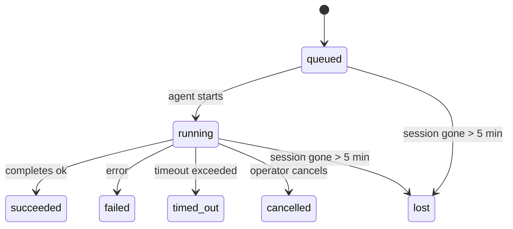

---
read_when:
    - بررسی کارهای پس‌زمینه در حال انجام یا اخیراً تکمیل‌شده
    - اشکال‌زدایی از شکست‌های تحویل برای اجراهای جداشدهٔ عامل
    - درک ارتباط اجراهای پس‌زمینه با نشست‌ها، Cron و Heartbeat
sidebarTitle: Background tasks
summary: ردیابی وظایف پس‌زمینه برای اجراهای ACP، عامل‌های فرعی، کارهای Cron مجزا و عملیات CLI
title: وظایف پس‌زمینه
x-i18n:
    generated_at: "2026-05-12T00:56:24Z"
    model: gpt-5.5
    provider: openai
    source_hash: 31cbf09df48bab0686a1350f91aefffffef899c86704bb97b68320fc47e78021
    source_path: automation/tasks.md
    workflow: 16
---

<Note>
به‌دنبال زمان‌بندی هستید؟ برای انتخاب سازوکار مناسب، [Automation](/fa/automation) را ببینید. این صفحه دفتر ثبت فعالیت برای کارهای پس‌زمینه است، نه زمان‌بند.
</Note>

تسک‌های پس‌زمینه کارهایی را رهگیری می‌کنند که **خارج از نشست گفت‌وگوی اصلی شما** اجرا می‌شوند: اجراهای ACP، ایجاد subagent، اجرای jobهای cron ایزوله، و عملیات آغازشده از CLI.

تسک‌ها جایگزین نشست‌ها، jobهای cron یا heartbeatها نمی‌شوند - آن‌ها **دفتر ثبت فعالیت** هستند که ثبت می‌کند چه کار جداشده‌ای انجام شده، چه زمانی، و آیا موفق بوده است یا نه.

<Note>
هر اجرای عامل یک تسک ایجاد نمی‌کند. نوبت‌های Heartbeat و چت تعاملی عادی این کار را نمی‌کنند. همه اجراهای cron، ایجادهای ACP، ایجادهای subagent، و فرمان‌های عامل CLI این کار را می‌کنند.
</Note>

## خلاصه سریع

- تسک‌ها **رکورد** هستند، نه زمان‌بند - cron و heartbeat تعیین می‌کنند کار _چه زمانی_ اجرا شود، تسک‌ها رهگیری می‌کنند _چه اتفاقی افتاده است_.
- ACP، subagentها، همه jobهای cron، و عملیات CLI تسک ایجاد می‌کنند. نوبت‌های Heartbeat این کار را نمی‌کنند.
- هر تسک از مسیر `queued → running → terminal` عبور می‌کند (succeeded، failed، timed_out، cancelled، یا lost).
- تسک‌های cron تا زمانی زنده می‌مانند که runtime مربوط به cron هنوز مالک job باشد؛ اگر
  وضعیت runtime درون‌حافظه‌ای از بین رفته باشد، نگهداری تسک پیش از علامت‌گذاری آن به‌عنوان lost
  ابتدا تاریخچه پایدار اجرای cron را بررسی می‌کند.
- تکمیل به‌صورت push-driven انجام می‌شود: کار جداشده می‌تواند مستقیما اطلاع دهد یا
  نشست/heartbeat درخواست‌کننده را هنگام پایان کار بیدار کند، بنابراین حلقه‌های polling وضعیت
  معمولا شکل درستی ندارند.
- اجراهای cron ایزوله و تکمیل‌های subagent به‌صورت best-effort تب‌ها/فرایندهای مرورگر رهگیری‌شده را برای نشست فرزندشان پیش از حسابداری پاک‌سازی نهایی، پاک‌سازی می‌کنند.
- تحویل cron ایزوله پاسخ‌های موقت کهنه والد را تا زمانی که کار subagent فرزند هنوز در حال تخلیه است سرکوب می‌کند، و وقتی خروجی نهایی فرزند پیش از تحویل برسد، آن را ترجیح می‌دهد.
- اعلان‌های تکمیل مستقیما به یک کانال تحویل داده می‌شوند یا برای heartbeat بعدی صف می‌شوند.
- `openclaw tasks list` همه تسک‌ها را نشان می‌دهد؛ `openclaw tasks audit` مشکلات را نمایش می‌دهد.
- رکوردهای terminal به‌مدت ۷ روز نگه داشته می‌شوند و سپس خودکار پاک می‌شوند.

## شروع سریع

<Tabs>
  <Tab title="فهرست و فیلتر">
    ```bash
    # List all tasks (newest first)
    openclaw tasks list

    # Filter by runtime or status
    openclaw tasks list --runtime acp
    openclaw tasks list --status running
    ```

  </Tab>
  <Tab title="بازرسی">
    ```bash
    # Show details for a specific task (by ID, run ID, or session key)
    openclaw tasks show <lookup>
    ```
  </Tab>
  <Tab title="لغو و اعلان">
    ```bash
    # Cancel a running task (kills the child session)
    openclaw tasks cancel <lookup>

    # Change notification policy for a task
    openclaw tasks notify <lookup> state_changes
    ```

  </Tab>
  <Tab title="ممیزی و نگهداری">
    ```bash
    # Run a health audit
    openclaw tasks audit

    # Preview or apply maintenance
    openclaw tasks maintenance
    openclaw tasks maintenance --apply
    ```

  </Tab>
  <Tab title="جریان تسک">
    ```bash
    # Inspect TaskFlow state
    openclaw tasks flow list
    openclaw tasks flow show <lookup>
    openclaw tasks flow cancel <lookup>
    ```
  </Tab>
</Tabs>

## چه چیزی یک تسک ایجاد می‌کند

| منبع                   | نوع runtime | زمانی که رکورد تسک ایجاد می‌شود                         | سیاست اعلان پیش‌فرض |
| ---------------------- | ------------ | ------------------------------------------------------ | --------------------- |
| اجراهای پس‌زمینه ACP   | `acp`        | ایجاد یک نشست فرزند ACP                               | `done_only`           |
| هماهنگ‌سازی subagent   | `subagent`   | ایجاد یک subagent از طریق `sessions_spawn`             | `done_only`           |
| jobهای cron (همه انواع) | `cron`       | هر اجرای cron (نشست اصلی و ایزوله)                     | `silent`              |
| عملیات CLI             | `cli`        | فرمان‌های `openclaw agent` که از طریق Gateway اجرا می‌شوند | `silent`              |
| jobهای رسانه عامل      | `cli`        | اجراهای مبتنی بر نشست `music_generate`/`video_generate` | `silent`              |

<AccordionGroup>
  <Accordion title="پیش‌فرض‌های اعلان برای cron و رسانه">
    تسک‌های cron نشست اصلی به‌صورت پیش‌فرض از سیاست اعلان `silent` استفاده می‌کنند - آن‌ها برای رهگیری رکورد ایجاد می‌کنند اما اعلان تولید نمی‌کنند. تسک‌های cron ایزوله نیز به‌صورت پیش‌فرض `silent` هستند، اما چون در نشست خودشان اجرا می‌شوند، نمایان‌ترند.

    اجراهای مبتنی بر نشست `music_generate` و `video_generate` نیز از سیاست اعلان `silent` استفاده می‌کنند. آن‌ها همچنان رکوردهای تسک ایجاد می‌کنند، اما تکمیل به‌صورت یک بیدارسازی داخلی به نشست عامل اصلی برگردانده می‌شود تا عامل بتواند پیام پیگیری را بنویسد و رسانه تکمیل‌شده را خودش پیوست کند. تکمیل‌های گروه/کانال از سیاست عادی پاسخ قابل‌مشاهده پیروی می‌کنند، بنابراین عامل وقتی تحویل منبع به آن نیاز داشته باشد، از ابزار پیام استفاده می‌کند. اگر عامل تکمیل نتواند در یک مسیر tool-only شواهد تحویل با ابزار پیام تولید کند، OpenClaw به‌جای خصوصی گذاشتن رسانه، fallback تکمیل را مستقیما به کانال اصلی می‌فرستد.

  </Accordion>
  <Accordion title="حفاظت در برابر video_generate هم‌زمان">
    تا زمانی که یک تسک مبتنی بر نشست `video_generate` هنوز فعال است، این ابزار همچنین نقش محافظ را دارد: فراخوانی‌های تکراری `video_generate` در همان نشست، به‌جای شروع تولید هم‌زمان دوم، وضعیت تسک فعال را برمی‌گردانند. وقتی از سمت عامل به بررسی صریح پیشرفت/وضعیت نیاز دارید، از `action: "status"` استفاده کنید.
  </Accordion>
  <Accordion title="چه چیزهایی تسک ایجاد نمی‌کنند">
    - نوبت‌های Heartbeat - نشست اصلی؛ [Heartbeat](/fa/gateway/heartbeat) را ببینید
    - نوبت‌های چت تعاملی عادی
    - پاسخ‌های مستقیم `/command`

  </Accordion>
</AccordionGroup>

## چرخه عمر تسک



| وضعیت      | معنی آن                                                                    |
| ----------- | -------------------------------------------------------------------------- |
| `queued`    | ایجاد شده و منتظر شروع عامل است                                           |
| `running`   | نوبت عامل به‌طور فعال در حال اجراست                                       |
| `succeeded` | با موفقیت تکمیل شده است                                                   |
| `failed`    | با خطا تکمیل شده است                                                       |
| `timed_out` | از timeout پیکربندی‌شده فراتر رفته است                                    |
| `cancelled` | توسط اپراتور از طریق `openclaw tasks cancel` متوقف شده است                |
| `lost`      | runtime پس از دوره مهلت ۵ دقیقه‌ای، وضعیت پشتیبان مقتدر را از دست داده است |

انتقال‌ها خودکار رخ می‌دهند - وقتی اجرای عامل مرتبط پایان می‌یابد، وضعیت تسک برای مطابقت با آن به‌روزرسانی می‌شود.

تکمیل اجرای عامل برای رکوردهای تسک فعال مرجع معتبر است. یک اجرای جداشده موفق به‌صورت `succeeded` نهایی می‌شود، خطاهای عادی اجرا به‌صورت `failed` نهایی می‌شوند، و پیامدهای timeout یا abort به‌صورت `timed_out` نهایی می‌شوند. اگر اپراتور قبلا تسک را لغو کرده باشد، یا runtime از قبل وضعیت terminal قوی‌تری مانند `failed`، `timed_out`، یا `lost` ثبت کرده باشد، سیگنال موفقیت بعدی آن وضعیت terminal را تنزل نمی‌دهد.

`lost` نسبت به runtime آگاه است:

- تسک‌های ACP: فراداده نشست فرزند ACP پشتیبان ناپدید شده است.
- تسک‌های subagent: نشست فرزند پشتیبان از store عامل هدف ناپدید شده است.
- تسک‌های cron: runtime مربوط به cron دیگر job را به‌عنوان فعال رهگیری نمی‌کند و تاریخچه پایدار
  اجرای cron نتیجه terminal برای آن اجرا نشان نمی‌دهد. ممیزی CLI آفلاین وضعیت خالی runtime مربوط به cron درون‌فرایندی خودش را مرجع معتبر در نظر نمی‌گیرد.
- تسک‌های CLI: تسک‌هایی که run id/source id دارند از زمینه اجرای زنده استفاده می‌کنند، بنابراین
  ردیف‌های باقی‌مانده نشست فرزند یا نشست چت پس از ناپدید شدن اجرای متعلق به Gateway آن‌ها را زنده نگه نمی‌دارند. تسک‌های CLI قدیمی بدون هویت اجرا همچنان به نشست فرزند fallback می‌کنند. اجراهای `openclaw agent` مبتنی بر Gateway نیز از نتیجه اجرای خودشان نهایی می‌شوند، بنابراین اجراهای تکمیل‌شده تا زمانی که sweeper آن‌ها را `lost` علامت‌گذاری کند فعال نمی‌مانند.

## تحویل و اعلان‌ها

وقتی یک تسک به وضعیت terminal می‌رسد، OpenClaw به شما اطلاع می‌دهد. دو مسیر تحویل وجود دارد:

**تحویل مستقیم** - اگر تسک هدف کانال داشته باشد (`requesterOrigin`)، پیام تکمیل مستقیما به همان کانال می‌رود (Telegram، Discord، Slack، و غیره). تکمیل‌های تسک گروه و کانال در عوض از طریق نشست درخواست‌کننده مسیریابی می‌شوند تا عامل والد بتواند پاسخ قابل‌مشاهده را بنویسد. برای تکمیل‌های subagent، OpenClaw همچنین در صورت موجود بودن مسیریابی thread/topic متصل را حفظ می‌کند و پیش از منصرف شدن از تحویل مستقیم، می‌تواند `to` / account گم‌شده را از مسیر ذخیره‌شده نشست درخواست‌کننده (`lastChannel` / `lastTo` / `lastAccountId`) پر کند.

**تحویل صف‌شده در نشست** - اگر تحویل مستقیم شکست بخورد یا هیچ origin تنظیم نشده باشد، به‌روزرسانی به‌عنوان یک رویداد سیستمی در نشست درخواست‌کننده صف می‌شود و در heartbeat بعدی ظاهر می‌شود.

<Tip>
تکمیل تسک یک بیدارسازی heartbeat فوری را فعال می‌کند تا نتیجه را سریع ببینید - لازم نیست منتظر tick برنامه‌ریزی‌شده بعدی heartbeat بمانید.
</Tip>

یعنی workflow معمول push-based است: کار جداشده را یک بار شروع کنید، سپس بگذارید runtime هنگام تکمیل شما را بیدار کند یا اطلاع دهد. وضعیت تسک را فقط زمانی poll کنید که به اشکال‌زدایی، مداخله، یا ممیزی صریح نیاز دارید.

### سیاست‌های اعلان

کنترل کنید درباره هر تسک چقدر می‌شنوید:

| سیاست                 | آنچه تحویل داده می‌شود                                                   |
| --------------------- | ----------------------------------------------------------------------- |
| `done_only` (پیش‌فرض) | فقط وضعیت terminal (succeeded، failed، و غیره) - **این پیش‌فرض است**    |
| `state_changes`       | هر انتقال وضعیت و به‌روزرسانی پیشرفت                                    |
| `silent`              | هیچ چیز                                                                 |

سیاست را هنگام اجرای تسک تغییر دهید:

```bash
openclaw tasks notify <lookup> state_changes
```

## مرجع CLI

<AccordionGroup>
  <Accordion title="tasks list">
    ```bash
    openclaw tasks list [--runtime <acp|subagent|cron|cli>] [--status <status>] [--json]
    ```

    ستون‌های خروجی: شناسه تسک، نوع، وضعیت، تحویل، شناسه اجرا، نشست فرزند، خلاصه.

  </Accordion>
  <Accordion title="tasks show">
    ```bash
    openclaw tasks show <lookup>
    ```

    توکن lookup یک شناسه تسک، شناسه اجرا، یا کلید نشست را می‌پذیرد. رکورد کامل شامل زمان‌بندی، وضعیت تحویل، خطا، و خلاصه terminal را نشان می‌دهد.

  </Accordion>
  <Accordion title="tasks cancel">
    ```bash
    openclaw tasks cancel <lookup>
    ```

    برای تسک‌های ACP و subagent، این کار نشست فرزند را می‌کشد. برای تسک‌های رهگیری‌شده توسط CLI، لغو در رجیستری تسک ثبت می‌شود (هیچ هندل runtime فرزند جداگانه‌ای وجود ندارد). وضعیت به `cancelled` منتقل می‌شود و در صورت کاربرد، اعلان تحویل فرستاده می‌شود.

  </Accordion>
  <Accordion title="tasks notify">
    ```bash
    openclaw tasks notify <lookup> <done_only|state_changes|silent>
    ```
  </Accordion>
  <Accordion title="tasks audit">
    ```bash
    openclaw tasks audit [--json]
    ```

    مشکلات عملیاتی را نمایش می‌دهد. وقتی مشکل شناسایی شود، یافته‌ها در `openclaw status` نیز ظاهر می‌شوند.

    | یافته                   | شدت   | محرک                                                                                                      |
    | ------------------------- | ---------- | ------------------------------------------------------------------------------------------------------------ |
    | `stale_queued`            | هشدار       | بیش از ۱۰ دقیقه در صف مانده است                                                                              |
    | `stale_running`           | خطا      | بیش از ۳۰ دقیقه در حال اجرا بوده است                                                                             |
    | `lost`                    | هشدار/خطا | مالکیت وظیفه متکی بر runtime ناپدید شده است؛ وظایف گم‌شده نگه‌داری‌شده تا `cleanupAfter` هشدار می‌دهند، سپس به خطا تبدیل می‌شوند |
    | `delivery_failed`         | هشدار       | تحویل ناموفق بود و سیاست اعلان `silent` نیست                                                            |
    | `missing_cleanup`         | هشدار       | وظیفه پایانی بدون زمان‌مهر پاک‌سازی                                                                      |
    | `inconsistent_timestamps` | هشدار       | نقض خط زمانی (برای مثال، پیش از شروع پایان یافته است)                                                        |

  </Accordion>
  <Accordion title="نگه‌داری وظایف">
    ```bash
    openclaw tasks maintenance [--json]
    openclaw tasks maintenance --apply [--json]
    ```

    از این برای پیش‌نمایش یا اعمال همگام‌سازی، ثبت زمان‌مهر پاک‌سازی، و هرس کردن وظایف، وضعیت Task Flow، و ردیف‌های قدیمی رجیستری نشست اجرای cron استفاده کنید.

    همگام‌سازی نسبت به runtime آگاه است:

    - وظایف ACP/subagent نشست فرزند پشتیبان خود را بررسی می‌کنند.
    - وظایف subagent که نشست فرزندشان یک سنگ‌قبر بازیابی پس از راه‌اندازی مجدد دارد، به‌جای اینکه نشست‌های پشتیبان قابل‌بازیابی تلقی شوند، گم‌شده علامت‌گذاری می‌شوند.
    - وظایف Cron بررسی می‌کنند که آیا runtime کرون هنوز مالک job است یا نه، سپس پیش از fallback به `lost`، وضعیت پایانی را از لاگ‌های اجرای کرون/وضعیت job پایدارشده بازیابی می‌کنند. فقط فرایند Gateway برای مجموعه active-job درون‌حافظه‌ای کرون مرجع معتبر است؛ ممیزی آفلاین CLI از تاریخچه پایدار استفاده می‌کند، اما یک وظیفه کرون را صرفا به‌دلیل خالی بودن آن Set محلی، گم‌شده علامت‌گذاری نمی‌کند.
    - وظایف CLI دارای هویت اجرا، کانتکست اجرای زنده مالک را بررسی می‌کنند، نه فقط ردیف‌های child-session یا chat-session را.

    پاک‌سازی تکمیل نیز نسبت به runtime آگاه است:

    - تکمیل subagent پیش از ادامه پاک‌سازی اعلان، به‌صورت best-effort تب‌های مرورگر/فرایندهای رهگیری‌شده برای نشست فرزند را می‌بندد.
    - تکمیل cron ایزوله پیش از اینکه اجرا کاملا از بین برود، به‌صورت best-effort تب‌های مرورگر/فرایندهای رهگیری‌شده برای نشست کرون را می‌بندد.
    - تحویل cron ایزوله در صورت نیاز منتظر پیگیری subagent نواده می‌ماند و به‌جای اعلام متن تأیید والد قدیمی، آن را سرکوب می‌کند.
    - تحویل تکمیل subagent آخرین متن قابل‌مشاهده دستیار را ترجیح می‌دهد؛ اگر خالی باشد، به آخرین متن پاک‌سازی‌شده tool/toolResult fallback می‌کند، و اجراهای tool-call فقط مبتنی بر timeout می‌توانند به یک خلاصه کوتاه از پیشرفت جزئی فشرده شوند. اجراهای پایانی ناموفق بدون بازپخش متن پاسخ ضبط‌شده، وضعیت شکست را اعلام می‌کنند.
    - شکست‌های پاک‌سازی نتیجه واقعی وظیفه را پنهان نمی‌کنند.

    هنگام اعمال نگه‌داری، OpenClaw همچنین ردیف‌های قدیمی رجیستری نشست `cron:<jobId>:run:<uuid>` را که قدیمی‌تر از ۷ روز هستند حذف می‌کند، در حالی که ردیف‌های مربوط به jobهای cron در حال اجرا را حفظ می‌کند و ردیف‌های نشست غیرکرون را دست‌نخورده باقی می‌گذارد.

  </Accordion>
  <Accordion title="فهرست | نمایش | لغو جریان وظایف">
    ```bash
    openclaw tasks flow list [--status <status>] [--json]
    openclaw tasks flow show <lookup> [--json]
    openclaw tasks flow cancel <lookup>
    ```

    زمانی از این‌ها استفاده کنید که Task Flow هماهنگ‌کننده برای شما مهم است، نه یک رکورد منفرد از وظیفه پس‌زمینه.

  </Accordion>
</AccordionGroup>

## تابلوی وظایف چت (`/tasks`)

در هر نشست چت از `/tasks` استفاده کنید تا وظایف پس‌زمینه مرتبط با آن نشست را ببینید. تابلو وظایف فعال و اخیرا تکمیل‌شده را همراه با runtime، وضعیت، زمان‌بندی، و جزئیات پیشرفت یا خطا نشان می‌دهد.

وقتی نشست فعلی هیچ وظیفه مرتبط قابل‌مشاهده‌ای نداشته باشد، `/tasks` به شمارش وظایف محلی agent برمی‌گردد تا همچنان بدون افشای جزئیات نشست‌های دیگر یک نمای کلی دریافت کنید.

برای دفترکل کامل اپراتور، از CLI استفاده کنید: `openclaw tasks list`.

## یکپارچه‌سازی وضعیت (فشار وظیفه)

`openclaw status` یک خلاصه سریع از وظایف را شامل می‌شود:

```
Tasks: 3 queued · 2 running · 1 issues
```

خلاصه گزارش می‌دهد:

- **فعال** - تعداد `queued` + `running`
- **شکست‌ها** - تعداد `failed` + `timed_out` + `lost`
- **بر اساس runtime** - تفکیک بر اساس `acp`، `subagent`، `cron`، `cli`

هم `/status` و هم ابزار `session_status` از snapshot وظایف آگاه به پاک‌سازی استفاده می‌کنند: وظایف فعال ترجیح داده می‌شوند، ردیف‌های تکمیل‌شده قدیمی پنهان می‌شوند، و شکست‌های اخیر فقط زمانی نمایش داده می‌شوند که هیچ کار فعالی باقی نمانده باشد. این کار کارت وضعیت را روی آنچه همین حالا مهم است متمرکز نگه می‌دارد.

## ذخیره‌سازی و نگه‌داری

### محل نگه‌داری وظایف

رکوردهای وظیفه در SQLite در این مسیر پایدار می‌شوند:

```
$OPENCLAW_STATE_DIR/tasks/runs.sqlite
```

رجیستری هنگام شروع gateway در حافظه بارگذاری می‌شود و برای دوام در برابر راه‌اندازی‌های مجدد، نوشتن‌ها را با SQLite همگام می‌کند.
Gateway لاگ write-ahead مربوط به SQLite را با استفاده از آستانه autocheckpoint پیش‌فرض SQLite
به‌همراه checkpointهای دوره‌ای و هنگام خاموشی از نوع `TRUNCATE` محدود نگه می‌دارد.

### نگه‌داری خودکار

یک sweeper هر **۶۰ ثانیه** اجرا می‌شود و چهار کار را انجام می‌دهد:

<Steps>
  <Step title="همگام‌سازی">
    بررسی می‌کند که آیا وظایف فعال هنوز پشتیبان معتبر runtime دارند یا نه. وظایف ACP/subagent از وضعیت child-session استفاده می‌کنند، وظایف cron از مالکیت active-job استفاده می‌کنند، و وظایف CLI دارای هویت اجرا از کانتکست اجرای مالک استفاده می‌کنند. اگر آن وضعیت پشتیبان بیش از ۵ دقیقه از بین رفته باشد، وظیفه `lost` علامت‌گذاری می‌شود.
  </Step>
  <Step title="ترمیم نشست ACP">
    نشست‌های ACP یک‌باره پایانی یا یتیم و متعلق به والد را می‌بندد، و نشست‌های ACP پایدار پایانی یا یتیم و قدیمی را فقط زمانی می‌بندد که هیچ binding مکالمه فعالی باقی نمانده باشد.
  </Step>
  <Step title="ثبت زمان‌مهر پاک‌سازی">
    روی وظایف پایانی یک زمان‌مهر `cleanupAfter` تنظیم می‌کند (endedAt + ۷ روز). در طول دوره نگه‌داری، وظایف گم‌شده همچنان در ممیزی به‌صورت هشدار ظاهر می‌شوند؛ پس از انقضای `cleanupAfter` یا وقتی metadata پاک‌سازی وجود نداشته باشد، خطا هستند.
  </Step>
  <Step title="هرس کردن">
    رکوردهایی را که از تاریخ `cleanupAfter` خود گذشته‌اند حذف می‌کند.
  </Step>
</Steps>

<Note>
**نگه‌داری:** رکوردهای وظایف پایانی به‌مدت **۷ روز** نگه‌داری می‌شوند، سپس به‌طور خودکار هرس می‌شوند. هیچ پیکربندی لازم نیست.
</Note>

## ارتباط وظایف با سیستم‌های دیگر

<AccordionGroup>
  <Accordion title="وظایف و Task Flow">
    [Task Flow](/fa/automation/taskflow) لایه هماهنگ‌سازی جریان بالای وظایف پس‌زمینه است. یک flow منفرد می‌تواند در طول عمر خود با استفاده از حالت‌های همگام‌سازی مدیریت‌شده یا آینه‌ای، چند وظیفه را هماهنگ کند. برای بررسی رکوردهای وظیفه منفرد از `openclaw tasks` و برای بررسی flow هماهنگ‌کننده از `openclaw tasks flow` استفاده کنید.

    برای جزئیات، [Task Flow](/fa/automation/taskflow) را ببینید.

  </Accordion>
  <Accordion title="وظایف و cron">
    یک **تعریف** job کرون در `~/.openclaw/cron/jobs.json` قرار دارد؛ وضعیت اجرای runtime در کنار آن در `~/.openclaw/cron/jobs-state.json` قرار دارد. **هر** اجرای cron یک رکورد وظیفه ایجاد می‌کند، چه main-session باشد و چه ایزوله. وظایف cron در main-session به‌طور پیش‌فرض از سیاست اعلان `silent` استفاده می‌کنند تا بدون ایجاد اعلان رهگیری شوند.

    [Cron Jobs](/fa/automation/cron-jobs) را ببینید.

  </Accordion>
  <Accordion title="وظایف و heartbeat">
    اجراهای Heartbeat نوبت‌های main-session هستند؛ آن‌ها رکورد وظیفه ایجاد نمی‌کنند. وقتی یک وظیفه تکمیل می‌شود، می‌تواند یک بیدارباش heartbeat را تحریک کند تا نتیجه را سریع ببینید.

    [Heartbeat](/fa/gateway/heartbeat) را ببینید.

  </Accordion>
  <Accordion title="وظایف و نشست‌ها">
    یک وظیفه ممکن است به یک `childSessionKey` (جایی که کار اجرا می‌شود) و یک `requesterSessionKey` (کسی که آن را شروع کرده است) ارجاع دهد. نشست‌ها کانتکست مکالمه هستند؛ وظایف رهگیری فعالیت روی آن هستند.
  </Accordion>
  <Accordion title="وظایف و اجراهای agent">
    `runId` یک وظیفه به اجرای agent که کار را انجام می‌دهد پیوند می‌خورد. رویدادهای چرخه عمر agent (شروع، پایان، خطا) به‌طور خودکار وضعیت وظیفه را به‌روزرسانی می‌کنند؛ لازم نیست چرخه عمر را دستی مدیریت کنید.
  </Accordion>
</AccordionGroup>

## مرتبط

- [اتوماسیون](/fa/automation) - همه سازوکارهای اتوماسیون در یک نگاه
- [CLI: وظایف](/fa/cli/tasks) - مرجع فرمان CLI
- [Heartbeat](/fa/gateway/heartbeat) - نوبت‌های دوره‌ای main-session
- [وظایف زمان‌بندی‌شده](/fa/automation/cron-jobs) - زمان‌بندی کار پس‌زمینه
- [Task Flow](/fa/automation/taskflow) - هماهنگ‌سازی flow بالای وظایف
