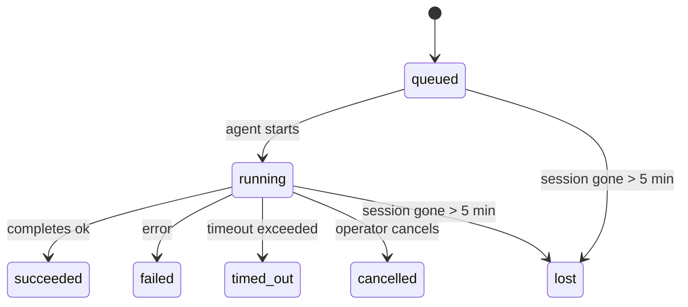

---
read_when:
    - بررسی کارهای پس‌زمینه در حال انجام یا اخیراً تکمیل‌شده
    - اشکال‌زدایی از شکست‌های تحویل در اجراهای جداشدهٔ عامل
    - درک اینکه اجراهای پس‌زمینه چگونه با نشست‌ها، Cron و Heartbeat ارتباط دارند
sidebarTitle: Background tasks
summary: ردیابی وظایف پس‌زمینه برای اجراهای ACP، زیرعامل‌ها، کارهای Cron ایزوله، و عملیات CLI
title: وظایف پس‌زمینه
x-i18n:
    generated_at: "2026-05-05T01:44:27Z"
    model: gpt-5.5
    provider: openai
    source_hash: 60d6ea6178535b19b95d761b8e8b05a665234584ae69852fd21097988aa32991
    source_path: automation/tasks.md
    workflow: 16
---

<Note>
دنبال زمان‌بندی هستید؟ برای انتخاب سازوکار مناسب، [اتوماسیون و وظایف](/fa/automation) را ببینید. این صفحه دفتر فعالیت کارهای پس‌زمینه است، نه زمان‌بند.
</Note>

وظایف پس‌زمینه کارهایی را ردیابی می‌کنند که **خارج از نشست گفت‌وگوی اصلی شما** اجرا می‌شوند: اجرای ACP، ایجاد زیرعامل‌ها، اجرای jobهای cron ایزوله، و عملیات آغازشده از CLI.

وظایف جایگزین نشست‌ها، jobهای cron یا heartbeats نیستند — آن‌ها **دفتر فعالیت** هستند که ثبت می‌کند چه کار جداشده‌ای انجام شده، چه زمانی، و آیا موفق بوده است یا نه.

<Note>
هر اجرای عامل یک وظیفه ایجاد نمی‌کند. نوبت‌های Heartbeat و گفت‌وگوی تعاملی معمولی این کار را نمی‌کنند. همه اجرای‌های cron، ایجادهای ACP، ایجادهای زیرعامل، و فرمان‌های عامل CLI این کار را می‌کنند.
</Note>

## خلاصه سریع

- وظایف **رکورد** هستند، نه زمان‌بند — cron و heartbeat تصمیم می‌گیرند کار _چه زمانی_ اجرا شود، وظایف ردیابی می‌کنند _چه اتفاقی افتاده است_.
- ACP، زیرعامل‌ها، همه jobهای cron، و عملیات CLI وظیفه ایجاد می‌کنند. نوبت‌های Heartbeat این کار را نمی‌کنند.
- هر وظیفه از مسیر `queued → running → terminal` عبور می‌کند (succeeded، failed، timed_out، cancelled، یا lost).
- وظایف cron تا زمانی زنده می‌مانند که runtime کران همچنان مالک job باشد؛ اگر
  وضعیت runtime درون‌حافظه‌ای از بین رفته باشد، نگهداری وظیفه پیش از علامت‌گذاری وظیفه به‌عنوان lost، ابتدا تاریخچه پایدار اجرای cron را بررسی می‌کند.
- تکمیل مبتنی بر push است: کار جداشده می‌تواند مستقیما اطلاع دهد یا پس از پایان،
  نشست/heartbeat درخواست‌کننده را بیدار کند، بنابراین حلقه‌های polling وضعیت
  معمولا شکل درستی نیستند.
- اجرای‌های cron ایزوله و تکمیل‌های زیرعامل به‌صورت best-effort تب‌ها/فرایندهای مرورگر ردیابی‌شده را برای نشست فرزند خود پیش از حسابداری پاک‌سازی نهایی پاک می‌کنند.
- تحویل cron ایزوله پاسخ‌های میانی کهنه والد را تا زمانی که کار زیرعامل نواده هنوز در حال تخلیه است سرکوب می‌کند، و وقتی خروجی نهایی نواده پیش از تحویل برسد آن را ترجیح می‌دهد.
- اعلان‌های تکمیل مستقیما به یک کانال تحویل داده می‌شوند یا برای Heartbeat بعدی صف می‌شوند.
- `openclaw tasks list` همه وظایف را نشان می‌دهد؛ `openclaw tasks audit` مشکلات را نمایان می‌کند.
- رکوردهای terminal برای ۷ روز نگه داشته می‌شوند، سپس به‌صورت خودکار پاک‌سازی می‌شوند.

## شروع سریع

<Tabs>
  <Tab title="فهرست و فیلتر">
    ```bash
    # List all tasks (newest first)
    openclaw tasks list

    # Filter by runtime or status
    openclaw tasks list --runtime acp
    openclaw tasks list --status running
    ```

  </Tab>
  <Tab title="بازبینی">
    ```bash
    # Show details for a specific task (by ID, run ID, or session key)
    openclaw tasks show <lookup>
    ```
  </Tab>
  <Tab title="لغو و اعلان">
    ```bash
    # Cancel a running task (kills the child session)
    openclaw tasks cancel <lookup>

    # Change notification policy for a task
    openclaw tasks notify <lookup> state_changes
    ```

  </Tab>
  <Tab title="ممیزی و نگهداری">
    ```bash
    # Run a health audit
    openclaw tasks audit

    # Preview or apply maintenance
    openclaw tasks maintenance
    openclaw tasks maintenance --apply
    ```

  </Tab>
  <Tab title="جریان وظیفه">
    ```bash
    # Inspect TaskFlow state
    openclaw tasks flow list
    openclaw tasks flow show <lookup>
    openclaw tasks flow cancel <lookup>
    ```
  </Tab>
</Tabs>

## چه چیزی وظیفه ایجاد می‌کند

| منبع                   | نوع runtime | زمان ایجاد رکورد وظیفه                                 | سیاست اعلان پیش‌فرض |
| ---------------------- | ------------ | ------------------------------------------------------ | --------------------- |
| اجرای‌های پس‌زمینه ACP | `acp`        | ایجاد نشست فرزند ACP                                  | `done_only`           |
| هماهنگ‌سازی زیرعامل    | `subagent`   | ایجاد زیرعامل از طریق `sessions_spawn`                | `done_only`           |
| jobهای cron (همه انواع) | `cron`       | هر اجرای cron (نشست اصلی و ایزوله)                    | `silent`              |
| عملیات CLI             | `cli`        | فرمان‌های `openclaw agent` که از طریق Gateway اجرا می‌شوند | `silent`              |
| jobهای رسانه عامل      | `cli`        | اجرای‌های مبتنی بر نشست `music_generate`/`video_generate` | `silent`              |

<AccordionGroup>
  <Accordion title="پیش‌فرض‌های اعلان برای cron و رسانه">
    وظایف cron نشست اصلی به‌طور پیش‌فرض از سیاست اعلان `silent` استفاده می‌کنند — آن‌ها برای ردیابی رکورد ایجاد می‌کنند اما اعلان تولید نمی‌کنند. وظایف cron ایزوله نیز به‌طور پیش‌فرض `silent` هستند، اما چون در نشست خودشان اجرا می‌شوند بیشتر دیده می‌شوند.

    اجرای‌های مبتنی بر نشست `music_generate` و `video_generate` نیز از سیاست اعلان `silent` استفاده می‌کنند. آن‌ها همچنان رکورد وظیفه ایجاد می‌کنند، اما تکمیل به‌عنوان یک بیدارباش داخلی به نشست عامل اصلی برگردانده می‌شود تا عامل بتواند پیام پیگیری را بنویسد و رسانه تکمیل‌شده را خودش پیوست کند. تکمیل‌های گروه/کانال از سیاست معمول پاسخ قابل‌مشاهده پیروی می‌کنند، بنابراین وقتی تحویل منبع آن را لازم بداند، عامل از ابزار پیام استفاده می‌کند.

  </Accordion>
  <Accordion title="حفاظت هم‌زمانی video_generate">
    تا زمانی که یک وظیفه مبتنی بر نشست `video_generate` هنوز فعال است، ابزار نیز نقش حفاظتی دارد: فراخوانی‌های تکراری `video_generate` در همان نشست، به‌جای شروع تولید هم‌زمان دوم، وضعیت وظیفه فعال را برمی‌گردانند. وقتی از سمت عامل به جست‌وجوی صریح پیشرفت/وضعیت نیاز دارید از `action: "status"` استفاده کنید.
  </Accordion>
  <Accordion title="چه چیزی وظیفه ایجاد نمی‌کند">
    - نوبت‌های Heartbeat — نشست اصلی؛ [Heartbeat](/fa/gateway/heartbeat) را ببینید
    - نوبت‌های گفت‌وگوی تعاملی معمولی
    - پاسخ‌های مستقیم `/command`

  </Accordion>
</AccordionGroup>

## چرخه عمر وظیفه



| وضعیت       | معنای آن                                                                   |
| ----------- | -------------------------------------------------------------------------- |
| `queued`    | ایجاد شده، در انتظار شروع عامل                                             |
| `running`   | نوبت عامل فعالانه در حال اجرا است                                          |
| `succeeded` | با موفقیت کامل شد                                                          |
| `failed`    | با خطا کامل شد                                                             |
| `timed_out` | از timeout پیکربندی‌شده عبور کرد                                           |
| `cancelled` | توسط اپراتور از طریق `openclaw tasks cancel` متوقف شد                      |
| `lost`      | runtime پس از یک مهلت ۵ دقیقه‌ای وضعیت پشتیبان معتبر را از دست داد        |

انتقال‌ها به‌صورت خودکار رخ می‌دهند — وقتی اجرای عامل مرتبط پایان یابد، وضعیت وظیفه برای مطابقت با آن به‌روزرسانی می‌شود.

تکمیل اجرای عامل برای رکوردهای وظیفه فعال مرجع معتبر است. یک اجرای جداشده موفق به‌صورت `succeeded` نهایی می‌شود، خطاهای معمول اجرا به‌صورت `failed` نهایی می‌شوند، و پیامدهای timeout یا abort به‌صورت `timed_out` نهایی می‌شوند. اگر اپراتور قبلا وظیفه را لغو کرده باشد، یا runtime از قبل وضعیت terminal قوی‌تری مانند `failed`، `timed_out`، یا `lost` را ثبت کرده باشد، سیگنال موفقیت بعدی آن وضعیت terminal را کاهش نمی‌دهد.

`lost` نسبت به runtime آگاه است:

- وظایف ACP: فراداده نشست فرزند ACP پشتیبان ناپدید شد.
- وظایف زیرعامل: نشست فرزند پشتیبان از store عامل هدف ناپدید شد.
- وظایف cron: runtime کران دیگر job را به‌عنوان فعال ردیابی نمی‌کند و تاریخچه
  پایدار اجرای cron نتیجه terminal برای آن اجرا نشان نمی‌دهد. ممیزی CLI آفلاین
  وضعیت خالی runtime cron درون‌فرایندی خودش را به‌عنوان مرجع معتبر در نظر نمی‌گیرد.
- وظایف CLI: وظایف نشست فرزند ایزوله از نشست فرزند استفاده می‌کنند؛ وظایف CLI
  مبتنی بر چت به‌جای آن از زمینه اجرای زنده استفاده می‌کنند، بنابراین ردیف‌های
  ماندگار نشست کانال/گروه/مستقیم آن‌ها را زنده نگه نمی‌دارند. اجرای‌های
  `openclaw agent` مبتنی بر Gateway نیز از نتیجه اجرای خود نهایی می‌شوند، بنابراین اجرای‌های کامل‌شده
  تا زمانی که sweeper آن‌ها را `lost` علامت بزند فعال نمی‌مانند.

## تحویل و اعلان‌ها

وقتی یک وظیفه به وضعیت terminal می‌رسد، OpenClaw به شما اطلاع می‌دهد. دو مسیر تحویل وجود دارد:

**تحویل مستقیم** — اگر وظیفه هدف کانال داشته باشد (`requesterOrigin`)، پیام تکمیل مستقیما به آن کانال می‌رود (Telegram، Discord، Slack، و غیره). برای تکمیل‌های زیرعامل، OpenClaw همچنین در صورت موجود بودن، مسیریابی thread/topic متصل را حفظ می‌کند و می‌تواند پیش از صرف‌نظر از تحویل مستقیم، مقدار `to` / account مفقود را از مسیر ذخیره‌شده نشست درخواست‌کننده (`lastChannel` / `lastTo` / `lastAccountId`) پر کند.

**تحویل صف‌شده در نشست** — اگر تحویل مستقیم شکست بخورد یا هیچ origin تنظیم نشده باشد، به‌روزرسانی به‌عنوان یک رویداد سیستمی در نشست درخواست‌کننده صف می‌شود و در Heartbeat بعدی ظاهر می‌شود.

<Tip>
تکمیل وظیفه یک بیدارباش فوری Heartbeat را فعال می‌کند تا نتیجه را سریع ببینید — لازم نیست تا تیک زمان‌بندی‌شده بعدی Heartbeat صبر کنید.
</Tip>

این یعنی workflow معمول مبتنی بر push است: کار جداشده را یک‌بار شروع کنید، سپس اجازه دهید runtime پس از تکمیل شما را بیدار یا مطلع کند. وضعیت وظیفه را فقط زمانی poll کنید که به اشکال‌زدایی، مداخله، یا ممیزی صریح نیاز دارید.

### سیاست‌های اعلان

کنترل کنید درباره هر وظیفه چقدر بشنوید:

| سیاست                | آنچه تحویل داده می‌شود                                               |
| --------------------- | ----------------------------------------------------------------------- |
| `done_only` (پیش‌فرض) | فقط وضعیت terminal (succeeded، failed، و غیره) — **این پیش‌فرض است** |
| `state_changes`       | هر انتقال وضعیت و به‌روزرسانی پیشرفت                                  |
| `silent`              | هیچ چیز                                                                  |

سیاست را در حالی که وظیفه در حال اجرا است تغییر دهید:

```bash
openclaw tasks notify <lookup> state_changes
```

## مرجع CLI

<AccordionGroup>
  <Accordion title="tasks list">
    ```bash
    openclaw tasks list [--runtime <acp|subagent|cron|cli>] [--status <status>] [--json]
    ```

    ستون‌های خروجی: شناسه وظیفه، نوع، وضعیت، تحویل، شناسه اجرا، نشست فرزند، خلاصه.

  </Accordion>
  <Accordion title="tasks show">
    ```bash
    openclaw tasks show <lookup>
    ```

    توکن lookup یک شناسه وظیفه، شناسه اجرا، یا کلید نشست را می‌پذیرد. رکورد کامل شامل زمان‌بندی، وضعیت تحویل، خطا، و خلاصه terminal را نشان می‌دهد.

  </Accordion>
  <Accordion title="tasks cancel">
    ```bash
    openclaw tasks cancel <lookup>
    ```

    برای وظایف ACP و زیرعامل، این کار نشست فرزند را می‌کشد. برای وظایف ردیابی‌شده با CLI، لغو در رجیستری وظیفه ثبت می‌شود (هیچ handle جداگانه‌ای برای runtime فرزند وجود ندارد). وضعیت به `cancelled` منتقل می‌شود و در صورت کاربرد، اعلان تحویل ارسال می‌شود.

  </Accordion>
  <Accordion title="tasks notify">
    ```bash
    openclaw tasks notify <lookup> <done_only|state_changes|silent>
    ```
  </Accordion>
  <Accordion title="tasks audit">
    ```bash
    openclaw tasks audit [--json]
    ```

    مشکلات عملیاتی را نمایان می‌کند. وقتی مشکلات شناسایی شوند، یافته‌ها در `openclaw status` نیز ظاهر می‌شوند.

    | یافته                    | شدت       | محرک                                                                                                      |
    | ------------------------- | ---------- | ------------------------------------------------------------------------------------------------------------ |
    | `stale_queued`            | هشدار     | بیش از 10 دقیقه در صف مانده است                                                                              |
    | `stale_running`           | خطا       | بیش از 30 دقیقه در حال اجرا بوده است                                                                         |
    | `lost`                    | هشدار/خطا | مالکیت وظیفه متکی به زمان اجرا ناپدید شده است؛ وظایف گم‌شده نگه‌داشته‌شده تا `cleanupAfter` هشدار می‌دهند، سپس به خطا تبدیل می‌شوند |
    | `delivery_failed`         | هشدار     | تحویل ناموفق بوده و سیاست اعلان `silent` نیست                                                               |
    | `missing_cleanup`         | هشدار     | وظیفه پایانی بدون زمان‌مهر پاک‌سازی                                                                         |
    | `inconsistent_timestamps` | هشدار     | نقض خط زمانی (برای مثال، پیش از شروع پایان یافته است)                                                       |

  </Accordion>
  <Accordion title="tasks maintenance">
    ```bash
    openclaw tasks maintenance [--json]
    openclaw tasks maintenance --apply [--json]
    ```

    از این برای پیش‌نمایش یا اعمال همسوسازی، ثبت زمان‌مهر پاک‌سازی، و هرس کردن وظایف و وضعیت Task Flow استفاده کنید.

    همسوسازی از زمان اجرا آگاه است:

    - وظایف ACP/زیرعامل، نشست فرزند پشتیبان خود را بررسی می‌کنند.
    - وظایف زیرعاملی که نشست فرزندشان سنگ‌قبر بازیابی پس از راه‌اندازی مجدد دارد، به‌جای اینکه به‌عنوان نشست‌های پشتیبان قابل بازیابی در نظر گرفته شوند، گم‌شده علامت‌گذاری می‌شوند.
    - وظایف Cron بررسی می‌کنند که آیا زمان اجرای cron هنوز مالک کار است یا نه، سپس پیش از بازگشت به `lost`، وضعیت پایانی را از گزارش‌های اجرای cron/وضعیت کار پایدارشده بازیابی می‌کنند. فقط فرایند Gateway برای مجموعه درون‌حافظه‌ای کارهای فعال cron مرجع معتبر است؛ ممیزی CLI آفلاین از تاریخچه پایدار استفاده می‌کند اما صرفا به‌دلیل خالی بودن آن Set محلی، یک وظیفه cron را گم‌شده علامت‌گذاری نمی‌کند.
    - وظایف CLI متکی به چت، زمینه اجرای زنده مالک را بررسی می‌کنند، نه فقط ردیف نشست چت را.

    پاک‌سازی تکمیل نیز از زمان اجرا آگاه است:

    - تکمیل زیرعامل، پیش از ادامه پاک‌سازی اعلان، با بهترین تلاش زبانه‌ها/فرایندهای مرورگر ردیابی‌شده برای نشست فرزند را می‌بندد.
    - تکمیل cron ایزوله، پیش از اینکه اجرا کاملا جمع شود، با بهترین تلاش زبانه‌ها/فرایندهای مرورگر ردیابی‌شده برای نشست cron را می‌بندد.
    - تحویل cron ایزوله، در صورت نیاز منتظر پیگیری زیرعامل نوادگان می‌ماند و به‌جای اعلام آن، متن تأیید والد کهنه را سرکوب می‌کند.
    - تحویل تکمیل زیرعامل، جدیدترین متن قابل مشاهده دستیار را ترجیح می‌دهد؛ اگر خالی باشد، به جدیدترین متن پاک‌سازی‌شده ابزار/toolResult بازمی‌گردد، و اجراهای فراخوانی ابزار که فقط به پایان‌زمان رسیده‌اند می‌توانند به یک خلاصه کوتاه از پیشرفت جزئی فروکاسته شوند. اجراهای پایانی ناموفق، وضعیت شکست را بدون بازپخش متن پاسخ ضبط‌شده اعلام می‌کنند.
    - شکست‌های پاک‌سازی نتیجه واقعی وظیفه را پنهان نمی‌کنند.

  </Accordion>
  <Accordion title="tasks flow list | show | cancel">
    ```bash
    openclaw tasks flow list [--status <status>] [--json]
    openclaw tasks flow show <lookup> [--json]
    openclaw tasks flow cancel <lookup>
    ```

    وقتی جریان هماهنگ‌کننده Task Flow چیزی است که برایتان مهم است، نه یک رکورد منفرد وظیفه پس‌زمینه، از این‌ها استفاده کنید.

  </Accordion>
</AccordionGroup>

## تابلوی وظیفه چت (`/tasks`)

در هر نشست چت از `/tasks` استفاده کنید تا وظایف پس‌زمینه مرتبط با آن نشست را ببینید. تابلو وظایف فعال و اخیرا تکمیل‌شده را همراه با زمان اجرا، وضعیت، زمان‌بندی، و جزئیات پیشرفت یا خطا نشان می‌دهد.

وقتی نشست فعلی هیچ وظیفه مرتبط قابل مشاهده‌ای ندارد، `/tasks` به شمارش وظایف محلی عامل بازمی‌گردد تا همچنان بدون افشای جزئیات نشست‌های دیگر، یک نمای کلی دریافت کنید.

برای دفترکل کامل اپراتور، از CLI استفاده کنید: `openclaw tasks list`.

## یکپارچه‌سازی وضعیت (فشار وظیفه)

`openclaw status` یک خلاصه سریع از وظایف را شامل می‌شود:

```
Tasks: 3 queued · 2 running · 1 issues
```

این خلاصه گزارش می‌دهد:

- **فعال** — شمار `queued` + `running`
- **شکست‌ها** — شمار `failed` + `timed_out` + `lost`
- **بر پایه زمان اجرا** — تفکیک بر پایه `acp`، `subagent`، `cron`، `cli`

هر دو `/status` و ابزار `session_status` از یک عکس‌برداشت وظیفه آگاه به پاک‌سازی استفاده می‌کنند: وظایف فعال ترجیح داده می‌شوند، ردیف‌های تکمیل‌شده کهنه پنهان می‌شوند، و شکست‌های اخیر فقط وقتی نمایش داده می‌شوند که هیچ کار فعالی باقی نمانده باشد. این کار کارت وضعیت را روی آنچه همین حالا مهم است متمرکز نگه می‌دارد.

## ذخیره‌سازی و نگهداری

### وظایف کجا قرار دارند

رکوردهای وظیفه در SQLite در مسیر زیر پایدار می‌شوند:

```
$OPENCLAW_STATE_DIR/tasks/runs.sqlite
```

رجیستری هنگام شروع Gateway در حافظه بارگذاری می‌شود و نوشتن‌ها را برای پایداری در برابر راه‌اندازی‌های مجدد با SQLite همگام می‌کند.
Gateway گزارش پیش‌نویس SQLite را با استفاده از آستانه autocheckpoint پیش‌فرض SQLite به‌علاوه checkpointهای دوره‌ای و زمان خاموشی `TRUNCATE` محدود نگه می‌دارد.

### نگهداری خودکار

یک جاروبگر هر **60 ثانیه** اجرا می‌شود و چهار کار را انجام می‌دهد:

<Steps>
  <Step title="Reconciliation">
    بررسی می‌کند که آیا وظایف فعال هنوز پشتوانه معتبر زمان اجرا دارند یا نه. وظایف ACP/زیرعامل از وضعیت نشست فرزند استفاده می‌کنند، وظایف cron از مالکیت کار فعال استفاده می‌کنند، و وظایف CLI متکی به چت از زمینه اجرای مالک استفاده می‌کنند. اگر آن وضعیت پشتیبان بیش از 5 دقیقه از بین رفته باشد، وظیفه `lost` علامت‌گذاری می‌شود.
  </Step>
  <Step title="ACP session repair">
    نشست‌های ACP یک‌باره پایانی یا یتیم متعلق به والد را می‌بندد، و نشست‌های ACP پایدار پایانی کهنه یا یتیم را فقط وقتی می‌بندد که هیچ پیوند گفت‌وگوی فعالی باقی نمانده باشد.
  </Step>
  <Step title="Cleanup stamping">
    یک زمان‌مهر `cleanupAfter` روی وظایف پایانی تنظیم می‌کند (endedAt + 7 روز). در طول دوره نگهداری، وظایف گم‌شده هنوز در ممیزی به‌عنوان هشدار ظاهر می‌شوند؛ پس از انقضای `cleanupAfter` یا وقتی فراداده پاک‌سازی موجود نباشد، خطا هستند.
  </Step>
  <Step title="Pruning">
    رکوردهایی را که تاریخ `cleanupAfter` آن‌ها گذشته است حذف می‌کند.
  </Step>
</Steps>

<Note>
**نگهداری:** رکوردهای وظیفه پایانی به مدت **7 روز** نگه داشته می‌شوند، سپس به‌طور خودکار هرس می‌شوند. پیکربندی لازم نیست.
</Note>

## ارتباط وظایف با سامانه‌های دیگر

<AccordionGroup>
  <Accordion title="Tasks and Task Flow">
    [Task Flow](/fa/automation/taskflow) لایه هماهنگ‌سازی جریان بالای وظایف پس‌زمینه است. یک جریان منفرد ممکن است در طول عمر خود چندین وظیفه را با استفاده از حالت‌های همگام‌سازی مدیریت‌شده یا آینه‌شده هماهنگ کند. از `openclaw tasks` برای بررسی رکوردهای وظیفه منفرد و از `openclaw tasks flow` برای بررسی جریان هماهنگ‌کننده استفاده کنید.

    برای جزئیات، [Task Flow](/fa/automation/taskflow) را ببینید.

  </Accordion>
  <Accordion title="Tasks and cron">
    یک **تعریف** کار cron در `~/.openclaw/cron/jobs.json` قرار دارد؛ وضعیت اجرای زمان اجرا کنار آن در `~/.openclaw/cron/jobs-state.json` قرار دارد. **هر** اجرای cron یک رکورد وظیفه ایجاد می‌کند — هم نشست اصلی و هم ایزوله. وظایف cron نشست اصلی به‌طور پیش‌فرض از سیاست اعلان `silent` استفاده می‌کنند تا بدون تولید اعلان ردیابی شوند.

    [Cron Jobs](/fa/automation/cron-jobs) را ببینید.

  </Accordion>
  <Accordion title="Tasks and heartbeat">
    اجراهای Heartbeat نوبت‌های نشست اصلی هستند — آن‌ها رکورد وظیفه ایجاد نمی‌کنند. وقتی یک وظیفه تکمیل می‌شود، می‌تواند بیدارسازی Heartbeat را فعال کند تا نتیجه را سریع ببینید.

    [Heartbeat](/fa/gateway/heartbeat) را ببینید.

  </Accordion>
  <Accordion title="Tasks and sessions">
    یک وظیفه ممکن است به یک `childSessionKey` (جایی که کار اجرا می‌شود) و یک `requesterSessionKey` (کسی که آن را شروع کرده است) ارجاع دهد. نشست‌ها زمینه گفت‌وگو هستند؛ وظایف ردیابی فعالیت روی آن هستند.
  </Accordion>
  <Accordion title="Tasks and agent runs">
    `runId` یک وظیفه به اجرای عاملی که کار را انجام می‌دهد پیوند دارد. رویدادهای چرخه عمر عامل (شروع، پایان، خطا) به‌طور خودکار وضعیت وظیفه را به‌روزرسانی می‌کنند — لازم نیست چرخه عمر را دستی مدیریت کنید.
  </Accordion>
</AccordionGroup>

## مرتبط

- [اتوماسیون و وظایف](/fa/automation) — همه سازوکارهای اتوماسیون در یک نگاه
- [CLI: وظایف](/fa/cli/tasks) — مرجع فرمان CLI
- [Heartbeat](/fa/gateway/heartbeat) — نوبت‌های دوره‌ای نشست اصلی
- [وظایف زمان‌بندی‌شده](/fa/automation/cron-jobs) — زمان‌بندی کار پس‌زمینه
- [Task Flow](/fa/automation/taskflow) — هماهنگ‌سازی جریان بالای وظایف
