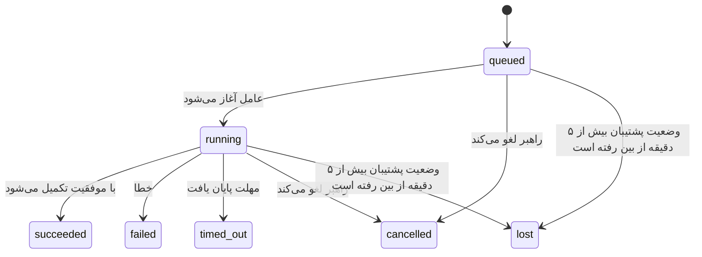

---
read_when:
    - بررسی کارهای پس‌زمینهٔ در حال انجام یا کارهایی که اخیراً تکمیل شده‌اند
    - اشکال‌زدایی خطاهای تحویل در اجرای جداشدهٔ عامل‌ها
    - درک چگونگی ارتباط اجراهای پس‌زمینه با نشست‌ها، Cron و Heartbeat
sidebarTitle: Background tasks
summary: ردیابی وظایف پس‌زمینه برای اجراهای ACP، زیرعامل‌ها، اجرای Cron و عملیات CLI
title: وظایف پس‌زمینه
x-i18n:
    generated_at: "2026-07-12T09:32:05Z"
    model: gpt-5.6
    postprocess_version: locale-links-v1
    provider: openai
    source_hash: 0a945e8103c5df5a64785f326a9d0b08784ac32a2ca6fa3d4c399d75fc54be2b
    source_path: automation/tasks.md
    workflow: 16
---

<Note>
به‌دنبال زمان‌بندی هستید؟ برای انتخاب سازوکار مناسب، [اتوماسیون](/fa/automation) را ببینید. این صفحه دفتر ثبت فعالیتِ کارهای پس‌زمینه است، نه زمان‌بند.
</Note>

وظایف پس‌زمینه کارهایی را پیگیری می‌کنند که **خارج از نشست اصلی گفت‌وگوی شما** اجرا می‌شوند: اجراهای ACP، ایجاد زیرعامل‌ها، اجرای کارهای Cron و عملیات آغازشده از CLI.

وظایف جایگزین نشست‌ها، کارهای Cron یا Heartbeatها **نمی‌شوند**؛ آن‌ها **دفتر ثبت فعالیت** هستند که ثبت می‌کند چه کار مستقلی، در چه زمانی و با چه نتیجه‌ای انجام شده است.

<Note>
هر اجرای عامل یک وظیفه ایجاد نمی‌کند. نوبت‌های Heartbeat و گفت‌وگوی تعاملی عادی چنین نمی‌کنند. همه اجراهای Cron، ایجادهای ACP، ایجادهای زیرعامل و فرمان‌های عامل CLI که از طریق Gateway ارسال می‌شوند، وظیفه ایجاد می‌کنند.
</Note>

## خلاصه

- وظایف **رکورد** هستند، نه زمان‌بند؛ Cron و Heartbeat تعیین می‌کنند کار _چه زمانی_ اجرا شود و وظایف پیگیری می‌کنند _چه اتفاقی افتاده است_.
- ACP، زیرعامل‌ها، همه کارهای Cron و عملیات CLI وظیفه ایجاد می‌کنند. نوبت‌های Heartbeat چنین نمی‌کنند.
- هر وظیفه در مسیر `queued → running → terminal` حرکت می‌کند (موفق، ناموفق، پایان مهلت، لغوشده یا ازدست‌رفته).
- وظایف Cron تا زمانی فعال می‌مانند که محیط اجرای Cron همچنان مالک کار باشد؛ اگر وضعیت درون‌حافظه‌ای محیط اجرا از بین رفته باشد، نگه‌داری وظیفه پیش از علامت‌گذاری آن به‌عنوان ازدست‌رفته، ابتدا تاریخچه پایدار اجرای Cron را بررسی می‌کند.
- تکمیل به‌صورت ارسالی انجام می‌شود: کار مستقل می‌تواند مستقیماً اطلاع دهد یا هنگام پایان، نشست درخواست‌کننده یا Heartbeat را بیدار کند؛ بنابراین حلقه‌های نظرسنجی وضعیت معمولاً الگوی مناسبی نیستند.
- اجراهای مجزای Cron و تکمیل زیرعامل‌ها پیش از ثبت نهایی پاک‌سازی، در حد توان زبانه‌ها و فرایندهای مرورگرِ پیگیری‌شده برای نشست فرزند خود را پاک‌سازی می‌کنند.
- تحویل Cron مجزا تا زمانی که کار زیرعامل‌های فرزند همچنان در حال خاتمه‌یافتن است، پاسخ‌های میانی منقضی‌شده والد را سرکوب می‌کند و اگر خروجی نهایی فرزند پیش از تحویل برسد، آن را ترجیح می‌دهد.
- اعلان‌های تکمیل مستقیماً به یک کانال تحویل داده می‌شوند یا برای Heartbeat بعدی در صف قرار می‌گیرند.
- `openclaw tasks list` همه وظایف را نشان می‌دهد؛ `openclaw tasks audit` مشکلات را آشکار می‌کند.
- رکوردهای نهایی ۷ روز نگه‌داری می‌شوند (رکوردهای `lost` به‌مدت ۲۴ ساعت) و سپس به‌طور خودکار حذف می‌شوند.

## شروع سریع

<Tabs>
  <Tab title="فهرست و پالایش">
    ```bash
    # فهرست همه وظایف (ابتدا جدیدترین‌ها)
    openclaw tasks list

    # پالایش بر اساس محیط اجرا یا وضعیت
    openclaw tasks list --runtime acp
    openclaw tasks list --status running
    ```

  </Tab>
  <Tab title="بررسی">
    ```bash
    # نمایش جزئیات یک وظیفه مشخص (بر اساس شناسه وظیفه، شناسه اجرا یا کلید نشست)
    openclaw tasks show <lookup>
    ```
  </Tab>
  <Tab title="لغو و اعلان">
    ```bash
    # لغو یک وظیفه در حال اجرا (نشست فرزند را خاتمه می‌دهد)
    openclaw tasks cancel <lookup>

    # تغییر خط‌مشی اعلان یک وظیفه
    openclaw tasks notify <lookup> state_changes
    ```

  </Tab>
  <Tab title="ممیزی و نگه‌داری">
    ```bash
    # اجرای ممیزی سلامت
    openclaw tasks audit

    # پیش‌نمایش یا اعمال نگه‌داری
    openclaw tasks maintenance
    openclaw tasks maintenance --apply
    ```

  </Tab>
  <Tab title="جریان وظیفه">
    ```bash
    # بررسی وضعیت TaskFlow
    openclaw tasks flow list
    openclaw tasks flow show <lookup>
    openclaw tasks flow cancel <lookup>
    ```
  </Tab>
</Tabs>

## چه چیزهایی وظیفه ایجاد می‌کنند

| منبع                    | نوع محیط اجرا | زمان ایجاد رکورد وظیفه                                                   | خط‌مشی پیش‌فرض اعلان |
| ----------------------- | ------------- | ------------------------------------------------------------------------ | -------------------- |
| اجراهای پس‌زمینه ACP    | `acp`         | ایجاد یک نشست فرزند ACP                                                  | `done_only`          |
| هماهنگ‌سازی زیرعامل     | `subagent`    | ایجاد یک زیرعامل از طریق `sessions_spawn`                                | `done_only`          |
| کارهای Cron (همه انواع) | `cron`        | هر اجرای Cron (نشست اصلی و مجزا)                                         | `silent`             |
| عملیات CLI              | `cli`         | فرمان‌های `openclaw agent` که از طریق Gateway اجرا می‌شوند               | `silent`             |
| کارهای رسانه‌ای عامل    | `cli`         | اجراهای نشست‌محور `image_generate`/`music_generate`/`video_generate`      | `silent`             |

<AccordionGroup>
  <Accordion title="پیش‌فرض‌های اعلان برای Cron و رسانه">
    وظایف Cron (نشست اصلی و مجزا) از خط‌مشی اعلان `silent` استفاده می‌کنند؛ آن‌ها برای پیگیری رکورد ایجاد می‌کنند، اما اعلان وظیفه مستقلی تولید نمی‌کنند، زیرا Cron مالک مسیر تحویل خود است.

    اجراهای نشست‌محور `image_generate`، `music_generate` و `video_generate` نیز از خط‌مشی اعلان `silent` استفاده می‌کنند. آن‌ها همچنان رکورد وظیفه ایجاد می‌کنند، اما تکمیل به‌صورت یک بیدارسازی داخلی به نشست اصلی عامل بازگردانده می‌شود تا عامل بتواند پیام پیگیری را بنویسد و رسانه تکمیل‌شده را خودش پیوست کند. عامل درخواست‌کننده از قرارداد عادی پاسخ قابل‌مشاهده خود پیروی می‌کند: پاسخ نهایی خودکار در صورت پیکربندی، یا `message(action="send")` به‌همراه `NO_REPLY` هنگامی که نشست به پاسخ‌های ابزار پیام نیاز دارد. اگر نشست درخواست‌کننده دیگر فعال نباشد یا بیدارسازی فعال آن شکست بخورد و عامل تکمیل برخی یا همه رسانه‌های تولیدشده را از دست بدهد، OpenClaw یک تحویل جایگزین مستقیم و هم‌توان را که فقط شامل رسانه‌های ازدست‌رفته است، به مقصد کانال اصلی ارسال می‌کند.

  </Accordion>
  <Accordion title="محافظ تولید هم‌زمان رسانه">
    تا زمانی که یک وظیفه تولید رسانه نشست‌محور فعال است، `image_generate`، `music_generate` و `video_generate` از تلاش مجدد تصادفی جلوگیری می‌کنند: تکرار فراخوانی برای همان درخواست، به‌جای آغاز یک وظیفه تکراری، وضعیت وظیفه فعال منطبق را برمی‌گرداند؛ درحالی‌که یک درخواست متمایز می‌تواند وظیفه خود را آغاز کند. هنگامی که از سمت عامل به بررسی صریح پیشرفت یا وضعیت نیاز دارید، از `action: "status"` استفاده کنید.
  </Accordion>
  <Accordion title="چه چیزهایی وظیفه ایجاد نمی‌کنند">
    - نوبت‌های Heartbeat در نشست اصلی؛ [Heartbeat](/fa/gateway/heartbeat) را ببینید
    - نوبت‌های گفت‌وگوی تعاملی عادی
    - پاسخ‌های مستقیم `/command`

  </Accordion>
</AccordionGroup>

## چرخه عمر وظیفه



| وضعیت      | معنی                                                                        |
| ---------- | --------------------------------------------------------------------------- |
| `queued`    | ایجاد شده و منتظر آغاز عامل است                                             |
| `running`   | نوبت عامل در حال اجرای فعال است                                             |
| `succeeded` | با موفقیت تکمیل شده است                                                      |
| `failed`    | با خطا تکمیل شده است                                                         |
| `timed_out` | از مهلت پیکربندی‌شده فراتر رفته است                                         |
| `cancelled` | توسط راهبر با `openclaw tasks cancel` متوقف شده یا اجرا خاتمه داده شده است |
| `lost`      | محیط اجرا پس از یک مهلت ارفاقی ۵ دقیقه‌ای، وضعیت پشتیبان معتبر را از دست داده است |

انتقال‌ها به‌طور خودکار رخ می‌دهند؛ رویدادهای چرخه عمر اجرای عامل (آغاز، پایان، خطا) وضعیت وظیفه را به‌روزرسانی می‌کنند و نیازی نیست آن را دستی مدیریت کنید.

تکمیل اجرای عامل برای رکوردهای وظیفه فعال مرجع نهایی است. یک اجرای مستقل موفق با وضعیت `succeeded` نهایی می‌شود، خطاهای عادی اجرا با `failed`، پایان مهلت‌ها با `timed_out` و نتایج لغو یا خاتمه با `cancelled` نهایی می‌شوند. پس از نهایی‌شدن یک وظیفه، سیگنال‌های بعدی چرخه عمر وضعیت آن را تنزل نمی‌دهند؛ وظیفه‌ای که راهبر آن را لغو کرده یا از قبل `failed`، `timed_out` یا `lost` شده است، حتی اگر پس از آن سیگنال موفقیت برسد، در همان وضعیت باقی می‌ماند.

`lost` به محیط اجرا آگاه است:

- وظایف ACP: فقط یک نوبت زنده ACP درون‌فرایندی در Gateway زنده‌بودن اجرا را اثبات می‌کند؛ فراداده پایدار نشست به‌تنهایی کافی نیست. ممیزی آفلاین CLI محافظه‌کار باقی می‌ماند و هرگز وظایف ACP را بازپس‌گیری نمی‌کند.
- وظایف زیرعامل: نشست فرزند پشتیبان از مخزن عامل مقصد ناپدید شده است (یا نشان حذفِ بازیابی پس از راه‌اندازی مجدد را دارد).
- وظایف Cron: محیط اجرای Cron دیگر کار را به‌عنوان فعال پیگیری نمی‌کند و تاریخچه پایدار اجرای Cron نیز نتیجه نهایی آن اجرا را نشان نمی‌دهد. ممیزی آفلاین CLI وضعیت خالی محیط اجرای Cron درون‌فرایندی خود را مرجع معتبر تلقی نمی‌کند.
- وظایف CLI: وظایفی که شناسه اجرا یا شناسه منبع دارند از زمینه اجرای زنده استفاده می‌کنند؛ بنابراین ردیف‌های باقی‌مانده نشست فرزند یا نشست گفت‌وگو پس از ناپدیدشدن اجرای تحت مالکیت Gateway، آن‌ها را زنده نگه نمی‌دارند. وظایف قدیمی CLI که هویت اجرا ندارند همچنان به نشست فرزند متوسل می‌شوند. اجراهای `openclaw agent` متکی به Gateway نیز بر اساس نتیجه اجرای خود نهایی می‌شوند؛ بنابراین اجراهای تکمیل‌شده تا زمانی که پاک‌ساز آن‌ها را `lost` علامت‌گذاری کند، فعال باقی نمی‌مانند.

## تحویل و اعلان‌ها

هنگامی که یک وظیفه به وضعیت نهایی می‌رسد، OpenClaw به شما اطلاع می‌دهد. دو مسیر تحویل وجود دارد:

**تحویل مستقیم** — اگر وظیفه مقصد کانال داشته باشد (`requesterOrigin`)، پیام تکمیل مستقیماً به همان کانال می‌رود (Discord، Slack، Telegram و غیره). در مقابل، تکمیل وظایف گروه و کانال از طریق نشست درخواست‌کننده هدایت می‌شود تا عامل والد بتواند پاسخ قابل‌مشاهده را بنویسد. برای تکمیل زیرعامل‌ها، OpenClaw در صورت امکان مسیریابی مقید به رشته یا موضوع را نیز حفظ می‌کند و می‌تواند پیش از صرف‌نظر از تحویل مستقیم، مقدار گم‌شده `to` یا حساب را از مسیر ذخیره‌شده نشست درخواست‌کننده (`lastChannel` / `lastTo` / `lastAccountId`) پر کند.

**تحویل در صف نشست** — اگر تحویل مستقیم شکست بخورد یا مبدأیی تنظیم نشده باشد، به‌روزرسانی به‌عنوان رویداد سیستمی در نشست درخواست‌کننده در صف قرار می‌گیرد و در Heartbeat بعدی نمایان می‌شود.

<Tip>
تکمیل وظایف در صف نشست باعث بیدارسازی فوری Heartbeat می‌شود؛ بنابراین نتیجه را سریع می‌بینید و لازم نیست تا نوبت زمان‌بندی‌شده بعدی Heartbeat منتظر بمانید.
</Tip>

این یعنی گردش کار معمول مبتنی بر ارسال است: کار مستقل را یک‌بار آغاز کنید، سپس اجازه دهید محیط اجرا هنگام تکمیل شما را بیدار کند یا اطلاع دهد. وضعیت وظیفه را فقط زمانی نظرسنجی کنید که به اشکال‌زدایی، مداخله یا ممیزی صریح نیاز دارید.

### خط‌مشی‌های اعلان

میزان اعلان‌های هر وظیفه را کنترل کنید:

| خط‌مشی                 | آنچه تحویل داده می‌شود                                   |
| ---------------------- | -------------------------------------------------------- |
| `done_only` (پیش‌فرض)  | فقط وضعیت نهایی (موفق، ناموفق و غیره)                    |
| `state_changes`        | هر انتقال وضعیت و به‌روزرسانی پیشرفت                     |
| `silent`               | هیچ‌چیز (پیش‌فرض برای وظایف Cron، CLI و رسانه‌ای)        |

خط‌مشی را در زمان اجرای وظیفه تغییر دهید:

```bash
openclaw tasks notify <lookup> state_changes
```

## مرجع CLI

<AccordionGroup>
  <Accordion title="tasks list">
    ```bash
    openclaw tasks list [--runtime <acp|subagent|cron|cli>] [--status <status>] [--json]
    ```

    ستون‌های خروجی: وظیفه، نوع، وضعیت، تحویل، اجرا، نشست فرزند، خلاصه. اجرای ساده `openclaw tasks` مانند `openclaw tasks list` عمل می‌کند.

  </Accordion>
  <Accordion title="tasks show">
    ```bash
    openclaw tasks show <lookup> [--json]
    ```

    نشانه جست‌وجو یک شناسه وظیفه، شناسه اجرا یا کلید نشست را می‌پذیرد. رکورد کامل شامل زمان‌بندی، وضعیت تحویل، خطا و خلاصه نهایی را نشان می‌دهد.

  </Accordion>
  <Accordion title="tasks cancel">
    ```bash
    openclaw tasks cancel <lookup>
    ```

    برای وظایف ACP و زیرعامل، این فرمان نشست فرزند را خاتمه می‌دهد؛ لغوهای ACP و Cron از طریق Gateway در حال اجرا (`tasks.cancel`) هدایت می‌شوند. برای وظایف پیگیری‌شده CLI، لغو در دفتر ثبت وظایف ثبت می‌شود (دسته محیط اجرای فرزند جداگانه‌ای وجود ندارد). وضعیت به `cancelled` تغییر می‌کند و در صورت اقتضا، اعلان تحویل ارسال می‌شود.

  </Accordion>
  <Accordion title="tasks notify">
    ```bash
    openclaw tasks notify <lookup> <done_only|state_changes|silent>
    ```
  </Accordion>
  <Accordion title="tasks audit">
    ```bash
    openclaw tasks audit [--severity <warn|error>] [--code <name>] [--limit <n>] [--json]
    ```

    مشکلات عملیاتی وظایف **و** TaskFlowها را در یک گزارش نمایش می‌دهد. در صورت شناسایی مشکل، یافته‌ها در `openclaw status` نیز ظاهر می‌شوند.

    یافته‌های وظیفه:

    | یافته                    | شدت        | محرک                                                                                                                   |
    | ------------------------- | ---------- | ---------------------------------------------------------------------------------------------------------------------- |
    | `stale_queued`            | هشدار      | بیش از ۱۰ دقیقه در صف مانده است                                                                                        |
    | `stale_running`           | خطا        | بیش از ۳۰ دقیقه در حال اجرا بوده است                                                                                   |
    | `lost`                    | هشدار/خطا  | مالکیت وظیفه متکی به زمان اجرا ناپدید شده است؛ وظایف گم‌شده نگه‌داری‌شده تا `cleanupAfter` هشدار می‌دهند و سپس به خطا تبدیل می‌شوند |
    | `delivery_failed`         | هشدار      | تحویل ناموفق بوده و سیاست اعلان `silent` نیست                                                                          |
    | `missing_cleanup`         | هشدار      | وظیفه پایانی فاقد برچسب زمانی پاک‌سازی است                                                                             |
    | `inconsistent_timestamps` | هشدار      | نقض خط زمانی (برای مثال، پایان پیش از شروع)                                                                            |

    یافته‌های TaskFlow:

    | یافته                 | شدت        | محرک                                                                                     |
    | ---------------------- | ---------- | ---------------------------------------------------------------------------------------- |
    | `restore_failed`       | خطا        | بازیابی رجیستری جریان از SQLite ناموفق بود                                                |
    | `stale_running`        | خطا        | جریان در حال اجرا بیش از ۳۰ دقیقه پیشرفتی نداشته است                                     |
    | `stale_waiting`        | هشدار      | جریان در انتظار بیش از ۳۰ دقیقه پیشرفتی نداشته است                                       |
    | `stale_blocked`        | هشدار      | جریان مسدودشده بیش از ۳۰ دقیقه پیشرفتی نداشته است                                        |
    | `cancel_stuck`         | هشدار      | بیش از ۵ دقیقه پیش لغو درخواست شده، هیچ وظیفه فرزند فعالی وجود ندارد و هنوز پایان‌نیافته است |
    | `missing_linked_tasks` | هشدار/خطا  | جریان مدیریت‌شده راکد، فاقد وظایف پیوندیافته یا وضعیت انتظار است                         |
    | `blocked_task_missing` | هشدار      | جریان مسدودشده به شناسه وظیفه‌ای اشاره می‌کند که دیگر وجود ندارد                         |

  </Accordion>
  <Accordion title="نگه‌داری وظایف">
    ```bash
    openclaw tasks maintenance [--json]
    openclaw tasks maintenance --apply [--json]
    ```

    از این فرمان برای پیش‌نمایش یا اعمال همگام‌سازی، ثبت برچسب زمانی پاک‌سازی و هرس وظایف، وضعیت TaskFlow و ردیف‌های راکد رجیستری نشست اجرای Cron استفاده کنید.

    همگام‌سازی از زمان اجرا آگاه است:

    - وظایف ACP به یک نوبت زنده درون‌فرایندی در Gateway نیاز دارند؛ وظایف زیرعامل نشست فرزند پشتیبان خود را بررسی می‌کنند.
    - وظایف زیرعاملی که نشست فرزندشان سنگ‌قبر بازیابی پس از راه‌اندازی مجدد دارد، به‌جای آن‌که نشست پشتیبان بازیابی‌پذیر در نظر گرفته شوند، گم‌شده علامت‌گذاری می‌شوند.
    - وظایف Cron بررسی می‌کنند که آیا زمان اجرای Cron هنوز مالک کار است یا نه، سپس پیش از بازگشت به `lost`، وضعیت پایانی را از گزارش‌های اجرای Cron و وضعیت ذخیره‌شده کار بازیابی می‌کنند. فقط فرایند Gateway مرجع معتبر مجموعه درون‌حافظه‌ای کارهای فعال Cron است؛ ممیزی آفلاین CLI از تاریخچه پایدار استفاده می‌کند، اما صرفاً به‌دلیل خالی‌بودن آن مجموعه محلی، وظیفه Cron را گم‌شده علامت‌گذاری نمی‌کند.
    - وظایف CLI دارای هویت اجرا، زمینه زنده اجرای مالک را بررسی می‌کنند، نه فقط ردیف‌های نشست فرزند یا نشست گفتگو را.

    پاک‌سازی پس از تکمیل نیز از زمان اجرا آگاه است:

    - هنگام تکمیل زیرعامل، پیش از ادامه پاک‌سازی اعلان، بستن برگه‌ها و فرایندهای مرورگر رهگیری‌شده برای نشست فرزند به‌صورت بهترین تلاش انجام می‌شود.
    - هنگام تکمیل Cron ایزوله، پیش از برچیدن کامل اجرا، بستن برگه‌ها و فرایندهای مرورگر رهگیری‌شده برای نشست Cron به‌صورت بهترین تلاش انجام می‌شود.
    - تحویل Cron ایزوله در صورت نیاز تا پایان پیگیری زیرعامل‌های نواده منتظر می‌ماند و به‌جای اعلام متن تأیید راکد والد، آن را سرکوب می‌کند.
    - تحویل تکمیل زیرعامل فقط از جدیدترین متن قابل‌مشاهده دستیارِ فرزند استفاده می‌کند. خروجی tool/toolResult به متن نتیجه فرزند ارتقا داده نمی‌شود. اجراهای پایانی ناموفق، بدون بازپخش متن پاسخ ضبط‌شده، وضعیت شکست را اعلام می‌کنند.
    - شکست‌های پاک‌سازی نتیجه واقعی وظیفه را پنهان نمی‌کنند.

    هنگام اعمال نگه‌داری، OpenClaw همچنین ردیف‌های رجیستری نشست `cron:<jobId>:run:<runId>` قدیمی‌تر از ۷ روز را حذف می‌کند، درحالی‌که ردیف‌های کارهای Cron در حال اجرا را حفظ می‌کند و ردیف‌های نشست غیر Cron را دست‌نخورده باقی می‌گذارد.

  </Accordion>
  <Accordion title="فهرست | نمایش | لغو جریان وظایف">
    ```bash
    openclaw tasks flow list [--status <status>] [--json]
    openclaw tasks flow show <lookup> [--json]
    openclaw tasks flow cancel <lookup>
    ```

    نشانه جست‌وجوی جریان، شناسه جریان یا کلید مالک را می‌پذیرد. هنگامی از این فرمان‌ها استفاده کنید که [Task Flow](/fa/automation/taskflow) هماهنگ‌کننده، به‌جای یک رکورد منفرد وظیفه پس‌زمینه، موضوع موردنظر شما است.

  </Accordion>
</AccordionGroup>

## تابلوی وظایف گفتگو (`/tasks`)

در هر نشست گفتگو از `/tasks` استفاده کنید تا وظایف پس‌زمینه پیوندیافته به آن نشست را ببینید. تابلو حداکثر پنج وظیفه فعال و اخیراً تکمیل‌شده را همراه با زمان اجرا، وضعیت، زمان‌بندی و جزئیات پیشرفت یا خطا نمایش می‌دهد.

وقتی نشست فعلی هیچ وظیفه پیوندیافته قابل‌مشاهده‌ای ندارد، `/tasks` به شمارش وظایف محلی عامل بازمی‌گردد تا همچنان بدون افشای جزئیات نشست‌های دیگر، نمایی کلی دریافت کنید.

برای دفترکل کامل اپراتور، از CLI استفاده کنید: `openclaw tasks list`.

### رابط کاربری کنترل

رابط کاربری کنترل وب در نوار کناری صفحه **وظایف** را دارد که وظایف پس‌زمینه فعال و اخیر را به‌صورت زنده نمایش می‌دهد. از آن برای بررسی پیشرفت، بازکردن نشست‌های پیوندیافته، تازه‌سازی دفترکل یا لغو وظایف در صف و در حال اجرا استفاده کنید.

پنجره‌های گفتگو همچنین یک نوار جمع‌شونده **وظایف پس‌زمینه** دارند که به عامل همان پنجره محدود است: وظایف و زیرعامل‌های در حال اجرا همراه با کنترل توقف، بخشی برای موارد پایان‌یافته و پیوندهای مشاهده رونوشت به نشست فرزند هر وظیفه. آن را از کلید فعالیت در سربرگ پنجره باز کنید (یا در گفتگوی تک‌پنجره‌ای از دکمه شناور فعالیت).

## یکپارچه‌سازی وضعیت (فشار وظایف)

`openclaw status` یک خط اجمالی وظایف دارد:

```
وظایف    ۲ فعال · ۱ در صف · ۱ در حال اجرا · ۱ مشکل · ممیزی پاک · ۶ رهگیری‌شده
```

خلاصه، کارهای فعال (`queued` + `running`)، شکست‌ها (`failed` + `timed_out` + `lost`)، یافته‌های ممیزی و کل رکوردهای رهگیری‌شده را می‌شمارد؛ بار JSON نیز شمارش‌ها را بر اساس زمان اجرا (`acp`، `subagent`، `cron`، `cli`) تفکیک می‌کند.

هم `/status` و هم ابزار `session_status` از تصویری لحظه‌ای و آگاه از پاک‌سازی برای وظایف استفاده می‌کنند: وظایف فعال در اولویت‌اند، ردیف‌های منقضی پنهان می‌شوند و وظایف پایانی فقط برای یک بازه کوتاه اخیر (۵ دقیقه) نمایش داده می‌شوند؛ هنگامی که هیچ کار فعالی باقی نمانده باشد، تمرکز بر شکست‌ها است. این کار کارت وضعیت را بر آنچه اکنون اهمیت دارد متمرکز نگه می‌دارد.

## ذخیره‌سازی و نگه‌داری

### محل نگه‌داری وظایف

رکوردهای وظایف و وضعیت تحویل در پایگاه داده مشترک وضعیت SQLite متعلق به OpenClaw پایدار می‌مانند:

```
~/.openclaw/state/openclaw.sqlite   (جدول‌ها: task_runs، task_delivery_state، flow_runs)
```

برای انتقال کل ریشه وضعیت (با مقدار پیش‌فرض `~/.openclaw`) به محلی دیگر، `OPENCLAW_STATE_DIR` را تنظیم کنید؛ مسیر پایگاه داده مشترک نیز همراه آن منتقل می‌شود.

رجیستری در نخستین استفاده در حافظه بارگذاری می‌شود و هر نوشتن را دوباره در SQLite پایدار می‌کند؛ بنابراین رکوردها پس از راه‌اندازی مجدد Gateway باقی می‌مانند. رشد WAL با آستانه پیش‌فرض بازرسی خودکار SQLite به‌همراه نقاط بازرسی دوره‌ای `PASSIVE` محدود می‌ماند؛ نقاط بازرسی هنگام خاموش‌شدن و نگه‌داری صریح از `TRUNCATE` استفاده می‌کنند تا بسته‌شدن عادی، فضای WAL را بدون وادارکردن پاک‌روب پس‌زمینه به انتظار برای خوانندگان فعال، آزاد کند.

انباره‌های جانبی قدیمی نصب‌های پیشین (`tasks/runs.sqlite`، `flows/registry.sqlite`) توسط `openclaw doctor` به پایگاه داده مشترک وارد می‌شوند.

### نگه‌داری خودکار

یک پاک‌روب هر **۶۰ ثانیه** اجرا می‌شود (نخستین گذر حدود ۵ ثانیه پس از شروع Gateway) و چهار کار را انجام می‌دهد:

<Steps>
  <Step title="همگام‌سازی">
    بررسی می‌کند که آیا وظایف فعال هنوز پشتیبانی معتبر زمان اجرا دارند یا نه. وظایف ACP به یک نوبت زنده درون‌فرایندی نیاز دارند، وظایف زیرعامل از وضعیت نشست فرزند استفاده می‌کنند، وظایف Cron از مالکیت کار فعال به‌همراه تاریخچه پایدار اجرا استفاده می‌کنند و وظایف CLI دارای هویت اجرا از زمینه اجرای مالک بهره می‌برند. اگر وضعیت پشتیبان بیش از ۵ دقیقه (۳۰ دقیقه برای وظایف بومی زیرعاملِ بدون فرزند) از بین رفته باشد، وظیفه `lost` علامت‌گذاری می‌شود.
  </Step>
  <Step title="ترمیم نشست ACP">
    نشست‌های یک‌باره ACP متعلق به والد را که پایانی یا یتیم هستند می‌بندد و نشست‌های پایدار ACP را که راکد و پایانی یا یتیم هستند، فقط هنگامی می‌بندد که هیچ اتصال گفتگوی فعالی باقی نمانده باشد.
  </Step>
  <Step title="ثبت برچسب زمانی پاک‌سازی">
    یک برچسب زمانی `cleanupAfter` روی وظایف پایانی تنظیم می‌کند (زمان پایان + بازه نگه‌داری). در طول نگه‌داری، وظایف گم‌شده همچنان در ممیزی به‌صورت هشدار ظاهر می‌شوند؛ پس از انقضای `cleanupAfter` یا در صورت نبود فراداده پاک‌سازی، به خطا تبدیل می‌شوند.
  </Step>
  <Step title="هرس">
    رکوردهایی را که از تاریخ `cleanupAfter` آن‌ها گذشته است حذف می‌کند.
  </Step>
</Steps>

<Note>
**نگه‌داری:** رکوردهای وظایف پایانی به‌مدت **۷ روز** (رکوردهای `lost` به‌مدت **۲۴ ساعت**) نگه‌داری و سپس به‌طور خودکار هرس می‌شوند. نیازی به پیکربندی نیست.
</Note>

## ارتباط وظایف با سامانه‌های دیگر

<AccordionGroup>
  <Accordion title="وظایف و Task Flow">
    [Task Flow](/fa/automation/taskflow) لایه هماهنگ‌سازی جریان در بالای وظایف پس‌زمینه است. یک جریان ممکن است در طول عمر خود با استفاده از حالت‌های همگام‌سازی مدیریت‌شده یا آینه‌ای، چندین وظیفه را هماهنگ کند. برای بررسی رکوردهای منفرد وظایف از `openclaw tasks` و برای بررسی جریان هماهنگ‌کننده از `openclaw tasks flow` استفاده کنید.

  </Accordion>
  <Accordion title="وظایف و Cron">
    تعریف کارهای Cron، وضعیت اجرای زمان اجرا و تاریخچه اجرا در پایگاه داده مشترک وضعیت SQLite متعلق به OpenClaw قرار دارند. **هر** اجرای Cron ــ چه نشست اصلی و چه ایزوله ــ یک رکورد وظیفه با سیاست اعلان `silent` ایجاد می‌کند؛ بنابراین اجراهای Cron بدون تولید اعلان مستقل وظیفه رهگیری می‌شوند.

    [کارهای Cron](/fa/automation/cron-jobs) را ببینید.

  </Accordion>
  <Accordion title="وظایف و Heartbeat">
    اجراهای Heartbeat نوبت‌های نشست اصلی هستند و رکورد وظیفه ایجاد نمی‌کنند. هنگامی که یک وظیفه تکمیل می‌شود، می‌تواند بیدارباش Heartbeat را فعال کند تا نتیجه را سریع ببینید.

    [Heartbeat](/fa/gateway/heartbeat) را ببینید.

  </Accordion>
  <Accordion title="وظایف و نشست‌ها">
    یک وظیفه ممکن است به `childSessionKey` (محل اجرای کار) و `requesterSessionKey` (آغازکننده آن) ارجاع دهد. `agentId` آن، عامل اجراکننده کار را مشخص می‌کند؛ درحالی‌که فیلدهای درخواست‌کننده و مالک، زمینه راه‌اندازی و کنترل را حفظ می‌کنند. نشست‌ها زمینه گفتگو هستند؛ وظایف لایه رهگیری فعالیت روی آن محسوب می‌شوند.
  </Accordion>
  <Accordion title="وظایف و اجراهای عامل">
    `runId` یک وظیفه به اجرای عاملی که کار را انجام می‌دهد پیوند دارد. رویدادهای چرخه عمر عامل (شروع، پایان، خطا) به‌طور خودکار وضعیت وظیفه را به‌روزرسانی می‌کنند و نیازی نیست چرخه عمر را دستی مدیریت کنید.
  </Accordion>
</AccordionGroup>

## مرتبط

- [خودکارسازی](/fa/automation) - همه سازوکارهای خودکارسازی در یک نگاه
- [CLI: وظایف](/fa/cli/tasks) - مرجع فرمان‌های CLI
- [Heartbeat](/fa/gateway/heartbeat) - نوبت‌های دوره‌ای نشست اصلی
- [وظایف زمان‌بندی‌شده](/fa/automation/cron-jobs) - زمان‌بندی کارهای پس‌زمینه
- [Task Flow](/fa/automation/taskflow) - هماهنگ‌سازی جریان در بالای وظایف
