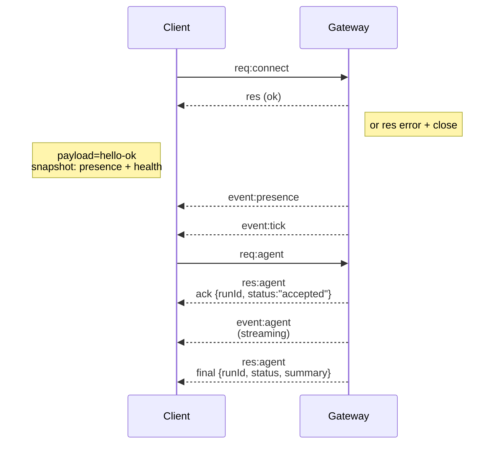

---
read_when:
    - کار روی پروتکل Gateway، کلاینت‌ها یا انتقال‌ها
summary: معماری Gateway مبتنی بر WebSocket، مؤلفه‌ها و جریان‌های کلاینت
title: معماری Gateway
x-i18n:
    generated_at: "2026-07-12T09:48:50Z"
    model: gpt-5.6
    postprocess_version: locale-links-v1
    provider: openai
    source_hash: f8054bd87f738b957c24f8d6965d55365de2293d44902530a9ba778afa597cc7
    source_path: concepts/architecture.md
    workflow: 16
---

## نمای کلی

- یک **Gateway** واحد و با عمر طولانی، مالک همه بسترهای پیام‌رسانی است (WhatsApp از طریق
  Baileys، Telegram از طریق grammY، Slack، Discord، Signal، iMessage و WebChat).
- کلاینت‌های صفحه کنترل (برنامه macOS، CLI، رابط وب و خودکارسازی‌ها) از طریق
  **WebSocket** روی میزبان اتصال پیکربندی‌شده (پیش‌فرض
  `127.0.0.1:18789`) به Gateway متصل می‌شوند.
- **Nodeها** (macOS/iOS/Android/بدون رابط) نیز از طریق **WebSocket** متصل می‌شوند، اما
  `role: node` را همراه با قابلیت‌ها/فرمان‌های صریح اعلام می‌کنند.
- برای هر میزبان یک Gateway وجود دارد؛ تنها همین Gateway نشست WhatsApp را باز می‌کند.
- **میزبان canvas** توسط سرور HTTP متعلق به Gateway در مسیرهای زیر ارائه می‌شود:
  - `/__openclaw__/canvas/` (HTML/CSS/JS قابل ویرایش توسط عامل)
  - `/__openclaw__/a2ui/` (میزبان A2UI)

  این میزبان از همان درگاه Gateway استفاده می‌کند (پیش‌فرض `18789`).

## مؤلفه‌ها و جریان‌ها

### Gateway (سرویس پس‌زمینه)

- اتصال‌های ارائه‌دهندگان را نگه می‌دارد.
- یک API نوع‌دار WS ارائه می‌کند (درخواست‌ها، پاسخ‌ها و رویدادهای ارسالی سرور).
- فریم‌های ورودی را در برابر JSON Schema اعتبارسنجی می‌کند.
- رویدادهایی مانند `agent`، `chat`، `presence`، `health`، `heartbeat` و `cron` منتشر می‌کند.

### کلاینت‌ها (برنامه مک / CLI / مدیریت وب)

- برای هر کلاینت یک اتصال WS برقرار می‌شود.
- درخواست‌ها را ارسال می‌کنند (`health`، `status`، `send`، `agent`، `system-presence`).
- مشترک رویدادها می‌شوند (`tick`، `agent`، `presence`، `shutdown`).

### Nodeها (macOS / iOS / Android / بدون رابط)

- با `role: node` به **همان سرور WS** متصل می‌شوند.
- در `connect` یک هویت دستگاه ارائه می‌کنند؛ جفت‌سازی **مبتنی بر دستگاه** است (نقش `node`) و
  تأیید در مخزن جفت‌سازی دستگاه نگهداری می‌شود.
- فرمان‌هایی مانند `canvas.*`، `camera.*`، `screen.record` و `location.get` را ارائه می‌کنند.

جزئیات پروتکل: [پروتکل Gateway](/fa/gateway/protocol)

### WebChat

- رابط کاربری ایستایی است که برای تاریخچه گفتگو و ارسال پیام از API مبتنی بر WS متعلق به Gateway استفاده می‌کند.
- در راه‌اندازی‌های راه دور، از طریق همان تونل SSH/Tailscale مورد استفاده سایر
  کلاینت‌ها متصل می‌شود.

## چرخه عمر اتصال (یک کلاینت)



## پروتکل انتقال (خلاصه)

- انتقال: WebSocket، با فریم‌های متنی حاوی بارهای JSON.
- نخستین فریم **باید** `connect` باشد.
- پس از دست‌دهی:
  - درخواست‌ها: `{type:"req", id, method, params}` → `{type:"res", id, ok, payload|error}`
  - رویدادها: `{type:"event", event, payload, seq?, stateVersion?}`
- `hello-ok.features.methods` / `events` فراداده‌های شناسایی هستند، نه
  خروجی تولیدشده‌ای از تمام مسیرهای کمکی قابل فراخوانی.
- احراز هویت با راز مشترک، بسته به حالت احراز هویت پیکربندی‌شده Gateway، از
  `connect.params.auth.token` یا `connect.params.auth.password` استفاده می‌کند.
- حالت‌های دارای هویت مانند Tailscale Serve
  (`gateway.auth.allowTailscale: true`) یا
  `gateway.auth.mode: "trusted-proxy"` در اتصال‌های غیر local loopback، احراز هویت را به‌جای
  `connect.params.auth.*` از سربرگ‌های درخواست انجام می‌دهند.
- `gateway.auth.mode: "none"` برای ورودی خصوصی، احراز هویت با راز مشترک را
  به‌طور کامل غیرفعال می‌کند؛ این حالت را برای ورودی عمومی/غیرقابل‌اعتماد غیرفعال نگه دارید.
- کلیدهای هم‌توانی برای روش‌های دارای اثر جانبی (`send`، `agent`) الزامی‌اند تا
  تلاش مجدد ایمن باشد؛ سرور یک حافظه نهان کوتاه‌عمر برای حذف موارد تکراری نگه می‌دارد.
- Nodeها باید `role: "node"` را همراه با قابلیت‌ها/فرمان‌ها/مجوزها در `connect` قرار دهند.

## جفت‌سازی و اعتماد محلی

- همه کلاینت‌های WS (گردانندگان + Nodeها) هنگام `connect` یک **هویت دستگاه** ارائه می‌کنند.
- شناسه‌های دستگاه جدید به تأیید جفت‌سازی نیاز دارند؛ Gateway برای اتصال‌های بعدی یک **توکن دستگاه**
  صادر می‌کند.
- اتصال‌های مستقیم local loopback می‌توانند به‌طور خودکار تأیید شوند تا تجربه کاربری روی همان میزبان
  روان باقی بماند.
- OpenClaw همچنین یک مسیر محدود اتصال به خود در محدوده محلی بک‌اند/کانتینر برای
  جریان‌های کمکی قابل‌اعتماد مبتنی بر راز مشترک دارد.
- اتصال‌های Tailnet و LAN، از جمله اتصال‌های Tailnet روی همان میزبان، همچنان به
  تأیید صریح جفت‌سازی نیاز دارند.
- همه اتصال‌ها باید مقدار nonce در `connect.challenge` را امضا کنند. بار امضای `v3`
  همچنین `platform` و `deviceFamily` را مقید می‌کند؛ Gateway هنگام اتصال مجدد، فراداده جفت‌شده را
  ثابت نگه می‌دارد و برای تغییر فراداده، جفت‌سازی ترمیمی را الزامی می‌کند.
- اتصال‌های **غیرمحلی** همچنان به تأیید صریح نیاز دارند.
- احراز هویت Gateway (`gateway.auth.*`) همچنان برای **همه** اتصال‌ها، چه محلی و چه
  راه دور، اعمال می‌شود.

جزئیات: [پروتکل Gateway](/fa/gateway/protocol)، [جفت‌سازی](/fa/channels/pairing)،
[امنیت](/fa/gateway/security).

## نوع‌دهی پروتکل و تولید کد

- طرح‌واره‌های TypeBox پروتکل را تعریف می‌کنند.
- JSON Schema از این طرح‌واره‌ها تولید می‌شود.
- مدل‌های Swift از JSON Schema تولید می‌شوند.

## دسترسی راه دور

- روش ترجیحی: Tailscale یا VPN.
- روش جایگزین: تونل SSH

  ```bash
  ssh -N -L 18789:127.0.0.1:18789 user@gateway-host
  ```

- همان دست‌دهی و توکن احراز هویت روی تونل نیز اعمال می‌شوند.
- در راه‌اندازی‌های راه دور می‌توان TLS و سنجاق‌کردن اختیاری را برای WS فعال کرد.

## نمای لحظه‌ای عملیات

- راه‌اندازی: `openclaw gateway` (در پیش‌زمینه، ثبت گزارش در stdout).
- سلامت: `health` از طریق WS (در `hello-ok` نیز گنجانده شده است).
- نظارت: launchd/systemd برای راه‌اندازی مجدد خودکار.

## ناورداها

- دقیقاً یک Gateway در هر میزبان، یک نشست Baileys را کنترل می‌کند.
- دست‌دهی الزامی است؛ هر فریم نخستین غیر JSON یا غیر `connect` باعث بسته‌شدن قطعی اتصال می‌شود.
- رویدادها بازپخش نمی‌شوند؛ کلاینت‌ها باید در صورت وجود فاصله، داده‌ها را تازه‌سازی کنند.

## مطالب مرتبط

- [حلقه عامل](/fa/concepts/agent-loop) — چرخه اجرای تفصیلی عامل
- [پروتکل Gateway](/fa/gateway/protocol) — قرارداد پروتکل WebSocket
- [صف](/fa/concepts/queue) — صف فرمان و هم‌زمانی
- [امنیت](/fa/gateway/security) — مدل اعتماد و مقاوم‌سازی
