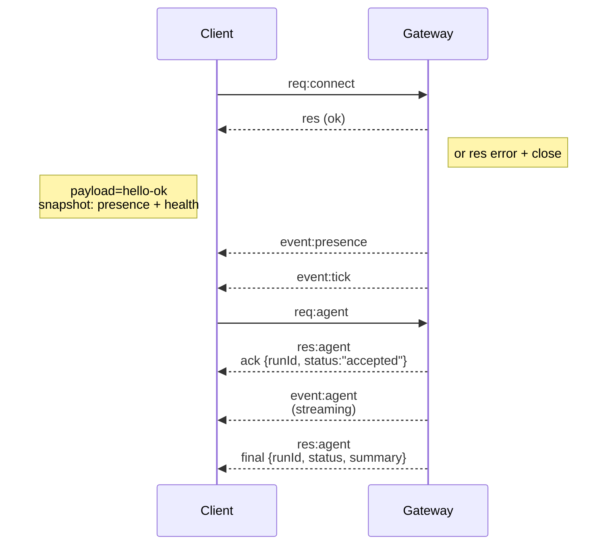

---
read_when:
    - کار روی پروتکل Gateway، کلاینت‌ها یا ترنسپورت‌ها
summary: معماری Gateway WebSocket، مؤلفه‌ها و جریان‌های کلاینت
title: معماری Gateway
x-i18n:
    generated_at: "2026-04-29T22:41:04Z"
    model: gpt-5.5
    provider: openai
    source_hash: 91c553489da18b6ad83fc860014f5bfb758334e9789cb7893d4d00f81c650f02
    source_path: concepts/architecture.md
    workflow: 16
---

## نمای کلی

- یک **Gateway** واحد و بلندمدت مالک همهٔ سطوح پیام‌رسانی است (WhatsApp از طریق
  Baileys، Telegram از طریق grammY، Slack، Discord، Signal، iMessage، WebChat).
- کلاینت‌های سطح کنترل (برنامهٔ macOS، CLI، رابط کاربری وب، خودکارسازی‌ها) از طریق
  **WebSocket** روی میزبان bind پیکربندی‌شده به Gateway وصل می‌شوند (پیش‌فرض
  `127.0.0.1:18789`).
- **Nodeها** (macOS/iOS/Android/headless) نیز از طریق **WebSocket** وصل می‌شوند، اما
  `role: node` را با caps/commands صریح اعلام می‌کنند.
- در هر میزبان یک Gateway وجود دارد؛ این تنها جایی است که یک نشست WhatsApp را باز می‌کند.
- **میزبان canvas** توسط سرور HTTP مربوط به Gateway در مسیرهای زیر ارائه می‌شود:
  - `/__openclaw__/canvas/` (HTML/CSS/JS قابل ویرایش توسط عامل)
  - `/__openclaw__/a2ui/` (میزبان A2UI)
    از همان پورتی استفاده می‌کند که Gateway استفاده می‌کند (پیش‌فرض `18789`).

## مؤلفه‌ها و جریان‌ها

### Gateway (دایمون)

- اتصال‌های ارائه‌دهنده‌ها را نگه می‌دارد.
- یک API تایپ‌شدهٔ WS را ارائه می‌کند (درخواست‌ها، پاسخ‌ها، رویدادهای server-push).
- فریم‌های ورودی را در برابر JSON Schema اعتبارسنجی می‌کند.
- رویدادهایی مانند `agent`، `chat`، `presence`، `health`، `heartbeat`، `cron` را منتشر می‌کند.

### کلاینت‌ها (برنامهٔ مک / CLI / مدیر وب)

- برای هر کلاینت یک اتصال WS وجود دارد.
- درخواست‌ها را ارسال می‌کنند (`health`، `status`، `send`، `agent`، `system-presence`).
- در رویدادها مشترک می‌شوند (`tick`، `agent`، `presence`، `shutdown`).

### Nodeها (macOS / iOS / Android / headless)

- با `role: node` به **همان سرور WS** وصل می‌شوند.
- در `connect` یک هویت دستگاه ارائه می‌کنند؛ جفت‌سازی **مبتنی بر دستگاه** است (نقش `node`) و
  تأیید در مخزن جفت‌سازی دستگاه قرار دارد.
- دستورهایی مانند `canvas.*`، `camera.*`، `screen.record`، `location.get` را ارائه می‌کنند.

جزئیات پروتکل:

- [پروتکل Gateway](/fa/gateway/protocol)

### WebChat

- رابط کاربری ایستایی که برای تاریخچهٔ گفت‌وگو و ارسال‌ها از API مربوط به WS در Gateway استفاده می‌کند.
- در راه‌اندازی‌های راه دور، از همان تونل SSH/Tailscale وصل می‌شود که سایر
  کلاینت‌ها استفاده می‌کنند.

## چرخهٔ عمر اتصال (یک کلاینت)



## پروتکل سیمی (خلاصه)

- انتقال: WebSocket، فریم‌های متنی با payloadهای JSON.
- نخستین فریم **باید** `connect` باشد.
- پس از handshake:
  - درخواست‌ها: `{type:"req", id, method, params}` → `{type:"res", id, ok, payload|error}`
  - رویدادها: `{type:"event", event, payload, seq?, stateVersion?}`
- `hello-ok.features.methods` / `events` فرادادهٔ کشف هستند، نه یک
  خروجی تولیدشده از همهٔ مسیرهای helper قابل فراخوانی.
- احراز هویت shared-secret بسته به حالت auth پیکربندی‌شدهٔ gateway از `connect.params.auth.token` یا
  `connect.params.auth.password` استفاده می‌کند.
- حالت‌های دارای هویت مانند Tailscale Serve
  (`gateway.auth.allowTailscale: true`) یا `gateway.auth.mode: "trusted-proxy"` غیر loopback
  احراز هویت را به‌جای `connect.params.auth.*` از هدرهای درخواست برآورده می‌کنند.
- `gateway.auth.mode: "none"` برای private-ingress احراز هویت shared-secret را
  به‌طور کامل غیرفعال می‌کند؛ این حالت را روی ورودی عمومی/نامطمئن خاموش نگه دارید.
- کلیدهای idempotency برای متدهای دارای اثر جانبی (`send`، `agent`) لازم‌اند تا
  تلاش دوباره با امنیت انجام شود؛ سرور یک کش کوتاه‌مدت برای dedupe نگه می‌دارد.
- Nodeها باید `role: "node"` به‌همراه caps/commands/permissions را در `connect` شامل کنند.

## جفت‌سازی + اعتماد محلی

- همهٔ کلاینت‌های WS (اپراتورها + Nodeها) در `connect` یک **هویت دستگاه** را شامل می‌کنند.
- شناسه‌های دستگاه جدید به تأیید جفت‌سازی نیاز دارند؛ Gateway برای اتصال‌های بعدی یک **توکن دستگاه**
  صادر می‌کند.
- اتصال‌های مستقیم local loopback می‌توانند به‌صورت خودکار تأیید شوند تا تجربهٔ همان میزبان
  روان بماند.
- OpenClaw همچنین یک مسیر باریک self-connect محلی برای backend/container جهت
  جریان‌های helper مطمئن مبتنی بر shared-secret دارد.
- اتصال‌های tailnet و LAN، از جمله bindهای tailnet همان میزبان، همچنان به
  تأیید صریح جفت‌سازی نیاز دارند.
- همهٔ اتصال‌ها باید nonce مربوط به `connect.challenge` را امضا کنند.
- payload امضای `v3` همچنین `platform` + `deviceFamily` را bind می‌کند؛ gateway
  فرادادهٔ جفت‌شده را هنگام اتصال دوباره pin می‌کند و برای تغییرات فراداده به جفت‌سازی repair نیاز دارد.
- اتصال‌های **غیرمحلی** همچنان به تأیید صریح نیاز دارند.
- auth مربوط به Gateway (`gateway.auth.*`) همچنان برای **همهٔ** اتصال‌ها، محلی یا
  راه دور، اعمال می‌شود.

جزئیات: [پروتکل Gateway](/fa/gateway/protocol)، [جفت‌سازی](/fa/channels/pairing)،
[امنیت](/fa/gateway/security).

## تایپ‌گذاری پروتکل و codegen

- schemaهای TypeBox پروتکل را تعریف می‌کنند.
- JSON Schema از آن schemaها تولید می‌شود.
- مدل‌های Swift از JSON Schema تولید می‌شوند.

## دسترسی راه دور

- ترجیحی: Tailscale یا VPN.
- جایگزین: تونل SSH

  ```bash
  ssh -N -L 18789:127.0.0.1:18789 user@host
  ```

- همان handshake + توکن auth روی تونل اعمال می‌شود.
- TLS + pinning اختیاری را می‌توان برای WS در راه‌اندازی‌های راه دور فعال کرد.

## نمای فوری عملیات

- شروع: `openclaw gateway` (foreground، لاگ‌ها در stdout).
- سلامت: `health` از طریق WS (همچنین در `hello-ok` گنجانده شده است).
- نظارت: launchd/systemd برای راه‌اندازی دوبارهٔ خودکار.

## ناوردایی‌ها

- دقیقاً یک Gateway یک نشست Baileys واحد را در هر میزبان کنترل می‌کند.
- handshake اجباری است؛ هر فریم اول غیر JSON یا غیر `connect` باعث بستن سخت اتصال می‌شود.
- رویدادها بازپخش نمی‌شوند؛ کلاینت‌ها باید هنگام وجود فاصله refresh کنند.

## مرتبط

- [حلقهٔ عامل](/fa/concepts/agent-loop) — چرخهٔ اجرای تفصیلی عامل
- [پروتکل Gateway](/fa/gateway/protocol) — قرارداد پروتکل WebSocket
- [صف](/fa/concepts/queue) — صف دستور و هم‌زمانی
- [امنیت](/fa/gateway/security) — مدل اعتماد و سخت‌سازی
