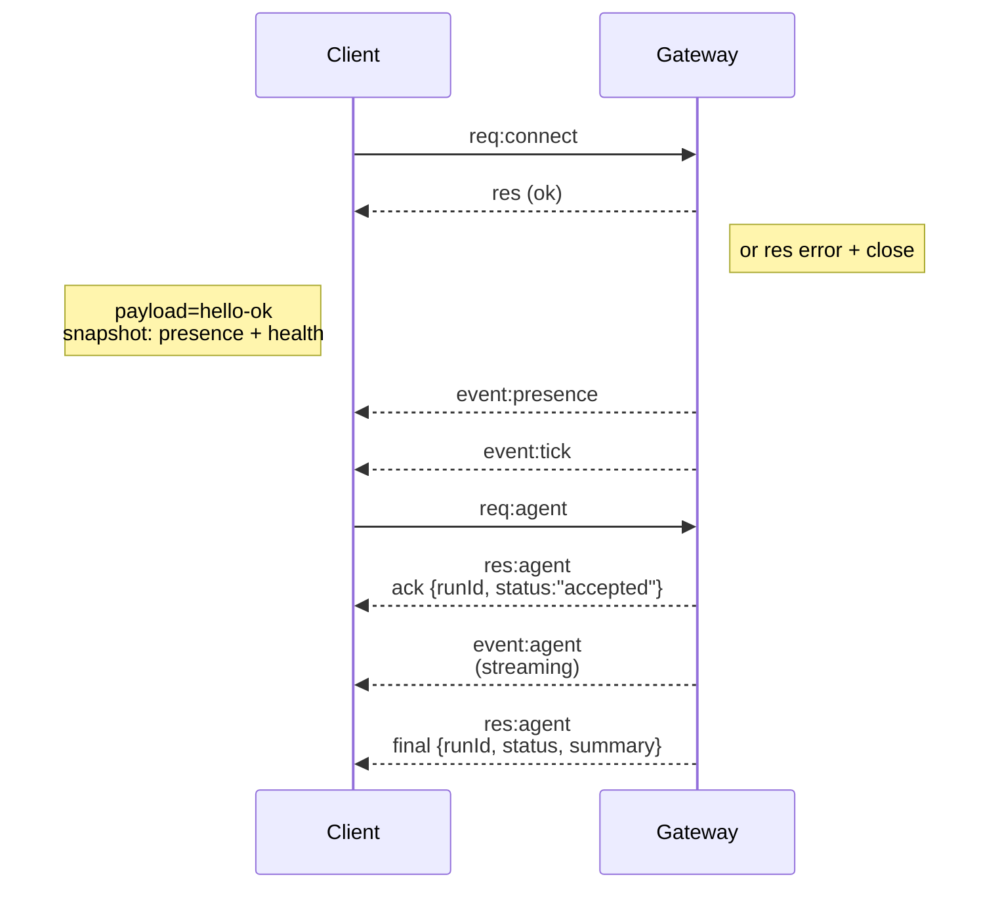

---
read_when:
    - کار روی پروتکل Gateway، کلاینت‌ها یا سازوکارهای انتقال
summary: معماری Gateway وب‌سوکت، اجزا، و جریان‌های کلاینت
title: معماری Gateway
x-i18n:
    generated_at: "2026-05-06T09:09:08Z"
    model: gpt-5.5
    provider: openai
    source_hash: 433489081bfe07691b211f5076ec45ce0ed3fd043eb86128f73121f2cab71cd3
    source_path: concepts/architecture.md
    workflow: 16
    postprocess_version: locale-links-v1
---

## نمای کلی

- یک **Gateway** واحد و دیرپا مالک همه سطوح پیام‌رسانی است (WhatsApp از طریق
  Baileys، Telegram از طریق grammY، Slack، Discord، Signal، iMessage، WebChat).
- کلاینت‌های سطح کنترل (برنامه macOS، CLI، رابط وب، خودکارسازی‌ها) از طریق
  **وب‌سوکت** روی میزبان bind پیکربندی‌شده (پیش‌فرض
  `127.0.0.1:18789`) به Gateway وصل می‌شوند.
- **نودها** (macOS/iOS/Android/headless) نیز از طریق **وب‌سوکت** وصل می‌شوند، اما
  `role: node` را با caps/commands صریح اعلام می‌کنند.
- برای هر میزبان یک Gateway وجود دارد؛ تنها جایی است که یک نشست WhatsApp را باز می‌کند.
- **میزبان canvas** توسط سرور HTTP Gateway در مسیرهای زیر ارائه می‌شود:
  - `/__openclaw__/canvas/` (HTML/CSS/JS قابل ویرایش توسط عامل)
  - `/__openclaw__/a2ui/` (میزبان A2UI)
    از همان پورت Gateway استفاده می‌کند (پیش‌فرض `18789`).

## مؤلفه‌ها و جریان‌ها

### Gateway (daemon)

- اتصال‌های provider را نگه می‌دارد.
- یک API نوع‌دار WS را ارائه می‌کند (درخواست‌ها، پاسخ‌ها، رویدادهای server-push).
- فریم‌های ورودی را با JSON Schema اعتبارسنجی می‌کند.
- رویدادهایی مانند `agent`، `chat`، `presence`، `health`، `heartbeat`، `cron` منتشر می‌کند.

### کلاینت‌ها (برنامه mac / CLI / مدیریت وب)

- برای هر کلاینت یک اتصال WS.
- درخواست‌ها را می‌فرستند (`health`، `status`، `send`، `agent`، `system-presence`).
- در رویدادها عضو می‌شوند (`tick`، `agent`، `presence`، `shutdown`).

### نودها (macOS / iOS / Android / headless)

- با `role: node` به **همان سرور WS** وصل می‌شوند.
- در `connect` یک هویت دستگاه ارائه می‌کنند؛ pairing **مبتنی بر دستگاه** است (نقش `node`) و
  تأیید در مخزن pairing دستگاه نگهداری می‌شود.
- فرمان‌هایی مانند `canvas.*`، `camera.*`، `screen.record`، `location.get` را ارائه می‌کنند.

جزئیات پروتکل:

- [پروتکل Gateway](/fa/gateway/protocol)

### WebChat

- رابط ایستایی که از API وب‌سوکت Gateway برای تاریخچه گفت‌وگو و ارسال‌ها استفاده می‌کند.
- در راه‌اندازی‌های ریموت، از همان تونل SSH/Tailscale مانند سایر
  کلاینت‌ها وصل می‌شود.

## چرخه عمر اتصال (یک کلاینت)



## پروتکل سیمی (خلاصه)

- انتقال: وب‌سوکت، فریم‌های متنی با payloadهای JSON.
- فریم اول **باید** `connect` باشد.
- پس از handshake:
  - درخواست‌ها: `{type:"req", id, method, params}` → `{type:"res", id, ok, payload|error}`
  - رویدادها: `{type:"event", event, payload, seq?, stateVersion?}`
- `hello-ok.features.methods` / `events` فراداده discovery هستند، نه
  dump تولیدشده از هر مسیر helper قابل فراخوانی.
- احراز هویت shared-secret بسته به حالت احراز هویت gateway پیکربندی‌شده، از
  `connect.params.auth.token` یا
  `connect.params.auth.password` استفاده می‌کند.
- حالت‌های دارای هویت مانند Tailscale Serve
  (`gateway.auth.allowTailscale: true`) یا non-loopback
  `gateway.auth.mode: "trusted-proxy"` احراز هویت را به‌جای `connect.params.auth.*`
  از headerهای درخواست تأمین می‌کنند.
- `gateway.auth.mode: "none"` برای private-ingress احراز هویت shared-secret را
  کاملاً غیرفعال می‌کند؛ این حالت را برای ingress عمومی/نامطمئن خاموش نگه دارید.
- کلیدهای idempotency برای متدهای دارای اثر جانبی (`send`، `agent`) لازم‌اند تا
  retry ایمن باشد؛ سرور یک cache کوتاه‌عمر dedupe نگه می‌دارد.
- نودها باید `role: "node"` به‌علاوه caps/commands/permissions را در `connect` شامل کنند.

## Pairing + اعتماد محلی

- همه کلاینت‌های WS (اپراتورها + نودها) هنگام `connect` یک **هویت دستگاه** دارند.
- شناسه‌های دستگاه جدید به تأیید pairing نیاز دارند؛ Gateway برای اتصال‌های بعدی یک **توکن دستگاه**
  صادر می‌کند.
- اتصال‌های مستقیم local loopback می‌توانند خودکار تأیید شوند تا تجربه همان میزبان
  روان بماند.
- OpenClaw همچنین یک مسیر محدود self-connect محلیِ backend/container برای
  جریان‌های helper قابل اعتماد با shared-secret دارد.
- اتصال‌های tailnet و LAN، از جمله bindهای tailnet روی همان میزبان، همچنان به
  تأیید صریح pairing نیاز دارند.
- همه اتصال‌ها باید nonce مربوط به `connect.challenge` را امضا کنند.
- payload امضای `v3` همچنین `platform` + `deviceFamily` را bind می‌کند؛ gateway
  فراداده paired را هنگام reconnect pin می‌کند و برای تغییرات فراداده به repair pairing نیاز دارد.
- اتصال‌های **غیرمحلی** همچنان به تأیید صریح نیاز دارند.
- احراز هویت Gateway (`gateway.auth.*`) همچنان برای **همه** اتصال‌ها، محلی یا
  ریموت، اعمال می‌شود.

جزئیات: [پروتکل Gateway](/fa/gateway/protocol)، [Pairing](/fa/channels/pairing)،
[امنیت](/fa/gateway/security).

## نوع‌دهی پروتکل و codegen

- schemaهای TypeBox پروتکل را تعریف می‌کنند.
- JSON Schema از آن schemaها تولید می‌شود.
- مدل‌های Swift از JSON Schema تولید می‌شوند.

## دسترسی ریموت

- ترجیحی: Tailscale یا VPN.
- جایگزین: تونل SSH

  ```bash
  ssh -N -L 18789:127.0.0.1:18789 user@host
  ```

- همان handshake + توکن احراز هویت روی تونل اعمال می‌شود.
- TLS + pinning اختیاری را می‌توان برای WS در راه‌اندازی‌های ریموت فعال کرد.

## نمای عملیات

- شروع: `openclaw gateway` (foreground، لاگ‌ها به stdout).
- سلامت: `health` روی WS (همچنین در `hello-ok` گنجانده شده است).
- نظارت: launchd/systemd برای راه‌اندازی دوباره خودکار.

## ناوردایی‌ها

- دقیقاً یک Gateway یک نشست Baileys واحد را برای هر میزبان کنترل می‌کند.
- Handshake الزامی است؛ هر فریم اول غیر JSON یا غیر `connect` باعث بستن سخت اتصال می‌شود.
- رویدادها replay نمی‌شوند؛ کلاینت‌ها باید در صورت وجود gap تازه‌سازی کنند.

## مرتبط

- [حلقه عامل](/fa/concepts/agent-loop) — چرخه اجرای تفصیلی عامل
- [پروتکل Gateway](/fa/gateway/protocol) — قرارداد پروتکل وب‌سوکت
- [صف](/fa/concepts/queue) — صف فرمان و هم‌روندی
- [امنیت](/fa/gateway/security) — مدل اعتماد و سخت‌سازی
