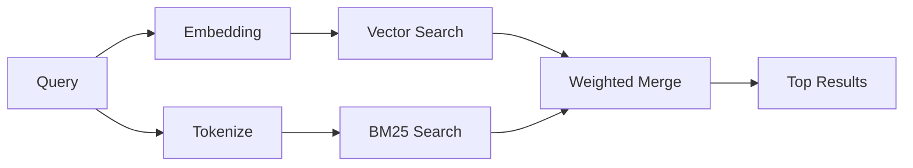

---
read_when:
    - می‌خواهید بفهمید memory_search چگونه کار می‌کند
    - می‌خواهید یک ارائه‌دهندهٔ امبدینگ انتخاب کنید
    - می‌خواهید کیفیت جست‌وجو را تنظیم کنید
summary: جست‌وجوی حافظه چگونه یادداشت‌های مرتبط را با استفاده از تعبیه‌سازی‌ها و بازیابی ترکیبی پیدا می‌کند
title: جستجوی حافظه
x-i18n:
    generated_at: "2026-04-30T16:27:57Z"
    model: gpt-5.5
    provider: openai
    source_hash: 7f40bbe32453a28070ffc67f19a4c06e2fe59a24237a2aef353f4b9b8260bcf2
    source_path: concepts/memory-search.md
    workflow: 16
---

`memory_search` یادداشت‌های مرتبط را از فایل‌های حافظه‌ی شما پیدا می‌کند، حتی وقتی
عبارت‌بندی با متن اصلی فرق داشته باشد. این کار با نمایه‌سازی حافظه در قطعه‌های
کوچک و جست‌وجوی آن‌ها با استفاده از embeddingها، کلیدواژه‌ها، یا هر دو انجام می‌شود.

## شروع سریع

اگر اشتراک GitHub Copilot، یا کلید API پیکربندی‌شده برای OpenAI، Gemini، Voyage، یا Mistral
دارید، جست‌وجوی حافظه به‌صورت خودکار کار می‌کند. برای تنظیم صریح یک ارائه‌دهنده:

```json5
{
  agents: {
    defaults: {
      memorySearch: {
        provider: "openai", // or "gemini", "local", "ollama", etc.
      },
    },
  },
}
```

برای راه‌اندازی‌های چندنقطه‌پایانی، `provider` همچنین می‌تواند یک ورودی سفارشی
`models.providers.<id>` باشد، مانند `ollama-5080`، وقتی آن ارائه‌دهنده
`api: "ollama"` یا مالک آداپتور embedding دیگری را تنظیم می‌کند.

برای embeddingهای محلی بدون کلید API، `provider: "local"` را تنظیم کنید. نصب‌های بسته‌بندی‌شده
runtime بومی `node-llama-cpp` را در درخت runtime-deps مربوط به Plugin مدیریت‌شده‌ی OpenClaw
نگه می‌دارند؛ اگر آن درخت به ترمیم نیاز دارد، `openclaw doctor --fix` را اجرا کنید.

برخی نقطه‌پایانی‌های embedding سازگار با OpenAI به برچسب‌های نامتقارن مانند
`input_type: "query"` برای جست‌وجوها و `input_type: "document"` یا `"passage"`
برای قطعه‌های نمایه‌شده نیاز دارند. آن‌ها را با `memorySearch.queryInputType` و
`memorySearch.documentInputType` پیکربندی کنید؛ [مرجع پیکربندی حافظه](/fa/reference/memory-config#provider-specific-config) را ببینید.

## ارائه‌دهنده‌های پشتیبانی‌شده

| ارائه‌دهنده | شناسه | به کلید API نیاز دارد | یادداشت‌ها |
| -------------- | ---------------- | ------------- | ---------------------------------------------------- |
| Bedrock        | `bedrock`        | خیر | وقتی زنجیره‌ی اعتبارنامه‌ی AWS resolve شود، به‌صورت خودکار شناسایی می‌شود |
| Gemini         | `gemini`         | بله | از نمایه‌سازی تصویر/صدا پشتیبانی می‌کند |
| GitHub Copilot | `github-copilot` | خیر | به‌صورت خودکار شناسایی می‌شود، از اشتراک Copilot استفاده می‌کند |
| Local          | `local`          | خیر | مدل GGUF، دانلود حدود ۰٫۶ گیگابایت |
| Mistral        | `mistral`        | بله | به‌صورت خودکار شناسایی می‌شود |
| Ollama         | `ollama`         | خیر | محلی، باید صریح تنظیم شود |
| OpenAI         | `openai`         | بله | به‌صورت خودکار شناسایی می‌شود، سریع |
| Voyage         | `voyage`         | بله | به‌صورت خودکار شناسایی می‌شود |

## جست‌وجو چگونه کار می‌کند

OpenClaw دو مسیر بازیابی را به‌صورت موازی اجرا می‌کند و نتایج را ادغام می‌کند:



- **جست‌وجوی برداری** یادداشت‌هایی با معنای مشابه را پیدا می‌کند ("gateway host" با
  "the machine running OpenClaw" تطبیق می‌یابد).
- **جست‌وجوی کلیدواژه‌ای BM25** تطبیق‌های دقیق را پیدا می‌کند (شناسه‌ها، رشته‌های خطا، کلیدهای
  پیکربندی).

اگر فقط یک مسیر در دسترس باشد (بدون embedding یا بدون FTS)، همان مسیر به‌تنهایی اجرا می‌شود.

وقتی embeddingها در دسترس نیستند، OpenClaw همچنان به‌جای بازگشت صرف به ترتیب‌دهی خام مبتنی بر تطبیق دقیق، از رتبه‌بندی واژگانی روی نتایج FTS استفاده می‌کند. آن حالت تنزل‌یافته قطعه‌هایی را که پوشش قوی‌تری از عبارت‌های پرس‌وجو و مسیرهای فایل مرتبط دارند تقویت می‌کند، که حتی بدون `sqlite-vec` یا ارائه‌دهنده‌ی embedding نیز یادآوری را مفید نگه می‌دارد.

## بهبود کیفیت جست‌وجو

دو قابلیت اختیاری زمانی کمک می‌کنند که تاریخچه‌ی یادداشت بزرگی دارید:

### کاهش زمانی

یادداشت‌های قدیمی به‌تدریج وزن رتبه‌بندی خود را از دست می‌دهند تا اطلاعات جدیدتر اول ظاهر شوند.
با نیمه‌عمر پیش‌فرض ۳۰ روز، یادداشتی از ماه گذشته ۵۰٪ وزن
اصلی خود را می‌گیرد. فایل‌های همیشه‌سبز مانند `MEMORY.md` هرگز کاهش داده نمی‌شوند.

<Tip>
اگر agent شما ماه‌ها یادداشت روزانه دارد و اطلاعات کهنه همچنان بالاتر از زمینه‌ی جدید رتبه می‌گیرند، کاهش زمانی را فعال کنید.
</Tip>

### MMR (تنوع)

نتایج تکراری را کاهش می‌دهد. اگر پنج یادداشت همگی به یک پیکربندی router اشاره کنند، MMR
تضمین می‌کند نتایج برتر به‌جای تکرار، موضوعات متفاوتی را پوشش دهند.

<Tip>
اگر `memory_search` مدام قطعه‌های تقریباً تکراری از یادداشت‌های روزانه‌ی متفاوت برمی‌گرداند، MMR را فعال کنید.
</Tip>

### فعال‌سازی هر دو

```json5
{
  agents: {
    defaults: {
      memorySearch: {
        query: {
          hybrid: {
            mmr: { enabled: true },
            temporalDecay: { enabled: true },
          },
        },
      },
    },
  },
}
```

## حافظه‌ی چندوجهی

با Gemini Embedding 2، می‌توانید تصویرها و فایل‌های صوتی را در کنار
Markdown نمایه‌سازی کنید. پرس‌وجوهای جست‌وجو همچنان متنی می‌مانند، اما با محتوای دیداری و صوتی
تطبیق می‌یابند. برای راه‌اندازی، [مرجع پیکربندی حافظه](/fa/reference/memory-config) را ببینید.

## جست‌وجوی حافظه‌ی نشست

می‌توانید به‌صورت اختیاری رونوشت‌های نشست را نمایه‌سازی کنید تا `memory_search` بتواند
گفت‌وگوهای قبلی را به یاد بیاورد. این قابلیت از طریق
`memorySearch.experimental.sessionMemory` انتخابی است. برای جزئیات،
[مرجع پیکربندی](/fa/reference/memory-config) را ببینید.

## عیب‌یابی

**نتیجه‌ای نیست؟** برای بررسی نمایه، `openclaw memory status` را اجرا کنید. اگر خالی است،
`openclaw memory index --force` را اجرا کنید.

**فقط تطبیق‌های کلیدواژه‌ای؟** ممکن است ارائه‌دهنده‌ی embedding شما پیکربندی نشده باشد. بررسی کنید:
`openclaw memory status --deep`.

**embeddingهای محلی timeout می‌شوند؟** `ollama`، `lmstudio`، و `local` به‌طور پیش‌فرض از timeout دسته‌ی inline طولانی‌تری استفاده می‌کنند. اگر میزبان صرفاً کند است،
`agents.defaults.memorySearch.sync.embeddingBatchTimeoutSeconds` را تنظیم کنید و دوباره
`openclaw memory index --force` را اجرا کنید.

**متن CJK پیدا نمی‌شود؟** نمایه‌ی FTS را با
`openclaw memory index --force` دوباره بسازید.

## مطالعه‌ی بیشتر

- [Active Memory](/fa/concepts/active-memory) -- حافظه‌ی sub-agent برای نشست‌های گفت‌وگوی تعاملی
- [حافظه](/fa/concepts/memory) -- چیدمان فایل، backendها، ابزارها
- [مرجع پیکربندی حافظه](/fa/reference/memory-config) -- همه‌ی کنترل‌های پیکربندی

## مرتبط

- [نمای کلی حافظه](/fa/concepts/memory)
- [Active Memory](/fa/concepts/active-memory)
- [موتور حافظه‌ی داخلی](/fa/concepts/memory-builtin)
