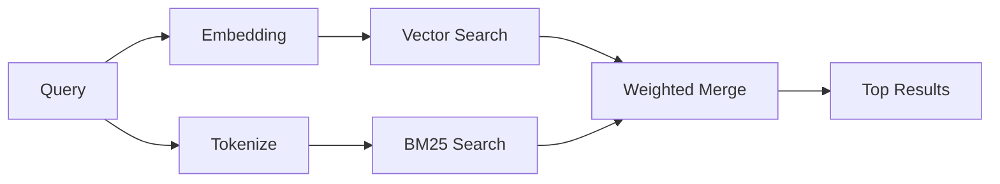

---
read_when:
    - می‌خواهید بدانید memory_search چگونه کار می‌کند
    - می‌خواهید یک ارائه‌دهندهٔ بردارسازی انتخاب کنید
    - می‌خواهید کیفیت جست‌وجو را تنظیم کنید
summary: جست‌وجوی حافظه چگونه با استفاده از جاسازی‌ها و بازیابی ترکیبی یادداشت‌های مرتبط را پیدا می‌کند
title: جست‌وجوی حافظه
x-i18n:
    generated_at: "2026-04-29T22:43:46Z"
    model: gpt-5.5
    provider: openai
    source_hash: 3e6c44d90f49a797bda01b9a575928c128a334f89ae14fc3620e65562a866aa9
    source_path: concepts/memory-search.md
    workflow: 16
---

`memory_search` یادداشت‌های مرتبط را از فایل‌های حافظه شما پیدا می‌کند، حتی وقتی
عبارت‌بندی با متن اصلی متفاوت باشد. این کار با نمایه‌سازی حافظه به قطعه‌های
کوچک و جست‌وجوی آن‌ها با استفاده از تعبیه‌ها، کلیدواژه‌ها، یا هر دو انجام می‌شود.

## شروع سریع

اگر اشتراک GitHub Copilot یا کلید API پیکربندی‌شده برای OpenAI، Gemini، Voyage یا Mistral
دارید، جست‌وجوی حافظه به‌صورت خودکار کار می‌کند. برای تنظیم صریح یک ارائه‌دهنده:

```json5
{
  agents: {
    defaults: {
      memorySearch: {
        provider: "openai", // or "gemini", "local", "ollama", etc.
      },
    },
  },
}
```

برای راه‌اندازی‌های چندنقطه‌پایانی، `provider` همچنین می‌تواند یک ورودی سفارشی
`models.providers.<id>` باشد، مانند `ollama-5080`، وقتی آن ارائه‌دهنده
`api: "ollama"` یا مالک آداپتور تعبیه دیگری را تنظیم می‌کند.

برای تعبیه‌های محلی بدون کلید API، بسته اختیاری زمان اجرای `node-llama-cpp`
را کنار OpenClaw نصب کنید و از `provider: "local"` استفاده کنید.

برخی نقطه‌پایانی‌های تعبیه سازگار با OpenAI به برچسب‌های نامتقارن نیاز دارند، مانند
`input_type: "query"` برای جست‌وجوها و `input_type: "document"` یا `"passage"`
برای قطعه‌های نمایه‌شده. آن‌ها را با `memorySearch.queryInputType` و
`memorySearch.documentInputType` پیکربندی کنید؛ [مرجع پیکربندی حافظه](/fa/reference/memory-config#provider-specific-config) را ببینید.

## ارائه‌دهندگان پشتیبانی‌شده

| ارائه‌دهنده | شناسه | به کلید API نیاز دارد | یادداشت‌ها |
| -------------- | ---------------- | ------------- | ---------------------------------------------------- |
| Bedrock        | `bedrock`        | خیر           | وقتی زنجیره اعتبار AWS resolve شود، به‌صورت خودکار شناسایی می‌شود |
| Gemini         | `gemini`         | بله           | از نمایه‌سازی تصویر/صدا پشتیبانی می‌کند |
| GitHub Copilot | `github-copilot` | خیر           | به‌صورت خودکار شناسایی می‌شود، از اشتراک Copilot استفاده می‌کند |
| Local          | `local`          | خیر           | مدل GGUF، دانلود حدود ۰٫۶ گیگابایت |
| Mistral        | `mistral`        | بله           | به‌صورت خودکار شناسایی می‌شود |
| Ollama         | `ollama`         | خیر           | محلی، باید صریح تنظیم شود |
| OpenAI         | `openai`         | بله           | به‌صورت خودکار شناسایی می‌شود، سریع |
| Voyage         | `voyage`         | بله           | به‌صورت خودکار شناسایی می‌شود |

## نحوه کار جست‌وجو

OpenClaw دو مسیر بازیابی را به‌صورت موازی اجرا می‌کند و نتایج را ادغام می‌کند:



- **جست‌وجوی برداری** یادداشت‌هایی با معنای مشابه پیدا می‌کند («میزبان Gateway» با
  «ماشینی که OpenClaw را اجرا می‌کند» تطبیق می‌یابد).
- **جست‌وجوی کلیدواژه‌ای BM25** تطبیق‌های دقیق را پیدا می‌کند (شناسه‌ها، رشته‌های خطا، کلیدهای
  پیکربندی).

اگر فقط یک مسیر در دسترس باشد (بدون تعبیه‌ها یا بدون FTS)، همان مسیر به‌تنهایی اجرا می‌شود.

وقتی تعبیه‌ها در دسترس نباشند، OpenClaw همچنان به‌جای بازگشت صرف به ترتیب تطبیق دقیق خام، از رتبه‌بندی واژگانی روی نتایج FTS استفاده می‌کند. این حالت تنزل‌یافته، قطعه‌هایی را که پوشش قوی‌تری برای واژه‌های جست‌وجو و مسیرهای فایل مرتبط دارند تقویت می‌کند، که باعث می‌شود بازیابی حتی بدون `sqlite-vec` یا ارائه‌دهنده تعبیه مفید بماند.

## بهبود کیفیت جست‌وجو

دو قابلیت اختیاری وقتی تاریخچه یادداشت بزرگی دارید کمک می‌کنند:

### افت زمانی

یادداشت‌های قدیمی به‌تدریج وزن رتبه‌بندی خود را از دست می‌دهند تا اطلاعات جدیدتر ابتدا نمایش داده شوند.
با نیمه‌عمر پیش‌فرض ۳۰ روز، امتیاز یادداشتی از ماه گذشته ۵۰٪ وزن
اصلی خود خواهد بود. فایل‌های همیشه‌سبز مانند `MEMORY.md` هرگز دچار افت نمی‌شوند.

<Tip>
اگر عامل شما ماه‌ها یادداشت روزانه دارد و اطلاعات کهنه همچنان بالاتر از زمینه جدیدتر رتبه می‌گیرند، افت زمانی را فعال کنید.
</Tip>

### MMR (تنوع)

نتایج تکراری را کاهش می‌دهد. اگر پنج یادداشت همگی به همان پیکربندی روتر اشاره کنند، MMR
اطمینان می‌دهد که نتایج برتر به‌جای تکرار، موضوعات متفاوتی را پوشش دهند.

<Tip>
اگر `memory_search` همچنان قطعه‌های تقریباً تکراری را از یادداشت‌های روزانه متفاوت برمی‌گرداند، MMR را فعال کنید.
</Tip>

### فعال‌سازی هر دو

```json5
{
  agents: {
    defaults: {
      memorySearch: {
        query: {
          hybrid: {
            mmr: { enabled: true },
            temporalDecay: { enabled: true },
          },
        },
      },
    },
  },
}
```

## حافظه چندوجهی

با Gemini Embedding 2، می‌توانید تصویرها و فایل‌های صوتی را در کنار
Markdown نمایه‌سازی کنید. پرس‌وجوهای جست‌وجو متنی باقی می‌مانند، اما با محتوای دیداری و صوتی
تطبیق داده می‌شوند. برای راه‌اندازی، [مرجع پیکربندی حافظه](/fa/reference/memory-config) را ببینید.

## جست‌وجوی حافظه نشست

می‌توانید به‌صورت اختیاری رونوشت‌های نشست را نمایه‌سازی کنید تا `memory_search` بتواند
گفت‌وگوهای قبلی را به یاد بیاورد. این از طریق
`memorySearch.experimental.sessionMemory` با انتخاب شما فعال می‌شود. برای جزئیات،
[مرجع پیکربندی](/fa/reference/memory-config) را ببینید.

## عیب‌یابی

**نتیجه‌ای نیست؟** برای بررسی نمایه، `openclaw memory status` را اجرا کنید. اگر خالی است،
`openclaw memory index --force` را اجرا کنید.

**فقط تطبیق‌های کلیدواژه‌ای؟** ممکن است ارائه‌دهنده تعبیه شما پیکربندی نشده باشد. بررسی کنید:
`openclaw memory status --deep`.

**تعبیه‌های محلی timeout می‌شوند؟** `ollama`، `lmstudio`، و `local` به‌طور پیش‌فرض از timeout
دسته‌ای درون‌خطی طولانی‌تری استفاده می‌کنند. اگر میزبان صرفاً کند است، مقدار
`agents.defaults.memorySearch.sync.embeddingBatchTimeoutSeconds` را تنظیم کنید و دوباره
`openclaw memory index --force` را اجرا کنید.

**متن CJK پیدا نمی‌شود؟** نمایه FTS را با
`openclaw memory index --force` بازسازی کنید.

## مطالعه بیشتر

- [Active Memory](/fa/concepts/active-memory) -- حافظه زیرعامل برای نشست‌های چت تعاملی
- [حافظه](/fa/concepts/memory) -- چیدمان فایل، پشتوانه‌ها، ابزارها
- [مرجع پیکربندی حافظه](/fa/reference/memory-config) -- همه گزینه‌های پیکربندی

## مرتبط

- [نمای کلی حافظه](/fa/concepts/memory)
- [Active Memory](/fa/concepts/active-memory)
- [موتور حافظه داخلی](/fa/concepts/memory-builtin)
