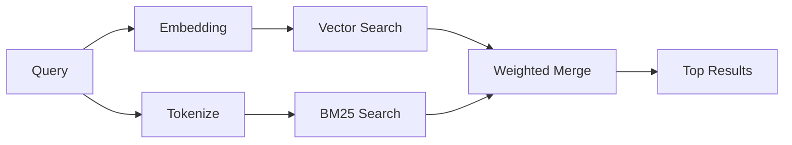

---
read_when:
    - می‌خواهید بدانید memory_search چگونه کار می‌کند
    - می‌خواهید یک ارائه‌دهندهٔ تعبیه‌سازی انتخاب کنید
    - می‌خواهید کیفیت جست‌وجو را تنظیم کنید
summary: حافظه چگونه با استفاده از تعبیه‌ها و بازیابی ترکیبی، یادداشت‌های مرتبط را پیدا می‌کند
title: جست‌وجوی حافظه
x-i18n:
    generated_at: "2026-06-28T22:33:56Z"
    model: gpt-5.5
    postprocess_version: locale-links-v1
    provider: openai
    source_hash: 32ffb9d996851566eb92b7812c5425f545ecbb5387a0a445686df35a6c8ae143
    source_path: concepts/memory-search.md
    workflow: 16
---

`memory_search` یادداشت‌های مرتبط را از فایل‌های حافظه شما پیدا می‌کند، حتی وقتی
عبارت‌بندی با متن اصلی متفاوت باشد. این کار با نمایه‌سازی حافظه به تکه‌های کوچک
و جست‌وجوی آن‌ها با استفاده از embeddings، کلیدواژه‌ها، یا هر دو انجام می‌شود.

## شروع سریع

جست‌وجوی حافظه به‌طور پیش‌فرض از embeddings متعلق به OpenAI استفاده می‌کند. برای استفاده از یک
بک‌اند embedding دیگر، یک ارائه‌دهنده را به‌صراحت تنظیم کنید:

```json5
{
  agents: {
    defaults: {
      memorySearch: {
        provider: "openai", // or "gemini", "local", "ollama", "openai-compatible", etc.
      },
    },
  },
}
```

برای راه‌اندازی‌های چندنقطه‌پایانی با ارائه‌دهنده‌های مخصوص حافظه، `provider` همچنین می‌تواند
یک ورودی سفارشی `models.providers.<id>` باشد، مانند `ollama-5080`، وقتی آن
ارائه‌دهنده `api: "ollama"` یا مالک آداپتور embedding حافظه دیگری را تنظیم می‌کند.

برای embeddings محلی بدون کلید API، بسته
`@openclaw/llama-cpp-provider` را نصب کنید و `provider: "local"` را تنظیم کنید. checkoutهای منبع
ممکن است همچنان به تأیید ساخت بومی نیاز داشته باشند: ابتدا `pnpm approve-builds` و سپس
`pnpm rebuild node-llama-cpp`.

برخی نقطه‌پایانی‌های embedding سازگار با OpenAI به برچسب‌های نامتقارن نیاز دارند، مانند
`input_type: "query"` برای جست‌وجوها و `input_type: "document"` یا `"passage"`
برای تکه‌های نمایه‌شده. آن‌ها را با `memorySearch.queryInputType` و
`memorySearch.documentInputType` پیکربندی کنید؛ به [مرجع پیکربندی حافظه](/fa/reference/memory-config#provider-specific-config) مراجعه کنید.

## ارائه‌دهنده‌های پشتیبانی‌شده

| ارائه‌دهنده          | شناسه                  | به کلید API نیاز دارد | یادداشت‌ها                         |
| ----------------- | ------------------- | ------------- | ----------------------------- |
| Bedrock           | `bedrock`           | خیر            | از زنجیره اعتبارنامه AWS استفاده می‌کند     |
| DeepInfra         | `deepinfra`         | بله           | پیش‌فرض: `BAAI/bge-m3`        |
| Gemini            | `gemini`            | بله           | از نمایه‌سازی تصویر/صدا پشتیبانی می‌کند |
| GitHub Copilot    | `github-copilot`    | خیر            | از اشتراک Copilot استفاده می‌کند     |
| Local             | `local`             | خیر            | مدل GGUF، دانلود حدود ۰٫۶ GB  |
| Mistral           | `mistral`           | بله           |                               |
| Ollama            | `ollama`            | خیر            | محلی/خودمیزبان‌شده             |
| OpenAI            | `openai`            | بله           | پیش‌فرض                       |
| OpenAI-compatible | `openai-compatible` | معمولاً       | عمومی `/v1/embeddings`      |
| Voyage            | `voyage`            | بله           |                               |

## جست‌وجو چگونه کار می‌کند

OpenClaw دو مسیر بازیابی را به‌صورت موازی اجرا می‌کند و نتایج را ادغام می‌کند:



- **جست‌وجوی برداری** یادداشت‌هایی با معنای مشابه را پیدا می‌کند ("gateway host" با
  "ماشینی که OpenClaw را اجرا می‌کند" مطابقت دارد).
- **جست‌وجوی کلیدواژه‌ای BM25** مطابقت‌های دقیق را پیدا می‌کند (شناسه‌ها، رشته‌های خطا، کلیدهای
  پیکربندی).

اگر فقط یک مسیر در دسترس باشد، همان مسیر به‌تنهایی اجرا می‌شود. حالت عمدی فقط-FTS
(`provider: "none"`) و انتخاب خودکار/پیش‌فرض ارائه‌دهنده همچنان می‌توانند از
رتبه‌بندی واژگانی استفاده کنند، وقتی embeddings در دسترس نیست.

ارائه‌دهنده‌های embedding غیرمحلی صریح متفاوت هستند. اگر
`memorySearch.provider` را روی یک ارائه‌دهنده مشخص مبتنی بر راه‌دور تنظیم کنید و آن ارائه‌دهنده
در زمان اجرا در دسترس نباشد، `memory_search` حافظه را به‌جای استفاده بی‌صدا از نتایج فقط-FTS،
به‌عنوان در دسترس نبودن گزارش می‌کند. این کار یک ارائه‌دهنده معنایی پیکربندی‌شده خراب را
قابل مشاهده نگه می‌دارد. برای یادآوری عمدی فقط-FTS، `provider: "none"` را تنظیم کنید، یا
پیکربندی ارائه‌دهنده/احراز هویت را اصلاح کنید تا رتبه‌بندی معنایی بازیابی شود.

## بهبود کیفیت جست‌وجو

وقتی تاریخچه یادداشت بزرگی دارید، دو قابلیت اختیاری کمک می‌کنند:

### افت زمانی

یادداشت‌های قدیمی به‌تدریج وزن رتبه‌بندی خود را از دست می‌دهند تا اطلاعات جدیدتر اول ظاهر شوند.
با نیمه‌عمر پیش‌فرض ۳۰ روز، یادداشتی از ماه گذشته ۵۰٪ از
وزن اصلی خود را امتیاز می‌گیرد. فایل‌های همیشه‌سبز مانند `MEMORY.md` هرگز دچار افت نمی‌شوند.

<Tip>
اگر عامل شما ماه‌ها یادداشت روزانه دارد و اطلاعات کهنه همچنان از زمینه جدیدتر رتبه بالاتری می‌گیرند،
افت زمانی را فعال کنید.
</Tip>

### MMR (تنوع)

نتایج تکراری را کاهش می‌دهد. اگر پنج یادداشت همگی به همان پیکربندی روتر اشاره کنند، MMR
اطمینان می‌دهد نتایج برتر به‌جای تکرار، موضوعات متفاوتی را پوشش دهند.

<Tip>
اگر `memory_search` همچنان قطعه‌های تقریباً تکراری را از یادداشت‌های روزانه مختلف برمی‌گرداند،
MMR را فعال کنید.
</Tip>

### فعال‌سازی هر دو

```json5
{
  agents: {
    defaults: {
      memorySearch: {
        query: {
          hybrid: {
            mmr: { enabled: true },
            temporalDecay: { enabled: true },
          },
        },
      },
    },
  },
}
```

## حافظه چندوجهی

با Gemini Embedding 2، می‌توانید تصویرها و فایل‌های صوتی را در کنار
Markdown نمایه‌سازی کنید. پرس‌وجوهای جست‌وجو همچنان متنی می‌مانند، اما با محتوای دیداری و صوتی
مطابقت داده می‌شوند. برای راه‌اندازی، به [مرجع پیکربندی حافظه](/fa/reference/memory-config) مراجعه کنید.

## جست‌وجوی حافظه جلسه

می‌توانید به‌صورت اختیاری رونوشت‌های جلسه را نمایه‌سازی کنید تا `memory_search` بتواند
گفت‌وگوهای قبلی را به یاد بیاورد. این قابلیت از طریق
`memorySearch.experimental.sessionMemory` و `sources: ["sessions"]` نیازمند انتخاب صریح است؛ فهرست منبع پیش‌فرض
فقط حافظه است. پرچم آزمایشی نمایه‌سازی رونوشت جلسه را فعال می‌کند،
در حالی که `sources` کنترل می‌کند آیا تکه‌های جلسه جست‌وجو شوند یا نه.

نتایج جلسه از `tools.sessions.visibility` پیروی می‌کنند: تنظیم پیش‌فرض `tree` فقط
جلسه فعلی و جلسه‌هایی را که از آن ایجاد شده‌اند آشکار می‌کند. برای یادآوری یک جلسه نامرتبط
همان عامل که از طریق Gateway اعزام شده و از یک جلسه DM جداگانه آمده است، عمداً
دامنه دید را به `agent` گسترش دهید.

هنگام استفاده از QMD، همچنین `memory.qmd.sessions.enabled: true` را تنظیم کنید تا رونوشت‌ها
به یک مجموعه QMD صادر شوند. برای جزئیات به
[مرجع پیکربندی](/fa/reference/memory-config) مراجعه کنید.

## عیب‌یابی

**نتیجه‌ای نیست؟** برای بررسی نمایه، `openclaw memory status` را اجرا کنید. اگر خالی است،
`openclaw memory index --force` را اجرا کنید.

**فقط مطابقت‌های کلیدواژه‌ای؟** ارائه‌دهنده embedding شما ممکن است پیکربندی نشده باشد. بررسی کنید:
`openclaw memory status --deep`.

**embeddings محلی timeout می‌شوند؟** `ollama`، `lmstudio`، و `local` به‌طور پیش‌فرض از
timeout طولانی‌تر برای batch درون‌خطی استفاده می‌کنند. اگر میزبان صرفاً کند است،
`agents.defaults.memorySearch.sync.embeddingBatchTimeoutSeconds` را تنظیم کنید و دوباره
`openclaw memory index --force` را اجرا کنید.

**متن CJK پیدا نمی‌شود؟** نمایه FTS را با
`openclaw memory index --force` دوباره بسازید.

## مطالعه بیشتر

- [Active Memory](/fa/concepts/active-memory) -- حافظه عامل فرعی برای جلسه‌های گفت‌وگوی تعاملی
- [حافظه](/fa/concepts/memory) -- چیدمان فایل، بک‌اندها، ابزارها
- [مرجع پیکربندی حافظه](/fa/reference/memory-config) -- همه گزینه‌های پیکربندی

## مرتبط

- [نمای کلی حافظه](/fa/concepts/memory)
- [Active Memory](/fa/concepts/active-memory)
- [موتور حافظه داخلی](/fa/concepts/memory-builtin)
