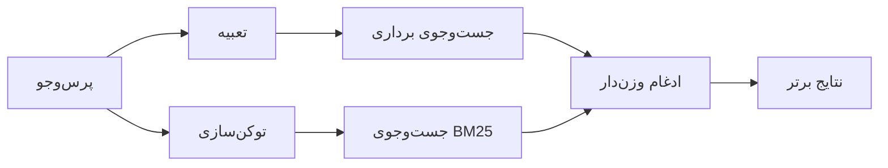

---
read_when:
    - می‌خواهید بدانید memory_search چگونه کار می‌کند
    - می‌خواهید یک ارائه‌دهندهٔ تعبیه‌سازی انتخاب کنید
    - می‌خواهید کیفیت جست‌وجو را تنظیم کنید
summary: جست‌وجوی حافظه چگونه با استفاده از تعبیه‌سازی‌ها و بازیابی ترکیبی یادداشت‌های مرتبط را پیدا می‌کند
title: جست‌وجوی حافظه
x-i18n:
    generated_at: "2026-07-16T16:41:22Z"
    model: gpt-5.6
    postprocess_version: locale-links-v1
    prompt_version: 32
    provider: openai
    source_hash: 2ae0830843fba28c24159d85425240051fb8caf086cd0563d3091890045dcfad
    source_path: concepts/memory-search.md
    workflow: 16
---

`memory_search` یادداشت‌های مرتبط را از فایل‌های حافظه شما پیدا می‌کند، حتی زمانی که
عبارت‌بندی با متن اصلی متفاوت باشد. حافظه را به بخش‌های کوچک تقسیم می‌کند و
آن‌ها را با تعبیه‌ها، کلیدواژه‌ها یا هر دو جست‌وجو می‌کند.

## شروع سریع

OpenClaw به‌طور پیش‌فرض از تعبیه‌های OpenAI استفاده می‌کند. برای استفاده از ارائه‌دهنده‌ای دیگر، آن را
صریحاً تنظیم کنید:

```json5
{
  agents: {
    defaults: {
      memorySearch: {
        provider: "openai", // یا "gemini"، "voyage"، "mistral"، "bedrock"، "local"، "ollama"، "lmstudio"، "github-copilot"، "openai-compatible"
      },
    },
  },
}
```

`provider` همچنین می‌تواند به یک ورودی سفارشی `models.providers.<id>` ارجاع دهد (برای
مثال `ollama-5080`)؛ به‌شرط آنکه آن ورودی، `api` را روی `"ollama"` یا
شناسه ارائه‌دهنده دیگری دارای آداپتور تعبیه حافظه تنظیم کند.

برای تعبیه‌های محلی بدون کلید API، Plugin رسمی ارائه‌دهنده llama.cpp را
نصب و `provider: "local"` را تنظیم کنید:

```bash
openclaw plugins install @openclaw/llama-cpp-provider
```

نسخه‌های دریافت‌شده از کد منبع همچنان به تأیید ساخت بومی نیاز دارند: `pnpm approve-builds`، سپس
`pnpm rebuild node-llama-cpp`.

برخی نقاط پایانی تعبیه سازگار با OpenAI به برچسب‌های نامتقارن `input_type`
نیاز دارند، مانند `"query"` برای جست‌وجوها و `"document"`/`"passage"` برای قطعه‌های
نمایه‌شده. این‌ها را با `queryInputType` و `documentInputType` تنظیم کنید؛ به
[مرجع پیکربندی حافظه](/fa/reference/memory-config#provider-specific-config) مراجعه کنید.

## ارائه‌دهندگان پشتیبانی‌شده

| ارائه‌دهنده      | شناسه               | نیازمند کلید API | یادداشت‌ها                                |
| ----------------- | ------------------- | ------------- | --------------------------------- |
| Bedrock           | `bedrock`           | خیر           | از زنجیره اعتبارنامه AWS استفاده می‌کند     |
| DeepInfra         | `deepinfra`         | بله           | مدل پیش‌فرض `BAAI/bge-m3`       |
| Gemini            | `gemini`            | بله           | از نمایه‌سازی تصویر/صدا پشتیبانی می‌کند     |
| GitHub Copilot    | `github-copilot`    | خیر           | از اشتراک Copilot شما استفاده می‌کند    |
| محلی             | `local`             | خیر           | مدل GGUF، دانلود خودکار حدود 0.6 GB |
| LM Studio         | `lmstudio`          | خیر           | سرور محلی/خودمیزبان          |
| Mistral           | `mistral`           | بله           |                                   |
| Ollama            | `ollama`            | خیر           | سرور محلی/خودمیزبان          |
| OpenAI            | `openai`            | بله           | پیش‌فرض                           |
| سازگار با OpenAI | `openai-compatible` | معمولاً       | نقطه پایانی عمومی `/v1/embeddings` |
| Voyage            | `voyage`            | بله           |                                   |

## نحوه عملکرد جست‌وجو

OpenClaw دو مسیر بازیابی را به‌صورت موازی اجرا و نتایج را ادغام می‌کند:



- **جست‌وجوی برداری** معنای مشابه را تطبیق می‌دهد ("میزبان Gateway" با "دستگاهی که
  OpenClaw را اجرا می‌کند" تطبیق می‌یابد).
- **جست‌وجوی کلیدواژه‌ای BM25** عبارت‌های دقیق را تطبیق می‌دهد (شناسه‌ها، رشته‌های خطا، کلیدهای
  پیکربندی).
- **جست‌وجوی نام فایل** مسیرها را جدا از بدنه یادداشت‌ها نمایه‌سازی می‌کند. مسیرهای کامل
  دقیق، نام‌های پایه و ریشه نام فایل بالاتر از تطبیق‌های جزئی مسیر رتبه می‌گیرند،
  درحالی‌که گزیده‌ها و امتیازهای کلیدواژه‌ای بدنه همچنان از محتوای یادداشت به‌دست می‌آیند.

اگر فقط یک مسیر در دسترس باشد، همان به‌تنهایی اجرا می‌شود.

**حالت فقط FTS.** برای غیرفعال‌کردن عمدی تعبیه‌ها و
جست‌وجو فقط با کلیدواژه‌ها، `provider: "none"` را تنظیم کنید. تنظیم‌نکردن `provider` یا تنظیم آن روی `"auto"`
نیز در صورت پیکربندی‌نبودن احراز هویت تعبیه، بدون ایجاد خطا
به رتبه‌بندی صرفاً کلیدواژه‌ای بازمی‌گردد؛ `provider: "local"` (ارائه‌دهنده GGUF/llama.cpp)
نیز هنگام شکست چنین رفتاری دارد.

**در دسترس نبودن ارائه‌دهنده صریح.** اگر هر ارائه‌دهنده دیگری را صریحاً نام‌گذاری کنید
(برای مثال `openai`، `ollama`، `gemini`) و هنگام درخواست در دسترس نباشد
(احراز هویت نادرست، خرابی شبکه)، `memory_search` به‌جای تنزل بی‌سروصدا به
نتایج فقط FTS، حافظه را در دسترس‌نبودنی گزارش می‌کند. این کار خرابی
ارائه‌دهنده پیکربندی‌شده را آشکار نگه می‌دارد. برای بازیابی عمدی
فقط FTS، `provider: "none"` را تنظیم کنید یا پیکربندی ارائه‌دهنده/احراز هویت را برای بازیابی رتبه‌بندی
معنایی اصلاح کنید.

## بهبود کیفیت جست‌وجو

دو قابلیت اختیاری برای سابقه بزرگ یادداشت‌ها مفیدند.

### زوال زمانی

وزن رتبه‌بندی یادداشت‌های قدیمی به‌تدریج کاهش می‌یابد تا اطلاعات جدیدتر ابتدا نمایش داده شوند.
با نیمه‌عمر پیش‌فرض 30 روزه، یادداشتی از ماه گذشته 50% از
وزن اصلی خود امتیاز می‌گیرد. `MEMORY.md` و دیگر فایل‌های بدون تاریخ زیر `memory/`
همیشه‌سبز هستند و هرگز دچار زوال نمی‌شوند؛ فقط فایل‌های تاریخ‌دار `memory/YYYY-MM-DD.md` زوال می‌یابند.

<Tip>
اگر عامل شما چندین ماه یادداشت روزانه دارد و اطلاعات منسوخ
همچنان بالاتر از زمینه جدید رتبه می‌گیرند، این قابلیت را فعال کنید.
</Tip>

### MMR (تنوع)

نتایج تکراری را کاهش می‌دهد. اگر پنج یادداشت همگی به یک پیکربندی مسیریاب اشاره کنند،
MMR تضمین می‌کند نتایج برتر به‌جای تکرار، موضوعات متفاوتی را پوشش دهند.

<Tip>
اگر `memory_search` پیوسته گزیده‌های تقریباً تکراری را از
یادداشت‌های روزانه مختلف برمی‌گرداند، این قابلیت را فعال کنید.
</Tip>

### فعال‌کردن هر دو

```json5
{
  agents: {
    defaults: {
      memorySearch: {
        query: {
          hybrid: {
            mmr: { enabled: true },
            temporalDecay: { enabled: true },
          },
        },
      },
    },
  },
}
```

## حافظه چندوجهی

با `gemini-embedding-2-preview`، می‌توانید تصاویر و صدا را در کنار
Markdown نمایه‌سازی کنید. این فقط برای فایل‌های زیر `memorySearch.extraPaths` اعمال می‌شود؛ ریشه‌های پیش‌فرض
حافظه (`MEMORY.md`، `memory/*.md`) فقط Markdown باقی می‌مانند. پرس‌وجوهای جست‌وجو
همچنان متنی هستند، اما با محتوای بصری و صوتی تطبیق می‌یابند. برای راه‌اندازی به
[مرجع پیکربندی حافظه](/fa/reference/memory-config#multimodal-memory-gemini)
مراجعه کنید.

## جست‌وجوی حافظه نشست

برای بازیابی دقیق تمام‌متنی از رونوشت‌های نشست، از [`sessions_search`](/concepts/session-search)
استفاده کنید و سپس نتیجه‌ای را با `sessions_history` باز کنید. جست‌وجوی حافظه نشست، مکمل معنایی و
آزمایشی باقی می‌ماند.

در صورت تمایل، رونوشت‌های نشست را نمایه‌سازی کنید تا `memory_search` بتواند مکالمه‌های
قبلی را بازیابی کند. این قابلیت اختیاری است: `experimental.sessionMemory: true` را تنظیم و
`"sessions"` را به `sources` اضافه کنید (`sources` پیش‌فرض، `["memory"]` است).

نتایج نشست از `tools.sessions.visibility` پیروی می‌کنند: `"tree"` پیش‌فرض فقط
نشست جاری و نشست‌هایی را که ایجاد کرده است نمایش می‌دهد. برای بازیابی یک نشست
نامرتبط همان عامل از نشستی دیگر (برای مثال نشستی که Gateway از یک پیام مستقیم
ارسال کرده است)، دامنه مشاهده را به `"agent"` گسترش دهید.

هنگام استفاده از بک‌اند QMD، `memory.qmd.sessions.enabled: true` را نیز تنظیم کنید تا
رونوشت‌ها به مجموعه QMD صادر شوند؛ `experimental.sessionMemory`
و `sources` به‌تنهایی رونوشت‌ها را به QMD صادر نمی‌کنند. به
[مرجع پیکربندی](/fa/reference/memory-config#session-memory-search-experimental) مراجعه کنید.

## عیب‌یابی

**نتیجه‌ای وجود ندارد؟** برای بررسی نمایه، `openclaw memory status` را اجرا کنید. اگر خالی است،
`openclaw memory index --force` را اجرا کنید.

**فقط تطبیق کلیدواژه‌ای دارید؟** ممکن است ارائه‌دهنده تعبیه شما پیکربندی نشده باشد.
`openclaw memory status --deep` را بررسی کنید.

**زمان تعبیه‌های محلی تمام می‌شود؟** `ollama`، `lmstudio` و `local` به‌طور پیش‌فرض از
مهلت طولانی‌تری برای دسته درون‌خطی استفاده می‌کنند. اگر میزبان صرفاً کند است،
`agents.defaults.memorySearch.sync.embeddingBatchTimeoutSeconds` را تنظیم کنید و
`openclaw memory index --force` را دوباره اجرا کنید.

**متن CJK پیدا نمی‌شود؟** نمایه FTS را با
`openclaw memory index --force` بازسازی کنید.

## مرتبط

- [نمای کلی حافظه](/fa/concepts/memory)
- [Active Memory](/fa/concepts/active-memory)
- [موتور داخلی حافظه](/fa/concepts/memory-builtin)
- [مرجع پیکربندی حافظه](/fa/reference/memory-config)
