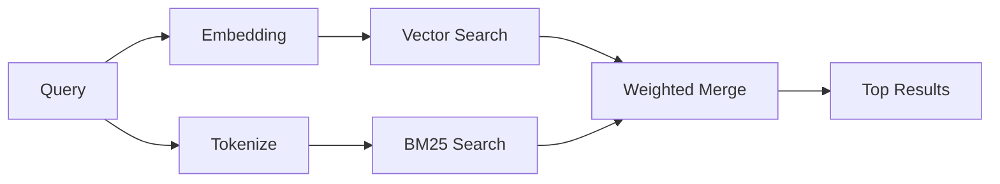

---
read_when:
    - می‌خواهید بفهمید memory_search چگونه کار می‌کند
    - می‌خواهید یک ارائه‌دهندهٔ امبدینگ انتخاب کنید
    - می‌خواهید کیفیت جست‌وجو را تنظیم کنید
summary: جست‌وجوی حافظه چگونه با استفاده از تعبیه‌ها و بازیابی ترکیبی یادداشت‌های مرتبط را پیدا می‌کند
title: جست‌وجوی حافظه
x-i18n:
    generated_at: "2026-06-27T17:33:24Z"
    model: gpt-5.5
    postprocess_version: locale-links-v1
    provider: openai
    source_hash: b0bcb8cf400100ba8b6ddbb46bdf8b2a89a8bc32a550ee6df47c874e7e9e0879
    source_path: concepts/memory-search.md
    workflow: 16
---

`memory_search` یادداشت‌های مرتبط را از فایل‌های حافظهٔ شما پیدا می‌کند، حتی وقتی
عبارت‌بندی با متن اصلی متفاوت باشد. این کار با نمایه‌سازی حافظه به تکه‌های کوچک
و جست‌وجوی آن‌ها با استفاده از تعبیه‌ها، کلیدواژه‌ها، یا هر دو انجام می‌شود.

## شروع سریع

جست‌وجوی حافظه به‌طور پیش‌فرض از تعبیه‌های OpenAI استفاده می‌کند. برای استفاده از
یک بک‌اند تعبیهٔ دیگر، یک ارائه‌دهنده را صراحتاً تنظیم کنید:

```json5
{
  agents: {
    defaults: {
      memorySearch: {
        provider: "openai", // or "gemini", "local", "ollama", "openai-compatible", etc.
      },
    },
  },
}
```

برای راه‌اندازی‌های چندنقطه‌پایانی با ارائه‌دهنده‌های ویژهٔ حافظه، `provider` همچنین
می‌تواند یک ورودی سفارشی `models.providers.<id>` باشد، مانند `ollama-5080`، وقتی آن
ارائه‌دهنده `api: "ollama"` یا مالک آداپتور تعبیهٔ حافظهٔ دیگری را تنظیم می‌کند.

برای تعبیه‌های محلی بدون کلید API، `@openclaw/llama-cpp-provider` را نصب کنید
و `provider: "local"` را تنظیم کنید. checkoutهای منبع ممکن است همچنان به تأیید
ساخت بومی نیاز داشته باشند: `pnpm approve-builds` و سپس
`pnpm rebuild node-llama-cpp`.

برخی نقطه‌پایانی‌های تعبیهٔ سازگار با OpenAI به برچسب‌های نامتقارن نیاز دارند، مانند
`input_type: "query"` برای جست‌وجوها و `input_type: "document"` یا `"passage"`
برای تکه‌های نمایه‌شده. آن‌ها را با `memorySearch.queryInputType` و
`memorySearch.documentInputType` پیکربندی کنید؛ به [مرجع پیکربندی حافظه](/fa/reference/memory-config#provider-specific-config) مراجعه کنید.

## ارائه‌دهنده‌های پشتیبانی‌شده

| ارائه‌دهنده       | شناسه              | نیازمند کلید API | یادداشت‌ها                    |
| ----------------- | ------------------- | ------------- | ----------------------------- |
| Bedrock           | `bedrock`           | خیر           | از زنجیرهٔ اعتبارنامهٔ AWS استفاده می‌کند |
| DeepInfra         | `deepinfra`         | بله           | پیش‌فرض: `BAAI/bge-m3`        |
| Gemini            | `gemini`            | بله           | از نمایه‌سازی تصویر/صدا پشتیبانی می‌کند |
| GitHub Copilot    | `github-copilot`    | خیر           | از اشتراک Copilot استفاده می‌کند |
| محلی              | `local`             | خیر           | مدل GGUF، حدود ۰٫۶ گیگابایت دانلود |
| Mistral           | `mistral`           | بله           |                               |
| Ollama            | `ollama`            | خیر           | محلی/خودمیزبان               |
| OpenAI            | `openai`            | بله           | پیش‌فرض                       |
| سازگار با OpenAI | `openai-compatible` | معمولاً       | `/v1/embeddings` عمومی        |
| Voyage            | `voyage`            | بله           |                               |

## سازوکار جست‌وجو

OpenClaw دو مسیر بازیابی را به‌صورت موازی اجرا می‌کند و نتایج را ادغام می‌کند:



- **جست‌وجوی برداری** یادداشت‌هایی با معنای مشابه را پیدا می‌کند ("gateway host" با
  "the machine running OpenClaw" مطابقت پیدا می‌کند).
- **جست‌وجوی کلیدواژه‌ای BM25** تطابق‌های دقیق را پیدا می‌کند (شناسه‌ها، رشته‌های خطا، کلیدهای
  پیکربندی).

اگر فقط یک مسیر در دسترس باشد، همان مسیر به‌تنهایی اجرا می‌شود. حالت عمدی فقط FTS
(`provider: "none"`) و انتخاب خودکار/پیش‌فرض ارائه‌دهنده همچنان می‌توانند وقتی تعبیه‌ها
در دسترس نیستند از رتبه‌بندی واژگانی استفاده کنند.

ارائه‌دهنده‌های تعبیهٔ غیرمحلیِ صریح متفاوت‌اند. اگر
`memorySearch.provider` را روی یک ارائه‌دهندهٔ مشخص با پشتوانهٔ راه دور تنظیم کنید و آن ارائه‌دهنده
در زمان اجرا در دسترس نباشد، `memory_search` به‌جای استفادهٔ بی‌سروصدا از نتایج فقط FTS،
حافظه را ناموجود گزارش می‌کند. این کار باعث می‌شود ارائه‌دهندهٔ معناییِ پیکربندی‌شده و خراب
قابل مشاهده بماند. برای بازیابی عمدی فقط FTS، `provider: "none"` را تنظیم کنید، یا
پیکربندی ارائه‌دهنده/احراز هویت را اصلاح کنید تا رتبه‌بندی معنایی بازیابی شود.

## بهبود کیفیت جست‌وجو

دو قابلیت اختیاری وقتی تاریخچهٔ یادداشت بزرگی دارید کمک می‌کنند:

### افت زمانی

یادداشت‌های قدیمی به‌تدریج وزن رتبه‌بندی خود را از دست می‌دهند تا اطلاعات جدیدتر ابتدا ظاهر شوند.
با نیمه‌عمر پیش‌فرض ۳۰ روز، یک یادداشت از ماه گذشته ۵۰٪ از وزن اصلی خود را می‌گیرد.
فایل‌های همیشه‌سبز مانند `MEMORY.md` هرگز دچار افت نمی‌شوند.

<Tip>
اگر عامل شما ماه‌ها یادداشت روزانه دارد و اطلاعات کهنه همچنان بالاتر از زمینهٔ جدید رتبه می‌گیرند،
افت زمانی را فعال کنید.
</Tip>

### MMR (تنوع)

نتایج تکراری را کاهش می‌دهد. اگر پنج یادداشت همگی به همان پیکربندی router اشاره کنند، MMR
مطمئن می‌شود نتایج برتر به‌جای تکرار، موضوعات متفاوتی را پوشش دهند.

<Tip>
اگر `memory_search` همچنان قطعه‌های تقریباً تکراری از یادداشت‌های روزانهٔ مختلف برمی‌گرداند،
MMR را فعال کنید.
</Tip>

### فعال‌سازی هر دو

```json5
{
  agents: {
    defaults: {
      memorySearch: {
        query: {
          hybrid: {
            mmr: { enabled: true },
            temporalDecay: { enabled: true },
          },
        },
      },
    },
  },
}
```

## حافظهٔ چندوجهی

با Gemini Embedding 2، می‌توانید تصویرها و فایل‌های صوتی را در کنار
Markdown نمایه کنید. پرس‌وجوهای جست‌وجو همچنان متنی می‌مانند، اما با محتوای بصری و صوتی
مطابقت پیدا می‌کنند. برای راه‌اندازی، به [مرجع پیکربندی حافظه](/fa/reference/memory-config) مراجعه کنید.

## جست‌وجوی حافظهٔ جلسه

می‌توانید به‌صورت اختیاری transcriptهای جلسه را نمایه کنید تا `memory_search` بتواند
گفت‌وگوهای قبلی را به یاد بیاورد. این قابلیت از طریق
`memorySearch.experimental.sessionMemory` به‌صورت opt-in فعال می‌شود. برای جزئیات، به
[مرجع پیکربندی](/fa/reference/memory-config) مراجعه کنید.

## عیب‌یابی

**نتیجه‌ای نیست؟** برای بررسی نمایه، `openclaw memory status` را اجرا کنید. اگر خالی است،
`openclaw memory index --force` را اجرا کنید.

**فقط تطابق‌های کلیدواژه‌ای؟** ممکن است ارائه‌دهندهٔ تعبیهٔ شما پیکربندی نشده باشد. بررسی کنید:
`openclaw memory status --deep`.

**تعبیه‌های محلی timeout می‌شوند؟** `ollama`، `lmstudio`، و `local` به‌طور پیش‌فرض از
timeout طولانی‌تری برای batch درون‌خطی استفاده می‌کنند. اگر میزبان صرفاً کند است،
`agents.defaults.memorySearch.sync.embeddingBatchTimeoutSeconds` را تنظیم کنید و دوباره
`openclaw memory index --force` را اجرا کنید.

**متن CJK پیدا نمی‌شود؟** نمایهٔ FTS را با
`openclaw memory index --force` بازسازی کنید.

## مطالعهٔ بیشتر

- [Active Memory](/fa/concepts/active-memory) -- حافظهٔ زیرعامل برای جلسه‌های گفت‌وگوی تعاملی
- [حافظه](/fa/concepts/memory) -- چیدمان فایل، بک‌اندها، ابزارها
- [مرجع پیکربندی حافظه](/fa/reference/memory-config) -- همهٔ knobهای پیکربندی

## مرتبط

- [نمای کلی حافظه](/fa/concepts/memory)
- [Active Memory](/fa/concepts/active-memory)
- [موتور حافظهٔ داخلی](/fa/concepts/memory-builtin)
