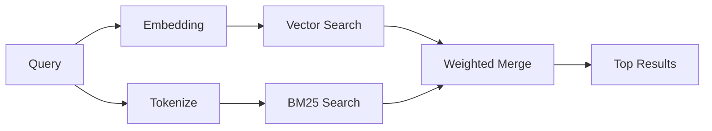

---
read_when:
    - می‌خواهید بدانید memory_search چگونه کار می‌کند
    - می‌خواهید یک ارائه‌دهندهٔ تعبیه‌سازی انتخاب کنید
    - می‌خواهید کیفیت جست‌وجو را تنظیم کنید
summary: جست‌وجوی حافظه چگونه با استفاده از بردارهای تعبیه و بازیابی ترکیبی، یادداشت‌های مرتبط را پیدا می‌کند
title: جستجوی حافظه
x-i18n:
    generated_at: "2026-05-02T11:42:39Z"
    model: gpt-5.5
    provider: openai
    source_hash: 2a71fb0809d5c70689e8046f854e4b4b4e79f45769ac2964e40a762ebb4e91a8
    source_path: concepts/memory-search.md
    workflow: 16
---

`memory_search` یادداشت‌های مرتبط را از فایل‌های حافظه شما پیدا می‌کند، حتی وقتی
عبارت‌بندی با متن اصلی فرق داشته باشد. این کار با ایندکس‌کردن حافظه به قطعه‌های
کوچک و جست‌وجوی آن‌ها با استفاده از embeddingها، کلیدواژه‌ها، یا هر دو انجام می‌شود.

## شروع سریع

اگر اشتراک GitHub Copilot، یا کلید API برای OpenAI، Gemini، Voyage یا Mistral
را پیکربندی کرده باشید، جست‌وجوی حافظه به‌صورت خودکار کار می‌کند. برای تنظیم
صریح یک ارائه‌دهنده:

```json5
{
  agents: {
    defaults: {
      memorySearch: {
        provider: "openai", // or "gemini", "local", "ollama", etc.
      },
    },
  },
}
```

برای تنظیمات چندنقطه‌پایانی، `provider` همچنین می‌تواند یک ورودی سفارشی
`models.providers.<id>` باشد، مانند `ollama-5080`، وقتی آن ارائه‌دهنده
`api: "ollama"` یا مالک آداپتور embedding دیگری را تنظیم می‌کند.

برای embeddingهای محلی بدون کلید API، `provider: "local"` را تنظیم کنید. checkoutهای
سورس ممکن است همچنان به تایید ساخت بومی نیاز داشته باشند: `pnpm approve-builds` و سپس
`pnpm rebuild node-llama-cpp`.

برخی نقطه‌پایانی‌های embedding سازگار با OpenAI به برچسب‌های نامتقارن نیاز دارند، مانند
`input_type: "query"` برای جست‌وجوها و `input_type: "document"` یا `"passage"`
برای قطعه‌های ایندکس‌شده. آن‌ها را با `memorySearch.queryInputType` و
`memorySearch.documentInputType` پیکربندی کنید؛ [مرجع پیکربندی حافظه](/fa/reference/memory-config#provider-specific-config) را ببینید.

## ارائه‌دهنده‌های پشتیبانی‌شده

| ارائه‌دهنده    | شناسه           | نیازمند کلید API | یادداشت‌ها                                           |
| -------------- | ---------------- | ------------- | ---------------------------------------------------- |
| Bedrock        | `bedrock`        | خیر           | وقتی زنجیره اعتبارنامه AWS resolve شود، خودکار شناسایی می‌شود |
| Gemini         | `gemini`         | بله           | از ایندکس‌کردن تصویر/صوت پشتیبانی می‌کند             |
| GitHub Copilot | `github-copilot` | خیر           | خودکار شناسایی می‌شود، از اشتراک Copilot استفاده می‌کند |
| محلی           | `local`          | خیر           | مدل GGUF، دانلود حدود ۰٫۶ گیگابایت                   |
| Mistral        | `mistral`        | بله           | خودکار شناسایی می‌شود                                |
| Ollama         | `ollama`         | خیر           | محلی، باید صریح تنظیم شود                            |
| OpenAI         | `openai`         | بله           | خودکار شناسایی می‌شود، سریع                          |
| Voyage         | `voyage`         | بله           | خودکار شناسایی می‌شود                                |

## جست‌وجو چگونه کار می‌کند

OpenClaw دو مسیر بازیابی را به‌صورت موازی اجرا می‌کند و نتایج را ادغام می‌کند:



- **جست‌وجوی برداری** یادداشت‌هایی با معنای مشابه را پیدا می‌کند ("gateway host" با
  "the machine running OpenClaw" مطابقت دارد).
- **جست‌وجوی کلیدواژه‌ای BM25** تطابق‌های دقیق را پیدا می‌کند (شناسه‌ها، رشته‌های خطا، کلیدهای
  پیکربندی).

اگر فقط یک مسیر در دسترس باشد (بدون embedding یا بدون FTS)، همان مسیر به‌تنهایی اجرا می‌شود.

وقتی embeddingها در دسترس نباشند، OpenClaw همچنان به‌جای برگشت به ترتیب خام فقط بر اساس تطابق دقیق، از رتبه‌بندی واژگانی روی نتایج FTS استفاده می‌کند. این حالت تنزل‌یافته قطعه‌هایی را تقویت می‌کند که پوشش قوی‌تری از عبارت‌های پرس‌وجو و مسیرهای فایل مرتبط دارند، که باعث می‌شود recall حتی بدون `sqlite-vec` یا ارائه‌دهنده embedding هم مفید بماند.

## بهبود کیفیت جست‌وجو

دو قابلیت اختیاری وقتی تاریخچه بزرگی از یادداشت‌ها دارید کمک می‌کنند:

### زوال زمانی

یادداشت‌های قدیمی به‌تدریج وزن رتبه‌بندی خود را از دست می‌دهند تا اطلاعات جدیدتر ابتدا ظاهر شوند.
با نیمه‌عمر پیش‌فرض ۳۰ روز، یادداشتی از ماه گذشته با ۵۰٪
وزن اولیه خود امتیاز می‌گیرد. فایل‌های همیشه‌سبز مانند `MEMORY.md` هرگز دچار زوال نمی‌شوند.

<Tip>
اگر agent شما چندین ماه یادداشت روزانه دارد و اطلاعات قدیمی
مدام بالاتر از زمینه جدید رتبه می‌گیرند، زوال زمانی را فعال کنید.
</Tip>

### MMR (تنوع)

نتایج تکراری را کاهش می‌دهد. اگر پنج یادداشت همگی به همان پیکربندی روتر اشاره کنند، MMR
تضمین می‌کند نتایج برتر به‌جای تکرار، موضوعات متفاوتی را پوشش دهند.

<Tip>
اگر `memory_search` مدام قطعه‌های تقریبا تکراری را از
یادداشت‌های روزانه مختلف برمی‌گرداند، MMR را فعال کنید.
</Tip>

### فعال‌کردن هر دو

```json5
{
  agents: {
    defaults: {
      memorySearch: {
        query: {
          hybrid: {
            mmr: { enabled: true },
            temporalDecay: { enabled: true },
          },
        },
      },
    },
  },
}
```

## حافظه چندرسانه‌ای

با Gemini Embedding 2، می‌توانید تصویرها و فایل‌های صوتی را در کنار
Markdown ایندکس کنید. پرس‌وجوهای جست‌وجو همچنان متنی می‌مانند، اما با محتوای بصری و صوتی
مطابقت داده می‌شوند. برای راه‌اندازی، [مرجع پیکربندی حافظه](/fa/reference/memory-config) را ببینید.

## جست‌وجوی حافظه نشست

می‌توانید به‌صورت اختیاری transcriptهای نشست را ایندکس کنید تا `memory_search` بتواند
گفت‌وگوهای قبلی را به یاد بیاورد. این کار از طریق
`memorySearch.experimental.sessionMemory` اختیاری است. برای جزئیات،
[مرجع پیکربندی](/fa/reference/memory-config) را ببینید.

## عیب‌یابی

**نتیجه‌ای نیست؟** برای بررسی ایندکس، `openclaw memory status` را اجرا کنید. اگر خالی بود،
`openclaw memory index --force` را اجرا کنید.

**فقط تطابق‌های کلیدواژه‌ای؟** ممکن است ارائه‌دهنده embedding شما پیکربندی نشده باشد. بررسی کنید:
`openclaw memory status --deep`.

**embeddingهای محلی timeout می‌شوند؟** `ollama`، `lmstudio` و `local` به‌صورت پیش‌فرض از timeout دسته‌ای inline طولانی‌تری استفاده می‌کنند. اگر میزبان صرفا کند است،
`agents.defaults.memorySearch.sync.embeddingBatchTimeoutSeconds` را تنظیم کنید و دوباره
`openclaw memory index --force` را اجرا کنید.

**متن CJK پیدا نمی‌شود؟** ایندکس FTS را با
`openclaw memory index --force` بازسازی کنید.

## مطالعه بیشتر

- [Active Memory](/fa/concepts/active-memory) -- حافظه sub-agent برای نشست‌های چت تعاملی
- [حافظه](/fa/concepts/memory) -- چیدمان فایل، backendها، ابزارها
- [مرجع پیکربندی حافظه](/fa/reference/memory-config) -- همه knobهای پیکربندی

## مرتبط

- [نمای کلی حافظه](/fa/concepts/memory)
- [Active Memory](/fa/concepts/active-memory)
- [موتور حافظه داخلی](/fa/concepts/memory-builtin)
