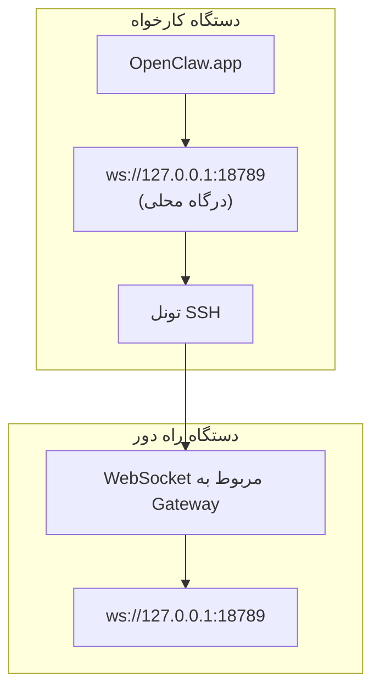

<Note>
این محتوا اکنون در [دسترسی از راه دور](/fa/gateway/remote#macos-persistent-ssh-tunnel-via-launchagent) قرار دارد. برای راهنمای فعلی از آن صفحه استفاده کنید؛ این صفحه به‌عنوان مقصد تغییرمسیر باقی می‌ماند.
</Note>

# اجرای OpenClaw.app با یک Gateway راه دور

OpenClaw.app از طریق یک تونل SSH به Gateway راه دور متصل می‌شود: یک `LocalForward` در SSH، یک درگاه محلی را به درگاه WebSocket مربوط به Gateway روی میزبان راه دور نگاشت می‌کند.

## راه‌اندازی

1. یک ورودی پیکربندی SSH با `LocalForward 18789 127.0.0.1:18789` اضافه کنید (برای بلوک کامل پیکربندی، به [دسترسی از راه دور](/fa/gateway/remote#macos-persistent-ssh-tunnel-via-launchagent) مراجعه کنید).
2. کلید SSH خود را با `ssh-copy-id` روی میزبان راه دور کپی کنید.
3. مقدار `gateway.remote.token` (یا `gateway.remote.password`) را با `openclaw config set gateway.remote.token "<your-token>"` تنظیم کنید.
4. تونل را راه‌اندازی کنید: `ssh -N remote-gateway &`.
5. از OpenClaw.app خارج شوید و آن را دوباره باز کنید.

برای تونلی که پس از راه‌اندازی مجدد سیستم همچنان برقرار می‌ماند و به‌طور خودکار دوباره متصل می‌شود، به‌جای اجرای دستی `ssh -N` از راه‌اندازی LaunchAgent در صفحه [دسترسی از راه دور](/fa/gateway/remote#macos-persistent-ssh-tunnel-via-launchagent) استفاده کنید.

## سازوکار

| مؤلفه                               | کاری که انجام می‌دهد                                                       |
| ------------------------------------ | -------------------------------------------------------------------------- |
| `LocalForward 18789 127.0.0.1:18789` | درگاه محلی ۱۸۷۸۹ را به درگاه راه دور ۱۸۷۸۹ هدایت می‌کند                    |
| `ssh -N`                             | اجرای SSH بدون اجرای فرمان‌های راه دور (فقط هدایت درگاه)                   |
| `KeepAlive`                          | اگر تونل از کار بیفتد، آن را به‌طور خودکار دوباره راه‌اندازی می‌کند (LaunchAgent) |
| `RunAtLoad`                          | هنگام بارگذاری LaunchAgent، تونل را راه‌اندازی می‌کند (LaunchAgent)        |

OpenClaw.app در دستگاه کارخواه به `ws://127.0.0.1:18789` متصل می‌شود. تونل این اتصال را به درگاه ۱۸۷۸۹ روی میزبان راه دوری که Gateway را اجرا می‌کند، هدایت می‌کند.

## مرتبط

- [دسترسی از راه دور](/fa/gateway/remote)
- [Tailscale](/fa/gateway/tailscale)
