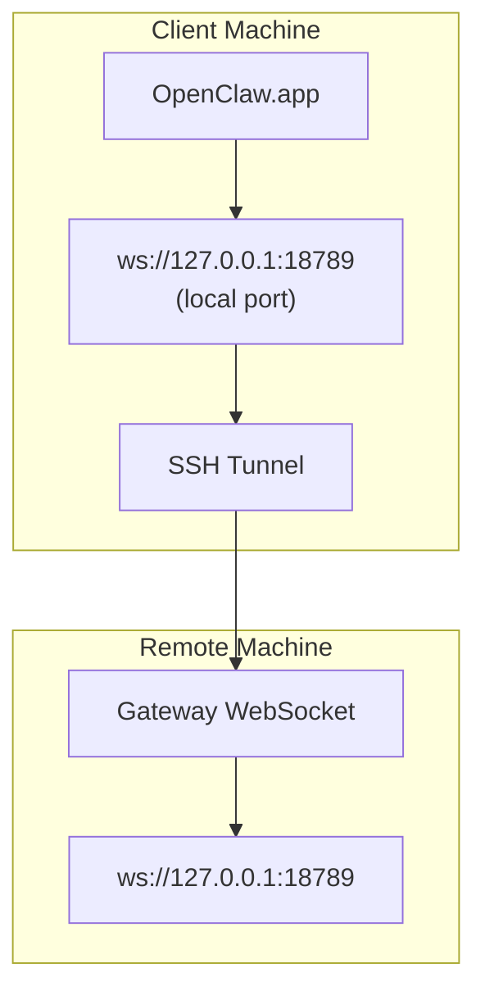

> این محتوا در [دسترسی راه‌دور](/fa/gateway/remote#macos-persistent-ssh-tunnel-via-launchagent) ادغام شده است. برای راهنمای فعلی، آن صفحه را ببینید.

# اجرای OpenClaw.app با Gateway راه‌دور

OpenClaw.app برای اتصال به یک Gateway راه‌دور از تونل‌زنی SSH استفاده می‌کند. این راهنما نشان می‌دهد چگونه آن را راه‌اندازی کنید.

## نمای کلی



## راه‌اندازی سریع

### مرحله ۱: افزودن پیکربندی SSH

`~/.ssh/config` را ویرایش کنید و این را اضافه کنید:

```ssh
Host remote-gateway
    HostName <REMOTE_IP>          # e.g., 172.27.187.184
    User <REMOTE_USER>            # e.g., jefferson
    LocalForward 18789 127.0.0.1:18789
    IdentityFile ~/.ssh/id_rsa
```

`<REMOTE_IP>` و `<REMOTE_USER>` را با مقادیر خودتان جایگزین کنید.

### مرحله ۲: کپی کردن کلید SSH

کلید عمومی خود را روی ماشین راه‌دور کپی کنید (رمز عبور را یک‌بار وارد کنید):

```bash
ssh-copy-id -i ~/.ssh/id_rsa <REMOTE_USER>@<REMOTE_IP>
```

### مرحله ۳: پیکربندی احراز هویت Gateway راه‌دور

```bash
openclaw config set gateway.remote.token "<your-token>"
```

اگر Gateway راه‌دور شما از احراز هویت با رمز عبور استفاده می‌کند، به‌جای آن از `gateway.remote.password` استفاده کنید.
`OPENCLAW_GATEWAY_TOKEN` همچنان به‌عنوان بازنویسی در سطح شِل معتبر است، اما راه‌اندازی پایدار
کلاینت راه‌دور، `gateway.remote.token` / `gateway.remote.password` است.

### مرحله ۴: شروع تونل SSH

```bash
ssh -N remote-gateway &
```

### مرحله ۵: راه‌اندازی دوباره OpenClaw.app

```bash
# Quit OpenClaw.app (⌘Q), then reopen:
open /path/to/OpenClaw.app
```

اکنون برنامه از طریق تونل SSH به Gateway راه‌دور متصل می‌شود.

---

## شروع خودکار تونل هنگام ورود

برای اینکه تونل SSH هنگام ورود شما به‌صورت خودکار شروع شود، یک عامل راه‌اندازی ایجاد کنید.

### ایجاد فایل PLIST

این را با نام `~/Library/LaunchAgents/ai.openclaw.ssh-tunnel.plist` ذخیره کنید:

```xml
<?xml version="1.0" encoding="UTF-8"?>
<!DOCTYPE plist PUBLIC "-//Apple//DTD PLIST 1.0//EN" "http://www.apple.com/DTDs/PropertyList-1.0.dtd">
<plist version="1.0">
<dict>
    <key>Label</key>
    <string>ai.openclaw.ssh-tunnel</string>
    <key>ProgramArguments</key>
    <array>
        <string>/usr/bin/ssh</string>
        <string>-N</string>
        <string>remote-gateway</string>
    </array>
    <key>KeepAlive</key>
    <true/>
    <key>RunAtLoad</key>
    <true/>
</dict>
</plist>
```

### بارگذاری عامل راه‌اندازی

```bash
launchctl bootstrap gui/$UID ~/Library/LaunchAgents/ai.openclaw.ssh-tunnel.plist
```

اکنون تونل:

- هنگام ورود شما به‌صورت خودکار شروع می‌شود
- اگر از کار بیفتد، دوباره راه‌اندازی می‌شود
- در پس‌زمینه در حال اجرا می‌ماند

یادداشت قدیمی: اگر LaunchAgent باقی‌مانده‌ای با نام `com.openclaw.ssh-tunnel` وجود دارد، آن را حذف کنید.

---

## عیب‌یابی

**بررسی اینکه تونل در حال اجرا است یا نه:**

```bash
ps aux | grep "ssh -N remote-gateway" | grep -v grep
lsof -i :18789
```

**راه‌اندازی دوباره تونل:**

```bash
launchctl kickstart -k gui/$UID/ai.openclaw.ssh-tunnel
```

**توقف تونل:**

```bash
launchctl bootout gui/$UID/ai.openclaw.ssh-tunnel
```

---

## نحوه کارکرد

| مؤلفه                               | کارکرد                                                        |
| ------------------------------------ | ------------------------------------------------------------ |
| `LocalForward 18789 127.0.0.1:18789` | پورت محلی 18789 را به پورت راه‌دور 18789 هدایت می‌کند        |
| `ssh -N`                             | SSH بدون اجرای فرمان‌های راه‌دور، فقط برای هدایت پورت        |
| `KeepAlive`                          | اگر تونل از کار بیفتد، آن را به‌صورت خودکار دوباره راه‌اندازی می‌کند |
| `RunAtLoad`                          | هنگام بارگذاری عامل، تونل را شروع می‌کند                     |

OpenClaw.app روی ماشین کلاینت شما به `ws://127.0.0.1:18789` متصل می‌شود. تونل SSH آن اتصال را به پورت 18789 روی ماشین راه‌دوری که Gateway روی آن اجرا می‌شود هدایت می‌کند.

## مرتبط

- [دسترسی راه‌دور](/fa/gateway/remote)
- [Tailscale](/fa/gateway/tailscale)
