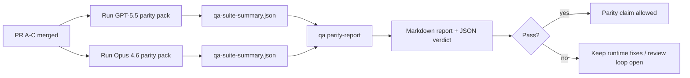

---
read_when:
    - بازبینی مجموعه PRهای هم‌ترازی GPT-5.5 / Codex
    - نگه‌داری از معماری عامل‌محور مبتنی بر شش قرارداد که زیربنای برنامهٔ هم‌ارزی است
summary: چگونه برنامهٔ هم‌ترازی GPT-5.5 / Codex را به‌عنوان چهار واحد ادغام بررسی کنیم
title: یادداشت‌های نگهدارنده درباره هم‌ترازی GPT-5.5 / Codex
x-i18n:
    generated_at: "2026-04-29T22:59:36Z"
    model: gpt-5.5
    provider: openai
    source_hash: 8de69081f5985954b88583880c36388dc47116c3351c15d135b8ab3a660058e3
    source_path: help/gpt55-codex-agentic-parity-maintainers.md
    workflow: 16
---

این یادداشت توضیح می‌دهد چگونه برنامه برابری GPT-5.5 / Codex را به‌عنوان چهار واحد ادغام بررسی کنید، بدون اینکه معماری اصلی شش‌قراردادی از دست برود.

## واحدهای ادغام

### PR A: اجرای عامل‌محور سخت‌گیرانه

مالکیت دارد بر:

- `executionContract`
- پیگیری همان‌نوبت با اولویت GPT-5
- `update_plan` به‌عنوان ردیابی پیشرفت غیرپایانی
- وضعیت‌های مسدودشده صریح به‌جای توقف‌های خاموش فقط-برنامه‌ای

مالکیت ندارد بر:

- دسته‌بندی خطاهای احراز هویت/زمان اجرا
- صداقت مجوز
- بازطراحی بازپخش/ادامه
- بنچمارک برابری

### PR B: صداقت زمان اجرا

مالکیت دارد بر:

- درستی دامنه OAuth مربوط به Codex
- دسته‌بندی تایپ‌شده خطای ارائه‌دهنده/زمان اجرا
- در دسترس بودن صادقانه `/elevated full` و دلایل مسدودشدگی

مالکیت ندارد بر:

- نرمال‌سازی شِمای ابزار
- وضعیت بازپخش/زنده‌بودن
- دروازه‌گذاری بنچمارک

### PR C: درستی اجرا

مالکیت دارد بر:

- سازگاری ابزار OpenAI/Codex تحت مالکیت ارائه‌دهنده
- مدیریت شِمای سخت‌گیرانه بدون پارامتر
- آشکارسازی بازپخش نامعتبر
- مشاهده‌پذیری وضعیت کار طولانیِ متوقف‌شده، مسدودشده و رهاشده

مالکیت ندارد بر:

- ادامه‌ای که خود سیستم انتخاب می‌کند
- رفتار عمومی گویش Codex خارج از هوک‌های ارائه‌دهنده
- دروازه‌گذاری بنچمارک

### PR D: سازوکار برابری

مالکیت دارد بر:

- بسته سناریوی موج اول GPT-5.5 در برابر Opus 4.6
- مستندات برابری
- گزارش برابری و سازوکارهای دروازه انتشار

مالکیت ندارد بر:

- تغییرات رفتار زمان اجرا خارج از آزمایشگاه QA
- شبیه‌سازی احراز هویت/پراکسی/DNS داخل سازوکار

## نگاشت دوباره به شش قرارداد اصلی

| قرارداد اصلی                             | واحد ادغام |
| ---------------------------------------- | ---------- |
| درستی انتقال/احراز هویت ارائه‌دهنده      | PR B       |
| سازگاری قرارداد/شِمای ابزار              | PR C       |
| اجرای همان‌نوبت                          | PR A       |
| صداقت مجوز                               | PR B       |
| درستی بازپخش/ادامه/زنده‌بودن             | PR C       |
| بنچمارک/دروازه انتشار                    | PR D       |

## ترتیب بررسی

1. PR A
2. PR B
3. PR C
4. PR D

PR D لایه اثبات است. نباید دلیل تأخیر PRهای درستی زمان اجرا باشد.

## به چه چیزهایی توجه کنیم

### PR A

- اجراهای GPT-5 به‌جای توقف در توضیح، اقدام می‌کنند یا بسته و ایمن شکست می‌خورند
- `update_plan` دیگر به‌تنهایی شبیه پیشرفت به نظر نمی‌رسد
- رفتار همچنان با اولویت GPT-5 و محدود به Pi تعبیه‌شده باقی می‌ماند

### PR B

- خطاهای احراز هویت/پراکسی/زمان اجرا دیگر در مدیریت عمومی «مدل شکست خورد» ادغام نمی‌شوند
- `/elevated full` فقط وقتی در دسترس توصیف می‌شود که واقعاً در دسترس باشد
- دلایل مسدودشدگی هم برای مدل و هم برای زمان اجرای روبه‌کاربر قابل مشاهده‌اند

### PR C

- ثبت سخت‌گیرانه ابزار OpenAI/Codex قابل پیش‌بینی رفتار می‌کند
- ابزارهای بدون پارامتر در بررسی‌های شِمای سخت‌گیرانه شکست نمی‌خورند
- نتایج بازپخش و Compaction وضعیت زنده‌بودن صادقانه را حفظ می‌کنند

### PR D

- بسته سناریو قابل فهم و بازتولید است
- بسته شامل یک مسیر ایمنی بازپخش تغییردهنده است، نه فقط جریان‌های فقط-خواندنی
- گزارش‌ها برای انسان‌ها و اتوماسیون خواندنی هستند
- ادعاهای برابری مبتنی بر شواهد هستند، نه روایی

مصنوعات مورد انتظار از PR D:

- `qa-suite-report.md` / `qa-suite-summary.json` برای هر اجرای مدل
- `qa-agentic-parity-report.md` با مقایسه تجمیعی و در سطح سناریو
- `qa-agentic-parity-summary.json` با حکم قابل خواندن توسط ماشین

## دروازه انتشار

تا زمانی که موارد زیر انجام نشده‌اند، ادعای برابری یا برتری GPT-5.5 نسبت به Opus 4.6 نکنید:

- PR A، PR B و PR C ادغام شده باشند
- PR D بسته برابری موج اول را بدون خطا اجرا کند
- مجموعه‌های رگرسیون صداقت زمان اجرا سبز بمانند
- گزارش برابری هیچ مورد موفقیت جعلی و هیچ رگرسیونی در رفتار توقف نشان ندهد

سازوکار برابری تنها منبع شواهد نیست. این تفکیک را در بررسی صریح نگه دارید:

- PR D مالک مقایسه سناریومحور GPT-5.5 در برابر Opus 4.6 است
- مجموعه‌های قطعی PR B همچنان مالک شواهد احراز هویت/پراکسی/DNS و صداقت دسترسی کامل هستند

## گردش کار سریع ادغام برای نگه‌دارنده

وقتی آماده فرود آوردن یک PR برابری هستید و یک توالی تکرارپذیر و کم‌ریسک می‌خواهید، از این استفاده کنید.

1. پیش از ادغام تأیید کنید که حد شواهد برآورده شده است:
   - نشانه قابل بازتولید یا تست شکست‌خورده
   - علت ریشه‌ای تأییدشده در کد لمس‌شده
   - اصلاح در مسیر درگیر
   - تست رگرسیون یا یادداشت صریح تأیید دستی
2. پیش از ادغام تریاژ/برچسب‌گذاری کنید:
   - هر برچسب بستن خودکار `r:*` را وقتی PR نباید فرود بیاید اعمال کنید
   - نامزدهای ادغام را بدون رشته‌های مسدودکننده حل‌نشده نگه دارید
3. به‌صورت محلی روی سطح لمس‌شده اعتبارسنجی کنید:
   - `pnpm check:changed`
   - `pnpm test:changed` وقتی تست‌ها تغییر کرده‌اند یا اطمینان به اصلاح باگ به پوشش تست وابسته است
4. با جریان استاندارد نگه‌دارنده فرود بیاورید (فرآیند `/landpr`)، سپس تأیید کنید:
   - رفتار بستن خودکار issueهای لینک‌شده
   - وضعیت CI و پس از ادغام روی `main`
5. پس از فرود، برای PRها/issueهای باز مرتبط جست‌وجوی تکراری انجام دهید و فقط با ارجاع مرجع آن‌ها را ببندید.

اگر حتی یکی از موارد حد شواهد وجود ندارد، به‌جای ادغام درخواست تغییرات کنید.

## نگاشت هدف به شواهد

| مورد دروازه تکمیل                          | مالک اصلی    | مصنوع بررسی                                                          |
| ------------------------------------------ | ------------ | -------------------------------------------------------------------- |
| نبود توقف‌های فقط-برنامه‌ای                | PR A         | تست‌های زمان اجرای عامل‌محور سخت‌گیرانه و `approval-turn-tool-followthrough` |
| نبود پیشرفت جعلی یا تکمیل جعلی ابزار       | PR A + PR D  | شمارش موفقیت جعلی برابری به‌همراه جزئیات گزارش در سطح سناریو        |
| نبود راهنمایی نادرست `/elevated full`      | PR B         | مجموعه‌های قطعی صداقت زمان اجرا                                      |
| صریح ماندن خطاهای بازپخش/زنده‌بودن         | PR C + PR D  | مجموعه‌های چرخه‌عمر/بازپخش به‌همراه `compaction-retry-mutating-tool` |
| GPT-5.5 با Opus 4.6 برابر است یا بهتر عمل می‌کند | PR D         | `qa-agentic-parity-report.md` و `qa-agentic-parity-summary.json`      |

## خلاصه بررسی‌کننده: قبل در برابر بعد

| مشکل قابل مشاهده برای کاربر پیش از این                    | سیگنال بررسی پس از آن                                                                  |
| ---------------------------------------------------------- | -------------------------------------------------------------------------------------- |
| GPT-5.5 پس از برنامه‌ریزی متوقف می‌شد                     | PR A رفتار اقدام-یا-مسدودشدن را به‌جای تکمیل فقط-توضیحی نشان می‌دهد                  |
| استفاده از ابزار با شِماهای سخت‌گیرانه OpenAI/Codex شکننده به نظر می‌رسید | PR C ثبت ابزار و فراخوانی بدون پارامتر را قابل پیش‌بینی نگه می‌دارد                 |
| راهنمایی‌های `/elevated full` گاهی گمراه‌کننده بودند      | PR B راهنمایی را به قابلیت واقعی زمان اجرا و دلایل مسدودشدگی گره می‌زند              |
| کارهای طولانی ممکن بود در ابهام بازپخش/Compaction ناپدید شوند | PR C وضعیت صریح متوقف‌شده، مسدودشده، رهاشده و بازپخش نامعتبر منتشر می‌کند            |
| ادعاهای برابری روایی بودند                                | PR D گزارشی به‌همراه حکم JSON با پوشش سناریوی یکسان روی هر دو مدل تولید می‌کند       |

## مرتبط

- [برابری عامل‌محور GPT-5.5 / Codex](/fa/help/gpt55-codex-agentic-parity)
