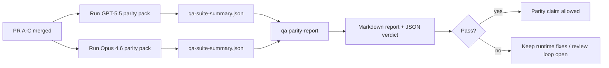

---
read_when:
    - بازبینی مجموعه درخواست‌های ادغام مربوط به هم‌ترازی GPT-5.5 / Codex
    - حفظ معماری عامل‌محورِ مبتنی بر شش قرارداد که زیربنای برنامه هم‌ارزی است
summary: نحوهٔ بررسی برنامهٔ برابری GPT-5.5 / Codex در قالب چهار واحد ادغام
title: یادداشت‌های نگه‌دارندگان دربارهٔ هم‌ارزی GPT-5.5 / Codex
x-i18n:
    generated_at: "2026-05-06T09:22:03Z"
    model: gpt-5.5
    provider: openai
    source_hash: 5752b4610f8b0d70b80d880ea10df75478b5f85ca431cdb73d3b61d745b23356
    source_path: help/gpt55-codex-agentic-parity-maintainers.md
    workflow: 16
---

این یادداشت توضیح می‌دهد چگونه برنامهٔ برابری GPT-5.5 / Codex را به‌عنوان چهار واحد ادغام بازبینی کنید، بدون اینکه معماری اصلی شش‌قراردادی از دست برود.

## واحدهای ادغام

### PR A: اجرای سخت‌گیرانهٔ عامل‌محور

مالک موارد زیر است:

- `executionContract`
- پیگیری هم‌نوبتی با اولویت GPT-5
- `update_plan` به‌عنوان ردیابی پیشرفت غیرنهایی
- وضعیت‌های مسدودشدهٔ صریح به‌جای توقف‌های خاموشِ فقط-برنامه

مالک موارد زیر نیست:

- طبقه‌بندی خطای احراز هویت/زمان اجرا
- راستگویی دربارهٔ مجوزها
- بازطراحی بازپخش/ادامه
- محک‌زنی برابری

### PR B: راستگویی زمان اجرا

مالک موارد زیر است:

- درستی محدودهٔ OAuth مربوط به Codex
- طبقه‌بندی تایپ‌شدهٔ خطای ارائه‌دهنده/زمان اجرا
- در دسترس بودن راستگویانهٔ `/elevated full` و دلایل مسدود شدن

مالک موارد زیر نیست:

- نرمال‌سازی طرح‌وارهٔ ابزار
- وضعیت بازپخش/سرزندگی
- گیت محک

### PR C: درستی اجرا

مالک موارد زیر است:

- سازگاری ابزار OpenAI/Codex تحت مالکیت ارائه‌دهنده
- مدیریت سخت‌گیرانهٔ طرح‌وارهٔ بدون پارامتر
- نمایش بازپخش نامعتبر
- نمایانی وضعیت وظیفهٔ طولانیِ متوقف‌شده، مسدودشده و رهاشده

مالک موارد زیر نیست:

- ادامهٔ خودانتخاب‌شده
- رفتار گویش عمومی Codex خارج از hookهای ارائه‌دهنده
- گیت محک

### PR D: سازوکار برابری

مالک موارد زیر است:

- بستهٔ سناریوی موج نخست GPT-5.5 در برابر Opus 4.6
- مستندات برابری
- گزارش برابری و سازوکار گیت انتشار

مالک موارد زیر نیست:

- تغییرات رفتار زمان اجرا خارج از QA-lab
- شبیه‌سازی احراز هویت/پراکسی/DNS داخل سازوکار

## نگاشت به شش قرارداد اصلی

| قرارداد اصلی                            | واحد ادغام |
| ---------------------------------------- | ---------- |
| درستی انتقال/احراز هویت ارائه‌دهنده     | PR B       |
| سازگاری قرارداد/طرح‌وارهٔ ابزار         | PR C       |
| اجرای هم‌نوبتی                           | PR A       |
| راستگویی دربارهٔ مجوزها                 | PR B       |
| درستی بازپخش/ادامه/سرزندگی              | PR C       |
| گیت محک/انتشار                          | PR D       |

## ترتیب بازبینی

1. PR A
2. PR B
3. PR C
4. PR D

PR D لایهٔ اثبات است. نباید دلیل تأخیر PRهای درستی زمان اجرا باشد.

## چه چیزهایی را بررسی کنید

### PR A

- اجراهای GPT-5 به‌جای توقف در توضیح، اقدام می‌کنند یا به‌شکل بسته شکست می‌خورند
- `update_plan` دیگر به‌تنهایی شبیه پیشرفت به نظر نمی‌رسد
- رفتار همچنان با اولویت GPT-5 و محدود به Pi تعبیه‌شده می‌ماند

### PR B

- خطاهای احراز هویت/پراکسی/زمان اجرا دیگر در مدیریت عمومی «مدل شکست خورد» ادغام نمی‌شوند
- `/elevated full` فقط زمانی در دسترس توصیف می‌شود که واقعاً در دسترس باشد
- دلایل مسدود شدن هم برای مدل و هم برای زمان اجرای کاربرنما قابل مشاهده‌اند

### PR C

- ثبت ابزار سخت‌گیرانهٔ OpenAI/Codex قابل پیش‌بینی رفتار می‌کند
- ابزارهای بدون پارامتر در بررسی‌های سخت‌گیرانهٔ طرح‌واره شکست نمی‌خورند
- نتایج بازپخش و Compaction وضعیت راستگویانهٔ سرزندگی را حفظ می‌کنند

### PR D

- بستهٔ سناریو قابل فهم و بازتولید است
- بسته شامل یک مسیر ایمنی بازپخشِ تغییردهنده است، نه فقط جریان‌های فقط-خواندنی
- گزارش‌ها برای انسان‌ها و خودکارسازی خواندنی هستند
- ادعاهای برابری مبتنی بر شواهد هستند، نه روایی

مصنوعات مورد انتظار از PR D:

- `qa-suite-report.md` / `qa-suite-summary.json` برای هر اجرای مدل
- `qa-agentic-parity-report.md` با مقایسهٔ تجمیعی و سطح سناریو
- `qa-agentic-parity-summary.json` با رأی قابل خواندن توسط ماشین

## گیت انتشار

تا زمانی که موارد زیر برقرار نشده‌اند، ادعای برابری یا برتری GPT-5.5 نسبت به Opus 4.6 نکنید:

- PR A، PR B و PR C ادغام شده‌اند
- PR D بستهٔ برابری موج نخست را بدون خطا اجرا می‌کند
- مجموعه‌های رگرسیون راستگویی زمان اجرا همچنان سبز می‌مانند
- گزارش برابری هیچ مورد موفقیت جعلی و هیچ رگرسیونی در رفتار توقف نشان نمی‌دهد

سازوکار برابری تنها منبع شواهد نیست. این تفکیک را در بازبینی صریح نگه دارید:

- PR D مالک مقایسهٔ مبتنی بر سناریوی GPT-5.5 در برابر Opus 4.6 است
- مجموعه‌های قطعی PR B همچنان مالک شواهد احراز هویت/پراکسی/DNS و راستگویی دسترسی کامل هستند

## گردش‌کار سریع ادغام برای نگه‌دارنده

وقتی آمادهٔ فرود دادن یک PR برابری هستید و یک توالی تکرارپذیر و کم‌ریسک می‌خواهید، از این استفاده کنید.

1. پیش از ادغام، تأیید کنید نوار شواهد برآورده شده است:
   - نشانهٔ قابل بازتولید یا آزمون شکست‌خورده
   - علت ریشه‌ای تأییدشده در کد لمس‌شده
   - اصلاح در مسیر درگیر
   - آزمون رگرسیون یا یادداشت صریح راستی‌آزمایی دستی
2. پیش از ادغام، تریاژ/برچسب‌گذاری کنید:
   - هر برچسب بستن خودکار `r:*` را زمانی اعمال کنید که PR نباید فرود بیاید
   - نامزدهای ادغام را عاری از رشته‌های مسدودکنندهٔ حل‌نشده نگه دارید
3. به‌صورت محلی روی سطح لمس‌شده اعتبارسنجی کنید:
   - `pnpm check:changed`
   - `pnpm test:changed` زمانی که آزمون‌ها تغییر کرده‌اند یا اطمینان به رفع اشکال به پوشش آزمون وابسته است
4. با جریان استاندارد نگه‌دارنده فرود دهید (فرایند `/landpr`)، سپس راستی‌آزمایی کنید:
   - رفتار بستن خودکار issueهای پیوندشده
   - وضعیت CI و پس از ادغام روی `main`
5. پس از فرود، جست‌وجوی موارد تکراری را برای PRها/issueهای باز مرتبط اجرا کنید و فقط با یک ارجاع canonical ببندید.

اگر هرکدام از موارد نوار شواهد غایب است، به‌جای ادغام درخواست تغییرات کنید.

## نگاشت هدف به شواهد

| مورد گیت تکمیل                           | مالک اصلی     | مصنوع بازبینی                                                       |
| ---------------------------------------- | ------------- | ------------------------------------------------------------------- |
| بدون توقف‌های فقط-برنامه                | PR A          | آزمون‌های زمان اجرای سخت‌گیرانهٔ عامل‌محور و `approval-turn-tool-followthrough` |
| بدون پیشرفت جعلی یا تکمیل جعلی ابزار    | PR A + PR D   | شمارش موفقیت جعلی برابری به‌همراه جزئیات گزارش سطح سناریو          |
| بدون راهنمایی نادرست `/elevated full`   | PR B          | مجموعه‌های قطعی راستگویی زمان اجرا                                  |
| خطاهای بازپخش/سرزندگی صریح باقی می‌مانند | PR C + PR D   | مجموعه‌های چرخه‌عمر/بازپخش به‌همراه `compaction-retry-mutating-tool` |
| GPT-5.5 با Opus 4.6 برابر است یا بهتر از آن عمل می‌کند | PR D          | `qa-agentic-parity-report.md` و `qa-agentic-parity-summary.json`  |

## خلاصهٔ بازبین: قبل در برابر بعد

| مشکل قابل مشاهده برای کاربر پیش از تغییر                 | نشانهٔ بازبینی پس از تغییر                                                               |
| ----------------------------------------------------------- | --------------------------------------------------------------------------------------- |
| GPT-5.5 پس از برنامه‌ریزی متوقف می‌شد                      | PR A رفتار اقدام-یا-مسدود شدن را به‌جای تکمیل فقط-توضیحی نشان می‌دهد                  |
| استفاده از ابزار با طرح‌واره‌های سخت‌گیرانهٔ OpenAI/Codex شکننده به نظر می‌رسید | PR C ثبت ابزار و فراخوانی بدون پارامتر را قابل پیش‌بینی نگه می‌دارد                  |
| راهنمایی‌های `/elevated full` گاهی گمراه‌کننده بودند       | PR B راهنمایی را به قابلیت واقعی زمان اجرا و دلایل مسدود شدن گره می‌زند              |
| وظایف طولانی می‌توانستند در ابهام بازپخش/Compaction ناپدید شوند | PR C وضعیت صریح متوقف‌شده، مسدودشده، رهاشده و بازپخش نامعتبر منتشر می‌کند            |
| ادعاهای برابری روایی بودند                                | PR D گزارشی به‌همراه رأی JSON با پوشش سناریوی یکسان روی هر دو مدل تولید می‌کند       |

## مرتبط

- [برابری عامل‌محور GPT-5.5 / Codex](/fa/help/gpt55-codex-agentic-parity)
