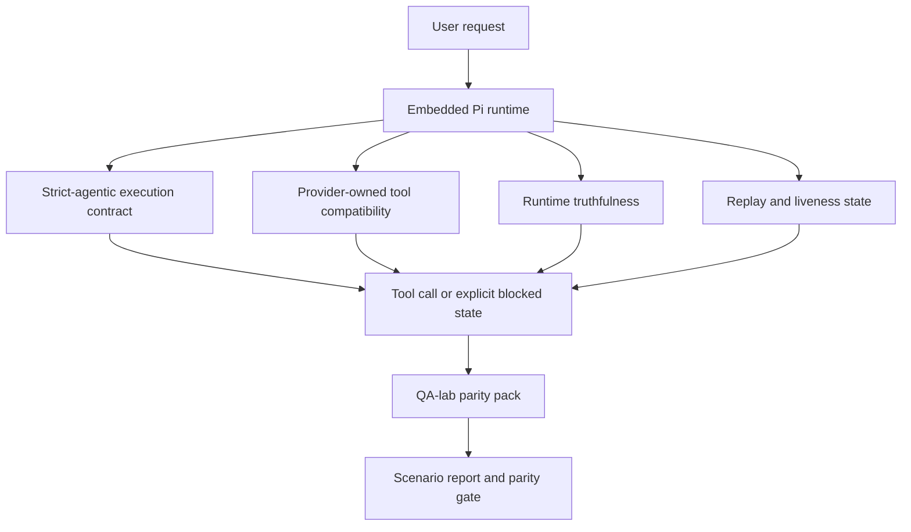
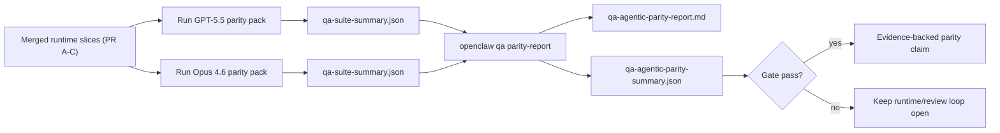

---
read_when:
    - عیب‌یابی رفتار عامل GPT-5.5 یا Codex
    - مقایسهٔ رفتار عامل‌محور OpenClaw در میان مدل‌های پیشرو
    - بازبینی اصلاحات عامل‌محور سخت‌گیرانه، طرح‌واره ابزار، ارتقای سطح دسترسی و بازپخش
summary: چگونه OpenClaw شکاف‌های اجرای عامل‌محور را برای مدل‌های GPT-5.5 و سبک Codex پر می‌کند
title: برابری عامل‌محور GPT-5.5 / Codex
x-i18n:
    generated_at: "2026-04-29T22:59:55Z"
    model: gpt-5.5
    provider: openai
    source_hash: 8a3b9375cd9e9d95855c4a1135953e00fd7a939e52fb7b75342da3bde2d83fe1
    source_path: help/gpt55-codex-agentic-parity.md
    workflow: 16
---

# برابری عاملیت‌مند GPT-5.5 / Codex در OpenClaw

OpenClaw پیش‌تر با مدل‌های پیشروِ استفاده‌کننده از ابزار به‌خوبی کار می‌کرد، اما مدل‌های GPT-5.5 و مدل‌های سبک Codex هنوز در چند مورد عملی عملکرد ضعیف‌تری داشتند:

- ممکن بود پس از برنامه‌ریزی متوقف شوند به‌جای اینکه کار را انجام دهند
- ممکن بود schemaهای سخت‌گیرانهٔ ابزار OpenAI/Codex را نادرست استفاده کنند
- ممکن بود حتی وقتی دسترسی کامل ناممکن بود، درخواست `/elevated full` کنند
- ممکن بود در هنگام replay یا compaction وضعیت کارهای طولانی‌مدت را از دست بدهند
- ادعاهای برابری با Claude Opus 4.6 بر پایهٔ روایت‌های موردی بود، نه سناریوهای تکرارپذیر

این برنامهٔ برابری آن شکاف‌ها را در چهار بخش قابل بازبینی رفع می‌کند.

## چه چیزی تغییر کرد

### PR A: اجرای سخت‌گیرانهٔ عاملیت‌مند

این بخش یک قرارداد اجرای اختیاری `strict-agentic` برای اجرای‌های GPT-5 در Pi تعبیه‌شده اضافه می‌کند.

وقتی فعال باشد، OpenClaw دیگر نوبت‌های صرفاً برنامه‌محور را به‌عنوان تکمیل «به‌اندازهٔ کافی خوب» نمی‌پذیرد. اگر مدل فقط بگوید قصد انجام چه کاری را دارد و واقعاً از ابزارها استفاده نکند یا پیشرفتی ایجاد نکند، OpenClaw با یک هدایت «اکنون عمل کن» دوباره تلاش می‌کند و سپس به‌جای پایان دادن بی‌سروصدا به کار، با یک وضعیت مسدودِ صریح fail closed می‌شود.

این بیشترین بهبود را در تجربهٔ GPT-5.5 در این موارد ایجاد می‌کند:

- پیگیری‌های کوتاه مثل «باشه انجامش بده»
- کارهای کدنویسی که گام اول در آن‌ها واضح است
- جریان‌هایی که در آن‌ها `update_plan` باید پیگیری پیشرفت باشد، نه متن پرکننده

### PR B: راست‌گویی runtime

این بخش باعث می‌شود OpenClaw دربارهٔ دو چیز حقیقت را بگوید:

- چرا فراخوانی provider/runtime شکست خورد
- آیا `/elevated full` واقعاً در دسترس است یا نه

این یعنی GPT-5.5 سیگنال‌های runtime بهتری برای scope از‌دست‌رفته، شکست‌های refresh احراز هویت، شکست‌های احراز هویت HTML 403، مشکلات proxy، شکست‌های DNS یا timeout، و حالت‌های دسترسی کامل مسدود دریافت می‌کند. احتمال اینکه مدل راهکار اشتباه بسازد یا همچنان مجوزی را درخواست کند که runtime نمی‌تواند فراهم کند، کمتر می‌شود.

### PR C: درستی اجرا

این بخش دو نوع درستی را بهبود می‌دهد:

- سازگاری schema ابزارهای OpenAI/Codex که مالکیت آن با provider است
- نمایان‌سازی replay و زنده‌بودن کارهای طولانی‌مدت

کار مربوط به سازگاری ابزار، اصطکاک schema را برای ثبت سخت‌گیرانهٔ ابزارهای OpenAI/Codex کاهش می‌دهد، به‌خصوص دربارهٔ ابزارهای بدون پارامتر و انتظارهای سخت‌گیرانهٔ object-root. کار مربوط به replay/liveness باعث می‌شود کارهای طولانی‌مدت مشاهده‌پذیرتر شوند، تا وضعیت‌های paused، blocked و abandoned به‌جای ناپدید شدن در متن خطای کلی، قابل مشاهده باشند.

### PR D: ابزار سنجش برابری

این بخش بستهٔ موج اول برابری QA-lab را اضافه می‌کند تا GPT-5.5 و Opus 4.6 بتوانند از طریق سناریوهای یکسان اجرا شوند و با شواهد مشترک مقایسه شوند.

بستهٔ برابری لایهٔ اثبات است. خودش رفتار runtime را تغییر نمی‌دهد.

پس از اینکه دو artifact با نام `qa-suite-summary.json` داشتید، مقایسهٔ release-gate را با این دستور تولید کنید:

```bash
pnpm openclaw qa parity-report \
  --repo-root . \
  --candidate-summary .artifacts/qa-e2e/gpt55/qa-suite-summary.json \
  --baseline-summary .artifacts/qa-e2e/opus46/qa-suite-summary.json \
  --output-dir .artifacts/qa-e2e/parity
```

آن دستور این موارد را می‌نویسد:

- یک گزارش Markdown خوانا برای انسان
- یک رأی JSON خوانا برای ماشین
- یک نتیجهٔ gate صریح `pass` / `fail`

## چرا این کار در عمل GPT-5.5 را بهتر می‌کند

پیش از این کار، GPT-5.5 در OpenClaw ممکن بود در جلسه‌های واقعی کدنویسی کمتر از Opus عاملیت‌مند به نظر برسد، چون runtime رفتارهایی را تحمل می‌کرد که برای مدل‌های سبک GPT-5 به‌طور خاص آسیب‌زا هستند:

- نوبت‌های فقط شامل توضیح
- اصطکاک schema پیرامون ابزارها
- بازخورد مبهم دربارهٔ مجوز
- شکست بی‌سروصدای replay یا compaction

هدف این نیست که GPT-5.5 از Opus تقلید کند. هدف این است که به GPT-5.5 یک قرارداد runtime داده شود که پیشرفت واقعی را پاداش دهد، معناشناسی تمیزتری برای ابزار و مجوز فراهم کند، و حالت‌های شکست را به وضعیت‌هایی صریح و خوانا برای ماشین و انسان تبدیل کند.

این تجربهٔ کاربر را از این حالت:

- «مدل برنامهٔ خوبی داشت اما متوقف شد»

به این حالت تغییر می‌دهد:

- «مدل یا عمل کرد، یا OpenClaw دلیل دقیق ناتوانی آن را نشان داد»

## قبل و بعد برای کاربران GPT-5.5

| پیش از این برنامه                                                                            | پس از PR A-D                                                                             |
| ---------------------------------------------------------------------------------------------- | ---------------------------------------------------------------------------------------- |
| GPT-5.5 می‌توانست پس از یک برنامهٔ منطقی بدون برداشتن گام ابزار بعدی متوقف شود                   | PR A «فقط برنامه» را به «اکنون عمل کن یا یک وضعیت مسدود نشان بده» تبدیل می‌کند                         |
| schemaهای سخت‌گیرانهٔ ابزار می‌توانستند ابزارهای بدون پارامتر یا ابزارهای به‌شکل OpenAI/Codex را به‌شکلی گیج‌کننده رد کنند | PR C ثبت و فراخوانی ابزارهای تحت مالکیت provider را قابل پیش‌بینی‌تر می‌کند              |
| راهنمایی `/elevated full` می‌توانست در runtimeهای مسدود مبهم یا اشتباه باشد                          | PR B به GPT-5.5 و کاربر اشاره‌های درست دربارهٔ runtime و مجوز می‌دهد                    |
| شکست‌های replay یا compaction می‌توانستند طوری به نظر برسند که کار بی‌سروصدا ناپدید شده است                    | PR C نتایج paused، blocked، abandoned و replay-invalid را صریحاً نشان می‌دهد         |
| «GPT-5.5 بدتر از Opus به نظر می‌رسد» عمدتاً روایتی موردی بود                                           | PR D آن را به همان بستهٔ سناریو، همان معیارها، و یک gate سخت pass/fail تبدیل می‌کند |

## معماری



## جریان انتشار



## بستهٔ سناریو

بستهٔ موج اول برابری در حال حاضر پنج سناریو را پوشش می‌دهد:

### `approval-turn-tool-followthrough`

بررسی می‌کند که مدل پس از یک تأیید کوتاه در «انجامش می‌دهم» متوقف نشود. باید نخستین اقدام مشخص را در همان نوبت انجام دهد.

### `model-switch-tool-continuity`

بررسی می‌کند که کارِ استفاده‌کننده از ابزار در مرزهای جابه‌جایی مدل/runtime منسجم بماند، به‌جای اینکه به توضیح‌گویی بازنشانی شود یا زمینهٔ اجرا را از دست بدهد.

### `source-docs-discovery-report`

بررسی می‌کند که مدل بتواند source و docs را بخواند، یافته‌ها را ترکیب کند، و کار را به‌صورت عاملیت‌مند ادامه دهد، نه اینکه یک خلاصهٔ سطحی تولید کند و زود متوقف شود.

### `image-understanding-attachment`

بررسی می‌کند که کارهای mixed-mode شامل attachment همچنان اقدام‌پذیر بمانند و به روایت مبهم فرو نریزند.

### `compaction-retry-mutating-tool`

بررسی می‌کند کاری با یک نوشتن mutating واقعی، replay-unsafety را صریح نگه دارد، به‌جای اینکه اگر اجرا compacts شود، retries شود، یا تحت فشار وضعیت پاسخ را از دست بدهد، بی‌سروصدا replay-safe به نظر برسد.

## ماتریس سناریو

| سناریو                           | آنچه آزمایش می‌کند                           | رفتار خوب GPT-5.5                                                          | سیگنال شکست                                                                 |
| ---------------------------------- | --------------------------------------- | ------------------------------------------------------------------------------ | ------------------------------------------------------------------------------ |
| `approval-turn-tool-followthrough` | نوبت‌های تأیید کوتاه پس از یک برنامه       | نخستین اقدام مشخص ابزار را فوراً شروع می‌کند به‌جای اینکه قصد را دوباره بیان کند  | پیگیری فقط شامل برنامه، نبود فعالیت ابزار، یا نوبت مسدود بدون blocker واقعی  |
| `model-switch-tool-continuity`     | جابه‌جایی runtime/model هنگام استفاده از ابزار  | زمینهٔ کار را حفظ می‌کند و به اقدام منسجم ادامه می‌دهد                         | به توضیح‌گویی بازنشانی می‌شود، زمینهٔ ابزار را از دست می‌دهد، یا پس از جابه‌جایی متوقف می‌شود              |
| `source-docs-discovery-report`     | خواندن source + ترکیب + اقدام     | sourceها را پیدا می‌کند، از ابزارها استفاده می‌کند، و بدون توقف گزارش مفیدی تولید می‌کند       | خلاصهٔ سطحی، نبود کار ابزار، یا توقف با نوبت ناقص                       |
| `image-understanding-attachment`   | کار عاملیت‌مند بر پایهٔ attachment          | attachment را تفسیر می‌کند، آن را به ابزارها پیوند می‌دهد، و کار را ادامه می‌دهد        | روایت مبهم، نادیده گرفتن attachment، یا نبود اقدام بعدی مشخص                |
| `compaction-retry-mutating-tool`   | کار mutating تحت فشار compaction | یک نوشتن واقعی انجام می‌دهد و پس از اثر جانبی، replay-unsafety را صریح نگه می‌دارد | نوشتن mutating رخ می‌دهد اما replay safety تلویحی، غایب، یا متناقض است |

## Gate انتشار

GPT-5.5 فقط زمانی می‌تواند در سطح برابری یا بهتر در نظر گرفته شود که runtime ادغام‌شده هم‌زمان بستهٔ برابری و regressionهای راست‌گویی runtime را با موفقیت بگذراند.

نتایج موردنیاز:

- نبود توقف فقط-برنامه وقتی اقدام ابزار بعدی روشن است
- نبود تکمیل ساختگی بدون اجرای واقعی
- نبود راهنمایی نادرست `/elevated full`
- نبود رهاشدن بی‌سروصدای replay یا compaction
- معیارهای بستهٔ برابری که دست‌کم به‌اندازهٔ baseline توافق‌شدهٔ Opus 4.6 قوی باشند

برای ابزار سنجش موج اول، gate این موارد را مقایسه می‌کند:

- نرخ تکمیل
- نرخ توقف ناخواسته
- نرخ tool call معتبر
- شمارش موفقیت ساختگی

شواهد برابری عمداً در دو لایه تقسیم شده است:

- PR D رفتار GPT-5.5 در برابر Opus 4.6 را با سناریوهای یکسان در QA-lab ثابت می‌کند
- suiteهای قطعی PR B راست‌گویی auth، proxy، DNS و `/elevated full` را بیرون از ابزار سنجش ثابت می‌کنند

## ماتریس هدف تا شواهد

| مورد gate تکمیل                                     | PR مالک   | منبع شواهد                                                    | سیگنال موفقیت                                                                              |
| -------------------------------------------------------- | ----------- | ------------------------------------------------------------------ | ---------------------------------------------------------------------------------------- |
| GPT-5.5 دیگر پس از برنامه‌ریزی متوقف نمی‌شود                  | PR A        | `approval-turn-tool-followthrough` به‌همراه suiteهای runtime مربوط به PR A        | نوبت‌های تأیید باعث کار واقعی یا یک وضعیت مسدود صریح می‌شوند                            |
| GPT-5.5 دیگر پیشرفت ساختگی یا تکمیل ساختگی ابزار ارائه نمی‌کند | PR A + PR D | نتایج سناریوهای گزارش برابری و شمارش fake-success             | نبود نتایج pass مشکوک و نبود تکمیل فقط شامل توضیح                             |
| GPT-5.5 دیگر راهنمایی نادرست `/elevated full` نمی‌دهد  | PR B        | suiteهای قطعی راست‌گویی                                  | دلایل مسدودشدن و اشاره‌های دسترسی کامل با runtime دقیق می‌مانند                              |
| شکست‌های replay/liveness صریح می‌مانند                   | PR C + PR D | suiteهای lifecycle/replay مربوط به PR C به‌همراه `compaction-retry-mutating-tool` | کار mutating به‌جای ناپدید شدن بی‌سروصدا، replay-unsafety را صریح نگه می‌دارد            |
| GPT-5.5 در معیارهای توافق‌شده با Opus 4.6 برابر می‌شود یا از آن بهتر عمل می‌کند  | PR D        | `qa-agentic-parity-report.md` و `qa-agentic-parity-summary.json` | پوشش سناریوی یکسان و نبود regression در تکمیل، رفتار توقف، یا استفادهٔ معتبر از ابزار |

## چگونه رأی برابری را بخوانیم

از رأی موجود در `qa-agentic-parity-summary.json` به‌عنوان تصمیم نهایی خوانا برای ماشین برای بستهٔ برابری موج اول استفاده کنید.

- `pass` یعنی GPT-5.5 همان سناریوهای Opus 4.6 را پوشش داده و در معیارهای تجمیعیِ مورد توافق دچار پسرفت نشده است.
- `fail` یعنی دست‌کم یک gate سخت فعال شده است: تکمیل ضعیف‌تر، توقف‌های ناخواسته بدتر، استفاده معتبر ضعیف‌تر از ابزار، هر مورد موفقیت جعلی، یا پوشش ناهماهنگ سناریوها.
- «مشکل CI مشترک/پایه» به‌خودی‌خود نتیجه برابری نیست. اگر نویز CI خارج از PR D مانع اجرای یک run شود، حکم باید به‌جای استنباط از لاگ‌های دوره شاخه، منتظر اجرای تمیز merged-runtime بماند.
- درستی‌سنجی Auth، proxy، DNS و `/elevated full` همچنان از suiteهای قطعی PR B می‌آید، بنابراین ادعای نهایی انتشار به هر دو نیاز دارد: حکم موفق برابری PR D و پوشش سبز درستی‌سنجی PR B.

## چه کسانی باید `strict-agentic` را فعال کنند

از `strict-agentic` استفاده کنید وقتی:

- انتظار می‌رود agent هنگامی که گام بعدی آشکار است، فوراً اقدام کند
- مدل‌های GPT-5.5 یا خانواده Codex، runtime اصلی هستند
- حالت‌های صریح blocked را به پاسخ‌های «مفید» فقط-خلاصه ترجیح می‌دهید

قرارداد پیش‌فرض را نگه دارید وقتی:

- رفتار آزادتر موجود را می‌خواهید
- از مدل‌های خانواده GPT-5 استفاده نمی‌کنید
- به‌جای اجرای runtime، promptها را آزمایش می‌کنید

## مرتبط

- [یادداشت‌های نگه‌دارندگان درباره برابری GPT-5.5 / Codex](/fa/help/gpt55-codex-agentic-parity-maintainers)
