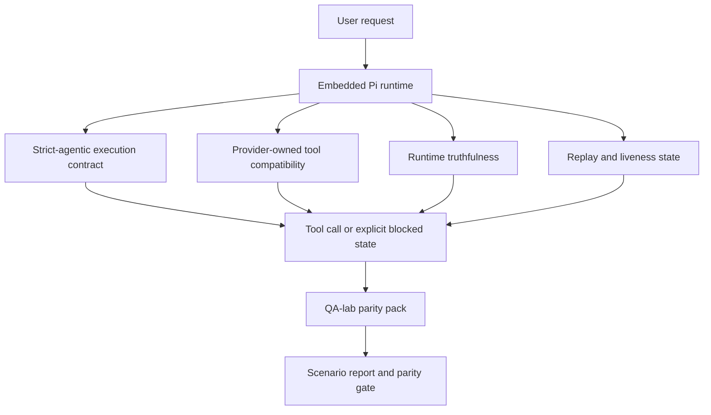
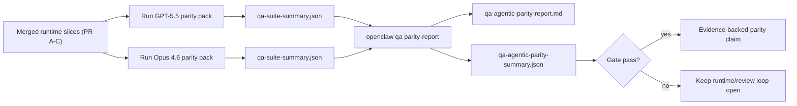

---
read_when:
    - اشکال‌زدایی رفتار عامل GPT-5.5 یا Codex
    - مقایسهٔ رفتار عامل‌محور OpenClaw در میان مدل‌های پیشرو
    - بازبینی اصلاحات عامل‌محورِ سخت‌گیرانه، طرح‌واره ابزار، ارتقای سطح دسترسی و بازپخش
summary: چگونه OpenClaw شکاف‌های اجرای عامل‌محور را برای GPT-5.5 و مدل‌های سبک Codex برطرف می‌کند
title: هم‌ارزی عاملیت‌محور GPT-5.5 / Codex
x-i18n:
    generated_at: "2026-05-06T09:22:31Z"
    model: gpt-5.5
    provider: openai
    source_hash: bbc32f418dfffe2786093fa6b42b19f92a2d382c9408dfc55dd0154d67959390
    source_path: help/gpt55-codex-agentic-parity.md
    workflow: 16
---

OpenClaw پیش‌تر با مدل‌های frontier دارای قابلیت استفاده از ابزار به‌خوبی کار می‌کرد، اما GPT-5.5 و مدل‌های سبک Codex هنوز در چند زمینه عملی عملکرد ضعیف‌تری داشتند:

- ممکن بود پس از برنامه‌ریزی متوقف شوند، به‌جای اینکه کار را انجام دهند
- ممکن بود از اسکیماهای سخت‌گیرانه ابزار OpenAI/Codex به‌درستی استفاده نکنند
- ممکن بود حتی وقتی دسترسی کامل ناممکن بود، درخواست `/elevated full` بدهند
- ممکن بود وضعیت وظایف طولانی‌مدت را هنگام بازپخش یا Compaction از دست بدهند
- ادعاهای هم‌ترازی با Claude Opus 4.6 به‌جای سناریوهای تکرارپذیر، بر روایت‌های موردی تکیه داشتند

این برنامه هم‌ترازی آن شکاف‌ها را در چهار بخش قابل بازبینی برطرف می‌کند.

## چه چیزی تغییر کرد

### PR A: اجرای سخت‌گیرانه عامل‌محور

این بخش یک قرارداد اجرای اختیاری `strict-agentic` برای اجراهای تعبیه‌شده Pi GPT-5 اضافه می‌کند.

وقتی فعال باشد، OpenClaw دیگر نوبت‌های صرفا برنامه‌محور را به‌عنوان تکمیل «به‌اندازه کافی خوب» نمی‌پذیرد. اگر مدل فقط بگوید قصد انجام چه کاری را دارد و واقعا از ابزارها استفاده نکند یا پیشرفتی ایجاد نکند، OpenClaw با یک هدایت برای اقدام فوری دوباره تلاش می‌کند و سپس به‌جای پایان دادن بی‌سروصدای وظیفه، با یک وضعیت مسدود صریح به‌صورت بسته شکست می‌خورد.

این بیشترین بهبود را برای تجربه GPT-5.5 در موارد زیر ایجاد می‌کند:

- پیگیری‌های کوتاه مانند «باشه انجامش بده»
- وظایف کدنویسی که گام اول در آن‌ها واضح است
- جریان‌هایی که در آن‌ها `update_plan` باید ردیابی پیشرفت باشد، نه متن پرکننده

### PR B: راست‌گویی زمان اجرا

این بخش باعث می‌شود OpenClaw درباره دو چیز حقیقت را بگوید:

- اینکه چرا فراخوانی provider/runtime شکست خورد
- اینکه آیا `/elevated full` واقعا در دسترس است یا نه

یعنی GPT-5.5 سیگنال‌های زمان اجرای بهتری برای محدوده مفقود، شکست‌های تازه‌سازی احراز هویت، شکست‌های احراز هویت HTML 403، مشکلات پروکسی، شکست‌های DNS یا timeout، و حالت‌های مسدود دسترسی کامل دریافت می‌کند. احتمال اینکه مدل راهکار رفع مشکل اشتباه را توهم کند یا همچنان حالت مجوزی را درخواست کند که زمان اجرا نمی‌تواند فراهم کند، کمتر می‌شود.

### PR C: درستی اجرا

این بخش دو نوع درستی را بهبود می‌دهد:

- سازگاری اسکیمای ابزار OpenAI/Codex که در مالکیت provider است
- نمایان‌سازی سرزندگی بازپخش و وظایف طولانی

کار مربوط به سازگاری ابزار، اصطکاک اسکیما را برای ثبت سخت‌گیرانه ابزارهای OpenAI/Codex کاهش می‌دهد، به‌ویژه درباره ابزارهای بدون پارامتر و انتظارهای سخت‌گیرانه ریشه شیء. کار مربوط به بازپخش/سرزندگی باعث می‌شود وظایف طولانی‌مدت مشاهده‌پذیرتر شوند، تا وضعیت‌های مکث‌شده، مسدود و رهاشده به‌جای ناپدید شدن در متن شکست عمومی، قابل مشاهده باشند.

### PR D: چارچوب هم‌ترازی

این بخش نخستین بسته هم‌ترازی QA-lab را اضافه می‌کند تا GPT-5.5 و Opus 4.6 بتوانند از طریق سناریوهای یکسان اجرا شوند و با شواهد مشترک مقایسه شوند.

بسته هم‌ترازی لایه اثبات است. این بخش به‌تنهایی رفتار زمان اجرا را تغییر نمی‌دهد.

بعد از اینکه دو artifact از نوع `qa-suite-summary.json` داشتید، مقایسه release-gate را با این فرمان تولید کنید:

```bash
pnpm openclaw qa parity-report \
  --repo-root . \
  --candidate-summary .artifacts/qa-e2e/gpt55/qa-suite-summary.json \
  --baseline-summary .artifacts/qa-e2e/opus46/qa-suite-summary.json \
  --output-dir .artifacts/qa-e2e/parity
```

آن فرمان این موارد را می‌نویسد:

- یک گزارش Markdown خوانا برای انسان
- یک حکم JSON خوانا برای ماشین
- یک نتیجه gate صریح `pass` / `fail`

## چرا این موضوع GPT-5.5 را در عمل بهبود می‌دهد

پیش از این کار، GPT-5.5 روی OpenClaw در نشست‌های واقعی کدنویسی می‌توانست نسبت به Opus کمتر عامل‌محور به نظر برسد، چون زمان اجرا رفتارهایی را تحمل می‌کرد که برای مدل‌های سبک GPT-5 به‌ویژه زیان‌بار هستند:

- نوبت‌های فقط تفسیری
- اصطکاک اسکیما پیرامون ابزارها
- بازخورد مبهم مجوز
- خرابی بی‌سروصدای بازپخش یا Compaction

هدف این نیست که GPT-5.5 از Opus تقلید کند. هدف این است که به GPT-5.5 قراردادی در زمان اجرا داده شود که پیشرفت واقعی را پاداش دهد، معناشناسی پاک‌تری برای ابزار و مجوز فراهم کند، و حالت‌های شکست را به وضعیت‌های صریح خوانا برای ماشین و انسان تبدیل کند.

این تجربه کاربر را از این حالت:

- «مدل برنامه خوبی داشت اما متوقف شد»

به این حالت تغییر می‌دهد:

- «مدل یا اقدام کرد، یا OpenClaw دلیل دقیق ناتوانی آن را آشکار کرد»

## قبل و بعد برای کاربران GPT-5.5

| پیش از این برنامه                                                                            | پس از PR A-D                                                                             |
| ---------------------------------------------------------------------------------------------- | ---------------------------------------------------------------------------------------- |
| GPT-5.5 ممکن بود پس از یک برنامه منطقی، بدون برداشتن گام ابزاری بعدی متوقف شود                   | PR A «فقط برنامه» را به «اکنون اقدام کن یا وضعیت مسدود را آشکار کن» تبدیل می‌کند                         |
| اسکیماهای سخت‌گیرانه ابزار ممکن بود ابزارهای بدون پارامتر یا ابزارهای به‌شکل OpenAI/Codex را به‌شکلی گیج‌کننده رد کنند | PR C ثبت و فراخوانی ابزار در مالکیت provider را پیش‌بینی‌پذیرتر می‌کند              |
| راهنمایی `/elevated full` ممکن بود در زمان‌اجراهای مسدود مبهم یا اشتباه باشد                          | PR B به GPT-5.5 و کاربر نکته‌های صادقانه درباره زمان اجرا و مجوز می‌دهد                    |
| شکست‌های بازپخش یا Compaction ممکن بود طوری حس شوند که انگار وظیفه بی‌سروصدا ناپدید شده است                    | PR C خروجی‌های مکث‌شده، مسدود، رهاشده و بازپخش‌نامعتبر را صریحا آشکار می‌کند         |
| «GPT-5.5 بدتر از Opus حس می‌شود» عمدتا روایتی موردی بود                                           | PR D آن را به بسته سناریوی یکسان، معیارهای یکسان، و یک gate سخت pass/fail تبدیل می‌کند |

## معماری



## جریان انتشار



## بسته سناریو

بسته هم‌ترازی موج نخست در حال حاضر پنج سناریو را پوشش می‌دهد:

### `approval-turn-tool-followthrough`

بررسی می‌کند که مدل پس از یک تأیید کوتاه، در «انجامش می‌دهم» متوقف نشود. باید نخستین اقدام ملموس را در همان نوبت انجام دهد.

### `model-switch-tool-continuity`

بررسی می‌کند که کار دارای استفاده از ابزار در مرزهای جابه‌جایی مدل/زمان اجرا منسجم بماند، به‌جای اینکه به تفسیر بازنشانی شود یا زمینه اجرا را از دست بدهد.

### `source-docs-discovery-report`

بررسی می‌کند که مدل بتواند منبع و مستندات را بخواند، یافته‌ها را ترکیب کند، و وظیفه را به‌صورت عامل‌محور ادامه دهد، به‌جای اینکه خلاصه‌ای کم‌مایه تولید کند و زود متوقف شود.

### `image-understanding-attachment`

بررسی می‌کند که وظایف چندحالته شامل پیوست‌ها همچنان قابل اقدام بمانند و به روایت مبهم فرو نریزند.

### `compaction-retry-mutating-tool`

بررسی می‌کند که وظیفه‌ای با یک نوشتن جهش‌دهنده واقعی، ناایمنی بازپخش را صریح نگه دارد، به‌جای اینکه اگر اجرا تحت فشار Compaction شود، دوباره تلاش کند، یا وضعیت پاسخ را از دست بدهد، بی‌سروصدا بازپخش‌امن به نظر برسد.

## ماتریس سناریو

| سناریو                           | آنچه آزمایش می‌کند                           | رفتار خوب GPT-5.5                                                          | سیگنال شکست                                                                 |
| ---------------------------------- | --------------------------------------- | ------------------------------------------------------------------------------ | ------------------------------------------------------------------------------ |
| `approval-turn-tool-followthrough` | نوبت‌های تأیید کوتاه پس از یک برنامه       | نخستین اقدام ابزاری ملموس را بلافاصله شروع می‌کند، به‌جای اینکه قصد را دوباره بیان کند  | پیگیری فقط برنامه‌محور، نبود فعالیت ابزاری، یا نوبت مسدود بدون مسدودکننده واقعی  |
| `model-switch-tool-continuity`     | جابه‌جایی زمان اجرا/مدل هنگام استفاده از ابزار  | زمینه وظیفه را حفظ می‌کند و به اقدام منسجم ادامه می‌دهد                         | به تفسیر بازنشانی می‌شود، زمینه ابزار را از دست می‌دهد، یا پس از جابه‌جایی متوقف می‌شود              |
| `source-docs-discovery-report`     | خواندن منبع + ترکیب + اقدام     | منابع را پیدا می‌کند، از ابزارها استفاده می‌کند، و بدون توقف، گزارشی مفید تولید می‌کند       | خلاصه کم‌مایه، کار ابزاری مفقود، یا توقف نوبت ناقص                       |
| `image-understanding-attachment`   | کار عامل‌محور مبتنی بر پیوست          | پیوست را تفسیر می‌کند، آن را به ابزارها وصل می‌کند، و وظیفه را ادامه می‌دهد        | روایت مبهم، نادیده گرفتن پیوست، یا نبود اقدام بعدی ملموس                |
| `compaction-retry-mutating-tool`   | کار جهش‌دهنده تحت فشار Compaction | یک نوشتن واقعی انجام می‌دهد و پس از اثر جانبی، ناایمنی بازپخش را صریح نگه می‌دارد | نوشتن جهش‌دهنده رخ می‌دهد اما ایمنی بازپخش ضمنی، مفقود، یا متناقض است |

## gate انتشار

GPT-5.5 فقط زمانی می‌تواند هم‌تراز یا بهتر در نظر گرفته شود که زمان اجرای ادغام‌شده، بسته هم‌ترازی و رگرسیون‌های راست‌گویی زمان اجرا را هم‌زمان پاس کند.

خروجی‌های لازم:

- نبود توقف فقط برنامه‌محور وقتی اقدام ابزاری بعدی روشن است
- نبود تکمیل جعلی بدون اجرای واقعی
- نبود راهنمایی نادرست `/elevated full`
- نبود رهاسازی بی‌سروصدای بازپخش یا Compaction
- معیارهای بسته هم‌ترازی که دست‌کم به‌اندازه baseline توافق‌شده Opus 4.6 قوی باشند

برای چارچوب موج نخست، gate این موارد را مقایسه می‌کند:

- نرخ تکمیل
- نرخ توقف ناخواسته
- نرخ فراخوانی ابزار معتبر
- تعداد موفقیت جعلی

شواهد هم‌ترازی عمدا در دو لایه جدا شده‌اند:

- PR D رفتار GPT-5.5 در برابر Opus 4.6 را در سناریوی یکسان با QA-lab اثبات می‌کند
- مجموعه‌های deterministic در PR B راست‌گویی احراز هویت، پروکسی، DNS و `/elevated full` را بیرون از چارچوب اثبات می‌کنند

## ماتریس هدف تا شواهد

| مورد gate تکمیل                                     | PR مالک   | منبع شواهد                                                    | سیگنال pass                                                                              |
| -------------------------------------------------------- | ----------- | ------------------------------------------------------------------ | ---------------------------------------------------------------------------------------- |
| GPT-5.5 دیگر پس از برنامه‌ریزی متوقف نمی‌شود                  | PR A        | `approval-turn-tool-followthrough` به‌همراه مجموعه‌های زمان اجرای PR A        | نوبت‌های تأیید باعث کار واقعی یا وضعیت مسدود صریح می‌شوند                            |
| GPT-5.5 دیگر پیشرفت جعلی یا تکمیل ابزار جعلی ایجاد نمی‌کند | PR A + PR D | خروجی‌های سناریوی گزارش هم‌ترازی و تعداد موفقیت جعلی             | نبود نتایج pass مشکوک و نبود تکمیل فقط تفسیری                             |
| GPT-5.5 دیگر راهنمایی نادرست `/elevated full` نمی‌دهد  | PR B        | مجموعه‌های deterministic راست‌گویی                                  | دلیل‌های مسدودشدن و نکته‌های دسترسی کامل با زمان اجرا دقیق می‌مانند                              |
| شکست‌های بازپخش/سرزندگی صریح می‌مانند                   | PR C + PR D | مجموعه‌های چرخه‌عمر/بازپخش PR C به‌همراه `compaction-retry-mutating-tool` | کار جهش‌دهنده به‌جای ناپدیدشدن بی‌سروصدا، ناایمنی بازپخش را صریح نگه می‌دارد            |
| GPT-5.5 در معیارهای توافق‌شده با Opus 4.6 برابری می‌کند یا بهتر است  | PR D        | `qa-agentic-parity-report.md` و `qa-agentic-parity-summary.json` | پوشش سناریوی یکسان و نبود رگرسیون در تکمیل، رفتار توقف، یا استفاده معتبر از ابزار |

## چگونه حکم هم‌ترازی را بخوانید

از حکم موجود در `qa-agentic-parity-summary.json` به‌عنوان تصمیم نهایی خوانا برای ماشین برای بسته هم‌ترازی موج نخست استفاده کنید.

- `pass` یعنی GPT-5.5 همان سناریوهایی را پوشش داد که Opus 4.6 پوشش داده بود و در معیارهای تجمیعی توافق‌شده دچار پسرفت نشد.
- `fail` یعنی دست‌کم یک دروازهٔ سخت فعال شده است: تکمیل ضعیف‌تر، توقف‌های ناخواستهٔ بدتر، استفادهٔ معتبر ضعیف‌تر از ابزار، هر مورد موفقیت جعلی، یا پوشش ناهماهنگ سناریو.
- «مشکل CI مشترک/پایه» به‌خودی‌خود نتیجهٔ برابری نیست. اگر نویز CI خارج از PR D اجرای یک نوبت را مسدود کند، رأی باید به‌جای استنباط از لاگ‌های دورهٔ شاخه، تا اجرای پاک روی runtime ادغام‌شده منتظر بماند.
- صحت‌گویی دربارهٔ احراز هویت، پراکسی، DNS، و `/elevated full` همچنان از مجموعه‌تست‌های قطعی PR B می‌آید، بنابراین ادعای نهایی انتشار به هر دو مورد نیاز دارد: رأی قبولی برابری PR D و پوشش سبز صحت‌گویی PR B.

## چه کسانی باید `strict-agentic` را فعال کنند

از `strict-agentic` استفاده کنید وقتی:

- انتظار می‌رود عامل وقتی گام بعدی واضح است فوراً اقدام کند
- GPT-5.5 یا مدل‌های خانوادهٔ Codex runtime اصلی هستند
- حالت‌های مسدود صریح را به پاسخ‌های «کمک‌کننده» که فقط خلاصه می‌کنند ترجیح می‌دهید

قرارداد پیش‌فرض را نگه دارید وقتی:

- رفتار آزادتر موجود را می‌خواهید
- از مدل‌های خانوادهٔ GPT-5 استفاده نمی‌کنید
- به‌جای اجرای runtime، در حال آزمایش promptها هستید

## مرتبط

- [یادداشت‌های نگه‌دارنده دربارهٔ برابری GPT-5.5 / Codex](/fa/help/gpt55-codex-agentic-parity-maintainers)
