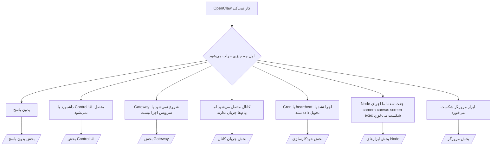

---
read_when:
    - OpenClaw کار نمی‌کند و به سریع‌ترین مسیر برای رفع مشکل نیاز دارید
    - پیش از ورود به راهنماهای عملیاتی مفصل، به یک روند تریاژ نیاز دارید
summary: مرکز عیب‌یابی نشانه‌محور برای OpenClaw
title: عیب‌یابی عمومی
x-i18n:
    generated_at: "2026-04-29T23:00:53Z"
    model: gpt-5.5
    provider: openai
    source_hash: c832c3f7609c56a5461515ed0f693d2255310bf2d3958f69f57c482bcbef97f0
    source_path: help/troubleshooting.md
    workflow: 16
---

اگر فقط ۲ دقیقه وقت دارید، از این صفحه به‌عنوان ورودی تریاژ استفاده کنید.

## ۶۰ ثانیهٔ اول

این نردبان دقیق را به‌ترتیب اجرا کنید:

```bash
openclaw status
openclaw status --all
openclaw gateway probe
openclaw gateway status
openclaw doctor
openclaw channels status --probe
openclaw logs --follow
```

خروجی خوب در یک خط:

- `openclaw status` → کانال‌های پیکربندی‌شده را نشان می‌دهد و خطاهای احراز هویت واضحی ندارد.
- `openclaw status --all` → گزارش کامل موجود و قابل اشتراک‌گذاری است.
- `openclaw gateway probe` → هدف مورد انتظار Gateway در دسترس است (`Reachable: yes`). `Capability: ...` به شما می‌گوید پروب چه سطح احراز هویتی را توانسته ثابت کند، و `Read probe: limited - missing scope: operator.read` به‌معنای تشخیص محدودشده است، نه شکست اتصال.
- `openclaw gateway status` → `Runtime: running`، `Connectivity probe: ok`، و یک خط قابل‌قبول `Capability: ...`. اگر به اثبات RPC با محدودهٔ خواندن هم نیاز دارید از `--require-rpc` استفاده کنید.
- `openclaw doctor` → خطای مسدودکنندهٔ پیکربندی/سرویس ندارد.
- `openclaw channels status --probe` → Gateway در دسترس، وضعیت زندهٔ انتقال به‌ازای هر حساب
  به‌همراه نتایج پروب/ممیزی مانند `works` یا `audit ok` را برمی‌گرداند؛ اگر
  Gateway در دسترس نباشد، فرمان به خلاصه‌های فقط-پیکربندی برمی‌گردد.
- `openclaw logs --follow` → فعالیت پایدار، بدون خطاهای مرگبار تکرارشونده.

## ۴۲۹ زمینهٔ بلند Anthropic

اگر این را می‌بینید:
`HTTP 429: rate_limit_error: Extra usage is required for long context requests`,
به [/gateway/troubleshooting#anthropic-429-extra-usage-required-for-long-context](/fa/gateway/troubleshooting#anthropic-429-extra-usage-required-for-long-context) بروید.

## بک‌اند محلی سازگار با OpenAI مستقیم کار می‌کند اما در OpenClaw شکست می‌خورد

اگر بک‌اند محلی یا خودمیزبانِ `/v1` شما به پروب‌های مستقیم کوچک
`/v1/chat/completions` پاسخ می‌دهد اما در `openclaw infer model run` یا نوبت‌های عادی
عامل شکست می‌خورد:

1. اگر خطا می‌گوید `messages[].content` انتظار رشته دارد، مقدار
   `models.providers.<provider>.models[].compat.requiresStringContent: true` را تنظیم کنید.
2. اگر بک‌اند هنوز فقط در نوبت‌های عامل OpenClaw شکست می‌خورد، مقدار
   `models.providers.<provider>.models[].compat.supportsTools: false` را تنظیم کنید و دوباره امتحان کنید.
3. اگر فراخوانی‌های مستقیم بسیار کوچک هنوز کار می‌کنند اما پرامپت‌های بزرگ‌تر OpenClaw باعث خرابی
   بک‌اند می‌شوند، مسئلهٔ باقی‌مانده را به‌عنوان محدودیت مدل/سرور بالادستی در نظر بگیرید و
   در دفترچهٔ اجرایی عمیق ادامه دهید:
   [/gateway/troubleshooting#local-openai-compatible-backend-passes-direct-probes-but-agent-runs-fail](/fa/gateway/troubleshooting#local-openai-compatible-backend-passes-direct-probes-but-agent-runs-fail)

## نصب Plugin با خطای نبود افزونه‌های openclaw شکست می‌خورد

اگر نصب با `package.json missing openclaw.extensions` شکست بخورد، بستهٔ plugin
از شکل قدیمی‌ای استفاده می‌کند که OpenClaw دیگر نمی‌پذیرد.

رفع در بستهٔ plugin:

1. `openclaw.extensions` را به `package.json` اضافه کنید.
2. ورودی‌ها را به فایل‌های runtime ساخته‌شده اشاره دهید (معمولاً `./dist/index.js`).
3. Plugin را دوباره منتشر کنید و دوباره `openclaw plugins install <package>` را اجرا کنید.

مثال:

```json
{
  "name": "@openclaw/my-plugin",
  "version": "1.2.3",
  "openclaw": {
    "extensions": ["./dist/index.js"]
  }
}
```

مرجع: [معماری Plugin](/fa/plugins/architecture)

## درخت تصمیم



<AccordionGroup>
  <Accordion title="بدون پاسخ">
    ```bash
    openclaw status
    openclaw gateway status
    openclaw channels status --probe
    openclaw pairing list --channel <channel> [--account <id>]
    openclaw logs --follow
    ```

    خروجی خوب شبیه این است:

    - `Runtime: running`
    - `Connectivity probe: ok`
    - `Capability: read-only`، `write-capable`، یا `admin-capable`
    - کانال شما انتقال را متصل نشان می‌دهد و، در موارد پشتیبانی‌شده، `works` یا `audit ok` در `channels status --probe`
    - فرستنده تأییدشده به‌نظر می‌رسد (یا سیاست پیام مستقیم باز/فهرست مجاز است)

    امضاهای رایج لاگ:

    - `drop guild message (mention required` → گیت mention پیام را در Discord مسدود کرده است.
    - `pairing request` → فرستنده تأیید نشده و منتظر تأیید جفت‌سازی پیام مستقیم است.
    - `blocked` / `allowlist` در لاگ‌های کانال → فرستنده، اتاق، یا گروه فیلتر شده است.

    صفحه‌های عمیق:

    - [/gateway/troubleshooting#no-replies](/fa/gateway/troubleshooting#no-replies)
    - [/channels/troubleshooting](/fa/channels/troubleshooting)
    - [/channels/pairing](/fa/channels/pairing)

  </Accordion>

  <Accordion title="داشبورد یا Control UI متصل نمی‌شود">
    ```bash
    openclaw status
    openclaw gateway status
    openclaw logs --follow
    openclaw doctor
    openclaw channels status --probe
    ```

    خروجی خوب شبیه این است:

    - `Dashboard: http://...` در `openclaw gateway status` نشان داده می‌شود
    - `Connectivity probe: ok`
    - `Capability: read-only`، `write-capable`، یا `admin-capable`
    - چرخهٔ احراز هویت در لاگ‌ها وجود ندارد

    امضاهای رایج لاگ:

    - `device identity required` → زمینهٔ HTTP/غیرامن نمی‌تواند احراز هویت دستگاه را کامل کند.
    - `origin not allowed` → `Origin` مرورگر برای هدف Gateway مربوط به Control UI مجاز نیست.
    - `AUTH_TOKEN_MISMATCH` با راهنماهای تلاش دوباره (`canRetryWithDeviceToken=true`) → ممکن است یک تلاش دوبارهٔ مورد اعتماد با توکن دستگاه به‌صورت خودکار انجام شود.
    - آن تلاش دوباره با توکن کش‌شده، مجموعهٔ scope کش‌شده‌ای را که همراه توکن دستگاه جفت‌شده ذخیره شده دوباره استفاده می‌کند. فراخوان‌های دارای `deviceToken` صریح / `scopes` صریح، مجموعهٔ scope درخواستی خود را نگه می‌دارند.
    - در مسیر ناهمگام Tailscale Serve Control UI، تلاش‌های ناموفق برای همان
      `{scope, ip}` پیش از ثبت شکست توسط محدودکننده به‌ترتیب پردازش می‌شوند، بنابراین یک
      تلاش دوبارهٔ بد همزمان دوم می‌تواند از قبل `retry later` نشان دهد.
    - `too many failed authentication attempts (retry later)` از یک origin مرورگر localhost
      → شکست‌های تکراری از همان `Origin` به‌طور موقت قفل می‌شوند؛ یک origin دیگر localhost از سبد جداگانه‌ای استفاده می‌کند.
    - `unauthorized` تکراری پس از آن تلاش دوباره → توکن/گذرواژه اشتباه، ناسازگاری حالت احراز هویت، یا توکن دستگاه جفت‌شدهٔ کهنه.
    - `gateway connect failed:` → UI نشانی/درگاه اشتباه را هدف گرفته یا Gateway در دسترس نیست.

    صفحه‌های عمیق:

    - [/gateway/troubleshooting#dashboard-control-ui-connectivity](/fa/gateway/troubleshooting#dashboard-control-ui-connectivity)
    - [/web/control-ui](/fa/web/control-ui)
    - [/gateway/authentication](/fa/gateway/authentication)

  </Accordion>

  <Accordion title="Gateway شروع نمی‌شود یا سرویس نصب شده اما اجرا نیست">
    ```bash
    openclaw status
    openclaw gateway status
    openclaw logs --follow
    openclaw doctor
    openclaw channels status --probe
    ```

    خروجی خوب شبیه این است:

    - `Service: ... (loaded)`
    - `Runtime: running`
    - `Connectivity probe: ok`
    - `Capability: read-only`، `write-capable`، یا `admin-capable`

    امضاهای رایج لاگ:

    - `Gateway start blocked: set gateway.mode=local` یا `existing config is missing gateway.mode` → حالت gateway راه‌دور است، یا فایل پیکربندی مُهر حالت محلی را ندارد و باید تعمیر شود.
    - `refusing to bind gateway ... without auth` → bind غیر از local loopback بدون مسیر معتبر احراز هویت gateway (توکن/گذرواژه، یا trusted-proxy در صورت پیکربندی).
    - `another gateway instance is already listening` یا `EADDRINUSE` → درگاه از قبل اشغال است.

    صفحه‌های عمیق:

    - [/gateway/troubleshooting#gateway-service-not-running](/fa/gateway/troubleshooting#gateway-service-not-running)
    - [/gateway/background-process](/fa/gateway/background-process)
    - [/gateway/configuration](/fa/gateway/configuration)

  </Accordion>

  <Accordion title="کانال متصل می‌شود اما پیام‌ها جریان ندارند">
    ```bash
    openclaw status
    openclaw gateway status
    openclaw logs --follow
    openclaw doctor
    openclaw channels status --probe
    ```

    خروجی خوب شبیه این است:

    - انتقال کانال متصل است.
    - بررسی‌های جفت‌سازی/فهرست مجاز عبور می‌کنند.
    - mentionها در جاهایی که لازم است شناسایی می‌شوند.

    امضاهای رایج لاگ:

    - `mention required` → گیت mention گروهی پردازش را مسدود کرد.
    - `pairing` / `pending` → فرستندهٔ پیام مستقیم هنوز تأیید نشده است.
    - `not_in_channel`، `missing_scope`، `Forbidden`، `401/403` → مشکل توکن مجوز کانال.

    صفحه‌های عمیق:

    - [/gateway/troubleshooting#channel-connected-messages-not-flowing](/fa/gateway/troubleshooting#channel-connected-messages-not-flowing)
    - [/channels/troubleshooting](/fa/channels/troubleshooting)

  </Accordion>

  <Accordion title="Cron یا heartbeat اجرا نشد یا تحویل داده نشد">
    ```bash
    openclaw status
    openclaw gateway status
    openclaw cron status
    openclaw cron list
    openclaw cron runs --id <jobId> --limit 20
    openclaw logs --follow
    ```

    خروجی خوب شبیه این است:

    - `cron.status` فعال بودن را با بیدارباش بعدی نشان می‌دهد.
    - `cron runs` ورودی‌های اخیر `ok` را نشان می‌دهد.
    - Heartbeat فعال است و خارج از ساعت‌های فعال نیست.

    امضاهای رایج لاگ:

    - `cron: scheduler disabled; jobs will not run automatically` → cron غیرفعال است.
    - `heartbeat skipped` با `reason=quiet-hours` → خارج از ساعت‌های فعال پیکربندی‌شده.
    - `heartbeat skipped` با `reason=empty-heartbeat-file` → `HEARTBEAT.md` وجود دارد اما فقط داربست خالی/فقط-سربرگ دارد.
    - `heartbeat skipped` با `reason=no-tasks-due` → حالت وظیفهٔ `HEARTBEAT.md` فعال است اما هنوز موعد هیچ‌یک از بازه‌های وظیفه نرسیده است.
    - `heartbeat skipped` با `reason=alerts-disabled` → همهٔ نمایش‌پذیری heartbeat غیرفعال است (`showOk`، `showAlerts`، و `useIndicator` همگی خاموش‌اند).
    - `requests-in-flight` → مسیر اصلی مشغول است؛ بیدارباش heartbeat به تعویق افتاد.
    - `unknown accountId` → حساب هدف تحویل heartbeat وجود ندارد.

    صفحه‌های عمیق:

    - [/gateway/troubleshooting#cron-and-heartbeat-delivery](/fa/gateway/troubleshooting#cron-and-heartbeat-delivery)
    - [/automation/cron-jobs#troubleshooting](/fa/automation/cron-jobs#troubleshooting)
    - [/gateway/heartbeat](/fa/gateway/heartbeat)

  </Accordion>

  <Accordion title="Node جفت شده اما ابزار camera canvas screen exec شکست می‌خورد">
    ```bash
    openclaw status
    openclaw gateway status
    openclaw nodes status
    openclaw nodes describe --node <idOrNameOrIp>
    openclaw logs --follow
    ```

    خروجی خوب شبیه این است:

    - Node به‌عنوان متصل و جفت‌شده برای نقش `node` فهرست شده است.
    - Capability برای فرمانی که فراخوانی می‌کنید وجود دارد.
    - وضعیت مجوز برای ابزار اعطا شده است.

    امضاهای رایج لاگ:

    - `NODE_BACKGROUND_UNAVAILABLE` → برنامهٔ node را به پیش‌زمینه بیاورید.
    - `*_PERMISSION_REQUIRED` → مجوز سیستم‌عامل رد شده/موجود نیست.
    - `SYSTEM_RUN_DENIED: approval required` → تأیید exec در انتظار است.
    - `SYSTEM_RUN_DENIED: allowlist miss` → فرمان در فهرست مجاز exec نیست.

    صفحه‌های عمیق:

    - [/gateway/troubleshooting#node-paired-tool-fails](/fa/gateway/troubleshooting#node-paired-tool-fails)
    - [/nodes/troubleshooting](/fa/nodes/troubleshooting)
    - [/tools/exec-approvals](/fa/tools/exec-approvals)

  </Accordion>

  <Accordion title="Exec ناگهان درخواست تأیید می‌کند">
    ```bash
    openclaw config get tools.exec.host
    openclaw config get tools.exec.security
    openclaw config get tools.exec.ask
    openclaw gateway restart
    ```

    چه چیزی تغییر کرده است:

    - اگر `tools.exec.host` تنظیم نشده باشد، پیش‌فرض `auto` است.
    - `host=auto` وقتی یک runtime سندباکس فعال باشد به `sandbox`، و در غیر این صورت به `gateway` تبدیل می‌شود.
    - `host=auto` فقط مسیریابی است؛ رفتار بدون اعلان "YOLO" از `security=full` به‌همراه `ask=off` روی gateway/node می‌آید.
    - روی `gateway` و `node`، مقدار تنظیم‌نشده `tools.exec.security` به‌صورت پیش‌فرض `full` است.
    - مقدار تنظیم‌نشده `tools.exec.ask` به‌صورت پیش‌فرض `off` است.
    - نتیجه: اگر تأییدیه‌ها را می‌بینید، یک سیاست محلی میزبان یا مخصوص نشست، exec را نسبت به پیش‌فرض‌های فعلی سخت‌گیرانه‌تر کرده است.

    بازیابی رفتار پیش‌فرض فعلی بدون نیاز به تأیید:

    ```bash
    openclaw config set tools.exec.host gateway
    openclaw config set tools.exec.security full
    openclaw config set tools.exec.ask off
    openclaw gateway restart
    ```

    جایگزین‌های امن‌تر:

    - اگر فقط مسیریابی پایدار میزبان می‌خواهید، فقط `tools.exec.host=gateway` را تنظیم کنید.
    - اگر exec میزبان می‌خواهید اما همچنان می‌خواهید موارد خارج از allowlist بررسی شوند، از `security=allowlist` با `ask=on-miss` استفاده کنید.
    - اگر می‌خواهید `host=auto` دوباره به `sandbox` تبدیل شود، حالت سندباکس را فعال کنید.

    امضاهای رایج لاگ:

    - `Approval required.` → فرمان در انتظار `/approve ...` است.
    - `SYSTEM_RUN_DENIED: approval required` → تأیید exec روی node-host در انتظار است.
    - `exec host=sandbox requires a sandbox runtime for this session` → انتخاب ضمنی/صریح سندباکس انجام شده اما حالت سندباکس خاموش است.

    صفحات تفصیلی:

    - [/tools/exec](/fa/tools/exec)
    - [/tools/exec-approvals](/fa/tools/exec-approvals)
    - [/gateway/security#what-the-audit-checks-high-level](/fa/gateway/security#what-the-audit-checks-high-level)

  </Accordion>

  <Accordion title="ابزار مرورگر ناموفق می‌شود">
    ```bash
    openclaw status
    openclaw gateway status
    openclaw browser status
    openclaw logs --follow
    openclaw doctor
    ```

    خروجی خوب این‌گونه است:

    - وضعیت مرورگر `running: true` و یک مرورگر/پروفایل انتخاب‌شده را نشان می‌دهد.
    - `openclaw` شروع می‌شود، یا `user` می‌تواند برگه‌های محلی Chrome را ببیند.

    امضاهای رایج لاگ:

    - `unknown command "browser"` یا `unknown command 'browser'` → `plugins.allow` تنظیم شده و شامل `browser` نیست.
    - `Failed to start Chrome CDP on port` → اجرای مرورگر محلی ناموفق بود.
    - `browser.executablePath not found` → مسیر باینری پیکربندی‌شده اشتباه است.
    - `browser.cdpUrl must be http(s) or ws(s)` → URL پیکربندی‌شده CDP از scheme پشتیبانی‌نشده استفاده می‌کند.
    - `browser.cdpUrl has invalid port` → URL پیکربندی‌شده CDP یک پورت نامعتبر یا خارج از محدوده دارد.
    - `No Chrome tabs found for profile="user"` → پروفایل اتصال Chrome MCP هیچ برگه محلی باز Chrome ندارد.
    - `Remote CDP for profile "<name>" is not reachable` → نقطه پایانی CDP راه‌دور پیکربندی‌شده از این میزبان قابل دسترسی نیست.
    - `Browser attachOnly is enabled ... not reachable` یا `Browser attachOnly is enabled and CDP websocket ... is not reachable` → پروفایل فقط-اتصال هیچ هدف CDP زنده‌ای ندارد.
    - نادیده‌گیری‌های viewport / حالت تیره / locale / آفلاین که روی پروفایل‌های فقط-اتصال یا CDP راه‌دور باقی مانده‌اند → برای بستن نشست کنترل فعال و آزاد کردن وضعیت شبیه‌سازی بدون راه‌اندازی مجدد Gateway، `openclaw browser stop --browser-profile <name>` را اجرا کنید.

    صفحات تفصیلی:

    - [/gateway/troubleshooting#browser-tool-fails](/fa/gateway/troubleshooting#browser-tool-fails)
    - [/tools/browser#missing-browser-command-or-tool](/fa/tools/browser#missing-browser-command-or-tool)
    - [/tools/browser-linux-troubleshooting](/fa/tools/browser-linux-troubleshooting)
    - [/tools/browser-wsl2-windows-remote-cdp-troubleshooting](/fa/tools/browser-wsl2-windows-remote-cdp-troubleshooting)

  </Accordion>

</AccordionGroup>

## مرتبط

- [پرسش‌های متداول](/fa/help/faq) — پرسش‌های پرتکرار
- [عیب‌یابی Gateway](/fa/gateway/troubleshooting) — مشکلات ویژه Gateway
- [Doctor](/fa/gateway/doctor) — بررسی‌ها و تعمیرات خودکار سلامت
- [عیب‌یابی کانال](/fa/channels/troubleshooting) — مشکلات اتصال کانال
- [عیب‌یابی خودکارسازی](/fa/automation/cron-jobs#troubleshooting) — مشکلات Cron و Heartbeat
