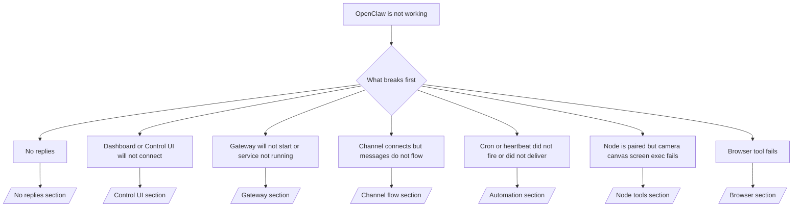

---
read_when:
    - OpenClaw کار نمی‌کند و شما به سریع‌ترین راه برای رفع مشکل نیاز دارید
    - پیش از ورود به راهنماهای عملیاتی عمیق، به یک روند تریاژ نیاز دارید
summary: مرکز عیب‌یابی علائم‌محور برای OpenClaw
title: عیب‌یابی عمومی
x-i18n:
    generated_at: "2026-05-06T09:23:26Z"
    model: gpt-5.5
    provider: openai
    source_hash: 624fa34cda3b440fa9cc636beb3fe6e3608a77a332933fa593097ebc556ac745
    source_path: help/troubleshooting.md
    workflow: 16
---

اگر فقط ۲ دقیقه وقت دارید، از این صفحه به‌عنوان ورودی تریاژ استفاده کنید.

## ۶۰ ثانیهٔ اول

این نردبان دقیق را به‌ترتیب اجرا کنید:

```bash
openclaw status
openclaw status --all
openclaw gateway probe
openclaw gateway status
openclaw doctor
openclaw channels status --probe
openclaw logs --follow
```

خروجی خوب در یک خط:

- `openclaw status` → کانال‌های پیکربندی‌شده را نشان می‌دهد و خطای احراز هویت آشکاری ندارد.
- `openclaw status --all` → گزارش کامل موجود و قابل اشتراک‌گذاری است.
- `openclaw gateway probe` → هدف gateway مورد انتظار قابل دسترسی است (`Reachable: yes`). `Capability: ...` نشان می‌دهد probe چه سطح احراز هویتی را توانسته اثبات کند، و `Read probe: limited - missing scope: operator.read` تشخیص تنزل‌یافته است، نه شکست اتصال.
- `openclaw gateway status` → `Runtime: running`، `Connectivity probe: ok`، و یک خط قابل قبول `Capability: ...`. اگر به اثبات RPC با دامنهٔ read هم نیاز دارید از `--require-rpc` استفاده کنید.
- `openclaw doctor` → خطای مسدودکنندهٔ config/service ندارد.
- `openclaw channels status --probe` → Gateway قابل دسترسی، وضعیت زندهٔ transport را برای هر حساب
  همراه با نتایج probe/audit مانند `works` یا `audit ok` برمی‌گرداند؛ اگر
  Gateway در دسترس نباشد، دستور به خلاصه‌های فقط config برمی‌گردد.
- `openclaw logs --follow` → فعالیت پایدار، بدون خطاهای fatal تکرارشونده.

## Anthropic long context 429

اگر این را دیدید:
`HTTP 429: rate_limit_error: Extra usage is required for long context requests`،
به [/gateway/troubleshooting#anthropic-429-extra-usage-required-for-long-context](/fa/gateway/troubleshooting#anthropic-429-extra-usage-required-for-long-context) بروید.

## backend محلی سازگار با OpenAI مستقیم کار می‌کند اما در OpenClaw شکست می‌خورد

اگر backend محلی یا خودمیزبان شما برای `/v1` به probeهای مستقیم کوچک
`/v1/chat/completions` پاسخ می‌دهد اما در `openclaw infer model run` یا نوبت‌های معمول
agent شکست می‌خورد:

1. اگر خطا اشاره می‌کند که `messages[].content` انتظار string دارد،
   `models.providers.<provider>.models[].compat.requiresStringContent: true` را تنظیم کنید.
2. اگر backend هنوز فقط در نوبت‌های agent OpenClaw شکست می‌خورد،
   `models.providers.<provider>.models[].compat.supportsTools: false` را تنظیم کنید و دوباره تلاش کنید.
3. اگر فراخوانی‌های مستقیم بسیار کوچک هنوز کار می‌کنند اما promptهای بزرگ‌تر OpenClaw باعث crash شدن
   backend می‌شوند، مشکل باقی‌مانده را به‌عنوان محدودیت model/server بالادستی در نظر بگیرید و
   در runbook عمیق ادامه دهید:
   [/gateway/troubleshooting#local-openai-compatible-backend-passes-direct-probes-but-agent-runs-fail](/fa/gateway/troubleshooting#local-openai-compatible-backend-passes-direct-probes-but-agent-runs-fail)

## نصب Plugin با خطای نبود openclaw extensions شکست می‌خورد

اگر نصب با `package.json missing openclaw.extensions` شکست بخورد، بستهٔ Plugin
از ساختار قدیمی‌ای استفاده می‌کند که OpenClaw دیگر نمی‌پذیرد.

در بستهٔ Plugin اصلاح کنید:

1. `openclaw.extensions` را به `package.json` اضافه کنید.
2. ورودی‌ها را به فایل‌های runtime ساخته‌شده اشاره دهید (معمولاً `./dist/index.js`).
3. Plugin را دوباره منتشر کنید و دوباره `openclaw plugins install <package>` را اجرا کنید.

مثال:

```json
{
  "name": "@openclaw/my-plugin",
  "version": "1.2.3",
  "openclaw": {
    "extensions": ["./dist/index.js"]
  }
}
```

مرجع: [معماری Plugin](/fa/plugins/architecture)

## Plugin حاضر است اما به‌دلیل مالکیت مشکوک مسدود شده است

اگر `openclaw doctor`، راه‌اندازی، یا هشدارهای startup نشان دهند:

```text
blocked plugin candidate: suspicious ownership (... uid=1000, expected uid=0 or root)
plugin present but blocked
```

فایل‌های Plugin متعلق به کاربر Unix متفاوتی نسبت به پردازشی هستند که آن‌ها را load می‌کند. config مربوط به Plugin را حذف نکنید. مالکیت فایل را اصلاح کنید یا OpenClaw را با همان کاربری اجرا کنید که مالک دایرکتوری state است.

نصب‌های Docker معمولاً با کاربر `node` (uid `1000`) اجرا می‌شوند. برای setup پیش‌فرض Docker،
bind mountهای میزبان را تعمیر کنید:

```bash
sudo chown -R 1000:1000 /path/to/openclaw-config /path/to/openclaw-workspace
openclaw doctor --fix
```

اگر عمداً OpenClaw را به‌صورت root اجرا می‌کنید، ریشهٔ Plugin مدیریت‌شده را در عوض به
مالکیت root تعمیر کنید:

```bash
sudo chown -R root:root /path/to/openclaw-config/npm
openclaw doctor --fix
```

مستندات عمیق‌تر:

- [مالکیت مسیر Plugin](/fa/tools/plugin#blocked-plugin-path-ownership)
- [مجوزهای Docker](/fa/install/docker#permissions-and-eacces)

## درخت تصمیم



<AccordionGroup>
  <Accordion title="بدون پاسخ">
    ```bash
    openclaw status
    openclaw gateway status
    openclaw channels status --probe
    openclaw pairing list --channel <channel> [--account <id>]
    openclaw logs --follow
    ```

    خروجی خوب شبیه این است:

    - `Runtime: running`
    - `Connectivity probe: ok`
    - `Capability: read-only`، `write-capable`، یا `admin-capable`
    - کانال شما transport را متصل نشان می‌دهد و، در جاهایی که پشتیبانی می‌شود، `works` یا `audit ok` را در `channels status --probe` نشان می‌دهد
    - فرستنده approved به نظر می‌رسد (یا سیاست DM باز/allowlist است)

    امضاهای رایج log:

    - `drop guild message (mention required` → mention gating پیام را در Discord مسدود کرده است.
    - `pairing request` → فرستنده تایید نشده و منتظر تایید pairing در DM است.
    - `blocked` / `allowlist` در logهای کانال → فرستنده، room، یا group فیلتر شده است.

    صفحه‌های عمیق:

    - [/gateway/troubleshooting#no-replies](/fa/gateway/troubleshooting#no-replies)
    - [/channels/troubleshooting](/fa/channels/troubleshooting)
    - [/channels/pairing](/fa/channels/pairing)

  </Accordion>

  <Accordion title="Dashboard یا Control UI وصل نمی‌شود">
    ```bash
    openclaw status
    openclaw gateway status
    openclaw logs --follow
    openclaw doctor
    openclaw channels status --probe
    ```

    خروجی خوب شبیه این است:

    - `Dashboard: http://...` در `openclaw gateway status` نمایش داده می‌شود
    - `Connectivity probe: ok`
    - `Capability: read-only`، `write-capable`، یا `admin-capable`
    - حلقهٔ auth در logها وجود ندارد

    امضاهای رایج log:

    - `device identity required` → کانتکست HTTP/غیرامن نمی‌تواند device auth را کامل کند.
    - `origin not allowed` → `Origin` مرورگر برای هدف Gateway مربوط به Control UI مجاز نیست.
    - `AUTH_TOKEN_MISMATCH` با راهنمایی‌های retry (`canRetryWithDeviceToken=true`) → ممکن است یک retry قابل اعتماد با device-token به‌صورت خودکار رخ دهد.
    - آن retry با cached-token همان مجموعهٔ scope ذخیره‌شده با device token جفت‌شده را دوباره استفاده می‌کند. فراخوان‌های دارای `deviceToken` صریح / `scopes` صریح
      مجموعهٔ scope درخواستی خود را نگه می‌دارند.
    - در مسیر async Tailscale Serve Control UI، تلاش‌های ناموفق برای همان
      `{scope, ip}` پیش از ثبت failure توسط limiter سریالی می‌شوند، بنابراین
      retry بد هم‌زمان دوم می‌تواند از قبل `retry later` نشان دهد.
    - `too many failed authentication attempts (retry later)` از یک origin مرورگر localhost
      → شکست‌های تکراری از همان `Origin` به‌طور موقت lock out می‌شوند؛ یک origin localhost دیگر از bucket جداگانه استفاده می‌کند.
    - `unauthorized` تکراری پس از آن retry → token/password اشتباه، ناهماهنگی auth mode، یا device token جفت‌شدهٔ stale.
    - `gateway connect failed:` → UI به URL/port اشتباه اشاره می‌کند یا Gateway در دسترس نیست.

    صفحه‌های عمیق:

    - [/gateway/troubleshooting#dashboard-control-ui-connectivity](/fa/gateway/troubleshooting#dashboard-control-ui-connectivity)
    - [/web/control-ui](/fa/web/control-ui)
    - [/gateway/authentication](/fa/gateway/authentication)

  </Accordion>

  <Accordion title="Gateway شروع نمی‌شود یا service نصب شده اما اجرا نمی‌شود">
    ```bash
    openclaw status
    openclaw gateway status
    openclaw logs --follow
    openclaw doctor
    openclaw channels status --probe
    ```

    خروجی خوب شبیه این است:

    - `Service: ... (loaded)`
    - `Runtime: running`
    - `Connectivity probe: ok`
    - `Capability: read-only`، `write-capable`، یا `admin-capable`

    امضاهای رایج log:

    - `Gateway start blocked: set gateway.mode=local` یا `existing config is missing gateway.mode` → حالت Gateway برابر remote است، یا فایل config مهر local-mode را ندارد و باید تعمیر شود.
    - `refusing to bind gateway ... without auth` → bind غیر local loopback بدون مسیر معتبر auth برای Gateway (token/password، یا trusted-proxy در جایی که پیکربندی شده باشد).
    - `another gateway instance is already listening` یا `EADDRINUSE` → port از قبل اشغال است.

    صفحه‌های عمیق:

    - [/gateway/troubleshooting#gateway-service-not-running](/fa/gateway/troubleshooting#gateway-service-not-running)
    - [/gateway/background-process](/fa/gateway/background-process)
    - [/gateway/configuration](/fa/gateway/configuration)

  </Accordion>

  <Accordion title="کانال وصل می‌شود اما پیام‌ها جریان پیدا نمی‌کنند">
    ```bash
    openclaw status
    openclaw gateway status
    openclaw logs --follow
    openclaw doctor
    openclaw channels status --probe
    ```

    خروجی خوب شبیه این است:

    - transport کانال متصل است.
    - بررسی‌های pairing/allowlist عبور می‌کنند.
    - mentionها در جاهایی که لازم است تشخیص داده می‌شوند.

    امضاهای رایج log:

    - `mention required` → group mention gating پردازش را مسدود کرده است.
    - `pairing` / `pending` → فرستندهٔ DM هنوز تایید نشده است.
    - `not_in_channel`، `missing_scope`، `Forbidden`، `401/403` → مشکل permission token کانال.

    صفحه‌های عمیق:

    - [/gateway/troubleshooting#channel-connected-messages-not-flowing](/fa/gateway/troubleshooting#channel-connected-messages-not-flowing)
    - [/channels/troubleshooting](/fa/channels/troubleshooting)

  </Accordion>

  <Accordion title="Cron یا Heartbeat اجرا نشد یا تحویل نداد">
    ```bash
    openclaw status
    openclaw gateway status
    openclaw cron status
    openclaw cron list
    openclaw cron runs --id <jobId> --limit 20
    openclaw logs --follow
    ```

    خروجی خوب شبیه این است:

    - `cron.status` فعال بودن را همراه با wake بعدی نشان می‌دهد.
    - `cron runs` ورودی‌های اخیر `ok` را نشان می‌دهد.
    - Heartbeat فعال است و خارج از active hours نیست.

    امضاهای رایج log:

    - `cron: scheduler disabled; jobs will not run automatically` → Cron غیرفعال است.
    - `heartbeat skipped` با `reason=quiet-hours` → خارج از active hours پیکربندی‌شده.
    - `heartbeat skipped` با `reason=empty-heartbeat-file` → `HEARTBEAT.md` وجود دارد اما فقط شامل scaffolding خالی/فقط header است.
    - `heartbeat skipped` با `reason=no-tasks-due` → حالت task در `HEARTBEAT.md` فعال است اما هنوز موعد هیچ‌یک از intervalهای task نرسیده است.
    - `heartbeat skipped` با `reason=alerts-disabled` → همهٔ visibility مربوط به Heartbeat غیرفعال است (`showOk`، `showAlerts`، و `useIndicator` همگی خاموش هستند).
    - `requests-in-flight` → lane اصلی مشغول است؛ wake مربوط به Heartbeat به تعویق افتاده است.
    - `unknown accountId` → حساب هدف تحویل Heartbeat وجود ندارد.

    صفحه‌های عمیق:

    - [/gateway/troubleshooting#cron-and-heartbeat-delivery](/fa/gateway/troubleshooting#cron-and-heartbeat-delivery)
    - [/automation/cron-jobs#troubleshooting](/fa/automation/cron-jobs#troubleshooting)
    - [/gateway/heartbeat](/fa/gateway/heartbeat)

  </Accordion>

  <Accordion title="Node جفت شده اما tool برای camera canvas screen exec شکست می‌خورد">
    ```bash
    openclaw status
    openclaw gateway status
    openclaw nodes status
    openclaw nodes describe --node <idOrNameOrIp>
    openclaw logs --follow
    ```

    خروجی خوب شبیه این است:

    - Node به‌عنوان متصل و جفت‌شده برای role `node` فهرست شده است.
    - Capability برای دستوری که فراخوانی می‌کنید وجود دارد.
    - وضعیت permission برای tool اعطا شده است.

    امضاهای رایج log:

    - `NODE_BACKGROUND_UNAVAILABLE` → برنامه Node را به پیش‌زمینه بیاورید.
    - `*_PERMISSION_REQUIRED` → مجوز سیستم‌عامل رد شده یا موجود نیست.
    - `SYSTEM_RUN_DENIED: approval required` → تأیید exec در انتظار است.
    - `SYSTEM_RUN_DENIED: allowlist miss` → دستور در فهرست مجاز exec نیست.

    صفحه‌های عمیق:

    - [/gateway/troubleshooting#node-paired-tool-fails](/fa/gateway/troubleshooting#node-paired-tool-fails)
    - [/nodes/troubleshooting](/fa/nodes/troubleshooting)
    - [/tools/exec-approvals](/fa/tools/exec-approvals)

  </Accordion>

  <Accordion title="Exec ناگهان تأیید می‌خواهد">
    ```bash
    openclaw config get tools.exec.host
    openclaw config get tools.exec.security
    openclaw config get tools.exec.ask
    openclaw gateway restart
    ```

    چه چیزی تغییر کرده است:

    - اگر `tools.exec.host` تنظیم نشده باشد، مقدار پیش‌فرض `auto` است.
    - وقتی runtime سندباکس فعال باشد، `host=auto` به `sandbox` تبدیل می‌شود؛ در غیر این صورت به `gateway`.
    - `host=auto` فقط مسیریابی است؛ رفتار بدون درخواست «YOLO» از `security=full` به‌همراه `ask=off` روی gateway/node می‌آید.
    - روی `gateway` و `node`، مقدار تنظیم‌نشده `tools.exec.security` به‌صورت پیش‌فرض `full` است.
    - مقدار تنظیم‌نشده `tools.exec.ask` به‌صورت پیش‌فرض `off` است.
    - نتیجه: اگر تأییدها را می‌بینید، یک سیاست محلی میزبان یا مخصوص نشست، exec را از پیش‌فرض‌های فعلی سخت‌گیرانه‌تر کرده است.

    بازیابی رفتار پیش‌فرض فعلی بدون تأیید:

    ```bash
    openclaw config set tools.exec.host gateway
    openclaw config set tools.exec.security full
    openclaw config set tools.exec.ask off
    openclaw gateway restart
    ```

    جایگزین‌های امن‌تر:

    - اگر فقط مسیریابی پایدار میزبان می‌خواهید، فقط `tools.exec.host=gateway` را تنظیم کنید.
    - اگر exec میزبان می‌خواهید اما همچنان می‌خواهید نبودن در فهرست مجاز بازبینی شود، از `security=allowlist` با `ask=on-miss` استفاده کنید.
    - اگر می‌خواهید `host=auto` دوباره به `sandbox` تبدیل شود، حالت سندباکس را فعال کنید.

    امضاهای رایج گزارش:

    - `Approval required.` → دستور منتظر `/approve ...` است.
    - `SYSTEM_RUN_DENIED: approval required` → تأیید exec میزبان Node در انتظار است.
    - `exec host=sandbox requires a sandbox runtime for this session` → انتخاب ضمنی/صریح سندباکس انجام شده، اما حالت سندباکس خاموش است.

    صفحه‌های عمیق:

    - [/tools/exec](/fa/tools/exec)
    - [/tools/exec-approvals](/fa/tools/exec-approvals)
    - [/gateway/security#what-the-audit-checks-high-level](/fa/gateway/security#what-the-audit-checks-high-level)

  </Accordion>

  <Accordion title="ابزار مرورگر ناموفق می‌شود">
    ```bash
    openclaw status
    openclaw gateway status
    openclaw browser status
    openclaw logs --follow
    openclaw doctor
    ```

    خروجی خوب شبیه این است:

    - وضعیت مرورگر `running: true` و یک مرورگر/نمایه انتخاب‌شده را نشان می‌دهد.
    - `openclaw` شروع می‌شود، یا `user` می‌تواند زبانه‌های محلی Chrome را ببیند.

    امضاهای رایج گزارش:

    - `unknown command "browser"` یا `unknown command 'browser'` → `plugins.allow` تنظیم شده و شامل `browser` نیست.
    - `Failed to start Chrome CDP on port` → راه‌اندازی مرورگر محلی ناموفق بود.
    - `browser.executablePath not found` → مسیر باینری پیکربندی‌شده اشتباه است.
    - `browser.cdpUrl must be http(s) or ws(s)` → نشانی CDP پیکربندی‌شده از scheme پشتیبانی‌نشده استفاده می‌کند.
    - `browser.cdpUrl has invalid port` → نشانی CDP پیکربندی‌شده پورت نامعتبر یا خارج از محدوده دارد.
    - `No Chrome tabs found for profile="user"` → نمایه اتصال Chrome MCP هیچ زبانه باز محلی Chrome ندارد.
    - `Remote CDP for profile "<name>" is not reachable` → نقطه پایانی CDP راه‌دور پیکربندی‌شده از این میزبان در دسترس نیست.
    - `Browser attachOnly is enabled ... not reachable` یا `Browser attachOnly is enabled and CDP websocket ... is not reachable` → نمایه فقط-اتصال هیچ هدف CDP زنده‌ای ندارد.
    - overrideهای کهنه viewport / حالت تاریک / locale / آفلاین روی نمایه‌های فقط-اتصال یا CDP راه‌دور → برای بستن نشست کنترل فعال و آزاد کردن وضعیت شبیه‌سازی بدون راه‌اندازی دوباره gateway، `openclaw browser stop --browser-profile <name>` را اجرا کنید.

    صفحه‌های عمیق:

    - [/gateway/troubleshooting#browser-tool-fails](/fa/gateway/troubleshooting#browser-tool-fails)
    - [/tools/browser#missing-browser-command-or-tool](/fa/tools/browser#missing-browser-command-or-tool)
    - [/tools/browser-linux-troubleshooting](/fa/tools/browser-linux-troubleshooting)
    - [/tools/browser-wsl2-windows-remote-cdp-troubleshooting](/fa/tools/browser-wsl2-windows-remote-cdp-troubleshooting)

  </Accordion>

</AccordionGroup>

## مرتبط

- [پرسش‌های متداول](/fa/help/faq) — پرسش‌های پرتکرار
- [عیب‌یابی Gateway](/fa/gateway/troubleshooting) — مشکلات مخصوص Gateway
- [Doctor](/fa/gateway/doctor) — بررسی‌ها و تعمیرهای خودکار سلامت
- [عیب‌یابی کانال](/fa/channels/troubleshooting) — مشکلات اتصال کانال
- [عیب‌یابی خودکارسازی](/fa/automation/cron-jobs#troubleshooting) — مشکلات Cron و Heartbeat
