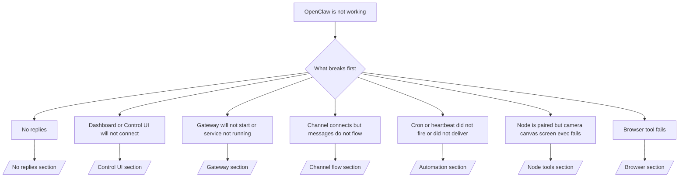

---
read_when:
    - OpenClaw کار نمی‌کند و شما به سریع‌ترین مسیر برای رفع مشکل نیاز دارید
    - پیش از ورود به ران‌بوک‌های عمیق، به یک جریان تریاژ نیاز دارید
summary: مرکز عیب‌یابی مبتنی بر نشانه برای OpenClaw
title: عیب‌یابی عمومی
x-i18n:
    generated_at: "2026-06-27T17:55:38Z"
    model: gpt-5.5
    postprocess_version: locale-links-v1
    provider: openai
    source_hash: ae1236c73e3a5c9237bd81d603e8dca18c595a8bcbb71f5931bfbf2389b342cd
    source_path: help/troubleshooting.md
    workflow: 16
---

اگر فقط ۲ دقیقه وقت دارید، از این صفحه به‌عنوان نقطه ورود تریاژ استفاده کنید.

## ۶۰ ثانیه اول

این دنباله دقیق را به‌ترتیب اجرا کنید:

```bash
openclaw status
openclaw status --all
openclaw gateway probe
openclaw gateway status
openclaw doctor
openclaw channels status --probe
openclaw logs --follow
```

خروجی خوب در یک خط:

- `openclaw status` → کانال‌های پیکربندی‌شده را نشان می‌دهد و خطای آشکار احراز هویت ندارد.
- `openclaw status --all` → گزارش کامل وجود دارد و قابل اشتراک‌گذاری است.
- `openclaw gateway probe` → مقصد مورد انتظار Gateway در دسترس است (`Reachable: yes`). `Capability: ...` به شما می‌گوید probe چه سطح احراز هویتی را توانسته ثابت کند، و `Read probe: limited - missing scope: operator.read` تشخیص تنزل‌یافته است، نه شکست اتصال.
- `openclaw gateway status` → `Runtime: running`، `Connectivity probe: ok`، و یک خط قابل‌قبول `Capability: ...`. اگر به اثبات RPC با محدوده خواندن هم نیاز دارید، از `--require-rpc` استفاده کنید.
- `openclaw doctor` → خطای مسدودکننده پیکربندی/سرویس ندارد.
- `openclaw channels status --probe` → Gateway در دسترس، وضعیت زنده transport برای هر حساب
  به‌همراه نتایج probe/audit مانند `works` یا `audit ok` را برمی‌گرداند؛ اگر
  Gateway در دسترس نباشد، دستور به خلاصه‌های فقط-پیکربندی بازمی‌گردد.
- `openclaw logs --follow` → فعالیت پایدار، بدون خطاهای مهلک تکرارشونده.

## دستیار محدود به نظر می‌رسد یا ابزارها را ندارد

اگر دستیار نمی‌تواند فایل‌ها را بررسی کند، دستورها را اجرا کند، از خودکارسازی مرورگر استفاده کند، یا
ابزارهای مورد انتظار را ببیند، ابتدا پروفایل ابزار مؤثر را بررسی کنید:

```bash
openclaw status
openclaw status --all
openclaw doctor
```

علت‌های رایج:

- `tools.profile: "messaging"` عمداً برای عامل‌های فقط-چت محدود است.
- `tools.profile: "coding"` پروفایل معمول برای گردش‌کارهای مخزن، فایل، shell،
  و runtime است.
- `tools.profile: "full"` گسترده‌ترین مجموعه ابزار را در معرض می‌گذارد و باید
  به عامل‌های مورد اعتماد تحت کنترل اپراتور محدود شود.
- بازنویسی‌های `agents.list[].tools` برای هر عامل می‌توانند پروفایل ریشه را
  برای یک عامل محدودتر یا گسترده‌تر کنند.

پروفایل ابزار ریشه یا هر عامل را تغییر دهید، سپس Gateway را راه‌اندازی مجدد یا reload کنید
و دوباره `openclaw status --all` را اجرا کنید. برای مدل پروفایل
و بازنویسی‌های allow/deny، [ابزارها](/fa/tools) را ببینید.

## زمینه طولانی Anthropic با 429

اگر این را می‌بینید:
`HTTP 429: rate_limit_error: Extra usage is required for long context requests`،
به [/gateway/troubleshooting#anthropic-429-extra-usage-required-for-long-context](/fa/gateway/troubleshooting#anthropic-429-extra-usage-required-for-long-context) بروید.

## بک‌اند محلی سازگار با OpenAI مستقیم کار می‌کند اما در OpenClaw شکست می‌خورد

اگر بک‌اند محلی یا خودمیزبان `/v1` شما به probeهای مستقیم کوچک
`/v1/chat/completions` پاسخ می‌دهد اما در `openclaw infer model run` یا نوبت‌های عادی
عامل شکست می‌خورد:

1. اگر خطا به انتظار رشته برای `messages[].content` اشاره می‌کند،
   `models.providers.<provider>.models[].compat.requiresStringContent: true` را تنظیم کنید.
2. اگر بک‌اند هنوز فقط در نوبت‌های عامل OpenClaw شکست می‌خورد،
   `models.providers.<provider>.models[].compat.supportsTools: false` را تنظیم کنید و دوباره تلاش کنید.
3. اگر فراخوانی‌های مستقیم خیلی کوچک هنوز کار می‌کنند اما promptهای بزرگ‌تر OpenClaw
   بک‌اند را از کار می‌اندازند، مسئله باقی‌مانده را به‌عنوان محدودیت مدل/سرور upstream در نظر بگیرید و
   در runbook عمیق ادامه دهید:
   [/gateway/troubleshooting#local-openai-compatible-backend-passes-direct-probes-but-agent-runs-fail](/fa/gateway/troubleshooting#local-openai-compatible-backend-passes-direct-probes-but-agent-runs-fail)

## نصب Plugin با نبود openclaw extensions شکست می‌خورد

اگر نصب با `package.json missing openclaw.extensions` شکست می‌خورد، بسته Plugin
از شکل قدیمی استفاده می‌کند که OpenClaw دیگر نمی‌پذیرد.

رفع در بسته Plugin:

1. `openclaw.extensions` را به `package.json` اضافه کنید.
2. entryها را به فایل‌های runtime ساخته‌شده اشاره دهید (معمولاً `./dist/index.js`).
3. Plugin را دوباره منتشر کنید و دوباره `openclaw plugins install <package>` را اجرا کنید.

مثال:

```json
{
  "name": "@openclaw/my-plugin",
  "version": "1.2.3",
  "openclaw": {
    "extensions": ["./dist/index.js"]
  }
}
```

مرجع: [معماری Plugin](/fa/plugins/architecture)

## سیاست نصب، نصب یا به‌روزرسانی Plugin را مسدود می‌کند

اگر یک به‌روزرسانی تمام می‌شود اما Pluginها کهنه، غیرفعال هستند، یا پیام‌هایی مانند
`blocked by install policy`، `install policy failed closed`، یا
`Disabled "<plugin>" after plugin update failure` نشان می‌دهند،
`security.installPolicy` را بررسی کنید.

سیاست نصب روی نصب‌ها و به‌روزرسانی‌های Plugin اجرا می‌شود. نسخه‌های Plugin
متعلق به OpenClaw معمولاً همراه با انتشار OpenClaw حرکت می‌کنند، بنابراین یک به‌روزرسانی OpenClaw
ممکن است در همگام‌سازی پس از به‌روزرسانی به به‌روزرسانی‌های متناظر Pluginهای `@openclaw/*` هم نیاز داشته باشد.

از این شکل‌های سیاست گسترده پرهیز کنید مگر اینکه قانون ارتقای متناظر را هم نگهداری کنید:

- ثابت نگه‌داشتن Pluginهای متعلق به OpenClaw روی یک نسخه قدیمی دقیق، مانند مجاز دانستن
  فقط `@openclaw/*@2026.5.3`.
- مسدود کردن فقط بر اساس نوع منبع، مانند هر درخواست Plugin از npm، شبکه، یا
  `request.mode: "update"`.
- اختیاری دانستن دستور سیاست. وقتی `security.installPolicy`
  فعال است، اجراییِ سیاست که وجود ندارد، کند است، خواندنی نیست، یا با مجوز مسدود شده
  به‌صورت fail closed شکست می‌خورد.
- تأیید نسخه‌های Plugin بدون در نظر گرفتن
  `openclawVersion` درخواست سیاست و فراداده نامزد Plugin.

قانون‌های سیاست امن‌تر به‌جای pin کردن یک انتشار واحد برای همیشه، به‌روزرسانی‌های Plugin
مورد اعتماد متعلق به OpenClaw را زمانی که نامزد با میزبان فعلی OpenClaw سازگار است مجاز می‌کنند.
اگر npm را به‌صورت پیش‌فرض مسدود می‌کنید، یک استثنای محدود
برای بسته‌های Plugin یا شناسه‌های Plugin مورد اعتماد `@openclaw/*` که استفاده می‌کنید بسازید. اگر
درخواست‌های نصب و به‌روزرسانی را تفکیک می‌کنید، همان قانون اعتماد را برای
`request.mode: "update"` اعمال کنید.

بازیابی:

```bash
openclaw doctor --deep
openclaw plugins update --all
openclaw status --all
```

اگر سیاست عمداً سخت‌گیرانه است، آن را برای بازه ارتقای مورد اعتماد OpenClaw
شل کنید، `openclaw plugins update --all` را دوباره اجرا کنید، سپس قانون سخت‌گیرانه‌تر را بازگردانید.
اگر یک Plugin پس از شکست به‌روزرسانی غیرفعال شده است، آن را بررسی کنید و فقط
پس از موفقیت به‌روزرسانی دوباره فعالش کنید:

```bash
openclaw plugins inspect <plugin-id> --runtime --json
openclaw plugins enable <plugin-id>
```

مرجع: [سیاست نصب اپراتور](/fa/tools/skills-config#operator-install-policy-securityinstallpolicy)

## Plugin وجود دارد اما به‌دلیل مالکیت مشکوک مسدود شده است

اگر `openclaw doctor`، setup، یا هشدارهای startup نشان می‌دهند:

```text
blocked plugin candidate: suspicious ownership (... uid=1000, expected uid=0 or root)
plugin present but blocked
```

فایل‌های Plugin متعلق به کاربر Unix متفاوتی نسبت به فرایندی هستند که آن‌ها را بارگذاری می‌کند.
پیکربندی Plugin را حذف نکنید. مالکیت فایل را اصلاح کنید یا OpenClaw را به‌عنوان
همان کاربری اجرا کنید که مالک دایرکتوری state است.

نصب‌های Docker معمولاً به‌عنوان `node` (uid `1000`) اجرا می‌شوند. برای setup پیش‌فرض Docker،
bind mountهای میزبان را تعمیر کنید:

```bash
sudo chown -R 1000:1000 /path/to/openclaw-config /path/to/openclaw-workspace
openclaw doctor --fix
```

اگر عمداً OpenClaw را به‌عنوان root اجرا می‌کنید، ریشه Plugin مدیریت‌شده را
به مالکیت root تعمیر کنید:

```bash
sudo chown -R root:root /path/to/openclaw-config/npm
openclaw doctor --fix
```

مستندات عمیق‌تر:

- [مالکیت مسیر Plugin](/fa/tools/plugin#blocked-plugin-path-ownership)
- [مجوزهای Docker](/fa/install/docker#permissions-and-eacces)

## درخت تصمیم



<AccordionGroup>
  <Accordion title="بدون پاسخ">
    ```bash
    openclaw status
    openclaw gateway status
    openclaw channels status --probe
    openclaw pairing list --channel <channel> [--account <id>]
    openclaw logs --follow
    ```

    خروجی خوب شبیه این است:

    - `Runtime: running`
    - `Connectivity probe: ok`
    - `Capability: read-only`، `write-capable`، یا `admin-capable`
    - کانال شما transport را متصل نشان می‌دهد و، در جاهایی که پشتیبانی می‌شود، `works` یا `audit ok` را در `channels status --probe` نشان می‌دهد
    - فرستنده تأییدشده به نظر می‌رسد (یا سیاست DM باز/allowlist است)

    امضاهای رایج log:

    - `drop guild message (mention required` → در Discord، mention gating پیام را مسدود کرده است.
    - `pairing request` → فرستنده تأیید نشده و منتظر تأیید جفت‌سازی DM است.
    - `blocked` / `allowlist` در logهای کانال → فرستنده، اتاق، یا گروه فیلتر شده است.

    صفحات عمیق:

    - [/gateway/troubleshooting#no-replies](/fa/gateway/troubleshooting#no-replies)
    - [/channels/troubleshooting](/fa/channels/troubleshooting)
    - [/channels/pairing](/fa/channels/pairing)

  </Accordion>

  <Accordion title="داشبورد یا رابط کاربری Control متصل نمی‌شود">
    ```bash
    openclaw status
    openclaw gateway status
    openclaw logs --follow
    openclaw doctor
    openclaw channels status --probe
    ```

    خروجی خوب شبیه این است:

    - `Dashboard: http://...` در `openclaw gateway status` نشان داده می‌شود
    - `Connectivity probe: ok`
    - `Capability: read-only`، `write-capable`، یا `admin-capable`
    - هیچ حلقه احراز هویت در logها وجود ندارد

    امضاهای رایج log:

    - `device identity required` → زمینه HTTP/ناامن نمی‌تواند احراز هویت دستگاه را کامل کند.
    - `origin not allowed` → `Origin` مرورگر برای مقصد Gateway رابط کاربری Control
      مجاز نیست.
    - `AUTH_TOKEN_MISMATCH` همراه با راهنمایی‌های تلاش مجدد (`canRetryWithDeviceToken=true`) → ممکن است یک تلاش مجدد مورد اعتماد با device-token به‌صورت خودکار انجام شود.
    - آن تلاش مجدد cached-token، مجموعه scope ذخیره‌شده با device token جفت‌شده را دوباره استفاده می‌کند.
      فراخواننده‌های صریح `deviceToken` / صریح `scopes` مجموعه scope درخواستی خود را
      به‌جای آن حفظ می‌کنند.
    - در مسیر async رابط کاربری Control با Tailscale Serve، تلاش‌های ناموفق برای همان
      `{scope, ip}` پیش از اینکه limiter شکست را ثبت کند سریالی می‌شوند، بنابراین یک
      تلاش مجدد بدِ هم‌زمان دوم می‌تواند از قبل `retry later` را نشان دهد.
    - `too many failed authentication attempts (retry later)` از origin مرورگر localhost
      → شکست‌های تکراری از همان `Origin` به‌طور موقت
      قفل می‌شوند؛ یک origin دیگر localhost از bucket جداگانه استفاده می‌کند.
    - تکرار `unauthorized` پس از آن تلاش مجدد → token/password اشتباه، عدم تطابق حالت احراز هویت، یا device token جفت‌شده کهنه.
    - `gateway connect failed:` → رابط کاربری URL/پورت اشتباه را هدف گرفته یا Gateway در دسترس نیست.

    صفحات عمیق:

    - [/gateway/troubleshooting#dashboard-control-ui-connectivity](/fa/gateway/troubleshooting#dashboard-control-ui-connectivity)
    - [/web/control-ui](/fa/web/control-ui)
    - [/gateway/authentication](/fa/gateway/authentication)

  </Accordion>

  <Accordion title="Gateway شروع نمی‌شود یا سرویس نصب شده اما اجرا نمی‌شود">
    ```bash
    openclaw status
    openclaw gateway status
    openclaw logs --follow
    openclaw doctor
    openclaw channels status --probe
    ```

    خروجی خوب شبیه این است:

    - `Service: ... (loaded)`
    - `Runtime: running`
    - `Connectivity probe: ok`
    - `Capability: read-only`، `write-capable`، یا `admin-capable`

    امضاهای رایج log:

    - `Gateway start blocked: set gateway.mode=local` یا `existing config is missing gateway.mode` → حالت gateway از راه دور است، یا فایل پیکربندی مهر local-mode را ندارد و باید تعمیر شود.
    - `refusing to bind gateway ... without auth` → bind غیر-loopback بدون مسیر معتبر احراز هویت gateway (token/password، یا trusted-proxy در جایی که پیکربندی شده است).
    - `another gateway instance is already listening` یا `EADDRINUSE` → پورت از قبل گرفته شده است.

    صفحات عمیق:

    - [/gateway/troubleshooting#gateway-service-not-running](/fa/gateway/troubleshooting#gateway-service-not-running)
    - [/gateway/background-process](/fa/gateway/background-process)
    - [/gateway/configuration](/fa/gateway/configuration)

  </Accordion>

  <Accordion title="کانال وصل می‌شود اما پیام‌ها جریان پیدا نمی‌کنند">
    ```bash
    openclaw status
    openclaw gateway status
    openclaw logs --follow
    openclaw doctor
    openclaw channels status --probe
    ```

    خروجی مناسب شبیه این است:

    - انتقال کانال متصل است.
    - بررسی‌های جفت‌سازی/فهرست مجاز موفق می‌شوند.
    - در موارد لازم، منشن‌ها شناسایی می‌شوند.

    امضاهای رایج لاگ:

    - `mention required` → گیت‌گذاری منشن گروهی پردازش را مسدود کرده است.
    - `pairing` / `pending` → فرستنده DM هنوز تأیید نشده است.
    - `not_in_channel`, `missing_scope`, `Forbidden`, `401/403` → مشکل توکن مجوز کانال.

    صفحات عمیق:

    - [/gateway/troubleshooting#channel-connected-messages-not-flowing](/fa/gateway/troubleshooting#channel-connected-messages-not-flowing)
    - [/channels/troubleshooting](/fa/channels/troubleshooting)

  </Accordion>

  <Accordion title="Cron یا Heartbeat اجرا نشد یا تحویل نداد">
    ```bash
    openclaw status
    openclaw gateway status
    openclaw cron status
    openclaw cron list
    openclaw cron runs --id <jobId> --limit 20
    openclaw logs --follow
    ```

    خروجی مناسب شبیه این است:

    - `cron.status` فعال بودن را همراه با بیدارباش بعدی نشان می‌دهد.
    - `cron runs` ورودی‌های اخیر `ok` را نشان می‌دهد.
    - Heartbeat فعال است و خارج از ساعات فعال نیست.

    امضاهای رایج لاگ:

    - `cron: scheduler disabled; jobs will not run automatically` → cron غیرفعال است.
    - `heartbeat skipped` با `reason=quiet-hours` → خارج از ساعات فعال پیکربندی‌شده است.
    - `heartbeat skipped` با `reason=empty-heartbeat-file` → `HEARTBEAT.md` وجود دارد اما فقط شامل داربست خالی، نظر، سربرگ، fence، یا چک‌لیست خالی است.
    - `heartbeat skipped` با `reason=no-tasks-due` → حالت وظیفه `HEARTBEAT.md` فعال است اما هنوز موعد هیچ‌کدام از بازه‌های وظیفه نرسیده است.
    - `heartbeat skipped` با `reason=alerts-disabled` → همه قابلیت‌های مشاهده‌پذیری Heartbeat غیرفعال هستند (`showOk`، `showAlerts`، و `useIndicator` همگی خاموش هستند).
    - `requests-in-flight` → مسیر اصلی مشغول است؛ بیدارباش Heartbeat به تعویق افتاد.
    - `unknown accountId` → حساب هدف تحویل Heartbeat وجود ندارد.

    صفحات عمیق:

    - [/gateway/troubleshooting#cron-and-heartbeat-delivery](/fa/gateway/troubleshooting#cron-and-heartbeat-delivery)
    - [/automation/cron-jobs#troubleshooting](/fa/automation/cron-jobs#troubleshooting)
    - [/gateway/heartbeat](/fa/gateway/heartbeat)

  </Accordion>

  <Accordion title="Node جفت شده است اما ابزار camera canvas screen exec شکست می‌خورد">
    ```bash
    openclaw status
    openclaw gateway status
    openclaw nodes status
    openclaw nodes describe --node <idOrNameOrIp>
    openclaw logs --follow
    ```

    خروجی مناسب شبیه این است:

    - Node به‌عنوان متصل و جفت‌شده برای نقش `node` فهرست شده است.
    - قابلیت برای فرمانی که فراخوانی می‌کنید وجود دارد.
    - وضعیت مجوز برای ابزار اعطا شده است.

    امضاهای رایج لاگ:

    - `NODE_BACKGROUND_UNAVAILABLE` → برنامه Node را به پیش‌زمینه بیاورید.
    - `*_PERMISSION_REQUIRED` → مجوز سیستم‌عامل رد شده یا موجود نیست.
    - `SYSTEM_RUN_DENIED: approval required` → تأیید exec در انتظار است.
    - `SYSTEM_RUN_DENIED: allowlist miss` → فرمان در فهرست مجاز exec نیست.

    صفحات عمیق:

    - [/gateway/troubleshooting#node-paired-tool-fails](/fa/gateway/troubleshooting#node-paired-tool-fails)
    - [/nodes/troubleshooting](/fa/nodes/troubleshooting)
    - [/tools/exec-approvals](/fa/tools/exec-approvals)

  </Accordion>

  <Accordion title="Exec ناگهان درخواست تأیید می‌کند">
    ```bash
    openclaw config get tools.exec.host
    openclaw config get tools.exec.security
    openclaw config get tools.exec.ask
    openclaw gateway restart
    ```

    چه چیزی تغییر کرده است:

    - اگر `tools.exec.host` تنظیم نشده باشد، مقدار پیش‌فرض `auto` است.
    - وقتی یک runtime سندباکس فعال باشد، `host=auto` به `sandbox` resolve می‌شود؛ در غیر این صورت به `gateway`.
    - `host=auto` فقط مسیریابی است؛ رفتار بدون prompt «YOLO» از `security=full` به‌علاوه `ask=off` روی gateway/node می‌آید.
    - روی `gateway` و `node`، مقدار تنظیم‌نشده `tools.exec.security` به‌طور پیش‌فرض `full` است.
    - مقدار تنظیم‌نشده `tools.exec.ask` به‌طور پیش‌فرض `off` است.
    - نتیجه: اگر تأییدها را می‌بینید، یک سیاست میزبان‌محلی یا مخصوص نشست exec را از پیش‌فرض‌های فعلی سخت‌گیرانه‌تر کرده است.

    بازیابی رفتار بدون تأیید پیش‌فرض فعلی:

    ```bash
    openclaw config set tools.exec.host gateway
    openclaw config set tools.exec.security full
    openclaw config set tools.exec.ask off
    openclaw gateway restart
    ```

    جایگزین‌های امن‌تر:

    - اگر فقط مسیریابی پایدار میزبان می‌خواهید، فقط `tools.exec.host=gateway` را تنظیم کنید.
    - اگر exec میزبان را می‌خواهید اما همچنان می‌خواهید موارد خارج از فهرست مجاز بازبینی شوند، از `security=allowlist` همراه با `ask=on-miss` استفاده کنید.
    - اگر می‌خواهید `host=auto` دوباره به `sandbox` resolve شود، حالت سندباکس را فعال کنید.

    امضاهای رایج لاگ:

    - `Approval required.` → فرمان منتظر `/approve ...` است.
    - `SYSTEM_RUN_DENIED: approval required` → تأیید exec میزبان Node در انتظار است.
    - `exec host=sandbox requires a sandbox runtime for this session` → انتخاب ضمنی/صریح سندباکس انجام شده اما حالت سندباکس خاموش است.

    صفحات عمیق:

    - [/tools/exec](/fa/tools/exec)
    - [/tools/exec-approvals](/fa/tools/exec-approvals)
    - [/gateway/security#what-the-audit-checks-high-level](/fa/gateway/security#what-the-audit-checks-high-level)

  </Accordion>

  <Accordion title="ابزار مرورگر شکست می‌خورد">
    ```bash
    openclaw status
    openclaw gateway status
    openclaw browser status
    openclaw logs --follow
    openclaw doctor
    ```

    خروجی مناسب شبیه این است:

    - وضعیت مرورگر `running: true` و یک مرورگر/پروفایل انتخاب‌شده را نشان می‌دهد.
    - `openclaw` شروع می‌شود، یا `user` می‌تواند زبانه‌های Chrome محلی را ببیند.

    امضاهای رایج لاگ:

    - `unknown command "browser"` یا `unknown command 'browser'` → `plugins.allow` تنظیم شده و شامل `browser` نیست.
    - `Failed to start Chrome CDP on port` → راه‌اندازی مرورگر محلی شکست خورد.
    - `browser.executablePath not found` → مسیر باینری پیکربندی‌شده اشتباه است.
    - `browser.cdpUrl must be http(s) or ws(s)` → URL پیکربندی‌شده CDP از طرح پشتیبانی‌نشده استفاده می‌کند.
    - `browser.cdpUrl has invalid port` → URL پیکربندی‌شده CDP پورت نامعتبر یا خارج از محدوده دارد.
    - `No Chrome tabs found for profile="user"` → پروفایل اتصال Chrome MCP هیچ زبانه Chrome محلی بازی ندارد.
    - `Remote CDP for profile "<name>" is not reachable` → نقطه پایانی CDP راه دور پیکربندی‌شده از این میزبان در دسترس نیست.
    - `Browser attachOnly is enabled ... not reachable` یا `Browser attachOnly is enabled and CDP websocket ... is not reachable` → پروفایل فقط-اتصال هیچ هدف CDP زنده‌ای ندارد.
    - overrideهای stale مربوط به viewport / dark-mode / locale / offline روی پروفایل‌های فقط-اتصال یا CDP راه دور → `openclaw browser stop --browser-profile <name>` را اجرا کنید تا نشست کنترل فعال بسته شود و وضعیت شبیه‌سازی بدون راه‌اندازی دوباره Gateway آزاد شود.

    صفحات عمیق:

    - [/gateway/troubleshooting#browser-tool-fails](/fa/gateway/troubleshooting#browser-tool-fails)
    - [/tools/browser#missing-browser-command-or-tool](/fa/tools/browser#missing-browser-command-or-tool)
    - [/tools/browser-linux-troubleshooting](/fa/tools/browser-linux-troubleshooting)
    - [/tools/browser-wsl2-windows-remote-cdp-troubleshooting](/fa/tools/browser-wsl2-windows-remote-cdp-troubleshooting)

  </Accordion>

</AccordionGroup>

## مرتبط

- [پرسش‌های متداول](/fa/help/faq) — پرسش‌های رایج
- [عیب‌یابی Gateway](/fa/gateway/troubleshooting) — مشکلات مخصوص Gateway
- [Doctor](/fa/gateway/doctor) — بررسی‌های سلامت و تعمیرات خودکار
- [عیب‌یابی کانال](/fa/channels/troubleshooting) — مشکلات اتصال کانال
- [عیب‌یابی اتوماسیون](/fa/automation/cron-jobs#troubleshooting) — مشکلات cron و Heartbeat
