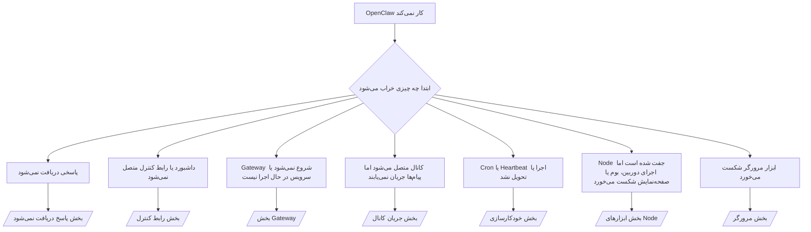

---
read_when:
    - OpenClaw کار نمی‌کند و شما به سریع‌ترین راه برای رفع مشکل نیاز دارید
    - پیش از ورود به دستورالعمل‌های عملیاتی عمیق، به یک فرایند تریاژ نیاز دارید
summary: مرکز عیب‌یابی OpenClaw بر اساس نشانه‌ها
title: عیب‌یابی عمومی
x-i18n:
    generated_at: "2026-07-12T10:13:51Z"
    model: gpt-5.6
    postprocess_version: locale-links-v1
    provider: openai
    source_hash: db50e0cdf4d11f3aa6196be445358d904a2b9c40c89243f1b124c77167f6dd85
    source_path: help/troubleshooting.md
    workflow: 16
---

درگاه نخست عیب‌یابی. در ۲ دقیقه به تشخیص برسید، سپس به صفحهٔ تخصصی بروید.

## ۶۰ ثانیهٔ نخست

این مراحل را به‌ترتیب اجرا کنید:

```bash
openclaw status
openclaw status --all
openclaw gateway probe
openclaw gateway status
openclaw doctor
openclaw channels status --probe
openclaw logs --follow
```

خروجی مطلوب، برای هر مورد یک خط:

- `openclaw status` کانال‌های پیکربندی‌شده را بدون خطای احراز هویت نشان می‌دهد.
- `openclaw status --all` گزارشی کامل و قابل‌اشتراک‌گذاری تولید می‌کند.
- `openclaw gateway probe` مقدار `Reachable: yes` را نشان می‌دهد. `Capability: ...` سطح احراز هویتی است که کاوشگر اثبات کرده است؛ `Read probe: limited - missing scope: operator.read` به‌معنای محدود بودن اطلاعات عیب‌یابی است، نه شکست اتصال.
- `openclaw gateway status` مقادیر `Runtime: running`، `Connectivity probe: ok` و یک `Capability: ...` معقول را نشان می‌دهد. برای الزام به اثبات RPC با دامنهٔ خواندن نیز `--require-rpc` را اضافه کنید.
- `openclaw doctor` هیچ خطای مسدودکننده‌ای در پیکربندی یا سرویس گزارش نمی‌کند.
- هنگامی که Gateway در دسترس باشد، `openclaw channels status --probe` وضعیت زندهٔ انتقال را برای هر حساب (`works` / `audit ok`) برمی‌گرداند؛ در غیر این صورت، به خلاصه‌های صرفاً مبتنی بر پیکربندی برمی‌گردد.
- `openclaw logs --follow` فعالیتی پایدار و بدون تکرار خطاهای مهلک نشان می‌دهد.

## دستیار محدود به نظر می‌رسد یا ابزارهایی ندارد

پروفایل مؤثر ابزار را بررسی کنید:

```bash
openclaw status
openclaw status --all
openclaw doctor
```

علت‌های رایج:

- `tools.profile: "minimal"` فقط `session_status` را مجاز می‌کند.
- `tools.profile: "messaging"` محدود است و برای عامل‌های صرفاً گفت‌وگویی در نظر گرفته شده است.
- `tools.profile: "coding"` پیش‌فرض پیکربندی‌های محلی جدید است (کار با مخزن، فایل، پوسته و زمان اجرا).
- `tools.profile: "full"` محدودیت‌های پروفایل را حذف می‌کند؛ استفاده از آن را به عامل‌های مورداعتماد و تحت کنترل اپراتور محدود کنید.
- تنظیمات `agents.list[].tools` برای هر عامل، پروفایل ریشه را فقط برای همان عامل محدودتر یا گسترده‌تر می‌کند.

پروفایل را تغییر دهید، Gateway را راه‌اندازی مجدد یا بازبارگذاری کنید، سپس دوباره با `openclaw status --all` بررسی کنید. جدول کامل پروفایل‌ها و گروه‌ها: [پروفایل‌های ابزار](/fa/gateway/config-tools#tool-profiles).

## خطای 429 در زمینهٔ طولانی Anthropic

`HTTP 429: rate_limit_error: Extra usage is required for long context requests`
← [الزام مصرف اضافی Anthropic 429 برای زمینهٔ طولانی](/fa/gateway/troubleshooting#anthropic-429-extra-usage-required-for-long-context).

## بک‌اند محلی سازگار با OpenAI مستقیماً کار می‌کند، اما در OpenClaw شکست می‌خورد

بک‌اند محلی یا خودمیزبان `/v1` شما به کاوش‌های مستقیم `/v1/chat/completions` پاسخ می‌دهد، اما در `openclaw infer model run` یا نوبت‌های عادی عامل شکست می‌خورد:

1. اگر خطا اشاره می‌کند که `messages[].content` باید رشته باشد، `models.providers.<provider>.models[].compat.requiresStringContent: true` را تنظیم کنید.
2. اگر همچنان فقط در نوبت‌های عامل OpenClaw شکست می‌خورد، `models.providers.<provider>.models[].compat.supportsTools: false` را تنظیم کرده و دوباره تلاش کنید.
3. اگر فراخوانی‌های مستقیم کوچک کار می‌کنند، اما درخواست‌های بزرگ‌تر OpenClaw بک‌اند را از کار می‌اندازند، مشکل از محدودیت مدل یا سرور بالادستی است، نه نقص OpenClaw. ادامه را در [بک‌اند محلی سازگار با OpenAI از کاوش‌های مستقیم عبور می‌کند، اما اجرای عامل شکست می‌خورد](/fa/gateway/troubleshooting#local-openai-compatible-backend-passes-direct-probes-but-agent-runs-fail) ببینید.

## نصب Plugin به‌دلیل نبود افزونه‌های openclaw شکست می‌خورد

`package.json missing openclaw.extensions` یعنی بستهٔ Plugin از ساختاری استفاده می‌کند که OpenClaw دیگر نمی‌پذیرد.

اصلاح در بستهٔ Plugin:

1. `openclaw.extensions` را به `package.json` اضافه کنید و آن را به فایل‌های ساخته‌شدهٔ زمان اجرا (معمولاً `./dist/index.js`) ارجاع دهید.
2. بسته را دوباره منتشر کنید، سپس مجدداً `openclaw plugins install <package>` را اجرا کنید.

```json
{
  "name": "@openclaw/my-plugin",
  "version": "1.2.3",
  "openclaw": {
    "extensions": ["./dist/index.js"]
  }
}
```

مرجع: [معماری Plugin](/fa/plugins/architecture)

## سیاست نصب، نصب یا به‌روزرسانی Plugin را مسدود می‌کند

به‌روزرسانی تمام می‌شود، اما Pluginها قدیمی یا غیرفعال‌اند، یا `blocked by install policy`، `install policy failed closed` یا `Disabled "<plugin>" after plugin update failure` را نشان می‌دهند: `security.installPolicy` را بررسی کنید.

سیاست نصب هنگام نصب و به‌روزرسانی Pluginها اجرا می‌شود. نسخه‌های Pluginهای `@openclaw/*` معمولاً همراه با انتشار OpenClaw تغییر می‌کنند؛ بنابراین به‌روزرسانی OpenClaw ممکن است هنگام همگام‌سازی پس از به‌روزرسانی، به به‌روزرسانی متناظر Plugin نیاز داشته باشد.

از این شکل‌های سیاستی پرهیز کنید، مگر اینکه قاعدهٔ ارتقای متناظر را نیز نگهداری کنید:

- ثابت نگه‌داشتن Pluginهای متعلق به OpenClaw روی یک نسخهٔ قدیمی دقیق (برای مثال، فقط `@openclaw/*@2026.5.3`).
- مسدودسازی صرفاً بر اساس نوع منبع (همهٔ درخواست‌های npm، شبکه یا `request.mode: "update"`).
- اختیاری دانستن فرمان سیاست: وقتی `security.installPolicy` فعال است، نبودن، کند بودن، ناخوانا بودن یا مسدود بودن مجوزهای فایل اجرایی سیاست، به رد ایمن عملیات منجر می‌شود.
- تأیید نسخه‌ها بدون بررسی `openclawVersion` درخواست در برابر فرادادهٔ نامزد Plugin.

به‌جای ثابت نگه‌داشتن همیشگی یک انتشار، قواعدی را ترجیح دهید که به‌روزرسانی‌های مورداعتماد `@openclaw/*` و سازگار با میزبان کنونی را مجاز کنند. اگر npm را به‌طور پیش‌فرض مسدود می‌کنید، برای شناسه‌های Plugin مورد استفادهٔ خود استثنایی محدود اضافه کنید و همان قاعدهٔ اعتماد نصب‌ها را برای `request.mode: "update"` نیز اعمال کنید.

بازیابی:

```bash
openclaw doctor --deep
openclaw plugins update --all
openclaw status --all
```

اگر سیاست عمداً سخت‌گیرانه است، آن را برای بازهٔ ارتقای مورداعتماد موقتاً آسان‌تر کنید، `openclaw plugins update --all` را دوباره اجرا کنید و سپس قاعدهٔ سخت‌گیرانه‌تر را بازگردانید. اگر شکست به‌روزرسانی یک Plugin را غیرفعال کرده است، پیش از فعال‌سازی مجدد آن را بررسی کنید:

```bash
openclaw plugins inspect <plugin-id> --runtime --json
openclaw plugins enable <plugin-id>
```

مرجع: [سیاست نصب اپراتور](/fa/tools/skills-config#operator-install-policy-securityinstallpolicy)

## Plugin موجود است، اما به‌دلیل مالکیت مشکوک مسدود شده است

هشدارهای `openclaw doctor`، راه‌اندازی اولیه یا شروع به کار، این موارد را نشان می‌دهند:

```text
blocked plugin candidate: suspicious ownership (... uid=1000, expected uid=0 or root)
plugin present but blocked
```

فایل‌های Plugin متعلق به کاربر یونیکس متفاوتی نسبت به فرایندی هستند که آن‌ها را بارگذاری می‌کند. پیکربندی Plugin را حذف نکنید؛ مالکیت فایل‌ها را اصلاح کنید یا OpenClaw را با همان کاربری اجرا کنید که مالک پوشهٔ وضعیت است.

نصب‌های Docker با کاربر `node` و شناسهٔ `1000` اجرا می‌شوند. اتصال‌های میزبان را اصلاح کنید:

```bash
sudo chown -R 1000:1000 /path/to/openclaw-config /path/to/openclaw-workspace
openclaw doctor --fix
```

اگر عمداً OpenClaw را با کاربر root اجرا می‌کنید، به‌جای آن ریشهٔ مدیریت‌شدهٔ Plugin را اصلاح کنید:

```bash
sudo chown -R root:root /path/to/openclaw-config/npm
openclaw doctor --fix
```

مستندات تفصیلی‌تر: [مالکیت مسیر Plugin مسدودشده](/fa/tools/plugin#blocked-plugin-path-ownership)، [Docker: مجوزها و EACCES](/fa/install/docker#shell-helpers-optional)

## درخت تصمیم



<AccordionGroup>
  <Accordion title="پاسخی دریافت نمی‌شود">
    ```bash
    openclaw status
    openclaw gateway status
    openclaw channels status --probe
    openclaw pairing list --channel <channel> [--account <id>]
    openclaw logs --follow
    ```

    خروجی مطلوب:

    - `Runtime: running`
    - `Connectivity probe: ok`
    - `Capability: read-only`، `write-capable` یا `admin-capable`
    - کانال اتصال انتقال را نشان می‌دهد و در صورت پشتیبانی، در `channels status --probe` مقدار `works` یا `audit ok` را نمایش می‌دهد
    - فرستنده تأیید شده است (یا سیاست پیام مستقیم باز یا مبتنی بر فهرست مجاز است)

    نشانه‌های گزارش:

    - `drop guild message (mention required` ← الزام اشاره در Discord پیام را مسدود کرده است.
    - `pairing request` ← فرستنده تأیید نشده و منتظر تأیید جفت‌سازی پیام مستقیم است.
    - `blocked` / `allowlist` در گزارش‌های کانال ← فرستنده، اتاق یا گروه فیلتر شده است.

    صفحات تفصیلی: [پاسخی دریافت نمی‌شود](/fa/gateway/troubleshooting#no-replies)، [عیب‌یابی کانال](/fa/channels/troubleshooting)، [جفت‌سازی](/fa/channels/pairing)

  </Accordion>

  <Accordion title="داشبورد یا رابط کنترل متصل نمی‌شود">
    ```bash
    openclaw status
    openclaw gateway status
    openclaw logs --follow
    openclaw doctor
    openclaw channels status --probe
    ```

    خروجی مطلوب:

    - `Dashboard: http://...` در `openclaw gateway status` نشان داده می‌شود
    - `Connectivity probe: ok`
    - `Capability: read-only`، `write-capable` یا `admin-capable`
    - هیچ حلقهٔ احراز هویتی در گزارش‌ها وجود ندارد

    نشانه‌های گزارش:

    - `device identity required` ← زمینهٔ HTTP یا ناامن نمی‌تواند احراز هویت دستگاه را تکمیل کند.
    - `origin not allowed` ← مقدار `Origin` مرورگر برای مقصد Gateway رابط کنترل مجاز نیست.
    - `AUTH_TOKEN_MISMATCH` همراه با `canRetryWithDeviceToken=true` ← ممکن است یک تلاش مجدد با توکن دستگاه مورداعتماد به‌طور خودکار انجام شود و دامنه‌های ذخیره‌شدهٔ توکن جفت‌شده را دوباره استفاده کند.
    - تکرار `unauthorized` پس از آن تلاش مجدد ← توکن یا گذرواژه نادرست است، حالت احراز هویت تطابق ندارد یا توکن دستگاه جفت‌شده قدیمی است.
    - `too many failed authentication attempts (retry later)` ← شکست‌های مکرر از `Origin` همان مرورگر موقتاً مسدود شده‌اند؛ مبدأهای دیگر localhost از سهمیه‌های جداگانه استفاده می‌کنند. برای جزئیات تلاش‌های مجدد هم‌زمان Tailscale Serve، [اتصال داشبورد/رابط کنترل](/fa/gateway/troubleshooting#dashboard-control-ui-connectivity) را ببینید.
    - `gateway connect failed:` ← رابط کاربری URL یا درگاه اشتباه را هدف گرفته، یا Gateway در دسترس نیست.

    صفحات تفصیلی: [اتصال داشبورد/رابط کنترل](/fa/gateway/troubleshooting#dashboard-control-ui-connectivity)، [رابط کنترل](/fa/web/control-ui)، [احراز هویت](/fa/gateway/authentication)

  </Accordion>

  <Accordion title="Gateway شروع نمی‌شود یا سرویس نصب شده اما در حال اجرا نیست">
    ```bash
    openclaw status
    openclaw gateway status
    openclaw logs --follow
    openclaw doctor
    openclaw channels status --probe
    ```

    خروجی مطلوب:

    - `Service: ... (loaded)`
    - `Runtime: running`
    - `Connectivity probe: ok`
    - `Capability: read-only`، `write-capable` یا `admin-capable`

    نشانه‌های گزارش:

    - `Gateway start blocked: set gateway.mode=local` یا `existing config is missing gateway.mode` ← حالت Gateway دوردست است، یا پیکربندی فاقد نشان حالت محلی است و باید اصلاح شود.
    - `refusing to bind gateway ... without auth` ← اتصال به آدرسی غیر از local loopback بدون مسیر معتبر احراز هویت (توکن/گذرواژه یا پراکسی مورداعتماد در صورت پیکربندی).
    - `another gateway instance is already listening` یا `EADDRINUSE` ← درگاه از قبل اشغال شده است.

    صفحات تفصیلی: [سرویس Gateway در حال اجرا نیست](/fa/gateway/troubleshooting#gateway-service-not-running)، [فرایند پس‌زمینه](/fa/gateway/background-process)، [پیکربندی](/fa/gateway/configuration)

  </Accordion>

  <Accordion title="کانال متصل می‌شود اما پیام‌ها جریان نمی‌یابند">
    ```bash
    openclaw status
    openclaw gateway status
    openclaw logs --follow
    openclaw doctor
    openclaw channels status --probe
    ```

    خروجی مطلوب:

    - انتقال کانال متصل است.
    - بررسی‌های جفت‌سازی و فهرست مجاز موفق‌اند.
    - در موارد الزامی، اشاره‌ها شناسایی می‌شوند.

    نشانه‌های گزارش:

    - `mention required` ← الزام اشاره در گروه، پردازش را مسدود کرده است.
    - `pairing` / `pending` ← فرستندهٔ پیام مستقیم هنوز تأیید نشده است.
    - `not_in_channel`، `missing_scope`، `Forbidden`، `401/403` ← مشکلی در توکن مجوز کانال وجود دارد.

    صفحات تفصیلی: [کانال متصل است، اما پیام‌ها جریان نمی‌یابند](/fa/gateway/troubleshooting#channel-connected-messages-not-flowing)، [عیب‌یابی کانال](/fa/channels/troubleshooting)

  </Accordion>

  <Accordion title="Cron یا Heartbeat اجرا یا تحویل نشد">
    ```bash
    openclaw status
    openclaw gateway status
    openclaw cron status
    openclaw cron list
    openclaw cron runs --id <jobId> --limit 20
    openclaw logs --follow
    ```

    خروجی مطلوب:

    - `cron status` فعال بودن زمان‌بند و زمان بیداری بعدی را نشان می‌دهد.
    - `cron runs` ورودی‌های موفق `ok` اخیر را نشان می‌دهد.
    - Heartbeat فعال و در محدودهٔ ساعات فعال است.

    نشانه‌های گزارش:

    - `cron: scheduler disabled; jobs will not run automatically` ← Cron غیرفعال است.
    - دلیل `quiet-hours` برای `heartbeat skipped` ← خارج از ساعات فعالیت پیکربندی‌شده.
    - دلیل `empty-heartbeat-file` برای `heartbeat skipped` ← فایل `HEARTBEAT.md` وجود دارد، اما فقط شامل داربست خالی، توضیح، سرصفحه، حصار کد یا چک‌لیست خالی است.
    - دلیل `no-tasks-due` برای `heartbeat skipped` ← حالت وظیفه فعال است، اما هنوز موعد هیچ بازهٔ وظیفه‌ای نرسیده است.
    - دلیل `alerts-disabled` برای `heartbeat skipped` ← گزینه‌های `showOk`، `showAlerts` و `useIndicator` همگی خاموش‌اند.
    - `requests-in-flight` ← مسیر اصلی مشغول است؛ بیدارسازی Heartbeat به تعویق افتاد.
    - `unknown accountId` ← حساب مقصد تحویل Heartbeat وجود ندارد.

    صفحات تفصیلی: [تحویل Cron و Heartbeat](/fa/gateway/troubleshooting#cron-and-heartbeat-delivery)، [وظایف زمان‌بندی‌شده: عیب‌یابی](/fa/automation/cron-jobs#troubleshooting)، [Heartbeat](/fa/gateway/heartbeat)

  </Accordion>

  <Accordion title="Node جفت شده است، اما ابزار دوربین، بوم، صفحه‌نمایش یا اجرا کار نمی‌کند">
    ```bash
    openclaw status
    openclaw gateway status
    openclaw nodes status
    openclaw nodes describe --node <idOrNameOrIp>
    openclaw logs --follow
    ```

    خروجی مناسب:

    - Node برای نقش `node` به‌صورت متصل و جفت‌شده فهرست شده است.
    - قابلیت لازم برای فرمانی که فراخوانی می‌کنید وجود دارد.
    - وضعیت مجوز برای ابزار اعطاشده است.

    نشانه‌های گزارش:

    - `NODE_BACKGROUND_UNAVAILABLE` ← برنامهٔ Node را به پیش‌زمینه بیاورید.
    - `*_PERMISSION_REQUIRED` ← مجوز سیستم‌عامل رد شده یا وجود ندارد.
    - `SYSTEM_RUN_DENIED: approval required` ← تأیید اجرا در انتظار است.
    - `SYSTEM_RUN_DENIED: allowlist miss` ← فرمان در فهرست مجاز اجرا نیست.

    صفحات تفصیلی: [Node جفت شده است، ابزار کار نمی‌کند](/fa/gateway/troubleshooting#node-paired-tool-fails)، [عیب‌یابی Node](/fa/nodes/troubleshooting)، [تأییدهای اجرا](/fa/tools/exec-approvals)

  </Accordion>

  <Accordion title="اجرا ناگهان تأیید درخواست می‌کند">
    ```bash
    openclaw config get tools.exec.host
    openclaw config get tools.exec.security
    openclaw config get tools.exec.ask
    openclaw gateway restart
    ```

    چه چیزی تغییر کرده است:

    - مقدار تنظیم‌نشدهٔ `tools.exec.host` به‌طور پیش‌فرض `auto` است که هنگام فعال بودن محیط اجرای سندباکس به `sandbox` و در غیر این صورت به `gateway` تبدیل می‌شود.
    - `host=auto` فقط مسیریابی را انجام می‌دهد؛ رفتار بدون درخواست تأیید در gateway یا Node از ترکیب `security=full` و `ask=off` ناشی می‌شود.
    - مقدار تنظیم‌نشدهٔ `tools.exec.security` در `gateway`/`node` به‌طور پیش‌فرض `full` است.
    - مقدار تنظیم‌نشدهٔ `tools.exec.ask` به‌طور پیش‌فرض `off` است.
    - اگر درخواست‌های تأیید را مشاهده می‌کنید، یکی از خط‌مشی‌های محلی میزبان یا مختص نشست، اجرای فرمان را نسبت به این پیش‌فرض‌ها محدودتر کرده است.

    بازیابی پیش‌فرض‌های فعلی بدون تأیید:

    ```bash
    openclaw config set tools.exec.host gateway
    openclaw config set tools.exec.security full
    openclaw config set tools.exec.ask off
    openclaw gateway restart
    ```

    گزینه‌های امن‌تر:

    - برای مسیریابی پایدار میزبان، فقط `tools.exec.host=gateway` را تنظیم کنید.
    - برای اجرای فرمان روی میزبان همراه با بازبینی هنگام نبودن فرمان در فهرست مجاز، از `security=allowlist` با `ask=on-miss` استفاده کنید.
    - حالت سندباکس را فعال کنید تا `host=auto` دوباره به `sandbox` تبدیل شود.

    نشانه‌های گزارش:

    - `Approval required.` ← فرمان در انتظار `/approve ...` است.
    - `SYSTEM_RUN_DENIED: approval required` ← تأیید اجرای فرمان روی میزبان Node در انتظار است.
    - `exec host=sandbox requires a sandbox runtime for this session` ← سندباکس به‌صورت ضمنی یا صریح انتخاب شده است، اما حالت سندباکس خاموش است.

    صفحات تفصیلی: [اجرا](/fa/tools/exec)، [تأییدهای اجرا](/fa/tools/exec-approvals)، [امنیت: ممیزی چه مواردی را بررسی می‌کند](/fa/gateway/security#what-the-audit-checks-high-level)

  </Accordion>

  <Accordion title="ابزار مرورگر کار نمی‌کند">
    ```bash
    openclaw status
    openclaw gateway status
    openclaw browser status
    openclaw logs --follow
    openclaw doctor
    ```

    خروجی مناسب:

    - وضعیت مرورگر `running: true` و مرورگر/نمایهٔ انتخاب‌شده‌ای را نشان می‌دهد.
    - نمایهٔ `openclaw` راه‌اندازی می‌شود، یا نمایهٔ `user` زبانه‌های محلی Chrome را می‌بیند.

    نشانه‌های گزارش:

    - `unknown command "browser"` ← مقدار `plugins.allow` تنظیم شده است و `browser` را شامل نمی‌شود.
    - `Failed to start Chrome CDP on port` ← راه‌اندازی مرورگر محلی ناموفق بود.
    - `browser.executablePath not found` ← مسیر پیکربندی‌شدهٔ فایل اجرایی نادرست است.
    - `browser.cdpUrl must be http(s) or ws(s)` ← نشانی CDP پیکربندی‌شده از طرح پشتیبانی‌نشده‌ای استفاده می‌کند.
    - `browser.cdpUrl has invalid port` ← نشانی CDP پیکربندی‌شده دارای درگاه نامعتبر یا خارج از محدوده است.
    - `No Chrome tabs found for profile="user"` ← نمایهٔ اتصال Chrome MCP هیچ زبانهٔ محلی باز Chrome ندارد.
    - `Remote CDP for profile "<name>" is not reachable` ← نقطهٔ پایانی CDP راه‌دور پیکربندی‌شده از این میزبان قابل دسترسی نیست.
    - `Browser attachOnly is enabled ... not reachable` ← نمایهٔ صرفاً اتصال، هیچ مقصد CDP فعالی ندارد.
    - بازنویسی‌های قدیمی محدودهٔ دید/حالت تاریک/زبان/آفلاین در نمایه‌های صرفاً اتصال یا CDP راه‌دور ← برای بستن نشست کنترل و آزادسازی وضعیت شبیه‌سازی بدون راه‌اندازی مجدد Gateway، فرمان `openclaw browser stop --browser-profile <name>` را اجرا کنید.

    صفحات تفصیلی: [ابزار مرورگر کار نمی‌کند](/fa/gateway/troubleshooting#browser-tool-fails)، [فرمان یا ابزار مرورگر وجود ندارد](/fa/tools/browser#missing-browser-command-or-tool)، [مرورگر: عیب‌یابی Linux](/fa/tools/browser-linux-troubleshooting)، [مرورگر: عیب‌یابی CDP راه‌دور در WSL2/Windows](/fa/tools/browser-wsl2-windows-remote-cdp-troubleshooting)

  </Accordion>

</AccordionGroup>

## مرتبط

- [پرسش‌های متداول](/fa/help/faq) — پرسش‌های پرتکرار
- [عیب‌یابی Gateway](/fa/gateway/troubleshooting) — مشکلات مختص Gateway
- [Doctor](/fa/gateway/doctor) — بررسی‌ها و تعمیرات خودکار سلامت
- [عیب‌یابی کانال](/fa/channels/troubleshooting) — مشکلات اتصال کانال
- [وظایف زمان‌بندی‌شده: عیب‌یابی](/fa/automation/cron-jobs#troubleshooting) — مشکلات Cron و Heartbeat
