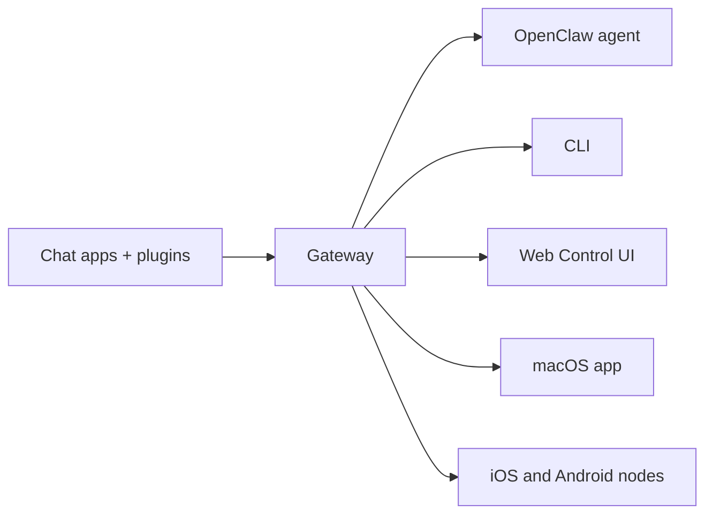

---
read_when:
    - معرفی OpenClaw به تازه‌واردان
summary: OpenClaw یک Gateway چندکاناله برای عامل‌های هوش مصنوعی است که روی هر سیستم‌عاملی اجرا می‌شود.
title: OpenClaw
x-i18n:
    generated_at: "2026-07-12T10:15:11Z"
    model: gpt-5.6
    postprocess_version: locale-links-v1
    provider: openai
    source_hash: 2b87c2a9ce06f110bda45709fb6055ed8000f73993793ea7386db2a47a782828
    source_path: index.md
    workflow: 16
---

# OpenClaw 🦞

<p align="center">
    
    
</p>

> _«پوست‌اندازی! پوست‌اندازی!»_ — احتمالاً یک شاه‌میگوی فضایی

<p align="center">
  <strong>Gateway برای هر سیستم‌عامل، ویژه عامل‌های هوش مصنوعی در Discord، Google Chat، iMessage، Matrix، Microsoft Teams، Signal، Slack، Telegram، WhatsApp، Zalo و سرویس‌های دیگر.</strong><br />
  پیامی بفرستید و پاسخ عامل را در گوشی خود دریافت کنید. یک Gateway را برای Pluginهای کانال، WebChat و Nodeهای همراه اجرا کنید.
</p>

<Columns>
  <Card title="Get Started" href="/fa/start/getting-started" icon="rocket">
    OpenClaw را نصب کنید و ظرف چند دقیقه Gateway را راه‌اندازی کنید.
  </Card>
  <Card title="Run Onboarding" href="/fa/start/wizard" icon="list-checks">
    راه‌اندازی هدایت‌شده با `openclaw onboard` و فرایندهای جفت‌سازی.
  </Card>
  <Card title="Connect a Channel" href="/fa/channels" icon="message-circle">
    Discord، Signal، Telegram، WhatsApp و سرویس‌های دیگر را متصل کنید تا از هرجا گفتگو کنید.
  </Card>
  <Card title="Open the Control UI" href="/fa/web/control-ui" icon="layout-dashboard">
    پیشخوان مرورگر را برای گفتگو، پیکربندی و نشست‌ها باز کنید.
  </Card>
</Columns>

## مرور مستندات

ممکن است مرورگرهای همراه، منوی بخش‌ها را بدون نوار کامل زبانه‌های نسخه دسکتاپ نمایش دهند. از
این پیوندهای مرکزی برای دسترسی به همان بخش‌های سطح‌بالای مستندات از داخل صفحه استفاده کنید.

<Columns>
  <Card title="Get started" href="/fa" icon="rocket">
    نمای کلی، نمونه‌ها، گام‌های نخست و راهنماهای راه‌اندازی.
  </Card>
  <Card title="Install" href="/fa/install" icon="download">
    روش‌های نصب، به‌روزرسانی‌ها، کانتینرها، میزبانی و راه‌اندازی پیشرفته.
  </Card>
  <Card title="Channels" href="/fa/channels" icon="messages-square">
    کانال‌های پیام‌رسانی، جفت‌سازی، مسیریابی، گروه‌های دسترسی و تضمین کیفیت کانال.
  </Card>
  <Card title="Agents" href="/fa/concepts/architecture" icon="bot">
    معماری، نشست‌ها، زمینه، حافظه و مسیریابی چندعاملی.
  </Card>
  <Card title="Capabilities" href="/fa/tools" icon="wand-sparkles">
    ابزارها، Skills، Cron، Webhookها و قابلیت‌های خودکارسازی.
  </Card>
  <Card title="ClawHub" href="/fa/clawhub" icon="store">
    بازار Pluginها، انتشار، گزینش و راهنمای اعتماد.
  </Card>
  <Card title="Models" href="/fa/providers" icon="brain">
    ارائه‌دهندگان، پیکربندی مدل، جایگزینی هنگام خرابی و سرویس‌های مدل محلی.
  </Card>
  <Card title="Platforms" href="/fa/platforms" icon="monitor-smartphone">
    macOS، Windows، iOS، Android، Nodeها و رابط‌های وب.
  </Card>
  <Card title="Gateway & Ops" href="/fa/gateway" icon="server">
    پیکربندی، امنیت، عیب‌یابی و عملیات Gateway.
  </Card>
  <Card title="Reference" href="/fa/cli" icon="terminal">
    مرجع CLI، شِماها، RPC، یادداشت‌های انتشار و الگوها.
  </Card>
  <Card title="Help" href="/fa/help" icon="life-buoy">
    رفع اشکال، پرسش‌های متداول، آزمایش، عیب‌یابی و بررسی‌های محیط.
  </Card>
</Columns>

## OpenClaw چیست؟

OpenClaw یک **Gateway خودمیزبان** است که برنامه‌های گفتگوی محبوب شما — از جمله Discord، Google Chat، iMessage، Matrix، Microsoft Teams، Signal، Slack، Telegram، WhatsApp، Zalo و سرویس‌های دیگر از طریق Pluginهای کانال — را به عامل‌های برنامه‌نویسی هوش مصنوعی متصل می‌کند. شما یک فرایند Gateway را روی دستگاه خودتان یا یک سرور اجرا می‌کنید و این فرایند به پلی میان برنامه‌های پیام‌رسان شما و یک دستیار هوش مصنوعی همیشه‌دردسترس تبدیل می‌شود.

**برای چه کسانی است؟** توسعه‌دهندگان و کاربران حرفه‌ای که یک دستیار هوش مصنوعی شخصی می‌خواهند تا بتوانند از هرجا به آن پیام بدهند، بدون آنکه کنترل داده‌های خود را واگذار کنند یا به سرویسی میزبانی‌شده متکی باشند.

**چه چیزی آن را متفاوت می‌کند؟**

- **خودمیزبان**: روی سخت‌افزار شما و طبق قواعد شما اجرا می‌شود
- **چندکاناله**: یک Gateway به‌طور هم‌زمان به همه Pluginهای کانال پیکربندی‌شده سرویس می‌دهد
- **عامل‌محور**: برای عامل‌های برنامه‌نویسی با قابلیت استفاده از ابزارها، نشست‌ها، حافظه و مسیریابی چندعاملی ساخته شده است
- **متن‌باز**: دارای مجوز MIT و توسعه‌یافته به‌دست جامعه

**به چه چیزهایی نیاز دارید؟** Node 24 (توصیه‌شده)، یا برای سازگاری Node 22 LTS (`22.19+`)، یک کلید API از ارائه‌دهنده انتخابی و ۵ دقیقه زمان. برای دستیابی به بهترین کیفیت و امنیت، از قدرتمندترین مدل نسل جدید موجود استفاده کنید.

## نحوه کار



Gateway مرجع یگانه و معتبر برای نشست‌ها، مسیریابی و اتصال‌های کانال است.

## قابلیت‌های کلیدی

<Columns>
  <Card title="Multi-channel gateway" icon="network" href="/fa/channels">
    Discord، iMessage، Signal، Slack، Telegram، WhatsApp، WebChat و سرویس‌های دیگر با یک فرایند Gateway.
  </Card>
  <Card title="Plugin channels" icon="plug" href="/fa/tools/plugin">
    Pluginهای کانال، Matrix، Nostr، Twitch، Zalo و سرویس‌های دیگر را اضافه می‌کنند؛ Pluginهای رسمی در صورت نیاز نصب می‌شوند.
  </Card>
  <Card title="Multi-agent routing" icon="route" href="/fa/concepts/multi-agent">
    نشست‌های مجزا برای هر عامل، فضای کاری یا فرستنده.
  </Card>
  <Card title="Media support" icon="image" href="/fa/nodes/images">
    ارسال و دریافت تصویر، صدا و سند.
  </Card>
  <Card title="Web Control UI" icon="monitor" href="/fa/web/control-ui">
    پیشخوان مرورگر برای گفتگو، پیکربندی، نشست‌ها و Nodeها.
  </Card>
  <Card title="Mobile nodes" icon="smartphone" href="/fa/nodes">
    Nodeهای iOS و Android را برای گردش‌کارهای مجهز به Canvas، دوربین و صدا جفت کنید.
  </Card>
</Columns>

## شروع سریع

<Steps>
  <Step title="Install OpenClaw">
    ```bash
    npm install -g openclaw@latest
    ```
  </Step>
  <Step title="Onboard and install the service">
    ```bash
    openclaw onboard --install-daemon
    ```
  </Step>
  <Step title="Chat">
    رابط کنترل را در مرورگر خود باز کنید و پیامی بفرستید:

    ```bash
    openclaw dashboard
    ```

    یا یک کانال متصل کنید ([Telegram](/fa/channels/telegram) سریع‌ترین گزینه است) و از طریق گوشی خود گفتگو کنید.

  </Step>
</Steps>

به راهنمای کامل نصب و راه‌اندازی محیط توسعه نیاز دارید؟ به [شروع کار](/fa/start/getting-started) مراجعه کنید.

## پیشخوان

پس از راه‌اندازی Gateway، رابط کنترل مرورگر را باز کنید.

- پیش‌فرض محلی: [http://127.0.0.1:18789/](http://127.0.0.1:18789/)
- دسترسی از راه دور: [رابط‌های وب](/fa/web) و [Tailscale](/fa/gateway/tailscale)

<p align="center">
  
</p>

## پیکربندی (اختیاری)

پیکربندی در `~/.openclaw/openclaw.json` قرار دارد.

- اگر **هیچ کاری نکنید**، OpenClaw از محیط اجرای عامل همراه OpenClaw استفاده می‌کند؛ پیام‌های مستقیم نشست اصلی عامل را به اشتراک می‌گذارند و هر گفتگوی گروهی نشست اختصاصی خود را خواهد داشت.
- اگر می‌خواهید دسترسی را محدود کنید، با `channels.whatsapp.allowFrom` و برای گروه‌ها با قواعد منشن شروع کنید.

نمونه:

```json5
{
  channels: {
    whatsapp: {
      allowFrom: ["+15555550123"],
      groups: { "*": { requireMention: true } },
    },
  },
  messages: { groupChat: { mentionPatterns: ["@openclaw"] } },
}
```

## از اینجا شروع کنید

<Columns>
  <Card title="Docs hubs" href="/fa/start/hubs" icon="book-open">
    همه مستندات و راهنماها، سازمان‌دهی‌شده بر اساس کاربرد.
  </Card>
  <Card title="Configuration" href="/fa/gateway/configuration" icon="settings">
    تنظیمات اصلی Gateway، توکن‌ها و پیکربندی ارائه‌دهنده.
  </Card>
  <Card title="Remote access" href="/fa/gateway/remote" icon="globe">
    الگوهای دسترسی از طریق SSH و tailnet.
  </Card>
  <Card title="Channels" href="/fa/channels/telegram" icon="message-square">
    راه‌اندازی ویژه هر کانال برای Discord، Feishu، Microsoft Teams، Telegram، WhatsApp و سرویس‌های دیگر.
  </Card>
  <Card title="Nodes" href="/fa/nodes" icon="smartphone">
    Nodeهای iOS و Android با جفت‌سازی، Canvas، دوربین و کنش‌های دستگاه.
  </Card>
  <Card title="Help" href="/fa/help" icon="life-buoy">
    نقطه ورود برای راه‌حل‌های رایج و رفع اشکال.
  </Card>
</Columns>

## بیشتر بیاموزید

<Columns>
  <Card title="Full feature list" href="/fa/concepts/features" icon="list">
    فهرست کامل قابلیت‌های کانال، مسیریابی و رسانه.
  </Card>
  <Card title="Multi-agent routing" href="/fa/concepts/multi-agent" icon="route">
    جداسازی فضای کاری و نشست‌های مختص هر عامل.
  </Card>
  <Card title="Security" href="/fa/gateway/security" icon="shield">
    توکن‌ها، فهرست‌های مجاز و کنترل‌های ایمنی.
  </Card>
  <Card title="Troubleshooting" href="/fa/gateway/troubleshooting" icon="wrench">
    عیب‌یابی Gateway و خطاهای رایج.
  </Card>
  <Card title="About and credits" href="/fa/reference/credits" icon="info">
    خاستگاه پروژه، مشارکت‌کنندگان و مجوز.
  </Card>
</Columns>
