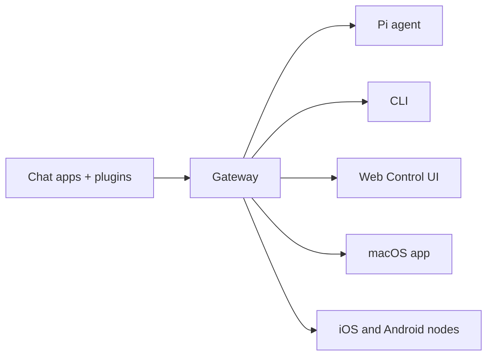

---
read_when:
    - معرفی OpenClaw به تازه‌واردان
summary: OpenClaw یک Gateway چندکانالی برای عامل‌های هوش مصنوعی است که روی هر سیستم‌عاملی اجرا می‌شود.
title: OpenClaw
x-i18n:
    generated_at: "2026-05-07T13:23:37Z"
    model: gpt-5.5
    provider: openai
    source_hash: 7bf82c8551703257e55289d2b82f6436c9900a8afae7ab9b6a655332716ff37b
    source_path: index.md
    workflow: 16
---

# OpenClaw 🦞

<p align="center">
    
    
</p>

> _"EXFOLIATE! EXFOLIATE!"_ — احتمالاً یک خرچنگ فضایی

<p align="center">
  <strong>Gateway برای هر سیستم‌عاملی، مخصوص عامل‌های هوش مصنوعی در Discord، Google Chat، iMessage، Matrix، Microsoft Teams، Signal، Slack، Telegram، WhatsApp، Zalo و موارد بیشتر.</strong><br />
  یک پیام بفرستید و از داخل جیب خود پاسخ عامل را دریافت کنید. یک Gateway را در میان کانال‌های داخلی، Pluginهای کانال همراه، WebChat و گره‌های موبایل اجرا کنید.
</p>

<Columns>
  <Card title="شروع کنید" href="/fa/start/getting-started" icon="rocket">
    OpenClaw را نصب کنید و Gateway را در چند دقیقه بالا بیاورید.
  </Card>
  <Card title="اجرای راه‌اندازی اولیه" href="/fa/start/wizard" icon="sparkles">
    راه‌اندازی هدایت‌شده با `openclaw onboard` و جریان‌های جفت‌سازی.
  </Card>
  <Card title="باز کردن رابط کنترل" href="/fa/web/control-ui" icon="layout-dashboard">
    داشبورد مرورگر را برای چت، پیکربندی و نشست‌ها اجرا کنید.
  </Card>
</Columns>

## OpenClaw چیست؟

OpenClaw یک **Gateway خودمیزبان** است که برنامه‌های چت و سطح‌های کانالی محبوب شما را — کانال‌های داخلی به‌همراه Pluginهای کانال همراه یا خارجی مانند Discord، Google Chat، iMessage، Matrix، Microsoft Teams، Signal، Slack، Telegram، WhatsApp، Zalo و موارد بیشتر — به عامل‌های کدنویسی هوش مصنوعی مانند Pi وصل می‌کند. شما یک فرایند Gateway واحد را روی دستگاه خودتان (یا یک سرور) اجرا می‌کنید، و این فرایند به پل میان برنامه‌های پیام‌رسان شما و یک دستیار هوش مصنوعی همیشه در دسترس تبدیل می‌شود.

**برای چه کسانی است؟** توسعه‌دهندگان و کاربران حرفه‌ای که یک دستیار هوش مصنوعی شخصی می‌خواهند که بتوانند از هرجا به آن پیام بدهند — بدون این‌که کنترل داده‌هایشان را از دست بدهند یا به یک سرویس میزبانی‌شده وابسته باشند.

**چه چیزی آن را متفاوت می‌کند؟**

- **خودمیزبان**: روی سخت‌افزار شما و طبق قواعد شما اجرا می‌شود
- **چندکاناله**: یک Gateway هم‌زمان کانال‌های داخلی و Pluginهای کانال همراه یا خارجی را سرویس می‌دهد
- **بومی عامل**: برای عامل‌های کدنویسی با استفاده از ابزار، نشست‌ها، حافظه و مسیریابی چندعاملی ساخته شده است
- **متن‌باز**: دارای مجوز MIT و جامعه‌محور

**به چه چیزی نیاز دارید؟** Node 24 (پیشنهادی)، یا Node 22 LTS (`22.16+`) برای سازگاری، یک کلید API از ارائه‌دهنده انتخابی‌تان، و ۵ دقیقه زمان. برای بهترین کیفیت و امنیت، از قوی‌ترین مدل نسل جدید موجود استفاده کنید.

## سازوکار



Gateway منبع واحد حقیقت برای نشست‌ها، مسیریابی و اتصال‌های کانال است.

## قابلیت‌های کلیدی

<Columns>
  <Card title="Gateway چندکاناله" icon="network" href="/fa/channels">
    Discord، iMessage، Signal، Slack، Telegram، WhatsApp، WebChat و موارد بیشتر با یک فرایند Gateway واحد.
  </Card>
  <Card title="کانال‌های Plugin" icon="plug" href="/fa/tools/plugin">
    Pluginهای همراه، Matrix، Nostr، Twitch، Zalo و موارد بیشتر را در انتشارهای عادی و فعلی اضافه می‌کنند.
  </Card>
  <Card title="مسیریابی چندعاملی" icon="route" href="/fa/concepts/multi-agent">
    نشست‌های ایزوله برای هر عامل، فضای کاری یا فرستنده.
  </Card>
  <Card title="پشتیبانی رسانه" icon="image" href="/fa/nodes/images">
    تصویر، صدا و سند ارسال و دریافت کنید.
  </Card>
  <Card title="رابط کنترل وب" icon="monitor" href="/fa/web/control-ui">
    داشبورد مرورگر برای چت، پیکربندی، نشست‌ها و گره‌ها.
  </Card>
  <Card title="گره‌های موبایل" icon="smartphone" href="/fa/nodes">
    گره‌های iOS و Android را برای جریان‌های کاری دارای Canvas، دوربین و صدا جفت کنید.
  </Card>
</Columns>

## شروع سریع

<Steps>
  <Step title="نصب OpenClaw">
    ```bash
    npm install -g openclaw@latest
    ```
  </Step>
  <Step title="راه‌اندازی اولیه و نصب سرویس">
    ```bash
    openclaw onboard --install-daemon
    ```
  </Step>
  <Step title="چت">
    رابط کنترل را در مرورگر خود باز کنید و یک پیام بفرستید:

    ```bash
    openclaw dashboard
    ```

    یا یک کانال وصل کنید ([Telegram](/fa/channels/telegram) سریع‌ترین است) و از گوشی خود چت کنید.

  </Step>
</Steps>

به نصب کامل و راه‌اندازی توسعه نیاز دارید؟ [شروع به کار](/fa/start/getting-started) را ببینید.

## داشبورد

پس از شروع Gateway، رابط کنترل مرورگر را باز کنید.

- پیش‌فرض محلی: [http://127.0.0.1:18789/](http://127.0.0.1:18789/)
- دسترسی از راه دور: [سطح‌های وب](/fa/web) و [Tailscale](/fa/gateway/tailscale)

<p align="center">
  
</p>

## پیکربندی (اختیاری)

پیکربندی در `~/.openclaw/openclaw.json` قرار دارد.

- اگر **هیچ کاری نکنید**، OpenClaw از باینری Pi همراه در حالت RPC با نشست‌های جداگانه برای هر فرستنده استفاده می‌کند.
- اگر می‌خواهید آن را محدود کنید، با `channels.whatsapp.allowFrom` و (برای گروه‌ها) قواعد اشاره شروع کنید.

مثال:

```json5
{
  channels: {
    whatsapp: {
      allowFrom: ["+15555550123"],
      groups: { "*": { requireMention: true } },
    },
  },
  messages: { groupChat: { mentionPatterns: ["@openclaw"] } },
}
```

## از اینجا شروع کنید

<Columns>
  <Card title="مرکزهای مستندات" href="/fa/start/hubs" icon="book-open">
    همه مستندات و راهنماها، سازمان‌دهی‌شده بر اساس مورد استفاده.
  </Card>
  <Card title="پیکربندی" href="/fa/gateway/configuration" icon="settings">
    تنظیمات اصلی Gateway، توکن‌ها و پیکربندی ارائه‌دهنده.
  </Card>
  <Card title="دسترسی از راه دور" href="/fa/gateway/remote" icon="globe">
    الگوهای دسترسی SSH و tailnet.
  </Card>
  <Card title="کانال‌ها" href="/fa/channels/telegram" icon="message-square">
    راه‌اندازی مخصوص کانال برای Feishu، Microsoft Teams، WhatsApp، Telegram، Discord و موارد بیشتر.
  </Card>
  <Card title="گره‌ها" href="/fa/nodes" icon="smartphone">
    گره‌های iOS و Android با جفت‌سازی، Canvas، دوربین و کنش‌های دستگاه.
  </Card>
  <Card title="راهنما" href="/fa/help" icon="life-buoy">
    نقطه ورود برای رفع مشکلات رایج و عیب‌یابی.
  </Card>
</Columns>

## بیشتر بیاموزید

<Columns>
  <Card title="فهرست کامل قابلیت‌ها" href="/fa/concepts/features" icon="list">
    قابلیت‌های کامل کانال، مسیریابی و رسانه.
  </Card>
  <Card title="مسیریابی چندعاملی" href="/fa/concepts/multi-agent" icon="route">
    ایزوله‌سازی فضای کاری و نشست‌های جداگانه برای هر عامل.
  </Card>
  <Card title="امنیت" href="/fa/gateway/security" icon="shield">
    توکن‌ها، فهرست‌های مجاز و کنترل‌های ایمنی.
  </Card>
  <Card title="عیب‌یابی" href="/fa/gateway/troubleshooting" icon="wrench">
    تشخیص‌های Gateway و خطاهای رایج.
  </Card>
  <Card title="درباره و قدردانی‌ها" href="/fa/reference/credits" icon="info">
    خاستگاه پروژه، مشارکت‌کنندگان و مجوز.
  </Card>
</Columns>
