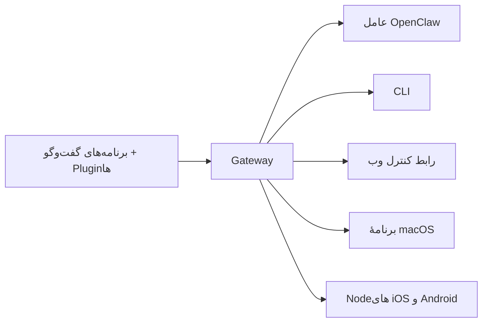

---
read_when:
    - معرفی OpenClaw به تازه‌واردان
summary: OpenClaw یک Gateway چندکاناله برای عامل‌های هوش مصنوعی است که روی هر سیستم‌عاملی اجرا می‌شود.
title: OpenClaw
x-i18n:
    generated_at: "2026-07-16T16:34:42Z"
    model: gpt-5.6
    postprocess_version: locale-links-v1
    prompt_version: 32
    provider: openai
    source_hash: fe97e7299be4855fd9af21838e0626b5a5c8aafe46d982859e9033f0efec2443
    source_path: index.md
    workflow: 16
---

# OpenClaw 🦞

<p align="center">
    
    
</p>

> _«پوست‌اندازی کن! پوست‌اندازی کن!»_ — احتمالاً یک خرچنگ فضایی

<p align="center">
  <strong>Gateway برای هر سیستم‌عامل، جهت استفاده از عامل‌های هوش مصنوعی در Discord، Google Chat، iMessage، Matrix، Microsoft Teams، Signal، Slack، Telegram، WhatsApp، Zalo و سرویس‌های دیگر.</strong><br />
  پیامی بفرستید و پاسخ عامل را در جیب خود دریافت کنید. یک Gateway را برای Pluginهای کانال، WebChat و Nodeهای همراه اجرا کنید.
</p>

<Columns>
  <Card title="شروع به کار" href="/fa/start/getting-started" icon="rocket">
    OpenClaw را نصب کنید و Gateway را ظرف چند دقیقه راه‌اندازی کنید.
  </Card>
  <Card title="اجرای راه‌اندازی اولیه" href="/fa/start/wizard" icon="list-checks">
    راه‌اندازی هدایت‌شده با `openclaw onboard` و فرایندهای جفت‌سازی.
  </Card>
  <Card title="اتصال یک کانال" href="/fa/channels" icon="message-circle">
    Discord، Signal، Telegram، WhatsApp و سرویس‌های دیگر را متصل کنید تا از هرجا گفت‌وگو کنید.
  </Card>
  <Card title="باز کردن رابط کنترل" href="/fa/web/control-ui" icon="layout-dashboard">
    داشبورد مرورگر را برای گفت‌وگو، پیکربندی و نشست‌ها اجرا کنید.
  </Card>
</Columns>

## مرور مستندات

مرورگرهای همراه ممکن است منوی بخش‌ها را بدون نوار کامل زبانه‌های دسکتاپ نمایش دهند. از
این پیوندهای مرکزی برای دسترسی به همان بخش‌های سطح‌بالای مستندات از بدنهٔ صفحه استفاده کنید.

<Columns>
  <Card title="شروع به کار" href="/fa" icon="rocket">
    نمای کلی، نمونه‌ها، گام‌های نخست و راهنماهای راه‌اندازی.
  </Card>
  <Card title="نصب" href="/fa/install" icon="download">
    روش‌های نصب، به‌روزرسانی‌ها، کانتینرها، میزبانی و راه‌اندازی پیشرفته.
  </Card>
  <Card title="کانال‌ها" href="/fa/channels" icon="messages-square">
    کانال‌های پیام‌رسانی، جفت‌سازی، مسیریابی، گروه‌های دسترسی و تضمین کیفیت کانال.
  </Card>
  <Card title="عامل‌ها" href="/fa/concepts/architecture" icon="bot">
    معماری، نشست‌ها، زمینه، حافظه و مسیریابی چندعاملی.
  </Card>
  <Card title="قابلیت‌ها" href="/fa/tools" icon="wand-sparkles">
    ابزارها، Skills، Cron، Webhookها و قابلیت‌های خودکارسازی.
  </Card>
  <Card title="ClawHub" href="/fa/clawhub" icon="store">
    بازار Pluginها، انتشار، گزینش و راهنمای اعتماد.
  </Card>
  <Card title="مدل‌ها" href="/fa/providers" icon="brain">
    ارائه‌دهندگان، پیکربندی مدل، جایگزینی هنگام خرابی و سرویس‌های مدل محلی.
  </Card>
  <Card title="پلتفرم‌ها" href="/fa/platforms" icon="monitor-smartphone">
    macOS، Windows، iOS، Android، Nodeها و رابط‌های وب.
  </Card>
  <Card title="Gateway و عملیات" href="/fa/gateway" icon="server">
    پیکربندی، امنیت، عیب‌یابی و عملیات Gateway.
  </Card>
  <Card title="مرجع" href="/fa/cli" icon="terminal">
    مرجع CLI، طرح‌واره‌ها، RPC، یادداشت‌های انتشار و الگوها.
  </Card>
  <Card title="راهنما" href="/fa/help" icon="life-buoy">
    رفع اشکال، پرسش‌های متداول، آزمایش، عیب‌یابی و بررسی‌های محیط.
  </Card>
</Columns>

## OpenClaw چیست؟

OpenClaw یک **Gateway خودمیزبان** است که برنامه‌های گفت‌وگوی محبوب شما — Discord، Google Chat، iMessage، Matrix، Microsoft Teams، Signal، Slack، Telegram، WhatsApp، Zalo و سرویس‌های دیگر از طریق Pluginهای کانال — را به عامل‌های کدنویسی هوش مصنوعی متصل می‌کند. شما یک فرایند Gateway را روی دستگاه خودتان (یا یک سرور) اجرا می‌کنید و آن به پلی میان برنامه‌های پیام‌رسانی شما و یک دستیار هوش مصنوعی همیشه‌در‌دسترس تبدیل می‌شود.

**برای چه کسانی مناسب است؟** توسعه‌دهندگان و کاربران حرفه‌ای که دستیار هوش مصنوعی شخصی می‌خواهند تا بتوانند از هرجا به آن پیام دهند، بدون آنکه کنترل داده‌های خود را واگذار کنند یا به سرویسی میزبانی‌شده وابسته باشند.

**چه چیزی آن را متمایز می‌کند؟**

- **خودمیزبان**: روی سخت‌افزار شما و طبق قواعد شما اجرا می‌شود
- **چندکاناله**: یک Gateway به‌طور هم‌زمان به همهٔ Pluginهای کانال پیکربندی‌شده خدمت می‌کند
- **عامل‌محور**: برای عامل‌های کدنویسی، با قابلیت استفاده از ابزار، نشست‌ها، حافظه و مسیریابی چندعاملی ساخته شده است
- **متن‌باز**: دارای مجوز MIT و توسعه‌یافته به‌دست جامعه

**به چه چیزهایی نیاز دارید؟** Node 24.15+ (پیشنهادشده)، Node 22 LTS ‏(`22.22.3+`) برای سازگاری، یا Node 25.9+، یک کلید API از ارائه‌دهندهٔ انتخابی و 5 دقیقه زمان. برای دستیابی به بهترین کیفیت و امنیت، از قدرتمندترین مدل نسل جدید موجود استفاده کنید.

## نحوهٔ کار



Gateway مرجع واحد و قطعی برای نشست‌ها، مسیریابی و اتصال‌های کانال است.

## قابلیت‌های کلیدی

<Columns>
  <Card title="Gateway چندکاناله" icon="network" href="/fa/channels">
    Discord، iMessage، Signal، Slack، Telegram، WhatsApp، WebChat و سرویس‌های دیگر با یک فرایند Gateway.
  </Card>
  <Card title="کانال‌های Plugin" icon="plug" href="/fa/tools/plugin">
    Pluginهای کانال، Matrix، Nostr، Twitch، Zalo و سرویس‌های دیگر را اضافه می‌کنند؛ Pluginهای رسمی در صورت نیاز نصب می‌شوند.
  </Card>
  <Card title="مسیریابی چندعاملی" icon="route" href="/fa/concepts/multi-agent">
    نشست‌های مجزا برای هر عامل، فضای کاری یا فرستنده.
  </Card>
  <Card title="پشتیبانی از رسانه" icon="image" href="/fa/nodes/images">
    تصاویر، صدا و اسناد را ارسال و دریافت کنید.
  </Card>
  <Card title="رابط کنترل وب" icon="monitor" href="/fa/web/control-ui">
    داشبورد مرورگر برای گفت‌وگو، پیکربندی، نشست‌ها و Nodeها.
  </Card>
  <Card title="Nodeهای همراه" icon="smartphone" href="/fa/nodes">
    Nodeهای iOS و Android را برای گردش‌کارهای مبتنی بر Canvas، دوربین و صدا جفت کنید.
  </Card>
</Columns>

## شروع سریع

<Steps>
  <Step title="نصب OpenClaw">
    ```bash
    npm install -g openclaw@latest
    ```
  </Step>
  <Step title="راه‌اندازی اولیه و نصب سرویس">
    ```bash
    openclaw onboard --install-daemon
    ```
  </Step>
  <Step title="گفت‌وگو">
    رابط کنترل را در مرورگر خود باز کنید و پیامی بفرستید:

    ```bash
    openclaw dashboard
    ```

    یا یک کانال متصل کنید ([Telegram](/fa/channels/telegram) سریع‌ترین است) و از تلفن خود گفت‌وگو کنید.

  </Step>
</Steps>

به راهنمای کامل نصب و راه‌اندازی توسعه نیاز دارید؟ [شروع به کار](/fa/start/getting-started) را ببینید.

## داشبورد

پس از شروع Gateway، رابط کنترل مرورگر را باز کنید.

- پیش‌فرض محلی: [http://127.0.0.1:18789/](http://127.0.0.1:18789/)
- دسترسی از راه دور: [رابط‌های وب](/fa/web) و [Tailscale](/fa/gateway/tailscale)

<p align="center">
  
</p>

## پیکربندی (اختیاری)

پیکربندی در `~/.openclaw/openclaw.json` قرار دارد.

- اگر **هیچ کاری نکنید**، OpenClaw از زمان‌اجرای عامل OpenClaw همراه استفاده می‌کند؛ پیام‌های مستقیم نشست اصلی عامل را به‌اشتراک می‌گذارند و هر گفت‌وگوی گروهی نشست مخصوص خود را دریافت می‌کند.
- اگر می‌خواهید دسترسی را محدود کنید، با `channels.whatsapp.allowFrom` و برای گروه‌ها با قواعد اشاره شروع کنید.

نمونه:

```json5
{
  channels: {
    whatsapp: {
      allowFrom: ["+15555550123"],
      groups: { "*": { requireMention: true } },
    },
  },
  messages: { groupChat: { mentionPatterns: ["@openclaw"] } },
}
```

## از اینجا شروع کنید

<Columns>
  <Card title="مراکز مستندات" href="/fa/start/hubs" icon="book-open">
    همهٔ مستندات و راهنماها، سازمان‌دهی‌شده بر اساس کاربرد.
  </Card>
  <Card title="پیکربندی" href="/fa/gateway/configuration" icon="settings">
    تنظیمات اصلی Gateway، توکن‌ها و پیکربندی ارائه‌دهنده.
  </Card>
  <Card title="دسترسی از راه دور" href="/fa/gateway/remote" icon="globe">
    الگوهای دسترسی SSH و tailnet.
  </Card>
  <Card title="کانال‌ها" href="/fa/channels/telegram" icon="message-square">
    راه‌اندازی ویژهٔ هر کانال برای Discord، Feishu، Microsoft Teams، Telegram، WhatsApp و سرویس‌های دیگر.
  </Card>
  <Card title="Nodeها" href="/fa/nodes" icon="smartphone">
    Nodeهای iOS و Android با جفت‌سازی، Canvas، دوربین و کنش‌های دستگاه.
  </Card>
  <Card title="راهنما" href="/fa/help" icon="life-buoy">
    نقطهٔ شروع برای راه‌حل‌های رایج و رفع اشکال.
  </Card>
</Columns>

## بیشتر بیاموزید

<Columns>
  <Card title="فهرست کامل قابلیت‌ها" href="/fa/concepts/features" icon="list">
    قابلیت‌های کامل کانال، مسیریابی و رسانه.
  </Card>
  <Card title="مسیریابی چندعاملی" href="/fa/concepts/multi-agent" icon="route">
    جداسازی فضای کاری و نشست‌های مختص هر عامل.
  </Card>
  <Card title="امنیت" href="/fa/gateway/security" icon="shield">
    توکن‌ها، فهرست‌های مجاز و کنترل‌های ایمنی.
  </Card>
  <Card title="رفع اشکال" href="/fa/gateway/troubleshooting" icon="wrench">
    عیب‌یابی Gateway و خطاهای رایج.
  </Card>
  <Card title="دربارهٔ پروژه و قدردانی‌ها" href="/fa/reference/credits" icon="info">
    خاستگاه پروژه، مشارکت‌کنندگان و مجوز.
  </Card>
</Columns>
