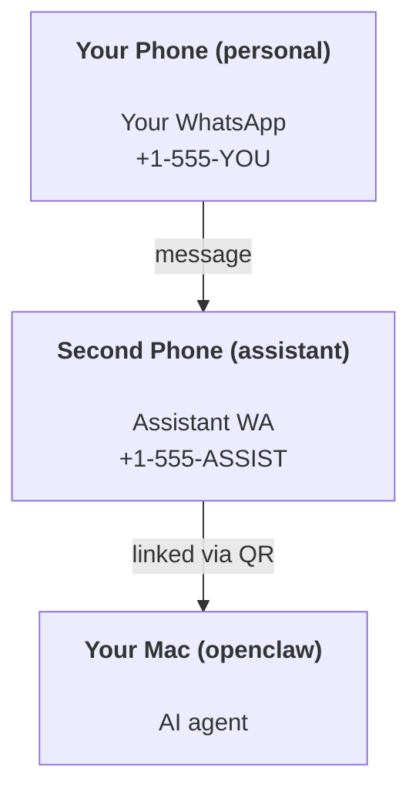

---
read_when:
    - راه‌اندازی اولیهٔ یک نمونهٔ جدید از دستیار
    - بررسی پیامدهای ایمنی/مجوزها
summary: راهنمای سرتاسری برای اجرای OpenClaw به‌عنوان دستیار شخصی همراه با احتیاط‌های ایمنی
title: راه‌اندازی دستیار شخصی
x-i18n:
    generated_at: "2026-05-06T09:43:30Z"
    model: gpt-5.5
    provider: openai
    source_hash: 6fea1194e6b9e8d8816cc712296940487b38faaabea463bd45ba1f37ff52d44d
    source_path: start/openclaw.md
    workflow: 16
---

OpenClaw یک Gateway خودمیزبان است که Discord، Google Chat، iMessage، Matrix، Microsoft Teams، Signal، Slack، Telegram، WhatsApp، Zalo و موارد دیگر را به عامل‌های هوش مصنوعی وصل می‌کند. این راهنما راه‌اندازی «دستیار شخصی» را پوشش می‌دهد: یک شماره اختصاصی WhatsApp که مثل دستیار هوش مصنوعی همیشه‌روشن شما رفتار می‌کند.

## ⚠️ اول ایمنی

شما یک عامل را در موقعیتی قرار می‌دهید که می‌تواند:

- دستورها را روی ماشین شما اجرا کند (بسته به سیاست ابزار شما)
- فایل‌ها را در فضای کاری شما بخواند/بنویسد
- پیام‌ها را از طریق WhatsApp/Telegram/Discord/Mattermost و کانال‌های بسته‌بندی‌شده دیگر دوباره ارسال کند

محافظه‌کارانه شروع کنید:

- همیشه `channels.whatsapp.allowFrom` را تنظیم کنید (هرگز روی Mac شخصی خود آن را برای همه دنیا باز اجرا نکنید).
- برای دستیار از یک شماره اختصاصی WhatsApp استفاده کنید.
- Heartbeatها اکنون به‌طور پیش‌فرض هر ۳۰ دقیقه اجرا می‌شوند. تا زمانی که به راه‌اندازی اعتماد نکرده‌اید، با تنظیم `agents.defaults.heartbeat.every: "0m"` آن‌ها را غیرفعال کنید.

## پیش‌نیازها

- OpenClaw نصب و راه‌اندازی اولیه شده باشد - اگر هنوز این کار را نکرده‌اید، [شروع به کار](/fa/start/getting-started) را ببینید
- یک شماره تلفن دوم (SIM/eSIM/اعتباری) برای دستیار

## راه‌اندازی دو تلفنی (توصیه‌شده)

شما این را می‌خواهید:



اگر WhatsApp شخصی خود را به OpenClaw وصل کنید، هر پیامی که برای شما می‌آید به «ورودی عامل» تبدیل می‌شود. این به‌ندرت چیزی است که می‌خواهید.

## شروع سریع ۵ دقیقه‌ای

1. WhatsApp Web را جفت کنید (QR را نشان می‌دهد؛ با تلفن دستیار اسکن کنید):

```bash
openclaw channels login
```

2. Gateway را شروع کنید (بگذارید در حال اجرا بماند):

```bash
openclaw gateway --port 18789
```

3. یک پیکربندی حداقلی را در `~/.openclaw/openclaw.json` قرار دهید:

```json5
{
  gateway: { mode: "local" },
  channels: { whatsapp: { allowFrom: ["+15555550123"] } },
}
```

اکنون از تلفن مجازشده خود به شماره دستیار پیام بدهید.

وقتی راه‌اندازی اولیه تمام شد، OpenClaw داشبورد را خودکار باز می‌کند و یک پیوند تمیز (بدون توکن) چاپ می‌کند. اگر داشبورد احراز هویت خواست، راز مشترک پیکربندی‌شده را در تنظیمات Control UI جای‌گذاری کنید. راه‌اندازی اولیه به‌طور پیش‌فرض از توکن استفاده می‌کند (`gateway.auth.token`)، اما اگر `gateway.auth.mode` را به `password` تغییر داده باشید، احراز هویت با گذرواژه هم کار می‌کند. برای باز کردن دوباره بعدا: `openclaw dashboard`.

## به عامل یک فضای کاری بدهید (AGENTS)

OpenClaw دستورالعمل‌های عملیاتی و «حافظه» را از دایرکتوری فضای کاری خود می‌خواند.

به‌طور پیش‌فرض، OpenClaw از `~/.openclaw/workspace` به‌عنوان فضای کاری عامل استفاده می‌کند و آن را (به‌همراه فایل‌های شروع `AGENTS.md`، `SOUL.md`، `TOOLS.md`، `IDENTITY.md`، `USER.md`، `HEARTBEAT.md`) به‌صورت خودکار هنگام راه‌اندازی/اولین اجرای عامل ایجاد می‌کند. `BOOTSTRAP.md` فقط زمانی ایجاد می‌شود که فضای کاری کاملا جدید باشد (پس از حذف آن نباید دوباره برگردد). `MEMORY.md` اختیاری است (خودکار ایجاد نمی‌شود)؛ وقتی وجود داشته باشد، برای نشست‌های عادی بارگذاری می‌شود. نشست‌های زیرعامل فقط `AGENTS.md` و `TOOLS.md` را تزریق می‌کنند.

<Tip>
با این پوشه مثل حافظه OpenClaw رفتار کنید و آن را یک مخزن git کنید (ترجیحا خصوصی) تا `AGENTS.md` و فایل‌های حافظه شما پشتیبان‌گیری شوند. اگر git نصب باشد، فضاهای کاری کاملا جدید به‌صورت خودکار مقداردهی اولیه می‌شوند.
</Tip>

```bash
openclaw setup
```

چیدمان کامل فضای کاری + راهنمای پشتیبان‌گیری: [فضای کاری عامل](/fa/concepts/agent-workspace)
گردش‌کار حافظه: [حافظه](/fa/concepts/memory)

اختیاری: با `agents.defaults.workspace` یک فضای کاری متفاوت انتخاب کنید (از `~` پشتیبانی می‌کند).

```json5
{
  agents: {
    defaults: {
      workspace: "~/.openclaw/workspace",
    },
  },
}
```

اگر از قبل فایل‌های فضای کاری خودتان را از یک مخزن عرضه می‌کنید، می‌توانید ایجاد فایل‌های بوت‌استرپ را کاملا غیرفعال کنید:

```json5
{
  agents: {
    defaults: {
      skipBootstrap: true,
    },
  },
}
```

## پیکربندی‌ای که آن را به «یک دستیار» تبدیل می‌کند

OpenClaw به‌طور پیش‌فرض یک راه‌اندازی مناسب برای دستیار دارد، اما معمولا می‌خواهید این موارد را تنظیم کنید:

- شخصیت/دستورالعمل‌ها در [`SOUL.md`](/fa/concepts/soul)
- پیش‌فرض‌های تفکر (در صورت نیاز)
- Heartbeatها (پس از آنکه به آن اعتماد کردید)

نمونه:

```json5
{
  logging: { level: "info" },
  agent: {
    model: "anthropic/claude-opus-4-6",
    workspace: "~/.openclaw/workspace",
    thinkingDefault: "high",
    timeoutSeconds: 1800,
    // Start with 0; enable later.
    heartbeat: { every: "0m" },
  },
  channels: {
    whatsapp: {
      allowFrom: ["+15555550123"],
      groups: {
        "*": { requireMention: true },
      },
    },
  },
  routing: {
    groupChat: {
      mentionPatterns: ["@openclaw", "openclaw"],
    },
  },
  session: {
    scope: "per-sender",
    resetTriggers: ["/new", "/reset"],
    reset: {
      mode: "daily",
      atHour: 4,
      idleMinutes: 10080,
    },
  },
}
```

## نشست‌ها و حافظه

- فایل‌های نشست: `~/.openclaw/agents/<agentId>/sessions/{{SessionId}}.jsonl`
- فراداده نشست (مصرف توکن، آخرین مسیر و غیره): `~/.openclaw/agents/<agentId>/sessions/sessions.json` (قدیمی: `~/.openclaw/sessions/sessions.json`)
- `/new` یا `/reset` برای آن گفت‌وگو یک نشست تازه شروع می‌کند (از طریق `resetTriggers` قابل پیکربندی است). اگر به‌تنهایی ارسال شود، OpenClaw بدون فراخوانی مدل بازنشانی را تأیید می‌کند.
- `/compact [instructions]` زمینه نشست را Compaction می‌کند و بودجه زمینه باقی‌مانده را گزارش می‌دهد.

## Heartbeatها (حالت پیش‌دستانه)

به‌طور پیش‌فرض، OpenClaw هر ۳۰ دقیقه یک Heartbeat را با این اعلان اجرا می‌کند:
`Read HEARTBEAT.md if it exists (workspace context). Follow it strictly. Do not infer or repeat old tasks from prior chats. If nothing needs attention, reply HEARTBEAT_OK.`
برای غیرفعال کردن، `agents.defaults.heartbeat.every: "0m"` را تنظیم کنید.

- اگر `HEARTBEAT.md` وجود داشته باشد اما عملا خالی باشد (فقط خطوط خالی و سربرگ‌های markdown مثل `# Heading`)، OpenClaw برای صرفه‌جویی در فراخوانی‌های API اجرای Heartbeat را رد می‌کند.
- اگر فایل وجود نداشته باشد، Heartbeat همچنان اجرا می‌شود و مدل تصمیم می‌گیرد چه کاری انجام دهد.
- اگر عامل با `HEARTBEAT_OK` پاسخ دهد (اختیارا با فاصله‌گذاری کوتاه؛ `agents.defaults.heartbeat.ackMaxChars` را ببینید)، OpenClaw تحویل خروجی برای آن Heartbeat را سرکوب می‌کند.
- به‌طور پیش‌فرض، تحویل Heartbeat به مقصدهای سبک پیام مستقیم `user:<id>` مجاز است. برای سرکوب تحویل به مقصد مستقیم درحالی‌که اجرای Heartbeat فعال می‌ماند، `agents.defaults.heartbeat.directPolicy: "block"` را تنظیم کنید.
- Heartbeatها نوبت‌های کامل عامل را اجرا می‌کنند - بازه‌های کوتاه‌تر توکن بیشتری مصرف می‌کنند.

```json5
{
  agent: {
    heartbeat: { every: "30m" },
  },
}
```

## رسانه ورودی و خروجی

پیوست‌های ورودی (تصویر/صدا/سند) می‌توانند از طریق قالب‌ها به دستور شما ارائه شوند:

- `{{MediaPath}}` (مسیر فایل موقت محلی)
- `{{MediaUrl}}` (شبه-URL)
- `{{Transcript}}` (اگر رونویسی صدا فعال باشد)

پیوست‌های خروجی از عامل: `MEDIA:<path-or-url>` را در خط خودش قرار دهید (بدون فاصله). نمونه:

```
Here's the screenshot.
MEDIA:https://example.com/screenshot.png
```

OpenClaw این موارد را استخراج می‌کند و آن‌ها را همراه با متن به‌عنوان رسانه ارسال می‌کند.

رفتار مسیر محلی از همان مدل اعتماد خواندن فایل پیروی می‌کند که عامل دارد:

- اگر `tools.fs.workspaceOnly` برابر `true` باشد، مسیرهای محلی خروجی `MEDIA:` همچنان به ریشه موقت OpenClaw، کش رسانه، مسیرهای فضای کاری عامل و فایل‌های تولیدشده توسط sandbox محدود می‌مانند.
- اگر `tools.fs.workspaceOnly` برابر `false` باشد، خروجی `MEDIA:` می‌تواند از فایل‌های محلی میزبان استفاده کند که عامل از قبل اجازه خواندن آن‌ها را دارد.
- مسیرهای محلی می‌توانند مطلق، نسبی به فضای کاری، یا نسبی به خانه با `~/` باشند.
- ارسال‌های محلی میزبان همچنان فقط رسانه و انواع سند امن را مجاز می‌کنند (تصاویر، صدا، ویدئو، PDF و سندهای Office). متن ساده و فایل‌های شبیه راز به‌عنوان رسانه قابل ارسال تلقی نمی‌شوند.

این یعنی تصاویر/فایل‌های تولیدشده خارج از فضای کاری اکنون وقتی سیاست fs شما از قبل آن خواندن‌ها را مجاز می‌کند، بدون باز کردن دوباره نشت دلخواه پیوست متنی میزبان، می‌توانند ارسال شوند.

## چک‌لیست عملیات

```bash
openclaw status          # local status (creds, sessions, queued events)
openclaw status --all    # full diagnosis (read-only, pasteable)
openclaw status --deep   # asks the gateway for a live health probe with channel probes when supported
openclaw health --json   # gateway health snapshot (WS; default can return a fresh cached snapshot)
```

لاگ‌ها زیر `/tmp/openclaw/` قرار می‌گیرند (پیش‌فرض: `openclaw-YYYY-MM-DD.log`).

## گام‌های بعدی

- WebChat: [WebChat](/fa/web/webchat)
- عملیات Gateway: [راهنمای عملیاتی Gateway](/fa/gateway)
- Cron + بیدارباش‌ها: [کارهای Cron](/fa/automation/cron-jobs)
- همراه نوار منوی macOS: [برنامه macOS OpenClaw](/fa/platforms/macos)
- برنامه Node برای iOS: [برنامه iOS](/fa/platforms/ios)
- برنامه Node برای Android: [برنامه Android](/fa/platforms/android)
- وضعیت Windows: [Windows (WSL2)](/fa/platforms/windows)
- وضعیت Linux: [برنامه Linux](/fa/platforms/linux)
- امنیت: [امنیت](/fa/gateway/security)

## مرتبط

- [شروع به کار](/fa/start/getting-started)
- [راه‌اندازی](/fa/start/setup)
- [نمای کلی کانال‌ها](/fa/channels)
