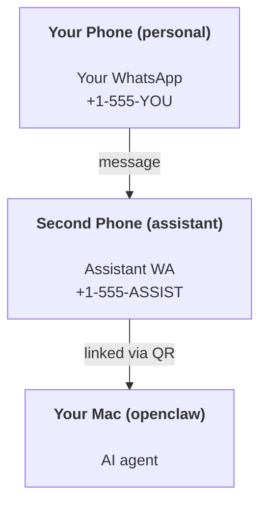

---
read_when:
    - راه‌اندازی یک نمونهٔ دستیار جدید
    - بررسی پیامدهای ایمنی/مجوز
summary: راهنمای سرتاسری برای اجرای OpenClaw به‌عنوان دستیار شخصی همراه با هشدارهای ایمنی
title: راه‌اندازی دستیار شخصی
x-i18n:
    generated_at: "2026-06-27T18:53:55Z"
    model: gpt-5.5
    postprocess_version: locale-links-v1
    provider: openai
    source_hash: b0cd640872a2a60fd88d2dc3df6d038ef8574163430d8683ef9b67921b0c87f4
    source_path: start/openclaw.md
    workflow: 16
---

OpenClaw یک Gateway خودمیزبان است که Discord، Google Chat، iMessage، Matrix، Microsoft Teams، Signal، Slack، Telegram، WhatsApp، Zalo و موارد بیشتر را به عامل‌های هوش مصنوعی متصل می‌کند. این راهنما راه‌اندازی «دستیار شخصی» را پوشش می‌دهد: یک شماره اختصاصی WhatsApp که مانند دستیار هوش مصنوعی همیشه‌روشن شما رفتار می‌کند.

## ⚠️ اول ایمنی

شما یک عامل را در موقعیتی قرار می‌دهید که بتواند:

- فرمان‌هایی را روی دستگاه شما اجرا کند (بسته به سیاست ابزار شما)
- فایل‌ها را در فضای کاری شما بخواند/بنویسد
- پیام‌ها را از طریق WhatsApp/Telegram/Discord/Mattermost و کانال‌های همراه دیگر دوباره ارسال کند

محافظه‌کارانه شروع کنید:

- همیشه `channels.whatsapp.allowFrom` را تنظیم کنید (هرگز روی Mac شخصی خود به‌صورت باز برای همه اجرا نکنید).
- برای دستیار از یک شماره اختصاصی WhatsApp استفاده کنید.
- Heartbeatها اکنون به‌طور پیش‌فرض هر ۳۰ دقیقه اجرا می‌شوند. تا زمانی که به راه‌اندازی اعتماد نکرده‌اید، با تنظیم `agents.defaults.heartbeat.every: "0m"` آن را غیرفعال کنید.

## پیش‌نیازها

- OpenClaw نصب و راه‌اندازی اولیه شده باشد - اگر هنوز این کار را انجام نداده‌اید، [شروع به کار](/fa/start/getting-started) را ببینید
- یک شماره تلفن دوم (SIM/eSIM/اعتباری) برای دستیار

## راه‌اندازی با دو تلفن (توصیه‌شده)

چیزی که می‌خواهید این است:



اگر WhatsApp شخصی خود را به OpenClaw وصل کنید، هر پیامی که برای شما می‌آید به «ورودی عامل» تبدیل می‌شود. این به‌ندرت همان چیزی است که می‌خواهید.

## شروع سریع ۵ دقیقه‌ای

1. WhatsApp Web را جفت کنید (QR را نشان می‌دهد؛ با تلفن دستیار اسکن کنید):

```bash
openclaw channels login
```

2. Gateway را شروع کنید (بگذارید در حال اجرا بماند):

```bash
openclaw gateway --port 18789
```

3. یک پیکربندی حداقلی در `~/.openclaw/openclaw.json` قرار دهید:

```json5
{
  gateway: { mode: "local" },
  channels: { whatsapp: { allowFrom: ["+15555550123"] } },
}
```

اکنون از تلفن مجازشده خود به شماره دستیار پیام بدهید.

وقتی راه‌اندازی اولیه تمام می‌شود، OpenClaw داشبورد را به‌صورت خودکار باز می‌کند و یک پیوند تمیز (بدون توکن) چاپ می‌کند. اگر داشبورد درخواست احراز هویت کرد، راز مشترک پیکربندی‌شده را در تنظیمات Control UI جای‌گذاری کنید. راه‌اندازی اولیه به‌طور پیش‌فرض از یک توکن (`gateway.auth.token`) استفاده می‌کند، اما اگر `gateway.auth.mode` را به `password` تغییر داده باشید، احراز هویت با گذرواژه هم کار می‌کند. برای بازکردن دوباره در آینده: `openclaw dashboard`.

## به عامل یک فضای کاری بدهید (AGENTS)

OpenClaw دستورالعمل‌های عملیاتی و «حافظه» را از پوشه فضای کاری خود می‌خواند.

به‌طور پیش‌فرض، OpenClaw از `~/.openclaw/workspace` به‌عنوان فضای کاری عامل استفاده می‌کند و آن را (به‌همراه فایل‌های شروع `AGENTS.md`، `SOUL.md`، `TOOLS.md`، `IDENTITY.md`، `USER.md`، `HEARTBEAT.md`) به‌صورت خودکار هنگام راه‌اندازی/اولین اجرای عامل ایجاد می‌کند. `BOOTSTRAP.md` فقط وقتی ایجاد می‌شود که فضای کاری کاملا جدید باشد (بعد از حذف آن نباید دوباره برگردد). `MEMORY.md` اختیاری است (خودکار ایجاد نمی‌شود)؛ وقتی وجود داشته باشد، برای جلسات عادی بارگذاری می‌شود. جلسات زیرفرایند عامل فقط `AGENTS.md` و `TOOLS.md` را تزریق می‌کنند.

<Tip>
با این پوشه مثل حافظه OpenClaw رفتار کنید و آن را به یک مخزن git تبدیل کنید (ترجیحا خصوصی) تا از `AGENTS.md` و فایل‌های حافظه شما نسخه پشتیبان گرفته شود. اگر git نصب باشد، فضاهای کاری کاملا جدید به‌صورت خودکار مقداردهی اولیه می‌شوند.
</Tip>

```bash
openclaw setup
```

چیدمان کامل فضای کاری + راهنمای پشتیبان‌گیری: [فضای کاری عامل](/fa/concepts/agent-workspace)
گردش کار حافظه: [حافظه](/fa/concepts/memory)

اختیاری: با `agents.defaults.workspace` یک فضای کاری متفاوت انتخاب کنید (از `~` پشتیبانی می‌کند).

```json5
{
  agents: {
    defaults: {
      workspace: "~/.openclaw/workspace",
    },
  },
}
```

اگر از قبل فایل‌های فضای کاری خود را از یک مخزن منتشر می‌کنید، می‌توانید ایجاد فایل‌های bootstrap را به‌طور کامل غیرفعال کنید:

```json5
{
  agents: {
    defaults: {
      skipBootstrap: true,
    },
  },
}
```

## پیکربندی‌ای که آن را به «یک دستیار» تبدیل می‌کند

OpenClaw به‌طور پیش‌فرض یک راه‌اندازی خوب برای دستیار دارد، اما معمولا می‌خواهید این موارد را تنظیم کنید:

- شخصیت/دستورالعمل‌ها در [`SOUL.md`](/fa/concepts/soul)
- پیش‌فرض‌های تفکر (در صورت تمایل)
- Heartbeatها (وقتی به آن اعتماد کردید)

نمونه:

```json5
{
  logging: { level: "info" },
  agents: {
    defaults: {
      model: { primary: "anthropic/claude-opus-4-6" },
      workspace: "~/.openclaw/workspace",
      thinkingDefault: "high",
      timeoutSeconds: 1800,
      // Start with 0; enable later.
      heartbeat: { every: "0m" },
    },
    list: [
      {
        id: "main",
        default: true,
        groupChat: {
          mentionPatterns: ["@openclaw", "openclaw"],
        },
      },
    ],
  },
  channels: {
    whatsapp: {
      allowFrom: ["+15555550123"],
      groups: {
        "*": { requireMention: true },
      },
    },
  },
  session: {
    scope: "per-sender",
    resetTriggers: ["/new", "/reset"],
    reset: {
      mode: "daily",
      atHour: 4,
      idleMinutes: 10080,
    },
  },
}
```

## جلسات و حافظه

- فایل‌های جلسه: `~/.openclaw/agents/<agentId>/sessions/{{SessionId}}.jsonl`
- فراداده جلسه (مصرف توکن، آخرین مسیر، و غیره): `~/.openclaw/agents/<agentId>/sessions/sessions.json` (قدیمی: `~/.openclaw/sessions/sessions.json`)
- `/new` یا `/reset` برای آن گفتگو یک جلسه تازه شروع می‌کند (از طریق `resetTriggers` قابل پیکربندی است). اگر به‌تنهایی ارسال شود، OpenClaw بازنشانی را بدون فراخوانی مدل تأیید می‌کند.
- `/compact [instructions]` زمینه جلسه را فشرده می‌کند و بودجه زمینه باقی‌مانده را گزارش می‌دهد.

## Heartbeatها (حالت پیش‌فعال)

به‌طور پیش‌فرض، OpenClaw هر ۳۰ دقیقه یک Heartbeat را با این پرامپت اجرا می‌کند:
`Read HEARTBEAT.md if it exists (workspace context). Follow it strictly. Do not infer or repeat old tasks from prior chats. If nothing needs attention, reply HEARTBEAT_OK.`
برای غیرفعال‌سازی، `agents.defaults.heartbeat.every: "0m"` را تنظیم کنید.

- اگر `HEARTBEAT.md` وجود داشته باشد اما عملا خالی باشد (فقط خطوط خالی، دیدگاه‌های Markdown/HTML، عنوان‌های Markdown مثل `# Heading`، نشانگرهای fence، یا جای‌نگهدارهای چک‌لیست خالی)، OpenClaw برای صرفه‌جویی در فراخوانی‌های API اجرای Heartbeat را رد می‌کند.
- اگر فایل وجود نداشته باشد، Heartbeat همچنان اجرا می‌شود و مدل تصمیم می‌گیرد چه کاری انجام دهد.
- اگر عامل با `HEARTBEAT_OK` پاسخ دهد (به‌صورت اختیاری با padding کوتاه؛ `agents.defaults.heartbeat.ackMaxChars` را ببینید)، OpenClaw ارسال خروجی برای آن Heartbeat را سرکوب می‌کند.
- به‌طور پیش‌فرض، تحویل Heartbeat به مقصدهای سبک پیام مستقیم `user:<id>` مجاز است. برای سرکوب تحویل به مقصد مستقیم در حالی که اجرای Heartbeatها فعال می‌ماند، `agents.defaults.heartbeat.directPolicy: "block"` را تنظیم کنید.
- Heartbeatها نوبت‌های کامل عامل را اجرا می‌کنند - بازه‌های کوتاه‌تر توکن بیشتری مصرف می‌کنند.

```json5
{
  agents: {
    defaults: {
      heartbeat: { every: "30m" },
    },
  },
}
```

## رسانه ورودی و خروجی

پیوست‌های ورودی (تصویر/صدا/سند) می‌توانند از طریق قالب‌ها در اختیار فرمان شما قرار بگیرند:

- `{{MediaPath}}` (مسیر فایل موقت محلی)
- `{{MediaUrl}}` (شبه-URL)
- `{{Transcript}}` (اگر رونویسی صوت فعال باشد)

پیوست‌های خروجی از عامل از فیلدهای رسانه ساختاریافته روی ابزار پیام یا payload پاسخ استفاده می‌کنند، مانند `media`، `mediaUrl`، `mediaUrls`، `path`، یا `filePath`. نمونه آرگومان‌های ابزار پیام:

```json
{
  "message": "Here's the screenshot.",
  "mediaUrl": "https://example.com/screenshot.png"
}
```

OpenClaw رسانه ساختاریافته را همراه متن ارسال می‌کند. پاسخ‌های نهایی قدیمی دستیار ممکن است همچنان برای سازگاری نرمال‌سازی شوند، اما خروجی ابزار، خروجی مرورگر، بلوک‌های جریانی، و کنش‌های پیام متن را به‌عنوان فرمان پیوست تجزیه نمی‌کنند.

رفتار مسیر محلی از همان مدل اعتماد خواندن فایل مانند عامل پیروی می‌کند:

- اگر `tools.fs.workspaceOnly` برابر `true` باشد، مسیرهای رسانه محلی خروجی به ریشه موقت OpenClaw، کش رسانه، مسیرهای فضای کاری عامل، و فایل‌های تولیدشده توسط sandbox محدود می‌مانند.
- اگر `tools.fs.workspaceOnly` برابر `false` باشد، رسانه محلی خروجی می‌تواند از فایل‌های محلی میزبان استفاده کند که عامل از قبل مجاز به خواندن آن‌هاست.
- مسیرهای محلی می‌توانند مطلق، نسبی به فضای کاری، یا نسبی به خانه با `~/` باشند.
- ارسال‌های محلی میزبان همچنان فقط رسانه و نوع‌های امن سند را مجاز می‌کنند (تصویر، صدا، ویدئو، PDF، اسناد Office، و اسناد متنی اعتبارسنجی‌شده مانند Markdown/MD، TXT، JSON، YAML، و YML). این گسترشی از مرز اعتماد خواندن میزبان موجود است، نه اسکنر راز: اگر عامل بتواند یک `secret.txt` یا `config.json` محلی میزبان را بخواند، وقتی پسوند و اعتبارسنجی محتوا مطابق باشد، می‌تواند آن فایل را پیوست کند.

این یعنی تصاویر/فایل‌های تولیدشده خارج از فضای کاری اکنون می‌توانند ارسال شوند وقتی سیاست fs شما از قبل اجازه آن خواندن‌ها را می‌دهد، در حالی که پسوندهای متنی دلخواه محلی میزبان همچنان مسدود می‌مانند. فایل‌های حساس را بیرون از فایل‌سیستمی که عامل می‌تواند بخواند نگه دارید، یا برای ارسال‌های مسیر محلی سخت‌گیرانه‌تر `tools.fs.workspaceOnly=true` را نگه دارید.

## چک‌لیست عملیات

```bash
openclaw status          # local status (creds, sessions, queued events)
openclaw status --all    # full diagnosis (read-only, pasteable)
openclaw status --deep   # asks the gateway for a live health probe with channel probes when supported
openclaw health --json   # gateway health snapshot (WS; default can return a fresh cached snapshot)
```

لاگ‌ها زیر `/tmp/openclaw/` قرار دارند (پیش‌فرض: `openclaw-YYYY-MM-DD.log`).

## گام‌های بعدی

- WebChat: [WebChat](/fa/web/webchat)
- عملیات Gateway: [راهنمای عملیاتی Gateway](/fa/gateway)
- Cron + بیدارباش‌ها: [وظایف Cron](/fa/automation/cron-jobs)
- همراه نوار منوی macOS: [برنامه macOS OpenClaw](/fa/platforms/macos)
- برنامه node برای iOS: [برنامه iOS](/fa/platforms/ios)
- برنامه node برای Android: [برنامه Android](/fa/platforms/android)
- Windows Hub: [Windows](/fa/platforms/windows)
- وضعیت Linux: [برنامه Linux](/fa/platforms/linux)
- امنیت: [امنیت](/fa/gateway/security)

## مرتبط

- [شروع به کار](/fa/start/getting-started)
- [راه‌اندازی](/fa/start/setup)
- [نمای کلی کانال‌ها](/fa/channels)
