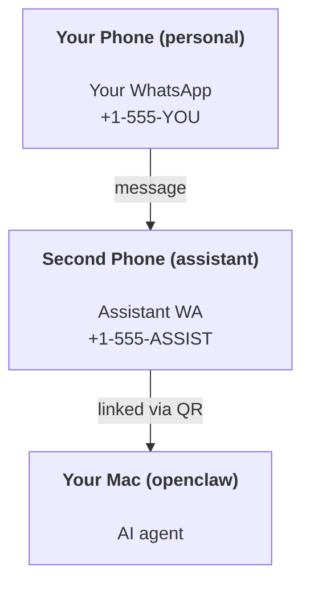

---
read_when:
    - راه‌اندازی اولیهٔ یک نمونهٔ جدید از دستیار
    - بررسی پیامدهای ایمنی/مجوزها
summary: راهنمای سرتاسری برای اجرای OpenClaw به‌عنوان یک دستیار شخصی همراه با هشدارهای ایمنی
title: راه‌اندازی دستیار شخصی
x-i18n:
    generated_at: "2026-05-11T20:43:42Z"
    model: gpt-5.5
    provider: openai
    source_hash: 74dd13c4b43faa8e29e1fd56a355f36c6cf7c3fa8193bb62c1056211933f4df9
    source_path: start/openclaw.md
    workflow: 16
---

OpenClaw یک gateway خودمیزبان است که Discord، Google Chat، iMessage، Matrix، Microsoft Teams، Signal، Slack، Telegram، WhatsApp، Zalo و موارد بیشتر را به عامل‌های AI وصل می‌کند. این راهنما راه‌اندازی «دستیار شخصی» را پوشش می‌دهد: یک شماره اختصاصی WhatsApp که مانند دستیار AI همیشه‌فعال شما رفتار می‌کند.

## ⚠️ اول ایمنی

شما یک عامل را در موقعیتی قرار می‌دهید که می‌تواند:

- روی دستگاه شما فرمان اجرا کند (بسته به سیاست ابزار شما)
- فایل‌ها را در workspace شما بخواند/بنویسد
- از طریق WhatsApp/Telegram/Discord/Mattermost و کانال‌های همراه دیگر پیام ارسال کند

محافظه‌کارانه شروع کنید:

- همیشه `channels.whatsapp.allowFrom` را تنظیم کنید (هرگز روی Mac شخصی خود آن را برای همه دنیا باز اجرا نکنید).
- از یک شماره اختصاصی WhatsApp برای دستیار استفاده کنید.
- Heartbeatها اکنون به‌طور پیش‌فرض هر ۳۰ دقیقه اجرا می‌شوند. تا وقتی به راه‌اندازی اعتماد نکرده‌اید، با تنظیم `agents.defaults.heartbeat.every: "0m"` آن‌ها را غیرفعال کنید.

## پیش‌نیازها

- OpenClaw نصب و راه‌اندازی اولیه شده باشد - اگر هنوز این کار را انجام نداده‌اید، [شروع به کار](/fa/start/getting-started) را ببینید
- یک شماره تلفن دوم (SIM/eSIM/اعتباری) برای دستیار

## راه‌اندازی دوگوشی (توصیه‌شده)

این را می‌خواهید:



اگر WhatsApp شخصی خود را به OpenClaw وصل کنید، هر پیامی که برای شما می‌آید به «ورودی عامل» تبدیل می‌شود. این معمولاً چیزی نیست که می‌خواهید.

## شروع سریع ۵ دقیقه‌ای

1. WhatsApp Web را جفت کنید (QR را نشان می‌دهد؛ با گوشی دستیار اسکن کنید):

```bash
openclaw channels login
```

2. Gateway را شروع کنید (در حال اجرا نگهش دارید):

```bash
openclaw gateway --port 18789
```

3. یک پیکربندی حداقلی در `~/.openclaw/openclaw.json` قرار دهید:

```json5
{
  gateway: { mode: "local" },
  channels: { whatsapp: { allowFrom: ["+15555550123"] } },
}
```

حالا از گوشی allowlist شده خود به شماره دستیار پیام بدهید.

وقتی راه‌اندازی اولیه تمام شود، OpenClaw داشبورد را خودکار باز می‌کند و یک لینک تمیز (بدون توکن) چاپ می‌کند. اگر داشبورد درخواست auth کرد، shared secret پیکربندی‌شده را در تنظیمات Control UI وارد کنید. راه‌اندازی اولیه به‌طور پیش‌فرض از یک توکن (`gateway.auth.token`) استفاده می‌کند، اما اگر `gateway.auth.mode` را به `password` تغییر داده باشید، auth با رمز عبور هم کار می‌کند. برای بازکردن دوباره در آینده: `openclaw dashboard`.

## به عامل یک workspace بدهید (AGENTS)

OpenClaw دستورالعمل‌های عملیاتی و «حافظه» را از دایرکتوری workspace خود می‌خواند.

به‌طور پیش‌فرض، OpenClaw از `~/.openclaw/workspace` به‌عنوان workspace عامل استفاده می‌کند و آن را (به‌همراه `AGENTS.md`، `SOUL.md`، `TOOLS.md`، `IDENTITY.md`، `USER.md`، `HEARTBEAT.md` شروع‌کننده) به‌صورت خودکار هنگام setup/اولین اجرای عامل ایجاد می‌کند. `BOOTSTRAP.md` فقط زمانی ایجاد می‌شود که workspace کاملاً جدید باشد (بعد از حذفش نباید دوباره برگردد). `MEMORY.md` اختیاری است (خودکار ایجاد نمی‌شود)؛ وقتی وجود داشته باشد، برای sessionهای عادی بارگذاری می‌شود. sessionهای subagent فقط `AGENTS.md` و `TOOLS.md` را تزریق می‌کنند.

<Tip>
با این پوشه مثل حافظه OpenClaw رفتار کنید و آن را به یک repo گیت تبدیل کنید (ترجیحاً خصوصی) تا از `AGENTS.md` و فایل‌های حافظه شما پشتیبان گرفته شود. اگر git نصب باشد، workspaceهای کاملاً جدید به‌طور خودکار مقداردهی اولیه می‌شوند.
</Tip>

```bash
openclaw setup
```

طرح کامل workspace + راهنمای پشتیبان‌گیری: [workspace عامل](/fa/concepts/agent-workspace)
گردش‌کار حافظه: [حافظه](/fa/concepts/memory)

اختیاری: با `agents.defaults.workspace` یک workspace متفاوت انتخاب کنید (از `~` پشتیبانی می‌کند).

```json5
{
  agents: {
    defaults: {
      workspace: "~/.openclaw/workspace",
    },
  },
}
```

اگر از قبل فایل‌های workspace خودتان را از یک repo ارسال می‌کنید، می‌توانید ایجاد فایل‌های bootstrap را کاملاً غیرفعال کنید:

```json5
{
  agents: {
    defaults: {
      skipBootstrap: true,
    },
  },
}
```

## پیکربندی‌ای که آن را به «یک دستیار» تبدیل می‌کند

OpenClaw به‌طور پیش‌فرض یک راه‌اندازی خوب برای دستیار دارد، اما معمولاً می‌خواهید این‌ها را تنظیم کنید:

- شخصیت/دستورالعمل‌ها در [`SOUL.md`](/fa/concepts/soul)
- پیش‌فرض‌های thinking (در صورت نیاز)
- heartbeatها (وقتی به آن اعتماد کردید)

مثال:

```json5
{
  logging: { level: "info" },
  agents: {
    defaults: {
      model: { primary: "anthropic/claude-opus-4-6" },
      workspace: "~/.openclaw/workspace",
      thinkingDefault: "high",
      timeoutSeconds: 1800,
      // Start with 0; enable later.
      heartbeat: { every: "0m" },
    },
    list: [
      {
        id: "main",
        default: true,
        groupChat: {
          mentionPatterns: ["@openclaw", "openclaw"],
        },
      },
    ],
  },
  channels: {
    whatsapp: {
      allowFrom: ["+15555550123"],
      groups: {
        "*": { requireMention: true },
      },
    },
  },
  session: {
    scope: "per-sender",
    resetTriggers: ["/new", "/reset"],
    reset: {
      mode: "daily",
      atHour: 4,
      idleMinutes: 10080,
    },
  },
}
```

## Sessionها و حافظه

- فایل‌های session: `~/.openclaw/agents/<agentId>/sessions/{{SessionId}}.jsonl`
- metadata مربوط به session (مصرف توکن، آخرین مسیر و غیره): `~/.openclaw/agents/<agentId>/sessions/sessions.json` (legacy: `~/.openclaw/sessions/sessions.json`)
- `/new` یا `/reset` برای آن chat یک session تازه شروع می‌کند (از طریق `resetTriggers` قابل پیکربندی است). اگر به‌تنهایی ارسال شود، OpenClaw بدون فراخوانی مدل reset را تأیید می‌کند.
- `/compact [instructions]` context مربوط به session را فشرده می‌کند و بودجه context باقی‌مانده را گزارش می‌دهد.

## Heartbeatها (حالت پیش‌دستانه)

به‌طور پیش‌فرض، OpenClaw هر ۳۰ دقیقه یک Heartbeat را با prompt زیر اجرا می‌کند:
`Read HEARTBEAT.md if it exists (workspace context). Follow it strictly. Do not infer or repeat old tasks from prior chats. If nothing needs attention, reply HEARTBEAT_OK.`
برای غیرفعال‌سازی، `agents.defaults.heartbeat.every: "0m"` را تنظیم کنید.

- اگر `HEARTBEAT.md` وجود داشته باشد اما عملاً خالی باشد (فقط خطوط خالی و headerهای markdown مانند `# Heading`)، OpenClaw اجرای heartbeat را برای صرفه‌جویی در API callها رد می‌کند.
- اگر فایل وجود نداشته باشد، heartbeat همچنان اجرا می‌شود و مدل تصمیم می‌گیرد چه کاری انجام دهد.
- اگر عامل با `HEARTBEAT_OK` پاسخ دهد (اختیاراً با padding کوتاه؛ `agents.defaults.heartbeat.ackMaxChars` را ببینید)، OpenClaw ارسال خروجی برای آن heartbeat را سرکوب می‌کند.
- به‌طور پیش‌فرض، تحویل heartbeat به targetهای سبک DM یعنی `user:<id>` مجاز است. برای سرکوب تحویل به target مستقیم در حالی که اجرای heartbeat فعال می‌ماند، `agents.defaults.heartbeat.directPolicy: "block"` را تنظیم کنید.
- Heartbeatها turnهای کامل عامل را اجرا می‌کنند - فاصله‌های کوتاه‌تر توکن بیشتری مصرف می‌کنند.

```json5
{
  agents: {
    defaults: {
      heartbeat: { every: "30m" },
    },
  },
}
```

## رسانه ورودی و خروجی

attachmentهای ورودی (تصویر/صدا/سند) می‌توانند از طریق templateها به فرمان شما ارائه شوند:

- `{{MediaPath}}` (مسیر فایل موقت محلی)
- `{{MediaUrl}}` (pseudo-URL)
- `{{Transcript}}` (اگر رونویسی صدا فعال باشد)

attachmentهای خروجی از عامل: `MEDIA:<path-or-url>` را در خط جداگانه خودش قرار دهید (بدون فاصله). مثال:

```
Here's the screenshot.
MEDIA:https://example.com/screenshot.png
```

OpenClaw این‌ها را استخراج می‌کند و همراه متن به‌عنوان رسانه ارسال می‌کند.

رفتار مسیر محلی از همان مدل اعتماد خواندن فایل پیروی می‌کند که عامل هم از آن پیروی می‌کند:

- اگر `tools.fs.workspaceOnly` برابر `true` باشد، مسیرهای محلی خروجی `MEDIA:` فقط به temp root مربوط به OpenClaw، cache رسانه، مسیرهای workspace عامل، و فایل‌های تولیدشده توسط sandbox محدود می‌مانند.
- اگر `tools.fs.workspaceOnly` برابر `false` باشد، خروجی `MEDIA:` می‌تواند از فایل‌های host-local که عامل از قبل مجاز به خواندنشان است استفاده کند.
- مسیرهای محلی می‌توانند مطلق، نسبی به workspace، یا نسبی به home با `~/` باشند.
- ارسال‌های host-local همچنان فقط رسانه‌ها و نوع‌های سند امن را مجاز می‌کنند (تصویر، صدا، ویدئو، PDF و اسناد Office). فایل‌های متن ساده و فایل‌های شبیه secret به‌عنوان رسانه قابل ارسال در نظر گرفته نمی‌شوند.

یعنی تصاویر/فایل‌های تولیدشده خارج از workspace اکنون وقتی policy فایل‌سیستم شما از قبل آن خواندن‌ها را مجاز می‌کند، بدون بازکردن دوباره مسیر نشت attachment متن دلخواه از host می‌توانند ارسال شوند.

## چک‌لیست عملیات

```bash
openclaw status          # local status (creds, sessions, queued events)
openclaw status --all    # full diagnosis (read-only, pasteable)
openclaw status --deep   # asks the gateway for a live health probe with channel probes when supported
openclaw health --json   # gateway health snapshot (WS; default can return a fresh cached snapshot)
```

logها زیر `/tmp/openclaw/` قرار دارند (پیش‌فرض: `openclaw-YYYY-MM-DD.log`).

## گام‌های بعدی

- WebChat: [WebChat](/fa/web/webchat)
- عملیات Gateway: [runbook مربوط به Gateway](/fa/gateway)
- Cron + بیدارباش‌ها: [کارهای Cron](/fa/automation/cron-jobs)
- همراه نوار منوی macOS: [اپ macOS برای OpenClaw](/fa/platforms/macos)
- اپ node برای iOS: [اپ iOS](/fa/platforms/ios)
- اپ node برای Android: [اپ Android](/fa/platforms/android)
- وضعیت Windows: [Windows (WSL2)](/fa/platforms/windows)
- وضعیت Linux: [اپ Linux](/fa/platforms/linux)
- امنیت: [امنیت](/fa/gateway/security)

## مرتبط

- [شروع به کار](/fa/start/getting-started)
- [راه‌اندازی](/fa/start/setup)
- [نمای کلی کانال‌ها](/fa/channels)
