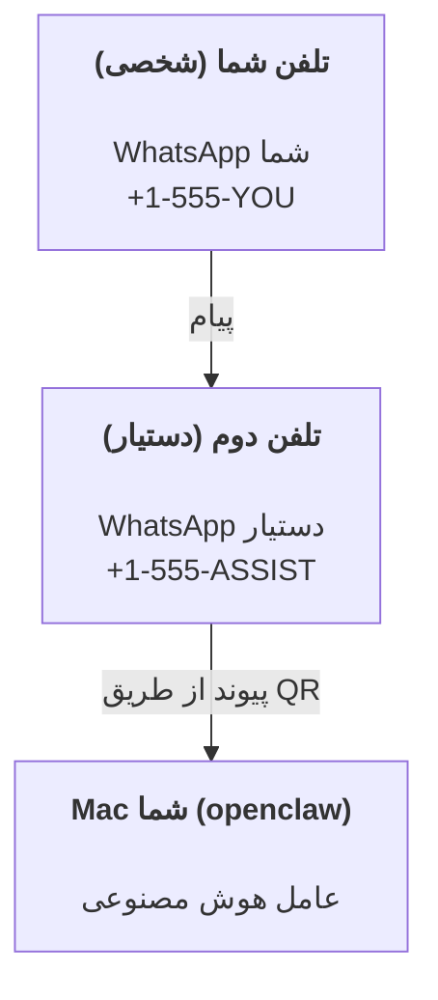

---
read_when:
    - راه‌اندازی اولیه یک نمونهٔ جدید دستیار
    - بررسی پیامدهای ایمنی و مجوزها
summary: راهنمای سرتاسری اجرای OpenClaw به‌عنوان دستیار شخصی همراه با هشدارهای ایمنی
title: راه‌اندازی دستیار شخصی
x-i18n:
    generated_at: "2026-07-16T17:23:27Z"
    model: gpt-5.6
    postprocess_version: locale-links-v1
    prompt_version: 32
    provider: openai
    source_hash: e8c34e31314f55647059fd600935330110add27b338a675bc0ce1529bebb207d
    source_path: start/openclaw.md
    workflow: 16
---

OpenClaw یک Gateway خودمیزبان است که Discord، Google Chat، iMessage، Matrix، Microsoft Teams، Signal، Slack، Telegram، WhatsApp، Zalo و موارد دیگر را به عامل‌های هوش مصنوعی متصل می‌کند. این راهنما راه‌اندازی «دستیار شخصی» را پوشش می‌دهد: یک شماره اختصاصی WhatsApp که مانند دستیار هوش مصنوعی همیشه‌فعال شما عمل می‌کند.

## ابتدا ایمنی

دادن یک کانال به عامل، آن را در موقعیتی قرار می‌دهد که بتواند فرمان‌هایی را روی دستگاه شما اجرا کند (بسته به خط‌مشی ابزار شما)، فایل‌های فضای کاری‌تان را بخواند/بنویسد و از طریق هر کانال متصل، پیام ارسال کند. در ابتدا محافظه‌کارانه عمل کنید:

- همیشه `channels.whatsapp.allowFrom` را تنظیم کنید (هرگز آن را روی Mac شخصی خود برای همه جهان باز نگذارید).
- برای دستیار از یک شماره اختصاصی WhatsApp استفاده کنید.
- Heartbeatها به‌طور پیش‌فرض هر 30 دقیقه اجرا می‌شوند. تا زمانی که به راه‌اندازی اعتماد نکرده‌اید، با تنظیم `agents.defaults.heartbeat.every: "0m"` آن‌ها را غیرفعال کنید.

## پیش‌نیازها

- OpenClaw نصب و راه‌اندازی اولیه شده باشد — اگر هنوز این کار را انجام نداده‌اید، به [شروع به کار](/fa/start/getting-started) مراجعه کنید
- یک شماره تلفن دوم (SIM/eSIM/اعتباری) برای دستیار

## راه‌اندازی با دو تلفن (توصیه‌شده)

هدف چنین ساختاری است:



اگر WhatsApp شخصی خود را به OpenClaw پیوند دهید، هر پیامی که برای شما ارسال شود به «ورودی عامل» تبدیل می‌شود. این به‌ندرت چیزی است که می‌خواهید.

## شروع سریع 5 دقیقه‌ای

1. WhatsApp Web را جفت کنید (QR نمایش داده می‌شود؛ آن را با تلفن دستیار اسکن کنید):

```bash
openclaw channels login
```

2. Gateway را راه‌اندازی کنید (آن را در حال اجرا نگه دارید):

```bash
openclaw gateway --port 18789
```

3. یک پیکربندی حداقلی در `~/.openclaw/openclaw.json` قرار دهید:

```json5
{
  gateway: { mode: "local" },
  channels: { whatsapp: { allowFrom: ["+15555550123"] } },
}
```

اکنون از تلفنی که در فهرست مجاز قرار دارد، به شماره دستیار پیام دهید.

پس از پایان راه‌اندازی اولیه، OpenClaw داشبورد را به‌طور خودکار باز می‌کند و یک پیوند تمیز (بدون توکن) نمایش می‌دهد. اگر داشبورد احراز هویت درخواست کرد، رمز مشترک پیکربندی‌شده را در تنظیمات Control UI جای‌گذاری کنید. راه‌اندازی اولیه به‌طور پیش‌فرض از توکن استفاده می‌کند (`gateway.auth.token`)، اما اگر `gateway.auth.mode` را به `password` تغییر داده باشید، احراز هویت با گذرواژه نیز کار می‌کند. برای بازکردن دوباره در آینده: `openclaw dashboard`.

## اختصاص فضای کاری به عامل (AGENTS)

OpenClaw دستورالعمل‌های عملیاتی و «حافظه» را از پوشه فضای کاری خود می‌خواند.

OpenClaw به‌طور پیش‌فرض از `~/.openclaw/workspace` به‌عنوان فضای کاری عامل استفاده می‌کند و آن را (همراه با فایل‌های آغازین `AGENTS.md`، `SOUL.md`، `TOOLS.md`، `IDENTITY.md`، `USER.md` و `HEARTBEAT.md`) هنگام راه‌اندازی اولیه یا نخستین اجرای عامل به‌طور خودکار ایجاد می‌کند. `BOOTSTRAP.md` فقط برای یک فضای کاری کاملاً جدید ایجاد می‌شود و پس از حذف نباید دوباره ظاهر شود. `MEMORY.md` اختیاری است و هرگز به‌طور خودکار ایجاد نمی‌شود؛ در صورت وجود، برای نشست‌های عادی بارگذاری می‌شود. نشست‌های عامل فرعی فقط `AGENTS.md` و `TOOLS.md` را تزریق می‌کنند.

<Tip>
این پوشه را مانند حافظه OpenClaw در نظر بگیرید و آن را به یک مخزن git (ترجیحاً خصوصی) تبدیل کنید تا از `AGENTS.md` و فایل‌های حافظه نسخه پشتیبان تهیه شود. اگر git نصب باشد، فضاهای کاری کاملاً جدید به‌طور خودکار با `git init` مقداردهی اولیه می‌شوند.
</Tip>

برای ایجاد پوشه‌های فضای کاری و پیکربندی بدون اجرای راهنمای کامل راه‌اندازی اولیه:

```bash
openclaw setup --baseline
```

(`openclaw setup` به‌تنهایی نام مستعار `openclaw onboard` است و راهنمای تعاملی کامل را اجرا می‌کند.)

راهنمای کامل چیدمان فضای کاری و پشتیبان‌گیری: [فضای کاری عامل](/fa/concepts/agent-workspace)
گردش‌کار حافظه: [حافظه](/fa/concepts/memory)

اختیاری: با `agents.defaults.workspace` فضای کاری دیگری انتخاب کنید (از `~` پشتیبانی می‌کند).

```json5
{
  agents: {
    defaults: {
      workspace: "~/.openclaw/workspace",
    },
  },
}
```

اگر فایل‌های فضای کاری خود را از یک مخزن ارائه می‌کنید، می‌توانید ایجاد فایل‌های راه‌اندازی اولیه را کاملاً غیرفعال کنید:

```json5
{
  agents: {
    defaults: {
      skipBootstrap: true,
    },
  },
}
```

## پیکربندی‌ای که آن را به «دستیار» تبدیل می‌کند

تنظیمات پیش‌فرض OpenClaw برای یک دستیار مناسب است، اما معمولاً بهتر است موارد زیر را تنظیم کنید:

- شخصیت/دستورالعمل‌ها در [`SOUL.md`](/fa/concepts/soul)
- تنظیمات پیش‌فرض تفکر (در صورت تمایل)
- Heartbeatها (پس از آنکه به راه‌اندازی اعتماد کردید)

نمونه:

```json5
{
  logging: { level: "info" },
  agents: {
    defaults: {
      model: { primary: "anthropic/claude-opus-4-8" },
      workspace: "~/.openclaw/workspace",
      thinkingDefault: "high",
      timeoutSeconds: 1800,
      // ابتدا روی 0 بگذارید؛ بعداً فعال کنید.
      heartbeat: { every: "0m" },
    },
    list: [
      {
        id: "main",
        default: true,
        groupChat: {
          mentionPatterns: ["@openclaw", "openclaw"],
        },
      },
    ],
  },
  channels: {
    whatsapp: {
      allowFrom: ["+15555550123"],
      groups: {
        "*": { requireMention: true },
      },
    },
  },
  session: {
    scope: "per-sender",
    resetTriggers: ["/new", "/reset"],
    reset: {
      mode: "daily",
      atHour: 4,
      idleMinutes: 10080,
    },
  },
}
```

## نشست‌ها و حافظه

- ردیف‌های نشست، ردیف‌های رونوشت و فراداده‌ها (مصرف توکن، آخرین مسیر و غیره): `~/.openclaw/agents/<agentId>/agent/openclaw-agent.sqlite`
- مصنوعات قدیمی/بایگانی‌شده رونوشت: `~/.openclaw/agents/<agentId>/sessions/`
- منبع مهاجرت ردیف‌های قدیمی: `~/.openclaw/agents/<agentId>/sessions/sessions.json`
- `/new` یا `/reset` یک نشست جدید برای آن گفت‌وگو آغاز می‌کند (از طریق `session.resetTriggers` قابل پیکربندی است). اگر به‌تنهایی ارسال شود، OpenClaw بدون فراخوانی مدل، بازنشانی را تأیید می‌کند.
- `/compact [instructions]` زمینه نشست را فشرده می‌کند و بودجه باقی‌مانده زمینه را گزارش می‌دهد.

## Heartbeatها (حالت پیش‌دستانه)

OpenClaw به‌طور پیش‌فرض هر 30 دقیقه یک Heartbeat را با این پرامپت اجرا می‌کند:
`Read HEARTBEAT.md if it exists (workspace context). Follow it strictly. Do not infer or repeat old tasks from prior chats. If nothing needs attention, reply HEARTBEAT_OK.`
برای غیرفعال‌کردن، `agents.defaults.heartbeat.every: "0m"` را تنظیم کنید.

- اگر `HEARTBEAT.md` وجود داشته باشد اما عملاً خالی باشد (فقط خطوط خالی، توضیحات Markdown/HTML، عنوان‌های Markdown مانند `# Heading`، نشانگرهای حصار یا جای‌نگهدارهای خالی چک‌لیست)، OpenClaw برای صرفه‌جویی در فراخوانی‌های API اجرای Heartbeat را نادیده می‌گیرد.
- اگر فایل وجود نداشته باشد، Heartbeat همچنان اجرا می‌شود و مدل تصمیم می‌گیرد چه کاری انجام دهد.
- اگر عامل با `HEARTBEAT_OK` پاسخ دهد (در صورت تمایل همراه با حاشیه کوتاه؛ به `agents.defaults.heartbeat.ackMaxChars` مراجعه کنید)، OpenClaw ارسال خروجی آن Heartbeat را متوقف می‌کند.
- به‌طور پیش‌فرض، ارسال Heartbeat به مقصدهای `user:<id>` به سبک پیام مستقیم مجاز است. برای متوقف‌کردن ارسال به مقصد مستقیم در حالی که اجرای Heartbeat فعال می‌ماند، `agents.defaults.heartbeat.directPolicy: "block"` را تنظیم کنید.
- Heartbeatها چرخه کامل عامل را اجرا می‌کنند — فاصله‌های کوتاه‌تر توکن بیشتری مصرف می‌کنند.

```json5
{
  agents: {
    defaults: {
      heartbeat: { every: "30m" },
    },
  },
}
```

## رسانه ورودی و خروجی

پیوست‌های ورودی (تصاویر/صدا/اسناد) را می‌توان از طریق قالب‌ها در اختیار فرمان قرار داد:

- `{{MediaPath}}` (مسیر فایل موقت محلی)
- `{{MediaUrl}}` (شبه‌نشانی اینترنتی)
- `{{Transcript}}` (اگر رونویسی صدا فعال باشد)

پیوست‌های خروجی عامل از فیلدهای ساختاریافته رسانه در ابزار پیام یا محموله پاسخ استفاده می‌کنند؛ مانند `media`، `mediaUrl`، `mediaUrls`، `path` یا `filePath`. نمونه آرگومان‌های ابزار پیام:

```json
{
  "message": "این هم تصویر صفحه.",
  "mediaUrl": "https://example.com/screenshot.png"
}
```

OpenClaw رسانه ساختاریافته را همراه متن ارسال می‌کند. پاسخ‌های نهایی قدیمی دستیار ممکن است همچنان برای سازگاری نرمال‌سازی شوند، اما خروجی ابزار، خروجی مرورگر، بلوک‌های جریانی و کنش‌های پیام، متن را به‌عنوان فرمان پیوست تجزیه نمی‌کنند.

رفتار مسیر محلی از همان مدل اعتماد خواندن فایل عامل پیروی می‌کند:

- اگر `tools.fs.workspaceOnly` برابر با `true` باشد، مسیرهای رسانه محلی خروجی به ریشه موقت OpenClaw، حافظه نهان رسانه، مسیرهای فضای کاری عامل و فایل‌های تولیدشده در محیط ایزوله محدود می‌مانند.
- اگر `tools.fs.workspaceOnly` برابر با `false` باشد، رسانه محلی خروجی می‌تواند از فایل‌های محلی میزبان که عامل از قبل اجازه خواندنشان را دارد استفاده کند.
- مسیرهای محلی می‌توانند مطلق، نسبی به فضای کاری یا با استفاده از `~/` نسبی به پوشه خانگی باشند.
- ارسال‌های محلی میزبان همچنان فقط رسانه و انواع سند امن را مجاز می‌دانند (تصاویر، صدا، ویدئو، PDF، اسناد Office و اسناد متنی اعتبارسنجی‌شده مانند Markdown/MD، TXT، JSON، YAML و YML). این گسترشی از مرز اعتماد موجود برای خواندن میزبان است، نه یک پویشگر اسرار: اگر عامل بتواند یک `secret.txt` یا `config.json` محلی میزبان را بخواند، هنگامی که پسوند و اعتبارسنجی محتوا مطابقت داشته باشند می‌تواند آن فایل را پیوست کند.

فایل‌های حساس را خارج از سامانه فایل قابل‌خواندن برای عامل نگه دارید، یا برای ارسال‌های مسیر محلی سخت‌گیرانه‌تر، `tools.fs.workspaceOnly: true` را حفظ کنید.

## چک‌لیست عملیات

```bash
openclaw status          # وضعیت محلی (اعتبارنامه‌ها، نشست‌ها، رویدادهای صف‌شده)
openclaw status --all    # تشخیص کامل (فقط‌خواندنی، قابل جای‌گذاری)
openclaw status --deep   # بررسی کانال‌ها (WhatsApp Web + Telegram + Discord + Slack + Signal)
openclaw health --json   # نمای فوری سلامت Gateway از طریق اتصال WS
```

گزارش‌ها در `/tmp/openclaw/` قرار دارند (پیش‌فرض: `openclaw-YYYY-MM-DD.log`).

## گام‌های بعدی

- WebChat: [WebChat](/fa/web/webchat)
- عملیات Gateway: [راهنمای عملیاتی Gateway](/fa/gateway)
- Cron و بیدارسازی‌ها: [کارهای Cron](/fa/automation/cron-jobs)
- همراه نوار منوی macOS: [برنامه macOS برای OpenClaw](/fa/platforms/macos)
- برنامه Node برای iOS: [برنامه iOS](/fa/platforms/ios)
- برنامه Node برای Android: [برنامه Android](/fa/platforms/android)
- مرکز Windows: [Windows](/fa/platforms/windows)
- وضعیت Linux: [برنامه Linux](/fa/platforms/linux)
- امنیت: [امنیت](/fa/gateway/security)

## مرتبط

- [شروع به کار](/fa/start/getting-started)
- [راه‌اندازی](/fa/start/setup)
- [نمای کلی کانال‌ها](/fa/channels)
