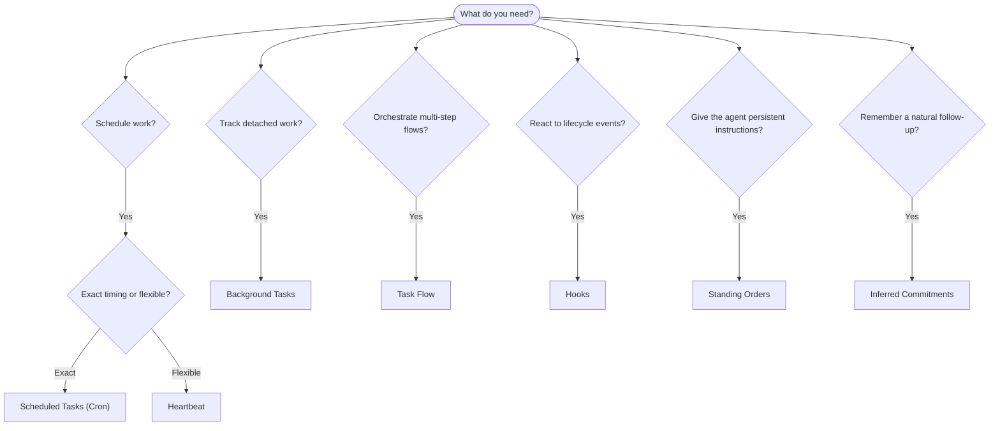

OpenClaw exécute le travail en arrière-plan au moyen de tâches, de travaux planifiés, d’engagements inférés, de hooks d’événements et d’instructions permanentes. Cette page vous aide à choisir le bon mécanisme et à comprendre comment ils s’articulent.

## Guide de décision rapide

| Cas d’utilisation                         | Recommandé                | Pourquoi                                       |
| ----------------------------------------- | ------------------------- | ---------------------------------------------- |
| Envoyer un rapport quotidien à 9 h pile   | Tâches planifiées (Cron)  | Horaire exact, exécution isolée                |
| Me rappeler dans 20 minutes               | Tâches planifiées (Cron)  | Exécution unique avec horaire précis (`--at`)  |
| Exécuter une analyse approfondie hebdomadaire | Tâches planifiées (Cron) | Tâche autonome, peut utiliser un autre modèle  |
| Vérifier la boîte de réception toutes les 30 min | Heartbeat           | Regroupé avec d’autres vérifications, conscient du contexte |
| Surveiller le calendrier pour les événements à venir | Heartbeat        | Adapté naturellement à une attention périodique |
| Faire un suivi après un entretien mentionné | Engagements inférés     | Suivi de type mémoire, sans demande de rappel exact |
| Suivi bienveillant après un contexte utilisateur | Engagements inférés | Limité au même agent et au même canal          |
| Inspecter l’état d’un sous-agent ou d’une exécution ACP | Tâches en arrière-plan | Le registre des tâches suit tout le travail détaché |
| Auditer ce qui s’est exécuté et quand      | Tâches en arrière-plan    | `openclaw tasks list` et `openclaw tasks audit` |
| Recherche en plusieurs étapes puis synthèse | Flux de tâches           | Orchestration durable avec suivi des révisions |
| Exécuter un script à la réinitialisation de session | Hooks              | Piloté par les événements, déclenché lors des événements de cycle de vie |
| Exécuter du code à chaque appel d’outil    | Hooks de Plugin          | Les hooks en processus peuvent intercepter les appels d’outils |
| Toujours vérifier la conformité avant de répondre | Instructions permanentes | Injectées automatiquement dans chaque session |

### Tâches planifiées (Cron) vs Heartbeat

| Dimension       | Tâches planifiées (Cron)             | Heartbeat                             |
| --------------- | ------------------------------------ | ------------------------------------- |
| Horaire         | Exact (expressions cron, exécution unique) | Approximatif (par défaut toutes les 30 min) |
| Contexte de session | Frais (isolé) ou partagé         | Contexte complet de la session principale |
| Enregistrements de tâches | Toujours créés              | Jamais créés                          |
| Livraison       | Canal, webhook ou silencieuse        | Inline dans la session principale     |
| Idéal pour      | Rapports, rappels, travaux en arrière-plan | Vérifications de boîte de réception, calendrier, notifications |

Utilisez les tâches planifiées (Cron) lorsque vous avez besoin d’un horaire précis ou d’une exécution isolée. Utilisez Heartbeat lorsque le travail bénéficie du contexte complet de la session et qu’un horaire approximatif convient.

## Concepts fondamentaux

### Tâches planifiées (cron)

Cron est le planificateur intégré du Gateway pour les horaires précis. Il persiste les travaux, réveille l’agent au bon moment et peut livrer la sortie vers un canal de chat ou un endpoint webhook. Il prend en charge les rappels uniques, les expressions récurrentes et les déclencheurs webhook entrants.

Voir [Tâches planifiées](/fr/automation/cron-jobs).

### Tâches

Le registre des tâches en arrière-plan suit tout le travail détaché : exécutions ACP, lancements de sous-agents, exécutions cron isolées et opérations CLI. Les tâches sont des enregistrements, pas des planificateurs. Utilisez `openclaw tasks list` et `openclaw tasks audit` pour les inspecter.

Voir [Tâches en arrière-plan](/fr/automation/tasks).

### Engagements inférés

Les engagements sont des mémoires de suivi optionnelles et de courte durée. OpenClaw les infère à partir des conversations normales, les limite au même agent et au même canal, et livre les suivis arrivés à échéance via Heartbeat. Les rappels exacts demandés par l’utilisateur relèvent toujours de cron.

Voir [Engagements inférés](/fr/concepts/commitments).

### Flux de tâches

Le flux de tâches est le substrat d’orchestration de flux au-dessus des tâches en arrière-plan. Il gère des flux durables en plusieurs étapes avec des modes de synchronisation gérés et miroirs, le suivi des révisions, et `openclaw tasks flow list|show|cancel` pour l’inspection.

Voir [Flux de tâches](/fr/automation/taskflow).

### Instructions permanentes

Les instructions permanentes accordent à l’agent une autorité opérationnelle permanente pour des programmes définis. Elles résident dans les fichiers de l’espace de travail (généralement `AGENTS.md`) et sont injectées dans chaque session. Combinez-les avec cron pour une application basée sur le temps.

Voir [Instructions permanentes](/fr/automation/standing-orders).

### Hooks

Les hooks internes sont des scripts pilotés par les événements, déclenchés par les événements de cycle de vie de l’agent (`/new`, `/reset`, `/stop`), la Compaction de session, le démarrage du Gateway et le flux de messages. Ils sont automatiquement découverts à partir de répertoires et peuvent être gérés avec `openclaw hooks`. Pour l’interception en processus des appels d’outils, utilisez les [hooks de Plugin](/fr/plugins/hooks).

Voir [Hooks](/fr/automation/hooks).

### Heartbeat

Heartbeat est un tour périodique de session principale (par défaut toutes les 30 minutes). Il regroupe plusieurs vérifications (boîte de réception, calendrier, notifications) dans un seul tour d’agent avec le contexte complet de la session. Les tours Heartbeat ne créent pas d’enregistrements de tâches et ne prolongent pas la fraîcheur de réinitialisation quotidienne/inactive de la session. Utilisez `HEARTBEAT.md` pour une petite liste de contrôle, ou un bloc `tasks:` lorsque vous voulez des vérifications périodiques uniquement à échéance dans Heartbeat lui-même. Les fichiers Heartbeat vides sont ignorés avec `empty-heartbeat-file` ; le mode de tâches uniquement à échéance est ignoré avec `no-tasks-due`. Les Heartbeats sont différés pendant que le travail cron est actif ou en file d’attente, et `heartbeat.skipWhenBusy` peut aussi les différer lorsque des sous-agents ou des voies imbriquées sont occupés.

Voir [Heartbeat](/fr/gateway/heartbeat).

## Comment ils fonctionnent ensemble

- **Cron** gère les planifications précises (rapports quotidiens, revues hebdomadaires) et les rappels uniques. Toutes les exécutions cron créent des enregistrements de tâches.
- **Heartbeat** gère la surveillance routinière (boîte de réception, calendrier, notifications) dans un tour regroupé toutes les 30 minutes.
- **Hooks** réagissent à des événements spécifiques (réinitialisations de session, Compaction, flux de messages) avec des scripts personnalisés. Les hooks de Plugin couvrent les appels d’outils.
- **Instructions permanentes** donnent à l’agent un contexte persistant et des limites d’autorité.
- **Flux de tâches** coordonne les flux en plusieurs étapes au-dessus des tâches individuelles.
- **Tâches** suit automatiquement tout le travail détaché pour que vous puissiez l’inspecter et l’auditer.

## Connexe

- [Tâches planifiées](/fr/automation/cron-jobs) — planification précise et rappels uniques
- [Engagements inférés](/fr/concepts/commitments) — suivis de type mémoire
- [Tâches en arrière-plan](/fr/automation/tasks) — registre des tâches pour tout le travail détaché
- [Flux de tâches](/fr/automation/taskflow) — orchestration durable de flux en plusieurs étapes
- [Hooks](/fr/automation/hooks) — scripts de cycle de vie pilotés par les événements
- [Hooks de Plugin](/fr/plugins/hooks) — hooks en processus pour outils, prompts, messages et cycle de vie
- [Instructions permanentes](/fr/automation/standing-orders) — instructions persistantes de l’agent
- [Heartbeat](/fr/gateway/heartbeat) — tours périodiques de session principale
- [Référence de configuration](/fr/gateway/configuration-reference) — toutes les clés de configuration
