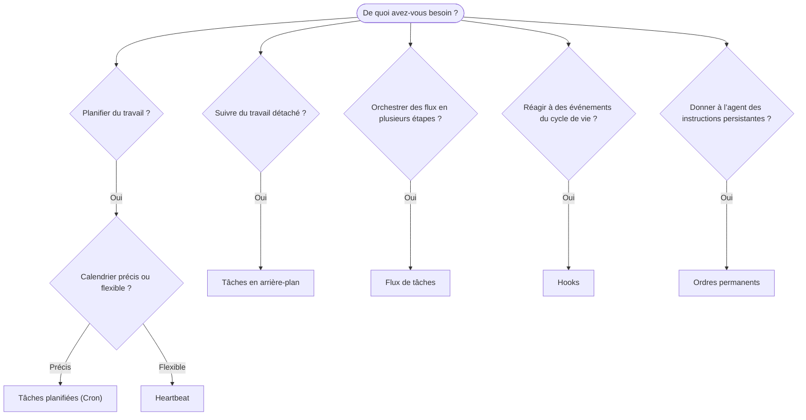

---
read_when:
    - Décider comment automatiser le travail avec OpenClaw
    - Choisir entre Heartbeat, Cron, hooks et ordres permanents
    - Trouver le bon point d’entrée pour l’automatisation
summary: 'Aperçu des mécanismes d’automatisation : tâches, Cron, hooks, ordres permanents et flux de tâches'
title: Automatisation et tâches
x-i18n:
    generated_at: "2026-04-26T11:23:06Z"
    model: gpt-5.4
    provider: openai
    source_hash: 6d2a2d3ef58830133e07b34f33c611664fc1032247e9dd81005adf7fc0c43cdb
    source_path: automation/index.md
    workflow: 15
---

OpenClaw exécute du travail en arrière-plan au moyen de tâches, de tâches planifiées, de hooks d’événements et d’instructions permanentes. Cette page vous aide à choisir le bon mécanisme et à comprendre comment ils s’articulent.

## Guide de décision rapide

| Cas d’usage                            | Recommandé             | Pourquoi                                        |
| -------------------------------------- | ---------------------- | ------------------------------------------------ |
| Envoyer un rapport quotidien à 9 h pile | Tâches planifiées (Cron) | Horaire précis, exécution isolée               |
| Me rappeler dans 20 minutes            | Tâches planifiées (Cron) | Exécution unique avec horaire précis (`--at`)  |
| Exécuter une analyse approfondie hebdomadaire | Tâches planifiées (Cron) | Tâche autonome, peut utiliser un modèle différent |
| Vérifier la boîte de réception toutes les 30 min | Heartbeat              | Regroupé avec d’autres vérifications, sensible au contexte |
| Surveiller le calendrier pour les événements à venir | Heartbeat              | Correspond naturellement à une veille périodique |
| Inspecter l’état d’un sous-agent ou d’une exécution ACP | Tâches en arrière-plan | Le registre des tâches suit tout le travail détaché |
| Auditer ce qui a été exécuté et quand  | Tâches en arrière-plan | `openclaw tasks list` et `openclaw tasks audit` |
| Recherche en plusieurs étapes puis résumé | Flux de tâches         | Orchestration durable avec suivi des révisions   |
| Exécuter un script lors de la réinitialisation de session | Hooks                  | Piloté par les événements, se déclenche sur les événements du cycle de vie |
| Exécuter du code à chaque appel d’outil | Hooks de Plugin        | Les hooks en processus peuvent intercepter les appels d’outil |
| Toujours vérifier la conformité avant de répondre | Ordres permanents      | Injectés automatiquement dans chaque session     |

### Tâches planifiées (Cron) vs Heartbeat

| Dimension       | Tâches planifiées (Cron)           | Heartbeat                            |
| --------------- | ---------------------------------- | ------------------------------------ |
| Calendrier      | Précis (expressions cron, exécution unique) | Approximatif (par défaut toutes les 30 min) |
| Contexte de session | Neuf (isolé) ou partagé         | Contexte complet de la session principale |
| Enregistrements de tâches | Toujours créés            | Jamais créés                         |
| Livraison       | Canal, Webhook ou silencieuse      | En ligne dans la session principale  |
| Idéal pour      | Rapports, rappels, tâches en arrière-plan | Vérifications de boîte de réception, calendrier, notifications |

Utilisez les tâches planifiées (Cron) lorsque vous avez besoin d’un horaire précis ou d’une exécution isolée. Utilisez Heartbeat lorsque le travail bénéficie du contexte complet de la session et qu’un calendrier approximatif convient.

## Concepts de base

### Tâches planifiées (cron)

Cron est le planificateur intégré du Gateway pour un calendrier précis. Il conserve les tâches, réveille l’agent au bon moment et peut envoyer la sortie vers un canal de discussion ou un point de terminaison Webhook. Il prend en charge les rappels à exécution unique, les expressions récurrentes et les déclencheurs Webhook entrants.

Voir [Tâches planifiées](/fr/automation/cron-jobs).

### Tâches

Le registre des tâches en arrière-plan suit tout le travail détaché : exécutions ACP, lancements de sous-agents, exécutions cron isolées et opérations CLI. Les tâches sont des enregistrements, pas des planificateurs. Utilisez `openclaw tasks list` et `openclaw tasks audit` pour les inspecter.

Voir [Tâches en arrière-plan](/fr/automation/tasks).

### Flux de tâches

Task Flow est le substrat d’orchestration de flux au-dessus des tâches en arrière-plan. Il gère des flux durables en plusieurs étapes avec des modes de synchronisation gérés et miroir, le suivi des révisions, et `openclaw tasks flow list|show|cancel` pour l’inspection.

Voir [Task Flow](/fr/automation/taskflow).

### Ordres permanents

Les ordres permanents accordent à l’agent une autorité opérationnelle permanente pour des programmes définis. Ils résident dans des fichiers d’espace de travail (généralement `AGENTS.md`) et sont injectés dans chaque session. Combinez-les avec cron pour une application basée sur le temps.

Voir [Ordres permanents](/fr/automation/standing-orders).

### Hooks

Les hooks internes sont des scripts pilotés par les événements, déclenchés par des événements du cycle de vie de l’agent
(`/new`, `/reset`, `/stop`), la Compaction de session, le démarrage du gateway et le
flux de messages. Ils sont automatiquement découverts à partir de répertoires et peuvent être gérés
avec `openclaw hooks`. Pour l’interception en processus des appels d’outil, utilisez
[les hooks de Plugin](/fr/plugins/hooks).

Voir [Hooks](/fr/automation/hooks).

### Heartbeat

Heartbeat est un tour périodique de la session principale (par défaut toutes les 30 minutes). Il regroupe plusieurs vérifications (boîte de réception, calendrier, notifications) en un seul tour d’agent avec le contexte complet de la session. Les tours Heartbeat ne créent pas d’enregistrements de tâches et n’étendent pas la fraîcheur de réinitialisation quotidienne/inactivité de la session. Utilisez `HEARTBEAT.md` pour une petite liste de contrôle, ou un bloc `tasks:` si vous souhaitez des vérifications périodiques uniquement à échéance dans heartbeat lui-même. Les fichiers heartbeat vides sont ignorés en tant que `empty-heartbeat-file` ; le mode tâche uniquement à échéance est ignoré en tant que `no-tasks-due`.

Voir [Heartbeat](/fr/gateway/heartbeat).

## Comment ils fonctionnent ensemble

- **Cron** gère les calendriers précis (rapports quotidiens, revues hebdomadaires) et les rappels à exécution unique. Toutes les exécutions cron créent des enregistrements de tâches.
- **Heartbeat** gère la surveillance de routine (boîte de réception, calendrier, notifications) dans un seul tour regroupé toutes les 30 minutes.
- **Hooks** réagissent à des événements spécifiques (réinitialisations de session, Compaction, flux de messages) avec des scripts personnalisés. Les hooks de Plugin couvrent les appels d’outil.
- **Ordres permanents** donnent à l’agent un contexte persistant et des limites d’autorité.
- **Task Flow** coordonne les flux en plusieurs étapes au-dessus des tâches individuelles.
- **Tâches** suivent automatiquement tout le travail détaché afin que vous puissiez l’inspecter et l’auditer.

## Lié

- [Tâches planifiées](/fr/automation/cron-jobs) — calendrier précis et rappels à exécution unique
- [Tâches en arrière-plan](/fr/automation/tasks) — registre des tâches pour tout le travail détaché
- [Task Flow](/fr/automation/taskflow) — orchestration durable de flux en plusieurs étapes
- [Hooks](/fr/automation/hooks) — scripts de cycle de vie pilotés par les événements
- [Hooks de Plugin](/fr/plugins/hooks) — hooks en processus pour les outils, prompts, messages et cycle de vie
- [Ordres permanents](/fr/automation/standing-orders) — instructions persistantes de l’agent
- [Heartbeat](/fr/gateway/heartbeat) — tours périodiques de la session principale
- [Référence de configuration](/fr/gateway/configuration-reference) — toutes les clés de configuration
