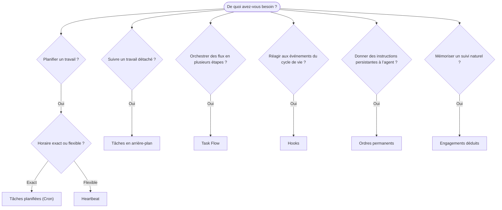

OpenClaw exécute des travaux en arrière-plan au moyen de tâches, de travaux planifiés, d’engagements déduits, de hooks d’événements et d’instructions permanentes. Utilisez cette page pour choisir le mécanisme approprié.

## Guide de décision rapide

| Cas d’utilisation                                      | Recommandation            | Pourquoi                                                        |
| ------------------------------------------------------ | ------------------------- | --------------------------------------------------------------- |
| Envoyer un rapport quotidien à 9 h précises            | Tâches planifiées (Cron)  | Horaire exact, exécution isolée                                 |
| Me faire un rappel dans 20 minutes                     | Tâches planifiées (Cron)  | Exécution unique à un horaire précis (`--at`)                   |
| Exécuter une analyse approfondie chaque semaine        | Tâches planifiées (Cron)  | Tâche autonome, peut utiliser un modèle différent               |
| Vérifier la boîte de réception toutes les 30 min       | Heartbeat                 | Regroupement avec d’autres vérifications, selon le contexte     |
| Surveiller les événements à venir du calendrier        | Heartbeat                 | Naturellement adapté à une veille périodique                    |
| Reprendre contact après un entretien mentionné         | Engagements déduits       | Suivi semblable à un souvenir, sans demande de rappel exact     |
| Suivi attentionné après un contexte fourni             | Engagements déduits       | Limité au même agent et au même canal                           |
| Vérifier l’état d’un sous-agent ou d’une exécution ACP | Tâches en arrière-plan    | Le registre des tâches suit tous les travaux détachés           |
| Auditer les exécutions et leurs horaires               | Tâches en arrière-plan    | `openclaw tasks list` et `openclaw tasks audit`                 |
| Effectuer une recherche en plusieurs étapes puis résumer | Task Flow               | Orchestration durable avec suivi des révisions                  |
| Exécuter un script à la réinitialisation de la session | Hooks                     | Piloté par événements, déclenché par les événements du cycle de vie |
| Exécuter du code à chaque appel d’outil                 | Hooks de Plugin           | Les hooks intégrés au processus peuvent intercepter les appels d’outils |
| Toujours vérifier la conformité avant de répondre      | Ordres permanents         | Injectés automatiquement dans chaque session                   |

### Tâches planifiées (Cron) ou Heartbeat

| Dimension             | Tâches planifiées (Cron)                 | Heartbeat                                |
| --------------------- | ---------------------------------------- | ---------------------------------------- |
| Horaire               | Exact (expressions cron, exécution unique) | Approximatif (toutes les 30 min par défaut) |
| Contexte de session   | Nouveau (isolé) ou partagé               | Contexte complet de la session principale |
| Enregistrements de tâches | Toujours créés                       | Jamais créés                             |
| Livraison             | Canal, webhook ou silencieuse            | Intégrée à la session principale         |
| Idéal pour            | Rapports, rappels, travaux en arrière-plan | Vérification des messages, calendrier, notifications |

Utilisez les tâches planifiées (Cron) lorsque vous avez besoin d’un horaire précis ou d’une exécution isolée. Utilisez Heartbeat lorsque le travail bénéficie du contexte complet de la session et qu’un horaire approximatif convient.

## Concepts fondamentaux

### Tâches planifiées (cron)

Cron est le planificateur intégré du Gateway pour les horaires précis. Il conserve les travaux, réveille l’agent au moment opportun et peut envoyer la sortie à un canal de discussion ou à un point de terminaison webhook. Il prend en charge les rappels ponctuels, les expressions récurrentes et les déclencheurs webhook entrants.

Consultez [Tâches planifiées](/fr/automation/cron-jobs).

### Tâches

Le registre des tâches en arrière-plan suit tous les travaux détachés : exécutions ACP, créations de sous-agents, exécutions cron isolées et opérations de la CLI. Les tâches sont des enregistrements, pas des planificateurs. Utilisez `openclaw tasks list` et `openclaw tasks audit` pour les examiner.

Consultez [Tâches en arrière-plan](/fr/automation/tasks).

### Engagements déduits

Les engagements sont des souvenirs de suivi facultatifs et de courte durée. OpenClaw les déduit des conversations ordinaires, les limite au même agent et au même canal, puis transmet les prises de contact arrivées à échéance par Heartbeat. Les rappels précis demandés par l’utilisateur relèvent toujours de Cron.

Consultez [Engagements déduits](/fr/concepts/commitments).

### Task Flow

Task Flow est la couche d’orchestration de flux située au-dessus des tâches en arrière-plan. Il gère des flux durables en plusieurs étapes avec des modes de synchronisation gérés et en miroir, le suivi des révisions et `openclaw tasks flow list|show|cancel` pour leur examen.

Consultez [Task Flow](/fr/automation/taskflow).

### Ordres permanents

Les ordres permanents accordent à l’agent une autorité opérationnelle permanente pour des programmes définis. Ils résident dans des fichiers de l’espace de travail (généralement `AGENTS.md`) et sont injectés dans chaque session. Associez-les à Cron pour une application fondée sur le temps.

Consultez [Ordres permanents](/fr/automation/standing-orders).

### Hooks

Les hooks internes sont des scripts pilotés par événements et déclenchés par les événements du cycle de vie de l’agent (`/new`, `/reset`, `/stop`), la Compaction de session, le démarrage du Gateway et le flux des messages. Ils sont découverts dans les répertoires de hooks et gérés avec `openclaw hooks`. Pour intercepter les appels d’outils au sein du processus, utilisez les [hooks de Plugin](/fr/plugins/hooks).

Consultez [Hooks](/fr/automation/hooks).

### Heartbeat

Heartbeat est un tour périodique de la session principale (toutes les 30 minutes par défaut). Il regroupe plusieurs vérifications (boîte de réception, calendrier, notifications) dans un seul tour de l’agent avec le contexte complet de la session. Les tours Heartbeat ne créent pas d’enregistrements de tâches et ne prolongent pas la fraîcheur de la réinitialisation quotidienne ou pour inactivité de la session. Utilisez `HEARTBEAT.md` pour une courte liste de contrôle, ou un bloc `tasks:` lorsque vous souhaitez effectuer uniquement les vérifications périodiques arrivées à échéance dans Heartbeat lui-même. Les fichiers Heartbeat vides sont ignorés avec `empty-heartbeat-file` ; le mode de tâches limité aux échéances est ignoré avec `no-tasks-due`. Les Heartbeats sont différés tant qu’un travail Cron est actif ou en file d’attente, et `heartbeat.skipWhenBusy` peut également différer un agent lorsque les voies de sous-agent liées à la clé de session de ce même agent ou ses voies imbriquées sont occupées.

Consultez [Heartbeat](/fr/gateway/heartbeat).

## Fonctionnement conjoint

- **Cron** gère les horaires précis (rapports quotidiens, révisions hebdomadaires) et les rappels ponctuels. Toutes les exécutions Cron créent des enregistrements de tâches.
- **Heartbeat** gère la surveillance courante (boîte de réception, calendrier, notifications) dans un seul tour regroupé toutes les 30 minutes.
- **Les hooks** réagissent à des événements précis (réinitialisations de session, Compaction, flux des messages) au moyen de scripts personnalisés. Les hooks de Plugin couvrent les appels d’outils.
- **Les ordres permanents** donnent à l’agent un contexte persistant et définissent les limites de son autorité.
- **Task Flow** coordonne les flux en plusieurs étapes au-dessus des tâches individuelles.
- **Les tâches** suivent automatiquement tous les travaux détachés afin que vous puissiez les examiner et les auditer.

## Ressources connexes

- [Tâches planifiées](/fr/automation/cron-jobs) — planification précise et rappels ponctuels
- [Engagements déduits](/fr/concepts/commitments) — prises de contact de suivi semblables à des souvenirs
- [Tâches en arrière-plan](/fr/automation/tasks) — registre de tâches pour tous les travaux détachés
- [Task Flow](/fr/automation/taskflow) — orchestration durable de flux en plusieurs étapes
- [Hooks](/fr/automation/hooks) — scripts du cycle de vie pilotés par événements
- [Hooks de Plugin](/fr/plugins/hooks) — hooks intégrés au processus pour les outils, les invites, les messages et le cycle de vie
- [Ordres permanents](/fr/automation/standing-orders) — instructions persistantes de l’agent
- [Heartbeat](/fr/gateway/heartbeat) — tours périodiques de la session principale
- [Référence de configuration](/fr/gateway/configuration-reference) — toutes les clés de configuration
