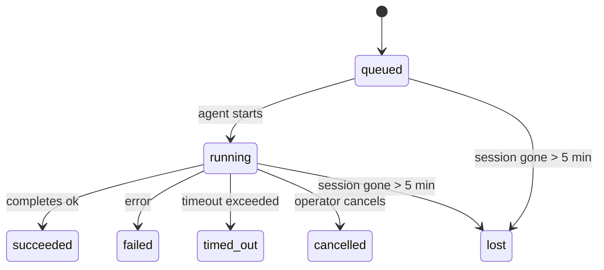

---
read_when:
    - Inspection du travail en arrière-plan en cours ou récemment terminé
    - Débogage des échecs de livraison lors des exécutions d’agents détachées
    - Comprendre comment les exécutions en arrière-plan se rapportent aux sessions, à Cron et à Heartbeat
sidebarTitle: Background tasks
summary: Suivi des tâches en arrière-plan pour les exécutions ACP, les sous-agents, les tâches Cron isolées et les opérations CLI
title: Tâches en arrière-plan
x-i18n:
    generated_at: "2026-05-10T19:21:02Z"
    model: gpt-5.5
    provider: openai
    source_hash: 5764a89634f90181d826ff3990ec8dac9538239074934d30fd446c1eb4564869
    source_path: automation/tasks.md
    workflow: 16
---

<Note>
Vous cherchez la planification ? Consultez [Automatisation et tâches](/fr/automation) pour choisir le mécanisme approprié. Cette page est le registre d’activité du travail en arrière-plan, pas le planificateur.
</Note>

Les tâches en arrière-plan suivent le travail qui s’exécute **en dehors de votre session de conversation principale** : exécutions ACP, lancements de sous-agents, exécutions de tâches cron isolées et opérations lancées depuis la CLI.

Les tâches ne remplacent **pas** les sessions, les tâches cron ni les Heartbeats : elles constituent le **registre d’activité** qui consigne quel travail détaché a eu lieu, quand, et s’il a réussi.

<Note>
Toutes les exécutions d’agent ne créent pas une tâche. Les tours Heartbeat et les échanges interactifs normaux ne le font pas. Toutes les exécutions cron, les lancements ACP, les lancements de sous-agents et les commandes d’agent CLI le font.
</Note>

## TL;DR

- Les tâches sont des **enregistrements**, pas des planificateurs : cron et Heartbeat décident _quand_ le travail s’exécute, les tâches suivent _ce qui s’est passé_.
- ACP, les sous-agents, toutes les tâches cron et les opérations CLI créent des tâches. Les tours Heartbeat ne le font pas.
- Chaque tâche passe par `queued → running → terminal` (succeeded, failed, timed_out, cancelled ou lost).
- Les tâches cron restent actives tant que le runtime cron possède encore la tâche ; si l’état
  en mémoire du runtime a disparu, la maintenance des tâches vérifie d’abord l’historique durable
  des exécutions cron avant de marquer une tâche comme perdue.
- La complétion est déclenchée par envoi : le travail détaché peut notifier directement ou réveiller
  la session/le Heartbeat demandeur à la fin, de sorte que les boucles d’interrogation du statut sont
  généralement la mauvaise approche.
- Les exécutions cron isolées et les complétions de sous-agents nettoient au mieux les onglets/processus de navigateur suivis pour leur session enfant avant la comptabilité finale du nettoyage.
- La livraison cron isolée supprime les réponses intermédiaires obsolètes du parent tant que le travail des sous-agents descendants est encore en train de se vider, et elle privilégie la sortie finale du descendant quand elle arrive avant la livraison.
- Les notifications de complétion sont livrées directement à un canal ou mises en file d’attente pour le prochain Heartbeat.
- `openclaw tasks list` affiche toutes les tâches ; `openclaw tasks audit` fait remonter les problèmes.
- Les enregistrements terminaux sont conservés pendant 7 jours, puis supprimés automatiquement.

## Démarrage rapide

<Tabs>
  <Tab title="Lister et filtrer">
    ```bash
    # Lister toutes les tâches (les plus récentes d’abord)
    openclaw tasks list

    # Filtrer par runtime ou statut
    openclaw tasks list --runtime acp
    openclaw tasks list --status running
    ```

  </Tab>
  <Tab title="Inspecter">
    ```bash
    # Afficher les détails d’une tâche précise (par ID, ID d’exécution ou clé de session)
    openclaw tasks show <lookup>
    ```
  </Tab>
  <Tab title="Annuler et notifier">
    ```bash
    # Annuler une tâche en cours (tue la session enfant)
    openclaw tasks cancel <lookup>

    # Modifier la stratégie de notification d’une tâche
    openclaw tasks notify <lookup> state_changes
    ```

  </Tab>
  <Tab title="Audit et maintenance">
    ```bash
    # Exécuter un audit de santé
    openclaw tasks audit

    # Prévisualiser ou appliquer la maintenance
    openclaw tasks maintenance
    openclaw tasks maintenance --apply
    ```

  </Tab>
  <Tab title="Flux de tâches">
    ```bash
    # Inspecter l’état TaskFlow
    openclaw tasks flow list
    openclaw tasks flow show <lookup>
    openclaw tasks flow cancel <lookup>
    ```
  </Tab>
</Tabs>

## Ce qui crée une tâche

| Source                 | Type de runtime | Quand un enregistrement de tâche est créé              | Stratégie de notification par défaut |
| ---------------------- | ------------ | ------------------------------------------------------ | --------------------- |
| Exécutions ACP en arrière-plan | `acp`        | Lancement d’une session ACP enfant                     | `done_only`           |
| Orchestration de sous-agents | `subagent`   | Lancement d’un sous-agent via `sessions_spawn`         | `done_only`           |
| Tâches cron (tous types) | `cron`       | Chaque exécution cron (session principale et isolée)   | `silent`              |
| Opérations CLI         | `cli`        | Commandes `openclaw agent` qui passent par le Gateway  | `silent`              |
| Tâches média d’agent   | `cli`        | Exécutions `music_generate`/`video_generate` adossées à une session | `silent`              |

<AccordionGroup>
  <Accordion title="Valeurs par défaut de notification pour cron et les médias">
    Les tâches cron de session principale utilisent la stratégie de notification `silent` par défaut : elles créent des enregistrements pour le suivi mais ne génèrent pas de notifications. Les tâches cron isolées utilisent aussi `silent` par défaut, mais sont plus visibles parce qu’elles s’exécutent dans leur propre session.

    Les exécutions `music_generate` et `video_generate` adossées à une session utilisent aussi la stratégie de notification `silent`. Elles créent quand même des enregistrements de tâche, mais la complétion est renvoyée à la session d’agent d’origine sous forme de réveil interne afin que l’agent puisse écrire lui-même le message de suivi et joindre le média terminé. Les complétions de groupe/canal suivent la stratégie normale de réponse visible, donc l’agent utilise l’outil de message quand la livraison source l’exige. Si l’agent de complétion ne produit pas de preuve de livraison par outil de message dans une route uniquement par outil, OpenClaw envoie directement le repli de complétion au canal d’origine au lieu de laisser le média privé.

  </Accordion>
  <Accordion title="Garde-fou video_generate concurrent">
    Tant qu’une tâche `video_generate` adossée à une session est encore active, l’outil agit aussi comme garde-fou : les appels `video_generate` répétés dans cette même session renvoient le statut de la tâche active au lieu de démarrer une deuxième génération concurrente. Utilisez `action: "status"` quand vous voulez une recherche explicite de progression/statut côté agent.
  </Accordion>
  <Accordion title="Ce qui ne crée pas de tâches">
    - Tours Heartbeat : session principale ; voir [Heartbeat](/fr/gateway/heartbeat)
    - Tours de chat interactif normaux
    - Réponses directes `/command`

  </Accordion>
</AccordionGroup>

## Cycle de vie d’une tâche



| Statut      | Ce que cela signifie                                                     |
| ----------- | -------------------------------------------------------------------------- |
| `queued`    | Créée, en attente du démarrage de l’agent                                  |
| `running`   | Le tour d’agent est en cours d’exécution active                            |
| `succeeded` | Terminée avec succès                                                       |
| `failed`    | Terminée avec une erreur                                                   |
| `timed_out` | A dépassé le délai configuré                                               |
| `cancelled` | Arrêtée par l’opérateur via `openclaw tasks cancel`                        |
| `lost`      | Le runtime a perdu l’état d’appui faisant autorité après un délai de grâce de 5 minutes |

Les transitions se produisent automatiquement : quand l’exécution d’agent associée se termine, le statut de la tâche est mis à jour en conséquence.

La complétion de l’exécution d’agent fait autorité pour les enregistrements de tâche actifs. Une exécution détachée réussie se finalise en `succeeded`, les erreurs d’exécution ordinaires se finalisent en `failed`, et les résultats de délai dépassé ou d’abandon se finalisent en `timed_out`. Si un opérateur a déjà annulé la tâche, ou si le runtime a déjà enregistré un état terminal plus fort comme `failed`, `timed_out` ou `lost`, un signal de réussite ultérieur ne dégrade pas ce statut terminal.

`lost` tient compte du runtime :

- Tâches ACP : les métadonnées de session ACP enfant d’appui ont disparu.
- Tâches de sous-agent : la session enfant d’appui a disparu du magasin de l’agent cible.
- Tâches cron : le runtime cron ne suit plus la tâche comme active et l’historique durable
  des exécutions cron n’indique aucun résultat terminal pour cette exécution. L’audit CLI
  hors ligne ne considère pas son propre état de runtime cron en cours de processus vide comme faisant autorité.
- Tâches CLI : les tâches avec un ID d’exécution/ID source utilisent le contexte d’exécution actif, donc
  les lignes persistantes de session enfant ou de session de chat ne les maintiennent pas en vie après la
  disparition de l’exécution possédée par le Gateway. Les tâches CLI héritées sans identité d’exécution se
  rabattent encore sur la session enfant. Les exécutions `openclaw agent` adossées au Gateway se finalisent aussi
  à partir de leur résultat d’exécution, donc les exécutions terminées ne restent pas actives jusqu’à ce que le balayeur
  les marque comme `lost`.

## Livraison et notifications

Quand une tâche atteint un état terminal, OpenClaw vous notifie. Il existe deux chemins de livraison :

**Livraison directe** : si la tâche a une cible de canal (le `requesterOrigin`), le message de complétion va directement à ce canal (Telegram, Discord, Slack, etc.). Les complétions de tâches de groupe et de canal sont à la place routées par la session demandeuse afin que l’agent parent puisse écrire la réponse visible. Pour les complétions de sous-agent, OpenClaw préserve aussi le routage de fil/sujet lié quand il est disponible et peut compléter un `to` / compte manquant à partir de la route stockée de la session demandeuse (`lastChannel` / `lastTo` / `lastAccountId`) avant d’abandonner la livraison directe.

**Livraison mise en file de session** : si la livraison directe échoue ou si aucune origine n’est définie, la mise à jour est mise en file comme événement système dans la session du demandeur et apparaît au prochain Heartbeat.

<Tip>
La complétion de tâche déclenche un réveil Heartbeat immédiat afin que vous voyiez le résultat rapidement : vous n’avez pas à attendre le prochain tic Heartbeat planifié.
</Tip>

Cela signifie que le flux de travail habituel est fondé sur l’envoi : démarrez une fois le travail détaché, puis laissez le runtime vous réveiller ou vous notifier à la complétion. N’interrogez l’état de tâche que lorsque vous avez besoin de déboguer, d’intervenir ou de lancer un audit explicite.

### Stratégies de notification

Contrôlez la quantité d’informations que vous recevez pour chaque tâche :

| Stratégie             | Ce qui est livré                                                        |
| --------------------- | ----------------------------------------------------------------------- |
| `done_only` (par défaut) | Uniquement l’état terminal (succeeded, failed, etc.) : **c’est la valeur par défaut** |
| `state_changes`       | Chaque transition d’état et mise à jour de progression                  |
| `silent`              | Rien du tout                                                            |

Modifier la stratégie pendant qu’une tâche est en cours :

```bash
openclaw tasks notify <lookup> state_changes
```

## Référence CLI

<AccordionGroup>
  <Accordion title="tasks list">
    ```bash
    openclaw tasks list [--runtime <acp|subagent|cron|cli>] [--status <status>] [--json]
    ```

    Colonnes de sortie : ID de tâche, Type, Statut, Livraison, ID d’exécution, Session enfant, Résumé.

  </Accordion>
  <Accordion title="tasks show">
    ```bash
    openclaw tasks show <lookup>
    ```

    Le jeton de recherche accepte un ID de tâche, un ID d’exécution ou une clé de session. Affiche l’enregistrement complet, y compris le minutage, l’état de livraison, l’erreur et le résumé terminal.

  </Accordion>
  <Accordion title="tasks cancel">
    ```bash
    openclaw tasks cancel <lookup>
    ```

    Pour les tâches ACP et de sous-agent, cela tue la session enfant. Pour les tâches suivies par la CLI, l’annulation est enregistrée dans le registre des tâches (il n’existe pas de handle de runtime enfant séparé). Le statut passe à `cancelled` et une notification de livraison est envoyée le cas échéant.

  </Accordion>
  <Accordion title="tasks notify">
    ```bash
    openclaw tasks notify <lookup> <done_only|state_changes|silent>
    ```
  </Accordion>
  <Accordion title="tasks audit">
    ```bash
    openclaw tasks audit [--json]
    ```

    Fait remonter les problèmes opérationnels. Les constats apparaissent aussi dans `openclaw status` quand des problèmes sont détectés.

    | Constat                   | Gravité    | Déclencheur                                                                                                            |
    | ------------------------- | ---------- | ---------------------------------------------------------------------------------------------------------------------- |
    | `stale_queued`            | warn       | En file d’attente depuis plus de 10 minutes                                                                            |
    | `stale_running`           | error      | En cours d’exécution depuis plus de 30 minutes                                                                         |
    | `lost`                    | warn/error | La propriété de la tâche adossée au runtime a disparu ; les tâches perdues conservées avertissent jusqu’à `cleanupAfter`, puis deviennent des erreurs |
    | `delivery_failed`         | warn       | La livraison a échoué et la politique de notification n’est pas `silent`                                               |
    | `missing_cleanup`         | warn       | Tâche terminale sans horodatage de nettoyage                                                                           |
    | `inconsistent_timestamps` | warn       | Violation de la chronologie (par exemple, terminée avant d’avoir démarré)                                              |

  </Accordion>
  <Accordion title="tasks maintenance">
    ```bash
    openclaw tasks maintenance [--json]
    openclaw tasks maintenance --apply [--json]
    ```

    Utilisez ceci pour prévisualiser ou appliquer la réconciliation, l’horodatage de nettoyage et l’élagage pour les tâches, l’état Task Flow et les lignes obsolètes du registre des sessions d’exécution cron.

    La réconciliation tient compte du runtime :

    - Les tâches ACP/sous-agent vérifient leur session enfant sous-jacente.
    - Les tâches de sous-agent dont la session enfant possède une pierre tombale de récupération après redémarrage sont marquées comme perdues au lieu d’être traitées comme des sessions sous-jacentes récupérables.
    - Les tâches Cron vérifient si le runtime cron possède encore la tâche, puis récupèrent l’état terminal depuis les journaux persistés des exécutions cron/l’état des tâches avant de revenir à `lost`. Seul le processus Gateway fait autorité pour l’ensemble en mémoire des tâches cron actives ; l’audit CLI hors ligne utilise l’historique durable, mais ne marque pas une tâche cron comme perdue uniquement parce que ce Set local est vide.
    - Les tâches CLI avec une identité d’exécution vérifient le contexte d’exécution live propriétaire, pas seulement les lignes de session enfant ou de session de chat.

    Le nettoyage à la fin tient également compte du runtime :

    - La fin d’un sous-agent ferme au mieux les onglets/processus de navigateur suivis pour la session enfant avant que le nettoyage d’annonce continue.
    - La fin d’un cron isolé ferme au mieux les onglets/processus de navigateur suivis pour la session cron avant que l’exécution se démonte complètement.
    - La livraison cron isolée attend, si nécessaire, la suite d’un sous-agent descendant et supprime le texte d’accusé de réception parent obsolète au lieu de l’annoncer.
    - La livraison de fin de sous-agent préfère le dernier texte d’assistant visible ; s’il est vide, elle se rabat sur le dernier texte tool/toolResult assaini, et les exécutions d’appels d’outils terminées uniquement par délai d’expiration peuvent se réduire à un bref résumé de progression partielle. Les exécutions terminales échouées annoncent l’état d’échec sans rejouer le texte de réponse capturé.
    - Les échecs de nettoyage ne masquent pas le résultat réel de la tâche.

    Lors de l’application de la maintenance, OpenClaw supprime également les lignes obsolètes du registre de sessions `cron:<jobId>:run:<uuid>` âgées de plus de 7 jours, tout en préservant les lignes des tâches cron actuellement en cours d’exécution et en laissant intactes les lignes de session non cron.

  </Accordion>
  <Accordion title="tasks flow list | show | cancel">
    ```bash
    openclaw tasks flow list [--status <status>] [--json]
    openclaw tasks flow show <lookup> [--json]
    openclaw tasks flow cancel <lookup>
    ```

    Utilisez ces commandes lorsque le Task Flow orchestrateur est ce qui vous intéresse, plutôt qu’un enregistrement individuel de tâche en arrière-plan.

  </Accordion>
</AccordionGroup>

## Tableau des tâches de chat (`/tasks`)

Utilisez `/tasks` dans n’importe quelle session de chat pour voir les tâches en arrière-plan liées à cette session. Le tableau affiche les tâches actives et récemment terminées avec le runtime, l’état, la durée et les détails de progression ou d’erreur.

Lorsque la session actuelle n’a aucune tâche liée visible, `/tasks` se rabat sur les nombres de tâches locales à l’agent afin que vous obteniez tout de même une vue d’ensemble sans divulguer les détails d’autres sessions.

Pour le registre opérateur complet, utilisez la CLI : `openclaw tasks list`.

## Intégration de l’état (pression des tâches)

`openclaw status` inclut un résumé rapide des tâches :

```
Tasks: 3 queued · 2 running · 1 issues
```

Le résumé indique :

- **active** - nombre de `queued` + `running`
- **failures** - nombre de `failed` + `timed_out` + `lost`
- **byRuntime** - répartition par `acp`, `subagent`, `cron`, `cli`

`/status` comme l’outil `session_status` utilisent un instantané des tâches tenant compte du nettoyage : les tâches actives sont privilégiées, les lignes terminées obsolètes sont masquées et les échecs récents ne s’affichent que lorsqu’il ne reste aucun travail actif. Cela garde la carte d’état centrée sur ce qui compte maintenant.

## Stockage et maintenance

### Où se trouvent les tâches

Les enregistrements de tâches persistent dans SQLite à l’emplacement :

```
$OPENCLAW_STATE_DIR/tasks/runs.sqlite
```

Le registre se charge en mémoire au démarrage du Gateway et synchronise les écritures vers SQLite pour assurer la durabilité entre les redémarrages.
Le Gateway maintient le journal d’écriture anticipée SQLite dans des limites bornées en utilisant le seuil d’autocheckpoint par défaut de SQLite, ainsi que des points de contrôle `TRUNCATE` périodiques et à l’arrêt.

### Maintenance automatique

Un balayeur s’exécute toutes les **60 secondes** et gère quatre éléments :

<Steps>
  <Step title="Reconciliation">
    Vérifie si les tâches actives disposent encore d’un support runtime faisant autorité. Les tâches ACP/sous-agent utilisent l’état de session enfant, les tâches cron utilisent la propriété de tâche active, et les tâches CLI avec une identité d’exécution utilisent le contexte d’exécution propriétaire. Si cet état sous-jacent a disparu depuis plus de 5 minutes, la tâche est marquée `lost`.
  </Step>
  <Step title="ACP session repair">
    Ferme les sessions ACP ponctuelles terminales ou orphelines possédées par un parent, et ne ferme les sessions ACP persistantes terminales ou orphelines obsolètes que lorsqu’aucune liaison de conversation active ne subsiste.
  </Step>
  <Step title="Cleanup stamping">
    Définit un horodatage `cleanupAfter` sur les tâches terminales (endedAt + 7 jours). Pendant la rétention, les tâches perdues apparaissent encore dans l’audit comme avertissements ; après l’expiration de `cleanupAfter` ou lorsque les métadonnées de nettoyage sont manquantes, elles sont des erreurs.
  </Step>
  <Step title="Pruning">
    Supprime les enregistrements ayant dépassé leur date `cleanupAfter`.
  </Step>
</Steps>

<Note>
**Rétention :** les enregistrements de tâches terminales sont conservés pendant **7 jours**, puis automatiquement élagués. Aucune configuration nécessaire.
</Note>

## Comment les tâches se rapportent aux autres systèmes

<AccordionGroup>
  <Accordion title="Tasks and Task Flow">
    [Task Flow](/fr/automation/taskflow) est la couche d’orchestration de flux au-dessus des tâches en arrière-plan. Un flux unique peut coordonner plusieurs tâches au cours de son cycle de vie en utilisant des modes de synchronisation gérés ou mis en miroir. Utilisez `openclaw tasks` pour inspecter les enregistrements de tâches individuels et `openclaw tasks flow` pour inspecter le flux orchestrateur.

    Consultez [Task Flow](/fr/automation/taskflow) pour plus de détails.

  </Accordion>
  <Accordion title="Tasks and cron">
    Une **définition** de tâche cron se trouve dans `~/.openclaw/cron/jobs.json` ; l’état d’exécution runtime se trouve à côté, dans `~/.openclaw/cron/jobs-state.json`. **Chaque** exécution cron crée un enregistrement de tâche, qu’elle soit en session principale ou isolée. Les tâches cron en session principale utilisent par défaut la politique de notification `silent`, afin d’être suivies sans générer de notifications.

    Consultez [Cron Jobs](/fr/automation/cron-jobs).

  </Accordion>
  <Accordion title="Tasks and heartbeat">
    Les exécutions Heartbeat sont des tours de session principale ; elles ne créent pas d’enregistrements de tâches. Lorsqu’une tâche se termine, elle peut déclencher un réveil Heartbeat afin que vous voyiez rapidement le résultat.

    Consultez [Heartbeat](/fr/gateway/heartbeat).

  </Accordion>
  <Accordion title="Tasks and sessions">
    Une tâche peut référencer une `childSessionKey` (où le travail s’exécute) et une `requesterSessionKey` (qui l’a démarrée). Les sessions sont le contexte de conversation ; les tâches sont le suivi d’activité par-dessus cela.
  </Accordion>
  <Accordion title="Tasks and agent runs">
    Le `runId` d’une tâche renvoie à l’exécution d’agent qui effectue le travail. Les événements du cycle de vie de l’agent (démarrage, fin, erreur) mettent automatiquement à jour l’état de la tâche ; vous n’avez pas besoin de gérer le cycle de vie manuellement.
  </Accordion>
</AccordionGroup>

## Connexe

- [Automation & Tasks](/fr/automation) - tous les mécanismes d’automatisation en un coup d’œil
- [CLI: Tasks](/fr/cli/tasks) - référence des commandes CLI
- [Heartbeat](/fr/gateway/heartbeat) - tours périodiques de session principale
- [Scheduled Tasks](/fr/automation/cron-jobs) - planification du travail en arrière-plan
- [Task Flow](/fr/automation/taskflow) - orchestration de flux au-dessus des tâches
