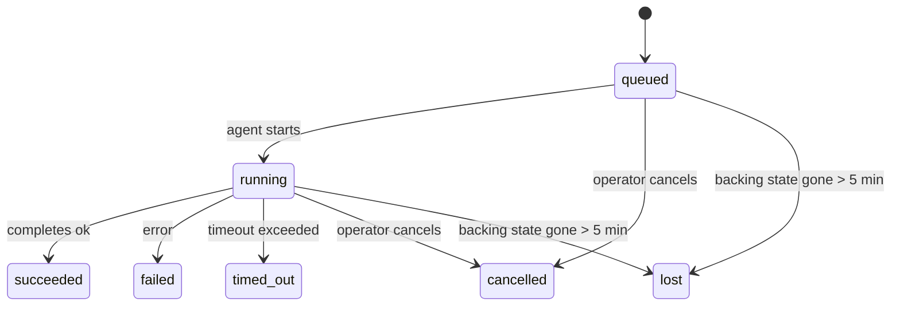

---
read_when:
    - Inspection des tâches en arrière-plan en cours ou récemment terminées
    - Débogage des échecs de livraison pour les exécutions d’agent détachées
    - Comprendre le lien entre les exécutions en arrière-plan, les sessions, Cron et Heartbeat
sidebarTitle: Background tasks
summary: Suivi des tâches en arrière-plan pour les exécutions ACP, les sous-agents, les exécutions Cron et les opérations de la CLI
title: Tâches en arrière-plan
x-i18n:
    generated_at: "2026-07-12T02:19:25Z"
    model: gpt-5.6
    postprocess_version: locale-links-v1
    provider: openai
    source_hash: 0a945e8103c5df5a64785f326a9d0b08784ac32a2ca6fa3d4c399d75fc54be2b
    source_path: automation/tasks.md
    workflow: 16
---

<Note>
Vous cherchez à planifier des tâches ? Consultez [Automatisation](/fr/automation) pour choisir le mécanisme approprié. Cette page est le registre d’activité des travaux en arrière-plan, et non le planificateur.
</Note>

Les tâches en arrière-plan suivent les travaux exécutés **en dehors de votre session de conversation principale** : exécutions ACP, lancements de sous-agents, exécutions de tâches Cron et opérations lancées depuis la CLI.

Les tâches ne remplacent **ni** les sessions, **ni** les tâches Cron, **ni** les Heartbeats : elles constituent le **registre d’activité** qui consigne les travaux détachés effectués, leur date et leur réussite éventuelle.

<Note>
Toutes les exécutions d’agent ne créent pas une tâche. Les tours de Heartbeat et les conversations interactives ordinaires n’en créent pas. Toutes les exécutions Cron, tous les lancements ACP et de sous-agents, ainsi que toutes les commandes d’agent de la CLI distribuées par le Gateway, en créent une.
</Note>

## En bref

- Les tâches sont des **enregistrements**, pas des planificateurs : Cron et Heartbeat déterminent _quand_ les travaux s’exécutent, tandis que les tâches suivent _ce qui s’est passé_.
- ACP, les sous-agents, toutes les tâches Cron et les opérations de la CLI créent des tâches. Les tours de Heartbeat n’en créent pas.
- Chaque tâche passe par les états `queued → running → terminal` (`succeeded`, `failed`, `timed_out`, `cancelled` ou `lost`).
- Les tâches Cron restent actives tant que le moteur d’exécution Cron possède encore la tâche ; si l’état d’exécution en mémoire a disparu, la maintenance des tâches vérifie d’abord l’historique persistant des exécutions Cron avant de marquer une tâche comme perdue.
- La fin d’une tâche est signalée par envoi automatique : les travaux détachés peuvent envoyer directement une notification ou réveiller la session ou le Heartbeat du demandeur à leur achèvement. Les boucles d’interrogation de l’état sont donc généralement inadaptées.
- Lors du nettoyage final, les exécutions Cron isolées et les sous-agents terminés tentent, dans la mesure du possible, de fermer les onglets et processus de navigateur suivis pour leur session enfant.
- La distribution des exécutions Cron isolées masque les réponses intermédiaires obsolètes du parent tant que les travaux des sous-agents descendants ne sont pas tous terminés, et privilégie la sortie finale d’un descendant lorsqu’elle arrive avant la distribution.
- Les notifications de fin sont envoyées directement à un canal ou placées en attente jusqu’au prochain Heartbeat.
- `openclaw tasks list` affiche toutes les tâches ; `openclaw tasks audit` signale les problèmes.
- Les enregistrements terminaux sont conservés pendant 7 jours, contre 24 heures pour les enregistrements `lost`, puis automatiquement supprimés.

## Démarrage rapide

<Tabs>
  <Tab title="List and filter">
    ```bash
    # List all tasks (newest first)
    openclaw tasks list

    # Filter by runtime or status
    openclaw tasks list --runtime acp
    openclaw tasks list --status running
    ```

  </Tab>
  <Tab title="Inspect">
    ```bash
    # Show details for a specific task (by task ID, run ID, or session key)
    openclaw tasks show <lookup>
    ```
  </Tab>
  <Tab title="Cancel and notify">
    ```bash
    # Cancel a running task (kills the child session)
    openclaw tasks cancel <lookup>

    # Change notification policy for a task
    openclaw tasks notify <lookup> state_changes
    ```

  </Tab>
  <Tab title="Audit and maintenance">
    ```bash
    # Run a health audit
    openclaw tasks audit

    # Preview or apply maintenance
    openclaw tasks maintenance
    openclaw tasks maintenance --apply
    ```

  </Tab>
  <Tab title="Task flow">
    ```bash
    # Inspect TaskFlow state
    openclaw tasks flow list
    openclaw tasks flow show <lookup>
    openclaw tasks flow cancel <lookup>
    ```
  </Tab>
</Tabs>

## Éléments qui créent une tâche

| Source                       | Type d’exécution | Moment de création d’un enregistrement de tâche                           | Politique de notification par défaut |
| ---------------------------- | ---------------- | ------------------------------------------------------------------------- | ------------------------------------ |
| Exécutions ACP en arrière-plan | `acp`          | Lancement d’une session ACP enfant                                        | `done_only`                          |
| Orchestration de sous-agents | `subagent`       | Lancement d’un sous-agent via `sessions_spawn`                             | `done_only`                          |
| Tâches Cron de tous types    | `cron`           | Chaque exécution Cron, dans la session principale ou de manière isolée     | `silent`                             |
| Opérations de la CLI         | `cli`            | Commandes `openclaw agent` exécutées par l’intermédiaire du Gateway        | `silent`                             |
| Tâches multimédias d’agent   | `cli`            | Exécutions `image_generate`/`music_generate`/`video_generate` avec session | `silent`                             |

<AccordionGroup>
  <Accordion title="Notify defaults for cron and media">
    Les tâches Cron, dans la session principale comme en exécution isolée, utilisent la politique de notification `silent` : elles créent des enregistrements à des fins de suivi, mais ne génèrent pas leurs propres notifications de tâche ; Cron possède son propre chemin de distribution.

    Les exécutions avec session de `image_generate`, `music_generate` et `video_generate` utilisent également la politique de notification `silent`. Elles créent tout de même des enregistrements de tâche, mais leur achèvement est transmis à la session d’agent d’origine sous la forme d’un réveil interne, afin que l’agent puisse rédiger le message de suivi et joindre lui-même le média terminé. L’agent demandeur suit son contrat habituel de réponse visible : réponse finale automatique lorsqu’elle est configurée, ou `message(action="send")` suivi de `NO_REPLY` lorsque la session exige des réponses par l’outil de messagerie. Si la session du demandeur n’est plus active ou si son réveil actif échoue, et que l’agent chargé de l’achèvement omet une partie ou la totalité des médias générés, OpenClaw envoie directement à la cible du canal d’origine un message de secours idempotent contenant uniquement les médias manquants.

  </Accordion>
  <Accordion title="Concurrent media-generation guardrail">
    Tant qu’une tâche de génération multimédia avec session est active, `image_generate`, `music_generate` et `video_generate` empêchent les nouvelles tentatives accidentelles : répéter l’appel pour la même invite ou demande renvoie l’état de la tâche active correspondante au lieu de créer un doublon, tandis qu’une invite distincte peut lancer sa propre tâche. Utilisez `action: "status"` pour demander explicitement à l’agent une consultation de la progression ou de l’état.
  </Accordion>
  <Accordion title="What does not create tasks">
    - Tours de Heartbeat dans la session principale ; consultez [Heartbeat](/fr/gateway/heartbeat)
    - Tours de conversation interactive ordinaires
    - Réponses directes à `/command`

  </Accordion>
</AccordionGroup>

## Cycle de vie d’une tâche



| État        | Signification                                                                    |
| ----------- | -------------------------------------------------------------------------------- |
| `queued`    | Créée, en attente du démarrage de l’agent                                         |
| `running`   | Le tour de l’agent est en cours d’exécution                                       |
| `succeeded` | Terminée avec succès                                                              |
| `failed`    | Terminée avec une erreur                                                          |
| `timed_out` | Le délai d’expiration configuré a été dépassé                                     |
| `cancelled` | Arrêtée par l’opérateur via `openclaw tasks cancel`, ou exécution interrompue     |
| `lost`      | Le moteur d’exécution a perdu son état de référence après un délai de grâce de 5 minutes |

Les transitions se produisent automatiquement : les événements du cycle de vie de l’exécution de l’agent — démarrage, fin et erreur — mettent à jour l’état de la tâche. Vous ne le gérez pas manuellement.

La fin de l’exécution de l’agent fait autorité pour les enregistrements de tâche actifs. Une exécution détachée réussie se termine à l’état `succeeded`, une erreur d’exécution ordinaire à l’état `failed`, un dépassement de délai à l’état `timed_out` et une annulation ou interruption à l’état `cancelled`. Lorsqu’une tâche a atteint un état terminal, les signaux ultérieurs du cycle de vie ne peuvent pas dégrader son état : une tâche annulée par un opérateur ou déjà à l’état `failed`, `timed_out` ou `lost` conserve cet état, même si un signal de réussite arrive ensuite.

L’état `lost` dépend du moteur d’exécution :

- Tâches ACP : seul un tour ACP actif dans le processus du Gateway prouve que l’exécution est encore en cours ; les métadonnées de session persistantes ne suffisent pas. L’audit hors ligne de la CLI reste prudent et ne récupère jamais les tâches ACP.
- Tâches de sous-agent : la session enfant sous-jacente a disparu du stockage de l’agent cible, ou contient une pierre tombale de récupération après redémarrage.
- Tâches Cron : le moteur d’exécution Cron ne suit plus la tâche comme étant active et l’historique persistant des exécutions Cron ne contient aucun résultat terminal pour cette exécution. L’audit hors ligne de la CLI ne considère pas son propre état vide du moteur Cron en mémoire comme faisant autorité.
- Tâches de la CLI : les tâches dotées d’un identifiant d’exécution ou d’un identifiant source utilisent le contexte d’exécution actif. Ainsi, les lignes persistantes d’une session enfant ou de conversation ne les maintiennent pas actives après la disparition de l’exécution gérée par le Gateway. Les anciennes tâches de la CLI dépourvues d’identité d’exécution continuent de se rabattre sur la session enfant. Les exécutions `openclaw agent` prises en charge par le Gateway sont également finalisées à partir du résultat de leur exécution ; les exécutions terminées ne restent donc pas actives jusqu’à ce que le processus de nettoyage les marque comme `lost`.

## Distribution et notifications

Lorsqu’une tâche atteint un état terminal, OpenClaw vous en informe. Deux chemins de distribution sont possibles :

**Distribution directe** : si la tâche possède une cible de canal, définie par `requesterOrigin`, le message d’achèvement est directement envoyé à ce canal, par exemple Discord, Slack ou Telegram. Les achèvements de tâches de groupe et de canal sont plutôt acheminés par la session du demandeur, afin que l’agent parent puisse rédiger la réponse visible. Pour les achèvements de sous-agents, OpenClaw conserve également, lorsqu’il est disponible, le routage lié au fil de discussion ou au sujet. Il peut aussi compléter un champ `to` ou un compte manquant à partir du routage enregistré dans la session du demandeur (`lastChannel` / `lastTo` / `lastAccountId`) avant de renoncer à la distribution directe.

**Distribution mise en file d’attente dans la session** : si la distribution directe échoue ou si aucune origine n’est définie, la mise à jour est placée en file d’attente sous forme d’événement système dans la session du demandeur et apparaît au prochain Heartbeat.

<Tip>
Les achèvements de tâches mis en file d’attente dans une session déclenchent immédiatement un réveil par Heartbeat. Vous obtenez donc rapidement le résultat, sans devoir attendre le prochain déclenchement planifié du Heartbeat.
</Tip>

Le flux de travail habituel repose donc sur l’envoi automatique : lancez une seule fois le travail détaché, puis laissez le moteur d’exécution vous réveiller ou vous avertir à son achèvement. N’interrogez l’état des tâches que pour le débogage, une intervention ou un audit explicite.

### Politiques de notification

Contrôlez la quantité d’informations reçues pour chaque tâche :

| Politique             | Éléments distribués                                              |
| --------------------- | ---------------------------------------------------------------- |
| `done_only` (par défaut) | Uniquement l’état terminal (`succeeded`, `failed`, etc.)       |
| `state_changes`       | Chaque transition d’état et chaque mise à jour de progression    |
| `silent`              | Rien du tout, valeur par défaut pour les tâches Cron, CLI et multimédias |

Modifiez la politique pendant l’exécution d’une tâche :

```bash
openclaw tasks notify <lookup> state_changes
```

## Référence de la CLI

<AccordionGroup>
  <Accordion title="tasks list">
    ```bash
    openclaw tasks list [--runtime <acp|subagent|cron|cli>] [--status <status>] [--json]
    ```

    Colonnes de sortie : Tâche, Type, État, Distribution, Exécution, Session enfant, Résumé. La commande `openclaw tasks` sans argument se comporte comme `openclaw tasks list`.

  </Accordion>
  <Accordion title="tasks show">
    ```bash
    openclaw tasks show <lookup> [--json]
    ```

    Le jeton de recherche accepte un identifiant de tâche, un identifiant d’exécution ou une clé de session. La commande affiche l’enregistrement complet, notamment les informations temporelles, l’état de distribution, l’erreur et le résumé terminal.

  </Accordion>
  <Accordion title="tasks cancel">
    ```bash
    openclaw tasks cancel <lookup>
    ```

    Pour les tâches ACP et de sous-agent, cette commande arrête la session enfant ; les annulations ACP et Cron passent par le Gateway en cours d’exécution (`tasks.cancel`). Pour les tâches suivies par la CLI, l’annulation est enregistrée dans le registre des tâches, car il n’existe aucun descripteur distinct pour le moteur d’exécution enfant. L’état passe à `cancelled` et une notification de distribution est envoyée lorsqu’il y a lieu.

  </Accordion>
  <Accordion title="tasks notify">
    ```bash
    openclaw tasks notify <lookup> <done_only|state_changes|silent>
    ```
  </Accordion>
  <Accordion title="tasks audit">
    ```bash
    openclaw tasks audit [--severity <warn|error>] [--code <name>] [--limit <n>] [--json]
    ```

    Signale dans un même rapport les problèmes opérationnels des tâches **et** des TaskFlows. Les constatations apparaissent également dans `openclaw status` lorsque des problèmes sont détectés.

    Constatations relatives aux tâches :

    | Constat                    | Gravité          | Déclencheur                                                                                                                        |
    | -------------------------- | ---------------- | ---------------------------------------------------------------------------------------------------------------------------------- |
    | `stale_queued`             | avertissement    | En file d’attente depuis plus de 10 minutes                                                                                        |
    | `stale_running`            | erreur           | En cours d’exécution depuis plus de 30 minutes                                                                                     |
    | `lost`                     | avertissement/erreur | La propriété de la tâche assurée par l’environnement d’exécution a disparu ; les tâches perdues conservées génèrent un avertissement jusqu’à `cleanupAfter`, puis deviennent des erreurs |
    | `delivery_failed`          | avertissement    | La remise a échoué et la politique de notification n’est pas `silent`                                                             |
    | `missing_cleanup`          | avertissement    | Tâche terminale sans horodatage de nettoyage                                                                                       |
    | `inconsistent_timestamps`  | avertissement    | Incohérence chronologique (par exemple, fin antérieure au début)                                                                   |

    Constats TaskFlow :

    | Constat                | Gravité          | Déclencheur                                                                                   |
    | ---------------------- | ---------------- | --------------------------------------------------------------------------------------------- |
    | `restore_failed`       | erreur           | Échec de la restauration du registre des flux depuis SQLite                                   |
    | `stale_running`        | erreur           | Le flux en cours n’a pas progressé depuis plus de 30 minutes                                  |
    | `stale_waiting`        | avertissement    | Le flux en attente n’a pas progressé depuis plus de 30 minutes                                |
    | `stale_blocked`        | avertissement    | Le flux bloqué n’a pas progressé depuis plus de 30 minutes                                    |
    | `cancel_stuck`         | avertissement    | Annulation demandée il y a plus de 5 minutes, aucune tâche enfant active, flux toujours non terminal |
    | `missing_linked_tasks` | avertissement/erreur | Flux géré obsolète sans tâche liée ni état d’attente                                           |
    | `blocked_task_missing` | avertissement    | Le flux bloqué pointe vers un identifiant de tâche qui n’existe plus                          |

  </Accordion>
  <Accordion title="tasks maintenance">
    ```bash
    openclaw tasks maintenance [--json]
    openclaw tasks maintenance --apply [--json]
    ```

    Utilisez cette commande pour prévisualiser ou appliquer la réconciliation, l’ajout des horodatages de nettoyage et l’élagage des tâches, de l’état TaskFlow et des lignes obsolètes du registre des sessions d’exécution Cron.

    La réconciliation tient compte de l’environnement d’exécution :

    - Les tâches ACP nécessitent un tour actif au sein du processus dans le Gateway ; les tâches de sous-agent vérifient leur session enfant sous-jacente.
    - Les tâches de sous-agent dont la session enfant possède une pierre tombale de récupération après redémarrage sont marquées comme perdues au lieu que leurs sessions sous-jacentes soient considérées comme récupérables.
    - Les tâches Cron vérifient si l’environnement d’exécution Cron possède toujours la tâche planifiée, puis récupèrent l’état terminal depuis les journaux persistants des exécutions Cron ou l’état de la tâche planifiée avant de revenir à `lost`. Seul le processus Gateway fait autorité pour l’ensemble en mémoire des tâches Cron actives ; l’audit hors ligne de la CLI utilise l’historique durable, mais ne marque pas une tâche Cron comme perdue uniquement parce que cet ensemble local est vide.
    - Les tâches CLI disposant d’une identité d’exécution vérifient le contexte actif propriétaire de l’exécution, et pas seulement les lignes de session enfant ou de session de discussion.

    Le nettoyage à l’achèvement tient également compte de l’environnement d’exécution :

    - À l’achèvement d’un sous-agent, OpenClaw tente de fermer les onglets de navigateur et les processus suivis pour la session enfant avant de poursuivre le nettoyage lié à l’annonce.
    - À l’achèvement d’une exécution Cron isolée, OpenClaw tente de fermer les onglets de navigateur et les processus suivis pour la session Cron avant la fin complète de l’exécution.
    - La remise d’une exécution Cron isolée attend, si nécessaire, la fin du suivi effectué par les sous-agents descendants et supprime le texte obsolète d’accusé de réception du parent au lieu de l’annoncer.
    - La remise à l’achèvement d’un sous-agent utilise uniquement le dernier texte visible de l’assistant enfant. La sortie `tool`/`toolResult` n’est pas promue comme texte de résultat de l’enfant. Les exécutions terminales ayant échoué annoncent l’état d’échec sans reproduire le texte de réponse capturé.
    - Les échecs de nettoyage ne masquent pas le résultat réel de la tâche.

    Lors de l’application de la maintenance, OpenClaw supprime également les lignes obsolètes `cron:<jobId>:run:<runId>` du registre des sessions datant de plus de 7 jours, tout en conservant les lignes des tâches Cron actuellement en cours et sans modifier les lignes de session non liées à Cron.

  </Accordion>
  <Accordion title="tasks flow list | show | cancel">
    ```bash
    openclaw tasks flow list [--status <status>] [--json]
    openclaw tasks flow show <lookup> [--json]
    openclaw tasks flow cancel <lookup>
    ```

    Le jeton de recherche de flux accepte un identifiant de flux ou une clé de propriétaire. Utilisez ces commandes lorsque le [flux de tâches](/fr/automation/taskflow) d’orchestration vous intéresse plutôt qu’un enregistrement individuel de tâche en arrière-plan.

  </Accordion>
</AccordionGroup>

## Tableau des tâches de discussion (`/tasks`)

Utilisez `/tasks` dans n’importe quelle session de discussion pour afficher les tâches en arrière-plan liées à cette session. Le tableau affiche jusqu’à cinq tâches actives ou récemment terminées, avec leur environnement d’exécution, leur état, leurs données temporelles ainsi que les détails de progression ou d’erreur.

Lorsque la session actuelle ne comporte aucune tâche liée visible, `/tasks` utilise à la place les nombres de tâches locales de l’agent afin de fournir tout de même une vue d’ensemble sans divulguer les détails d’autres sessions.

Pour consulter le registre complet destiné aux opérateurs, utilisez la CLI : `openclaw tasks list`.

### Interface de contrôle

L’interface de contrôle web comporte une page **Tâches** dans la barre latérale, avec les tâches en arrière-plan actives et récentes mises à jour en direct. Utilisez-la pour examiner la progression, ouvrir les sessions liées, actualiser le registre ou annuler les tâches en file d’attente et en cours d’exécution.

Les volets de discussion comportent également un panneau réductible **Tâches en arrière-plan**, limité à l’agent du volet : tâches et sous-agents en cours avec une commande d’arrêt, une section des éléments terminés et des liens Afficher la transcription vers la session enfant de chaque tâche. Ouvrez-le depuis le bouton d’activité dans l’en-tête du volet, ou depuis le bouton d’activité flottant dans une discussion à volet unique.

## Intégration à l’état (charge des tâches)

`openclaw status` comprend une ligne offrant un aperçu des tâches :

```
Tasks    2 active · 1 queued · 1 running · 1 issue · audit clean · 6 tracked
```

Le récapitulatif compte les travaux actifs (`queued` + `running`), les échecs (`failed` + `timed_out` + `lost`), les constats d’audit et le nombre total d’enregistrements suivis ; la charge utile JSON ventile également les nombres par environnement d’exécution (`acp`, `subagent`, `cron`, `cli`).

`/status` et l’outil `session_status` utilisent tous deux un instantané des tâches tenant compte du nettoyage : les tâches actives sont privilégiées, les lignes expirées sont masquées et les tâches terminales n’apparaissent que pendant une courte période récente de 5 minutes, avec une priorité accordée aux échecs lorsqu’il ne reste aucun travail actif. Ainsi, la fiche d’état reste centrée sur ce qui importe actuellement.

## Stockage et maintenance

### Emplacement des tâches

Les enregistrements des tâches et l’état de remise persistent dans la base de données d’état SQLite partagée d’OpenClaw :

```
~/.openclaw/state/openclaw.sqlite   (tables: task_runs, task_delivery_state, flow_runs)
```

Définissez `OPENCLAW_STATE_DIR` pour déplacer l’ensemble de la racine d’état, située par défaut dans `~/.openclaw`, vers un autre emplacement ; le chemin de la base de données partagée est déplacé avec elle.

Le registre est chargé en mémoire à la première utilisation et chaque écriture est persistée dans SQLite, ce qui permet aux enregistrements de survivre aux redémarrages du Gateway. La croissance du journal WAL reste limitée grâce au seuil de point de contrôle automatique par défaut de SQLite et à des points de contrôle `PASSIVE` périodiques ; les points de contrôle effectués à l’arrêt et lors d’une maintenance explicite utilisent `TRUNCATE`, afin que les fermetures normales récupèrent l’espace WAL sans obliger le processus de nettoyage en arrière-plan à attendre les lecteurs actifs.

Les anciens magasins annexes provenant d’installations antérieures (`tasks/runs.sqlite`, `flows/registry.sqlite`) sont importés dans la base de données partagée par `openclaw doctor`.

### Maintenance automatique

Un processus de nettoyage s’exécute toutes les **60 secondes** — le premier passage a lieu environ 5 secondes après le démarrage du Gateway — et gère quatre opérations :

<Steps>
  <Step title="Reconciliation">
    Vérifie si les tâches actives disposent toujours d’un environnement d’exécution sous-jacent faisant autorité. Les tâches ACP nécessitent un tour actif au sein du processus, les tâches de sous-agent utilisent l’état de la session enfant, les tâches Cron utilisent la propriété de la tâche active ainsi que l’historique durable des exécutions, et les tâches CLI disposant d’une identité d’exécution utilisent le contexte propriétaire de l’exécution. Si l’état sous-jacent a disparu depuis plus de 5 minutes — ou 30 minutes pour les tâches natives de sous-agent sans enfant —, la tâche est marquée `lost`.
  </Step>
  <Step title="ACP session repair">
    Ferme les sessions ACP ponctuelles appartenant au parent qui sont terminales ou orphelines, et ne ferme les sessions ACP persistantes obsolètes qui sont terminales ou orphelines que lorsqu’il ne subsiste aucune liaison de conversation active.
  </Step>
  <Step title="Cleanup stamping">
    Définit un horodatage `cleanupAfter` sur les tâches terminales — heure terminale plus période de conservation. Pendant la période de conservation, les tâches perdues apparaissent encore dans l’audit comme avertissements ; après l’expiration de `cleanupAfter`, ou lorsque les métadonnées de nettoyage sont absentes, elles deviennent des erreurs.
  </Step>
  <Step title="Pruning">
    Supprime les enregistrements ayant dépassé leur date `cleanupAfter`.
  </Step>
</Steps>

<Note>
**Conservation :** les enregistrements des tâches terminales sont conservés pendant **7 jours** — **24 heures** pour les enregistrements `lost` — puis automatiquement élagués. Aucune configuration n’est nécessaire.
</Note>

## Relations entre les tâches et les autres systèmes

<AccordionGroup>
  <Accordion title="Tasks and Task Flow">
    Le [flux de tâches](/fr/automation/taskflow) constitue la couche d’orchestration des flux au-dessus des tâches en arrière-plan. Un même flux peut coordonner plusieurs tâches au cours de son cycle de vie à l’aide de modes de synchronisation gérés ou mis en miroir. Utilisez `openclaw tasks` pour examiner les enregistrements individuels des tâches et `openclaw tasks flow` pour examiner le flux d’orchestration.

  </Accordion>
  <Accordion title="Tasks and cron">
    Les définitions des tâches Cron, l’état d’exécution et l’historique des exécutions résident dans la base de données d’état SQLite partagée d’OpenClaw. **Chaque** exécution Cron crée un enregistrement de tâche — qu’elle utilise la session principale ou une session isolée — avec la politique de notification `silent`, afin de suivre les exécutions Cron sans générer leurs propres notifications de tâche.

    Consultez [Tâches Cron](/fr/automation/cron-jobs).

  </Accordion>
  <Accordion title="Tasks and heartbeat">
    Les exécutions Heartbeat sont des tours de la session principale : elles ne créent pas d’enregistrements de tâche. Lorsqu’une tâche se termine, elle peut déclencher un réveil Heartbeat afin que vous puissiez voir rapidement le résultat.

    Consultez [Heartbeat](/fr/gateway/heartbeat).

  </Accordion>
  <Accordion title="Tasks and sessions">
    Une tâche peut référencer une `childSessionKey`, où le travail est exécuté, et une `requesterSessionKey`, qui indique qui l’a démarrée. Son `agentId` identifie l’agent qui exécute le travail, tandis que les champs du demandeur et du propriétaire conservent le contexte de lancement et de contrôle. Les sessions constituent le contexte de conversation ; les tâches ajoutent par-dessus un suivi de l’activité.
  </Accordion>
  <Accordion title="Tasks and agent runs">
    Le `runId` d’une tâche établit un lien avec l’exécution de l’agent qui effectue le travail. Les événements du cycle de vie de l’agent — démarrage, fin, erreur — mettent automatiquement à jour l’état de la tâche ; vous n’avez pas à gérer manuellement ce cycle de vie.
  </Accordion>
</AccordionGroup>

## Voir aussi

- [Automatisation](/fr/automation) - tous les mécanismes d’automatisation en un coup d’œil
- [CLI : tâches](/fr/cli/tasks) - référence des commandes de la CLI
- [Heartbeat](/fr/gateway/heartbeat) - tours périodiques de la session principale
- [Tâches planifiées](/fr/automation/cron-jobs) - planification du travail en arrière-plan
- [Flux de tâches](/fr/automation/taskflow) - orchestration des flux au-dessus des tâches
