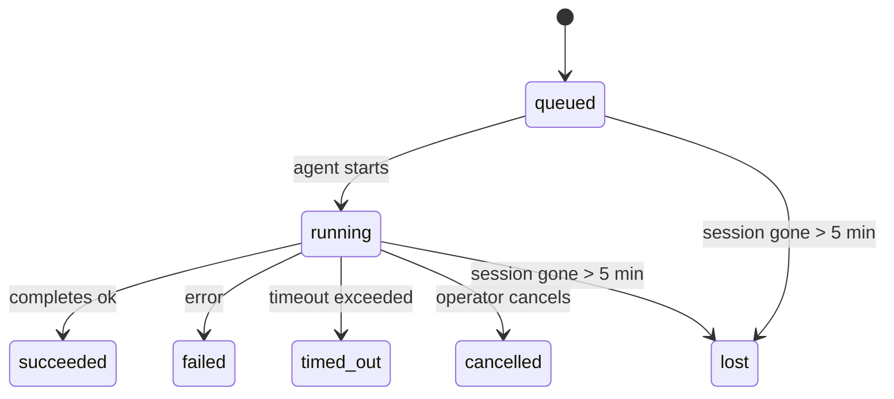

---
read_when:
    - Inspecter les tâches en arrière-plan en cours ou récemment terminées
    - Débogage des échecs de livraison pour les exécutions d’agents détachées
    - Comprendre comment les exécutions en arrière-plan sont liées aux sessions, à Cron et au Heartbeat
sidebarTitle: Background tasks
summary: Suivi des tâches en arrière-plan pour les exécutions ACP, les sous-agents, les tâches Cron isolées et les opérations CLI
title: Tâches en arrière-plan
x-i18n:
    generated_at: "2026-05-06T07:14:09Z"
    model: gpt-5.5
    provider: openai
    source_hash: 055e16b4f53dbd089cc72eea7fe80bdaee5451dc56fa6e88a742f98e566bb57a
    source_path: automation/tasks.md
    workflow: 16
---

<Note>
Vous cherchez la planification ? Consultez [Automatisation et tâches](/fr/automation) pour choisir le bon mécanisme. Cette page est le journal d’activité du travail en arrière-plan, pas le planificateur.
</Note>

Les tâches en arrière-plan suivent le travail qui s’exécute **en dehors de votre session de conversation principale** : exécutions ACP, lancements de sous-agents, exécutions isolées de tâches cron et opérations lancées par la CLI.

Les tâches ne remplacent **pas** les sessions, les tâches cron ni les heartbeats : elles sont le **journal d’activité** qui enregistre quel travail détaché a eu lieu, quand, et s’il a réussi.

<Note>
Toutes les exécutions d’agent ne créent pas une tâche. Les tours Heartbeat et les conversations interactives normales n’en créent pas. Toutes les exécutions cron, les lancements ACP, les lancements de sous-agents et les commandes d’agent CLI en créent.
</Note>

## TL;DR

- Les tâches sont des **enregistrements**, pas des planificateurs : cron et Heartbeat décident _quand_ le travail s’exécute, les tâches suivent _ce qui s’est passé_.
- ACP, les sous-agents, toutes les tâches cron et les opérations CLI créent des tâches. Les tours Heartbeat n’en créent pas.
- Chaque tâche passe par `queued → running → terminal` (succeeded, failed, timed_out, cancelled ou lost).
- Les tâches cron restent actives tant que le runtime cron possède encore la tâche ; si l’état du runtime en mémoire a disparu, la maintenance des tâches vérifie d’abord l’historique durable des exécutions cron avant de marquer une tâche comme perdue.
- La fin est pilotée par poussée : le travail détaché peut notifier directement ou réveiller la session/Heartbeat demandeuse lorsqu’il se termine ; les boucles d’interrogation de statut sont donc généralement la mauvaise forme.
- Les exécutions cron isolées et les fins de sous-agents nettoient au mieux les onglets/processus de navigateur suivis pour leur session enfant avant la comptabilité de nettoyage finale.
- La livraison cron isolée supprime les réponses parentes intermédiaires obsolètes tant que le travail des sous-agents descendants est encore en cours de vidage, et elle privilégie la sortie descendante finale lorsqu’elle arrive avant la livraison.
- Les notifications de fin sont livrées directement à un canal ou mises en file pour le prochain Heartbeat.
- `openclaw tasks list` affiche toutes les tâches ; `openclaw tasks audit` signale les problèmes.
- Les enregistrements terminaux sont conservés 7 jours, puis automatiquement élagués.

## Démarrage rapide

<Tabs>
  <Tab title="Lister et filtrer">
    ```bash
    # List all tasks (newest first)
    openclaw tasks list

    # Filter by runtime or status
    openclaw tasks list --runtime acp
    openclaw tasks list --status running
    ```

  </Tab>
  <Tab title="Inspecter">
    ```bash
    # Show details for a specific task (by ID, run ID, or session key)
    openclaw tasks show <lookup>
    ```
  </Tab>
  <Tab title="Annuler et notifier">
    ```bash
    # Cancel a running task (kills the child session)
    openclaw tasks cancel <lookup>

    # Change notification policy for a task
    openclaw tasks notify <lookup> state_changes
    ```

  </Tab>
  <Tab title="Audit et maintenance">
    ```bash
    # Run a health audit
    openclaw tasks audit

    # Preview or apply maintenance
    openclaw tasks maintenance
    openclaw tasks maintenance --apply
    ```

  </Tab>
  <Tab title="Flux de tâche">
    ```bash
    # Inspect TaskFlow state
    openclaw tasks flow list
    openclaw tasks flow show <lookup>
    openclaw tasks flow cancel <lookup>
    ```
  </Tab>
</Tabs>

## Ce qui crée une tâche

| Source                 | Type de runtime | Moment où un enregistrement de tâche est créé             | Politique de notification par défaut |
| ---------------------- | --------------- | --------------------------------------------------------- | ------------------------------------ |
| Exécutions ACP en arrière-plan | `acp`        | Lancement d’une session ACP enfant                        | `done_only`                          |
| Orchestration de sous-agents | `subagent`   | Lancement d’un sous-agent via `sessions_spawn`            | `done_only`                          |
| Tâches cron (tous types) | `cron`       | Chaque exécution cron (session principale et isolée)      | `silent`                             |
| Opérations CLI         | `cli`           | Commandes `openclaw agent` qui passent par le Gateway     | `silent`                             |
| Tâches média d’agent   | `cli`           | Exécutions `music_generate`/`video_generate` adossées à une session | `silent`                    |

<AccordionGroup>
  <Accordion title="Valeurs par défaut de notification pour cron et les médias">
    Les tâches cron de session principale utilisent par défaut la politique de notification `silent` : elles créent des enregistrements pour le suivi, mais ne génèrent pas de notifications. Les tâches cron isolées utilisent aussi `silent` par défaut, mais elles sont plus visibles parce qu’elles s’exécutent dans leur propre session.

    Les exécutions `music_generate` et `video_generate` adossées à une session utilisent également la politique de notification `silent`. Elles créent tout de même des enregistrements de tâche, mais la fin est renvoyée à la session d’agent d’origine sous forme de réveil interne afin que l’agent puisse écrire le message de suivi et joindre lui-même le média terminé. Les fins de groupe/canal suivent la politique normale de réponse visible ; l’agent utilise donc l’outil de message lorsque la livraison source l’exige. Si l’agent de fin ne produit pas de preuve de livraison par outil de message dans une route uniquement basée sur les outils, OpenClaw envoie directement la solution de repli de fin au canal d’origine au lieu de laisser le média privé.

  </Accordion>
  <Accordion title="Garde-fou video_generate concurrent">
    Tant qu’une tâche `video_generate` adossée à une session est encore active, l’outil agit aussi comme un garde-fou : les appels `video_generate` répétés dans cette même session renvoient le statut de la tâche active au lieu de démarrer une seconde génération concurrente. Utilisez `action: "status"` lorsque vous voulez une recherche explicite de progression/statut côté agent.
  </Accordion>
  <Accordion title="Ce qui ne crée pas de tâches">
    - Tours Heartbeat : session principale ; voir [Heartbeat](/fr/gateway/heartbeat)
    - Tours de conversation interactive normale
    - Réponses directes `/command`

  </Accordion>
</AccordionGroup>

## Cycle de vie d’une tâche



| Statut      | Signification                                                              |
| ----------- | -------------------------------------------------------------------------- |
| `queued`    | Créée, en attente du démarrage de l’agent                                  |
| `running`   | Le tour d’agent est en cours d’exécution active                            |
| `succeeded` | Terminée avec succès                                                       |
| `failed`    | Terminée avec une erreur                                                   |
| `timed_out` | A dépassé le délai d’expiration configuré                                  |
| `cancelled` | Arrêtée par l’opérateur via `openclaw tasks cancel`                        |
| `lost`      | Le runtime a perdu l’état de référence faisant autorité après une période de grâce de 5 minutes |

Les transitions se produisent automatiquement : lorsque l’exécution d’agent associée se termine, le statut de la tâche est mis à jour en conséquence.

La fin d’exécution d’agent fait autorité pour les enregistrements de tâches actifs. Une exécution détachée réussie se finalise en `succeeded`, les erreurs ordinaires d’exécution se finalisent en `failed`, et les résultats de délai expiré ou d’abandon se finalisent en `timed_out`. Si un opérateur a déjà annulé la tâche, ou si le runtime a déjà enregistré un état terminal plus fort comme `failed`, `timed_out` ou `lost`, un signal de réussite ultérieur ne rétrograde pas ce statut terminal.

`lost` tient compte du runtime :

- Tâches ACP : les métadonnées de session ACP enfant sous-jacentes ont disparu.
- Tâches de sous-agent : la session enfant sous-jacente a disparu du magasin de l’agent cible.
- Tâches cron : le runtime cron ne suit plus la tâche comme active et l’historique durable des exécutions cron ne montre pas de résultat terminal pour cette exécution. L’audit CLI hors ligne ne traite pas son propre état de runtime cron vide dans le processus comme faisant autorité.
- Tâches CLI : les tâches de session enfant isolée utilisent la session enfant ; les tâches CLI adossées à une conversation utilisent plutôt le contexte d’exécution actif, de sorte que les lignes de session canal/groupe/direct persistantes ne les maintiennent pas actives. Les exécutions `openclaw agent` adossées au Gateway se finalisent également depuis leur résultat d’exécution ; ainsi, les exécutions terminées ne restent pas actives jusqu’à ce que le balayeur les marque `lost`.

## Livraison et notifications

Lorsqu’une tâche atteint un état terminal, OpenClaw vous notifie. Il existe deux chemins de livraison :

**Livraison directe** : si la tâche a une cible de canal (le `requesterOrigin`), le message de fin est envoyé directement à ce canal (Telegram, Discord, Slack, etc.). Pour les fins de sous-agents, OpenClaw préserve également le routage de fil/sujet lié lorsqu’il est disponible et peut remplir un `to` / compte manquant depuis la route stockée de la session demandeuse (`lastChannel` / `lastTo` / `lastAccountId`) avant d’abandonner la livraison directe.

**Livraison mise en file dans la session** : si la livraison directe échoue ou si aucune origine n’est définie, la mise à jour est mise en file comme événement système dans la session du demandeur et apparaît au prochain Heartbeat.

<Tip>
La fin de tâche déclenche un réveil Heartbeat immédiat pour que vous voyiez le résultat rapidement : vous n’avez pas besoin d’attendre le prochain tick Heartbeat planifié.
</Tip>

Cela signifie que le flux de travail habituel est basé sur la poussée : démarrez une fois le travail détaché, puis laissez le runtime vous réveiller ou vous notifier à la fin. Interrogez l’état de la tâche seulement lorsque vous avez besoin de débogage, d’intervention ou d’un audit explicite.

### Politiques de notification

Contrôlez la quantité d’informations que vous recevez sur chaque tâche :

| Politique             | Ce qui est livré                                                        |
| --------------------- | ----------------------------------------------------------------------- |
| `done_only` (par défaut) | Seulement l’état terminal (succeeded, failed, etc.) : **c’est la valeur par défaut** |
| `state_changes`       | Chaque transition d’état et mise à jour de progression                  |
| `silent`              | Rien du tout                                                            |

Modifiez la politique pendant qu’une tâche est en cours d’exécution :

```bash
openclaw tasks notify <lookup> state_changes
```

## Référence CLI

<AccordionGroup>
  <Accordion title="tasks list">
    ```bash
    openclaw tasks list [--runtime <acp|subagent|cron|cli>] [--status <status>] [--json]
    ```

    Colonnes de sortie : ID de tâche, Type, Statut, Livraison, ID d’exécution, Session enfant, Résumé.

  </Accordion>
  <Accordion title="tasks show">
    ```bash
    openclaw tasks show <lookup>
    ```

    Le jeton de recherche accepte un ID de tâche, un ID d’exécution ou une clé de session. Affiche l’enregistrement complet, y compris le minutage, l’état de livraison, l’erreur et le résumé terminal.

  </Accordion>
  <Accordion title="tasks cancel">
    ```bash
    openclaw tasks cancel <lookup>
    ```

    Pour les tâches ACP et de sous-agent, cela tue la session enfant. Pour les tâches suivies par la CLI, l’annulation est enregistrée dans le registre des tâches (il n’existe pas de handle de runtime enfant distinct). Le statut passe à `cancelled` et une notification de livraison est envoyée le cas échéant.

  </Accordion>
  <Accordion title="tasks notify">
    ```bash
    openclaw tasks notify <lookup> <done_only|state_changes|silent>
    ```
  </Accordion>
  <Accordion title="tasks audit">
    ```bash
    openclaw tasks audit [--json]
    ```

    Signale les problèmes opérationnels. Les constats apparaissent également dans `openclaw status` lorsque des problèmes sont détectés.

    | Constat                  | Gravité    | Déclencheur                                                                                                      |
    | ------------------------- | ---------- | ------------------------------------------------------------------------------------------------------------ |
    | `stale_queued`            | warn       | En file d’attente depuis plus de 10 minutes                                                                    |
    | `stale_running`           | error      | En cours d’exécution depuis plus de 30 minutes                                                                 |
    | `lost`                    | warn/error | La propriété de la tâche soutenue par l’exécution a disparu ; les tâches perdues conservées émettent des avertissements jusqu’à `cleanupAfter`, puis deviennent des erreurs |
    | `delivery_failed`         | warn       | La livraison a échoué et la politique de notification n’est pas `silent`                                       |
    | `missing_cleanup`         | warn       | Tâche terminale sans horodatage de nettoyage                                                                   |
    | `inconsistent_timestamps` | warn       | Violation de chronologie (par exemple, fin avant le début)                                                     |

  </Accordion>
  <Accordion title="maintenance des tâches">
    ```bash
    openclaw tasks maintenance [--json]
    openclaw tasks maintenance --apply [--json]
    ```

    Utilisez cette commande pour prévisualiser ou appliquer la réconciliation, l’horodatage de nettoyage et l’élagage des tâches et de l’état du flux de tâches.

    La réconciliation tient compte de l’exécution :

    - Les tâches ACP/sous-agent vérifient leur session enfant sous-jacente.
    - Les tâches de sous-agent dont la session enfant possède une pierre tombale de récupération après redémarrage sont marquées comme perdues au lieu d’être traitées comme des sessions sous-jacentes récupérables.
    - Les tâches Cron vérifient si l’exécution cron possède toujours la tâche, puis récupèrent l’état terminal depuis les journaux d’exécution cron persistés/l’état de tâche avant de se rabattre sur `lost`. Seul le processus Gateway fait autorité pour l’ensemble en mémoire des tâches cron actives ; l’audit CLI hors ligne utilise l’historique durable mais ne marque pas une tâche cron comme perdue uniquement parce que ce Set local est vide.
    - Les tâches CLI adossées au chat vérifient le contexte d’exécution actif propriétaire, pas seulement la ligne de session de chat.

    Le nettoyage de fin tient également compte de l’exécution :

    - La fin d’un sous-agent ferme au mieux les onglets/processus de navigateur suivis pour la session enfant avant la poursuite du nettoyage d’annonce.
    - La fin d’un cron isolé ferme au mieux les onglets/processus de navigateur suivis pour la session cron avant l’arrêt complet de l’exécution.
    - La livraison cron isolée attend si nécessaire la suite d’un sous-agent descendant et supprime le texte d’accusé de réception parent obsolète au lieu de l’annoncer.
    - La livraison de fin d’un sous-agent préfère le dernier texte assistant visible ; s’il est vide, elle se rabat sur le dernier texte d’outil/toolResult nettoyé, et les exécutions d’appels d’outils expirées uniquement peuvent être condensées en un court résumé de progression partielle. Les exécutions terminales en échec annoncent l’état d’échec sans rejouer le texte de réponse capturé.
    - Les échecs de nettoyage ne masquent pas le résultat réel de la tâche.

  </Accordion>
  <Accordion title="liste | affichage | annulation du flux de tâches">
    ```bash
    openclaw tasks flow list [--status <status>] [--json]
    openclaw tasks flow show <lookup> [--json]
    openclaw tasks flow cancel <lookup>
    ```

    Utilisez ces commandes lorsque le flux de tâches orchestrateur est l’élément qui vous intéresse plutôt qu’un enregistrement individuel de tâche en arrière-plan.

  </Accordion>
</AccordionGroup>

## Tableau des tâches de chat (`/tasks`)

Utilisez `/tasks` dans n’importe quelle session de chat pour voir les tâches en arrière-plan liées à cette session. Le tableau affiche les tâches actives et récemment terminées avec l’exécution, l’état, le minutage et les détails de progression ou d’erreur.

Lorsque la session actuelle n’a aucune tâche liée visible, `/tasks` se rabat sur les décomptes de tâches locaux à l’agent afin que vous obteniez tout de même une vue d’ensemble sans divulguer les détails d’autres sessions.

Pour le registre opérateur complet, utilisez la CLI : `openclaw tasks list`.

## Intégration de l’état (pression des tâches)

`openclaw status` inclut un résumé des tâches en un coup d’œil :

```
Tasks: 3 queued · 2 running · 1 issues
```

Le résumé indique :

- **active** - nombre de `queued` + `running`
- **failures** - nombre de `failed` + `timed_out` + `lost`
- **byRuntime** - répartition par `acp`, `subagent`, `cron`, `cli`

`/status` et l’outil `session_status` utilisent tous deux un instantané des tâches tenant compte du nettoyage : les tâches actives sont privilégiées, les lignes terminées obsolètes sont masquées, et les échecs récents ne remontent que lorsqu’aucun travail actif ne reste. La carte d’état reste ainsi centrée sur ce qui compte maintenant.

## Stockage et maintenance

### Emplacement des tâches

Les enregistrements de tâches persistent dans SQLite à :

```
$OPENCLAW_STATE_DIR/tasks/runs.sqlite
```

Le registre est chargé en mémoire au démarrage du Gateway et synchronise les écritures vers SQLite pour garantir la durabilité entre les redémarrages.
Le Gateway maintient le journal d’écriture anticipée SQLite dans des limites bornées en utilisant le seuil
d’autocheckpoint par défaut de SQLite ainsi que des checkpoints `TRUNCATE` périodiques et à l’arrêt.

### Maintenance automatique

Un balayeur s’exécute toutes les **60 secondes** et gère quatre éléments :

<Steps>
  <Step title="Réconciliation">
    Vérifie si les tâches actives disposent toujours d’un support d’exécution faisant autorité. Les tâches ACP/sous-agent utilisent l’état de session enfant, les tâches cron utilisent la propriété des tâches actives, et les tâches CLI adossées au chat utilisent le contexte d’exécution propriétaire. Si cet état sous-jacent a disparu depuis plus de 5 minutes, la tâche est marquée `lost`.
  </Step>
  <Step title="Réparation des sessions ACP">
    Ferme les sessions ACP ponctuelles terminales ou orphelines appartenant à un parent, et ferme les sessions ACP persistantes terminales obsolètes ou orphelines uniquement lorsqu’il ne reste aucune liaison de conversation active.
  </Step>
  <Step title="Horodatage de nettoyage">
    Définit un horodatage `cleanupAfter` sur les tâches terminales (endedAt + 7 jours). Pendant la rétention, les tâches perdues apparaissent encore dans l’audit comme avertissements ; après l’expiration de `cleanupAfter`, ou lorsque les métadonnées de nettoyage sont absentes, elles sont des erreurs.
  </Step>
  <Step title="Élagage">
    Supprime les enregistrements ayant dépassé leur date `cleanupAfter`.
  </Step>
</Steps>

<Note>
**Rétention :** les enregistrements de tâches terminales sont conservés pendant **7 jours**, puis automatiquement élagués. Aucune configuration nécessaire.
</Note>

## Relation entre les tâches et les autres systèmes

<AccordionGroup>
  <Accordion title="Tâches et flux de tâches">
    Le [flux de tâches](/fr/automation/taskflow) est la couche d’orchestration des flux au-dessus des tâches en arrière-plan. Un même flux peut coordonner plusieurs tâches au cours de sa durée de vie avec des modes de synchronisation gérés ou miroirs. Utilisez `openclaw tasks` pour inspecter les enregistrements de tâches individuels et `openclaw tasks flow` pour inspecter le flux orchestrateur.

    Consultez [Flux de tâches](/fr/automation/taskflow) pour plus de détails.

  </Accordion>
  <Accordion title="Tâches et cron">
    Une **définition** de tâche cron se trouve dans `~/.openclaw/cron/jobs.json` ; l’état d’exécution se trouve à côté, dans `~/.openclaw/cron/jobs-state.json`. **Chaque** exécution cron crée un enregistrement de tâche, à la fois en session principale et isolée. Les tâches cron de session principale utilisent par défaut la politique de notification `silent`, afin d’être suivies sans générer de notifications.

    Consultez [Tâches Cron](/fr/automation/cron-jobs).

  </Accordion>
  <Accordion title="Tâches et Heartbeat">
    Les exécutions Heartbeat sont des tours de session principale : elles ne créent pas d’enregistrements de tâches. Lorsqu’une tâche se termine, elle peut déclencher un réveil Heartbeat afin que vous voyiez rapidement le résultat.

    Consultez [Heartbeat](/fr/gateway/heartbeat).

  </Accordion>
  <Accordion title="Tâches et sessions">
    Une tâche peut référencer un `childSessionKey` (où le travail s’exécute) et un `requesterSessionKey` (qui l’a démarrée). Les sessions sont le contexte de conversation ; les tâches sont le suivi d’activité ajouté par-dessus.
  </Accordion>
  <Accordion title="Tâches et exécutions d’agents">
    Le `runId` d’une tâche renvoie à l’exécution d’agent qui effectue le travail. Les événements de cycle de vie de l’agent (début, fin, erreur) mettent automatiquement à jour l’état de la tâche ; vous n’avez pas besoin de gérer manuellement le cycle de vie.
  </Accordion>
</AccordionGroup>

## Connexe

- [Automatisation et tâches](/fr/automation) - tous les mécanismes d’automatisation en un coup d’œil
- [CLI : Tâches](/fr/cli/tasks) - référence des commandes CLI
- [Heartbeat](/fr/gateway/heartbeat) - tours périodiques de session principale
- [Tâches planifiées](/fr/automation/cron-jobs) - planification du travail en arrière-plan
- [Flux de tâches](/fr/automation/taskflow) - orchestration des flux au-dessus des tâches
