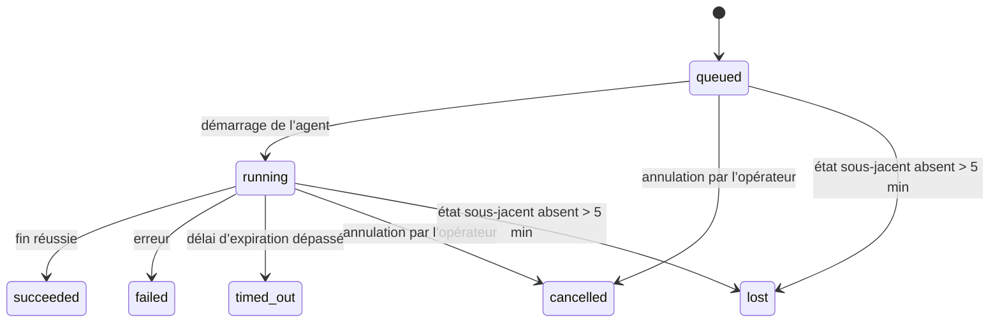

---
read_when:
    - Inspection des tâches en arrière-plan en cours ou récemment terminées
    - Débogage des échecs de livraison pour les exécutions d’agent détachées
    - Comprendre le lien entre les exécutions en arrière-plan, les sessions, Cron et Heartbeat
sidebarTitle: Background tasks
summary: Suivi des tâches en arrière-plan pour les exécutions ACP, les sous-agents, les exécutions Cron et les opérations CLI
title: Tâches en arrière-plan
x-i18n:
    generated_at: "2026-07-12T15:02:05Z"
    model: gpt-5.6
    postprocess_version: locale-links-v1
    prompt_version: 15
    provider: openai
    source_hash: 0a945e8103c5df5a64785f326a9d0b08784ac32a2ca6fa3d4c399d75fc54be2b
    source_path: automation/tasks.md
    workflow: 16
---

<Note>
Vous recherchez une solution de planification ? Consultez [Automatisation](/fr/automation) pour choisir le mécanisme approprié. Cette page est le registre d’activité des travaux en arrière-plan, pas le planificateur.
</Note>

Les tâches en arrière-plan suivent les travaux qui s’exécutent **en dehors de votre session de conversation principale** : exécutions ACP, lancements de sous-agents, exécutions de tâches cron et opérations lancées depuis la CLI.

Les tâches ne remplacent **pas** les sessions, les tâches cron ni les Heartbeats : elles constituent le **registre d’activité** qui consigne les travaux détachés effectués, leur date et leur réussite ou leur échec.

<Note>
Chaque exécution d’agent ne crée pas nécessairement une tâche. Les tours de Heartbeat et les conversations interactives normales n’en créent pas. Toutes les exécutions cron, les créations de sessions ACP, les lancements de sous-agents et les commandes d’agent CLI distribuées par le Gateway en créent une.
</Note>

## En bref

- Les tâches sont des **enregistrements**, pas des planificateurs : cron et Heartbeat déterminent _quand_ les travaux s’exécutent, tandis que les tâches suivent _ce qui s’est passé_.
- ACP, les sous-agents, toutes les tâches cron et les opérations CLI créent des tâches. Les tours de Heartbeat n’en créent pas.
- Chaque tâche passe par les états `queued → running → terminal` (succeeded, failed, timed_out, cancelled ou lost).
- Les tâches cron restent actives tant que l’environnement d’exécution cron contrôle encore la tâche ; si l’état d’exécution en mémoire a disparu, la maintenance des tâches vérifie d’abord l’historique durable des exécutions cron avant de marquer une tâche comme perdue.
- La fin des tâches est signalée par notification : les travaux détachés peuvent envoyer directement une notification ou réveiller la session ou le Heartbeat demandeur lorsqu’ils se terminent. Les boucles d’interrogation de l’état sont donc généralement inadaptées.
- Dans la mesure du possible, les exécutions cron isolées et les sous-agents terminés nettoient les onglets et processus de navigateur suivis pour leur session enfant avant la comptabilisation finale du nettoyage.
- La livraison des exécutions cron isolées supprime les réponses intermédiaires obsolètes du parent tant que les travaux des sous-agents descendants sont encore en cours de finalisation, et privilégie la sortie finale des descendants si elle arrive avant la livraison.
- Les notifications de fin sont envoyées directement à un canal ou mises en file d’attente jusqu’au prochain Heartbeat.
- `openclaw tasks list` affiche toutes les tâches ; `openclaw tasks audit` signale les problèmes.
- Les enregistrements terminaux sont conservés pendant 7 jours (24 heures pour les enregistrements `lost`), puis automatiquement supprimés.

## Démarrage rapide

<Tabs>
  <Tab title="Répertorier et filtrer">
    ```bash
    # Répertorier toutes les tâches (les plus récentes en premier)
    openclaw tasks list

    # Filtrer par environnement d’exécution ou par état
    openclaw tasks list --runtime acp
    openclaw tasks list --status running
    ```

  </Tab>
  <Tab title="Examiner">
    ```bash
    # Afficher les détails d’une tâche précise (par ID de tâche, ID d’exécution ou clé de session)
    openclaw tasks show <lookup>
    ```
  </Tab>
  <Tab title="Annuler et notifier">
    ```bash
    # Annuler une tâche en cours d’exécution (met fin à la session enfant)
    openclaw tasks cancel <lookup>

    # Modifier la politique de notification d’une tâche
    openclaw tasks notify <lookup> state_changes
    ```

  </Tab>
  <Tab title="Audit et maintenance">
    ```bash
    # Exécuter un audit d’intégrité
    openclaw tasks audit

    # Prévisualiser ou appliquer la maintenance
    openclaw tasks maintenance
    openclaw tasks maintenance --apply
    ```

  </Tab>
  <Tab title="Flux de tâches">
    ```bash
    # Examiner l’état de TaskFlow
    openclaw tasks flow list
    openclaw tasks flow show <lookup>
    openclaw tasks flow cancel <lookup>
    ```
  </Tab>
</Tabs>

## Ce qui crée une tâche

| Source                    | Type d’environnement d’exécution | Moment de création de l’enregistrement de tâche                          | Politique de notification par défaut |
| ------------------------- | -------------------------------- | ------------------------------------------------------------------------ | ------------------------------------ |
| Exécutions ACP en arrière-plan | `acp`                       | Création d’une session ACP enfant                                        | `done_only`                          |
| Orchestration de sous-agents | `subagent`                    | Lancement d’un sous-agent via `sessions_spawn`                            | `done_only`                          |
| Tâches cron (tous types)  | `cron`                           | À chaque exécution cron (session principale et isolée)                    | `silent`                             |
| Opérations CLI            | `cli`                            | Commandes `openclaw agent` exécutées par l’intermédiaire du gateway       | `silent`                             |
| Tâches multimédias d’agent | `cli`                           | Exécutions `image_generate`/`music_generate`/`video_generate` adossées à une session | `silent`                    |

<AccordionGroup>
  <Accordion title="Valeurs par défaut des notifications pour cron et les contenus multimédias">
    Les tâches cron (de session principale et isolées) utilisent la politique de notification `silent` : elles créent des enregistrements de suivi, mais ne génèrent aucune notification de tâche propre ; cron gère son propre mode de livraison.

    Les exécutions `image_generate`, `music_generate` et `video_generate` adossées à une session utilisent également la politique de notification `silent`. Elles créent tout de même des enregistrements de tâche, mais leur fin est renvoyée à la session d’agent d’origine sous forme de réveil interne afin que l’agent puisse rédiger le message de suivi et y joindre lui-même les contenus multimédias terminés. L’agent demandeur respecte son contrat habituel de réponse visible : réponse finale automatique lorsqu’elle est configurée, ou `message(action="send")` suivi de `NO_REPLY` lorsque la session exige des réponses au moyen de l’outil de messagerie. Si la session demandeuse n’est plus active ou si son réveil actif échoue, et que l’agent de fin ne récupère pas tout ou partie des contenus multimédias générés, OpenClaw envoie directement à la cible du canal d’origine un message de secours idempotent contenant uniquement les contenus multimédias manquants.

  </Accordion>
  <Accordion title="Protection contre les générations multimédias simultanées">
    Tant qu’une tâche de génération multimédia adossée à une session est active, `image_generate`, `music_generate` et `video_generate` préviennent les nouvelles tentatives accidentelles : répéter l’appel avec la même invite ou requête renvoie l’état de la tâche active correspondante au lieu de créer un doublon, tandis qu’une invite distincte peut lancer sa propre tâche. Utilisez `action: "status"` pour demander explicitement la progression ou l’état depuis l’agent.
  </Accordion>
  <Accordion title="Ce qui ne crée pas de tâches">
    - Tours de Heartbeat dans la session principale ; consultez [Heartbeat](/fr/gateway/heartbeat)
    - Tours de conversation interactive normale
    - Réponses directes à `/command`

  </Accordion>
</AccordionGroup>

## Cycle de vie d’une tâche



| État        | Signification                                                                 |
| ----------- | ----------------------------------------------------------------------------- |
| `queued`    | Créée, en attente du démarrage de l’agent                                     |
| `running`   | Le tour de l’agent est en cours d’exécution                                   |
| `succeeded` | Terminée avec succès                                                          |
| `failed`    | Terminée avec une erreur                                                      |
| `timed_out` | A dépassé le délai d’expiration configuré                                     |
| `cancelled` | Arrêtée par l’opérateur via `openclaw tasks cancel`, ou exécution interrompue |
| `lost`      | L’environnement d’exécution a perdu l’état sous-jacent faisant autorité après un délai de grâce de 5 minutes |

Les transitions se produisent automatiquement : les événements du cycle de vie de l’exécution de l’agent (démarrage, fin, erreur) mettent à jour l’état de la tâche ; vous ne le gérez pas manuellement.

La fin de l’exécution de l’agent fait autorité pour les enregistrements de tâches actives. Une exécution détachée réussie se termine à l’état `succeeded`, les erreurs d’exécution ordinaires à l’état `failed`, les expirations à l’état `timed_out` et les annulations ou interruptions à l’état `cancelled`. Une fois qu’une tâche est dans un état terminal, les signaux de cycle de vie ultérieurs ne peuvent pas la rétrograder : une tâche annulée par un opérateur ou déjà à l’état `failed`/`timed_out`/`lost` y reste même si un signal de réussite arrive ensuite.

L’état `lost` tient compte de l’environnement d’exécution :

- Tâches ACP : seul un tour ACP actif dans le processus du Gateway prouve que l’exécution est active ; les métadonnées de session persistantes ne suffisent pas. L’audit CLI hors ligne reste prudent et ne récupère jamais les tâches ACP.
- Tâches de sous-agent : la session enfant sous-jacente a disparu du stockage de l’agent cible (ou contient une marque de récupération après redémarrage).
- Tâches cron : l’environnement d’exécution cron ne suit plus la tâche comme active et l’historique durable des exécutions cron n’indique aucun résultat terminal pour cette exécution. L’audit CLI hors ligne ne considère pas comme faisant autorité son propre état vide d’exécution cron dans le processus.
- Tâches CLI : les tâches dotées d’un ID d’exécution ou d’un ID source utilisent le contexte d’exécution actif. Ainsi, les lignes persistantes de session enfant ou de session de conversation ne les maintiennent pas actives après la disparition de l’exécution contrôlée par le gateway. Les anciennes tâches CLI sans identité d’exécution continuent de se rabattre sur la session enfant. Les exécutions `openclaw agent` adossées au Gateway sont également finalisées à partir de leur résultat d’exécution ; les exécutions terminées ne restent donc pas actives jusqu’à ce que le processus de nettoyage les marque comme `lost`.

## Livraison et notifications

Lorsqu’une tâche atteint un état terminal, OpenClaw vous en informe. Deux modes de livraison sont disponibles :

**Livraison directe** : si la tâche possède une cible de canal (`requesterOrigin`), le message de fin est envoyé directement à ce canal (Discord, Slack, Telegram, etc.). Les fins de tâches de groupe et de canal sont plutôt acheminées par la session demandeuse afin que l’agent parent puisse rédiger la réponse visible. Pour les fins de sous-agents, OpenClaw conserve également, lorsqu’il est disponible, le routage associé au fil de discussion ou au sujet. Avant de renoncer à une livraison directe, il peut compléter un champ `to` ou un compte manquant à partir du routage enregistré dans la session demandeuse (`lastChannel` / `lastTo` / `lastAccountId`).

**Livraison mise en file d’attente dans la session** : si la livraison directe échoue ou si aucune origine n’est définie, la mise à jour est ajoutée comme événement système dans la session demandeuse et apparaît lors du prochain Heartbeat.

<Tip>
Les fins de tâches mises en file d’attente dans une session déclenchent un réveil immédiat du Heartbeat. Vous voyez donc rapidement le résultat, sans devoir attendre la prochaine exécution planifiée du Heartbeat.
</Tip>

Le fonctionnement habituel repose donc sur les notifications : lancez une seule fois le travail détaché, puis laissez l’environnement d’exécution vous réveiller ou vous avertir lorsqu’il se termine. N’interrogez l’état de la tâche que pour le débogage, une intervention ou un audit explicite.

### Politiques de notification

Contrôlez la quantité d’informations reçues pour chaque tâche :

| Politique             | Contenu livré                                                     |
| --------------------- | ----------------------------------------------------------------- |
| `done_only` (par défaut) | Uniquement l’état terminal (succeeded, failed, etc.)            |
| `state_changes`       | Chaque transition d’état et chaque mise à jour de progression     |
| `silent`              | Aucun contenu (valeur par défaut pour les tâches cron, CLI et multimédias) |

Modifiez la politique pendant l’exécution d’une tâche :

```bash
openclaw tasks notify <lookup> state_changes
```

## Référence de la CLI

<AccordionGroup>
  <Accordion title="tasks list">
    ```bash
    openclaw tasks list [--runtime <acp|subagent|cron|cli>] [--status <status>] [--json]
    ```

    Colonnes de sortie : Task, Kind, Status, Delivery, Run, Child Session, Summary. La commande simple `openclaw tasks` se comporte comme `openclaw tasks list`.

  </Accordion>
  <Accordion title="tasks show">
    ```bash
    openclaw tasks show <lookup> [--json]
    ```

    Le jeton de recherche accepte un ID de tâche, un ID d’exécution ou une clé de session. Affiche l’enregistrement complet, notamment les informations temporelles, l’état de livraison, l’erreur et le résumé terminal.

  </Accordion>
  <Accordion title="tasks cancel">
    ```bash
    openclaw tasks cancel <lookup>
    ```

    Pour les tâches ACP et de sous-agent, cette commande met fin à la session enfant ; les annulations ACP et cron passent par le Gateway en cours d’exécution (`tasks.cancel`). Pour les tâches suivies par la CLI, l’annulation est enregistrée dans le registre des tâches (il n’existe aucun handle d’environnement enfant distinct). L’état passe à `cancelled` et une notification de livraison est envoyée le cas échéant.

  </Accordion>
  <Accordion title="tasks notify">
    ```bash
    openclaw tasks notify <lookup> <done_only|state_changes|silent>
    ```
  </Accordion>
  <Accordion title="tasks audit">
    ```bash
    openclaw tasks audit [--severity <warn|error>] [--code <name>] [--limit <n>] [--json]
    ```

    Signale dans un rapport unique les problèmes opérationnels des tâches **et** des TaskFlows. Les constats apparaissent également dans `openclaw status` lorsque des problèmes sont détectés.

    Constats relatifs aux tâches :

    | Constat                   | Gravité   | Déclencheur                                                                                                      |
    | ------------------------- | ---------- | ------------------------------------------------------------------------------------------------------------ |
    | `stale_queued`            | warn       | En file d’attente depuis plus de 10 minutes                                                                              |
    | `stale_running`           | error      | En cours d’exécution depuis plus de 30 minutes                                                                             |
    | `lost`                    | warn/error | La propriété de la tâche assurée par l’environnement d’exécution a disparu ; les tâches perdues conservées génèrent un avertissement jusqu’à `cleanupAfter`, puis deviennent des erreurs |
    | `delivery_failed`         | warn       | La livraison a échoué et la politique de notification n’est pas `silent`                                                            |
    | `missing_cleanup`         | warn       | Tâche terminale sans horodatage de nettoyage                                                                      |
    | `inconsistent_timestamps` | warn       | Violation de la chronologie (par exemple, fin antérieure au début)                                                        |

    Constats TaskFlow :

    | Constat                | Gravité   | Déclencheur                                                                    |
    | ---------------------- | ---------- | --------------------------------------------------------------------------- |
    | `restore_failed`       | error      | Échec de la restauration du registre des flux depuis SQLite                                    |
    | `stale_running`        | error      | Le flux en cours d’exécution n’a pas progressé depuis plus de 30 minutes                      |
    | `stale_waiting`        | warn       | Le flux en attente n’a pas progressé depuis plus de 30 minutes                      |
    | `stale_blocked`        | warn       | Le flux bloqué n’a pas progressé depuis plus de 30 minutes                      |
    | `cancel_stuck`         | warn       | Annulation demandée il y a plus de 5 minutes, aucune tâche enfant active, flux toujours non terminal |
    | `missing_linked_tasks` | warn/error | Flux géré obsolète sans tâche liée ni état d’attente                       |
    | `blocked_task_missing` | warn       | Le flux bloqué pointe vers un identifiant de tâche qui n’existe plus                      |

  </Accordion>
  <Accordion title="maintenance des tâches">
    ```bash
    openclaw tasks maintenance [--json]
    openclaw tasks maintenance --apply [--json]
    ```

    Utilisez cette commande pour prévisualiser ou appliquer la réconciliation, l’ajout des horodatages de nettoyage et l’élagage des tâches, de l’état TaskFlow et des lignes obsolètes du registre des sessions d’exécution Cron.

    La réconciliation tient compte de l’environnement d’exécution :

    - Les tâches ACP nécessitent un tour actif dans le processus du Gateway ; les tâches de sous-agent vérifient leur session enfant sous-jacente.
    - Les tâches de sous-agent dont la session enfant possède une trace de récupération après redémarrage sont marquées comme perdues au lieu d’être considérées comme des sessions sous-jacentes récupérables.
    - Les tâches Cron vérifient si l’environnement d’exécution Cron possède toujours la tâche planifiée, puis récupèrent l’état terminal depuis les journaux d’exécution Cron ou l’état persistant de la tâche planifiée avant d’utiliser `lost` en dernier recours. Seul le processus Gateway fait autorité pour l’ensemble en mémoire des tâches Cron actives ; l’audit hors ligne de la CLI utilise l’historique persistant, mais ne marque pas une tâche Cron comme perdue uniquement parce que cet ensemble local est vide.
    - Les tâches CLI dotées d’une identité d’exécution vérifient le contexte d’exécution actif propriétaire, et pas seulement les lignes de session enfant ou de session de discussion.

    Le nettoyage à l’achèvement tient également compte de l’environnement d’exécution :

    - À l’achèvement d’un sous-agent, OpenClaw tente de fermer les onglets de navigateur et processus suivis pour la session enfant avant de poursuivre le nettoyage de l’annonce.
    - À l’achèvement d’une exécution Cron isolée, OpenClaw tente de fermer les onglets de navigateur et processus suivis pour la session Cron avant la fin complète de l’exécution.
    - La livraison Cron isolée attend, si nécessaire, la fin du suivi des sous-agents descendants et supprime le texte obsolète d’accusé de réception du parent au lieu de l’annoncer.
    - La livraison à l’achèvement d’un sous-agent utilise uniquement le dernier texte visible de l’assistant enfant. La sortie de tool/toolResult n’est pas promue comme texte de résultat de l’enfant. Les exécutions terminales en échec annoncent l’état d’échec sans reproduire le texte de réponse capturé.
    - Les échecs de nettoyage ne masquent pas le résultat réel de la tâche.

    Lors de l’application de la maintenance, OpenClaw supprime également les lignes obsolètes du registre des sessions `cron:<jobId>:run:<runId>` datant de plus de 7 jours, tout en conservant les lignes des tâches Cron en cours d’exécution et en laissant intactes les lignes de session non Cron.

  </Accordion>
  <Accordion title="tasks flow list | show | cancel">
    ```bash
    openclaw tasks flow list [--status <status>] [--json]
    openclaw tasks flow show <lookup> [--json]
    openclaw tasks flow cancel <lookup>
    ```

    Le jeton de recherche de flux accepte un identifiant de flux ou une clé de propriétaire. Utilisez ces commandes lorsque le [flux de tâches](/fr/automation/taskflow) d’orchestration vous intéresse davantage qu’un enregistrement individuel de tâche en arrière-plan.

  </Accordion>
</AccordionGroup>

## Tableau des tâches de discussion (`/tasks`)

Utilisez `/tasks` dans n’importe quelle session de discussion pour afficher les tâches en arrière-plan liées à cette session. Le tableau affiche jusqu’à cinq tâches actives ou récemment terminées, avec leur environnement d’exécution, leur état, leurs informations temporelles ainsi que le détail de leur progression ou de leur erreur.

Lorsque la session actuelle ne comporte aucune tâche liée visible, `/tasks` se rabat sur le nombre de tâches locales de l’agent afin de fournir tout de même une vue d’ensemble sans divulguer les détails d’autres sessions.

Pour consulter le registre opérateur complet, utilisez la CLI : `openclaw tasks list`.

### Interface de contrôle

L’interface de contrôle web comporte une page **Tâches** dans la barre latérale, qui présente en direct les tâches en arrière-plan actives et récentes. Utilisez-la pour examiner la progression, ouvrir les sessions liées, actualiser le registre ou annuler les tâches en file d’attente et en cours d’exécution.

Les volets de discussion comportent également un panneau réductible **Tâches en arrière-plan**, limité à l’agent du volet : tâches et sous-agents en cours d’exécution avec une commande d’arrêt, une section des éléments terminés et des liens Afficher la transcription vers la session enfant de chaque tâche. Ouvrez-le depuis le bouton d’activité dans l’en-tête du volet (ou depuis le bouton d’activité flottant dans une discussion à volet unique).

## Intégration à l’état (pression des tâches)

`openclaw status` comprend une ligne récapitulative des tâches :

```
Tâches    2 actives · 1 en attente · 1 en cours · 1 problème · audit sans anomalie · 6 suivies
```

Le résumé compte le travail actif (`queued` + `running`), les échecs (`failed` + `timed_out` + `lost`), les constats d’audit et le nombre total d’enregistrements suivis ; la charge utile JSON détaille également les nombres par environnement d’exécution (`acp`, `subagent`, `cron`, `cli`).

`/status` et l’outil `session_status` utilisent tous deux un instantané des tâches tenant compte du nettoyage : les tâches actives sont privilégiées, les lignes expirées sont masquées et les tâches terminales n’apparaissent que pendant une courte période récente (5 minutes), en mettant l’accent sur les échecs lorsqu’il ne reste aucun travail actif. La carte d’état reste ainsi centrée sur ce qui importe à cet instant.

## Stockage et maintenance

### Emplacement des tâches

Les enregistrements de tâches et l’état de livraison sont conservés dans la base de données d’état SQLite partagée d’OpenClaw :

```
~/.openclaw/state/openclaw.sqlite   (tables : task_runs, task_delivery_state, flow_runs)
```

Définissez `OPENCLAW_STATE_DIR` pour déplacer l’ensemble de la racine d’état (par défaut `~/.openclaw`) ailleurs ; le chemin de la base de données partagée est déplacé avec elle.

Le registre est chargé en mémoire lors de sa première utilisation et chaque écriture est conservée dans SQLite, de sorte que les enregistrements survivent aux redémarrages du Gateway. La croissance du WAL reste limitée grâce au seuil de point de contrôle automatique par défaut de SQLite et à des points de contrôle `PASSIVE` périodiques ; les points de contrôle à l’arrêt et lors d’une maintenance explicite utilisent `TRUNCATE`, afin que les fermetures normales récupèrent l’espace du WAL sans obliger le processus de nettoyage en arrière-plan à attendre les lecteurs actifs.

Les anciens magasins annexes issus d’installations antérieures (`tasks/runs.sqlite`, `flows/registry.sqlite`) sont importés dans la base de données partagée par `openclaw doctor`.

### Maintenance automatique

Un processus de nettoyage s’exécute toutes les **60 secondes** (premier passage environ 5 secondes après le démarrage du Gateway) et effectue quatre opérations :

<Steps>
  <Step title="Réconciliation">
    Vérifie si les tâches actives disposent toujours d’un environnement d’exécution sous-jacent faisant autorité. Les tâches ACP nécessitent un tour actif dans le processus, les tâches de sous-agent utilisent l’état de la session enfant, les tâches Cron utilisent la propriété de la tâche active ainsi que l’historique persistant des exécutions, et les tâches CLI dotées d’une identité d’exécution utilisent le contexte d’exécution propriétaire. Si l’état sous-jacent a disparu depuis plus de 5 minutes (30 minutes pour les tâches natives de sous-agent sans enfant), la tâche est marquée `lost`.
  </Step>
  <Step title="Réparation des sessions ACP">
    Ferme les sessions ACP ponctuelles terminales ou orphelines appartenant au parent, et ferme les sessions ACP persistantes terminales obsolètes ou orphelines uniquement lorsqu’il ne reste aucune liaison active avec une conversation.
  </Step>
  <Step title="Ajout de l’horodatage de nettoyage">
    Définit un horodatage `cleanupAfter` sur les tâches terminales (heure de terminaison + période de conservation). Pendant la conservation, les tâches perdues apparaissent encore dans l’audit sous forme d’avertissements ; après l’expiration de `cleanupAfter`, ou lorsque les métadonnées de nettoyage sont absentes, elles deviennent des erreurs.
  </Step>
  <Step title="Élagage">
    Supprime les enregistrements dont la date `cleanupAfter` est dépassée.
  </Step>
</Steps>

<Note>
**Conservation :** les enregistrements des tâches terminales sont conservés pendant **7 jours** (les enregistrements `lost` pendant **24 heures**), puis automatiquement élagués. Aucune configuration n’est nécessaire.
</Note>

## Relations entre les tâches et les autres systèmes

<AccordionGroup>
  <Accordion title="Tâches et flux de tâches">
    Le [flux de tâches](/fr/automation/taskflow) est la couche d’orchestration des flux située au-dessus des tâches en arrière-plan. Un même flux peut coordonner plusieurs tâches au cours de son cycle de vie à l’aide de modes de synchronisation gérés ou reflétés. Utilisez `openclaw tasks` pour examiner les enregistrements de tâches individuels et `openclaw tasks flow` pour examiner le flux d’orchestration.

  </Accordion>
  <Accordion title="Tâches et Cron">
    Les définitions des tâches Cron, l’état d’exécution et l’historique des exécutions résident dans la base de données d’état SQLite partagée d’OpenClaw. **Chaque** exécution Cron crée un enregistrement de tâche, qu’elle utilise la session principale ou soit isolée, avec la politique de notification `silent`, de sorte que les exécutions Cron sont suivies sans générer leurs propres notifications de tâche.

    Consultez [Tâches Cron](/fr/automation/cron-jobs).

  </Accordion>
  <Accordion title="Tâches et Heartbeat">
    Les exécutions Heartbeat sont des tours de la session principale : elles ne créent pas d’enregistrements de tâche. Lorsqu’une tâche se termine, elle peut déclencher un réveil Heartbeat afin que vous voyiez rapidement le résultat.

    Consultez [Heartbeat](/fr/gateway/heartbeat).

  </Accordion>
  <Accordion title="Tâches et sessions">
    Une tâche peut référencer une `childSessionKey` (où le travail s’exécute) et une `requesterSessionKey` (qui l’a démarré). Son `agentId` identifie l’agent exécutant le travail, tandis que les champs du demandeur et du propriétaire préservent le contexte de lancement et de contrôle. Les sessions représentent le contexte de conversation ; les tâches assurent le suivi des activités qui s’y superposent.
  </Accordion>
  <Accordion title="Tâches et exécutions d’agent">
    Le `runId` d’une tâche renvoie à l’exécution d’agent qui effectue le travail. Les événements du cycle de vie de l’agent (début, fin, erreur) mettent automatiquement à jour l’état de la tâche ; vous n’avez pas à gérer ce cycle de vie manuellement.
  </Accordion>
</AccordionGroup>

## Ressources associées

- [Automatisation](/fr/automation) - vue d’ensemble de tous les mécanismes d’automatisation
- [CLI : tâches](/fr/cli/tasks) - référence des commandes de la CLI
- [Heartbeat](/fr/gateway/heartbeat) - tours périodiques de la session principale
- [Tâches planifiées](/fr/automation/cron-jobs) - planification du travail en arrière-plan
- [Flux de tâches](/fr/automation/taskflow) - orchestration des flux au-dessus des tâches
