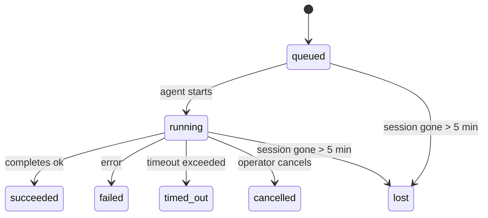

---
read_when:
    - Inspection des travaux en arrière-plan en cours ou récemment terminés
    - Débogage des échecs de livraison pour les exécutions d’agent détachées
    - Comprendre le lien entre les exécutions en arrière-plan, les sessions, Cron et Heartbeat
sidebarTitle: Background tasks
summary: Suivi des tâches en arrière-plan pour les exécutions ACP, les sous-agents, les tâches Cron isolées et les opérations CLI
title: Tâches en arrière-plan
x-i18n:
    generated_at: "2026-06-27T17:09:00Z"
    model: gpt-5.5
    postprocess_version: locale-links-v1
    provider: openai
    source_hash: 4a630a52d0d6bfd387a37415dd63fc4bfbce23f99eaa8cb780c3d6f8913675fd
    source_path: automation/tasks.md
    workflow: 16
---

<Note>
Vous cherchez la planification ? Consultez [Automation](/fr/automation) pour choisir le bon mécanisme. Cette page est le registre d’activité du travail en arrière-plan, pas le planificateur.
</Note>

Les tâches d’arrière-plan suivent le travail qui s’exécute **en dehors de votre session de conversation principale** : exécutions ACP, lancements de sous-agents, exécutions isolées de tâches Cron, et opérations initiées par la CLI.

Les tâches ne remplacent **pas** les sessions, les tâches Cron ni les Heartbeats - elles sont le **registre d’activité** qui enregistre quel travail détaché a eu lieu, quand, et s’il a réussi.

<Note>
Toutes les exécutions d’agent ne créent pas une tâche. Les tours Heartbeat et la discussion interactive normale n’en créent pas. Toutes les exécutions Cron, les lancements ACP, les lancements de sous-agents et les commandes d’agent CLI en créent.
</Note>

## TL;DR

- Les tâches sont des **enregistrements**, pas des planificateurs - Cron et Heartbeat décident _quand_ le travail s’exécute, les tâches suivent _ce qui s’est passé_.
- ACP, les sous-agents, toutes les tâches Cron et les opérations CLI créent des tâches. Les tours Heartbeat n’en créent pas.
- Chaque tâche passe par `queued → running → terminal` (succeeded, failed, timed_out, cancelled ou lost).
- Les tâches Cron restent actives tant que le runtime Cron possède toujours la tâche ; si l’état
  du runtime en mémoire a disparu, la maintenance des tâches vérifie d’abord l’historique durable
  des exécutions Cron avant de marquer une tâche comme perdue.
- L’achèvement est piloté par push : le travail détaché peut notifier directement ou réveiller la
  session/le Heartbeat demandeur lorsqu’il se termine, de sorte que les boucles d’interrogation de statut
  sont généralement une mauvaise approche.
- Les exécutions Cron isolées et les achèvements de sous-agents nettoient au mieux les onglets/processus de navigateur suivis pour leur session enfant avant la comptabilité finale du nettoyage.
- La livraison Cron isolée supprime les réponses parent intermédiaires obsolètes tant que le travail des sous-agents descendants est encore en cours de vidage, et elle privilégie la sortie finale du descendant lorsqu’elle arrive avant la livraison.
- Les notifications d’achèvement sont livrées directement à un canal ou mises en file d’attente pour le prochain Heartbeat.
- `openclaw tasks list` affiche toutes les tâches ; `openclaw tasks audit` fait remonter les problèmes.
- Les enregistrements terminaux sont conservés pendant 7 jours, puis automatiquement élagués.

## Démarrage rapide

<Tabs>
  <Tab title="Lister et filtrer">
    ```bash
    # List all tasks (newest first)
    openclaw tasks list

    # Filter by runtime or status
    openclaw tasks list --runtime acp
    openclaw tasks list --status running
    ```

  </Tab>
  <Tab title="Inspecter">
    ```bash
    # Show details for a specific task (by ID, run ID, or session key)
    openclaw tasks show <lookup>
    ```
  </Tab>
  <Tab title="Annuler et notifier">
    ```bash
    # Cancel a running task (kills the child session)
    openclaw tasks cancel <lookup>

    # Change notification policy for a task
    openclaw tasks notify <lookup> state_changes
    ```

  </Tab>
  <Tab title="Audit et maintenance">
    ```bash
    # Run a health audit
    openclaw tasks audit

    # Preview or apply maintenance
    openclaw tasks maintenance
    openclaw tasks maintenance --apply
    ```

  </Tab>
  <Tab title="Flux de tâches">
    ```bash
    # Inspect TaskFlow state
    openclaw tasks flow list
    openclaw tasks flow show <lookup>
    openclaw tasks flow cancel <lookup>
    ```
  </Tab>
</Tabs>

## Ce qui crée une tâche

| Source                 | Type de runtime | Quand un enregistrement de tâche est créé                              | Politique de notification par défaut |
| ---------------------- | --------------- | ---------------------------------------------------------------------- | ------------------------------------ |
| Exécutions ACP en arrière-plan | `acp`        | Lancement d’une session ACP enfant                                     | `done_only`                          |
| Orchestration de sous-agents | `subagent`   | Lancement d’un sous-agent via `sessions_spawn`                         | `done_only`                          |
| Tâches Cron (tous types) | `cron`       | Chaque exécution Cron (session principale et isolée)                   | `silent`                             |
| Opérations CLI         | `cli`           | Commandes `openclaw agent` exécutées via le Gateway                    | `silent`                             |
| Tâches média d’agent   | `cli`           | Exécutions `image_generate`/`music_generate`/`video_generate` adossées à une session | `silent`              |

<AccordionGroup>
  <Accordion title="Valeurs par défaut de notification pour Cron et les médias">
    Les tâches Cron de session principale utilisent par défaut la politique de notification `silent` - elles créent des enregistrements pour le suivi mais ne génèrent pas de notifications. Les tâches Cron isolées utilisent également `silent` par défaut, mais sont plus visibles parce qu’elles s’exécutent dans leur propre session.

    Les exécutions `image_generate`, `music_generate` et `video_generate` adossées à une session utilisent également la politique de notification `silent`. Elles créent tout de même des enregistrements de tâche, mais l’achèvement est renvoyé à la session d’agent d’origine comme réveil interne afin que l’agent puisse rédiger lui-même le message de suivi et joindre le média terminé. L’agent demandeur suit son contrat normal de réponse visible : réponse finale automatique lorsqu’elle est configurée, ou `message(action="send")` plus `NO_REPLY` lorsque la session exige des réponses via l’outil de message. Si la session demandeuse n’est plus active ou si son réveil actif échoue, et que l’agent d’achèvement manque une partie ou la totalité des médias générés, OpenClaw envoie un repli direct idempotent avec uniquement les médias manquants vers la cible de canal d’origine.

  </Accordion>
  <Accordion title="Garde-fou de génération média concurrente">
    Tant qu’une tâche de génération média adossée à une session est encore active, les outils média agissent aussi comme garde-fous contre les relances accidentelles. Les appels `image_generate` répétés pour la même invite renvoient le statut de la tâche active correspondante, tandis qu’une invite d’image distincte peut lancer sa propre tâche. Les appels `music_generate` et `video_generate` renvoient toujours le statut de la tâche active pour cette session au lieu de démarrer une deuxième génération concurrente. Utilisez `action: "status"` lorsque vous voulez une recherche explicite de progression/statut côté agent.
  </Accordion>
  <Accordion title="Ce qui ne crée pas de tâches">
    - Tours Heartbeat - session principale ; voir [Heartbeat](/fr/gateway/heartbeat)
    - Tours de discussion interactive normale
    - Réponses directes à `/command`

  </Accordion>
</AccordionGroup>

## Cycle de vie des tâches



| Statut      | Ce que cela signifie                                                      |
| ----------- | -------------------------------------------------------------------------- |
| `queued`    | Créée, en attente du démarrage de l’agent                                  |
| `running`   | Le tour d’agent est en cours d’exécution active                            |
| `succeeded` | Terminée avec succès                                                       |
| `failed`    | Terminée avec une erreur                                                   |
| `timed_out` | A dépassé le délai d’expiration configuré                                  |
| `cancelled` | Arrêtée par l’opérateur via `openclaw tasks cancel`                        |
| `lost`      | Le runtime a perdu l’état d’appui faisant autorité après une période de grâce de 5 minutes |

Les transitions se produisent automatiquement - lorsque l’exécution d’agent associée se termine, le statut de la tâche est mis à jour en conséquence.

L’achèvement de l’exécution d’agent fait autorité pour les enregistrements de tâches actifs. Une exécution détachée réussie se finalise en `succeeded`, les erreurs d’exécution ordinaires se finalisent en `failed`, et les résultats d’expiration ou d’abandon se finalisent en `timed_out`. Si un opérateur a déjà annulé la tâche, ou si le runtime a déjà enregistré un état terminal plus fort comme `failed`, `timed_out` ou `lost`, un signal de réussite ultérieur ne rétrograde pas ce statut terminal.

`lost` tient compte du runtime :

- Tâches ACP : les métadonnées de session ACP enfant sous-jacentes ont disparu.
- Tâches de sous-agent : la session enfant sous-jacente a disparu du magasin de l’agent cible.
- Tâches Cron : le runtime Cron ne suit plus la tâche comme active et l’historique durable
  des exécutions Cron n’indique pas de résultat terminal pour cette exécution. L’audit CLI
  hors ligne ne traite pas son propre état vide de runtime Cron dans le processus comme faisant autorité.
- Tâches CLI : les tâches avec un identifiant d’exécution/source utilisent le contexte d’exécution actif, de sorte que
  les lignes de session enfant ou de session de discussion persistantes ne les maintiennent pas actives après la disparition de
  l’exécution possédée par le Gateway. Les tâches CLI héritées sans identité d’exécution se rabattent encore
  sur la session enfant. Les exécutions `openclaw agent` adossées au Gateway se finalisent également
  depuis leur résultat d’exécution, de sorte que les exécutions terminées ne restent pas actives jusqu’à ce que le balayeur
  les marque `lost`.

## Livraison et notifications

Lorsqu’une tâche atteint un état terminal, OpenClaw vous notifie. Il existe deux chemins de livraison :

**Livraison directe** - si la tâche a une cible de canal (le `requesterOrigin`), le message d’achèvement va directement à ce canal (Telegram, Discord, Slack, etc.). Les achèvements de tâches de groupe et de canal sont plutôt routés via la session demandeuse afin que l’agent parent puisse rédiger la réponse visible. Pour les achèvements de sous-agents, OpenClaw préserve aussi le routage de fil/sujet lié lorsqu’il est disponible et peut remplir un `to` / compte manquant depuis la route stockée de la session demandeuse (`lastChannel` / `lastTo` / `lastAccountId`) avant d’abandonner la livraison directe.

**Livraison mise en file d’attente dans la session** - si la livraison directe échoue ou qu’aucune origine n’est définie, la mise à jour est mise en file d’attente comme événement système dans la session du demandeur et apparaît au prochain Heartbeat.

<Tip>
L’achèvement d’une tâche déclenche un réveil Heartbeat immédiat afin que vous voyiez rapidement le résultat - vous n’avez pas à attendre le prochain tic Heartbeat planifié.
</Tip>

Cela signifie que le flux de travail habituel est basé sur le push : démarrez le travail détaché une fois, puis laissez le runtime vous réveiller ou vous notifier à l’achèvement. N’interrogez l’état de la tâche que lorsque vous avez besoin de débogage, d’intervention ou d’un audit explicite.

### Politiques de notification

Contrôlez le volume d’informations reçu pour chaque tâche :

| Politique             | Ce qui est livré                                                       |
| --------------------- | --------------------------------------------------------------------- |
| `done_only` (par défaut) | Uniquement l’état terminal (succeeded, failed, etc.) - **c’est la valeur par défaut** |
| `state_changes`       | Chaque transition d’état et mise à jour de progression                 |
| `silent`              | Rien du tout                                                           |

Modifiez la politique pendant qu’une tâche s’exécute :

```bash
openclaw tasks notify <lookup> state_changes
```

## Référence CLI

<AccordionGroup>
  <Accordion title="tasks list">
    ```bash
    openclaw tasks list [--runtime <acp|subagent|cron|cli>] [--status <status>] [--json]
    ```

    Colonnes de sortie : ID de tâche, Type, Statut, Livraison, ID d’exécution, Session enfant, Résumé.

  </Accordion>
  <Accordion title="tasks show">
    ```bash
    openclaw tasks show <lookup>
    ```

    Le jeton de recherche accepte un ID de tâche, un ID d’exécution ou une clé de session. Affiche l’enregistrement complet, y compris le minutage, l’état de livraison, l’erreur et le résumé terminal.

  </Accordion>
  <Accordion title="tasks cancel">
    ```bash
    openclaw tasks cancel <lookup>
    ```

    Pour les tâches ACP et de sous-agent, cela tue la session enfant. Pour les tâches suivies par la CLI, l’annulation est enregistrée dans le registre des tâches (il n’y a pas de handle de runtime enfant séparé). Le statut passe à `cancelled` et une notification de livraison est envoyée le cas échéant.

  </Accordion>
  <Accordion title="tasks notify">
    ```bash
    openclaw tasks notify <lookup> <done_only|state_changes|silent>
    ```
  </Accordion>
  <Accordion title="tasks audit">
    ```bash
    openclaw tasks audit [--json]
    ```

    Fait remonter les problèmes opérationnels. Les constats apparaissent également dans `openclaw status` lorsque des problèmes sont détectés.

    | Résultat                  | Gravité             | Déclencheur                                                                                                           |
    | ------------------------- | ------------------- | --------------------------------------------------------------------------------------------------------------------- |
    | `stale_queued`            | avertissement       | En file d’attente depuis plus de 10 minutes                                                                            |
    | `stale_running`           | erreur              | En cours d’exécution depuis plus de 30 minutes                                                                         |
    | `lost`                    | avertissement/erreur | La propriété de la tâche adossée au runtime a disparu ; les tâches perdues conservées avertissent jusqu’à `cleanupAfter`, puis deviennent des erreurs |
    | `delivery_failed`         | avertissement       | La livraison a échoué et la politique de notification n’est pas `silent`                                               |
    | `missing_cleanup`         | avertissement       | Tâche terminale sans horodatage de nettoyage                                                                           |
    | `inconsistent_timestamps` | avertissement       | Violation de chronologie (par exemple, terminée avant d’avoir commencé)                                                |

  </Accordion>
  <Accordion title="tasks maintenance">
    ```bash
    openclaw tasks maintenance [--json]
    openclaw tasks maintenance --apply [--json]
    ```

    Utilisez cette commande pour prévisualiser ou appliquer la réconciliation, l’horodatage de nettoyage et l’élagage des tâches, de l’état Task Flow et des lignes obsolètes du registre de sessions d’exécution cron.

    La réconciliation tient compte du runtime :

    - Les tâches ACP/sous-agent vérifient leur session enfant sous-jacente.
    - Les tâches de sous-agent dont la session enfant comporte une pierre tombale de récupération après redémarrage sont marquées comme perdues au lieu d’être traitées comme des sessions sous-jacentes récupérables.
    - Les tâches Cron vérifient si le runtime cron possède toujours la tâche, puis récupèrent l’état terminal depuis les journaux persistés d’exécution cron/l’état de la tâche avant de se rabattre sur `lost`. Seul le processus Gateway fait autorité pour l’ensemble en mémoire des tâches cron actives ; l’audit CLI hors ligne utilise l’historique durable, mais ne marque pas une tâche cron comme perdue uniquement parce que ce Set local est vide.
    - Les tâches CLI avec identité d’exécution vérifient le contexte d’exécution actif propriétaire, pas seulement les lignes de session enfant ou de session de chat.

    Le nettoyage de complétion tient également compte du runtime :

    - La complétion de sous-agent ferme au mieux les onglets/processus de navigateur suivis pour la session enfant avant que le nettoyage d’annonce continue.
    - La complétion cron isolée ferme au mieux les onglets/processus de navigateur suivis pour la session cron avant que l’exécution ne se termine entièrement.
    - La livraison cron isolée attend, si nécessaire, le suivi par sous-agent descendant et supprime le texte d’accusé de réception parent obsolète au lieu de l’annoncer.
    - La livraison de complétion de sous-agent utilise uniquement le dernier texte assistant visible de l’enfant. La sortie tool/toolResult n’est pas promue en texte de résultat enfant. Les exécutions terminales échouées annoncent l’état d’échec sans rejouer le texte de réponse capturé.
    - Les échecs de nettoyage ne masquent pas le résultat réel de la tâche.

    Lors de l’application de la maintenance, OpenClaw supprime aussi les lignes obsolètes du registre de sessions `cron:<jobId>:run:<uuid>` âgées de plus de 7 jours, tout en préservant les lignes des tâches cron en cours d’exécution et en laissant intactes les lignes de sessions non cron.

  </Accordion>
  <Accordion title="tasks flow list | show | cancel">
    ```bash
    openclaw tasks flow list [--status <status>] [--json]
    openclaw tasks flow show <lookup> [--json]
    openclaw tasks flow cancel <lookup>
    ```

    Utilisez ces commandes lorsque le Task Flow d’orchestration est ce qui vous intéresse plutôt qu’un enregistrement individuel de tâche en arrière-plan.

  </Accordion>
</AccordionGroup>

## Tableau des tâches de chat (`/tasks`)

Utilisez `/tasks` dans n’importe quelle session de chat pour voir les tâches en arrière-plan liées à cette session. Le tableau affiche les tâches actives et récemment terminées avec le runtime, l’état, la chronologie, ainsi que les détails de progression ou d’erreur.

Lorsque la session actuelle n’a aucune tâche liée visible, `/tasks` se rabat sur les compteurs de tâches locaux à l’agent afin que vous obteniez tout de même une vue d’ensemble sans exposer les détails d’autres sessions.

Pour le registre opérateur complet, utilisez la CLI : `openclaw tasks list`.

## Intégration de l’état (pression des tâches)

`openclaw status` inclut un résumé des tâches en un coup d’œil :

```
Tasks: 3 queued · 2 running · 1 issues
```

Le résumé indique :

- **active** - nombre de `queued` + `running`
- **failures** - nombre de `failed` + `timed_out` + `lost`
- **byRuntime** - répartition par `acp`, `subagent`, `cron`, `cli`

`/status` comme l’outil `session_status` utilisent un instantané des tâches tenant compte du nettoyage : les tâches actives sont privilégiées, les lignes terminées obsolètes sont masquées, et les échecs récents ne remontent que lorsqu’il ne reste aucun travail actif. Cela maintient la carte d’état centrée sur ce qui compte maintenant.

## Stockage et maintenance

### Où résident les tâches

Les enregistrements de tâches persistent dans SQLite à l’emplacement :

```
$OPENCLAW_STATE_DIR/tasks/runs.sqlite
```

Le registre est chargé en mémoire au démarrage du Gateway et synchronise les écritures vers SQLite pour garantir la durabilité entre les redémarrages.
Le Gateway maintient le journal d’écriture anticipée SQLite borné en utilisant le seuil
d’autocheckpoint par défaut de SQLite ainsi que des checkpoints `PASSIVE` périodiques. L’arrêt et
les checkpoints de maintenance explicites utilisent toujours `TRUNCATE` afin que les fermetures normales puissent
récupérer l’espace WAL sans obliger le balayeur en arrière-plan à attendre les lecteurs actifs.

### Maintenance automatique

Un balayeur s’exécute toutes les **60 secondes** et gère quatre éléments :

<Steps>
  <Step title="Reconciliation">
    Vérifie si les tâches actives disposent toujours d’un support runtime faisant autorité. Les tâches ACP/sous-agent utilisent l’état de session enfant, les tâches cron utilisent la propriété de tâche active, et les tâches CLI avec identité d’exécution utilisent le contexte d’exécution propriétaire. Si cet état sous-jacent a disparu depuis plus de 5 minutes, la tâche est marquée `lost`.
  </Step>
  <Step title="ACP session repair">
    Ferme les sessions ACP ponctuelles terminales ou orphelines appartenant au parent, et ferme les sessions ACP persistantes terminales ou orphelines obsolètes uniquement lorsqu’aucune liaison de conversation active ne demeure.
  </Step>
  <Step title="Cleanup stamping">
    Définit un horodatage `cleanupAfter` sur les tâches terminales (endedAt + 7 jours). Pendant la rétention, les tâches perdues apparaissent encore dans l’audit comme des avertissements ; après l’expiration de `cleanupAfter`, ou lorsque les métadonnées de nettoyage sont manquantes, ce sont des erreurs.
  </Step>
  <Step title="Pruning">
    Supprime les enregistrements au-delà de leur date `cleanupAfter`.
  </Step>
</Steps>

<Note>
**Rétention :** les enregistrements de tâches terminales sont conservés pendant **7 jours**, puis automatiquement élagués. Aucune configuration n’est nécessaire.
</Note>

## Relation entre les tâches et les autres systèmes

<AccordionGroup>
  <Accordion title="Tasks and Task Flow">
    [Task Flow](/fr/automation/taskflow) est la couche d’orchestration de flux au-dessus des tâches en arrière-plan. Un flux unique peut coordonner plusieurs tâches pendant sa durée de vie à l’aide de modes de synchronisation gérés ou en miroir. Utilisez `openclaw tasks` pour inspecter les enregistrements de tâches individuels et `openclaw tasks flow` pour inspecter le flux d’orchestration.

    Consultez [Task Flow](/fr/automation/taskflow) pour plus de détails.

  </Accordion>
  <Accordion title="Tasks and cron">
    Les définitions de tâches Cron, l’état d’exécution runtime et l’historique des exécutions résident dans la base de données d’état SQLite partagée d’OpenClaw. **Chaque** exécution cron crée un enregistrement de tâche - à la fois en session principale et isolée. Les tâches cron de session principale utilisent par défaut la politique de notification `silent`, ce qui leur permet d’être suivies sans générer de notifications.

    Consultez [Tâches Cron](/fr/automation/cron-jobs).

  </Accordion>
  <Accordion title="Tasks and heartbeat">
    Les exécutions Heartbeat sont des tours de session principale - elles ne créent pas d’enregistrements de tâche. Lorsqu’une tâche se termine, elle peut déclencher un réveil Heartbeat afin que vous voyiez le résultat rapidement.

    Consultez [Heartbeat](/fr/gateway/heartbeat).

  </Accordion>
  <Accordion title="Tasks and sessions">
    Une tâche peut référencer un `childSessionKey` (où le travail s’exécute) et un `requesterSessionKey` (qui l’a démarrée). Son `agentId` identifie l’agent qui exécute le travail, tandis que les champs de demandeur et de propriétaire préservent le contexte de lancement et de contrôle. Les sessions constituent le contexte de conversation ; les tâches assurent le suivi d’activité par-dessus.
  </Accordion>
  <Accordion title="Tasks and agent runs">
    Le `runId` d’une tâche renvoie à l’exécution d’agent qui effectue le travail. Les événements de cycle de vie de l’agent (début, fin, erreur) mettent automatiquement à jour l’état de la tâche - vous n’avez pas besoin de gérer le cycle de vie manuellement.
  </Accordion>
</AccordionGroup>

## Associés

- [Automatisation](/fr/automation) - tous les mécanismes d’automatisation en un coup d’œil
- [CLI : tâches](/fr/cli/tasks) - référence des commandes CLI
- [Heartbeat](/fr/gateway/heartbeat) - tours périodiques de session principale
- [Tâches planifiées](/fr/automation/cron-jobs) - planification du travail en arrière-plan
- [Task Flow](/fr/automation/taskflow) - orchestration de flux au-dessus des tâches
