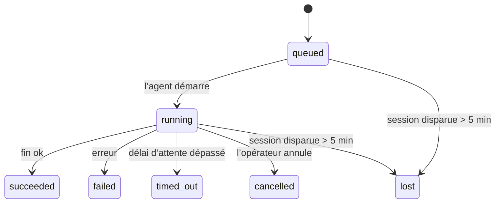

---
read_when:
    - Inspection du travail en arrière-plan en cours ou récemment terminé
    - Débogage des échecs de livraison pour les exécutions d’agent détachées
    - Comprendre comment les exécutions en arrière-plan sont liées aux sessions, à Cron et au Heartbeat
sidebarTitle: Background tasks
summary: Suivi des tâches en arrière-plan pour les exécutions ACP, les sous-agents, les tâches Cron isolées et les opérations CLI
title: Tâches en arrière-plan
x-i18n:
    generated_at: "2026-04-26T11:22:59Z"
    model: gpt-5.4
    provider: openai
    source_hash: 46952a378babdee9f43102bfa71dbd35b6ca7ecb142ffce3785eeb479e19d6b6
    source_path: automation/tasks.md
    workflow: 15
---

<Note>
Vous cherchez la planification ? Consultez [Automation & Tasks](/fr/automation) pour choisir le bon mécanisme. Cette page couvre le **suivi** du travail en arrière-plan, pas sa planification.
</Note>

Les tâches en arrière-plan suivent le travail qui s’exécute **en dehors de votre session de conversation principale** : exécutions ACP, lancements de sous-agents, exécutions isolées de tâches Cron et opérations initiées par la CLI.

Les tâches **ne remplacent pas** les sessions, les tâches Cron ni les Heartbeats — elles constituent le **journal d’activité** qui enregistre quel travail détaché a eu lieu, à quel moment, et s’il a réussi.

<Note>
Toutes les exécutions d’agent ne créent pas une tâche. Les tours Heartbeat et le chat interactif normal n’en créent pas. En revanche, toutes les exécutions Cron, tous les lancements ACP, tous les lancements de sous-agents et toutes les commandes d’agent CLI en créent.
</Note>

## En bref

- Les tâches sont des **enregistrements**, pas des planificateurs — Cron et Heartbeat décident _quand_ le travail s’exécute, les tâches suivent _ce qui s’est passé_.
- ACP, les sous-agents, toutes les tâches Cron et les opérations CLI créent des tâches. Les tours Heartbeat n’en créent pas.
- Chaque tâche passe par `queued → running → terminal` (`succeeded`, `failed`, `timed_out`, `cancelled` ou `lost`).
- Les tâches Cron restent actives tant que le runtime Cron possède encore la tâche ; si l’état du runtime en mémoire a disparu, la maintenance des tâches vérifie d’abord l’historique durable des exécutions Cron avant de marquer une tâche comme `lost`.
- La finalisation est pilotée par push : le travail détaché peut notifier directement ou réveiller la session demandeuse/le Heartbeat lorsqu’il se termine ; les boucles d’interrogation d’état sont donc généralement une mauvaise approche.
- Les exécutions Cron isolées et les finalisations de sous-agents nettoient au mieux les onglets/processus de navigateur suivis pour leur session enfant avant le nettoyage final des métadonnées.
- La livraison Cron isolée supprime les réponses intermédiaires parent obsolètes tant que le travail des sous-agents descendants continue de se vider, et privilégie la sortie finale descendante lorsqu’elle arrive avant la livraison.
- Les notifications de fin sont livrées directement à un canal ou mises en file d’attente pour le prochain Heartbeat.
- `openclaw tasks list` affiche toutes les tâches ; `openclaw tasks audit` met en évidence les problèmes.
- Les enregistrements terminaux sont conservés pendant 7 jours, puis automatiquement supprimés.

## Démarrage rapide

<Tabs>
  <Tab title="Lister et filtrer">
    ```bash
    # Lister toutes les tâches (de la plus récente à la plus ancienne)
    openclaw tasks list

    # Filtrer par runtime ou par statut
    openclaw tasks list --runtime acp
    openclaw tasks list --status running
    ```

  </Tab>
  <Tab title="Inspecter">
    ```bash
    # Afficher les détails d’une tâche spécifique (par ID, ID d’exécution ou clé de session)
    openclaw tasks show <lookup>
    ```
  </Tab>
  <Tab title="Annuler et notifier">
    ```bash
    # Annuler une tâche en cours (tue la session enfant)
    openclaw tasks cancel <lookup>

    # Modifier la politique de notification d’une tâche
    openclaw tasks notify <lookup> state_changes
    ```

  </Tab>
  <Tab title="Audit et maintenance">
    ```bash
    # Exécuter un audit d’état
    openclaw tasks audit

    # Prévisualiser ou appliquer la maintenance
    openclaw tasks maintenance
    openclaw tasks maintenance --apply
    ```

  </Tab>
  <Tab title="Flux des tâches">
    ```bash
    # Inspecter l’état de TaskFlow
    openclaw tasks flow list
    openclaw tasks flow show <lookup>
    openclaw tasks flow cancel <lookup>
    ```
  </Tab>
</Tabs>

## Ce qui crée une tâche

| Source                 | Type de runtime | Moment où un enregistrement de tâche est créé          | Politique de notification par défaut |
| ---------------------- | --------------- | ------------------------------------------------------ | ------------------------------------ |
| Exécutions ACP en arrière-plan | `acp`        | Lancement d’une session ACP enfant                     | `done_only`                          |
| Orchestration de sous-agents | `subagent`   | Lancement d’un sous-agent via `sessions_spawn`         | `done_only`                          |
| Tâches Cron (tous types) | `cron`       | Chaque exécution Cron (session principale et isolée)   | `silent`                             |
| Opérations CLI         | `cli`           | Commandes `openclaw agent` exécutées via la Gateway    | `silent`                             |
| Tâches média d’agent   | `cli`           | Exécutions `video_generate` adossées à une session     | `silent`                             |

<AccordionGroup>
  <Accordion title="Notifications par défaut pour Cron et les médias">
    Les tâches Cron de session principale utilisent par défaut la politique de notification `silent` — elles créent des enregistrements à des fins de suivi, mais ne génèrent pas de notifications. Les tâches Cron isolées utilisent elles aussi `silent` par défaut, mais sont plus visibles parce qu’elles s’exécutent dans leur propre session.

    Les exécutions `video_generate` adossées à une session utilisent également par défaut la politique `silent`. Elles créent tout de même des enregistrements de tâche, mais la finalisation est renvoyée à la session d’agent d’origine sous forme de réveil interne afin que l’agent puisse écrire le message de suivi et joindre lui-même la vidéo terminée. Si vous activez `tools.media.asyncCompletion.directSend`, les finalisations asynchrones de `music_generate` et `video_generate` essaient d’abord une livraison directe au canal avant de revenir au réveil de la session demandeuse.
  </Accordion>
  <Accordion title="Garde-fou contre les exécutions simultanées de video_generate">
    Tant qu’une tâche `video_generate` adossée à une session est encore active, l’outil sert aussi de garde-fou : les appels répétés à `video_generate` dans cette même session renvoient l’état de la tâche active au lieu de démarrer une seconde génération concurrente. Utilisez `action: "status"` si vous voulez une consultation explicite de progression/statut côté agent.
  </Accordion>
  <Accordion title="Ce qui ne crée pas de tâches">
    - Tours Heartbeat — session principale ; voir [Heartbeat](/fr/gateway/heartbeat)
    - Tours de chat interactif normaux
    - Réponses directes à `/command`
  </Accordion>
</AccordionGroup>

## Cycle de vie des tâches



| Statut      | Ce que cela signifie                                                     |
| ----------- | ------------------------------------------------------------------------ |
| `queued`    | Créée, en attente du démarrage de l’agent                                |
| `running`   | Le tour de l’agent est en cours d’exécution                              |
| `succeeded` | Terminée avec succès                                                     |
| `failed`    | Terminée avec une erreur                                                 |
| `timed_out` | A dépassé le délai d’attente configuré                                   |
| `cancelled` | Arrêtée par l’opérateur via `openclaw tasks cancel`                      |
| `lost`      | Le runtime a perdu l’état d’autorité après un délai de grâce de 5 minutes |

Les transitions se produisent automatiquement — lorsque l’exécution d’agent associée se termine, le statut de la tâche est mis à jour en conséquence.

La finalisation de l’exécution d’agent fait autorité pour les enregistrements de tâches actives. Une exécution détachée réussie se termine avec `succeeded`, les erreurs ordinaires d’exécution se terminent avec `failed`, et les issues de délai d’attente ou d’abandon se terminent avec `timed_out`. Si un opérateur a déjà annulé la tâche, ou si le runtime a déjà enregistré un état terminal plus fort comme `failed`, `timed_out` ou `lost`, un signal de réussite ultérieur ne rétrograde pas cet état terminal.

`lost` dépend du runtime :

- Tâches ACP : les métadonnées de la session enfant ACP de référence ont disparu.
- Tâches de sous-agents : la session enfant de référence a disparu du magasin de l’agent cible.
- Tâches Cron : le runtime Cron ne suit plus la tâche comme active et l’historique durable des exécutions Cron ne montre pas de résultat terminal pour cette exécution. L’audit CLI hors ligne ne considère pas son propre état vide du runtime Cron en mémoire comme faisant autorité.
- Tâches CLI : les tâches isolées avec session enfant utilisent la session enfant ; les tâches CLI adossées au chat utilisent à la place le contexte d’exécution actif, de sorte que des lignes persistantes de session de canal/groupe/direct n’empêchent pas leur finalisation. Les exécutions `openclaw agent` adossées à la Gateway se finalisent aussi à partir de leur résultat d’exécution, afin que les exécutions terminées ne restent pas actives jusqu’à ce que le balayage les marque `lost`.

## Livraison et notifications

Quand une tâche atteint un état terminal, OpenClaw vous notifie. Il existe deux chemins de livraison :

**Livraison directe** — si la tâche a une cible de canal (le `requesterOrigin`), le message de fin est envoyé directement à ce canal (Telegram, Discord, Slack, etc.). Pour les finalisations de sous-agents, OpenClaw préserve aussi le routage lié de fil/topic lorsqu’il est disponible et peut compléter un `to` / compte manquant à partir de la route stockée de la session demandeuse (`lastChannel` / `lastTo` / `lastAccountId`) avant d’abandonner la livraison directe.

**Livraison mise en file d’attente dans la session** — si la livraison directe échoue ou qu’aucune origine n’est définie, la mise à jour est mise en file d’attente comme événement système dans la session du demandeur et apparaît au prochain Heartbeat.

<Tip>
La finalisation d’une tâche déclenche un réveil Heartbeat immédiat afin que vous voyiez rapidement le résultat — vous n’avez pas à attendre le prochain tick Heartbeat planifié.
</Tip>

Cela signifie que le flux habituel repose sur le push : démarrez le travail détaché une fois, puis laissez le runtime vous réveiller ou vous notifier lorsqu’il se termine. N’interrogez l’état des tâches que lorsque vous avez besoin de débogage, d’intervention ou d’un audit explicite.

### Politiques de notification

Contrôlez à quel point vous êtes notifié pour chaque tâche :

| Politique              | Ce qui est livré                                                         |
| ---------------------- | ------------------------------------------------------------------------ |
| `done_only` (par défaut) | Seulement l’état terminal (`succeeded`, `failed`, etc.) — **c’est la valeur par défaut** |
| `state_changes`       | Chaque transition d’état et chaque mise à jour de progression            |
| `silent`              | Rien du tout                                                             |

Modifiez la politique pendant l’exécution d’une tâche :

```bash
openclaw tasks notify <lookup> state_changes
```

## Référence CLI

<AccordionGroup>
  <Accordion title="tasks list">
    ```bash
    openclaw tasks list [--runtime <acp|subagent|cron|cli>] [--status <status>] [--json]
    ```

    Colonnes de sortie : ID de tâche, Type, Statut, Livraison, ID d’exécution, Session enfant, Résumé.

  </Accordion>
  <Accordion title="tasks show">
    ```bash
    openclaw tasks show <lookup>
    ```

    Le jeton de recherche accepte un ID de tâche, un ID d’exécution ou une clé de session. Affiche l’enregistrement complet, y compris le timing, l’état de livraison, l’erreur et le résumé terminal.

  </Accordion>
  <Accordion title="tasks cancel">
    ```bash
    openclaw tasks cancel <lookup>
    ```

    Pour les tâches ACP et de sous-agents, cela tue la session enfant. Pour les tâches suivies par la CLI, l’annulation est enregistrée dans le registre des tâches (il n’existe pas de handle de runtime enfant distinct). Le statut passe à `cancelled` et une notification de livraison est envoyée le cas échéant.

  </Accordion>
  <Accordion title="tasks notify">
    ```bash
    openclaw tasks notify <lookup> <done_only|state_changes|silent>
    ```
  </Accordion>
  <Accordion title="tasks audit">
    ```bash
    openclaw tasks audit [--json]
    ```

    Fait ressortir les problèmes opérationnels. Les constats apparaissent aussi dans `openclaw status` lorsque des problèmes sont détectés.

    | Constat                   | Gravité   | Déclencheur                                                                                                  |
    | ------------------------- | --------- | ------------------------------------------------------------------------------------------------------------ |
    | `stale_queued`            | warn      | En file d’attente depuis plus de 10 minutes                                                                  |
    | `stale_running`           | error     | En cours d’exécution depuis plus de 30 minutes                                                               |
    | `lost`                    | warn/error | L’état de possession de la tâche adossé au runtime a disparu ; les tâches perdues conservées restent en avertissement jusqu’à `cleanupAfter`, puis deviennent des erreurs |
    | `delivery_failed`         | warn      | La livraison a échoué et la politique de notification n’est pas `silent`                                     |
    | `missing_cleanup`         | warn      | Tâche terminale sans horodatage de nettoyage                                                                 |
    | `inconsistent_timestamps` | warn      | Violation de chronologie (par exemple fin avant le début)                                                    |

  </Accordion>
  <Accordion title="tasks maintenance">
    ```bash
    openclaw tasks maintenance [--json]
    openclaw tasks maintenance --apply [--json]
    ```

    Utilisez cette commande pour prévisualiser ou appliquer le rapprochement, l’horodatage de nettoyage et la suppression pour les tâches et l’état du flux de tâches.

    Le rapprochement dépend du runtime :

    - Les tâches ACP/sous-agents vérifient leur session enfant de référence.
    - Les tâches Cron vérifient si le runtime Cron possède encore la tâche, puis récupèrent l’état terminal à partir des journaux d’exécution Cron persistés/de l’état des tâches avant de revenir à `lost`. Seul le processus Gateway fait autorité pour l’ensemble en mémoire des tâches Cron actives ; l’audit CLI hors ligne utilise l’historique durable, mais ne marque pas une tâche Cron comme `lost` uniquement parce que cet ensemble local est vide.
    - Les tâches CLI adossées au chat vérifient le contexte d’exécution actif propriétaire, pas seulement la ligne de session de chat.

    Le nettoyage à la fin dépend lui aussi du runtime :

    - La finalisation d’un sous-agent ferme au mieux les onglets/processus de navigateur suivis pour la session enfant avant que l’annonce de nettoyage continue.
    - La finalisation d’une exécution Cron isolée ferme au mieux les onglets/processus de navigateur suivis pour la session Cron avant que l’exécution soit entièrement démontée.
    - La livraison d’une exécution Cron isolée attend si nécessaire le suivi des sous-agents descendants et supprime le texte obsolète d’accusé de réception parent au lieu de l’annoncer.
    - La livraison de finalisation d’un sous-agent privilégie le texte assistant visible le plus récent ; si celui-ci est vide, elle revient au texte le plus récent nettoyé de `tool`/`toolResult`, et les exécutions limitées à des appels d’outil en timeout peuvent être réduites à un court résumé de progression partielle. Les exécutions terminales en échec annoncent l’état d’échec sans rejouer le texte de réponse capturé.
    - Les échecs de nettoyage ne masquent pas le véritable résultat de la tâche.

  </Accordion>
  <Accordion title="tasks flow list | show | cancel">
    ```bash
    openclaw tasks flow list [--status <status>] [--json]
    openclaw tasks flow show <lookup> [--json]
    openclaw tasks flow cancel <lookup>
    ```

    Utilisez ces commandes lorsque c’est le flux de tâches orchestrateur qui vous intéresse plutôt qu’un enregistrement individuel de tâche en arrière-plan.

  </Accordion>
</AccordionGroup>

## Tableau des tâches du chat (`/tasks`)

Utilisez `/tasks` dans n’importe quelle session de chat pour voir les tâches en arrière-plan liées à cette session. Le tableau affiche les tâches actives et récemment terminées avec le runtime, le statut, le timing et les détails de progression ou d’erreur.

Lorsque la session courante n’a aucune tâche liée visible, `/tasks` revient aux comptes de tâches locaux à l’agent afin que vous obteniez tout de même une vue d’ensemble sans divulguer les détails d’autres sessions.

Pour le journal opérateur complet, utilisez la CLI : `openclaw tasks list`.

## Intégration à l’état (pression des tâches)

`openclaw status` inclut un résumé des tâches visible en un coup d’œil :

```
Tasks: 3 queued · 2 running · 1 issues
```

Le résumé rapporte :

- **active** — nombre de `queued` + `running`
- **failures** — nombre de `failed` + `timed_out` + `lost`
- **byRuntime** — ventilation par `acp`, `subagent`, `cron`, `cli`

`/status` comme l’outil `session_status` utilisent un instantané des tâches sensible au nettoyage : les tâches actives sont prioritaires, les lignes terminées obsolètes sont masquées, et les échecs récents n’apparaissent que lorsqu’aucun travail actif ne subsiste. Cela permet à la carte d’état de rester centrée sur ce qui compte à l’instant présent.

## Stockage et maintenance

### Emplacement des tâches

Les enregistrements de tâches sont conservés dans SQLite à l’emplacement suivant :

```
$OPENCLAW_STATE_DIR/tasks/runs.sqlite
```

Le registre est chargé en mémoire au démarrage de la Gateway et synchronise les écritures vers SQLite pour assurer la durabilité entre les redémarrages.

### Maintenance automatique

Un balayage s’exécute toutes les **60 secondes** et gère trois éléments :

<Steps>
  <Step title="Rapprochement">
    Vérifie si les tâches actives ont encore un état de référence faisant autorité côté runtime. Les tâches ACP/sous-agents utilisent l’état de la session enfant, les tâches Cron utilisent la possession de tâche active, et les tâches CLI adossées au chat utilisent le contexte d’exécution propriétaire. Si cet état de référence a disparu depuis plus de 5 minutes, la tâche est marquée `lost`.
  </Step>
  <Step title="Horodatage de nettoyage">
    Définit un horodatage `cleanupAfter` sur les tâches terminales (`endedAt + 7 days`). Pendant la période de rétention, les tâches perdues apparaissent toujours dans l’audit comme avertissements ; après expiration de `cleanupAfter` ou lorsque les métadonnées de nettoyage sont absentes, elles deviennent des erreurs.
  </Step>
  <Step title="Suppression">
    Supprime les enregistrements ayant dépassé leur date `cleanupAfter`.
  </Step>
</Steps>

<Note>
**Rétention :** les enregistrements de tâches terminales sont conservés pendant **7 jours**, puis automatiquement supprimés. Aucune configuration n’est nécessaire.
</Note>

## Comment les tâches sont liées aux autres systèmes

<AccordionGroup>
  <Accordion title="Tâches et Task Flow">
    [Task Flow](/fr/automation/taskflow) est la couche d’orchestration de flux située au-dessus des tâches en arrière-plan. Un même flux peut coordonner plusieurs tâches au cours de son cycle de vie à l’aide de modes de synchronisation gérés ou miroirs. Utilisez `openclaw tasks` pour inspecter les enregistrements individuels de tâches et `openclaw tasks flow` pour inspecter le flux orchestrateur.

    Voir [Task Flow](/fr/automation/taskflow) pour plus de détails.

  </Accordion>
  <Accordion title="Tâches et Cron">
    Une **définition** de tâche Cron se trouve dans `~/.openclaw/cron/jobs.json` ; l’état d’exécution runtime se trouve à côté dans `~/.openclaw/cron/jobs-state.json`. **Chaque** exécution Cron crée un enregistrement de tâche — session principale comme session isolée. Les tâches Cron de session principale utilisent par défaut la politique de notification `silent`, de sorte qu’elles assurent le suivi sans générer de notifications.

    Voir [Cron Jobs](/fr/automation/cron-jobs).

  </Accordion>
  <Accordion title="Tâches et Heartbeat">
    Les exécutions Heartbeat sont des tours de session principale — elles ne créent pas d’enregistrements de tâche. Lorsqu’une tâche se termine, elle peut déclencher un réveil Heartbeat afin que vous voyiez rapidement le résultat.

    Voir [Heartbeat](/fr/gateway/heartbeat).

  </Accordion>
  <Accordion title="Tâches et sessions">
    Une tâche peut référencer une `childSessionKey` (où le travail s’exécute) et une `requesterSessionKey` (qui l’a démarrée). Les sessions constituent le contexte de conversation ; les tâches ajoutent une couche de suivi d’activité par-dessus.
  </Accordion>
  <Accordion title="Tâches et exécutions d’agent">
    Le `runId` d’une tâche pointe vers l’exécution d’agent qui effectue le travail. Les événements du cycle de vie de l’agent (démarrage, fin, erreur) mettent automatiquement à jour le statut de la tâche — vous n’avez pas besoin de gérer le cycle de vie manuellement.
  </Accordion>
</AccordionGroup>

## Voir aussi

- [Automation & Tasks](/fr/automation) — aperçu de tous les mécanismes d’automatisation
- [CLI: Tasks](/fr/cli/tasks) — référence des commandes CLI
- [Heartbeat](/fr/gateway/heartbeat) — tours périodiques de session principale
- [Scheduled Tasks](/fr/automation/cron-jobs) — planification du travail en arrière-plan
- [Task Flow](/fr/automation/taskflow) — orchestration de flux au-dessus des tâches
